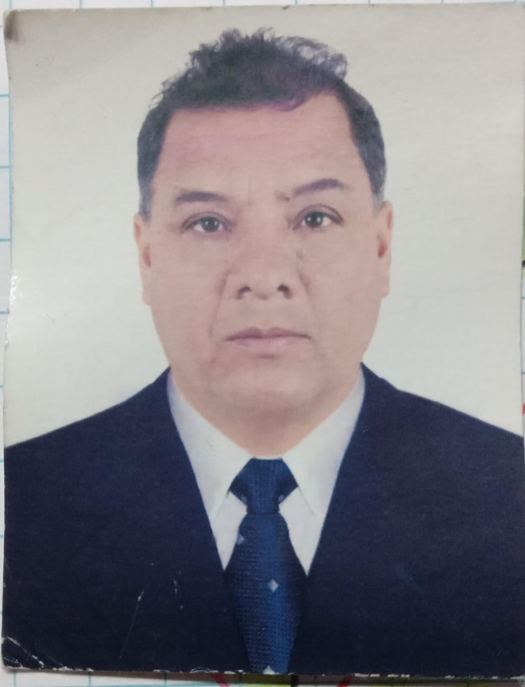

<body>
    <strong>
        

            Universidad Peruana de Ciencias Aplicadas - Ingeniería de Software 
            </img>
             SI730 - Aplicaciones Web Sánchez Ponce, Alex Humberto 
             Informe de Trabajo Final 
            Startup: YaraSoftware Producto: Workshop N-GINE
        

    </strong>
    

        <h3 align="center">Team Members:</h3>
        <table align="center">
            <tr>
                <th style="text-align:center;">Estudiante</th>
                <th style="text-align:center;">Código</th>
            </tr>
            <tr>
                <td>Gutiérrez Soto, Jhosepmyr Orlando</td>
                <td>202317638</td>
            </tr>
            <tr>
                <td>Hernández Tuiro, Eric Ernesto</td>
                <td>20221C857</td>
            </tr>
            <tr>
                <td>Orozco Torres, Álvaro Joaquín</td>
                <td>202220783</td>
            </tr>
            <tr>
                <td>Reaño Delgadillo, Henry Paolo</td>
                <td>20221e247</td>
            </tr>
            <tr>
                <td>Riva Rodríguez, Elmer Augusto</td>
                <td>202220829</td>
            </tr>
        </table>
    

    
Agosto 2024

</body>

# Registro de Versiones del Informe
| Versión | Fecha | Autor | Descripción de la modificación |
| ----------- | ----------- | ----------- | ----------- |
| 0.0.0 | 20/08/2024 | Álvaro Orozco Torres | Se agrega la carátula y la tabla de control de versiones |
| 1.0.0 | 01/09/2024 | Henry Reaño Delgadillo | Se agrega la primera sección del Capítulo I: Introducción |
| 1.1.0 | 01/09/2024 | Álvaro Orozco Torres | Se agrega la segunda y tercera sección del Capítulo I: Introducción Se agrega la bibliografía |
| 2.0.0 | 01/09/2024 | Álvaro Orozco Torres | Se agrega la primera y segunda sección del Capitulo II: Requirements Elicitation & Analysis |
| 2.1.0 | 01/09/2024 | Henry Reaño Delgadillo | Se agrega más apartados a la segunda sección del Capítulo II: Requirements Elicitation & Analysis |
| 2.2.0 | 02/09/2024 | Álvaro Orozco Torres | Se agrega más apartados a la segunda sección del Capítulo II: Requirements Elicitation & Analysis |
| 2.2.1 | 02/09/2024 | Álvaro Orozco Torres | Se corrige el formato de presentación de el As-Is Scenario Mapping |
| 2.2.2 | 02/09/2024 | Álvaro Orozco Torres | Se añade descripción de proceso para As-Is Scenario Mapping |
| 2.2.3 | 02/09/2024 | Henry Reaño Delgadillo | Se agrega el link de las entrevistas de Needfinding en la sección Anexos |
| 2.2.4 | 02/09/2024 | Henry Reaño Delgadillo | Se corrige la visualización de los artefactos As-Is para todos los segmentos objetivo y se agrega la foto del dueño de taller Enrique Reaño|
| 2.2.5 | 03/09/2024 | Henry Reaño Delgadillo | Se agrega tres nuevos conceptos en Ubiquitous Language |

# Project Collaboration Insights

# Contenido

[Capítulo I: Introducción](#capítulo-i-introducción)

[1.1. Startup Profile](#11-startup-profile)

[1.1.1. Descripción de la Startup](#111-descripción-de-la-startup)

[1.1.2. Perfiles de los integrantes del equipo](#112-perfiles-de-los-integrantes-del-equipo)

[1.2. Solution Profile](#12-solution-profile)

[1.2.1. Antecedentes y problemática](#121-antecedentes-y-problematica)

[1.2.2. Lean UX Process](#122-lean-ux-process)

[1.2.2.1. Lean UX Problem Statements](#1221-lean-ux-problem-statements)

[1.2.2.2. Lean UX Assumptions](#1222-lean-ux-assumptions)

[1.2.2.3. Lean UX Hypothesis](#1223-lean-ux-hypothesis)

[1.2.2.4. Lean UX Canvas](#1224-lean-ux-canvas)

[1.3. Segmentos objetivo](#13-segmentos-objetivo)

[Capítulo II: Requirements Elicitation & Analysis](#capítulo-ii-requirements-elicitation--analysis)

[2.1. Competidores](#21-competidores)

[2.1.1. Análisis competitivo](#211-análisis-competitivo)

[2.1.2. Estrategias y tácticas frente a competidores](#212-estrategias-y-tacticas-frente-a-competidores)

[2.2. Entrevistas](#22-entrevistas)

[2.2.1. Diseño de entrevistas](#221-diseño-de-entrevistas)

[2.2.2. Registro de entrevistas](#222-registro-de-entrevistas)

[2.2.3. Análisis de entrevistas](#223-análisis-de-entrevistas)

[2.3. Needfinding](#23-needfinding)

[2.3.1. User Personas](#231-user-personas)

[2.3.2. User Task Matrix](#232-user-task-matrix)

[2.3.3. User Journey Mapping](#233-user-journey-mapping)

[2.3.4. Empathy Mapping](#234-empathy-mapping)

[2.3.5. As-is Scenario Mapping](#235-as-is-scenario-mapping)

[2.4. Ubiquitous Language](#24-ubiquitous-language)

[Capítulo IV: Product Design](#capítulo-iv-product-design)

[4.1. Style Guidelines](#41-style-guidelines)

[4.1.1. General Style Guidelines](#411-general-style-guidelines)

[4.1.2. Web Style Guidelines](#412-web-style-guidelines)

[Bibliografía](#bibliografía)

[Anexos](#anexos)

# Student Outcome

**ABET – EAC - Student Outcome 5:** La capacidad de funcionar efectivamente en un equipo cuyos miembros juntos proporcionan liderazgo, crean un entorno de colaboración e inclusivo, establecen objetivos, planifican tareas y cumplen objetivos.

| Criterio Especifico | Acciones Realizadas | Conclusiones |
| - | - | - |
| Trabaja en equipo para proporcionar liderazgo en forma conjunta | Jhosepmyr:   Eric:   Álvaro:   Henry:   Elmer:   | [Redaccion] |
| Crea un entorno colaborativo e inclusivo, establece metas, planifica tareas y cumple objetivos. | Jhosepmyr:   Eric:   Álvaro:   Henry:   Elmer:   | [Redaccion] |

# Capítulo I: Introducción

## 1.1. Startup Profile

### 1.1.1. Descripción de la Startup
Yara Software es una startup conformada por jóvenes estudiantes de la carrera de Ingeniería de Software cuyo objetivo es la creación de productos de software personalizados que optimizan y transforman procesos en sectores laborales que a menudo se pasan por alto en la digitalización.

**Misión:** Nuestra misión es impulsar desarrollo tecnológico a diversos sectores de la industria, favoreciendo el crecimiento económico a través de soluciones de software innovadoras, accesibles y adaptadas a las necesidades de sus usuarios. A través del compromiso con la calidad, la eficiencia y la experiencia de usuario, garantizamos el éxito de nuestros proyectos y favorecemos la integración y adopción de la tecnología en el mundo actual de constante cambio.

**Visión:** Como Startup, aspiramos a ser reconocidos a nivel nacional por nuestro fuerte compromiso con la calidad y la excelencia, alcanzando afianzar a más de 10,000 usuarios a nivel nacional en los próximos cuatro años, posicionándonos como un referente en cuanto a desarrollo tecnológico e innovación en el país.

### 1.1.2. Perfiles de los integrantes del equipo 

| Foto del participante | Nombres y apellidos | Código de estudiante | Carrera | Conocimientos técnicos y habilidades |
| - | - | - | - | - |
|  </img> | Jhosepmyr Orlando Gutiérrez Soto | 202317638 | Ingeniería de Software | Experiencia en desarrollo frontend y backend. Conocimiento alto en BlockChain. Determinación y seguridad en los trabajos en equipo |
|  </img> | Eric Ernesto Hernández Tuiro | 20221C857 | Ingeniería de Software | Programación en C++ y Python. Resolución de problemas y resiliencia ante situaciones de presión. | 
|  </img> | Álvaro Joaquín Orozco Torres | 202220783 | Ingeniería de Software | Diseño inclusivo, lineamientos de accesibilidad y programación en JavaScript y Python. Capacidad de análisis y resolución de problemas. | 
|  </img> | Henry Paolo Reaño Delgadillo | 20221e247 | Ingeniería de Software | Programación en C++ y Javascript. Conocimiento intermedio sobre patrones de software. Capacidad alta para trabajar en equipo. | 
|  </img> | Elmer Augusto Riva Rodríguez | 202220829 | Ingeniería de Software | Diseño de experiencias de usuario y programación con C++ y Python. Competente en la gestión de proyectos grupales. | 

## 1.2. Solution Profile

### 1.2.1. Antecedentes y problemática

***What?***

La baja rentabilidad, retención y fidelización de clientes.

***Why?***

Porque los talleres mecánicos se enfocan únicamente en la eficiencia del servicio.

***Who?***

A dueños de talleres de mecánica automotriz.

***When?***

En la actualidad, de manera continua a lo largo del tiempo.

***Where?***

En el Perú, principalmente en la ciudad de Lima.

***How?***

Se mide a través del flujo de caja en talleres mecánicos y su ganancia media mensual.

***How much?***

A la gran mayoría de talleres, sobre todo, los más informales.

### 1.2.2. Lean UX Process

#### 1.2.2.1 Lean UX Problem Statements

En la actualidad, el sector de la mecánica automotriz se enfoca principalmente en la eficiencia del servicio a clientes esporádicos con necesidades correctivas. Sin embargo, no aborda la importancia de fidelizar clientes, generar un flujo constante de ingresos y ofrecer información clave sobre el estado del servicio de forma efectiva.

Nuestro producto busca resolver estos problemas mediante funcionalidades de gestión de personal, almacenamiento de información sobre clientes, control de inventario y un sistema de salud vehcular. Para ello, inicialmente, nos enfocaremos en los dueños de talleres automotrices. 

El problema se considerará resuelto cuando los dueños de talleres automotrices puedan administrar eficazmente y atender a un flujo constante de clientes fidelizados.

#### 1.2.2.2. Lean UX Assumptions

***Business Outcomes***
+ Llegar a 2500 usuarios en un año
+ Tener un índice de retención de usuarios del 90%
+ El 20% de nuestros clientes use la suscripción premium

***Users***

**Roberto García - Dueño de taller mecánico**

Objetivos:
+ Ofrecer un servicio eficiente para fidelizar a sus clientes.
+ Controlar mejor los recursos para reducir costos operativos.
+ Mejorar la satisfacción del cliente para aumentar las referencias y reseñas positivas.

Obstáculos:
+ Falta de tiempo para gestionar todos los aspectos del negocio de manera eficiente.
+ Dificultad para implementar nuevas tecnologías
+ Competencia creciente de talleres más grandes y mejor equipados.
+ Incertidumbre en la gestión del inventario lo que puede resultar en repuestos faltantes.

**Juan Pérez - Mecánico**

Objetivos:
+ Realizar su trabajo de manera eficiente.
+ Conocer el estado del vehículo para determinar cómo repararlo.
+ Minimizar el tiempo perdido en la búsqueda de respuestos.

Obstáculos:
+ Falta o dificultad de acceso información sobre el estado del vehículo.
+ Desorganización en el taller, lo que lleva a malentendidos y demoras.
+ Presión para realizar su trabajo rápido.

**María López - Cliente de taller**

Objetivos:
+ Mantener su vehículo en buen estado para evitar problemas inesperados.
+ Recibir un servicio rápido y confiable, sin tener que esperar mucho tiempo.
+ Ahorrar dinero en reparaciones costosas mediante un mantenimiento preventivo efectivo.
+ Sentirse informada y segura sobre el estado de su vehículo y las reparaciones necesarias.

Obstáculos:
+ Tiempo limitado para dejar su coche en el taller, ya que depende de él para su trabajo.
+ Falta de conocimiento técnico, ya que teme que le cobren por reparaciones innecesarias.
+ Incertidumbre sobre la disponibilidad del taller, lo que a veces la lleva a cambiar de lugar si no recibe atención rápida.

***User Outcomes***

**Roberto García - Dueño de taller mecánico**
+ Aumentar la cantidad de clientes atendidos por día
+ Ahorrar tiempo en control de recursos de taller
+ Aumentar la rentabilidad y retención de clientes

**Juan Pérez - Mecánico**
+ Lograr ser más eficiente en el trabajo

**María López - Cliente de taller**
+ Ahorrar en reparaciones de su vehículo
+ Sentirse más satisfechos con el servicio

***Solutions***
+ Sistema de gestión de horarios
+ Historial de vehículos
+ Gestión de inventario
+ Base de datos de clientes
+ Sistema de salud vehicular
+ Sistema de aforo de taller

#### 1.2.2.3. Lean UX Hypothesis
+ Creemos que lograremos llegar a 2500 usuarios en un año si los dueños de talleres logran aumentar la cantidad de clientes atendidos por día mediante el sistema de gestión de horarios
+ Creemos que lograremos tener índice de retención de clientes del 90% si los mecanicos logran ser más eficientes en su trabajo mediante la consulta de historial de vehículos
+ Creemos que lograremos tener índice de retención de clientes del 90% si los dueños de talleres logran ahorrar tiempo en control de recursos de taller mediante sistema de gestión de inventario
+ Creemos que lograremos el 20% de nuestros clientes use la suscripción premium si los dueños de talleres logran aumentar la rentabilidad y retención de clientes mediante base de datos de clientes y venta del acceso a sistema de salud vehicular
+ Creemos que lograremos el 20% de nuestros clientes use la suscripción premium si clientes de taller logran ahorrar en reparaciones de su vehículo mediante sistema de salud vehicular
+ Creemos que lograremos el 20% de nuestros clientes use la suscripción premium si clientes de taller logran sentirse más satisfechos con el servicio mediante sistema de aforo del taller

#### 1.2.2.4. Lean UX Canvas

## 1.3. Segmentos objetivo

***Dueños de taller***

Según un informe de Zippia (2022), en Estados Unidos, el 95.7% de los dueños de taller son hombres y, aunque la edad puede variar según la etnicidad, generalmente se aproxima a los 43 años. Además, el mismo estudio señala que aproximadamente el 42% de los dueños de taller poseen un grado de educación secundaria mientras que el 24% posee un grado técnico superior.

+ Género: Masculino

+ Edad: 43 años

+ Grado de instrucción: Educación secundaria

***Mecánicos***

Según un informe de Zippia (2022), en Estados Unidos, el 96.4% de los mecánicos son hombres y, aunque la edad puede variar según la etnicidad, generalmente se aproxima a los 40 años. Además, el mismo estudio señala que aproximadamente el 47% de los mecánicos poseen un grado de educación secundaria.

+ Género: Masculino

+ Edad: 40 años

+ Grado de instrucción: Educación secundaria

***Clientes de taller***

De acuerdo con datos de MarketWatch (2024), en Estados Unidos, el 49.5% de los vehículos están en manos de hombres. A pesar de esto, son ellos quienes pasan más tiempo al volante y recorren mayores distancias. La mayoría de estos conductores tiene alrededor de 30 años.

+ Género: Masculino

+ Edad: 30 años

# Capítulo II: Requirements Elicitation & Analysis

## 2.1. Competidores

### 2.1.1. Análisis competitivo

<table>
    <tr>
        <th colspan="6">Competitive Analysis Landscape</th>
    </tr>
    <tr>
        <td colspan="2" rowspan="2">Competitive Analysis Landscape</td>
        <td colspan="4">Escriba en el recuadro la pregunta que busca responder o el objetivo de este análisis.</td>
    </tr>
    <tr>
        <td colspan="4">El objetivo de este análisis es evaluar el estado actual del mercado de software, identificando el alcance y las características de las soluciones existentes. Esto nos permitirá definir una propuesta de valor única y desarrollar una identidad distintiva para nuestro producto, asegurando que se diferencie claramente en el mercado y satisfaga necesidades no plenamente abordadas por la competencia.</td>
    </tr>
    <tr>
        <td colspan="2">(En la cabecera colocar por cada competidor nombre y logo)</td>
        <th scope="col">Workshop N-GINE</th>
        <th scope="col">Autodata</th>
        <th scope="col">ServitechApp</th>
        <th scope="col">AutoSoft Taller</th>
    </tr>
    <tr>
        <th scope="row" rowspan="2">Perfil</th>
        <th scope="row">Overview</th>
        <td>Workshop N-GINE es una solución integral que transforma los talleres automotrices mediante tecnología avanzada, enfocándose en la optimización, la eficiencia y la satisfacción del cliente</td>
        <td>Desarrollado por expertos en automoción que comprenden las complejidades del servicio, el mantenimiento, el diagnóstico y la reparación de vehículos. Reduzca los errores y agilice los trabajos</td>
        <td>ServitechApp te permite crear ordenes de trabajo y presupuestos, gestionar la venta de productos, administrar tus clientes y llevar fácilmente el control de tu taller. ¡Puedes personalizarlo en 5 minutos!</td>
        <td>Nuestra innovadora solución combina tecnología de vanguardia y conocimiento especializado para ofrecerte una experiencia sin igual en tu taller automotriz. Ya sea que necesites optimizar la gestión del taller, realizar diagnósticos precisos, recibir asistencia técnica experta, administrar ciclos de mantenimiento, seleccionar las partes adecuadas, encontrar soluciones a problemas o elaborar presupuestos precisos, nuestro asistente de IA está aquí para ayudarte en cada paso del camino</td>
    </tr>
    <tr>
        <th scope="row">Ventaja competitiva ¿Qué valor ofrece a los clientes?</th>
        <td>Foco principal en la optimización de procesos y en la satisfacción de los clientes</td>
        <td>Acceso a documentación de una amplia gama de vehículos, lo que facilita el diagnóstico y reparación de estos</td>
        <td>Alto nivel de personalización e integración con múltiples herramientas multidispositivo, lo que favorece su adopción</td>
        <td>Incorporación de una inteligencia artificial que brinda asistencia personalizada a los usuarios, lo que complementa los diagnósticos de los mecánicos</td>
    </tr>
    <tr>
        <th scope="row" rowspan="2">Perfil de Marketing</th>
        <th scope="row">Mercado Objetivo</th>
        <td>Talleres de mecánica automotriz pequeños y medianos</td>
        <td>Grandes empresas de mecánica y electrónica automotriz</td>
        <td>Talleres de mecánica automotriz y mecánica industrial</td>
        <td>Talleres de mecánica automotriz</td>
    </tr>
    <tr>
        <th scope="row">Estrategias de Marketing</th>
        <td>Prueba gratuita de 30 días</td>
        <td>Prueba sin compromiso del producto por S/5.00</td>
        <td>Prueba sin compromiso del producto gratuita</td>
        <td>Prueba por tiempo limitado de las funcionalidades de inteligencia artificial de forma gratuita</td>
    </tr>
    <tr>
        <th scope="row" rowspan="3">Perfil de Producto</th>
        <th scope="row">Productos y Servicios</th>
        <td>Workshop N-GINE - Regular Workshop N-GINE - Premium Atención al cliente</td>
        <td>Autodata para motos - Motorcycles Autodata para autos y furgonetas - Service & Maintenance Autodata para autos y furgonetas - Diagnostic & Repair Atención al cliente</td>
        <td>ServitechApp - Personal ServitechApp - Plus ServitechApp - Pro Atención al cliente</td>
        <td>AutoSoft Taller - Básico AutoSoft Taller - Profesional Asistente Inteligente (IA) Atención al cliente</td>
    </tr>
    <tr>
        <th scope="row">Precios y costos</th>
        <td>S/59.99 PEN al mes S/99.99 PEN al mes o S/1099.99 PEN al año</td>
        <td>S/86.00 PEN al mes S/172.00 PEN al mes S/310.00 PEN al mes</td>
        <td>$/49.99 USD pago único $/99.99 USD pago único $/159.99 USD pago único</td>
        <td>Desde $/15.99 hasta 44.99 USD al mes o desde $/168.99 hasta 494.99 USD al añoe Desde $/30.99 hasta 99.99 USD al mes o $/336.99 hasta 1,098.99 USD al año $/9.99 al mes</td>
    </tr>
    <tr>
        <th scope="row">Canales de distribución (Web y/o Móvil)</th>
        <td>Página web oficial del producto</td>
        <td>Página web oficial del producto Distribuidores autorizados adicionales</td>
        <td>Página web oficial del producto</td>
        <td>Página web oficial del producto</td>
    </tr>
    <tr>
        <th scope="row" rowspan="5">Análisis SWOT</th>
        <td colspan="5">Realice esto para su startup y sus competidores. Sus fortalezas deberían apoyar sus oportunidades y contribuir a lo que ustedes definen como su posible ventaja competitiva.</td>
    </tr>
    <tr>
        <th scope="row">Fortalezas</th>
        <td>Ecosistema integral de herramientas de optimización de procesos Enfoque en la satisfacción del cliente Aprovechamiento de la tecnología IoT para expandir el alcance y funcionalidades del producto</td>
        <td>Ofrece una amplia gama de información especializada en conjunto con el producto Cuenta con múltiples canales de distribución</td>
        <td>Facilidad de uso y de adopción Acceso al código fuente, lo que permite modificar el programa a las necesidades específicas de cada cliente Modelo de pago único, volviéndose una opción rentable a largo plazo</td>
        <td>Incorporación de una inteligencia artificial que brinda asistencia personalizada a los usuarios, lo que complementa los diagnósticos de los mecánicos. Variedad de opciones de suscripción y modelos de pago, lo que permite adaptarse a diferentes tamaños de talleres.</td>
    </tr>
    <tr>
        <th scope="row">Debilidades</th>
        <td>Startup reciente, lo que puede generar desconfianza por parte de los consumidores Valor agregado dependiente a la suscripción premium</td>
        <td>Modelo de suscripción con pocas opciones disponibles</td>
        <td>Dependencia de un solo canal de distribución</td>
        <td>El costo elevado de las suscripciones puede ser prohibitivo para talleres más pequeños.</td>
    </tr>
    <tr>
        <th scope="row">Oportunidades</th>
        <td>Expansión en mercados emergentes Alianzas estratégicas con fabricantes de autos y distribuidores para mejorar el alcance y la calidad del servicio</td>
        <td>Control de información especializada mediante alianzas estratégicas con fabricantes de autos</td>
        <td>Expansión a desarrollo de software altamente especializado Creación de comunidades de desarrollo que compartan modificaciones del software</td>
        <td>Integración con más herramientas de diagnóstico y gestión automotriz para expandir su funcionalidad.</td>
    </tr>
    <tr>
        <th scope="row">Amenazas</th>
        <td>Competencia creciente en el mercado de software automotriz Resistencia al cambio de parte de talleres tradicionales que prefieren métodos convencionales</td>
        <td>Mercado objetivo limitado, dado que el producto apunta concretamente a grandes empresas de mecánica automotriz</td>
        <td>Poco valor agregado ofrecido directamente por parte de la empresa</td>
        <td>La competencia podría desarrollar funcionalidades similares de IA, socavando por completo su ventaja competitiva.</td>
    </tr>
</table>

### 2.1.2. Estrategias y tácticas frente a competidores

***Fortalecimiento de la Confianza del Consumidor***

Estrategia: Mitigar la desconfianza asociada a ser una startup reciente mediante la construcción de una sólida reputación y demostrando el valor del producto desde el principio.

Tácticas:
+ Implementar un programa de testimonios y estudios de caso con talleres que ya hayan obtenido resultados positivos utilizando Workshop N-GINE.
+ Ofrecer una garantía de satisfacción o un período de devolución de dinero para disminuir el riesgo percibido por nuevos clientes.
+ Participar en ferias y eventos del sector automotriz para fortalecer la presencia de la marca y generar confianza.

***Expansión de Funcionalidades Basadas en IoT y Automatización***

Estrategia: Aprovechar la tecnología IoT y la automatización para ofrecer funcionalidades únicas que mejoren la eficiencia operativa de los talleres.

Tácticas:
+ Desarrollar e integrar sensores y dispositivos IoT para monitorear en tiempo real el estado de los vehículos y los recursos del taller.
+ Incorporar funciones de mantenimiento predictivo que alerten a los talleres sobre posibles problemas antes de que ocurran, optimizando así la eficiencia.
+ Promover estas innovaciones como diferenciadores clave en la comunicación de marketing, destacando el valor de la tecnología avanzada para los talleres.

***Enfoque en la Expansión y Alianzas Estratégicas***

Estrategia: Expandir el mercado objetivo a través de alianzas estratégicas con distribuidores para mejorar el alcance y la calidad del servicio.

Tácticas:
+ Explorar oportunidades en mercados emergentes donde la penetración de software de gestión de talleres es baja, ofreciendo precios competitivos y soporte local.
+ Crear programas de co-marketing con proveedores de piezas de automóviles, promoviendo Workshop N-GINE como parte de un ecosistema integrado de soluciones para talleres.

## 2.2. Entrevistas

### 2.2.1. Diseño de entrevistas

***Dueños de taller***

PARTE I: Iniciaremos brevemente con una sección de presentación

1. Iré rápidamente preguntándole y usted responderá con sus datos, ¿entendido?
+ Edad
+ Nivel de educación
+ Estado civil
+ Miembros en su familia

PARTE II: Ahora, vamos a hacer una serie de preguntas que tienen por objetivo comprender como funciona su negocio. Lo invitamos a describir con cuanta precisión sea necesaria y a emplear el lenguaje técnico al que esté acostumbrado. 

2. ¿De qué operaciones y actividades está a cargo usted en su taller? ¿Podría explicar el proceso para llevarlas a cabo?

3. ¿Utiliza herramientas para registrar el desarrollo o para almacenar información de dichas actividades? ¿Cuáles son y con qué finalidad registra dicha información?

+ (Complementaria) ¿Usted lleva un control de las tareas/reparaciones que realizan los mecánicos en su taller? ¿Se apoya en alguna herramienta?

4. En general, ¿qué dificultades o inconvenientes puede enfrentar durante el desarrollo de dichas actividades?

PARTE III: Finalmente, haremos preguntas relacionadas a la naturaleza y características del producto que queremos desarrollar

5. ¿Qué dispositivo digital le es más afín: celulares, computadoras o laptops?

6. ¿Cuenta usted con alguno o más de uno de estos dispositivos como herramienta de trabajo en su taller? ¿Para qué fines y en qué momentos del trabajo hace uso de ellos?

7. Existe una tecnología que llamó nuestra atención, el puerto OBD. Mediante un escáner conectado a ese puerto, se puede obtener información sobre el estado de un vehículo. En su taller, ¿se hace uso de este scáner y qué tan útil les ha resultado?

+ (Complementaria) ¿Qué condiciones deberían cumplirse para que dicha tecnología les sea más adecuada y comiencen a utlizarla en su taller?

***Mecánicos***

PARTE I: Iniciaremos brevemente con una sección de presentación. 

1. Iré rápidamente preguntandole y usted responderá con sus datos, ¿ok?
+ Edad
+ Nivel de educación
+ Estado civil
+ Miembros en su familia

2. ¿Cuántos años llevas trabajando en la mecánica automotriz y cuál fue su motivación o razón de trabajar en este sector?

PARTE II: Ahora, vamos a hacer una serie de preguntas que tienen por objetivo comprender su quehacer en el trabajo. Lo invitamos a describir con cuanta precisión sea necesaria y a emplear el lenguaje técnico al que esté acostumbrado. 

3. ¿Cómo se les asignan las responsabilidades y actividades aquí en el taller?

4. ¿Qué información consideras esencial tener a disposición al momento de realizar su trabajo? ¿Hace consultas al dueño del vehículo, en manuales u otros recursos?

5. ¿Se lleva un registro escrito de las actividades que realizan? ¿Con qué finalidad?

PARTE III: Finalmente, haremos preguntas relacionadas a la naturaleza y características del producto que queremos desarrollar

5. ¿Qué dispositivo digital le es más afín: celulares, computadoras o laptops?

6. ¿Cuenta usted con alguno o más de uno de estos dispositivos como herramienta de trabajo en su taller? ¿Para qué fines y en qué momentos del trabajo hace uso de ellos?

7. Existe una tecnología que llamó nuestra atención, el puerto OBD. Mediante un escáner conectado a ese puerto, se puede obtener información sobre el estado de un vehículo. ¿Usted hace uso de esta tecnología? ¿Por qué?

+ (Complementaria) Nuestro producto propone que la información del puerto OBD no requiera de un escáner y que pueda ser consultada desde el dispositivo digital de su preferencia. ¿Qué tan significativo sería este cambio para su trabajo?

***Cliente de taller***

PARTE I: Iniciaremos brevemente con una sección de presentación. 

1. Iré rápidamente preguntandole y usted responderá con sus datos, ¿ok?
- Edad
- Nivel de educación
- Estado civil
- Miembros en su familia

PARTE II: Ahora, vamos a hacer una serie de preguntas que tienen por objetivo comprender sus interes y motivaciones en relación a su vehículo.

2. ¿Qué carro tienes? ¿Cuántos años llevas manejando?

3. ¿Qué nivel de entendimiento tienes respecto del funcionamiento técnico de un vehículo?

4. ¿Qué tan importante es para usted el cuidado de su vehículo? ¿Tiene algún mecánico de confianza?

5. ¿Usted lleva su vehículo al taller de forma periódica o cuando cree que su vehículo pudiera tener algún problema?

PARTE III: Finalmente, haremos preguntas relacionadas a la naturaleza y características del producto que queremos desarrollar

6. Si contara con información contínua sobre el estado de su vehículo, ¿esta información lo impulsaría a visitar más frecuentemente a un mecánico en favor del mantenimiento de su vehículo?

7. ¿Le resultaría útil contar con información del aforo y nivel de ocupación de su taller de mecánica de confianza?

### 2.2.2. Registro de entrevistas

<table>
    <tr>
        <th scope="col">Segmento</th>
        <th scope="col">Datos y resumen de entrevista</th>
        <th scope="col">Evidencia fotográfica</th>
    </tr>
    <tr>
        <th rowspan="3" scope="row">Dueños de taller</th>
        <td>
        <strong>Erwin Romel Riva Rodríguez</strong> 
        Edad: 29 años 
        Distrito: Santa Rosa Rodríguez de Mendoza 
        Nivel de educación: técnico superior 
        Estado civil: conviviente 
        Familia: conviviente e hija 
        Dispositivo preferido: celular 
        Tipo de taller: mecánica y electrónica 
         
        Erwin es responsable de la administración de su taller, además de participar activamente en el trabajo operativo. Actualmente, utiliza un cuaderno para llevar un control del trabajo realizado, especialmente para asegurar transparencia y seguimiento ante sus clientes. Sin embargo, no todos sus empleados siguen este mismo estándar, lo que genera una falta de consistencia en los registros. Entre las principales dificultades que enfrenta, destacan la obtención de repuestos y la falta de información sobre vehículos de marcas menos comunes. Aunque usa dispositivos como celulares y tablets junto con un escáner OBD para diagnósticos, el cual califica de indispensable debido a los modelos de vehículos de sus clientes.
        </td>
        <td></td>
    </tr>
    <tr>
        <td>
        <strong>Enrique Reaño García</strong> 
        Edad: 53 años 
        Distrito: San Juan de Lurigancho 
        Nivel de educación: secundaria completa 
        Estado civil: conviviente 
        Familia: conviviente e hija 
        Dispositivo preferido: celular 
        Tipo de taller: mecánica 
         
        Enrique se encarga de las operaciones de mecánica general y de adaptación en su taller, trabajando como uno más de su equipo. A pesar de usar ocasionalmente cuadernos o su celular para llevar registros, prefiere no hacerlo, lo que podría estar relacionado con su extensa experiencia en el sector. No percibe dificultades significativas en su trabajo debido a su larga trayectoria, lo que le da una confianza natural en sus habilidades. Sin embargo, debido a que la mayoría de sus clientes poseen vehículos antiguos, no ve mucho valor en el uso de tecnologías como el escáner OBD.
        </td>
        <td></td>
    </tr>
    <tr>
        <td>
        <strong>Darío Quispe Llamoca</strong> 
        Edad: 42 años 
        Distrito: Los Olivos 
        Nivel de educación: técnico superior 
        Estado civil: casado 
        Familia: esposa y tres hijas 
        Dispositivo preferido: celular 
        Tipo de taller: mecánica y electrónica 
         
        Darío es responsable tanto de la parte operativa como administrativa de su taller. Destaca por su meticulosidad al documentar cada proceso de trabajo, asegurando que todos los pasos queden registrados en un sistema que no solo mejora el control operativo, sino que también optimiza la atención al cliente. Entre las principales dificultades que enfrenta, menciona los errores en los códigos de los manuales de autopartes, la complejidad de manejar solicitudes adicionales de los clientes, y los problemas que pueden surgir si un vehículo o repuesto falla durante las pruebas de calidad. 
        Darío utiliza una combinación de computadoras de escritorio y celulares en su trabajo diario, lo que refleja un enfoque moderno y tecnológico en la gestión de su taller. Además, realiza transmisiones en vivo de su negocio, lo que indica una apertura hacia el uso de nuevas tecnologías para promocionar y mejorar la comunicación con sus clientes. Destaca la importancia del escáner OBD en su labor, considerándolo indispensable, y resalta la necesidad de mantenerse actualizado constantemente para ofrecer un servicio de calidad.
        </td>
        <td></td>
    </tr>
    <tr>
        <th rowspan="3" scope="row">Mecánicos</th>
        <td>
        <strong>Jheyson Fernández Santillán</strong> 
        Edad: 23 años 
        Distrito: Santa Rosa Rodríguez de Mendoza 
        Nivel de educación: técnico superior 
        Estado civil: soltero 
        Familia: madre, padre y hermano 
        Dispositivo preferido: celular 
        Jheyson ha estado involucrado en la mecánica automotriz por cinco años, motivado por sus lazos familiares. En el taller que trabaja, las responsabilidades se distribuyen entre los mecánicos en función de las características del vehículo y la disponibilidad de cada uno. Su principal preocupación es tener acceso a información precisa sobre la estructura del vehículo para evitar daños durante las reparaciones, la cual obtiene a través de su jefe o investigando en internet usando su celular. 
        Utiliza proformas en papel para registrar las actividades realizadas y pendientes, lo que indica un enfoque manual y tradicional en su trabajo. Además, emplea un escáner OBD como herramienta de asistencia para identificar problemas en los vehículos mediante los códigos generados, para así saber por dónde comenzar su trabajo.
         
        </td>
        <td></td>
    </tr>
    <tr>
        <td>
        <strong>Raúl Fernando Reaño García</strong> 
        Edad: 56 años 
        Distrito: San Juan de Lurigancho 
        Nivel de educación: técnico superior 
        Estado civil: conviviente 
        Familia: conviviente e hijo 
        Dispositivo preferido: celular 
        Lleva aproximadamente 20 años en la mecánica por su fascinación por el funcionamiento de los vehículos. En el taller que trabaja, las responsabilidades se distribuyen y asignan directamente según su importancia y complejidad al momento que un vehículo ingresa. Señala la importancia de obtener información por parte del cliente, la cuál se complementa con búsquedas por internet con su celular de ser necesario. Utiliza un cuaderno como registro del trabajo realizado donde es importante registrar el número de placa del vehículo. En el taller que trabaja, no se hace uso del escáner OBD, dado el tipo de vehículos que recibe en su taller por parte de sus clientes.
         
        </td>
        <td></td>
    </tr>
    <tr>
        <td>
        <strong>Alexis Javier García Escobar</strong> 
        Edad: 23 años 
        Distrito: Los Olivos 
        Nivel de educación: secundaria completa 
        Estado civil: soltero 
        Familia: padre, madre y hermano 
        Dispositivo preferido: celular 
        Lleva aproximadamente seis años trabajando en mecánica, impulsado por su fascinación por el funcionamiento de los vehículos. En el taller donde labora, las responsabilidades se asignan mediante una hoja de trabajo que describe el problema. Destaca la importancia de obtener información detallada del cliente, incluyendo sus primeras impresiones, y complementa estos datos con su conocimiento técnico y consultas realizadas a través de su celular. Utiliza una hoja de cálculo en Excel para registrar el trabajo realizado, asegurándose de anotar las actividades y las fechas correspondientes. En su trabajo, emplea un escáner OBD para obtener los valores necesarios y determinar la causa de los problemas.
         
        </td>
        <td></td>
    </tr>
    <tr>
        <th rowspan="3" scope="row">Clientes de taller</th>
        <td>
        <strong>Carlos Alberto Ochoa Colonio</strong> 
        Edad: 24 años 
        Distrito: Santiago de Surco 
        Nivel de educación: secundaria completa 
        Ocupación: estudiante universitario de pregrado 
        Estado civil: soltero 
        Familia: padre 
        Marca de vehículo: Mazda 
         
        Carlos, quien conduce un Mazda CX-5 prestado por un familiar, enfatiza la importancia del cuidado del vehículo debido a que no es de su propiedad. Aunque carece de conocimientos técnicos sobre su automóvil, ultimamente está interesado en aprender más. Indicó que confía en un mecánico recomendado, pero no lleva el auto al taller regularmente, solo cuando surgen problemas. La posibilidad de monitorear el estado del vehículo de manera constante le resulta atractiva, ya que reconoce que muchos problemas pueden pasar desapercibidos y requieren tiempo y esfuerzo para ser detectados. Además, le interesa la función de aforo y disponibilidad del taller, recordando una experiencia negativa relacionada con largas colas en el taller y cómo esta funcionalidad podría haberle evitado esa molestia.
        </td>
        <td></td>
    </tr>
    <tr>
        <td>
        <strong>María Angélica Ramos Quispe</strong> 
        Edad: 19 años 
        Distrito: Lurigancho-Chosica 
        Nivel de educación: secundaria completa 
        Ocupación: estudiante universitario de pregrado 
        Estado civil: soltera 
        Familia: madre 
        Marca de vehículo: Hyundai 
         
        María Angélica tiene 7 años de experiencia manejando, aunque a pesar de su tiempo al volante, no está familiarizada con los aspectos técnicos de su vehículo, lo que le genera preocupaciones sobre la transparencia de los servicios mecánicos. Considera importante el cuidado de su Hyundai Tucson y tiene un mecánico de confianza desde hace 3 años, al que acude solo cuando surgen problemas. La idea de un monitoreo constante del vehículo le parece útil, ya que le ayudaría a evitar accidentes y a mantener el vehículo en buen estado a largo plazo. También encuentra valiosa la funcionalidad que muestra el aforo y la disponibilidad del taller, dado su horario limitado, lo que le permitiría planificar mejor sus visitas al taller dado su tiempo limitado como estudiante.
        </td>
        <td></td>
    </tr>
    <tr>
        <td>
        <strong>Junior Edwars Victoriano Montalvo</strong> 
        Edad: 21 años 
        Distrito: San Juan de Lurigancho 
        Nivel de educación: secundaria completa 
        Ocupación: repartidor de delivery 
        Estado civil: soltero 
        Familia: padre, madre y dos hermanos 
        Marca de vehículo: Nissan 
         
        Junior conduce el Nissan Máxima de su padre desde hace casi dos años y admite tener poco conocimiento sobre el funcionamiento técnico del vehículo. A pesar de ello, se preocupa por el cuidado del coche y confía en un mecánico para tareas como el cambio de aceite, que realiza periódicamente. Valora las funciones de monitoreo del estado del vehículo y el aforo del taller, ya que las percibe como herramientas útiles para evitar problemas graves en el futuro y reducir el tiempo de espera en el taller.
         
        </td>
        <td></td>
    </tr>
</table>

### 2.2.3. Análisis de entrevistas

A partir de los datos recopílados en las entrevistas, se utilizaron herramientas de estadística descriptiva como distribución porcentual y medidas de tendencia central como media aritmética para determinar las características con las que construiríamos los User Personas posteriormente.

***Dueños de taller***

+ **Edad:** Las edades de nuestros entrevistados fueron 29, 53 y 42 años. Determinamos una edad representativa de 41 años mediante media aritmética.

+ **Nivel de educación:** Determinamos el nivel de educación representativo en técnico superior, dada su mayor distribución porcentual dentro de la muestra (66.66%). 

+ **Estado civil:** Determinamos el estado civil representativo en conviviente, dada su mayor distribución porcentual dentro de la muestra (66.66%). 

+ **Dispositivo:** Determinamos el dispositivo representativo en celular, dada que todos los entrevistados de la muestra declararon su preferencia por este en su entorno laboral. 

+ **Herramienta de registro:** Determinamos la herramienta de registro de apoyo representativa en cuaderno, dada su mayor distribución porcentual dentro de la muestra (66.66%). 

+ **Uso de tecnología OBD:** A partir de lo descrito por los entrevistados, fue de notar que el uso de la tecnología OBD siempre estuvo ligado a las necesidades específicas de cada taller. Talleres modernos de mecánica y electrónica hacen uso de esta tecnología dedbido al tipo de clientes que reciben, mientras que los de solo mecánica no hacen uso de él.

***Mecánicos***

+ **Edad:** Las edades de nuestros entrevistados fueron 23, 56 y 23 años. Determinamos una edad representativa de 34 años mediante media aritmética.

+ **Nivel de educación:** Determinamos el nivel de educación representativo en técnico superior, dada su mayor distribución porcentual dentro de la muestra (66.66%). 

+ **Estado civil:** Determinamos el estado civil representativo en soltero, dada su mayor distribución porcentual dentro de la muestra (66.66%). 

+ **Dispositivo:** Determinamos el dispositivo representativo en celular, dado que todos los entrevistados de la muestra declararon su preferencia por este en su entorno laboral. 

+ **Asignación de responsabilidades:** Determinamos el método de asignación de responsabilidades representativo en cuaderno, dada su mayor distribución porcentual dentro de la muestra (66.66%). 

+ **Uso de tecnología OBD:** Determinamos el uso de tecnología OBD representativo en sí usa escáner, dada su mayor distribución porcentual dentro de la muestra (66.66%). 

+ **Priorización de información:** Determinamos la priorización de información representativa en cliente primero, dada su mayor distribución porcentual dentro de la muestra (66.66%). 

***Clientes de taller***

+ **Edad:** Las edades de nuestros entrevistados fueron 24, 19 y 21 años. Determinamos una edad representativa de 21 años mediante media aritmética.

+ **Ocupación:** Determinamos la ocupación representativa en estudiante universitario, dada su mayor distribución porcentual dentro de la muestra (66.66%). 

+ **Estado civil:** Determinamos el estado civil representativo en soltero, dada su mayor distribución porcentual dentro de la muestra (66.66%). 

+ **Marca de vehículo:** Concluímos que no se puede determinar una marca de vehículo representativo dado que todos los entrevistados indicaron una marca diferente.

+ **Experiencia manejando:** La cantidad de años manejando de nuestros entrevistados fueron 2, 2 y 7 años. Determinamos una cantidad de años manejando representativa de 3 años mediante media aritmética.

+ **Conocimiento técnico:** Determinamos un nivel de conocimiento técnico representativo en básico, dada su mayor distribución porcentual en la muestra (66.66%).

+ **Técnico de confianza:** Determinamos la relación con técnico de confianza representativa en sí cuenta con técnico de confianza, dado que todos los entrevistados lo indicaron así en la entrevista.

+ **Confianza en el servicio:** Determinamos el nivel de confianza en el servicio representativo en plena confianza, dada su mayor distribución porcentual en la muestra (66.66%).

## 2.3. Needfinding

### 2.3.1. User Personas

Para los segmentos objetivo, se tuvo en cuenta principalmente características demográficas extraídas de la entrevista, tanto para modelar la demografía de los User Personas como sus motivaciones e intereses. De forma complementaria, se tuvo en cuenta algunas habilidades y preferencias por el uso de tecnología y herramientas extraídas de las entrevistas.

***Dueños de taller***

***Mecánicos***

***Clientes de taller***

### 2.3.2. User Task Matrix

Se considerando los segmentos de Dueños de taller, Mecánicos y Clientes de taller (mediante sus respectivos user personas). 

<table>
    <tr>
        <th scope="col" rowspan="2">Task</th>
        <th scope="col" colspan="2">Johan Chávez</th>
        <th scope="col" colspan="2">Edilberto Sosa</th>
        <th scope="col" colspan="2">Gonzalo Mendoza</th>
    </tr>
    <tr>
        <th scope="col">Frecuencia</th><th scope="col">Importancia</th>
        <th scope="col">Frecuencia</th><th scope="col">Importancia</th>
        <th scope="col">Frecuencia</th><th scope="col">Importancia</th>
    </tr>
    <tr>
        <th scope="row">Llevar un control de inventario</th>
        <td>Alta</td><td>Alta</td>
        <td>Media</td><td>Media</td>
        <td>Baja</td><td>Baja</td>
    </tr>
    <tr>
        <th scope="row">Evaluar el estado de vehículo</th>
        <td>Media</td><td>Alta</td>
        <td>Alta</td><td>Alta</td>
        <td>Media</td><td>Alta</td>
    </tr>
    <tr>
        <th scope="row">Designar responsabilidades</th>
        <td>Alta</td><td>Alta</td>
        <td>Baja</td><td>Media</td>
        <td>Baja</td><td>Baja</td>
    </tr>
    <tr>
        <th scope="row">Hacer proformas</th>
        <td>Alta</td><td>Alta</td>
        <td>Baja</td><td>Media</td>
        <td>Media</td><td>Alta</td>
    </tr>
    <tr>
        <th scope="row">Ejecutar tareas y procedimientos de reparación</th>
        <td>Media</td><td>Alta</td>
        <td>Alta</td><td>Alta</td>
        <td>Baja</td><td>Media</td>
    </tr>
    <tr>
        <th scope="row">Llevar su vehículo al taller</th>
        <td>Baja</td><td>Media</td>
        <td>Baja</td><td>Baja</td>
        <td>Alta</td><td>Alta</td>
    </tr>
</table>

+ Johan Chávez: Como dueño, tiene una alta frecuencia y responsabilidad en la gestión del taller, destacando en tareas administrativas como control de inventario, designación de responsabilidades y elaboración de proformas. Participa menos en tareas operativas como evaluaciones y reparaciones, aunque sigue siendo importante para él.

+ Edilberto Sosa: Su enfoque está en las tareas operativas, como la evaluación del estado del vehículo y la ejecución de reparaciones. Tiene menor involucramiento en tareas administrativas, aunque podría ayudar en ciertas ocasiones.

+ Gonzalo Mendoza: Como cliente, se enfoca principalmente en la interacción con el taller, evaluando la importancia de obtener diagnósticos precisos y proformas claras. No participa en la gestión ni en la reparación directa.

### 2.3.3. User Journey Mapping

***Dueños de taller***

***Mecánicos***

***Clientes de taller***

### 2.3.4. Empathy Mapping

***Dueños de taller***

***Mecánicos***

***Clientes de taller***

### 2.3.5. As-Is Scenario Mapping

Para realizar esta sección de As-Is Scenario Mapping, en grupo, empatizamos imaginándonos en los zapatos de quienes serían nuestros usuarios, tratando de obtener descripciones que reflejen los pain points indicados en el Empathy Mapping, Aunque se consideraron más Tasks, el resultado de este proceso fue delimitado por el alcance de nuestro proyecto.

***Dueños de taller***

***Mecánicos***

***Clientes de taller***

## 2.4. Ubiquitous Language

## 2.4. Ubiquitous Language

+ Vehicle (Vehículo): Objeto principal de las reparaciones y mantenimientos en un taller de mecánica automotriz. Incluye automóviles, camiones, motocicletas, y otros tipos de transporte que requieren servicios para mantener su funcionamiento adecuado.

+ Customer (Cliente): Persona o entidad que solicita y paga por los servicios de mantenimiento o reparación de un vehículo.

+ Mechanic (Mecánico): Profesional que realiza el mantenimiento y las reparaciones de vehículos.

+ Service (Servicio): Término general que abarca todas las actividades o procesos que se realizan a un vehículo, incluyendo tanto el mantenimiento preventivo como las reparaciones correctivas.

+ Preventive Maintenance (Mantenimiento Preventivo): Actividades programadas que se realizan para prevenir fallos en el vehículo antes de que ocurran. Esto incluye cambios de aceite, revisiones de frenos, y reemplazos de filtros.

+ Corrective Maintenance (Mantenimiento Correctivo): Reparaciones realizadas para corregir fallos que ya han ocurrido en el vehículo. Implica la identificación del problema y la sustitución o reparación de los componentes defectuosos.

+ Task (Tarea): Actividad o proceso específico que forma parte del servicio o mantenimiento de un vehículo. Cada tarea tiene un objetivo particular, como cambiar el aceite, revisar los frenos, o reemplazar una pieza defectuosa.

+ Intervention (Intervención): Acción llevada a cabo por un mecánico para revisar, ajustar, o reparar alguna parte del vehículo que presente anomalías. Una intervención puede incluir revisiones, diagnósticos, reparación y mantenimiento de uno o más componentes.

+ Repair (Reparación): Proceso mediante el cual se corrigen fallos o se reemplazan componentes defectuosos en un vehículo para restaurar su funcionamiento óptimo. Esto puede incluir la sustitución de piezas, ajustes mecánicos o eléctricos, y otros trabajos necesarios para resolver un problema específico identificado en el vehículo.

+ Maintenance (Mantenimiento): Conjunto de tareas programadas y regulares realizadas en un vehículo para asegurar su funcionamiento continuo y prevenir fallos futuros.

+ Inspection (Inspección): Proceso de revisión detallada de un vehículo para identificar posibles problemas o áreas que requieren mantenimiento. Puede incluir una evaluación visual y pruebas funcionales de los sistemas del vehículo.

+ Diagnostic (Diagnóstico): Proceso de identificar problemas o fallos en un vehículo mediante la evaluación de síntomas y el uso de herramientas especializadas para determinar la causa subyacente.

+ Diagnostic Tool (Herramienta de Diagnóstico): Dispositivo o equipo utilizado para analizar y diagnosticar problemas en un vehículo, como escáneres OBD o herramientas de análisis de sistemas.

+ Diagnostic Code (Código de Diagnóstico): Código alfanumérico generado por un escáner de diagnóstico que indica un problema específico en el sistema electrónico del vehículo.

+ Proforma (Proforma): Documento preliminar que detalla una estimación de los costos de reparación o mantenimiento para un vehículo. Este documento incluye una descripción de los servicios o reparaciones propuestos, el costo estimado de las piezas y la mano de obra, y otros detalles relevantes.

+ Repair Order (Orden de Reparación): Documento o registro que detalla las reparaciones o servicios solicitados para un vehículo, incluyendo las tareas a realizar, las piezas necesarias, y la información del cliente.

+ Labor (Mano de Obra): Coste asociado al trabajo manual realizado por un mecánico o técnico durante el mantenimiento o reparación de un vehículo. Este costo generalmente se calcula en función del tiempo que el técnico dedica a completar las tareas y puede incluir tarifas por hora o por trabajo realizado.

+ Component (Componente): Parte individual de un sistema dentro del vehículo. Los componentes pueden necesitar mantenimiento o reemplazo según su estado y función.

+ Replacement Part (Repuesto): Componente o parte que se utiliza para reemplazar una pieza defectuosa o desgastada en un vehículo.

+ Warranty (Garantía): Compromiso ofrecido por el fabricante o proveedor de repuestos que cubre los costos de reparación o reemplazo de piezas defectuosas durante un periodo específico. Puede aplicarse a repuestos nuevos o servicios realizados.

+ Record (Registro): Registro de todos los servicios y reparaciones realizadas en un vehículo a lo largo del tiempo. Incluye detalles sobre los trabajos realizados, las piezas utilizadas, y las fechas de los servicios.

+ Driving Test (Prueba de Manejo): Evaluación del funcionamiento del vehículo realizada por un mecánico después de realizar una reparación o servicio, para verificar que los problemas se hayan resuelto y que el vehículo funcione correctamente.

# Capítulo IV: Product Design
## 4.1. Style Guidelines
### 4.1.1. General Style Guidelines

### Branding
#### Descripción general de la marca

<b>Yara Software</b> es una startup emergente fundada por jóvenes estudiantes de Ingeniería de Software, comprometidos con la creación de soluciones digitales personalizadas que optimizan y transforman procesos en sectores a menudo pasados por alto en la digitalización. Nos enfocamos en proporcionar herramientas tecnológicas innovadoras que favorecen el crecimiento y la eficiencia en diversas industrias. Y como primer producto de nuestra desarrolladora tenemos a un software enfocado en la gestión de talleres de mecánica automotriz.

#### Misión:
Nuestra misión es impulsar el desarrollo tecnológico en diversos sectores de la industria, favoreciendo el crecimiento económico a través de soluciones de software innovadoras, accesibles y adaptadas a las necesidades de sus usuarios.
#### Visión:
Como startup, aspiramos a ser reconocidos a nivel nacional por nuestro fuerte compromiso con la calidad y la excelencia, alcanzando afianzar a más de 10,000 usuarios a nivel nacional en los próximos cuatro años, posicionándonos como un referente en cuanto a desarrollo tecnológico e innovación en el país.

#### Producto 
Nuestro primer producto es un software especializado en la gestión de talleres de mecánica automotriz. Esta solución está diseñada para optimizar la administración de estos talleres, mediante herramientas como agenda de citas, distribución de tareas, control de inventario y métricas de rendimiento.

#### Nombre de producto
El nombre de nuestro producto es Workshop N-GINE. La idea surge de la combinación de las palabras “Workshop” y “Engine,” evocando la esencia de un taller de mecánica automotriz mediante la centralidad del motor en este ámbito. Asimismo, este nombre refleja la finalidad del software, que se centra en la creación de un sistema para optimizar la gestión de talleres.

#### Logo de producto

El logo de Workshop N-GINE presenta un engranaje central rodeado por un círculo compuesto por dos flechas curvas que se entrelazan, formando un ciclo continuo. Especificamente, el engranaje central representa la maquinaria, herramientas que son el núcleo de la operación en un taller mecánico. Y las flechas curvas sugieren un ciclo de mejora continua, destacando el enfoque del software en la optimización constante de procesos.

### 4.1.2. Web Style Guidelines
#### Componentes

# Bibliografía

MarketWatch. (2024). Car Ownership Statistics 2024. [https://www.marketwatch.com/guides/insurance-services/car-ownership-statistics/](https://www.marketwatch.com/guides/insurance-services/car-ownership-statistics/)

Zippia. (2022). Auto Mechanic demographics and statistics in the US. [https://www.zippia.com/auto-mechanic-jobs/demographics/](https://www.zippia.com/auto-mechanic-jobs/demographics/)

Zippia. (2022). Mechanic demographics and statistics in the US. [https://www.zippia.com/mechanic-jobs/demographics/](https://www.zippia.com/mechanic-jobs/demographics/)

# Anexos
Video entrevistas needfinding: https://upcedupe-my.sharepoint.com/:v:/g/personal/u20221e247_upc_edu_pe/EQ7tBfZua05Ov2i-KsRYiV0BeKLfTZ6glrFDMATNRogDqQ?nav=eyJyZWZlcnJhbEluZm8iOnsicmVmZXJyYWxBcHAiOiJTdHJlYW1XZWJBcHAiLCJyZWZlcnJhbFZpZXciOiJTaGFyZURpYWxvZy1MaW5rIiwicmVmZXJyYWxBcHBQbGF0Zm9ybSI6IldlYiIsInJlZmVycmFsTW9kZSI6InZpZXcifX0%3D&e=481Hvy 