<body>
    <strong>
        

            Universidad Peruana de Ciencias Aplicadas - Ingeniería de Software 
            </img>
             SI730 - Aplicaciones Web Sánchez Ponce, Alex Humberto 
             Informe de Trabajo Final 
            Startup: YaraSoftware Producto: Workshop N-GINE
        

    </strong>
    

        <h3 align="center">Team Members:</h3>
        <table align="center">
            <tr>
                <th style="text-align:center;">Estudiante</th>
                <th style="text-align:center;">Código</th>
            </tr>
            <tr>
                <td>Gutiérrez Soto, Jhosepmyr Orlando</td>
                <td>202317638</td>
            </tr>
            <tr>
                <td>Hernández Tuiro, Eric Ernesto</td>
                <td>20221C857</td>
            </tr>
            <tr>
                <td>Riva Rodríguez, Elmer Augusto</td>
                <td>202220829</td>
            </tr>
        </table>
    

    
Agosto 2024

</body>

# Registro de Versiones del Informe
| Versión | Fecha | Autor | Descripción de la modificación |
| ----------- | ----------- | ----------- | ----------- |
| 0.0.0 | 20/08/2024 | Álvaro Orozco Torres | Se agrega la carátula y la tabla de control de versiones |
| 1.0.0 | 01/09/2024 | Henry Reaño Delgadillo | Se agrega la primera sección del Capítulo I: Introducción |
| 1.1.0 | 01/09/2024 | Álvaro Orozco Torres | Se agrega la segunda y tercera sección del Capítulo I: Introducción Se agrega la bibliografía |
| 2.0.0 | 01/09/2024 | Álvaro Orozco Torres | Se agrega la primera y segunda sección del Capitulo II: Requirements Elicitation & Analysis |
| 2.1.0 | 01/09/2024 | Henry Reaño Delgadillo | Se agrega más apartados a la segunda sección del Capítulo II: Requirements Elicitation & Analysis |
| 2.2.0 | 02/09/2024 | Álvaro Orozco Torres | Se agrega más apartados a la segunda sección del Capítulo II: Requirements Elicitation & Analysis |
| 2.2.1 | 02/09/2024 | Álvaro Orozco Torres | Se corrige el formato de presentación de el As-Is Scenario Mapping |
| 2.2.2 | 02/09/2024 | Álvaro Orozco Torres | Se añade descripción de proceso para As-Is Scenario Mapping |
| 2.2.3 | 02/09/2024 | Henry Reaño Delgadillo | Se agrega el link de las entrevistas de Needfinding en la sección Anexos |
| 2.2.4 | 02/09/2024 | Henry Reaño Delgadillo | Se corrige la visualización de los artefactos As-Is para todos los segmentos objetivo y se agrega la foto del dueño de taller Enrique Reaño|
| 2.2.5 | 03/09/2024 | Henry Reaño Delgadillo | Se agrega tres nuevos conceptos en Ubiquitous Language |
| 3.0.0 | 05/09/2024 | Elmer Riva Rodriguez | Se agrega la estructura completa del informe |
| 3.1.0 | 06/09/2024 | Álvaro Orozco Torres | Se agrega la primera sección del Capítulo III: Requirements Specification |
| 3.2.0 | 06/09/2024 | Álvaro Orozco Torres | Se agrega la segunda sección del Capítulo III: Requirements Specification |
| 3.3.0 | 06/09/2024 | Henry Reaño Delgadillo | Se agrega la tercera sección del Capítulo III: Requirements Specification |
| 3.4.0 | 06/09/2024 | Henry Reaño Delgadillo | Se agrega la última sección del Capítulo III: Requirements Specification |
| 5.0.0 | 07/09/2024 | Henry Reaño Delgadillo | Se agrega una sección del Capítulo V: Product Implementation, Validation & Deployment |
| 5.1.0 | 07/09/2024 | Henry Reaño Delgadillo | Se agrega la sección correspondiente a gestión de código fuente | 
| 5.2.0 | 07/09/2024 | Henry Reaño Delgadillo | Se agrega la sección correspondiente a convenciones en la codificación y configuración de despliegue |
| 5.3.0 | 07/09/2024 | Henry Reaño Delgadillo | Se agrega la sección de sprint planning 1 y sprint backlog 1 | 
| 5.4.0 | 07/09/2024 | Henry Reaño Delgadillo | Se agrega las secciones de evidencias e insights del sprint 1 |
| 5.5.0 | 25/09/2024 | Henry Reaño Delgadillo | Se agrega la sección de sprint planning y sprint backlog del sprint 2 |
| 5.5.1 | 25/09/2024 | Henry Reaño Delgadillo | Se agrega el esquema de sprint 2 completo |
| 5.5.2 | 25/09/2024 | Henry Reaño Delgadillo | Se completa las secciones de testing, execution, services, software deployment evidences parcialmente |

## Project Report Collaboration Insights

URL del repositorio para el reporte del proyecto:

[https://github.com/Web-Application-YaraSoftware/Informe](https://github.com/Web-Application-YaraSoftware/Informe)

**TB1**

Para el desarrollo del informe perteneciente a la entrega del TB1, se dividio la implementacion de secciones de la siguiente forma para cada integrante:

| Integrantes              | Tareas Asignadas                                                                                                                                                                    |
|--------------------------|-------------------------------------------------------------------------------------------------------------------------------------------------------------------------------------|
| Eric Hernandez Tuiro     | Descripcion de la startup, desarrollo del Lean UX Process, diseño de las entrevistas, desarrollo de los artefactos y arquitectura de informacion.                                   |
| Elmer Riva Rodriguez     | Desarrollo de las user stories, diseño de la guia de estilos general, diseño de la landing page , diseño de los user flow de la aplicacion web y desarrollo de la arquitectura DDD. |
| Jhosepmyr Gutierrez Soto | Diseño de los wireframes y mockups de la aplicacion web, desarrollo de la arquitectura DDD, desarollo del diagrama de clases y el diagrama de base de datos.                        |

**TP**

Para el desarrollo del informe perteneciente a la entrega del TP, se dividio la implementacion de secciones de la siguiente forma para cada integrante:

| Integrantes              | Tareas Asignadas                                                                                                                                                   |
|--------------------------|--------------------------------------------------------------------------------------------------------------------------------------------------------------------|
| Eric Hernandez Tuiro     | Correccion de los artefactos, correccion de las user stories y completar el diseño de la aplicacion web.                                                           |
| Elmer Riva Rodriguez     | Correccion de la arquitectura C4, completar los user flows y user goals, completar Testing Suite Evidence for Sprint Review y Execution Evidence for Sprint Review |
| Jhosepmyr Gutierrez Soto | Correccion del diagrama de clases y base de datos, completar el sprint planning 2, completar Development Evidence for Sprint Review.                               |

**TB2**

Para el desarrollo del informe perteneciente a la entrega del TB2, se dividio la implementacion de secciones de la siguiente forma para cada integrante:

| Integrantes              | Tareas Asignadas                                                                                                                                    |
|--------------------------|-----------------------------------------------------------------------------------------------------------------------------------------------------|
| Eric Hernandez Tuiro     | Elaboración de video about the product. Elaboración de entrevistas de validación.                                                                   |
| Elmer Riva Rodriguez     | Evaluación según heurísticas, análisis de entrevistas de validación. Testing Suite Evidence for Sprint Review, Execution Evidence for Sprint Review |
| Jhosepmyr Gutierrez Soto | Correccion del diagrama de clases y base de datos, y desarrollo Sprint Planning 3, Development Evidence for Sprint Review                           |

El proceso de colaboración en el informe se realizó mediante commits constantes al repositorio de la organización Web-Application-YaraSoftware, donde cada integrante subió sus avances y se realizó una revisión constante de los mismos para asegurar la calidad del informe.

**Github Collaboration Insights**

Github también presenta una herramienta de timeline de las ramas y los procesos de merge que se han realizado en el proyecto. Estas mismas ramas se crearon siguiendo el flujo de trabajo de GitFlow, donde se crearon ramas de feature para cada sección del informe y se realizaron los merges correspondientes a la rama de desarrollo.

Los integrantes son:
* Jhosepmyr Orlando Gutiérrez Soto (jhosepmyr)
* Eric Ernesto Hernández Tuiro (Eric396)
* Elmer Augusto Riva Rodríguez (elmer-riva)

Se explicará el proceso de la division de las ramas más importantes:
* **main**: Rama principal del proyecto, donde se encuentran los cambios finales y aprobados del proyecto.
* **develop**: Rama de desarrollo, donde se encuentran los cambios en desarrollo y se realizan los merges de las ramas de feature.
* **feature-chapter-n**: Ramas de feature para cada sección del informe, donde se realizan los cambios correspondientes a cada sección del informe.
* **feature-sprint-n**: Ramas de feature para cada sprint, donde se realizan los cambios correspondientes a cada sprint del proyecto.
* **hotfix**: Ramas de hotfix para correcciones de errores críticos en el proyecto.

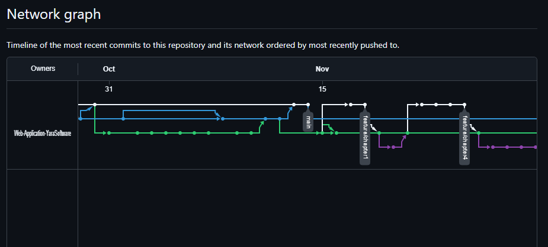

Los siguientes gráficos muestran la cantidad de commits y líneas de código agregadas por cada integrante del equipo en el proyecto.

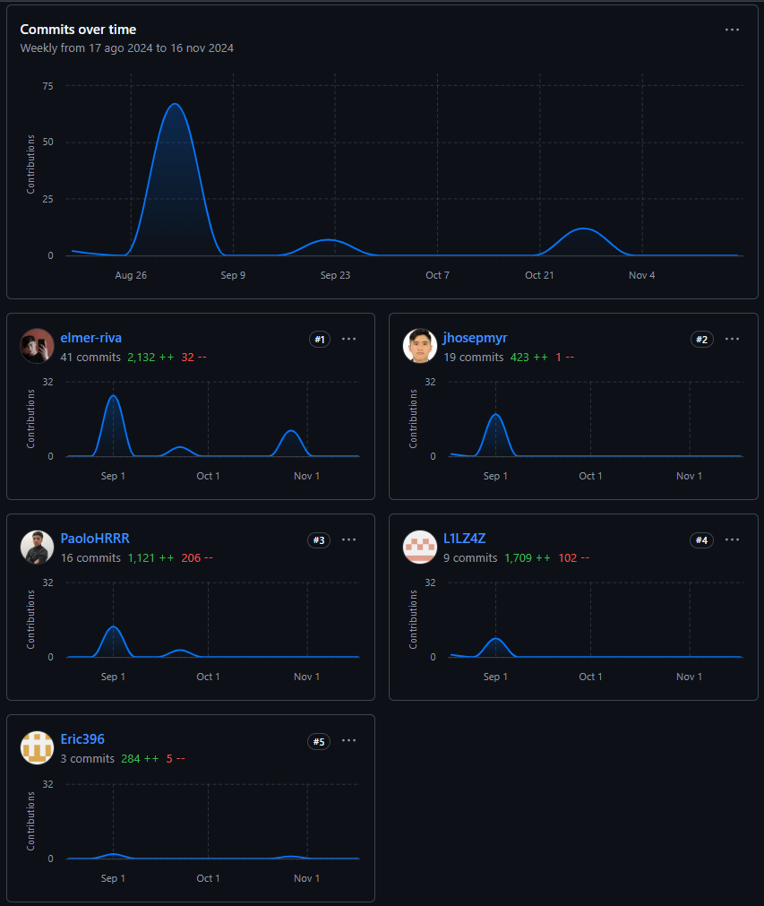
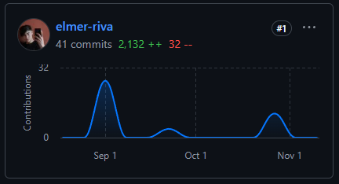

El siguiente gráfico muestra la cantidad de commits realizados en la semana con mayor actividad en el proyecto.

## Contenido

[Capítulo I: Introducción](#capítulo-i-introducción)

[1.1. Startup Profile](#11-startup-profile)

[1.1.1. Descripción de la Startup](#111-descripción-de-la-startup)

[1.1.2. Perfiles de los integrantes del equipo](#112-perfiles-de-los-integrantes-del-equipo)

[1.2. Solution Profile](#12-solution-profile)

[1.2.1. Antecedentes y problemática](#121-antecedentes-y-problematica)

[1.2.2. Lean UX Process](#122-lean-ux-process)

[1.2.2.1. Lean UX Problem Statements](#1221-lean-ux-problem-statements)

[1.2.2.2. Lean UX Assumptions](#1222-lean-ux-assumptions)

[1.2.2.3. Lean UX Hypothesis](#1223-lean-ux-hypothesis)

[1.2.2.4. Lean UX Canvas](#1224-lean-ux-canvas)

[1.3. Segmentos objetivo](#13-segmentos-objetivo)

[Capítulo II: Requirements Elicitation & Analysis](#capítulo-ii-requirements-elicitation--analysis)

[2.1. Competidores](#21-competidores)

[2.1.1. Análisis competitivo](#211-análisis-competitivo)

[2.1.2. Estrategias y tácticas frente a competidores](#212-estrategias-y-tacticas-frente-a-competidores)

[2.2. Entrevistas](#22-entrevistas)

[2.2.1. Diseño de entrevistas](#221-diseño-de-entrevistas)

[2.2.2. Registro de entrevistas](#222-registro-de-entrevistas)

[2.2.3. Análisis de entrevistas](#223-análisis-de-entrevistas)

[2.3. Needfinding](#23-needfinding)

[2.3.1. User Personas](#231-user-personas)

[2.3.2. User Task Matrix](#232-user-task-matrix)

[2.3.3. User Journey Mapping](#233-user-journey-mapping)

[2.3.4. Empathy Mapping](#234-empathy-mapping)

[2.3.5. As-is Scenario Mapping](#235-as-is-scenario-mapping)

[2.4. Ubiquitous Language](#24-ubiquitous-language)

[Capítulo III: Requirements Specification](#capítulo-iii-requirements-specification)

[3.1. To-Be Scenario Mapping](#31-to-be-scenario-mapping)

[3.2. User Stories](#32-user-stories)

[3.3. Impact Mapping](#33-impact-mapping)

[3.4. Product Backlog](#34-product-backlog)

[Capítulo IV: Product Design](#capítulo-iv-product-design)

[4.1. Style Guidelines](#41-style-guidelines)

[4.1.1. General Style Guidelines](#411-general-style-guidelines)

[4.1.2. Web Style Guidelines](#412-web-style-guidelines)

[4.2. Information Architecture](#42-information-architecture)

[4.2.1. Organization Systems](#421-organization-systems)

[4.2.2. Labeling Systems](#422-labeling-systems)

[4.2.3. SEO Tags and Meta Tags](#423-seo-tags-and-meta-tags)

[4.2.4. Searching Systems](#424-searching-systems)

[4.2.5. Navigation Systems](#425-navigation-systems)

[4.3. Landing Page UI Design](#43-landing-page-ui-design)

[4.3.1. Landing Page Wireframe](#431-landing-page-wireframe)

[4.3.2. Landing Page Mock-up](#432-landing-page-mock-up)

[4.4. Web Applications UX/UI Design](#44-web-applications-uxui-design)

[4.4.1. Web Applications Wireframes](#441-web-applications-wireframes)

[4.4.2. Web Applications Wireflow Diagrams](#442-web-applications-wireflow-diagrams)

[4.4.3. Web Applications Mock-ups](#443-web-applications-mock-ups)

[4.4.4. Web Applications User Flow Diagrams](#444-web-applications-user-flow-diagrams)

[4.5. Web Applications Prototyping](#45-web-applications-prototyping)

[4.6. Domain-Driven Software Architecture](#46-domain-driven-software-architecture)

[4.6.1. Software Architecture Context Diagram](#461-software-architecture-context-diagram)

[4.6.2. Software Architecture Container Diagrams](#462-software-architecture-container-diagrams)

[4.6.3. Software Architecture Components Diagrams](#463-software-architecture-components-diagrams)

[4.7. Software Object-Oriented Design](#47-software-object-oriented-design)

[4.7.1. Class Diagrams](#471-class-diagrams)

[4.7.2. Class Dictionary](#472-class-dictionary)

[4.8. Database Design](#48-database-design)

[4.8.1. Database Diagram](#481-database-diagram)

[Capítulo V: Product Implementation, Validation & Deployment](#capítulo-v-product-implementation-validation--deployment)

[5.1. Software Configuration Management](#51-software-configuration-management)

[5.1.1. Software Development Environment Configuration](#511-software-development-environment-configuration)

[5.1.2. Source Code Management](#512-source-code-management)

[5.1.3. Source Code Style Guide & Conventions](#513-source-code-style-guide--conventions)

[5.1.4. Software Deployment Configuration](#514-software-deployment-configuration)

[5.2. Landing Page, Services & Applications Implementation](#52-landing-page-services--applications-implementation)

[5.2.1. Sprint 1](#521-sprint-1)

[5.2.1.1. Sprint Planning 1](#5211-sprint-planning-1)

[5.2.1.2. Sprint Backlog 1](#5212-sprint-backlog-1)

[5.2.1.3. Development Evidence for Sprint Review](#5213-development-evidence-for-sprint-review)

[5.2.1.4. Testing Suite Evidence for Sprint Review](#5214-testing-suite-evidence-for-sprint-review)

[5.2.1.5. Execution Evidence for Sprint Review](#5215-execution-evidence-for-sprint-review)

[5.2.1.6. Services Documentation Evidence for Sprint Review](#5216-services-documentation-evidence-for-sprint-review)

[5.2.1.7. Software Deployment Evidence for Sprint Review](#5217-software-deployment-evidence-for-sprint-review)

[5.2.1.8. Team Collaboration Insights during Sprint](#5218-team-collaboration-insights-during-sprint)

[5.2.2. Sprint 2](#522-sprint-2)

[5.2.2.1. Sprint Planning 2](#5221-sprint-planning-2)

[5.2.2.2. Sprint Backlog 2](#5222-sprint-backlog-2)

[5.2.2.3. Development Evidence for Sprint Review](#5223-development-evidence-for-sprint-review)

[5.2.2.4. Testing Suite Evidence for Sprint Review](#5224-testing-suite-evidence-for-sprint-review)

[5.2.2.5. Execution Evidence for Sprint Review](#5225-execution-evidence-for-sprint-review)

[5.2.2.6. Services Documentation Evidence for Sprint Review](#5226-services-documentation-evidence-for-sprint-review)

[5.2.2.7. Software Deployment Evidence for Sprint Review](#5227-software-deployment-evidence-for-sprint-review)

[5.2.2.8. Team Collaboration Insights during Sprint](#5228-team-collaboration-insights-during-sprint-)

[5.2.3. Sprint 3](#523-sprint-3)

[5.2.3.1. Sprint Planning 3](#5231-sprint-planning-3)

[5.2.3.2. Sprint Backlog 3](#5232-sprint-backlog-3)

[5.2.3.3. Development Evidence for Sprint Review](#5233-development-evidence-for-sprint-review)

[5.2.3.4. Testing Suite Evidence for Sprint Review](#5234-testing-suite-evidence-for-sprint-review)

[5.2.3.5. Execution Evidence for Sprint Review](#5235-execution-evidence-for-sprint-review)

[5.2.3.6. Services Documentation Evidence for Sprint Review](#5236-services-documentation-evidence-for-sprint-review)

[5.2.3.7. Software Deployment Evidence for Sprint Review](#5237-software-deployment-evidence-for-sprint-review)

[5.2.3.8. Team Collaboration Insights during Sprint](#5238-team-collaboration-insights-during-sprint-)

[5.2.4. Sprint 4](#524-sprint-4)

[5.2.4.1. Sprint Planning 4](#5241-sprint-planning-4)

[5.2.4.2. Sprint Backlog 4](#5242-sprint-backlog-4)

[5.2.4.3. Development Evidence for Sprint Review](#5243-development-evidence-for-sprint-review)

[5.2.4.4. Testing Suite Evidence for Sprint Review](#5244-testing-suite-evidence-for-sprint-review)

[5.2.4.5. Execution Evidence for Sprint Review](#5245-execution-evidence-for-sprint-review)

[5.2.4.6. Services Documentation Evidence for Sprint Review](#5246-services-documentation-evidence-for-sprint-review)

[5.2.4.7. Software Deployment Evidence for Sprint Review](#5247-software-deployment-evidence-for-sprint-review)

[5.2.4.8. Team Collaboration Insights during Sprint](#5248-team-collaboration-insights-during-sprint)

[5.3. Validation Interviews](#53-validation-interviews)

[5.3.1. Diseño de Entrevistas](#531-diseño-de-entrevistas)

[5.3.2. Registro de Entrevistas](#532-registro-de-entrevistas)

[5.3.3. Evaluaciones según heurísticas](#533-evaluaciones-según-heurísticas)

[5.4. Video About-the-Product](#54-video-about-the-product)

[Conclusiones](#conclusiones)

[Conclusiones y recomendaciones](#conclusiones-y-recomendaciones)

[Video About-the-Team](#video-about-the-team)

[Bibliografía](#bibliografía)

[Anexos](#anexos)

## Student Outcome

**ABET – EAC - Student Outcome 5:** La capacidad de funcionar efectivamente en un equipo cuyos miembros juntos proporcionan liderazgo, crean un entorno de colaboración e inclusivo, establecen objetivos, planifican tareas y cumplen objetivos.

| Criterio Especifico                                                                             | Acciones Realizadas                                                                                                                                                                                                                                                                                                                                                                                                                                                                                                                                                                                                                                                                                                                                                                                                                                                                                                                                                                                                                                                                                                                                                                                                                                                                                                                                                                                                                                                                                                                                                                                                                                                                                                                                                                                                                                                                                                                                                                                                                                                                                                                                                                                                                                                                                                                                                                                                                                                                                                                                                                                                                                                                                                                                                                                                                                                                                                                                                                                                                                                                                                                                                                                                                                                                                                                                                                 | Conclusiones |
|-------------------------------------------------------------------------------------------------|-------------------------------------------------------------------------------------------------------------------------------------------------------------------------------------------------------------------------------------------------------------------------------------------------------------------------------------------------------------------------------------------------------------------------------------------------------------------------------------------------------------------------------------------------------------------------------------------------------------------------------------------------------------------------------------------------------------------------------------------------------------------------------------------------------------------------------------------------------------------------------------------------------------------------------------------------------------------------------------------------------------------------------------------------------------------------------------------------------------------------------------------------------------------------------------------------------------------------------------------------------------------------------------------------------------------------------------------------------------------------------------------------------------------------------------------------------------------------------------------------------------------------------------------------------------------------------------------------------------------------------------------------------------------------------------------------------------------------------------------------------------------------------------------------------------------------------------------------------------------------------------------------------------------------------------------------------------------------------------------------------------------------------------------------------------------------------------------------------------------------------------------------------------------------------------------------------------------------------------------------------------------------------------------------------------------------------------------------------------------------------------------------------------------------------------------------------------------------------------------------------------------------------------------------------------------------------------------------------------------------------------------------------------------------------------------------------------------------------------------------------------------------------------------------------------------------------------------------------------------------------------------------------------------------------------------------------------------------------------------------------------------------------------------------------------------------------------------------------------------------------------------------------------------------------------------------------------------------------------------------------------------------------------------------------------------------------------------------------------------------------------|--------------|
| Trabaja en equipo para proporcionar liderazgo en forma conjunta                                 | Jhosepmyr: TB1: Durante este entregable, enfrenté dificultades, mis compañeros estuvieron a mi lado, lo que fortaleció nuestra colaboración y nos permitió avanzar como un equipo unido.  TP: En esta entrega, corrigió los errores en la página de aterrizaje y completó las funcionalidades faltantes. Además, se encargó de documentar los commits hechos durante el sprint y de planificar el sprint correspondiente. También ajustó las historias de usuario relacionadas con la página de aterrizaje y las agregó en Trello.  TB2:  Contribuí a redactar las instrucciones para desplegar el backend de la aplicación elaborada, es to con el objetivo de que futuros developers puedan comprender y replicar el despliegue por su cuenta.   Eric:  TB1: En este primer entregable participé en todas las reuniones de trabajo y aporté ideas y participé en los debates importantes. Me sentí una pieza importante del equipo al mismo tiempo que consideré que todos los demás lo fueron por igual.   TP: En la entrega TP, se detalla el desarrollo del informe en la sección de insights de colaboración. Esta información es relevante para que los stakeholders internos del proyecto comprendan cómo ha sido el desempeño del equipo en la creación de su documentación  TB2: Realicé avances en el back-end de la aplicación web. Los endpoints creados se encuentran debidamente documentados gracias al uso de la herramienta de swagger-ui.  Álvaro:  TB1: Considero que he aplicado el liderazgo conjunto a través del diálogo y la polémica. Discutir perspectivas y propuestas es importante para la toma de decisiones, que es una de las responsabilidades que asumen los líderes.   Henry:  TB1: En este entregable el trabajo en equipo me sentí una pieza clave del equipo, en momentos donde hay inconvenientes o problemas estuve ahí para apoyar a mis compañeros, así como ellos me apoyaron a mi a lo largo de estas semanas.  TP: Durante la entrega TP, Carlo realizó commits tanto para la página de aterrizaje como para la aplicación web, siguiendo las convenciones de comunicación escrita. También documentó y desplegó la aplicación para que los interesados pudieran observar el progreso y tener acceso al producto en desarrollo durante el sprint.   Elmer:  TB1: En este primer entregable, trabajé en equipo asumiendo un liderazgo conjunto con mis compañeros. Colaboramos activamente en la toma de decisiones clave, como los flujos de usuario y la arquitectura de la información. Además, distribuimos las responsabilidades de forma equitativa, lo que nos permitió compartir el liderazgo y aprovechar las fortalezas de cada uno para cumplir con los objetivos del proyecto de manera eficiente.  TP: Refinó los criterios de aceptación para facilitar la comprensión tanto del equipo como de las partes interesadas. Usó Trello para transcribir las historias de usuario y tareas que habían sido redactadas previamente, lo que permitió a los stakeholders y desarrolladores monitorear el progreso de las funcionalidades del proyecto.   TB2: Contribui con la elaboracion del back end y desarrollo del front end de manera que se pueda realizar un avance significativo y bajo los criterios establecidos, manteniendo en cuenta los deseos del cliente.   | [Redaccion]  |
| Crea un entorno colaborativo e inclusivo, establece metas, planifica tareas y cumple objetivos. | Jhosepmyr: TB1: Aunque el proceso no estuvo exento de desafíos, considero que logramos mantener un ambiente de cooperación y trabajo en equipo. Al principio, tuvimos algunos problemas para organizar nuestras tareas, pero estableciendo objetivos claros y dividiendo responsabilidades, pudimos mejorar nuestra coordinación y cumplir con nuestras metas de manera efectiva.  TP: En la presentación del proyecto, Jhosepmyr detalló el desarrollo del segundo sprint y organizó el código del proyecto. Además, incluyó el proceso de despliegue y los insights sobre la colaboración del equipo durante el sprint.  TB2: Se organizaron reuniones con el equipo de trabajo para conocer los avances constantes durante el sprint, además de realizar un video de presentación con lo realizado durante el sprint 2.  Eric:  TB1: Para ayudar a crear un entorno colaborativo saludable trabajé en un entorno colaborativo con los demás miembros del equipo al mismo tiempo que mantuve puntualidad en el cumplimiento de las tareas del trabajo. TP: Se organizaron reuniones dentro del equipo para revisar los avances del sprint y se realizó un video donde se presentó lo trabajado durante el segundo sprint.  TB2: En la presentación del proyecto se explica a detalle el desarrollo del tercer sprint y la organización del código del proyecto. Se incluye el proceso de deployment y los insights de la colaboración del equipo durante el sprint.  Álvaro:  TB1: Hemos tenido un entorno de cooperación constante, en que todos hemos sido bienvenidos y hemos aportado nuestra cuota de contribución. Mediante estas aportaciones, hemos logrado desarrollar y cumplir una serie de actividades que planificamos previamente.   Henry:  TB1: A pesar de los problemas que pasamos en el transcurso de este entregable, siento que pudimos, como equipo, mantenernos unidos y cooperativos unos con otros. Al inicio nos costo mantener la constancia pero poco a poco mediante metas que nos propusimos en el equipo logramos el objetivo.  TP: Henry ajustó las historias de usuario correspondientes a la página de aterrizaje y las incluyó en Trello. También modificó el diseño de la landing page en Figma para alinearlo con las mejoras realizadas.  Elmer:  TB1: En este primer entregable, creé un entorno colaborativo e inclusivo, donde todos los miembros del equipo pudieron participar activamente. Establecimos metas claras desde el principio, como definir los flujos de usuario y la estructura de la UI. Planificamos las tareas de manera organizada, asignando responsabilidades específicas. Por ejemplo, coordinamos el desarrollo de los prototipos interactivos y la revisión conjunta de los User Flow Diagrams, lo que nos permitió cumplir con los objetivos en tiempo.   TP: Organice diversas reuniones con el equipo para avanzar en conjunto en el proyecto, colaborar en la implementación de funcionalidades y comunicar las metas y objetivos alcanzados.  TB2: Realice el sprint backlog del sprint 3, ademas de organizar sprint en trello para la documentacion de avances y organizacion de entregables.                                                                                                                                                          | [Redaccion]  |

# Capítulo I: Introducción

## 1.1. Startup Profile

En esta sección se presenta la descripción de la startup y los perfiles de los miembros del equipo.

### 1.1.1. Descripción de la Startup
Yara Software es una startup conformada por jóvenes estudiantes de la carrera de Ingeniería de Software cuyo objetivo es la creación de productos de software personalizados que optimizan y transforman procesos en sectores laborales que a menudo se pasan por alto en la digitalización.

**Misión:** Nuestra misión es impulsar desarrollo tecnológico a diversos sectores de la industria, favoreciendo el crecimiento económico a través de soluciones de software innovadoras, accesibles y adaptadas a las necesidades de sus usuarios. A través del compromiso con la calidad, la eficiencia y la experiencia de usuario, garantizamos el éxito de nuestros proyectos y favorecemos la integración y adopción de la tecnología en el mundo actual de constante cambio.

**Visión:** Como Startup, aspiramos a ser reconocidos a nivel nacional por nuestro fuerte compromiso con la calidad y la excelencia, alcanzando afianzar a más de 10,000 usuarios a nivel nacional en los próximos cuatro años, posicionándonos como un referente en cuanto a desarrollo tecnológico e innovación en el país.

### 1.1.2. Perfiles de los integrantes del equipo 

| Foto del participante                         | Nombres y apellidos              | Código de estudiante | Carrera                | Conocimientos técnicos y habilidades                                                                                                                                                                                     |
|-----------------------------------------------|----------------------------------|----------------------|------------------------|--------------------------------------------------------------------------------------------------------------------------------------------------------------------------------------------------------------------------|
|  </img> | Jhosepmyr Orlando Gutiérrez Soto | 202317638            | Ingeniería de Software | Experiencia en desarrollo frontend con tecnologias como javascript y python y manejo de frameworks de estilos como SASS y Tailwind. Conocimiento alto en BlockChain. Determinación y seguridad en los trabajos en equipo |
|  </img>      | Eric Ernesto Hernández Tuiro     | 20221C857            | Ingeniería de Software | Programación en C++ y Python. Resolución de problemas y resiliencia ante situaciones de presión.                                                                                                                         | 
|  </img>     | Elmer Augusto Riva Rodríguez     | 202220829            | Ingeniería de Software | Diseño de experiencias de usuario y programación con C++ y Python. Competente en la gestión de proyectos grupales.                                                                                                       | 

## 1.2. Solution Profile

### 1.2.1. Antecedentes y problemática

***What?***

La baja rentabilidad, retención y fidelización de clientes.

***Why?***

Porque los talleres mecánicos se enfocan únicamente en la eficiencia del servicio.

***Who?***

A dueños de talleres de mecánica automotriz.

***When?***

En la actualidad, de manera continua a lo largo del tiempo.

***Where?***

En el Perú, principalmente en la ciudad de Lima.

***How?***

Se mide a través del flujo de caja en talleres mecánicos y su ganancia media mensual.

***How much?***

A la gran mayoría de talleres, sobre todo, los más informales.

### 1.2.2. Lean UX Process

#### 1.2.2.1 Lean UX Problem Statements

En la actualidad, el sector de la mecánica automotriz se enfoca principalmente en la eficiencia del servicio a clientes esporádicos con necesidades correctivas. Sin embargo, no aborda la importancia de fidelizar clientes, generar un flujo constante de ingresos y ofrecer información clave sobre el estado del servicio de forma efectiva.

Nuestro producto busca resolver estos problemas mediante funcionalidades de gestión de personal, almacenamiento de información sobre clientes, control de inventario y un sistema de salud vehcular. Para ello, inicialmente, nos enfocaremos en los dueños de talleres automotrices. 

El problema se considerará resuelto cuando los dueños de talleres automotrices puedan administrar eficazmente y atender a un flujo constante de clientes fidelizados.

#### 1.2.2.2. Lean UX Assumptions

***Business Outcomes***
+ Llegar a 2500 usuarios en un año
+ Tener un índice de retención de usuarios del 90%
+ El 20% de nuestros clientes use la suscripción premium

***Users***

**Roberto García - Dueño de taller mecánico**

Objetivos:
+ Ofrecer un servicio eficiente para fidelizar a sus clientes.
+ Controlar mejor los recursos para reducir costos operativos.
+ Mejorar la satisfacción del cliente para aumentar las referencias y reseñas positivas.

Obstáculos:
+ Falta de tiempo para gestionar todos los aspectos del negocio de manera eficiente.
+ Dificultad para implementar nuevas tecnologías
+ Competencia creciente de talleres más grandes y mejor equipados.
+ Incertidumbre en la gestión del inventario lo que puede resultar en repuestos faltantes.

**Juan Pérez - Mecánico**

Objetivos:
+ Realizar su trabajo de manera eficiente.
+ Conocer el estado del vehículo para determinar cómo repararlo.
+ Minimizar el tiempo perdido en la búsqueda de respuestos.

Obstáculos:
+ Falta o dificultad de acceso información sobre el estado del vehículo.
+ Desorganización en el taller, lo que lleva a malentendidos y demoras.
+ Presión para realizar su trabajo rápido.

**María López - Cliente de taller**

Objetivos:
+ Mantener su vehículo en buen estado para evitar problemas inesperados.
+ Recibir un servicio rápido y confiable, sin tener que esperar mucho tiempo.
+ Ahorrar dinero en reparaciones costosas mediante un mantenimiento preventivo efectivo.
+ Sentirse informada y segura sobre el estado de su vehículo y las reparaciones necesarias.

Obstáculos:
+ Tiempo limitado para dejar su coche en el taller, ya que depende de él para su trabajo.
+ Falta de conocimiento técnico, ya que teme que le cobren por reparaciones innecesarias.
+ Incertidumbre sobre la disponibilidad del taller, lo que a veces la lleva a cambiar de lugar si no recibe atención rápida.

***User Outcomes***

**Roberto García - Dueño de taller mecánico**
+ Aumentar la cantidad de clientes atendidos por día
+ Ahorrar tiempo en control de recursos de taller
+ Aumentar la rentabilidad y retención de clientes

**Juan Pérez - Mecánico**
+ Lograr ser más eficiente en el trabajo

**María López - Cliente de taller**
+ Ahorrar en reparaciones de su vehículo
+ Sentirse más satisfechos con el servicio

***Solutions***
+ Sistema de gestión de horarios
+ Historial de vehículos
+ Gestión de inventario
+ Base de datos de clientes
+ Sistema de salud vehicular
+ Sistema de aforo de taller

#### 1.2.2.3. Lean UX Hypothesis
+ Creemos que lograremos llegar a 2500 usuarios en un año si los dueños de talleres logran aumentar la cantidad de clientes atendidos por día mediante el sistema de gestión de horarios
+ Creemos que lograremos tener índice de retención de clientes del 90% si los mecanicos logran ser más eficientes en su trabajo mediante la consulta de historial de vehículos
+ Creemos que lograremos tener índice de retención de clientes del 90% si los dueños de talleres logran ahorrar tiempo en control de recursos de taller mediante sistema de gestión de inventario
+ Creemos que lograremos el 20% de nuestros clientes use la suscripción premium si los dueños de talleres logran aumentar la rentabilidad y retención de clientes mediante base de datos de clientes y venta del acceso a sistema de salud vehicular
+ Creemos que lograremos el 20% de nuestros clientes use la suscripción premium si clientes de taller logran ahorrar en reparaciones de su vehículo mediante sistema de salud vehicular
+ Creemos que lograremos el 20% de nuestros clientes use la suscripción premium si clientes de taller logran sentirse más satisfechos con el servicio mediante sistema de aforo del taller

#### 1.2.2.4. Lean UX Canvas

El Lean UX Canvas es una herramienta utilizada para alinear a los equipos en torno a un objetivo común y proporcionar una visión general de la solución propuesta. A continuación, se presenta el Lean UX Canvas de Yara Software.

## 1.3. Segmentos objetivo

***Dueños de taller***

Según un informe de Zippia (2022), en Estados Unidos, el 95.7% de los dueños de taller son hombres y, aunque la edad puede variar según la etnicidad, generalmente se aproxima a los 43 años. Además, el mismo estudio señala que aproximadamente el 42% de los dueños de taller poseen un grado de educación secundaria mientras que el 24% posee un grado técnico superior.

+ Género: Masculino

+ Edad: 43 años

+ Grado de instrucción: Educación secundaria

***Mecánicos***

Según un informe de Zippia (2022), en Estados Unidos, el 96.4% de los mecánicos son hombres y, aunque la edad puede variar según la etnicidad, generalmente se aproxima a los 40 años. Además, el mismo estudio señala que aproximadamente el 47% de los mecánicos poseen un grado de educación secundaria.

+ Género: Masculino

+ Edad: 40 años

+ Grado de instrucción: Educación secundaria

***Clientes de taller***

De acuerdo con datos de MarketWatch (2024), en Estados Unidos, el 49.5% de los vehículos están en manos de hombres. A pesar de esto, son ellos quienes pasan más tiempo al volante y recorren mayores distancias. La mayoría de estos conductores tiene alrededor de 30 años.

+ Género: Masculino

+ Edad: 30 años

# Capítulo II: Requirements Elicitation & Analysis

## 2.1. Competidores

### 2.1.1. Análisis competitivo

<table>
    <tr>
        <th colspan="6">Competitive Analysis Landscape</th>
    </tr>
    <tr>
        <td colspan="2" rowspan="2">Competitive Analysis Landscape</td>
        <td colspan="4">Escriba en el recuadro la pregunta que busca responder o el objetivo de este análisis.</td>
    </tr>
    <tr>
        <td colspan="4">El objetivo de este análisis es evaluar el estado actual del mercado de software, identificando el alcance y las características de las soluciones existentes. Esto nos permitirá definir una propuesta de valor única y desarrollar una identidad distintiva para nuestro producto, asegurando que se diferencie claramente en el mercado y satisfaga necesidades no plenamente abordadas por la competencia.</td>
    </tr>
    <tr>
        <td colspan="2">(En la cabecera colocar por cada competidor nombre y logo)</td>
        <th scope="col">Workshop N-GINE</th>
        <th scope="col">Autodata</th>
        <th scope="col">ServitechApp</th>
        <th scope="col">AutoSoft Taller</th>
    </tr>
    <tr>
        <th scope="row" rowspan="2">Perfil</th>
        <th scope="row">Overview</th>
        <td>Workshop N-GINE es una solución integral que transforma los talleres automotrices mediante tecnología avanzada, enfocándose en la optimización, la eficiencia y la satisfacción del cliente</td>
        <td>Desarrollado por expertos en automoción que comprenden las complejidades del servicio, el mantenimiento, el diagnóstico y la reparación de vehículos. Reduzca los errores y agilice los trabajos</td>
        <td>ServitechApp te permite crear ordenes de trabajo y presupuestos, gestionar la venta de productos, administrar tus clientes y llevar fácilmente el control de tu taller. ¡Puedes personalizarlo en 5 minutos!</td>
        <td>Nuestra innovadora solución combina tecnología de vanguardia y conocimiento especializado para ofrecerte una experiencia sin igual en tu taller automotriz. Ya sea que necesites optimizar la gestión del taller, realizar diagnósticos precisos, recibir asistencia técnica experta, administrar ciclos de mantenimiento, seleccionar las partes adecuadas, encontrar soluciones a problemas o elaborar presupuestos precisos, nuestro asistente de IA está aquí para ayudarte en cada paso del camino</td>
    </tr>
    <tr>
        <th scope="row">Ventaja competitiva ¿Qué valor ofrece a los clientes?</th>
        <td>Foco principal en la optimización de procesos y en la satisfacción de los clientes</td>
        <td>Acceso a documentación de una amplia gama de vehículos, lo que facilita el diagnóstico y reparación de estos</td>
        <td>Alto nivel de personalización e integración con múltiples herramientas multidispositivo, lo que favorece su adopción</td>
        <td>Incorporación de una inteligencia artificial que brinda asistencia personalizada a los usuarios, lo que complementa los diagnósticos de los mecánicos</td>
    </tr>
    <tr>
        <th scope="row" rowspan="2">Perfil de Marketing</th>
        <th scope="row">Mercado Objetivo</th>
        <td>Talleres de mecánica automotriz pequeños y medianos</td>
        <td>Grandes empresas de mecánica y electrónica automotriz</td>
        <td>Talleres de mecánica automotriz y mecánica industrial</td>
        <td>Talleres de mecánica automotriz</td>
    </tr>
    <tr>
        <th scope="row">Estrategias de Marketing</th>
        <td>Prueba gratuita de 30 días</td>
        <td>Prueba sin compromiso del producto por S/5.00</td>
        <td>Prueba sin compromiso del producto gratuita</td>
        <td>Prueba por tiempo limitado de las funcionalidades de inteligencia artificial de forma gratuita</td>
    </tr>
    <tr>
        <th scope="row" rowspan="3">Perfil de Producto</th>
        <th scope="row">Productos y Servicios</th>
        <td>Workshop N-GINE - Regular Workshop N-GINE - Premium Atención al cliente</td>
        <td>Autodata para motos - Motorcycles Autodata para autos y furgonetas - Service & Maintenance Autodata para autos y furgonetas - Diagnostic & Repair Atención al cliente</td>
        <td>ServitechApp - Personal ServitechApp - Plus ServitechApp - Pro Atención al cliente</td>
        <td>AutoSoft Taller - Básico AutoSoft Taller - Profesional Asistente Inteligente (IA) Atención al cliente</td>
    </tr>
    <tr>
        <th scope="row">Precios y costos</th>
        <td>S/59.99 PEN al mes S/99.99 PEN al mes o S/1099.99 PEN al año</td>
        <td>S/86.00 PEN al mes S/172.00 PEN al mes S/310.00 PEN al mes</td>
        <td>$/49.99 USD pago único $/99.99 USD pago único $/159.99 USD pago único</td>
        <td>Desde $/15.99 hasta 44.99 USD al mes o desde $/168.99 hasta 494.99 USD al añoe Desde $/30.99 hasta 99.99 USD al mes o $/336.99 hasta 1,098.99 USD al año $/9.99 al mes</td>
    </tr>
    <tr>
        <th scope="row">Canales de distribución (Web y/o Móvil)</th>
        <td>Página web oficial del producto</td>
        <td>Página web oficial del producto Distribuidores autorizados adicionales</td>
        <td>Página web oficial del producto</td>
        <td>Página web oficial del producto</td>
    </tr>
    <tr>
        <th scope="row" rowspan="5">Análisis SWOT</th>
        <td colspan="5">Realice esto para su startup y sus competidores. Sus fortalezas deberían apoyar sus oportunidades y contribuir a lo que ustedes definen como su posible ventaja competitiva.</td>
    </tr>
    <tr>
        <th scope="row">Fortalezas</th>
        <td>Ecosistema integral de herramientas de optimización de procesos Enfoque en la satisfacción del cliente Aprovechamiento de la tecnología IoT para expandir el alcance y funcionalidades del producto</td>
        <td>Ofrece una amplia gama de información especializada en conjunto con el producto Cuenta con múltiples canales de distribución</td>
        <td>Facilidad de uso y de adopción Acceso al código fuente, lo que permite modificar el programa a las necesidades específicas de cada cliente Modelo de pago único, volviéndose una opción rentable a largo plazo</td>
        <td>Incorporación de una inteligencia artificial que brinda asistencia personalizada a los usuarios, lo que complementa los diagnósticos de los mecánicos. Variedad de opciones de suscripción y modelos de pago, lo que permite adaptarse a diferentes tamaños de talleres.</td>
    </tr>
    <tr>
        <th scope="row">Debilidades</th>
        <td>Startup reciente, lo que puede generar desconfianza por parte de los consumidores Valor agregado dependiente a la suscripción premium</td>
        <td>Modelo de suscripción con pocas opciones disponibles</td>
        <td>Dependencia de un solo canal de distribución</td>
        <td>El costo elevado de las suscripciones puede ser prohibitivo para talleres más pequeños.</td>
    </tr>
    <tr>
        <th scope="row">Oportunidades</th>
        <td>Expansión en mercados emergentes Alianzas estratégicas con fabricantes de autos y distribuidores para mejorar el alcance y la calidad del servicio</td>
        <td>Control de información especializada mediante alianzas estratégicas con fabricantes de autos</td>
        <td>Expansión a desarrollo de software altamente especializado Creación de comunidades de desarrollo que compartan modificaciones del software</td>
        <td>Integración con más herramientas de diagnóstico y gestión automotriz para expandir su funcionalidad.</td>
    </tr>
    <tr>
        <th scope="row">Amenazas</th>
        <td>Competencia creciente en el mercado de software automotriz Resistencia al cambio de parte de talleres tradicionales que prefieren métodos convencionales</td>
        <td>Mercado objetivo limitado, dado que el producto apunta concretamente a grandes empresas de mecánica automotriz</td>
        <td>Poco valor agregado ofrecido directamente por parte de la empresa</td>
        <td>La competencia podría desarrollar funcionalidades similares de IA, socavando por completo su ventaja competitiva.</td>
    </tr>
</table>

### 2.1.2. Estrategias y tácticas frente a competidores

***Fortalecimiento de la Confianza del Consumidor***

Estrategia: Mitigar la desconfianza asociada a ser una startup reciente mediante la construcción de una sólida reputación y demostrando el valor del producto desde el principio.

Tácticas:
+ Implementar un programa de testimonios y estudios de caso con talleres que ya hayan obtenido resultados positivos utilizando Workshop N-GINE.
+ Ofrecer una garantía de satisfacción o un período de devolución de dinero para disminuir el riesgo percibido por nuevos clientes.
+ Participar en ferias y eventos del sector automotriz para fortalecer la presencia de la marca y generar confianza.

***Expansión de Funcionalidades Basadas en IoT y Automatización***

Estrategia: Aprovechar la tecnología IoT y la automatización para ofrecer funcionalidades únicas que mejoren la eficiencia operativa de los talleres.

Tácticas:
+ Desarrollar e integrar sensores y dispositivos IoT para monitorear en tiempo real el estado de los vehículos y los recursos del taller.
+ Incorporar funciones de mantenimiento predictivo que alerten a los talleres sobre posibles problemas antes de que ocurran, optimizando así la eficiencia.
+ Promover estas innovaciones como diferenciadores clave en la comunicación de marketing, destacando el valor de la tecnología avanzada para los talleres.

***Enfoque en la Expansión y Alianzas Estratégicas***

Estrategia: Expandir el mercado objetivo a través de alianzas estratégicas con distribuidores para mejorar el alcance y la calidad del servicio.

Tácticas:
+ Explorar oportunidades en mercados emergentes donde la penetración de software de gestión de talleres es baja, ofreciendo precios competitivos y soporte local.
+ Crear programas de co-marketing con proveedores de piezas de automóviles, promoviendo Workshop N-GINE como parte de un ecosistema integrado de soluciones para talleres.

## 2.2. Entrevistas

### 2.2.1. Diseño de entrevistas

***Dueños de taller***

PARTE I: Iniciaremos brevemente con una sección de presentación

1. Iré rápidamente preguntándole y usted responderá con sus datos, ¿entendido?
+ Edad
+ Nivel de educación
+ Estado civil
+ Miembros en su familia

PARTE II: Ahora, vamos a hacer una serie de preguntas que tienen por objetivo comprender como funciona su negocio. Lo invitamos a describir con cuanta precisión sea necesaria y a emplear el lenguaje técnico al que esté acostumbrado. 

2. ¿De qué operaciones y actividades está a cargo usted en su taller? ¿Podría explicar el proceso para llevarlas a cabo?

3. ¿Utiliza herramientas para registrar el desarrollo o para almacenar información de dichas actividades? ¿Cuáles son y con qué finalidad registra dicha información?

+ (Complementaria) ¿Usted lleva un control de las tareas/reparaciones que realizan los mecánicos en su taller? ¿Se apoya en alguna herramienta?

4. En general, ¿qué dificultades o inconvenientes puede enfrentar durante el desarrollo de dichas actividades?

PARTE III: Finalmente, haremos preguntas relacionadas a la naturaleza y características del producto que queremos desarrollar

5. ¿Qué dispositivo digital le es más afín: celulares, computadoras o laptops?

6. ¿Cuenta usted con alguno o más de uno de estos dispositivos como herramienta de trabajo en su taller? ¿Para qué fines y en qué momentos del trabajo hace uso de ellos?

7. Existe una tecnología que llamó nuestra atención, el puerto OBD. Mediante un escáner conectado a ese puerto, se puede obtener información sobre el estado de un vehículo. En su taller, ¿se hace uso de este scáner y qué tan útil les ha resultado?

+ (Complementaria) ¿Qué condiciones deberían cumplirse para que dicha tecnología les sea más adecuada y comiencen a utlizarla en su taller?

***Mecánicos***

PARTE I: Iniciaremos brevemente con una sección de presentación. 

1. Iré rápidamente preguntandole y usted responderá con sus datos, ¿ok?
+ Edad
+ Nivel de educación
+ Estado civil
+ Miembros en su familia

2. ¿Cuántos años llevas trabajando en la mecánica automotriz y cuál fue su motivación o razón de trabajar en este sector?

PARTE II: Ahora, vamos a hacer una serie de preguntas que tienen por objetivo comprender su quehacer en el trabajo. Lo invitamos a describir con cuanta precisión sea necesaria y a emplear el lenguaje técnico al que esté acostumbrado. 

3. ¿Cómo se les asignan las responsabilidades y actividades aquí en el taller?

4. ¿Qué información consideras esencial tener a disposición al momento de realizar su trabajo? ¿Hace consultas al dueño del vehículo, en manuales u otros recursos?

5. ¿Se lleva un registro escrito de las actividades que realizan? ¿Con qué finalidad?

PARTE III: Finalmente, haremos preguntas relacionadas a la naturaleza y características del producto que queremos desarrollar

5. ¿Qué dispositivo digital le es más afín: celulares, computadoras o laptops?

6. ¿Cuenta usted con alguno o más de uno de estos dispositivos como herramienta de trabajo en su taller? ¿Para qué fines y en qué momentos del trabajo hace uso de ellos?

7. Existe una tecnología que llamó nuestra atención, el puerto OBD. Mediante un escáner conectado a ese puerto, se puede obtener información sobre el estado de un vehículo. ¿Usted hace uso de esta tecnología? ¿Por qué?

+ (Complementaria) Nuestro producto propone que la información del puerto OBD no requiera de un escáner y que pueda ser consultada desde el dispositivo digital de su preferencia. ¿Qué tan significativo sería este cambio para su trabajo?

***Cliente de taller***

PARTE I: Iniciaremos brevemente con una sección de presentación. 

1. Iré rápidamente preguntandole y usted responderá con sus datos, ¿ok?
- Edad
- Nivel de educación
- Estado civil
- Miembros en su familia

PARTE II: Ahora, vamos a hacer una serie de preguntas que tienen por objetivo comprender sus interes y motivaciones en relación a su vehículo.

2. ¿Qué carro tienes? ¿Cuántos años llevas manejando?

3. ¿Qué nivel de entendimiento tienes respecto del funcionamiento técnico de un vehículo?

4. ¿Qué tan importante es para usted el cuidado de su vehículo? ¿Tiene algún mecánico de confianza?

5. ¿Usted lleva su vehículo al taller de forma periódica o cuando cree que su vehículo pudiera tener algún problema?

PARTE III: Finalmente, haremos preguntas relacionadas a la naturaleza y características del producto que queremos desarrollar

6. Si contara con información contínua sobre el estado de su vehículo, ¿esta información lo impulsaría a visitar más frecuentemente a un mecánico en favor del mantenimiento de su vehículo?

7. ¿Le resultaría útil contar con información del aforo y nivel de ocupación de su taller de mecánica de confianza?

### 2.2.2. Registro de entrevistas

<table>
    <tr>
        <th scope="col">Segmento</th>
        <th scope="col">Datos y resumen de entrevista</th>
        <th scope="col">Evidencia fotográfica</th>
    </tr>
    <tr>
        <th rowspan="3" scope="row">Dueños de taller</th>
        <td>
        <strong>Erwin Romel Riva Rodríguez</strong> 
        Edad: 29 años 
        Distrito: Santa Rosa Rodríguez de Mendoza 
        Nivel de educación: técnico superior 
        Estado civil: conviviente 
        Familia: conviviente e hija 
        Dispositivo preferido: celular 
        Tipo de taller: mecánica y electrónica 
         
        Erwin es responsable de la administración de su taller, además de participar activamente en el trabajo operativo. Actualmente, utiliza un cuaderno para llevar un control del trabajo realizado, especialmente para asegurar transparencia y seguimiento ante sus clientes. Sin embargo, no todos sus empleados siguen este mismo estándar, lo que genera una falta de consistencia en los registros. Entre las principales dificultades que enfrenta, destacan la obtención de repuestos y la falta de información sobre vehículos de marcas menos comunes. Aunque usa dispositivos como celulares y tablets junto con un escáner OBD para diagnósticos, el cual califica de indispensable debido a los modelos de vehículos de sus clientes.
        </td>
        <td></td>
    </tr>
    <tr>
        <td>
        <strong>Enrique Reaño García</strong> 
        Edad: 53 años 
        Distrito: San Juan de Lurigancho 
        Nivel de educación: secundaria completa 
        Estado civil: conviviente 
        Familia: conviviente e hija 
        Dispositivo preferido: celular 
        Tipo de taller: mecánica 
         
        Enrique se encarga de las operaciones de mecánica general y de adaptación en su taller, trabajando como uno más de su equipo. A pesar de usar ocasionalmente cuadernos o su celular para llevar registros, prefiere no hacerlo, lo que podría estar relacionado con su extensa experiencia en el sector. No percibe dificultades significativas en su trabajo debido a su larga trayectoria, lo que le da una confianza natural en sus habilidades. Sin embargo, debido a que la mayoría de sus clientes poseen vehículos antiguos, no ve mucho valor en el uso de tecnologías como el escáner OBD.
        </td>
        <td></td>
    </tr>
    <tr>
        <td>
        <strong>Darío Quispe Llamoca</strong> 
        Edad: 42 años 
        Distrito: Los Olivos 
        Nivel de educación: técnico superior 
        Estado civil: casado 
        Familia: esposa y tres hijas 
        Dispositivo preferido: celular 
        Tipo de taller: mecánica y electrónica 
         
        Darío es responsable tanto de la parte operativa como administrativa de su taller. Destaca por su meticulosidad al documentar cada proceso de trabajo, asegurando que todos los pasos queden registrados en un sistema que no solo mejora el control operativo, sino que también optimiza la atención al cliente. Entre las principales dificultades que enfrenta, menciona los errores en los códigos de los manuales de autopartes, la complejidad de manejar solicitudes adicionales de los clientes, y los problemas que pueden surgir si un vehículo o repuesto falla durante las pruebas de calidad. 
        Darío utiliza una combinación de computadoras de escritorio y celulares en su trabajo diario, lo que refleja un enfoque moderno y tecnológico en la gestión de su taller. Además, realiza transmisiones en vivo de su negocio, lo que indica una apertura hacia el uso de nuevas tecnologías para promocionar y mejorar la comunicación con sus clientes. Destaca la importancia del escáner OBD en su labor, considerándolo indispensable, y resalta la necesidad de mantenerse actualizado constantemente para ofrecer un servicio de calidad.
        </td>
        <td></td>
    </tr>
    <tr>
        <th rowspan="3" scope="row">Mecánicos</th>
        <td>
        <strong>Jheyson Fernández Santillán</strong> 
        Edad: 23 años 
        Distrito: Santa Rosa Rodríguez de Mendoza 
        Nivel de educación: técnico superior 
        Estado civil: soltero 
        Familia: madre, padre y hermano 
        Dispositivo preferido: celular 
        Jheyson ha estado involucrado en la mecánica automotriz por cinco años, motivado por sus lazos familiares. En el taller que trabaja, las responsabilidades se distribuyen entre los mecánicos en función de las características del vehículo y la disponibilidad de cada uno. Su principal preocupación es tener acceso a información precisa sobre la estructura del vehículo para evitar daños durante las reparaciones, la cual obtiene a través de su jefe o investigando en internet usando su celular. 
        Utiliza proformas en papel para registrar las actividades realizadas y pendientes, lo que indica un enfoque manual y tradicional en su trabajo. Además, emplea un escáner OBD como herramienta de asistencia para identificar problemas en los vehículos mediante los códigos generados, para así saber por dónde comenzar su trabajo.
         
        </td>
        <td></td>
    </tr>
    <tr>
        <td>
        <strong>Raúl Fernando Reaño García</strong> 
        Edad: 56 años 
        Distrito: San Juan de Lurigancho 
        Nivel de educación: técnico superior 
        Estado civil: conviviente 
        Familia: conviviente e hijo 
        Dispositivo preferido: celular 
        Lleva aproximadamente 20 años en la mecánica por su fascinación por el funcionamiento de los vehículos. En el taller que trabaja, las responsabilidades se distribuyen y asignan directamente según su importancia y complejidad al momento que un vehículo ingresa. Señala la importancia de obtener información por parte del cliente, la cuál se complementa con búsquedas por internet con su celular de ser necesario. Utiliza un cuaderno como registro del trabajo realizado donde es importante registrar el número de placa del vehículo. En el taller que trabaja, no se hace uso del escáner OBD, dado el tipo de vehículos que recibe en su taller por parte de sus clientes.
         
        </td>
        <td></td>
    </tr>
    <tr>
        <td>
        <strong>Alexis Javier García Escobar</strong> 
        Edad: 23 años 
        Distrito: Los Olivos 
        Nivel de educación: secundaria completa 
        Estado civil: soltero 
        Familia: padre, madre y hermano 
        Dispositivo preferido: celular 
        Lleva aproximadamente seis años trabajando en mecánica, impulsado por su fascinación por el funcionamiento de los vehículos. En el taller donde labora, las responsabilidades se asignan mediante una hoja de trabajo que describe el problema. Destaca la importancia de obtener información detallada del cliente, incluyendo sus primeras impresiones, y complementa estos datos con su conocimiento técnico y consultas realizadas a través de su celular. Utiliza una hoja de cálculo en Excel para registrar el trabajo realizado, asegurándose de anotar las actividades y las fechas correspondientes. En su trabajo, emplea un escáner OBD para obtener los valores necesarios y determinar la causa de los problemas.
         
        </td>
        <td></td>
    </tr>
    <tr>
        <th rowspan="3" scope="row">Clientes de taller</th>
        <td>
        <strong>Carlos Alberto Ochoa Colonio</strong> 
        Edad: 24 años 
        Distrito: Santiago de Surco 
        Nivel de educación: secundaria completa 
        Ocupación: estudiante universitario de pregrado 
        Estado civil: soltero 
        Familia: padre 
        Marca de vehículo: Mazda 
         
        Carlos, quien conduce un Mazda CX-5 prestado por un familiar, enfatiza la importancia del cuidado del vehículo debido a que no es de su propiedad. Aunque carece de conocimientos técnicos sobre su automóvil, ultimamente está interesado en aprender más. Indicó que confía en un mecánico recomendado, pero no lleva el auto al taller regularmente, solo cuando surgen problemas. La posibilidad de monitorear el estado del vehículo de manera constante le resulta atractiva, ya que reconoce que muchos problemas pueden pasar desapercibidos y requieren tiempo y esfuerzo para ser detectados. Además, le interesa la función de aforo y disponibilidad del taller, recordando una experiencia negativa relacionada con largas colas en el taller y cómo esta funcionalidad podría haberle evitado esa molestia.
        </td>
        <td></td>
    </tr>
    <tr>
        <td>
        <strong>María Angélica Ramos Quispe</strong> 
        Edad: 19 años 
        Distrito: Lurigancho-Chosica 
        Nivel de educación: secundaria completa 
        Ocupación: estudiante universitario de pregrado 
        Estado civil: soltera 
        Familia: madre 
        Marca de vehículo: Hyundai 
         
        María Angélica tiene 7 años de experiencia manejando, aunque a pesar de su tiempo al volante, no está familiarizada con los aspectos técnicos de su vehículo, lo que le genera preocupaciones sobre la transparencia de los servicios mecánicos. Considera importante el cuidado de su Hyundai Tucson y tiene un mecánico de confianza desde hace 3 años, al que acude solo cuando surgen problemas. La idea de un monitoreo constante del vehículo le parece útil, ya que le ayudaría a evitar accidentes y a mantener el vehículo en buen estado a largo plazo. También encuentra valiosa la funcionalidad que muestra el aforo y la disponibilidad del taller, dado su horario limitado, lo que le permitiría planificar mejor sus visitas al taller dado su tiempo limitado como estudiante.
        </td>
        <td></td>
    </tr>
    <tr>
        <td>
        <strong>Junior Edwars Victoriano Montalvo</strong> 
        Edad: 21 años 
        Distrito: San Juan de Lurigancho 
        Nivel de educación: secundaria completa 
        Ocupación: repartidor de delivery 
        Estado civil: soltero 
        Familia: padre, madre y dos hermanos 
        Marca de vehículo: Nissan 
         
        Junior conduce el Nissan Máxima de su padre desde hace casi dos años y admite tener poco conocimiento sobre el funcionamiento técnico del vehículo. A pesar de ello, se preocupa por el cuidado del coche y confía en un mecánico para tareas como el cambio de aceite, que realiza periódicamente. Valora las funciones de monitoreo del estado del vehículo y el aforo del taller, ya que las percibe como herramientas útiles para evitar problemas graves en el futuro y reducir el tiempo de espera en el taller.
         
        </td>
        <td></td>
    </tr>
</table>

### 2.2.3. Análisis de entrevistas

A partir de los datos recopílados en las entrevistas, se utilizaron herramientas de estadística descriptiva como distribución porcentual y medidas de tendencia central como media aritmética para determinar las características con las que construiríamos los User Personas posteriormente.

***Dueños de taller***

+ **Edad:** Las edades de nuestros entrevistados fueron 29, 53 y 42 años. Determinamos una edad representativa de 41 años mediante media aritmética.

+ **Nivel de educación:** Determinamos el nivel de educación representativo en técnico superior, dada su mayor distribución porcentual dentro de la muestra (66.66%). 

+ **Estado civil:** Determinamos el estado civil representativo en conviviente, dada su mayor distribución porcentual dentro de la muestra (66.66%). 

+ **Dispositivo:** Determinamos el dispositivo representativo en celular, dada que todos los entrevistados de la muestra declararon su preferencia por este en su entorno laboral. 

+ **Herramienta de registro:** Determinamos la herramienta de registro de apoyo representativa en cuaderno, dada su mayor distribución porcentual dentro de la muestra (66.66%). 

+ **Uso de tecnología OBD:** A partir de lo descrito por los entrevistados, fue de notar que el uso de la tecnología OBD siempre estuvo ligado a las necesidades específicas de cada taller. Talleres modernos de mecánica y electrónica hacen uso de esta tecnología dedbido al tipo de clientes que reciben, mientras que los de solo mecánica no hacen uso de él.

***Mecánicos***

+ **Edad:** Las edades de nuestros entrevistados fueron 23, 56 y 23 años. Determinamos una edad representativa de 34 años mediante media aritmética.

+ **Nivel de educación:** Determinamos el nivel de educación representativo en técnico superior, dada su mayor distribución porcentual dentro de la muestra (66.66%). 

+ **Estado civil:** Determinamos el estado civil representativo en soltero, dada su mayor distribución porcentual dentro de la muestra (66.66%). 

+ **Dispositivo:** Determinamos el dispositivo representativo en celular, dado que todos los entrevistados de la muestra declararon su preferencia por este en su entorno laboral. 

+ **Asignación de responsabilidades:** Determinamos el método de asignación de responsabilidades representativo en cuaderno, dada su mayor distribución porcentual dentro de la muestra (66.66%). 

+ **Uso de tecnología OBD:** Determinamos el uso de tecnología OBD representativo en sí usa escáner, dada su mayor distribución porcentual dentro de la muestra (66.66%). 

+ **Priorización de información:** Determinamos la priorización de información representativa en cliente primero, dada su mayor distribución porcentual dentro de la muestra (66.66%). 

***Clientes de taller***

+ **Edad:** Las edades de nuestros entrevistados fueron 24, 19 y 21 años. Determinamos una edad representativa de 21 años mediante media aritmética.

+ **Ocupación:** Determinamos la ocupación representativa en estudiante universitario, dada su mayor distribución porcentual dentro de la muestra (66.66%). 

+ **Estado civil:** Determinamos el estado civil representativo en soltero, dada su mayor distribución porcentual dentro de la muestra (66.66%). 

+ **Marca de vehículo:** Concluímos que no se puede determinar una marca de vehículo representativo dado que todos los entrevistados indicaron una marca diferente.

+ **Experiencia manejando:** La cantidad de años manejando de nuestros entrevistados fueron 2, 2 y 7 años. Determinamos una cantidad de años manejando representativa de 3 años mediante media aritmética.

+ **Conocimiento técnico:** Determinamos un nivel de conocimiento técnico representativo en básico, dada su mayor distribución porcentual en la muestra (66.66%).

+ **Técnico de confianza:** Determinamos la relación con técnico de confianza representativa en sí cuenta con técnico de confianza, dado que todos los entrevistados lo indicaron así en la entrevista.

+ **Confianza en el servicio:** Determinamos el nivel de confianza en el servicio representativo en plena confianza, dada su mayor distribución porcentual en la muestra (66.66%).

## 2.3. Needfinding

### 2.3.1. User Personas

Para los segmentos objetivo, se tuvo en cuenta principalmente características demográficas extraídas de la entrevista, tanto para modelar la demografía de los User Personas como sus motivaciones e intereses. De forma complementaria, se tuvo en cuenta algunas habilidades y preferencias por el uso de tecnología y herramientas extraídas de las entrevistas.

***Dueños de taller***

***Mecánicos***

***Clientes de taller***

### 2.3.2. User Task Matrix

Se considerando los segmentos de Dueños de taller, Mecánicos y Clientes de taller (mediante sus respectivos user personas). 

<table>
    <tr>
        <th scope="col" rowspan="2">Task</th>
        <th scope="col" colspan="2">Johan Chávez</th>
        <th scope="col" colspan="2">Edilberto Sosa</th>
        <th scope="col" colspan="2">Gonzalo Mendoza</th>
    </tr>
    <tr>
        <th scope="col">Frecuencia</th><th scope="col">Importancia</th>
        <th scope="col">Frecuencia</th><th scope="col">Importancia</th>
        <th scope="col">Frecuencia</th><th scope="col">Importancia</th>
    </tr>
    <tr>
        <th scope="row">Llevar un control de inventario</th>
        <td>Alta</td><td>Alta</td>
        <td>Media</td><td>Media</td>
        <td>Baja</td><td>Baja</td>
    </tr>
    <tr>
        <th scope="row">Evaluar el estado de vehículo</th>
        <td>Media</td><td>Alta</td>
        <td>Alta</td><td>Alta</td>
        <td>Media</td><td>Alta</td>
    </tr>
    <tr>
        <th scope="row">Designar responsabilidades</th>
        <td>Alta</td><td>Alta</td>
        <td>Baja</td><td>Media</td>
        <td>Baja</td><td>Baja</td>
    </tr>
    <tr>
        <th scope="row">Hacer proformas</th>
        <td>Alta</td><td>Alta</td>
        <td>Baja</td><td>Media</td>
        <td>Media</td><td>Alta</td>
    </tr>
    <tr>
        <th scope="row">Ejecutar tareas y procedimientos de reparación</th>
        <td>Media</td><td>Alta</td>
        <td>Alta</td><td>Alta</td>
        <td>Baja</td><td>Media</td>
    </tr>
    <tr>
        <th scope="row">Llevar su vehículo al taller</th>
        <td>Baja</td><td>Media</td>
        <td>Baja</td><td>Baja</td>
        <td>Alta</td><td>Alta</td>
    </tr>
</table>

+ Johan Chávez: Como dueño, tiene una alta frecuencia y responsabilidad en la gestión del taller, destacando en tareas administrativas como control de inventario, designación de responsabilidades y elaboración de proformas. Participa menos en tareas operativas como evaluaciones y reparaciones, aunque sigue siendo importante para él.

+ Edilberto Sosa: Su enfoque está en las tareas operativas, como la evaluación del estado del vehículo y la ejecución de reparaciones. Tiene menor involucramiento en tareas administrativas, aunque podría ayudar en ciertas ocasiones.

+ Gonzalo Mendoza: Como cliente, se enfoca principalmente en la interacción con el taller, evaluando la importancia de obtener diagnósticos precisos y proformas claras. No participa en la gestión ni en la reparación directa.

### 2.3.3. User Journey Mapping

***Dueños de taller***

***Mecánicos***

***Clientes de taller***

### 2.3.4. Empathy Mapping

***Dueños de taller***

***Mecánicos***

***Clientes de taller***

### 2.3.5. As-Is Scenario Mapping

Para realizar esta sección de As-Is Scenario Mapping, en grupo, empatizamos imaginándonos en los zapatos de quienes serían nuestros usuarios, tratando de obtener descripciones que reflejen los pain points indicados en el Empathy Mapping, Aunque se consideraron más Tasks, el resultado de este proceso fue delimitado por el alcance de nuestro proyecto.

***Dueños de taller***

***Mecánicos***

***Clientes de taller***

## 2.4. Ubiquitous Language

+ Vehicle (Vehículo): Objeto principal de las reparaciones y mantenimientos en un taller de mecánica automotriz. Incluye automóviles, camiones, motocicletas, y otros tipos de transporte que requieren servicios para mantener su funcionamiento adecuado.

+ Customer (Cliente): Persona o entidad que solicita y paga por los servicios de mantenimiento o reparación de un vehículo.

+ Mechanic (Mecánico): Profesional que realiza el mantenimiento y las reparaciones de vehículos.

+ Service (Servicio): Término general que abarca todas las actividades o procesos que se realizan a un vehículo, incluyendo tanto el mantenimiento preventivo como las reparaciones correctivas.

+ Preventive Maintenance (Mantenimiento Preventivo): Actividades programadas que se realizan para prevenir fallos en el vehículo antes de que ocurran. Esto incluye cambios de aceite, revisiones de frenos, y reemplazos de filtros.

+ Corrective Maintenance (Mantenimiento Correctivo): Reparaciones realizadas para corregir fallos que ya han ocurrido en el vehículo. Implica la identificación del problema y la sustitución o reparación de los componentes defectuosos.

+ Task (Tarea): Actividad o proceso específico que forma parte del servicio o mantenimiento de un vehículo. Cada tarea tiene un objetivo particular, como cambiar el aceite, revisar los frenos, o reemplazar una pieza defectuosa.

+ Intervention (Intervención): Acción llevada a cabo por un mecánico para revisar, ajustar, o reparar alguna parte del vehículo que presente anomalías. Una intervención puede incluir revisiones, diagnósticos, reparación y mantenimiento de uno o más componentes.

+ Repair (Reparación): Proceso mediante el cual se corrigen fallos o se reemplazan componentes defectuosos en un vehículo para restaurar su funcionamiento óptimo. Esto puede incluir la sustitución de piezas, ajustes mecánicos o eléctricos, y otros trabajos necesarios para resolver un problema específico identificado en el vehículo.

+ Maintenance (Mantenimiento): Conjunto de tareas programadas y regulares realizadas en un vehículo para asegurar su funcionamiento continuo y prevenir fallos futuros.

+ Inspection (Inspección): Proceso de revisión detallada de un vehículo para identificar posibles problemas o áreas que requieren mantenimiento. Puede incluir una evaluación visual y pruebas funcionales de los sistemas del vehículo.

+ Diagnostic (Diagnóstico): Proceso de identificar problemas o fallos en un vehículo mediante la evaluación de síntomas y el uso de herramientas especializadas para determinar la causa subyacente.

+ Diagnostic Tool (Herramienta de Diagnóstico): Dispositivo o equipo utilizado para analizar y diagnosticar problemas en un vehículo, como escáneres OBD o herramientas de análisis de sistemas.

+ Diagnostic Code (Código de Diagnóstico): Código alfanumérico generado por un escáner de diagnóstico que indica un problema específico en el sistema electrónico del vehículo.

+ Proforma (Proforma): Documento preliminar que detalla una estimación de los costos de reparación o mantenimiento para un vehículo. Este documento incluye una descripción de los servicios o reparaciones propuestos, el costo estimado de las piezas y la mano de obra, y otros detalles relevantes.

+ Repair Order (Orden de Reparación): Documento o registro que detalla las reparaciones o servicios solicitados para un vehículo, incluyendo las tareas a realizar, las piezas necesarias, y la información del cliente.

+ Labor (Mano de Obra): Coste asociado al trabajo manual realizado por un mecánico o técnico durante el mantenimiento o reparación de un vehículo. Este costo generalmente se calcula en función del tiempo que el técnico dedica a completar las tareas y puede incluir tarifas por hora o por trabajo realizado.

+ Component (Componente): Parte individual de un sistema dentro del vehículo. Los componentes pueden necesitar mantenimiento o reemplazo según su estado y función.

+ Replacement Part (Repuesto): Componente o parte que se utiliza para reemplazar una pieza defectuosa o desgastada en un vehículo.

+ Warranty (Garantía): Compromiso ofrecido por el fabricante o proveedor de repuestos que cubre los costos de reparación o reemplazo de piezas defectuosas durante un periodo específico. Puede aplicarse a repuestos nuevos o servicios realizados.

+ Record (Registro): Registro de todos los servicios y reparaciones realizadas en un vehículo a lo largo del tiempo. Incluye detalles sobre los trabajos realizados, las piezas utilizadas, y las fechas de los servicios.

+ Driving Test (Prueba de Manejo): Evaluación del funcionamiento del vehículo realizada por un mecánico después de realizar una reparación o servicio, para verificar que los problemas se hayan resuelto y que el vehículo funcione correctamente.

# Capítulo III: Requirements Specification

## 3.1. To-Be Scenario Mapping

Se realizó una lluvia de ideas sobre cómo cambiaría la experiencia de nuestros usuarios mediante los features que habíamos proyectado durante la fase de Lean UX. De esa forma, pudimos determinar las áreas de mejora y el efecto concreto que tendrían.

***Dueños de taller***

***Mecánicos***

***Clientes de taller***

## 3.2. User Stories

Se elaboraron historias de usuario, historias técnicas (para el API) e historias de sitio web estático, denotadas por US, TS y SWR respectivamente. Se aplicaron buenas prácticas como INVEST. En el cuadro a continuación, se visualizarán dichas historias de usuario, las épicas y sus respectivos criterios de aceptación.

<table>
    <tr>
        <th scope="col">Epic / Story ID</th>
        <th scope="col">Título</th>
        <th scope="col">Descripción</th>
        <th scope="col">Criterios de aceptación</th>
        <th scope="col">Relacionado con (Epic ID)</th>
    </tr>
    <!---->
    <tr>
        <td scope="row" rowspan="4">US-01</td>
        <td rowspan="4">Formulario de registro</td>
        <td rowspan="4">Como dueño de taller quiero registrar una cuenta de usuario para empezar a utilizar la aplicación para gestionar mi taller</td>
        <td>Scenario: Registro exitoso
Given el dueño de taller está en la página de registro
And ha completado todos los campos requeridos con datos válidos
When el dueño de taller ordena "Registrar"
Then envía un correo de confirmación a la dirección de correo electrónico especificada
And se debe ser redirigido a la página de confirmación de registro</td>
        <td rowspan="4">EP-06</td>
    </tr>
    <tr>
        <td>Scenario: Datos inválidos en el registro
Given el dueño de taller está en la página de registro
And ha completado todos los campos requeridos con datos inválidos
When el dueño de taller ordena "Registrar"
Then se muestra un mensaje de error indicando que los datos son inválidos
And el dueño de taller permanece en la página de registro</td>
    </tr>
    <tr>
        <td>Scenario: Campos requeridos incompletos en el registro
Given el dueño de taller está en la página de registro
And no ha completado todos los campos requeridos
When el dueño de taller ordena "Registrar"
Then se debe mostrar un mensaje de error indicando que los campos requeridos están incompletos
And el dueño de taller permanece en la página de registro
</td>
    </tr>
    <tr>
        <td> Scenario Outline: Validación de datos inválidos en el registro Given el dueño de taller está en la página de registro
And introduce &ldatoinvalido&gt en el campo &ltcampo&gt
When el dueño de taller ordena "Registrar"
Then se debe mostrar un mensaje de error "&ltmensaje de error&gt"
And el dueño de taller permanece en la página de registro</td>
    </tr>
    <!---->
    <tr>
        <td scope="row" rowspan="4">US-02</td>
        <td rowspan="4">Pantalla de login</td>
        <td rowspan="4">Como usuario quiero acceder a mi cuenta para usar las funcionalidades de la aplicación</td>
        <td>Scenario: Inicio de sesión exitoso
Given que el usuario está en la pagina de login
And ha completado los campos requeridos con datos asociados a una cuenta
When el usuario ordena "Entrar"
Then el sistema carga la información de su cuenta y accede a la pantalla principal</td>
        <td rowspan="4">EP-06</td>
    </tr>
    <tr>
        <td>Scenario: Datos inválidos en el login
Given que el usuario está en la pagina de login
And ha completado los campos requeridos con datos que no están asociados a una cuenta
When el usuario ordena "Entrar"
Then el sistema muestra un mensaje de error indicando que los datos son inválidos
And el usuario permanece en la pantalla de login
</td>
    </tr>
    <tr>
        <td>Scenario: Datos incompletos en el login
Given que el usuario está en la página de login
And no ha completado todos los campos requeridos
When el usuario ordena "Entrar"
Then el sistema muestra un mensaje de error indicando que los datos son inválidos
And el usuario permanece en la pantalla de login
</td>
    </tr>
    <tr>
        <td>
Scenario Outline: Validación de datos en el login
Given que el usuario está en la página de login
And completa el campo <campo> con <dato>
When el usuario ordena "Entrar"
Then el sistema muestra el mensaje de error "<mensaje de error>"
And el usuario permanece en la pantalla de login</td>
    </tr>
    <!---->
    <tr>
        <td scope="row" rowspan="4">US-03</td>
        <td rowspan="4">Creación de cuentas de taller</td>
        <td rowspan="4">Como dueño de taller quiero registrar a mis clientes y personal en el sistema para gestionar la información de las intervenciones y tareas en el taller</td>
        <td>Scenario Outline: Registro exitoso
Given el dueño de taller se encuentra en la página de <página>
And ha completado todos los campos requeridos con datos válidos
When ordena "Registrar"
Then el sistema envía un correo de confirmación a la dirección de correo electrónico especificada</td>
        <td rowspan="4">EP-06</td>
    </tr>
    <tr>
        <td>Scenario Outline: Datos inválidos en el registro
Given el dueño de taller está en la página de <página>
And ha completado todos los campos requeridos con datos inválidos
When ordena "Registrar"
Then el sistema muestra un mensaje de error indicando que los datos son inválidos</td>
    </tr>
    <tr>
        <td>Scenario Outline: Campos requeridos incompletos en el registro
Given el dueño de taller está en la página de <página>
And no ha completado todos los campos requeridos
When ordena "Registrar"
Then el sistema muestra un mensaje de error indicando que los campos requeridos están incompletos
And el dueño de taller permanece en la página de registro
</td>
    </tr>
    <tr>
        <td> Scenario Outline: Validación de datos inválidos en el registro
Given el dueño de taller está en la página de registro
And introduce <dato inválido> en el campo <campo>
When hace clic en el botón "Registrar"
Then el sistema muestra un mensaje de error "<mensaje de error>"
And el dueño de taller permanece en la página de registro
</td>
    </tr>
    <!---->
    <tr>
        <td scope="row" rowspan="4">US-04</td>
        <td rowspan="4">Personal</td>
        <td rowspan="4">Como dueño de taller quiero visualizar mi lista de empleados saber qué empleados están registrados en el sistema</td>
        <td>Scenario: Sin empleados
Given el dueño de taller no tiene personal registrado
When se carga la lista de empleados
Then el sistema muestra un mensaje indicando que no hay ningún personal registrado
And el sistema muestra la opción de registrar personal al centro de la interfaz</td>
        <td rowspan="4">EP-03</td>
    </tr>
    <tr>
        <td>Scenario: Lista de empleados
Given el dueño de taller tiene al menos un empleado
When se carga la lista de empleados
Then el sistema muestra la información básica de los empleados</td>
    </tr>
    <tr>
        <td>Scenario: Filtrado de empleados por nombre
Given el dueño de taller tiene al menos un empleado
And se encuentra en la lista de empleados
When el dueño de taller ingresa texto de búsqueda
Then el sistema muestra la información básica de los empleados que presenten coincidencias con el texto de filtrado
</td>
    </tr>
    <tr>
        <td>Scenario: Filtrado de empleados por estado
Given el dueño de taller tiene al menos un empleado
And se encuentra en la lista de empleados
When el usuario ordena una de las categorías de estado de empleado
Then el sistema muestra la información básica de los empleados que presenten coincidencias con el estado seleccionado</td>
    </tr>
    <!---->
    <tr>
        <td scope="row" rowspan="5">US-05</td>
        <td rowspan="5">Detalles de empleado</td>
        <td rowspan="5">Como dueño de taller quiero manejar la información de mis empleados para gestionar sus cuentas</td>
        <td>Scenario: Detalles de empleado
Given el dueño de taller tiene al menos un empleado
And se encuentra en la lista de empleados
When se dirige a un empleado con estado activo
Then el sistema muestra la información completa de dicho empleado</td>
        <td rowspan="5">EP-05</td>
    </tr>
    <tr>
        <td>Scenario: Actualizar datos de empleado
Given el dueño de taller se encuentra en los detalles de un empleado
And ha cambiado datos del empleado
When ordena "Actualizar"
Then el sistema actualiza los datos correspondientes del empleado</td>
    </tr>
    <tr>
        <td>Scenario: Actualizar correo de empleado
Given el dueño de taller se encuentra en los detalles de un empleado
And ha cambiado datos del empleado
When ordena "Actualizar"
Then el sistema envía una confirmación de cambio de correo a la nueva dirección de correo
</td>
    </tr>
    <tr>
        <td>Scenario: Eliminación de empleado
Given el dueño de taller se encuentra en los detalles de un empleado
When ordena "Eliminar"
Then el sistema cambia el estado del empleado a inactivo</td>
    </tr>
    <tr>
        <td>Scenario: Restaurar empleado
Given el dueño de taller tiene al menos un empleado
And se encuentra en lista de empleados
When se dirige a un empleado con estado inactivo
Then el sistema muestra la información completa de dicho empleado</td>
    </tr>
    <!---->
    <tr>
        <td scope="row" rowspan="3">US-06</td>
        <td rowspan="3">Clientes</td>
        <td rowspan="3">Como dueño de taller quiero visualizar mi lista de clientes para saber quiénes son mis clientes</td>
        <td>Scenario: Lista de clientes
Given el dueño de taller cuenta con al menos un empleado
When ingresa a la lista de clientes
Then el sistema muestra la información básica de los clientes</td>
        <td rowspan="3">EP-03</td>
    </tr>
    <tr>
        <td>Scenario: Filtrado de clientes por nombre
Given el dueño de taller tiene al menos un cliente
And se encuentra en la lista de clientes
When ingresa texto de búsqueda
Then el sistema muestra la información básica de los clientes que presenten coincidencias con el texto de búsqueda
</td>
    </tr>
    <tr>
        <td>Scenario: Filtrado de clientes por estado
Given el dueño de taller tiene al menos un cliente
And se encuentra en la lista de clientes
When ordena una de las categorías de estado de cliente
Then el sistema muestra la información básica de los clientes que presenten coincidencias con el estado seleccionado</td>
    </tr>
    <!---->
    <tr>
        <td scope="row" rowspan="5">US-07</td>
        <td rowspan="5">Detalles de clientes</td>
        <td rowspan="5">Como dueño de taller quiero manejar información de mis clientes para mantener sus datos actualizados y aprovecharlos</td>
        <td>Scenario: Detalles de cliente
Given el dueño de taller tiene al menos un cliente
And se encuentra en la lista de clientes
When se dirige a un cliente con estado activo
Then el sistema muestra la información completa de dicho cliente
And sus vehículos registrados</td>
        <td rowspan="5">EP-05</td>
    </tr>
    <tr>
        <td>Scenario: Actualizar datos de cliente
Given el dueño de taller se encuentra en los detalles de un cliente
And ha cambiado datos del cliente
When ordena "Actualizar"
Then el sistema actualiza los datos correspondientes del cliente</td>
    </tr>
    <tr>
        <td>Scenario: Actualizar correo de cliente
Given el dueño de taller se encuentra en los detalles de un cliente
And ha cambiado datos del cliente
When ordena "Actualizar"
Then el sistema envía una confirmación de cambio de correo a la nueva dirección de correo</td>
    </tr>
    <tr>
        <td>Scenario: Eliminación de cliente
Given el dueño de taller se encuentra en los detalles de un cliente
When ordena "Eliminar"
Then el sistema cambia el estado del cliente a inactivo</td>
    </tr>
    <tr>
        <td>Scenario: Restaurar cliente
Given el dueño de taller tiene al menos un cliente
And se encuentra en la lista de clientes
When se dirige a un cliente con estado inactivo
Then el sistema muestra la información completa de dicho cliente</td>
    </tr>
    <!---->
    <tr>
        <td scope="row" rowspan="4">US-08</td>
        <td rowspan="4">Intervenciones</td>
        <td rowspan="4">Como dueño de taller quiero visualizar las intervenciones para controlar los servicios realizados y pendientes en el taller</td>
        <td>Scenario: Lista de intervenciones
Given el dueño de taller tiene al menos una intervención registrada
When se carga la lista de intervenciones
Then el sistema muestra todas las intervenciones y su información más relevante</td>
        <td rowspan="4">EP-03</td>
    </tr>
    <tr>
        <td>Scenario: Filtrado de intervenciones por texto
Given el dueño de taller tiene al menos una intervención registrada
And se encuentra en la lista de intervenciones
When ingresa texto de búsqueda
Then el sistema muestra las intervenciones que coincidan con el texto de búsqueda</td>
    </tr>
    <tr>
        <td>Scenario: Filtrado de intervenciones por estado
Given el dueño de taller tiene al menos una intervención registrada
And se encuentra en la lista de intervenciones
When ordena un estado de búsqueda
Then el sistema muestra las intervenciones que coincidan con el estado de búsqueda</td>
    </tr>
    <tr>
        <td>Scenario: Ordenamiento por campos
Given el dueño de taller tiene al menos una intervención registrada
And se encuentra en la lista de intervenciones
When ordena uno de los campos
Then el sistema ordena y muestra las intervenciones según el campo seleccionado</td>
    </tr>
    <!---->
    <tr>
        <td scope="row" rowspan="4">US-09</td>
        <td rowspan="4">Creación de intervenciones</td>
        <td rowspan="4">Como dueño de taller quiero poder gestionar las intervenciones de mi taller para organizar eficientemente a mis mecánicos</td>
        <td>Scenario: Crear intervención desde mis intervenciones
Given el dueño de taller se encuentra en la lista de intervenciones
When ordena "Realizar intervención"
Then el sistema muestra un formulario de creación de intervención</td>
        <td rowspan="4">EP-03</td>
    </tr>
    <tr>
        <td>Scenario: Crear intervención desde vehículos de cliente
Given el dueño de taller se encuentra observando una falla de un vehículo
When ordena "Realizar intervención"
Then el sistema muestra un formulario de creación de intervención
</td>
    </tr>
    <tr>
        <td>Scenario: Registro de intervención exitoso
Given el dueño de taller se encuentra en el formulario de creación de intervención
And ha llenado correctamente todos los campos solicitados
When ordena "Crear"
Then el sistema registra una nueva intervención
And le asigna el estado pendiente</td>
    </tr>
    <tr>
        <td>Scenario: Registro de intervención fallido
Given el dueño de taller se encuentra en el formulario de creación de intervención
And no ha llenado correctamente todos los campos solicitados o ha cometido un error en la entrada
When ordena "Crear"
Then el sistema muestra un mensaje de error indicando los campos que requieren corrección o son inválidos</td>
    </tr>
    <!---->
    <tr>
        <td scope="row" rowspan="5">US-10</td>
        <td rowspan="5">Detalles de intervención</td>
        <td rowspan="5">Como dueño de taller quiero visualizar los detalles asociados a una intervención para tener un control claro y detallado del trabajo realizado y gestionar los cambios de los clientes</td>
        <td>Scenario: Detalles de generales de intervención
Given el dueño de taller tiene al menos una intervención registrada
And se encuentra en la lista de intervenciones
When se dirige a una intervención
Then el sistema muestra los detalles generales de la intervención como la placa del vehículo, cliente y personal a cargo</td>
        <td rowspan="5">EP-03</td>
    </tr>
    <tr>
        <td>Scenario: Resumen de intervención
Given el dueño de taller se encuentra en los detalles generales de intervención
When se dirige a resumen de intervención
Then el sistema muestra la información específica de las tareas y observaciones realizadas en la intervención</td>
    </tr>
    <tr>
        <td>Scenario: Modificar intervención
Given el dueño de taller se encuentra en los detalles generales de intervención
And la intervención se encuentra en estado pendiente
When se ordena un campo de la intervención
Then se debe permitir modificar los valores registrados</td>
    </tr>
    <tr>
        <td>Scenario: Guardar cambios
Given el dueño de taller se encuentra en los detalles generales de intervención
And ha modificado los valores en algún campo
When ordena "Guardar"
Then el sistema actualiza los cambios realizados</td>
    </tr>
    <tr>
        <td>Scenario: Cancelar intervención
Given el dueño de taller se encuentra en los detalles generales de intervención o en resumen de intervención
And la intervención se encuentra en estado pendiente
When ordena "Cancelar intervención"
Then el sistema elimina la intervención</td>
    </tr>
    <!---->
    <tr>
        <td scope="row" rowspan="6">US-11</td>
        <td rowspan="6">Existencias de inventario</td>
        <td rowspan="6">Como dueño de taller quiero poder manejar existencias en mi inventario para asegurar que siempre haya disponibilidad de piezas y materiales necesarios para las intervenciones eficientemente</td>
        <td>Scenario: Visualización de existencias
Given el dueño de taller cuenta con registros de inventario
When se carga el inventario del taller
Then el sistema muestra las existencias en el inventario, considerando el nombre, cantidad, límite y descripción</td>
        <td rowspan="6">EP-04</td>
    </tr>
    <tr>
        <td>Scenario: Añadir entrada
Given el dueño de taller se encuentra en el inventario del taller
When ordena "Añadir entrada"
Then el sistema crea una nueva entrada que reciba valores por teclado</td>
    </tr>
    <tr>
        <td>Scenario: Modificar entrada
Given el dueño de taller se encuentra en el inventario del taller
When ordena "Modificar entrada"
Then el sistema permite modificar los valores de entradas de inventario
And muestra la opción de guardar o descartar cambios</td>
    </tr>
    <tr>
        <td>Scenario: Guardar cambios
Given el dueño de taller se encuentra en el inventario del taller
And ha realizado cambios en alguna entrada
When ordena "Guardar cambios"
Then el sistema guarda los cambios correspondientes</td>
    </tr>
    <tr>
        <td>Scenario: Deshacer cambio
Given el dueño de taller se encuentra en el inventario del taller
And ha realizado cambios en alguna entrada
When ordena "Deshacer"
Then el sistema redirige al dueño de taller a la pantalla anterior
And devuelve al estado previo antes de realizar modificaciones
</td>
    </tr>
    <tr>
        <td>Scenario: Ordenamiento por campos
Given el dueño de taller cuenta con al menos una entrada de inventario
And se encuentra en el inventario del taller
When se dirige a uno de los campos
Then el sistema ordena las entradas de inventario según el campo seleccionado</td>
    </tr>
    <!---->
    <tr>
        <td scope="row" rowspan="4">US-12</td>
        <td rowspan="4">Solicitudes de inventario</td>
        <td rowspan="4">Como dueño de taller quiero manejar solicitudes de inventario realizadas por los mecánicos para conocer los materiales y repuestos necesarios para las intervenciones pendientes</td>
        <td>Scenario: Visualización de solicitudes de inventario
Given el dueño de taller cuenta con solicitudes de inventario pendientes
When se cargan las solicitudes de inventario
Then el sistema muestra la lista de solicitudes pendientes, incluyendo campos como mecánico solicitante, pieza y cantidad solicitada y fecha de solicitud</td>
        <td rowspan="4">EP-04</td>
    </tr>
    <tr>
        <td>Scenario: Guardar cambios
Given el dueño de taller se encuentra en las solicitudes de inventario
And ha seleccionado una o más solicitudes
When ordena "Guardar cambios"
Then el sistema elimina las solicitudes de la lista seleccionadas
And notifica a los mecánicos correspondientes que se consiguió lo solicitado</td>
    </tr>
    <tr>
        <td>Scenario: Deshacer cambio
Given el dueño de taller se encuentra en las solicitudes de inventario
And ha seleccionado una o más solicitudes
When ordena "Deshacer"
Then el sistema deshace los cambios
And restaura al estado previo antes de realizar modificaciones</td>
    </tr>
    <tr>
        <td>Scenario: Ordenamiento por campos
Given el dueño de taller cuenta con al menos una solicitud de inventario
And se encuentra en las solicitudes de inventario
When se dirige a uno de los campos
Then el sistema ordena y muestra las solicitudes de inventario según el campo seleccionado</td>
    </tr>
    <!---->
    <tr>
        <td scope="row" rowspan="4">US-13</td>
        <td rowspan="4">Métricas</td>
        <td rowspan="4">Como dueño de taller quiero contar con métricas de rendimiento de mi negocio y características de clientes para conocer el rendimiento y tomar mejores decisiones que mejoren la eficiencia</td>
        <td>Scenario: Total de intervenciones por día
Given el dueño de taller se encuentra en métricas
When ordena "intervenciones - día"
Then el sistema muestra un histograma que resume la cantidad de intervenciones realizadas por día</td>
        <td rowspan="4">EP-05</td>
    </tr>
    <tr>
        <td>Scenario: Total de intervenciones por mes
Given el dueño de taller se encuentra en métricas
When ordena "intervenciones - mes"
Then el sistema muestra un histograma que resuma la cantidad de intervenciones realizadas por mes</td>
    </tr>
    <tr>
        <td>Scenario: Vehículos de cliente por marca
Given el dueño de taller se encuentra en métricas
When ordena "marcas de vehículo"
Then el sistema muestra un gráfico de torta que indique la distribución porcentual de las marcas de vehículo</td>
    </tr>
    <tr>
        <td>Scenario: Intervenciones según tipo de intervención
Given el dueño de taller se encuentra en métricas
When ordena "tipo de intervención"
Then el sistema muestra un gráfico de barras que indique la distribución porcentual de los tipos de intervención realizados en total</td>
    </tr>
    <!---->
    <tr>
        <td scope="row" rowspan="2">US-14</td>
        <td rowspan="2">Notificaciones</td>
        <td rowspan="2">Como usuario quiero recibir notificaciones para estar al tanto y llevar un registro de eventos importantes de la aplicación</td>
        <td>Scenario: Visualización de notificaciones
Given el usuario cuenta con al menos una notificación
When se cargan las notificaciones
Then el sistema muestra las notificaciones del usuario, incluyendo datos como fecha y hora, nombre y vínculo relacionado</td>
        <td rowspan="2">EP-05</td>
    </tr>
    <tr>
        <td>Scenario: Vínculos relacionados
Given el usuario cuenta con al menos una notificación
And se encuentra en la interfaz de notificaciones
When se dirige al vinculo asociado de la notificación
Then el sistema redirige al vinculo asociado</td>
    </tr>
    <!---->
    <tr>
        <td scope="row" rowspan="2">US-15</td>
        <td rowspan="2">US-15 Mis tareas (líder)</td>
        <td rowspan="2">Como mecánico quiero poder visualizar las intervenciones donde funjo como líder para asignar tareas a mis compañeros</td>
        <td>Scenario: Visualización de tareas
Given el mecánico es líder de una intervención pendiente
When se cargan las tareas
Then el sistema muestra las intervenciones correspondientes considerando campos como cliente, fecha y modalidad
And muestra una etiqueta que indique que el usuario es líder de intervención</td>
        <td rowspan="2">EP-03</td>
    </tr>
    <tr>
        <td>Scenario: Más información
Given el mecánico es líder de una intervención pendiente
When ordena "Más información"
Then el sistema muestra detalles de la intervención con secciones información, diagnóstico y preparación y supervisión</td>
    </tr>
    <!---->
    <tr>
        <td scope="row" rowspan="2">US-16</td>
        <td rowspan="2">US-16 Mis tareas (asistente)</td>
        <td rowspan="2">Como mecánico quiero poder visualizar mis tareas pendientes para poder hacer seguimiento del trabajo que queda por hacer en mis vehículos.</td>
        <td>Scenario: Visualización de tareas
Given el mecánico es responsable de una tarea en una intervención pendiente
When se carga las tareas
Then el sistema muestra las intervenciones correspondientes considerando campos como cliente, fecha y modalidad
And muestra una etiqueta que indique que el usuario es asistente</td>
        <td rowspan="2">EP-03</td>
    </tr>
    <tr>
        <td>Scenario: Más información
Given el mecánico es responsable de una tarea en una intervención pendiente
When ordena "Más información"
Then el sistema muestra detalles de la intervención con secciones información y ejecución</td>
    </tr>
    <!---->
    <tr>
        <td scope="row" rowspan="4">US-17</td>
        <td rowspan="4">Información de intervención</td>
        <td rowspan="4">Como mecánico quiero consultar información relevante de la intervención para realizar un mejor diagnóstico</td>
        <td>Scenario: Información IoT
Given el mecánico se encuentra en los detalles de una intervención
When se carga el contenido del IoT
Then el sistema muestra un resumen de la información más reciente obtenida por análisis OBD-IoT del vehículo considerando componente, estado y código de error</td>
        <td rowspan="4">EP-03</td>
    </tr>
    <tr>
        <td>Scenario: Información general
Given el mecánico se encuentra en los detalles de una intervención
When se carga el contenido de la intervención
Then el sistema muestra la información general de la intervención como cliente, vehículo, modalidad, fecha, entre otros.</td>
    </tr>
    <tr>
        <td>Scenario: Registro de intervenciones
Given el mecánico se encuentra en los detalles de una intervención
When se carga el contenido de la intervención
Then el sistema muestra la lista de intervenciones anteriores</td>
    </tr>
    <tr>
        <td>Scenario: Acceso a detalles de intervenciones
Given el mecánico se encuentra en los detalles de una intervención
And hay al menos un registro de intervención anterior
When ordena "Leer más"
Then el sistema muestra los detalles de la intervención seleccionada</td>
    </tr>
    <!---->
    <tr>
        <td scope="row" rowspan="5">US-18</td>
        <td rowspan="5">Diagnóstico de intervención</td>
        <td rowspan="5">Como mecánico quiero poder modelar el diagnóstico de intervención para registrar la secuencia de tareas que se deben realizar para terminar el trabajo</td>
        <td>Scenario: Distribución de tareas
Given el mecánico se encuentra en diagnóstico y preparación de una intervención
And es líder de la intervención
And se tiene al menos una tarea
When se carga la información de la intervención
Then el sistema muestra la lista de tareas correspondientes a la intervención</td>
        <td rowspan="5">EP-03</td>
    </tr>
    <tr>
        <td>Scenario: Añadir tarea
Given el mecánico se encuentra en diagnóstico y preparación de una intervención
And es líder de la intervención
And ha redactado una tarea
And ha escogido un mecánico
When ordena "Agregar"
Then el sistema añade una nueva tarea
And reinicia el estado de la casilla de texto</td>
    </tr>
    <tr>
        <td>Scenario: Eliminar tarea
Given el mecánico se encuentra en diagnóstico y preparación de una intervención
And es líder de la intervención
And la intervención tiene al menos una tarea
When ordena "Eliminar"
Then el sistema elimina la tarea correspondiente</td>
    </tr>
    <tr>
        <td>Scenario: Guardar cambios
Given el dueño de taller se encuentra en diagnóstico y preparación de una intervención
And es líder de la intervención
And ha realizado cambios en alguna entrada
When ordena "Guardar cambios"
Then el sistema actualiza los datos cambiados</td>
    </tr>
    <tr>
        <td> Scenario: Deshacer cambios
Given el dueño de taller se encuentra en diagnóstico y preparación de una intervención
And es líder de la intervención
And ha realizado cambios en alguna entrada
When ordena "Deshacer"
Then el sistema revierte los cambios realizados
And regresa al estado previo del último guardado</td>
    </tr>
    <!---->
    <tr>
        <td scope="row" rowspan="4">US-19</td>
        <td rowspan="4">Ejecución de intervención</td>
        <td rowspan="4">Como mecánico quiero poder modelar el diagnóstico de intervención para registrar la secuencia de tareas que se deben realizar para terminar el trabajo</td>
        <td>Scenario: Visualización de solicitudes de inventario
Given el mecánico se encuentra ejecutando una intervención
When se carga las solicitudes de inventario
Then el sistema muestra la lista de solicitudes pendientes de la intervención, incluyendo campos como mecánico solicitante, pieza y cantidad solicitada y fecha de solicitud</td>
        <td rowspan="4">EP-03</td>
    </tr>
    <tr>
        <td>Scenario: Guardar cambios
Given el mecánico se encuentra en las solicitudes de inventario
And ha seleccionado una o más solicitudes
When ordena "Guardar cambios"
Then el sistema elimina las solicitudes de la lista seleccionadas
And notifica a los mecánicos correspondientes que se consiguió lo solicitado</td>
    </tr>
    <tr>
        <td>Scenario: Deshacer cambio
Given el mecánico se encuentra en las solicitudes de inventario
And ha seleccionado una o más solicitudes
When ordena "Deshacer"
Then el sistema deshace los cambios
And devuelve al estado previo antes de realizar modificaciones</td>
    </tr>
    <tr>
        <td>Scenario: Seguimiento de solicitudes de inventario
Given el mecánico se encuentra ejecutando una intervención
When se carga el seguimiento de la intervención
Then se muestra el registro de las tareas completadas </td>
    </tr>
    <!---->
    <tr>
        <td scope="row" rowspan="3">US-20</td>
        <td rowspan="3">Supervisión de intervención</td>
        <td rowspan="3">Como mecánico quiero poder verificar el cumplimiento de todas las tareas de intervención para poder registrar el trabajo como terminado</td>
        <td>Scenario: Visualización de estado de tareas
Given el mecánico se encuentra en  supervisión de una intervención
And es líder de la intervención
When se carga el contenido de la interfaz
Then el sistema muestra toda la lista de tareas y su estado correspondiente</td>
        <td rowspan="3">EP-03</td>
    </tr>
    <tr>
        <td>Scenario: Tareas completadas
Given el mecánico se encuentra en  supervisión de una intervención
And es líder de la intervención
And todas las tareas se encuentran en estado finalizado
When se carga el contenido de la intervención
Then el sistema muestra la opción de finalizar tarea</td>
    </tr>
    <tr>
        <td>Scenario: Finalizar intervención
Given el mecánico se encuentra en supervisión de una intervención
And es líder de la intervención
And todas las tareas tienen estado terminado
When ordena "Finalizar"
Then el sistema cambia el estado de la intervención a finalizado
And muestra un mensaje de intervención terminada exitosamente</td>
    </tr>
    <!---->
    <tr>
        <td scope="row" rowspan="6">US-21</td>
        <td rowspan="6">Registro de vehículos</td>
        <td rowspan="6">Como usuario quiero poder registrar vehículos para poder asociar y monitorear su información mediante la aplicación</td>
        <td>Scenario: Visualización de vehículos
Given el usuario tiene al menos un vehículo registrado
When se cargan los vehículos
Then el sistema muestra todos los vehículos y su información más relevante</td>
        <td rowspan="6">EP-05</td>
    </tr>
    <tr>
        <td>Scenario: Agregar vehículos
Given el usuario se encuentra en los vehículos
When se ordena "Agregar vehículo"
Then el sistema muestra un formulario para registrar vehículo</td>
    </tr>
    <tr>
        <td>Scenario: Agregar vehículo con éxito
Given el usuario está en el formulario de agregar vehículo
And ha completado todos los campos requeridos con datos válidos
When ordena "Registrar"
Then el sistema agrega el vehículo a la lista de mis vehículos</td>
    </tr>
    <tr>
        <td>Scenario: Datos inválidos en el registro
Given el usuario está en el formulario de agregar vehículo
And ha completado todos los campos requeridos con datos inválidos
When ordena "Registrar"
Then el sistema muestra un mensaje de error indicando que los datos son inválidos</td>
    </tr>
    <tr>
        <td>Scenario: Campos requeridos incompletos
Given el usuario está en el formulario de agregar vehículo
And no ha completado todos los campos requeridos
When ordena "Registrar"
Then el sistema muestra un mensaje de error indicando que los campos requeridos están incompletos</td>
    </tr>
    <tr>
        <td>Scenario: Eliminar vehículo
Given el usuario se encuentra en los detalles de un vehículo
When ordena "Eliminar vehículo"
Then el sistema elimina el vehículo correspondiente de su lista de vehículos</td>
    </tr>
    <!---->
    <tr>
        <td scope="row" rowspan="2">US-22</td>
        <td rowspan="2">Linea de tiempo de registro de intervenciones</td>
        <td rowspan="2">Como usuario quiero acceder al registro de intervenciones de un vehículo para utilizar la información para tomar mejores decisiones</td>
        <td>Scenario: Línea de tiempo de historial de intervenciones
Given el usuario se encuentra en los detalles de un vehículo o información de intervención
And hay al menos una intervención registrada
When se dirige a registro de intervenciones
Then el sistema muestra la lista ordenada cronológicamente de intervenciones realizadas al vehículo correspondiente</td>
        <td rowspan="2">EP-05</td>
    </tr>
    <tr>
        <td>Scenario: Detalles de intervención
Given el usuario se encuentra en los detalles de vehículo o información de intervención
And hay al menos una intervención registrada
When se dirige a detalles de intervención
Then el sistema muestra la información completa correspondiente a dicha intervención</td>
    </tr>
    <!---->
    <tr>
        <td scope="row" rowspan="2">US-23</td>
        <td rowspan="2">Información IoT de vehículo</td>
        <td rowspan="2">Como usuario quiero acceder a la información generada por el dispositivo IoT del vehículo para conocer el estado actual del vehículo más rápidamente</td>
        <td>Scenario: Mostrar información IoT
Given el usuario se encuentra en detalles de un vehículo
When se dirige a información IoT
Then el sistema muestra la información generada por el dispositivo, incluyendo campos como componente, estado y código de error</td>
        <td rowspan="2">EP-05</td>
    </tr>
    <tr>
        <td>Scenario: Detalles de código de error
Given el usuario se encuentra en información IoT de un vehículo
And al menos un componente genera un código de error
When se dirige a uno de los códigos de error
Then el sistema muestra un mensaje con el significado del código de error</td>
    </tr>
    <!---->
    <tr>
        <td scope="row" rowspan="3">US-24</td>
        <td rowspan="3">Agendar cita de intervención</td>
        <td rowspan="3">Como usuario quiero agendar citas de intervención para ahorrarme tiempo</td>
        <td>Scenario: Registro exitoso
Given el usuario se encuentra agendando una cita
And ha completado todos los campos requeridos con datos válidos
When ordena "Agendar"
Then el sistema envía una notificación al taller correspondiente
And es redirigido a la página de información de vehículo</td>
        <td rowspan="3">EP-05</td>
    </tr>
    <tr>
        <td>Scenario: Fecha inválida en el registro
Given el usuario se encuentra agendando una cita
And ha selecciona una fecha inválida
When ordena "Agendar"
Then el sistema muestra un mensaje de error indicando que la fecha es inválida
And permanece en la página de registro</td>
    </tr>
    <tr>
        <td>Scenario: Modalidad incompleta
Given el usuario se encuentra agendando una cita
And ha no ha seleccionado una modalidad
When ordena "Agendar"
Then el sistema muestra un mensaje de error indicando que es necesario seleccionar una modalidad
And permanece en la página de registro</td>
    </tr>
    <!---->
    <tr>
        <td scope="row" rowspan="1">US-25</td>
        <td rowspan="1">Agendar cita de intervención</td>
        <td rowspan="1">Como usuario quiero agendar citas de intervención para ahorrarme tiempo</td>
        <td>Scenario: Redirección a rol
Given el usuario se encuentra en la pantalla de login
And ha completado todos los campos requeridos con datos válidos
When el usuario ordena "Agendar"
And el sistema valida su <rol>
Then el sistema carga la información de su cuenta
And carga las <secciones> correspondientes a su cuenta en la pantalla principal</td>
        <td rowspan="1">EP-05</td>
    <!---->
<tr>
    <th scope="row" rowspan="4">TS-01</th>
    <td rowspan="4">Manage Interventions through RESTful API</td>
    <td rowspan="4">Como Developer, quiero gestionar intervenciones a través del API, para que estén disponibles las funcionalidades de creación, actualización y estado de las intervenciones en la aplicación.</td>
    <td>Scenario: Retrieve all Interventions 
        Given: El endpoint GET /api/v1/interventions está disponible 
        When: Se envía una solicitud GET sin parámetros 
        Then: Se recibe una respuesta con estado 200 
        And: El cuerpo de la respuesta incluye una lista de todas las Interventions
    </td>
    <td rowspan="4">EP-01</td>
</tr>
<tr>
    <td>Scenario: Create a new Intervention 
        Given: El endpoint POST /api/v1/interventions está disponible 
        When: Se envía una solicitud POST con valores para workshopId, mechanicLeaderId, vehicleId, scheduledAt, type, status, y description 
        Then: Se recibe una respuesta con estado 201 
        And: El cuerpo de la respuesta incluye la nueva Intervention con un id único
    </td>
</tr>
<tr>
    <td>Scenario: Retrieve details of a specific Intervention 
        Given: El endpoint GET /api/v1/interventions/{interventionId} está disponible 
        When: Se envía una solicitud GET con un interventionId válido 
        Then: Se recibe una respuesta con estado 200 
        And: El cuerpo de la respuesta incluye los detalles de la Intervention
    </td>
</tr>
<tr>
    <td>Scenario: Update an existing Intervention 
        Given: El endpoint PUT /api/v1/interventions/{interventionId} está disponible 
        When: Se envía una solicitud PUT con un interventionId válido y nuevos valores para actualizar 
        Then: Se recibe una respuesta con estado 200 
        And: Los detalles de la Intervention se actualizan correctamente
    </td>
</tr>
<!---->

<!---->
<tr>
    <th scope="row" rowspan="3">TS-02</th>
    <td rowspan="3">Manage Intervention Status through RESTful API</td>
    <td rowspan="3">Como Developer, quiero gestionar los estados de las intervenciones a través del API, para que estén disponibles las funcionalidades de seguimiento del progreso y confirmación o cancelación de las intervenciones.</td>
    <td>Scenario: Mark an Intervention as In Progress 
        Given: El endpoint POST /api/v1/interventions/{interventionId}/in-progresses está disponible 
        When: Se envía una solicitud POST con un interventionId válido 
        Then: Se recibe una respuesta con estado 200 
        And: El estado de la Intervention se actualiza a IN_PROGRESS
    </td>
    <td rowspan="3">EP-01</td>
</tr>
<tr>
    <td>Scenario: Confirm an Intervention 
        Given: El endpoint POST /api/v1/interventions/{interventionId}/confirmations está disponible 
        When: Se envía una solicitud POST con un interventionId válido 
        Then: Se recibe una respuesta con estado 200 
        And: El estado de la Intervention se actualiza a COMPLETED
    </td>
</tr>
<tr>
    <td>Scenario: Cancel an Intervention 
        Given: El endpoint POST /api/v1/interventions/{interventionId}/cancellations está disponible 
        When: Se envía una solicitud POST con un interventionId válido 
        Then: Se recibe una respuesta con estado 200 
        And: El estado de la Intervention se actualiza a CANCELED
    </td>
</tr>
<!---->

<!---->
<tr>
    <th scope="row" rowspan="4">TS-03</th>
    <td rowspan="4">Manage Tasks within an Intervention through RESTful API</td>
    <td rowspan="4">Como Developer, quiero gestionar las tareas dentro de una intervención a través del API, para que estén disponibles las funcionalidades de creación, actualización y eliminación de tareas en la aplicación.</td>
    <td>Scenario: Retrieve all Tasks for an Intervention 
        Given: El endpoint GET /api/v1/interventions/{interventionId}/tasks está disponible 
        When: Se envía una solicitud GET con un interventionId válido 
        Then: Se recibe una respuesta con estado 200 
        And: El cuerpo de la respuesta incluye una lista de todas las Tasks asociadas a la Intervention
    </td>
    <td rowspan="4">EP-01</td>
</tr>
<tr>
    <td>Scenario: Create a new Task for an Intervention 
        Given: El endpoint POST /api/v1/interventions/{interventionId}/tasks está disponible 
        When: Se envía una solicitud POST con valores para mechanicAssignedId, state, y description 
        Then: Se recibe una respuesta con estado 201 
        And: El cuerpo de la respuesta incluye la nueva Task
    </td>
</tr>
<tr>
    <td>Scenario: Update a Task within an Intervention 
        Given: El endpoint PUT /api/v1/interventions/{interventionId}/tasks/{taskId} está disponible 
        When: Se envía una solicitud PUT con un taskId válido y nuevos valores para actualizar 
        Then: Se recibe una respuesta con estado 200 
        And: Los detalles de la Task se actualizan correctamente
    </td>
</tr>
<tr>
    <td>Scenario: Delete a Task from an Intervention 
        Given: El endpoint DELETE /api/v1/interventions/{interventionId}/tasks/{taskId} está disponible 
        When: Se envía una solicitud DELETE con un taskId válido 
        Then: Se recibe una respuesta con estado 204 
        And: La Task se elimina de la Intervention
    </td>
</tr>
<!---->

<!---->
<tr>
    <th scope="row" rowspan="2">TS-04</th>
    <td rowspan="2">Manage Task State Transitions through RESTful API</td>
    <td rowspan="2">Como Developer, quiero gestionar las transiciones de estado de las tareas a través del API, para que estén disponibles las funcionalidades de inicio y confirmación de tareas en la aplicación.</td>
    <td>Scenario: Mark a Task as In Progress 
        Given: El endpoint POST /api/v1/interventions/{interventionId}/tasks/{taskId}/in-progresses está disponible 
        When: Se envía una solicitud POST con un taskId válido 
        Then: Se recibe una respuesta con estado 200 
        And: El estado de la Task se actualiza a IN_PROGRESS
    </td>
    <td rowspan="2">EP-01</td>
</tr>
<tr>
    <td>Scenario: Confirm a Task 
        Given: El endpoint POST /api/v1/interventions/{interventionId}/tasks/{taskId}/confirmations está disponible 
        When: Se envía una solicitud POST con un taskId válido 
        Then: Se recibe una respuesta con estado 200 
        And: El estado de la Task se actualiza a DONE
    </td>
</tr>
<!---->

<!---->
<tr>
    <th scope="row" rowspan="4">TS-05</th>
    <td rowspan="4">Manage Checkpoints for Tasks through RESTful API</td>
    <td rowspan="4">Como Developer, quiero gestionar los checkpoints de una tarea a través del API, para que estén disponibles las funcionalidades de seguimiento detallado en la aplicación.</td>
    <td>Scenario: Retrieve all Checkpoints for a Task 
        Given: El endpoint GET /api/v1/interventions/{interventionId}/tasks/{taskId}/checkpoints está disponible 
        When: Se envía una solicitud GET con un taskId válido 
        Then: Se recibe una respuesta con estado 200 
        And: El cuerpo de la respuesta incluye una lista de todos los Checkpoints asociados a la Task
    </td>
    <td rowspan="4">EP-01</td>
</tr>
<tr>
    <td>Scenario: Create a new Checkpoint for a Task 
        Given: El endpoint POST /api/v1/interventions/{interventionId}/tasks/{taskId}/checkpoints está disponible 
        When: Se envía una solicitud POST con valores para name 
        Then: Se recibe una respuesta con estado 201 
        And: El cuerpo de la respuesta incluye el nuevo Checkpoint
    </td>
</tr>
<tr>
    <td>Scenario: Update a Checkpoint for a Task 
        Given: El endpoint PUT /api/v1/interventions/{interventionId}/tasks/{taskId}/checkpoints/{checkpointId} está disponible 
        When: Se envía una solicitud PUT con un checkpointId válido y nuevos valores para actualizar 
        Then: Se recibe una respuesta con estado 200 
        And: Los detalles del Checkpoint se actualizan correctamente
    </td>
</tr>
<tr>
    <td>Scenario: Delete a Checkpoint from a Task 
        Given: El endpoint DELETE /api/v1/interventions/{interventionId}/tasks/{taskId}/checkpoints/{checkpointId} está disponible 
        When: Se envía una solicitud DELETE con un checkpointId válido 
        Then: Se recibe una respuesta con estado 204 
        And: El Checkpoint se elimina de la Task
    </td>
</tr>
<!---->
<tr>
    <th scope="row" rowspan="3">TS-06</th>
    <td rowspan="3">Manage Workshops through RESTful API</td>
    <td rowspan="3">Como Developer, quiero gestionar talleres a través del API, para que estén disponibles las funcionalidades de visualización, creación y actualización de talleres en la aplicación.</td>
    <td>Scenario: Retrieve details of a specific Workshop 
        Given: El endpoint GET /api/v1/workshops/{workshopId} está disponible 
        When: Se envía una solicitud GET con un workshopId válido 
        Then: Se recibe una respuesta con estado 200 
        And: El cuerpo de la respuesta incluye los detalles del Workshop
    </td>
    <td rowspan="3">EP-02</td>
</tr>
<tr>
    <td>Scenario: Update an existing Workshop 
        Given: El endpoint PUT /api/v1/workshops/{workshopId} está disponible 
        When: Se envía una solicitud PUT con un workshopId válido y nuevos valores para actualizar 
        Then: Se recibe una respuesta con estado 200 
        And: Los detalles del Workshop se actualizan correctamente
    </td>
</tr>
<tr>
    <td>Scenario: Create a new Workshop 
        Given: El endpoint POST /api/v1/workshops está disponible 
        When: Se envía una solicitud POST con valores para name 
        Then: Se recibe una respuesta con estado 201 
        And: El cuerpo de la respuesta incluye el nuevo Workshop con un id único y el name registrado
    </td>
</tr>
<!---->

<!---->
<tr>
    <th scope="row" rowspan="1">TS-07</th>
    <td rowspan="1">Retrieve Workshop Interventions through RESTful API</td>
    <td rowspan="1">Como Developer, quiero obtener todas las intervenciones asociadas a un taller a través del API, para que estén disponibles las funcionalidades de planificación y gestión de intervenciones en la aplicación.</td>
    <td>Scenario: Retrieve all Interventions for a Workshop 
        Given: El endpoint GET /api/v1/workshops/{workshopId}/interventions está disponible 
        When: Se envía una solicitud GET con un workshopId válido 
        Then: Se recibe una respuesta con estado 200 
        And: El cuerpo de la respuesta incluye una lista de todas las Interventions asociadas al Workshop
    </td>
    <td>EP-02</td>
</tr>
<!---->

<!---->
<tr>
    <th scope="row" rowspan="2">TS-08</th>
    <td rowspan="2">Manage Clients within a Workshop through RESTful API</td>
    <td rowspan="2">Como Developer, quiero gestionar los clientes de un taller a través del API, para que estén disponibles las funcionalidades de creación y recuperación de clientes en la aplicación.</td>
    <td>Scenario: Retrieve all Clients for a Workshop 
        Given: El endpoint GET /api/v1/workshops/{workshopId}/clients está disponible 
        When: Se envía una solicitud GET con un workshopId válido 
        Then: Se recibe una respuesta con estado 200 
        And: El cuerpo de la respuesta incluye una lista de todos los Clients asociados al Workshop
    </td>
    <td rowspan="2">EP-02</td>
</tr>
<tr>
    <td>Scenario: Add a new Client to a Workshop 
        Given: El endpoint POST /api/v1/workshops/{workshopId}/clients está disponible 
        When: Se envía una solicitud POST con valores para el nuevo cliente 
        Then: Se recibe una respuesta con estado 201 
        And: El cuerpo de la respuesta incluye el nuevo Client con un id único y los valores registrados
    </td>
</tr>
<!---->

<!---->
<tr>
    <th scope="row" rowspan="2">TS-09</th>
    <td rowspan="2">Manage Mechanics within a Workshop through RESTful API</td>
    <td rowspan="2">Como Developer, quiero gestionar los mecánicos de un taller a través del API, para que estén disponibles las funcionalidades de asignación y gestión de mecánicos en la aplicación.</td>
    <td>Scenario: Retrieve all Mechanics for a Workshop 
        Given: El endpoint GET /api/v1/workshops/{workshopId}/mechanics está disponible 
        When: Se envía una solicitud GET con un workshopId válido 
        Then: Se recibe una respuesta con estado 200 
        And: El cuerpo de la respuesta incluye una lista de todos los Mechanics asociados al Workshop
    </td>
    <td rowspan="2">EP-02</td>
</tr>
<tr>
    <td>Scenario: Add a new Mechanic to a Workshop 
        Given: El endpoint POST /api/v1/workshops/{workshopId}/mechanics está disponible 
        When: Se envía una solicitud POST con valores para el nuevo mecánico 
        Then: Se recibe una respuesta con estado 201 
        And: El cuerpo de la respuesta incluye el nuevo Mechanic con un id único y los valores registrados
    </td>
</tr>
<!---->
<tr>
    <th scope="row" rowspan="4">TS-10</th>
    <td rowspan="4">Manage Products through RESTful API</td>
    <td rowspan="4">Como Developer, quiero gestionar los productos a través del API, para que estén disponibles las funcionalidades de creación, actualización y eliminación de productos en la aplicación.</td>
    <td>Scenario: Retrieve all Products 
        Given: El endpoint GET /api/v1/products está disponible 
        When: Se envía una solicitud GET sin parámetros 
        Then: Se recibe una respuesta con estado 200 
        And: El cuerpo de la respuesta incluye una lista de todos los Products
    </td>
    <td rowspan="4">EP-02</td>
</tr>
<tr>
    <td>Scenario: Create a new Product 
        Given: El endpoint POST /api/v1/products está disponible 
        When: Se envía una solicitud POST con valores para name, description, stockQuantity, lowStockThreshold, y workshopId 
        Then: Se recibe una respuesta con estado 201 
        And: El cuerpo de la respuesta incluye el nuevo Product con un id único y los valores registrados
    </td>
</tr>
<tr>
    <td>Scenario: Update an existing Product 
        Given: El endpoint PUT /api/v1/products/{productId} está disponible 
        When: Se envía una solicitud PUT con un productId válido y nuevos valores para actualizar 
        Then: Se recibe una respuesta con estado 200 
        And: Los detalles del Product se actualizan correctamente
    </td>
</tr>
<tr>
    <td>Scenario: Delete a Product 
        Given: El endpoint DELETE /api/v1/products/{productId} está disponible 
        When: Se envía una solicitud DELETE con un productId válido 
        Then: Se recibe una respuesta con estado 204 
        And: El Product se elimina de manera permanente
    </td>
</tr>
<!---->
<tr>
    <th scope="row" rowspan="5">TS-11</th>
    <td rowspan="5">Manage Product Requests through RESTful API</td>
    <td rowspan="5">Como Developer, quiero gestionar las solicitudes de productos a través del API, para que estén disponibles las funcionalidades de creación, actualización y aceptación o rechazo de solicitudes en la aplicación.</td>
    <td>Scenario: Retrieve all Product Requests 
        Given: El endpoint GET /api/v1/product-requests está disponible 
        When: Se envía una solicitud GET sin parámetros 
        Then: Se recibe una respuesta con estado 200 
        And: El cuerpo de la respuesta incluye una lista de todas las Product Requests
    </td>
    <td rowspan="5">EP-03</td>
</tr>
<tr>
    <td>Scenario: Create a new Product Request 
        Given: El endpoint POST /api/v1/product-requests está disponible 
        When: Se envía una solicitud POST con valores para requestedQuantity, taskId, productId, workshopId, y status 
        Then: Se recibe una respuesta con estado 201 
        And: El cuerpo de la respuesta incluye la nueva Product Request con un id único y los valores registrados
    </td>
</tr>
<tr>
    <td>Scenario: Update an existing Product Request 
        Given: El endpoint PUT /api/v1/product-requests/{productRequestId} está disponible 
        When: Se envía una solicitud PUT con un productRequestId válido y nuevos valores para actualizar 
        Then: Se recibe una respuesta con estado 200 
        And: Los detalles de la Product Request se actualizan correctamente
    </td>
</tr>
<tr>
    <td>Scenario: Accept a Product Request 
        Given: El endpoint POST /api/v1/product-requests/{productRequestId}/accept está disponible 
        When: Se envía una solicitud POST con un productRequestId válido 
        Then: Se recibe una respuesta con estado 200 
        And: El estado de la Product Request se actualiza a ACCEPTED
    </td>
</tr>
<tr>
    <td>Scenario: Reject a Product Request 
        Given: El endpoint POST /api/v1/product-requests/{productRequestId}/reject está disponible 
        When: Se envía una solicitud POST con un productRequestId válido 
        Then: Se recibe una respuesta con estado 200 
        And: El estado de la Product Request se actualiza a REJECTED
    </td>
</tr>
<!---->
<tr>
    <th scope="row" rowspan="5">TS-12</th>
    <td rowspan="5">Manage Vehicles through RESTful API</td>
    <td rowspan="5">Como Developer, quiero gestionar vehículos a través del API, para que estén disponibles las funcionalidades de creación, actualización, recuperación y eliminación de vehículos en la aplicación.</td>
    <td>Scenario: Retrieve all Vehicles 
        Given: El endpoint GET /api/v1/vehicles está disponible 
        When: Se envía una solicitud GET sin parámetros 
        Then: Se recibe una respuesta con estado 200 
        And: El cuerpo de la respuesta incluye una lista de todos los Vehicles
    </td>
    <td rowspan="5">EP-04</td>
</tr>
<tr>
    <td>Scenario: Create a new Vehicle 
        Given: El endpoint POST /api/v1/vehicles está disponible 
        When: Se envía una solicitud POST con valores para licensePlate, brand, model, image, userId, y iotDeviceId 
        Then: Se recibe una respuesta con estado 201 
        And: El cuerpo de la respuesta incluye un nuevo Vehicle con un id único y todos los valores registrados
    </td>
</tr>
<tr>
    <td>Scenario: Retrieve details of a specific Vehicle 
        Given: El endpoint GET /api/v1/vehicles/{vehicleId} está disponible 
        When: Se envía una solicitud GET con un vehicleId válido 
        Then: Se recibe una respuesta con estado 200 
        And: El cuerpo de la respuesta incluye los detalles del Vehicle
    </td>
</tr>
<tr>
    <td>Scenario: Update an existing Vehicle 
        Given: El endpoint PUT /api/v1/vehicles/{vehicleId} está disponible 
        When: Se envía una solicitud PUT con un vehicleId válido y nuevos valores para actualizar 
        Then: Se recibe una respuesta con estado 200 
        And: Los detalles del Vehicle se actualizan correctamente
    </td>
</tr>
<tr>
    <td>Scenario: Delete a Vehicle 
        Given: El endpoint DELETE /api/v1/vehicles/{vehicleId} está disponible 
        When: Se envía una solicitud DELETE con un vehicleId válido 
        Then: Se recibe una respuesta con estado 204 
        And: El Vehicle se elimina de manera permanente
    </td>
</tr>
<!---->
<tr>
    <th scope="row" rowspan="1">TS-13</th>
    <td rowspan="1">Manage IoT Devices through RESTful API</td>
    <td rowspan="1">Como Developer, quiero recuperar dispositivos IoT asociados a un vehículo a través del API, para que estén disponibles las funcionalidades de monitoreo y gestión de dispositivos IoT en la aplicación.</td>
    <td>Scenario: Retrieve all IoT Devices for a Vehicle 
        Given: El endpoint GET /api/v1/iot-devices está disponible 
        When: Se envía una solicitud GET con un vehicleId como parámetro de consulta 
        Then: Se recibe una respuesta con estado 200 
        And: El cuerpo de la respuesta incluye una lista de todos los IoTDevices asociados al vehicleId especificado
    </td>
    <td>EP-05</td>
</tr>
<!---->
<tr>
    <th scope="row" rowspan="3">TS-14</th>
    <td rowspan="3">Manage Profiles through RESTful API</td>
    <td rowspan="3">Como Developer, quiero gestionar perfiles a través del API, para que estén disponibles las funcionalidades de visualización y actualización de perfiles en la aplicación.</td>
    <td>Scenario: Retrieve all Profiles 
        Given: El endpoint GET /api/v1/profiles está disponible 
        When: Se envía una solicitud GET sin parámetros 
        Then: Se recibe una respuesta con estado 200 
        And: El cuerpo de la respuesta incluye una lista de todos los Profiles
    </td>
    <td rowspan="3">EP-06</td>
</tr>
<tr>
    <td>Scenario: Retrieve details of a specific Profile 
        Given: El endpoint GET /api/v1/profiles/{profileId} está disponible 
        When: Se envía una solicitud GET con un profileId válido 
        Then: Se recibe una respuesta con estado 200 
        And: El cuerpo de la respuesta incluye los detalles del Profile, como firstName, lastName, dni, email, age, location, y userId
    </td>
</tr>
<tr>
    <td>Scenario: Update an existing Profile 
        Given: El endpoint PUT /api/v1/profiles/{profileId} está disponible 
        When: Se envía una solicitud PUT con un profileId válido y nuevos valores para actualizar 
        Then: Se recibe una respuesta con estado 200 
        And: Los detalles del Profile se actualizan correctamente
    </td>
</tr>
<!---->
<tr>
    <th scope="row" rowspan="2">TS-15</th>
    <td rowspan="2">Manage User Authentication and Registration through RESTful API</td>
    <td rowspan="2">Como Developer, quiero gestionar el registro y autenticación de usuarios a través del API, para que estén disponibles las funcionalidades de creación de cuentas y gestión de sesiones en la aplicación.</td>
    <td>Scenario: User Registration (Sign-Up) 
        Given: El endpoint POST /api/v1/authentication/sign-up está disponible 
        When: Se envía una solicitud POST con valores para username, password, state, role, y workshopId 
        Then: Se recibe una respuesta con estado 201 
        And: El cuerpo de la respuesta incluye un nuevo User con un id único y los valores registrados 
        And: La contraseña se almacena de manera segura (hash)
    </td>
    <td rowspan="2">EP-07</td>
</tr>
<tr>
    <td>Scenario: User Authentication (Sign-In) 
        Given: El endpoint POST /api/v1/authentication/sign-in está disponible 
        When: Se envía una solicitud POST con valores para username y password 
        Then: Se recibe una respuesta con estado 200 
        And: El cuerpo de la respuesta incluye un token de autenticación válido si las credenciales son correctas 
        And: Se recibe una respuesta con estado 401 si las credenciales son incorrectas
    </td>
</tr>
<!---->
<tr>
    <th scope="row">TS-16</th>
    <td>Manage Notifications through RESTful API</td>
    <td>Como Developer, quiero recuperar notificaciones para un usuario a través del API, para que estén disponibles las funcionalidades de mostrar y gestionar notificaciones en la aplicación.</td>
    <td>Scenario: Retrieve all Notifications for a User 
        Given: El endpoint GET /api/v1/notifications está disponible 
        When: Se envía una solicitud GET con un userId como parámetro de consulta 
        Then: Se recibe una respuesta con estado 200 
        And: El cuerpo de la respuesta incluye una lista de todas las Notifications asociadas al userId, con detalles como date, content, state, y endpoint
    </td>
    <td>EP-08</td>
</tr>
<!---->
<tr>
    <th scope="row">TS-17</th>
    <td>Manage Plans through RESTful API</td>
    <td>Como Developer, quiero poder visualizar todos los planes a través del API, para que estén disponibles las funcionalidades de selección y comparación de planes en la aplicación.</td>
    <td>Scenario: Retrieve all Plans 
        Given: El endpoint GET /api/v1/plans está disponible 
        When: Se envía una solicitud GET sin parámetros 
        Then: Se recibe una respuesta con estado 200 
        And: El cuerpo de la respuesta incluye una lista de todos los Plans con detalles como price, durationInMonths, type, cycle, y restricciones como maxMechanics, maxClients, y metricsAvailable
    </td>
    <td>EP-09</td>
</tr>
<!---->
<tr>
    <th scope="row" rowspan="4">TS-18</th>
    <td rowspan="4">Manage Subscriptions through RESTful API</td>
    <td rowspan="4">Como Developer, quiero gestionar las suscripciones a través del API, para que estén disponibles las funcionalidades de creación, recuperación y cancelación de suscripciones para talleres en la aplicación.</td>
    <td>Scenario: Retrieve all Subscriptions for a Workshop 
        Given: El endpoint GET /api/v1/subscriptions está disponible 
        When: Se envía una solicitud GET con un workshopId como parámetro de consulta 
        Then: Se recibe una respuesta con estado 200 
        And: El cuerpo de la respuesta incluye una lista de todas las SubscriptionItems asociadas al workshopId, con detalles como status, startedAt, endedAt, isTrial, y trialEndsAt
    </td>
    <td rowspan="4">EP-10</td>
</tr>
<tr>
    <td>Scenario: Create a new Subscription 
        Given: El endpoint POST /api/v1/subscriptions está disponible 
        When: Se envía una solicitud POST con valores para workshopId, userId, planId, y otros detalles necesarios 
        Then: Se recibe una respuesta con estado 201 
        And: El cuerpo de la respuesta incluye la nueva SubscriptionItem con un id único y los valores registrados
    </td>
</tr>
<tr>
    <td>Scenario: Retrieve the Latest Subscription for a Workshop 
        Given: El endpoint GET /api/v1/subscriptions/latest está disponible 
        When: Se envía una solicitud GET con un workshopId como parámetro de consulta 
        Then: Se recibe una respuesta con estado 200 
        And: El cuerpo de la respuesta incluye la última SubscriptionItem activa o relevante asociada al workshopId
    </td>
</tr>
<tr>
    <td>Scenario: Cancel an Existing Subscription 
        Given: El endpoint POST /api/v1/subscriptions/{subscriptionId}/cancel está disponible 
        When: Se envía una solicitud POST con un subscriptionId válido 
        Then: Se recibe una respuesta con estado 200 
        And: El estado de la SubscriptionItem se actualiza a CANCELLED, y cancelledAt se establece con la fecha y hora actuales
    </td>
</tr>
<!---->
<tr>
    <th scope="row" rowspan="2">TS-19</th>
    <td rowspan="2">Manage Invoices through RESTful API</td>
    <td rowspan="2">Como Developer, quiero gestionar las facturas a través del API, para que estén disponibles las funcionalidades de creación y recuperación de facturas para talleres en la aplicación.</td>
    <td>Scenario: Create a new Invoice 
        Given: El endpoint POST /api/invoices está disponible 
        When: Se envía una solicitud POST con valores para subscriptionId, workshopId, planId, amount, status, issueDate, dueDate, y paymentDate 
        Then: Se recibe una respuesta con estado 201 
        And: El cuerpo de la respuesta incluye la nueva Invoice con un id único y los valores registrados
    </td>
    <td rowspan="2">EP-11</td>
</tr>
<tr>
    <td>Scenario: Retrieve all Invoices for a Workshop 
        Given: El endpoint GET /api/invoices está disponible 
        When: Se envía una solicitud GET con un workshopId como parámetro de consulta 
        Then: Se recibe una respuesta con estado 200 
        And: El cuerpo de la respuesta incluye una lista de todas las Invoices asociadas al workshopId, con detalles como amount, status, issueDate, dueDate, y paymentDate
    </td>
</tr>
<!---->
<tr>
    <td scope="row" rowspan="5">SWR-01</td>
    <td rowspan="5">Hero Section</td>
    <td rowspan="5">Como visitante de landing page quiero ver una presentación clara y atractiva en la hero section que hacen mis clientes para captar rápidamente la propuesta de valor del sitio y decidir si el producto o servicio es relevante para mi taller</td>
    <td>Visibilidad: La hero section debe ocupar la parte superior visible de la página sin necesidad de hacer scroll.</td>
    <td rowspan="5">EP-01</td>
</tr>
<tr>
    <td>Propuesta de Valor: Debe haber un mensaje claro y conciso que explique la propuesta de valor del producto.</td>
</tr>
<tr>
    <td>Diseño Atractivo: Debe incluir una imagen que atraiga al usuario</td>
</tr>
<tr>
    <td>Llamada a la Acción: Debe haber al menos un botón de llamada a la acción visible que dirija a los usuarios a la sección Contáctanos.</td>
</tr>
<tr>
    <td>Responsividad: La hero section debe ser completamente funcional y visualmente atractiva en dispositivos móviles y de escritorio.</td>
</tr>
<!---->
<tr>
    <td scope="row" rowspan="3">SWR-02</td>
    <td rowspan="3">About the Product</td>
    <td rowspan="3">Como visitante de landing page quiero leer una descripción detallada del producto para entender cómo el producto puede resolver mis problemas específicos y mejorar la gestión de mi taller</td>
    <td>Descripción Clara: La sección debe contener una descripción precisa del producto</td>
    <td rowspan="3">EP-01</td>
</tr>
<tr>
    <td>Beneficios Relevantes: Debe explicar cómo cada característica del producto se traduce en beneficios</td>
</tr>
<tr>
    <td>Contenido Visual: La sección debe incluir un vídeo que dé a conocer las funcionalidades del producto</td>
</tr>
<!---->
<tr>
    <td scope="row" rowspan="4">SWR-03</td>
    <td rowspan="4">Beneficios</td>
    <td rowspan="4">Como visitante de landing page quiero ver una lista de beneficios potenciales para evaluar de manera rápida cómo el producto puede contribuir a la eficiencia y éxito de mi taller</td>
    <td>Lista de Beneficios: La sección debe listar claramente los principales beneficios del producto de manera ordenada y destacada.</td>
    <td rowspan="4">EP-01</td>
</tr>
<tr>
    <td>Claridad: Cada beneficio debe estar descrito de forma clara y breve, utilizando viñetas o un formato de lista para facilitar la lectura.</td>
</tr>
<tr>
    <td>Relevancia: Los beneficios listados deben ser relevantes para los problemas comunes que enfrenta un dueño de taller.</td>
</tr>
<tr>
    <td>Visualización: Debe haber elementos visuales, como íconos o imágenes, que acompañen cada beneficio para facilitar la comprensión.</td>
</tr>
<!---->
<tr>
    <td scope="row" rowspan="3">SWR-04</td>
    <td rowspan="3">Testimonios</td>
    <td rowspan="3">Como visitante de landing page quiero leer testimonios de otros usuarios que han utilizado la aplicación web para evaluar de manera rápida cómo el producto puede contribuir a la eficiencia y éxito de mi taller</td>
    <td>Testimonios: La sección debe mostrar testimonios genuinos de clientes, preferiblemente con nombres y detalles del negocio.</td>
    <td rowspan="3">EP-01</td>
</tr>
<tr>
    <td>Formato Atractivo: Los testimonios deben estar presentados de manera clara y visualmente atractiva, utilizando citas o bloques de texto destacados.</td>
</tr>
<tr>
    <td>Autenticidad: Deben incluir fotos o logotipos de los clientes, si es posible, para aumentar la credibilidad.</td>
</tr>
<!---->
<tr>
    <td scope="row" rowspan="3">SWR-05</td>
    <td rowspan="3">About Us</td>
    <td rowspan="3">Como visitante de landing page quiero conocer más sobre la empresa en la sección "About Us" para entender mejor la experiencia y credibilidad de la empresa detrás del producto antes de considerar una compra.</td>
    <td>Historia de la Empresa: La sección debe proporcionar una descripción clara de la historia y misión de la empresa.</td>
    <td rowspan="3">EP-01</td>
</tr>
<tr>
    <td>Equipo: Debe incluir información sobre el equipo clave de la empresa, como biografías cortas y fotos.</td>
</tr>
<tr>
    <td>Diseño: La información debe estar presentada de manera visualmente atractiva y fácil de leer.</td>
</tr>
<!---->
<tr>
    <td scope="row" rowspan="5">SWR-06</td>
    <td rowspan="5">Planes y precios</td>
    <td rowspan="5">Como visitante de landing page quiero ver los planes y precios disponibles en la sección "Planes y precios" para comparar las opciones y decidir cuál se ajusta mejor a mi presupuesto y necesidades.</td>
    <td>Lista de Planes: La sección debe mostrar claramente todos los planes disponibles con sus respectivos precios.</td>
    <td rowspan="5">EP-01</td>
</tr>
<tr>
    <td>Comparación de Características: Debe haber una comparación clara de las características incluidas en cada plan.</td>
</tr>
<tr>
    <td>Transparencia: Los precios deben ser claramente visibles y sin cargos ocultos.</td>
</tr>
<tr>
    <td>Llamada a la Acción: Debe haber botones o enlaces que permitan a los usuarios seleccionar un plan o contactar para obtener más información.</td>
</tr>
<tr>
    <td>Diseño: La sección debe estar diseñada de manera que facilite la comparación y toma de decisiones, usando tablas o listas claras.</td>
</tr>
<!---->
<tr>
    <td scope="row" rowspan="5">SWR-07</td>
    <td rowspan="5">Formulario de contacto</td>
    <td rowspan="5">Como visitante de landing page quiero encontrar un formulario de contacto fácil de usar para poder hacer preguntas específicas sobre el producto y recibir asistencia antes de tomar una decisión de compra.</td>
    <td>Accesibilidad: El formulario debe ser fácilmente accesible desde la página de contacto.</td>
    <td rowspan="5">EP-01</td>
</tr>
<tr>
    <td>Campos Relevantes: Debe incluir campos para nombre, correo electrónico, mensaje y cualquier otra información necesaria para una consulta efectiva.</td>
</tr>
<tr>
    <td>Validación: Debe haber validación en los campos para asegurar que la información ingresada es correcta (por ejemplo, validación de formato de correo electrónico).</td>
</tr>
<tr>
    <td>Confirmación: Debe haber un mensaje de confirmación que indique al usuario que su mensaje ha sido enviado correctamente.</td>
</tr>
<tr>
    <td>Estética: El formulario debe estar diseñado de manera limpia y fácil de usar, tanto en dispositivos móviles como de escritorio.</td>
</tr>
<!---->
<tr>
    <td scope="row" rowspan="4">SWR-08</td>
    <td rowspan="4">Footer</td>
    <td rowspan="4">Como visitante de landing page quiero acceder a enlaces importantes en el footer para encontrar rápidamente información adicional, como políticas de privacidad, términos de servicio y detalles de contacto de la empresa</td>
    <td>Enlaces Importantes: El footer debe incluir enlaces a políticas de privacidad, términos de servicio y detalles de contacto.</td>
    <td rowspan="4">EP-01</td>
</tr>
<tr>
    <td>Información de Contacto: Debe haber información de contacto accesible, como dirección de correo electrónico y número de teléfono.</td>
</tr>
<tr>
    <td>Redes Sociales: Debe haber enlaces a las redes sociales de la empresa, si están disponibles.</td>
</tr>
<tr>
    <td>Diseño Consistente: El footer debe estar diseñado de manera que sea coherente con el resto del sitio web y visualmente accesible.</td>
</tr>
<!---->
<tr>
    <td scope="row" rowspan="4">SWR-09</td>
    <td rowspan="4">Internacionalización</td>
    <td rowspan="4">Como visitante de landing page quiero que la landing page sea accesible en español e inglés para que pueda acceder a la información en el idioma que prefiera y proporcionar una experiencia adecuada para usuarios de diferentes regiones</td>
    <td>Soporte para Idiomas: La landing page debe ofrecer versiones en español e inglés.</td>
    <td rowspan="4">EP-09</td>
</tr>
<tr>
    <td>Selector de Idioma: Debe haber un selector de idioma visible y accesible que permita a los usuarios cambiar entre español e inglés.</td>
</tr>
<tr>
    <td>Traducción Completa: Todo el contenido de la página, incluidos textos, botones, y mensajes, debe estar traducido correctamente y ser coherente en ambos idiomas.</td>
</tr>
<tr>
    <td>Manejo de Enlaces: Los enlaces y botones de navegación deben redirigir a las versiones correspondientes del sitio en el idioma seleccionado.</td>
</tr>
<!---->
<tr>
    <td scope="row" rowspan="6">EP-01</td>
    <td rowspan="6">Landing Page</td>
    <td rowspan="6">Como visitante de la landing page quiero tener acceso a toda la información relevante sobre el producto, precios, testimonios y medios de contacto para evaluar si el producto es adecuado para mi taller y obtener asistencia fácilmente</td>
    <td>Scenario: Visualización de la presentación y propuesta de valor Given un visitante accede a la landing page When llega a la sección de "Hero" y "About the Product" Then debe poder visualizar una presentación clara y atractiva del producto y leer una descripción detallada que explique cómo el producto puede mejorar la gestión de su taller</td>
    <td rowspan="6">SWR-01 SWR-02 SWR-03 SWR-04 SWR-05 SWR-06 SWR-07 SWR-08 SWR-09</td>
</tr>
<tr>
    <td>Scenario: Visualización de beneficios y testimonios Given un visitante accede a la landing page When navega a la sección de beneficios y testimonios Then debe poder ver una lista de beneficios potenciales y leer testimonios de otros usuarios para evaluar cómo el producto puede contribuir a la eficiencia de su taller</td>
</tr>
<tr>
    <td>Scenario: Visualización de planes, precios y detalles de la empresa Given un visitante accede a la landing page When llega a la sección de "Planes y precios" y "About Us" Then debe poder comparar los planes y precios disponibles, y conocer la experiencia y credibilidad de la empresa detrás del producto</td>
</tr>
<tr>
    <td>Scenario: Uso del formulario de contacto Given un visitante necesita hacer preguntas sobre el producto When navega a la sección de contacto Then debe poder encontrar y utilizar un formulario de contacto fácil de usar para recibir asistencia antes de tomar una decisión de compra</td>
</tr>
<tr>
    <td>Scenario: Acceso a enlaces importantes en el footer Given un visitante está interesado en más detalles legales y de contacto When llega al footer de la página Then debe poder acceder a enlaces importantes como políticas de privacidad, términos de servicio, y detalles de contacto de la empresa</td>
</tr>
<tr>
    <td>Scenario: Acceso a la landing page en múltiples idiomas Given un visitante de una región de habla hispana o inglesa accede a la landing page When cambia el idioma entre español e inglés Then debe poder acceder a toda la información de la página en su idioma preferido</td>
</tr>
<!---->
<tr>
    <td scope="row" rowspan="7">EP-02</td>
    <td rowspan="7">RESTful API</td>
    <td rowspan="7">Como equipo de desarrollo quiero proporcionar una API RESTful completa para gestionar usuarios, vehículos, intervenciones, tareas, inventario y notificaciones para que los desarrolladores puedan interactuar de manera eficiente con el sistema de gestión del taller</td>
    <td>Scenario: Gestión de usuarios Given un desarrollador desea gestionar usuarios en el sistema When utiliza los endpoints de la API RESTful Then debe poder crear, consultar, actualizar y eliminar usuarios</td>
    <td rowspan="7">TS-01 TS-02 TS-03 TS-04 TS-05 TS-06 TS-07 TS-08 TS-09 TS-10 TS-11 TS-12 TS-13 TS-14 TS-15 TS-16 TS-17 TS-18 TS-19 TS-20 TS-21 TS-22</td>
</tr>
<tr>
    <td>Scenario: Gestión de vehículos Given un desarrollador desea gestionar vehículos en el sistema When utiliza los endpoints de la API RESTful Then debe poder crear, consultar, actualizar y eliminar vehículos</td>
</tr>
<tr>
    <td>Scenario: Gestión de intervenciones Given un desarrollador desea gestionar intervenciones en el sistema When utiliza los endpoints de la API RESTful Then debe poder crear, consultar, actualizar y eliminar intervenciones</td>
</tr>
<tr>
    <td>Scenario: Gestión de tareas dentro de intervenciones Given un desarrollador desea gestionar tareas dentro de una intervención When utiliza los endpoints de la API RESTful Then debe poder crear, consultar, actualizar y eliminar tareas asociadas a una intervención</td>
</tr>
<tr>
    <td>Scenario: Gestión de inventario Given un desarrollador desea gestionar el inventario del taller When utiliza los endpoints de la API RESTful Then debe poder crear, consultar, actualizar y eliminar ítems de inventario</td>
</tr>
<tr>
    <td>Scenario: Gestión de solicitudes de repuestos Given un desarrollador desea gestionar solicitudes de repuestos en el sistema When utiliza los endpoints de la API RESTful Then debe poder crear, consultar y actualizar solicitudes de repuestos</td>
</tr>
<tr>
    <td>Scenario: Gestión de notificaciones Given un desarrollador desea gestionar notificaciones en el sistema When utiliza los endpoints de la API RESTful Then debe poder crear, consultar y actualizar notificaciones</td>
</tr>
<!---->
<tr>
    <td scope="row" rowspan="6">EP-03</td>
    <td rowspan="6">Control de intervenciones</td>
    <td rowspan="6">Como dueño de taller o mecánico quiero gestionar y controlar las intervenciones, tareas y vehículos de manera eficiente para asegurarme de que las reparaciones se realicen correctamente y que el taller funcione sin problemas</td>
    <td>Scenario: Visualización de listas de clientes, empleados e intervenciones Given el dueño de taller desea gestionar su taller When accede a la interfaz de clientes, empleados o intervenciones Then debe poder visualizar las listas con la información básica de cada uno para saber quiénes están registrados y qué intervenciones están en curso</td>
    <td rowspan="6">US-04 US-06 US-08 US-09 US-10 US-15 US-16 US-17 US-18 US-19 US-20</td>
</tr>
<tr>
    <td>Scenario: Gestión de intervenciones Given el dueño de taller desea organizar las reparaciones en el taller When accede a la interfaz de intervenciones Then debe poder crear, modificar y asignar intervenciones a los mecánicos para mantener el control sobre el trabajo en curso</td>
</tr>
<tr>
    <td>Scenario: Detalles de intervención y registro de diagnóstico Given un mecánico o dueño de taller desea ver o actualizar una intervención When accede a los detalles de una intervención Then debe poder visualizar el estado actual, registrar diagnósticos, actualizar tareas, y modificar el progreso de la intervención</td>
</tr>
<tr>
    <td>Scenario: Visualización y gestión de tareas por mecánico Given un mecánico tiene tareas asignadas en el taller When accede a su lista de "Mis tareas" Then debe poder visualizar sus tareas pendientes, marcar tareas como completadas, y actualizar el estado de las mismas</td>
</tr>
<tr>
    <td>Scenario: Supervisión de la intervención Given un mecánico está finalizando una intervención When accede a la interfaz de supervisión de intervención Then debe poder verificar que todas las tareas estén completadas y marcar la intervención como finalizada</td>
</tr>
<tr>
    <td>Scenario: Registro y asociación de vehículos Given un dueño de taller desea gestionar los vehículos asociados al taller When accede a la interfaz de vehículos Then debe poder registrar nuevos vehículos y asociarlos a futuras intervenciones And los mecánicos no deben tener acceso para registrar o asociar vehículos</td>
</tr>
<!---->
<tr>
    <td scope="row" rowspan="2">EP-04</td>
    <td rowspan="2">Gestión de inventarios y repuestos</td>
    <td rowspan="2">Como dueño de taller quiero gestionar eficientemente las existencias de inventario y las solicitudes de repuestos para asegurar que siempre haya disponibilidad de materiales necesarios para las intervenciones y poder manejar las solicitudes realizadas por los mecánicos</td>
    <td>Scenario: Manejo de existencias de inventario Given el dueño de taller necesita mantener un inventario adecuado When accede a la interfaz de inventario Then debe poder gestionar las existencias de piezas y materiales, asegurando que la disponibilidad esté siempre actualizada y sea suficiente para las intervenciones</td>
    <td rowspan="2">US-11 US-12</td>
</tr>
<tr>
    <td>Scenario: Creación y manejo de solicitudes de inventario Given los mecánicos realizan solicitudes de inventario When el dueño de taller accede a las solicitudes Then debe poder crear, revisar y manejar esas solicitudes para asegurar que los materiales y repuestos necesarios para las intervenciones sean aprobados y gestionados de manera efectiva</td>
</tr>
<!---->
<tr>
    <td scope="row" rowspan="8">EP-05</td>
    <td rowspan="8">Registro y trazabilidad de información</td>
    <td rowspan="8">Como usuario de la aplicación (dueño de taller o cliente) quiero gestionar y acceder a información detallada sobre notificaciones, métricas, vehículos, intervenciones, y datos de clientes y empleados para mantenerme informado, tomar decisiones basadas en datos y asegurar una gestión eficiente de todas las operaciones</td>
    <td>Scenario: Recepción de notificaciones Given un usuario está utilizando la aplicación When se produce un evento importante Then el usuario debe recibir notificaciones para estar al tanto y llevar un registro de estos eventos importantes</td>
    <td rowspan="8">US-05 US-07 US-13 US-14 US-21 US-22 US-23 US-24</td>
</tr>
<tr>
    <td>Scenario: Acceso a métricas de rendimiento Given el dueño de taller desea evaluar el rendimiento de su negocio When accede a las métricas Then debe poder consultar las métricas de rendimiento del negocio y las características de los clientes para tomar decisiones informadas y mejorar la eficiencia</td>
</tr>
<tr>
    <td>Scenario: Registro y monitoreo de vehículos Given un usuario necesita registrar un vehículo When accede a la interfaz de vehículos Then debe poder registrar y asociar vehículos para monitorear su información y estado mediante la aplicación</td>
</tr>
<tr>
    <td>Scenario: Acceso a información IoT del vehículo Given un usuario tiene un vehículo con dispositivo IoT When accede a la información del dispositivo Then debe poder ver el estado actual del vehículo más rápidamente para tomar decisiones informadas</td>
</tr>
<tr>
    <td>Scenario: Agendar citas de intervención Given un usuario desea programar una intervención When accede a la interfaz de citas Then debe poder agendar citas de intervención para optimizar su tiempo</td>
</tr>
<tr>
    <td>Scenario: Manejo de intervenciones Given un usuario necesita revisar el historial de intervenciones When accede al registro de intervenciones Then debe poder consultar la información sobre intervenciones previas para tomar decisiones informadas</td>
</tr>
<tr>
    <td>Scenario: Manejo de información de clientes Given el dueño de taller necesita actualizar información de clientes When accede a la interfaz de detalles de clientes Then debe poder gestionar y mantener actualizados los datos de sus clientes para aprovechar la información disponible</td>
</tr>
<tr>
    <td>Scenario: Manejo de información de empleados Given el dueño de taller necesita gestionar la información de empleados When accede a la interfaz de detalles de empleados Then debe poder actualizar y gestionar las cuentas de sus empleados para asegurar una administración eficiente</td>
</tr>
<!---->
<tr>
    <td scope="row" rowspan="3">EP-06</td>
    <td rowspan="3">Cuentas y gestión de credenciales</td>
    <td rowspan="3">Como dueño de taller o usuario de la aplicación quiero registrar y gestionar cuentas de usuario para acceder a las funcionalidades de la aplicación y administrar la información de mi taller y equipo de trabajo para comenzar a utilizar la aplicación de manera efectiva y gestionar el taller de manera eficiente</td>
    <td>Scenario: Registro de cuenta de usuario Given un dueño de taller necesita usar la aplicación When accede al formulario de registro Then debe poder registrar una cuenta de usuario para empezar a gestionar su taller</td>
    <td rowspan="3">US-01 US-02 US-03</td>
</tr>
<tr>
    <td>Scenario: Acceso a la cuenta Given un usuario tiene una cuenta en la aplicación When accede a la pantalla de login Then debe poder iniciar sesión para utilizar las funcionalidades de la aplicación</td>
</tr>
<tr>
    <td>Scenario: Creación de cuentas para clientes y personal Given el dueño de taller necesita gestionar la información de su taller When registra clientes y personal en el sistema Then debe poder crear cuentas para ellos para gestionar las intervenciones y tareas en el taller</td>
</tr>
</table>

## 3.3. Impact Mapping

Es esta sección, elaboramos el impact mapping. Para ello, refinamos nuestras hipótesis desarrolladas durante el proceso Lean UX mediante SMART, reemplazamos los segmentos de clientes con los User Personas elaborados en el capítulo II y conectamos las funcionalidades que conducirían a estos a sus objetivos con los deliverables especificados en el Product Backlog.

## 3.4. Product Backlog

Para elaborar el Product backlog se priorizo por el método MoSCoW y se estimo a través de story points con la escala de Fibonacci.

| # Orden | User Story ID | Título                                                          | Descripción                                                                                                                                                                                                                                    | Story points (1/2/3/5/8) |
|---------|---------------|-----------------------------------------------------------------|------------------------------------------------------------------------------------------------------------------------------------------------------------------------------------------------------------------------------------------------|--------------------------|
| 1       | SWR-01        | Hero Section                                                    | Como visitante de landing page quiero ver una presentación clara y atractiva en la hero section que hacen mis clientes para captar rápidamente la propuesta de valor del sitio y decidir si el producto o servicio es relevante para mi taller | 1                        |
| 2       | SWR-03        | Beneficios                                                      | Como visitante de landing page quiero ver una lista de beneficios potenciales para evaluar de manera rápida cómo el producto puede contribuir a la eficiencia y éxito de mi taller                                                             | 2                        |
| 3       | SWR-07        | Formulario de contacto                                          | Como visitante de landing page quiero encontrar un formulario de contacto fácil de usar para poder hacer preguntas específicas sobre el producto y recibir asistencia antes de tomar una decisión de compra.                                   | 2                        |
| 4       | SWR-06        | Planes y precios                                                | Como visitante de landing page quiero ver los planes y precios disponibles en la sección "Planes y precios" para comparar las opciones y decidir cuál se ajusta mejor a mi presupuesto y necesidades.                                          | 2                        |
| 5       | SWR-02        | About the Product                                               | Como visitante de landing page quiero leer una descripción detallada del producto para entender cómo el producto puede resolver mis problemas específicos y mejorar la gestión de mi taller                                                    | 1                        |
| 6       | SWR-04        | Testimonios                                                     | Como visitante de landing page quiero leer testimonios de otros usuarios que han utilizado la aplicación web para evaluar de manera rápida cómo el producto puede contribuir a la eficiencia y éxito de mi taller                              | 3                        |
| 7       | SWR-09        | Internacionalización                                            | Como visitante de landing page quiero que la landing page sea accesible en español e inglés para que pueda acceder a la información en el idioma que prefiera y proporcionar una experiencia adecuada para usuarios de diferentes regiones     | 2                        |
| 8       | SWR-05        | About Us                                                        | Como dueño de taller visitante de landing page quiero conocer más sobre la empresa en la sección "About Us" para entender mejor la experiencia y credibilidad de la empresa detrás del producto antes de considerar una compra.                | 2                        |
| 9       | SWR-08        | Footer                                                          | Como visitante de landing page quiero acceder a enlaces importantes en el footer para encontrar rápidamente información adicional, como políticas de privacidad, términos de servicio y detalles de contacto de la empresa                     | 3                        |
| 13      | US-03         | Creación de cuentas de taller                                   | Como dueño de taller quiero registrar a mis clientes y personal en el sistema para gestionar la información de las intervenciones y tareas en el taller                                                                                        | 3                        |
| 14      | US-06         | Clientes                                                        | Como dueño de taller quiero visualizar mi lista de clientes para saber quiénes son mis clientes                                                                                                                                                | 3                        |
| 15      | US-04         | Personal                                                        | Como dueño de taller quiero visualizar mi lista de empleados saber qué empleados están registrados en el sistema                                                                                                                               | 2                        |
| 19      | US-21         | Registro de vehículos                                           | Como usuario quiero poder registrar vehículos para poder asociar y monitorear su información mediante la aplicación                                                                                                                            | 2                        |
| 24      | US-09         | Creación de intervenciones                                      | Como dueño de taller quiero poder gestionar las intervenciones de mi taller para organizar eficientemente a mis mecánicos                                                                                                                      | 5                        |
| 29      | US-15         | Mis tareas (lider)                                              | Como mecánico quiero poder visualizar mis tareas pendientes para poder hacer seguimiento del trabajo que queda por hacer en mis vehículos.                                                                                                     | 3                        |
| 30      | US-16         | Mis tareas (asistente)                                          | Como mecánico quiero poder visualizar mis tareas pendientes para poder hacer seguimiento del trabajo que queda por hacer en mis vehículos.                                                                                                     | 2                        |
| 31      | US-17         | Información de intervención                                     | Como mecánico quiero consultar información relevante de la intervención para realizar un mejor diagnóstico                                                                                                                                     | 1                        |
| 32      | US-18         | Diagnóstico de intervención                                     | Como mecánico quiero poder modelar el diagnóstico de intervención para registrar la secuencia de tareas que se deben realizar para terminar el trabajo                                                                                         | 3                        |
| 33      | US-19         | Ejecución de intervención                                       | Como mecánico quiero controlar la ejecución de las tareas de una intervención para  controlar y conocer el desarrollo de las tareas correspondientes                                                                                           | 5                        |
| 34      | US-20         | Supervisión de intervención                                     | Como mecánico quiero poder verificar el cumplimiento de todas las tareas de intervención para poder registrar el trabajo como terminado                                                                                                        | 2                        |
| 35      | US-08         | Intervenciones                                                  | Como dueño de taller quiero visualizar las intervenciones para controlar los servicios realizados y pendientes en el taller                                                                                                                    | 2                        |
| 36      | US-10         | Detalles de intervención                                        | Como dueño de taller quiero visualizar los detalles asociados a una intervención para tener un control claro y detallado del trabajo realizado y gestionar los cambios de los clientes                                                         | 5                        |
| 37      | US-07         | Detalles de clientes                                            | Como dueño de taller quiero manejar información de mis clientes para mantener sus datos actualizados y aprovecharlos                                                                                                                           | 2                        |
| 38      | US-05         | Detalles de empleado                                            | Como dueño de taller quiero manejar la información de mis empleados para gestionar sus cuentas                                                                                                                                                 | 2                        |
| 39      | US-22         | Registro de intervenciones                                      | Como usuario quiero acceder al registro de intervenciones de un vehículo para utilizar la información para tomar mejores decisiones                                                                                                            | 2                        |
| 43      | US-11         | Existencias de inventario                                       | Como dueño de taller quiero poder manejar existencias en mi inventario para asegurar que siempre haya disponibilidad de piezas y materiales necesarios para las intervenciones eficientemente                                                  | 2                        |
| 47      | US-12         | Solicitudes de inventario                                       | Como dueño de taller quiero crear y manejar solicitudes de inventario realizadas por los mecánicos para conocer los materiales y repuestos necesarios para las intervenciones pendientes                                                       | 2                        |
| 48      | US-01         | Formulario de registro                                          | Como dueño de taller quiero registrar una cuenta de usuario para empezar a utilizar la aplicación para gestionar mi taller                                                                                                                     | 2                        |
| 49      | US-02         | Pantalla de login                                               | Como usuario quiero acceder a mi cuenta para usar las funcionalidades de la aplicación                                                                                                                                                         | 3                        |
| 50      | US-23         | Información IoT de vehículo                                     | Como usuario quiero acceder a la información generada por el dispositivo IoT del vehículo para conocer el estado actual del vehículo más rápidamente                                                                                           | 3                        |
| 51      | US-24         | Agendar cita de intervención                                    | Como usuario quiero agendar citas de intervención para ahorrarme tiempo                                                                                                                                                                        | 2                        |
| 54      | US-14         | Notificaciones                                                  | Como usuario quiero recibir notificaciones para estar al tanto y llevar un registro de eventos importantes de la aplicación                                                                                                                    | 5                        |
| 55      | US-13         | Métricas                                                        | Como dueño de taller quiero contar con métricas de rendimiento de mi negocio y características de clientes para conocer el rendimiento y tomar mejores decisiones que mejoren la eficiencia                                                    | 5                        |
| 56      | TS-01         | Manage Interventions through RESTful API                        | Como Developer, quiero gestionar intervenciones a través del API, para que estén disponibles las funcionalidades de creación, actualización y estado de las intervenciones en la aplicación                                                    | 3                        |
| 57      | TS-02         | Manage Intervention Status through RESTful API                  | Como Developer, quiero gestionar los estados de las intervenciones a través del API, para que estén disponibles las funcionalidades de seguimiento del progreso y confirmación o cancelación de las intervenciones                             | 2                        |
| 58      | TS-03         | Manage Tasks within an Intervention through RESTful API         | Como Developer, quiero gestionar las tareas dentro de una intervención a través del API, para que estén disponibles las funcionalidades de creación, actualización y eliminación de tareas en la aplicación                                    | 3                        |
| 59      | TS-04         | Manage Task State Transitions through RESTful API               | Como Developer, quiero gestionar las transiciones de estado de las tareas a través del API, para que estén disponibles las funcionalidades de inicio y confirmación de tareas en la aplicación                                                 | 2                        |
| 60      | TS-05         | Manage Checkpoints for Tasks through RESTful API                | Como Developer, quiero gestionar los checkpoints de una tarea a través del API, para que estén disponibles las funcionalidades de seguimiento detallado en la aplicación                                                                       | 3                        |
| 61      | TS-06         | Manage Workshops through RESTful API                            | Como Developer, quiero gestionar talleres a través del API, para que estén disponibles las funcionalidades de visualización, creación y actualización de talleres en la aplicación                                                             | 2                        |
| 62      | TS-07         | Retrieve Workshop Interventions through RESTful API             | Como Developer, quiero obtener todas las intervenciones asociadas a un taller a través del API, para que estén disponibles las funcionalidades de planificación y gestión de intervenciones en la aplicación                                   | 1                        |
| 63      | TS-08         | Manage Clients within a Workshop through RESTful API            | Como Developer, quiero gestionar los clientes de un taller a través del API, para que estén disponibles las funcionalidades de creación y recuperación de clientes en la aplicación                                                            | 2                        |
| 64      | TS-09         | Manage Mechanics within a Workshop through RESTful API          | Como Developer, quiero gestionar los mecánicos de un taller a través del API, para que estén disponibles las funcionalidades de asignación y gestión de mecánicos en la aplicación                                                             | 2                        |
| 65      | TS-10         | Manage Products through RESTful API                             | Como Developer, quiero gestionar los productos a través del API, para que estén disponibles las funcionalidades de creación, actualización y eliminación de productos en la aplicación                                                         | 3                        |
| 66      | TS-11         | Manage Product Requests through RESTful API                     | Como Developer, quiero gestionar las solicitudes de productos a través del API, para que estén disponibles las funcionalidades de creación, actualización y aceptación o rechazo de solicitudes en la aplicación                               | 3                        |
| 67      | TS-12         | Manage Vehicles through RESTful API                             | Como Developer, quiero gestionar vehículos a través del API, para que estén disponibles las funcionalidades de creación, actualización, recuperación y eliminación de vehículos en la aplicación                                               | 3                        |
| 68      | TS-13         | Manage IoT Devices through RESTful API                          | Como Developer, quiero recuperar dispositivos IoT asociados a un vehículo a través del API, para que estén disponibles las funcionalidades de monitoreo y gestión de dispositivos IoT en la aplicación                                         | 1                        |
| 69      | TS-14         | Manage Profiles through RESTful API                             | Como Developer, quiero gestionar perfiles a través del API, para que estén disponibles las funcionalidades de visualización y actualización de perfiles en la aplicación                                                                       | 2                        |
| 70      | TS-15         | Manage User Authentication and Registration through RESTful API | Como Developer, quiero gestionar el registro y autenticación de usuarios a través del API, para que estén disponibles las funcionalidades de creación de cuentas y gestión de sesiones en la aplicación                                        | 3                        |
| 71      | TS-16         | Manage Notifications through RESTful API                        | Como Developer, quiero recuperar notificaciones para un usuario a través del API, para que estén disponibles las funcionalidades de mostrar y gestionar notificaciones en la aplicación                                                        | 2                        |
| 72      | TS-17         | Manage Plans through RESTful API                                | Como Developer, quiero poder visualizar todos los planes a través del API, para que estén disponibles las funcionalidades de selección y comparación de planes en la aplicación                                                                | 1                        |
| 73      | TS-18         | Manage Subscriptions through RESTful API                        | Como Developer, quiero gestionar las suscripciones a través del API, para que estén disponibles las funcionalidades de creación, recuperación y cancelación de suscripciones para talleres en la aplicación                                    | 3                        |
| 74      | TS-19         | Manage Invoices through RESTful API                             | Como Developer, quiero gestionar las facturas a través del API, para que estén disponibles las funcionalidades de creación y recuperación de facturas para talleres en la aplicación                                                           | 3                        |

Para llevar un correcto orden del Product Backlog se utilizó la herramienta Pivotal Tracker.

Enlace a Pivotal Tracker: [https://www.pivotaltracker.com/n/projects/2716371](https://www.pivotaltracker.com/n/projects/2716371)

# Capítulo IV: Product Design
## 4.1. Style Guidelines

### 4.1.1. General Style Guidelines

### Branding
#### Descripción general de la marca

<b>Yara Software</b> es una startup emergente fundada por jóvenes estudiantes de Ingeniería de Software, comprometidos con la creación de soluciones digitales personalizadas que optimizan y transforman procesos en sectores a menudo pasados por alto en la digitalización. Nos enfocamos en proporcionar herramientas tecnológicas innovadoras que favorecen el crecimiento y la eficiencia en diversas industrias. Y como primer producto de nuestra desarrolladora tenemos a un software enfocado en la gestión de talleres de mecánica automotriz.

#### Misión:
Nuestra misión es impulsar el desarrollo tecnológico en diversos sectores de la industria, favoreciendo el crecimiento económico a través de soluciones de software innovadoras, accesibles y adaptadas a las necesidades de sus usuarios.
#### Visión:
Como startup, aspiramos a ser reconocidos a nivel nacional por nuestro fuerte compromiso con la calidad y la excelencia, alcanzando afianzar a más de 10,000 usuarios a nivel nacional en los próximos cuatro años, posicionándonos como un referente en cuanto a desarrollo tecnológico e innovación en el país.

#### Producto 
Nuestro primer producto es un software especializado en la gestión de talleres de mecánica automotriz. Esta solución está diseñada para optimizar la administración de estos talleres, mediante herramientas como agenda de citas, distribución de tareas, control de inventario y métricas de rendimiento.

#### Nombre de producto
El nombre de nuestro producto es Workshop N-GINE. La idea surge de la combinación de las palabras “Workshop” y “Engine,” evocando la esencia de un taller de mecánica automotriz mediante la centralidad del motor en este ámbito. Asimismo, este nombre refleja la finalidad del software, que se centra en la creación de un sistema para optimizar la gestión de talleres.

#### Logo de producto

El logo de Workshop N-GINE presenta un engranaje central rodeado por un círculo compuesto por dos flechas curvas que se entrelazan, formando un ciclo continuo. Especificamente, el engranaje central representa la maquinaria, herramientas que son el núcleo de la operación en un taller mecánico. Y las flechas curvas sugieren un ciclo de mejora continua, destacando el enfoque del software en la optimización constante de procesos.

#### Color

Consideramos que los colores son protagonistas de la primera impresión de nuestros usuarios. Por lo tanto, nos hemos guiado de la psicología del color para seleccionar una paleta que refleje profesionalismo, confianza y eficiencia, características esenciales para WorkShop N-GINE.

Los Primary Colors están compuestos por el azul intenso (#0067B8), el azul oscuro (#062865) y un azul claro (#EBF7FF). El azul intenso simboliza confianza, seguridad y profesionalismo, valores que son clave para un software destinado a la gestión de talleres automotrices. Este color tiene la capacidad de transmitir seriedad y estabilidad. El azul oscuro refuerza estas percepciones, además de añadir un toque de sofisticación. Por otro lado, el azul claro suaviza la paleta, aportando una sensación de frescura que facilita la navegación y hace que la interfaz sea más acogedora para el usuario.

En los Secondary Colors se presentan diferentes tonalidades que añaden versatilidad a la paleta. Colores como el azul profundo (#011936) y el gris medio (#465362) permiten crear contrastes que destacan elementos clave en la interfaz. Asimismo, la elección de múltiples tonalidades dentro de los secundarios permite una mayor flexibilidad en el diseño, asegurando que se puedan resaltar distintos niveles de información sin perder la cohesión visual. Estas variaciones de tono también ayudan a dirigir la atención del usuario hacia áreas específicas de la interfaz.

Los Wireframe Colors como el gris claro (#D9D9D9), el gris medio (#8E8E8E) y el negro (#282828) proporcionan una base neutra que es esencial para la estructura inicial del diseño. Estos colores permiten trabajar de manera eficiente en la maquetación sin que los detalles de color final distraigan del propósito de la funcionalidad.

Los Alert Colors han sido seleccionados para garantizar que las notificaciones y alertas sean de rápida comprensión. El azul (#0397D3) para enlaces e información, el verde (#38C976) para éxito, el amarillo (#FFB84D) para advertencias, y el rojo (#FE5050) para errores aseguran que cada tipo de alerta sea inmediatamente identificable.

#### Tipografía

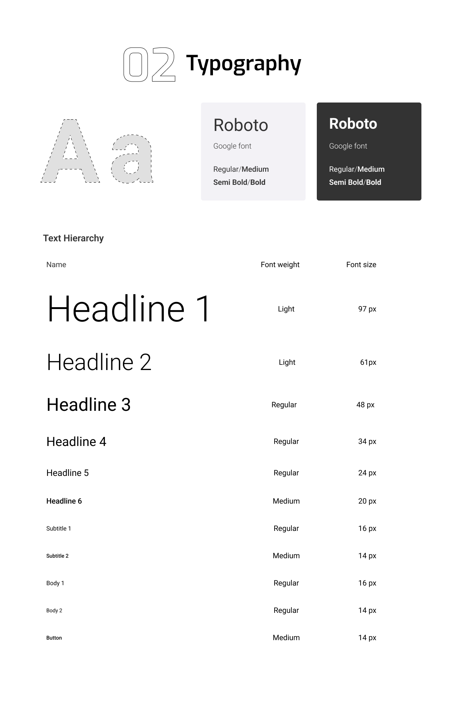

La tipografía seleccionada para WorkShop N-GINE es Roboto, un tipo de letra ampliamente utilizado en el diseño moderno por su versatilidad y claridad. Roboto es una fuente de Google que combina un estilo limpio, lo que facilita la legibilidad tanto en tamaños grandes como pequeños.

En cuanto al tono de comunicación, el uso de Roboto en varias dimensiones de peso y tamaño permite ajustar el tono visual de la interfaz de acuerdo con las necesidades de comunicación del momento. Para un tono más formal y serio, los tamaños más grandes y el uso de negritas (como en los encabezados) ayudan a establecer una jerarquía visual clara. En contraste, un tono más casual puede ser alcanzado utilizando tamaños más pequeños o regulares, lo que sugiere accesibilidad sin comprometer la profesionalidad.

Además, la neutralidad de Roboto contribuye a que la comunicación sea respetuosa, al mismo tiempo que puede adaptarse a momentos de entusiasmo o incluso irreverencia si se juega con variaciones en el tamaño, peso y uso del color en el texto. Esta flexibilidad es fundamental para un producto como WorkShop N-GINE, que necesita conectar con diferentes tipos de usuarios en tres contextos variados.

#### Tono de comunicación
El tono de comunicación adoptará un enfoque serio, formal, respetuoso y sereno. Este tono refuerza la percepción de profesionalismo, que es esencial en un sistema que maneja aspectos críticos de la gestión de talleres automotrices. Asimismo, al mantener una comunicación serena y respetuosa, se busca generar confianza en los usuarios, asegurándoles que están interactuando con una solución técnica avanzada. Además, este tono promueve un ambiente de tranquilidad, alineándose con la misión de ofrecer un servicio de alta calidad.

### 4.1.2. Web Style Guidelines

### Componentes

#### Menú desplegable de perfil

  

 
El componente es un menú desplegable de perfil en Workshop N-GINE, implementado utilizando el componente Dropdown de PrimeVue. Ubicado en ambos lados superiores de la pantalla, contiene íconos de usuario que permiten a los usuarios acceder y modificar su información de cuenta. Al hacer clic en estos íconos, se despliega un panel emergente donde se muestran diversas opciones y configuraciones relacionadas con el perfil del usuario.

#### Header

  

 
El componente es una barra de navegación implementada con Toolbar de PrimeVue, que incluye íconos de perfil con menús desplegables mediante Dropdown en ambos extremos. Estos permiten al usuario acceder a opciones de cuenta y configuraciones, manteniendo un diseño simple y funcional.

#### Botones rectangulares

  

 
El componente es un botón de acción principal, será implementado con Button de PrimeVue. Su diseño minimalista permite realizar acciones clave, como enviar formularios o confirmar procesos, manteniendo una apariencia clara y funcional.

#### Botones circulares

  

 
El componente es un conjunto de botones de acción implementado con Button y Icon de PrimeVue. Incluye opciones para eliminar, editar, cancelar y confirmar operaciones, permitiendo al usuario ejecutar las tareas vinculadas de manera intuitiva.

#### Campo de búsqueda

  

 
El componente es un campo de búsqueda implementado con InputText y Icon de PrimeVue. Permite al usuario realizar búsquedas dentro de la aplicación de manera clara y eficiente, con un diseño minimalista que incluye un ícono de lupa.

#### Input con label

  

 
El componente es un campo de entrada de texto, será implementado con InputText de PrimeVue. Se utilizará dentro de un formulario para capturar información de manera clara y funcional.

#### Sección de atajos

  

 
El componente es una sección de atajos implementada con Card y Button de PrimeVue. Facilita el acceso rápido a funciones importantes de la plataforma, como la creación de clientes y la programación de citas, permitiendo acciones rápidas y eficientes con botones claramente definidos.

#### Tarjeta de usuario

  

 
El componente es una tarjeta de perfil de usuario, diseñado para mostrar información clave sobre el usuario dentro de la plataforma, como el nombre, foto de perfil o roles asociados. Implementado con Card de PrimeVue, esta tarjeta utiliza un diseño limpio. Este tipo de componente será ideal para interfaces donde se requiere identificar rápidamente a los usuarios, permitiendo que se despliegue información básica del perfil, o se dé acceso a funcionalidades relacionadas con el usuario.

#### Tarjeta de tareas

  

 
Es una tarjeta de tareas para mecánicos, que será implementada con `Card` de PrimeVue. Muestra información clave como el cliente, vehículo, fecha y modalidad del servicio. Asimismo, incluye un enlace para acceder a más detalles de la tarea.

#### Menú desplegable

  

 
Será implementado con TieredMenu de PrimeVue. Facilita la navegación ofreciendo acceso rápido a las principales funciones de la plataforma a través de una lista organizada de opciones.

#### Tabla de columnas

  

 
El componente es una tabla de columnas a implementar con DataTable de PrimeVue. Permite organizar datos de manera estructurada, con opciones de ordenación en cada columna mediante flechas desplegables, facilitando la gestión de la información.

#### Tarjeta de notificación

  

 
Este componente de tarjeta de notificación puede implementarse utilizando `Card` de PrimeVue para estructurar la notificación, y puede complementarse con íconos que refuercen el tipo de alerta o mensaje. El diseño está orientado a destacar información clave para que el usuario gestione las notificaciones de manera eficiente.

#### Resumen de intervención

  

 
Este componente de resumen de intervención facilita la presentación de información importante como el tipo de intervención, los responsables y el tiempo invertido en la tarea. El uso de Card asegurará una disposición organizada para ofrecer a los usuarios acceso a los resultados de las actividades realizadas.

## 4.2. Information Architecture

### 4.2.1. Organization Systems
Para organizar de manera eficiente y completa nuestra aplicación Workshop N-GINE, utilizaremos jerarquía visual para crear un organizador visual basada en una estructura jerárquica para diseñar un sistema que cumpla con las necesidades del usuario.

***Dueño de Vehículo***

  

 

***Mecánico***

  

 

***Dueño de Taller***

  

  
Debido a la complejidad se han realizado tres organizadores visuales, uno por cada segmento objetivo. Analizando la organización para el dueño del taller: las secciones principales de esta organización son: Información, Personal, Clientes, Intervención, Obligación, Inventario, Métricas, y Notificaciones. 

Cada sección principal puede contener contenidos secundarios, que representan tanto las funcionalidades encargadas de activar eventos, por ejemplo, botones, como secciones secundarias que tienen sus propios contenidos. A modo de ejemplo tenemos la sección "Intervención", la cual tiene varios contenidos secundarios como formato, progreso, etc. Estos son elementos interactivos que en conjunto crear la sección "intervención". Existe un contenido secundario "Intervención X", que hace referencia a cuando se presiona una intervención dentro de la sección. Esto es una sección secundaria ya que al presionarlo genera una nueva sección con varios contenidos secundarios en ella.

También existen contenidos secundarios con los que se puede interactuar mediante la misma validación pero con diferentes condiciones que provoca distintos eventos. Estos contenidos secundarios aparecen con el color verde.

En Workshop N-GINE, utilizaremos esquemas de categorización de contenido para optimizar la experiencia del usuario por defecto, sin necesidad de que el usuario realice una acción de búsqueda o filtrado previa, lo cual agilizará la gestión de datos que tenga que realizar el usuario. Las categorizaciones de contenido utilizadas son las siguientes:

**Alfabético:** Utilizada para ordenar los clientes, personal, y el inventario. Permite al usuario buscar de una forma cómoda datos en los cuales el nombre es un elemento principal. 

**Cronológico:** Utilizada para ordenar las intervenciones, obligaciones, y notificaciones. Permite al usuario buscar datos en los cuales la fecha resulta una prioridad.

### 4.2.2. Labeling Systems

La interfaz de nuestra aplicación debe ser eficiente, pero también clara y sencilla para el usuario. Por ello las etiquetas utilizadas en nuestra aplicación deben de ser capaces de explicar en la menor cantidad de palabras su funcionalidad. Por ello hemos diseñado etiquetas para la navegación principal para las tres versiones de nuestra aplicación:

***Dueño del taller***

**Información:** Acceso a la información general del taller mecánico automotriz, con botones para editar, guardar y cancelar cambios.

**Personal:** Acceso a la información del personal que trabaja en el taller.

**Clientes:** Acceso a los datos de los clientes actuales del taller incluyendo su información general y  datos de sus vehículos.

**Intervención:** Acceso a las herramientas para visualizar las intervenciones que se están realizando en el taller junto con sus datos generales y sus estados de cumplimiento y/o crear nuevas intervenciones.

**Obligación:** Acceso a las intervenciones ya asignadas al personal según nivel de responsabilidad, las cuales se convierten en obligaciones. 

**Inventario:** Acceso al inventario del taller.
Métricas: Acceso a las métricas sobre el rendimiento del taller.

**Notificaciones:** Acceso a la lista de notificaciones para el usuario.

***Mecánico***

**Obligación:** Acceso a las intervenciones ya asignadas al personal según nivel de responsabilidad, las cuales se convierten en obligaciones. 

**Notificaciones:** Acceso a la lista de notificaciones para el usuario.

***Dueño de vehículo***

**Vehículos:** Acceso a los vehículos registrados del usuario con información detallada de estos

**Notificaciones:** Acceso a la lista de notificaciones para el usuario.

### 4.2.3. SEO Tags and Meta Tags

Como desarrolladores de aplicaciones web, valorizamos como nos vemos frente a los motores de búsqueda y buscamos cumplir con SEO (Search Engine Optimizarion), el proceso para mejorar la visibilidad de un sitio web. Para ello utilizamos Meta tags, elementos de html que proveen información personalizada sobre nuestro sitio web. Hemos usado las mismas meta tags tanto para nuestra Landing Page como para nuestra aplicación web, salvo por su contenido en dos meta tags específicos:

**Author:** Procedimiento estándar para definir el autor intelectual del sitio web: “YaraSoftware”

**Viewport:**  Controla la apariencia de la aplicación para que se adapte a diferentes tipos de dispositivos: “width=device-width, initial-scale=1.0”

**Charset:** Define el conjunto de caracteres utilizados: “UTF-8”

**Keywords:**** Define palabras clave que pueden ayudar a ser encontrados por el motor de búsqueda: “taller, mecánico, gestión, automotriz, organizar”

**Tittle:** Define el título con el que será visible en el navegador web como un resultado de búsqueda. La Landing Page y el sitio web tienen diferentes “Tittle”.

**Description:** Provee de una descripción breve de la página que es visible desde el navegador web debajo del título de la página. La Landing Page y el sitio web tienen diferentes “Description”.

***Landing Page***

**Tittle:** “Workshop N-GINE | Gestiona tu taller y clientes en una sola aplicación ”

**Description:** “Conoce nuestra aplicación de gestión de talleres mecánicos automotrices enfocado en brindar una buena experiencia a los talleres y sus clientes.”

***Web Application***

**Tittle:** “Sistema de gestión de taller de mecánica automotriz | Workshop N-GINE”

**Description:** “Workshop N-GINE es una propuesta para todos los dueños de talleres mecánicos automotrices que desean una herramienta que mejore su relación con sus clientes y al mismo tiempo les permita gestionar mejor su taller”

### 4.2.4. Searching Systems

Nuestras aplicaciones utilizaran sistemas de búsqueda avanzados para facilitar y mejorar la experiencia del usuario. Reconocemos que cuanta más información maneje una aplicación, más difícil le resulta al usuario poder trabajar a un nivel eficiente. Por ello nos hemos enfocado en implementar las siguientes herramientas que permitan a los usuarios manejar estos datos de forma rápida y simple:

**Búsqueda por palabra clave:** El usuario puede ingresar una palabra clave en un buscador y el sistema le mostrará coincidencias. Esta herramienta está implementada en las secciones principales Personal, Clientes, e Intervención.

**Filtro de intervenciones por estado:** El usuario puede apretar cuatro botones con filtros establecidos cuyos nombres son: “Pendientes”, “Progreso”, “Terminados”, “Todo”. Mediante estos, el usuario es capaz de filtrar y visualizar las intervenciones según su estado de culminación se forma rápida e intuitiva.

### 4.2.5. Navigation Systems

En Yara Software nos preocupamos por que la navegación resulte lo más eficiente y cómoda para el usuario. La navegación está enfocada en conceptos como la usabilidad para que resulte útil al usuario mediante una interfaz. Hemos utilizado las siguientes técnicas para la Landing Page y la Aplicación:

***Landing Page***

**Barra de Menú superior:** Se mantiene siempre en el superior de la página mientras se desplaza hacia abajo. Tiene enlaces a las secciones: Conoce más, Beneficios, Testimonios, Nosotros, Plan, Contáctanos.

**Scroll Down Interactivo:** Al interactuar con la página y ser redirigido a secciones de esta se producen transiciones y animaciones suaves.

**Call to Action:** En las secciones Home, Conoce más, y Plan se encuentran botones de “Comenzar” 

***Web Application***

**Navegación principal:** Mediante un menú desplegable que aparece a la izquierda de la página. Contiene botones que redirigen a las secciones principales de la aplicación como por ejemplo Personal, que muestra la información detallada sobre el personal que trabaja en el taller.

**Accesibilidad y Usabilidad:** Utilizamos el enfoque “Responsive Design” para que la navegación se mantenga eficiente al ser utilizada en desktop o dispositivos móviles. Empleamos tamaños de texto y contrastes de color adecuados para que la información de la interfaz se mantenga accesible dependiendo del nivel de habilidad visual del usuario. 

## 4.3. Landing Page UI Design

### 4.3.1. Landing Page Wireframe

#### Landing Page para Desktop Web Browser

En primer lugar, se presenta la landing page vista desde un navegador web en escritorio. Esta página incluye secciones importantes para el usuario, donde se destacan los beneficios del producto, los planes de pago disponibles, así como la misión, visión y valores de la startup. Además, se incorpora un apartado que muestra las experiencias de los clientes con la aplicación y un formulario que permite a los usuarios enviar cualquier consulta especifica.

 

  

 

  

 

  

 

  

 

  

 

  

 

  

 

  

#### Landing Page para Mobile Web Browser

Se presenta ahora la versión de la landing page optimizada para navegadores móviles. Esta mantiene los mismos contenidos que la versión de escritorio, pero adaptados a las proporciones de los dispositivos móviles. Contar con una landing page responsiva es fundamental, ya que facilita a los usuarios el acceso a la misma información sin dificultades, sin importar el dispositivo desde el cual ingresen.

 

  

 

  

 

  

### 4.3.2. Landing Page Mock-up

#### Landing Page para Desktop Web Browser

El wireframe de la landing page para la vista en navegador de escritorio fue útil para estructurar la disposición de los elementos. Con este esquema en mano, se desarrolló el mock-up de la página, manteniendo los mismos contenidos previamente descritos. En la siguiente imagen se puede observar cómo se aplicaron la paleta de colores primarios y secundarios, así como la tipografía previamente definida.

 

  

 

  

 

  

 

  

 

  

 

  

 

  

 

  

#### Landing Page para Mobile Web Browser

La versión mock-up de la landing page para navegadores móviles incorpora los mismos elementos descritos anteriormente. Se observa que el contraste de colores entre el fondo y el texto, junto con la tipografía elegida, garantiza una lectura fácil y comprensible tanto en dispositivos móviles como en escritorio.

 

  

 

  

 

  

## 4.4. Web Applications UX/UI Design

### 4.4.1. Web Applications Wireframes
Enlace para acceder al [Figma](https://www.figma.com/design/PqvO9VXswNOC5KVgjpDSql/Sketch?node-id=138-1515&t=UuW8xHide0QWH0vh-1)

### Web Application Wireframes para Desktop Web Browser

#### Wireframes asociados al dueño del taller

#### Iniciar sesión 
La imagen muestra la pantalla de inicio de sesión para la aplicación Workshop N-GINE. En esta sección, los usuarios pueden ingresar sus credenciales, como correo electrónico y contraseña, para acceder al sistema. Además, ofrece una opción para crear una cuenta nueva en caso de no estar registrado, invitando a los nuevos usuarios a unirse con el mensaje "¡Hola, Amigo!" y un botón para comenzar el proceso de registro.
 

  

#### Crear cuenta 
Esta imagen muestra la pantalla de creación de cuenta en Workshop N-GINE. Aquí, los usuarios que desean registrarse pueden completar sus datos, como nombre, correo electrónico, contraseña, y nombre del taller, para poder empezar a utilizar la plataforma. El lado izquierdo de la pantalla da la bienvenida a los usuarios recurrentes con el mensaje "¡Bienvenido de nuevo!" y proporciona la opción de iniciar sesión si ya tienen una cuenta creada.
 

  

#### Gestión de personal
En esta vista, se muestra una lista de los empleados registrados en el taller, presentados en formato de tarjetas. Cada tarjeta contiene el nombre del empleado. En la parte superior derecha, el usuario puede agregar nuevos mecánicos utilizando el botón "Nuevo mecánico", lo que permite un acceso rápido para añadir personal adicional.
 

  

#### Registro de nuevo mecánico
Esta imagen presenta el proceso de "Registro de nuevo personal" en Workshop N-GINE. Al seleccionar la opción "Nuevo mecánico", el dueño de taller puede ingresar los datos personales del nuevo empleado, como nombre, apellidos, tipo de documento, número de documento, edad y ubicación. Este formulario facilita la adición de nuevos miembros al equipo de trabajo, asegurando que toda la información relevante quede registrada.
 

  

#### Editar información de personal
En esta pantalla se ofrece al dueño del taller la posibilidad de ajustar los detalles de un miembro del equipo. Aquí se pueden editar campos importantes como el nombre, apellidos, documento de identidad, edad y ubicación del empleado. Además, se incluyen botones que permiten actualizar la información o eliminar al mecánico del sistema.
 

  

#### Seccion personal vacía
Cuando no hay personal registrado en el sistema, la pantalla mostrará un mensaje indicando la ausencia de personal. Se incluye un botón "Registrar" en el centro, que permite iniciar el proceso de incorporación del primer miembro del equipo de manera rápida
 

  

#### Gestión de clientes
La imagen muestra la sección "Gestión de Clientes", donde el administrador del taller puede visualizar una lista detallada de los clientes registrados. En esta interfaz, se presentan los datos esenciales como el nombre completo, número de documento, y dirección de correo electrónico de cada cliente. Además, se permite agregar nuevos clientes a través de un botón dedicado. Este sistema simplifica la organización y acceso rápido a la información de los clientes, optimizando la interacción y gestión de los datos de los mismos. 

  

#### Registro de nuevo cliente
En esta sección se permite al administrador registrar un nuevo cliente mediante un formulario sencillo que solicita datos personales como el nombre, apellidos, tipo y número de documento, así como la edad y ubicación. La opción de registro facilita la inclusión de nuevos clientes en el sistema de manera ágil, permitiendo que el taller mantenga actualizada su base de clientes con toda la información relevante. 

  

#### Información de clientes y vehículos

La imagen muestra la vista de "Información de Clientes y Vehículos", donde el administrador puede ver los detalles personales del cliente junto con la información de sus vehículos registrados en el sistema. Este formato ofrece una visión integral, permitiendo al taller gestionar tanto la información del cliente como de los vehículos en un solo lugar, optimizando la fluidez de la información y la eficiencia en el servicio al cliente. 

  

#### Registro de nuevo vehículo

El formulario para registrar un nuevo vehículo permite al administrador añadir vehículos a la cuenta del cliente de manera rápida y sencilla. Los campos a llenar incluyen la placa del vehículo, la marca y el modelo. Esto facilita la actualización continua de la base de datos vehicular del taller, mejorando la precisión y el control sobre los vehículos atendidos en el establecimiento. 

  

#### Registro de actividades del vehículo

La interfaz de "Registro de Actividades" muestra un resumen visual de las intervenciones o reparaciones realizadas en un vehículo a lo largo del tiempo. Cada intervención incluye su estado, la fecha de realización y un enlace para ver más detalles. Este registro ayuda al taller y al cliente a realizar un seguimiento claro y ordenado del historial de mantenimiento del vehículo, mejorando la transparencia y el servicio brindado. 

  

#### Información general de intervención
Esta pantalla presenta la sección de "Información General de Intervención", donde el administrador del taller puede visualizar y gestionar los detalles clave de una intervención en curso. Los campos incluyen la modalidad del servicio (reparación o mantenimiento), la fecha programada, el mecánico líder asignado y una descripción opcional. Además, el estado de la intervención se muestra claramente en la parte superior derecha, permitiendo al administrador controlar el progreso o la finalización del servicio. Esta vista es esencial para llevar un seguimiento preciso y efectivo de los trabajos realizados en el taller.
 

  

#### Resumen de intervención
La pantalla "Resumen de Intervención" permite ver el tipo de intervención realizada, junto con un campo de observaciones opcional para anotar detalles adicionales. Además, se presenta una lista de tareas relacionadas con la intervención, cada una con su respectivo estado para facilitar el control de avance. Esta vista está diseñada para que el administrador pueda tener una visión clara y detallada de todo el trabajo realizado en el vehículo, asegurando una correcta trazabilidad de las reparaciones y mantenimientos. 

  

#### Información IoT del vehículo

La sección de "Información IoT" permite al administrador y al cliente visualizar el estado técnico de los componentes del vehículo en tiempo real. Cada parte se clasifica según su estado y, en caso de fallos, se proporciona el código de error. Esta funcionalidad permite una gestión más proactiva y preventiva, ofreciendo datos actualizados que pueden ayudar a anticipar problemas mecánicos y mejorar el mantenimiento preventivo del automóvil. 

  

#### Intervención de vehículo

La imagen refleja la interfaz de gestión de una intervención, donde el administrador puede ingresar los detalles generales de la reparación o servicio que se está llevando a cabo. Los campos incluyen la modalidad del servicio, fecha programada, mecánico encargado y una descripción opcional. Esta sección permite al taller gestionar de manera eficiente los servicios realizados, con la posibilidad de modificar y actualizar información sobre la marcha. 

  

#### Resumen de intervención

En el resumen de intervención, se puede observar el tipo de trabajo realizado, las observaciones, y las tareas que componen la intervención mecánica. Este apartado brinda un resumen claro y detallado de cada intervención, lo que permite al personal del taller y al cliente visualizar fácilmente las tareas realizadas y el estado de cada una de ellas. Esta transparencia contribuye a un servicio más eficiente y comprensible para todas las partes involucradas. 

  

#### Inventario de existencias

En esta pantalla se presenta el inventario de existencias del taller, donde se detallan las partes disponibles, la cantidad en stock y su respectivo límite. El sistema permite realizar un seguimiento detallado de los componentes disponibles, lo que ayuda a mantener el taller abastecido y evita la escasez de productos críticos. Además, se permite eliminar partes innecesarias o que ya no están en stock. 

  

#### Solicitudes de inventario

La interfaz de "Solicitudes de Inventario" ofrece una vista detallada de las solicitudes de partes o componentes por parte de los mecánicos o administradores del taller. Se incluyen detalles como la cantidad solicitada, la ID de la intervención relacionada, la fecha de la solicitud y observaciones adicionales. Esto facilita la gestión y el control del flujo de materiales dentro del taller, asegurando que se cumplan las demandas en tiempo y forma. 

  

#### Métricas de intervenciones por día

En la pantalla de "Métricas de intervenciones por día", el administrador puede visualizar el número de intervenciones realizadas en el taller durante cada día de la semana. Esta información es crucial para comprender los picos de demanda y optimizar la planificación de las intervenciones, permitiendo una mejor organización y uso de los recursos disponibles en el taller. 

  

#### Métricas de intervenciones por mes

La imagen refleja las "Métricas de intervenciones por mes", proporcionando una visión más amplia sobre el rendimiento del taller a lo largo de varios meses. Con esta información, el administrador puede detectar patrones de demanda estacionales o fluctuaciones en el volumen de trabajo, permitiendo ajustar la capacidad operativa del taller de manera efectiva. 

  

#### Distribución de vehículos por marca

En esta sección, se presenta un gráfico de torta que muestra la distribución porcentual de los vehículos atendidos en el taller, desglosada por marca. Esta información permite al administrador identificar qué marcas de vehículos son más frecuentes en el taller, lo que puede ayudar en la planificación de inventarios y en la especialización de los servicios ofrecidos. 

  

#### Notificaciones

La pantalla de "Notificaciones" muestra las alertas importantes para el administrador del taller, como recordatorios de citas, actualizaciones de estado de intervenciones, o avisos sobre inventario. Cada notificación incluye la hora y la fecha en la que fue emitida, así como un enlace para ir a la sección correspondiente y gestionar la acción requerida. 

  

#### Wireframes asociados a los mecánicos

#### Mis tareas
La sección Mis Tareas está diseñada para que los usuarios tengan un seguimiento detallado de las intervenciones asignadas. A través de una lista organizada, se muestra información clave como el cliente, el vehículo, la modalidad de reparación, el tipo de tarea asignada, y su estado actual.
 

  

#### Primera etapa de una intervención como lider
La primera etapa se enfoca en la recopilación de la información general del vehículo y el cliente, junto con un diagnóstico detallado proporcionado por el sistema IoT. En esta vista, se presentan los componentes del vehículo que muestran fallas, así como su estado y los códigos de falla registrados. Esta información es crucial para definir los próximos pasos en el proceso de intervención.
 

  

#### Segunda etapa de una intervención como lider
En esta fase, Diagnóstico y preparación, los mecánicos asignados pueden visualizar y distribuir las tareas necesarias para completar la intervención. También se muestra el diagnóstico del vehículo, donde se identifica el tipo de reparación necesario y se pueden añadir observaciones específicas. Los mecánicos pueden gestionar las tareas distribuidas a cada uno para asegurar un control preciso del trabajo.
 

  

#### Tercera etapa, Ejecución
En la fase de Ejecución, el progreso de las tareas asignadas se puede revisar de manera estructurada. Los mecánicos pueden agregar puntos de control para marcar las tareas finalizadas, así como solicitar repuestos específicos para completar la intervención.
 

  

#### Cuarta etapa - supervisión
En la fase final de Supervisión, se realiza un seguimiento del estado de todas las tareas completadas y pendientes. El jefe de taller o mecánico líder puede verificar que todas las intervenciones se hayan realizado de manera correcta y según lo planeado. Además, se muestra un resumen del tiempo total avanzado, lo que permite una evaluación de la eficiencia en el proceso de reparación.
 

  

#### Notificaciones
La sección Notificaciones ofrece un resumen rápido de las actualizaciones importantes para el equipo de trabajo. Desde recordatorios sobre intervenciones hasta cambios en las tareas asignadas, los mecánicos y gestores pueden mantenerse informados de cualquier evento relevante. Cada notificación está organizada por fecha y hora para garantizar un flujo de trabajo ágil.

  

#### Wireframes asociados al cliente de taller

#### Vehículos
En esta sección, los usuarios pueden visualizar una lista de sus vehículos registrados. Cada tarjeta de vehículo muestra información importante como el modelo, la marca, la última revisión y el estado actual de la cita. Si un vehículo tiene una cita pendiente, el usuario podrá notarlo fácilmente y proceder a agendar o verificar más detalles.
  
  

#### Registro de actividades
Aquí se pueden observar las intervenciones pasadas realizadas en el vehículo. Cada una está representada en una línea de tiempo, facilitando la identificación rápida de intervenciones completadas. El usuario puede acceder a detalles adicionales de cada intervención y ver los técnicos responsables de cada servicio.
  
  

#### Información IoT
Se incluye un monitoreo en tiempo real del estado de cada componente del vehículo. El sistema IoT detecta y reporta cualquier fallo en los componentes, mostrando los códigos de error asociados y facilitando así el diagnóstico y la reparación del vehículo.
  
  

#### Nueva Intervención
La opción de "Nueva Intervención" permite a los usuarios agendar citas para intervenciones en sus vehículos. El usuario deberá seleccionar la placa del vehículo, la modalidad de servicio, la fecha de la intervención y una descripción opcional para proporcionar más contexto sobre el servicio que se solicita.
  
  

#### Registro Nuevo Carro
Si un usuario desea añadir un vehículo nuevo, esta opción facilita el registro. El usuario solo necesita proporcionar la placa del vehículo, la marca y el modelo para crear el registro. Posteriormente, el vehículo será visible en la lista principal.
  
  

#### Detalles de la intervención
El historial de intervenciones permite al usuario revisar el estado de cada tarea realizada en el vehículo. Se detalla la fecha, el técnico encargado y el estado de la intervención. También se puede visualizar notas relacionadas con la intervención en curso.
  
  

  
  

### 4.4.2. Web Applications Wireflow Diagrams

Enlace para acceder al [Lucid Chart](https://lucid.app/lucidchart/fb26e9b9-b73b-458c-a066-ce7342dd4275/edit?viewport_loc=-22784%2C-3867%2C43177%2C23208%2C0_0&invitationId=inv_2df26de4-6d0c-46fb-9c95-77201218901e)

#### User goal: Registro de cuenta
User persona: Dueño de taller

Explicación del flujo: El flujo de registro de cuenta en WorkShop N-GINE comienza con una pantalla de bienvenida que solicita al dueño del taller iniciar sesión o, si no tiene una cuenta, registrarse. Al presionar el botón "Crear cuenta", el usuario es redirigido a un formulario donde ingresa su nombre, correo electrónico y contraseña. Tras completar estos datos y hacer clic en "Crear", el usuario es llevado al panel principal de la aplicación, donde puede acceder a secciones clave como Personal, Clientes, Intervenciones, Mis Tareas, Inventario, Métricas y Notificaciones. La primera vista disponible es la sección de Personal vacia.
 

  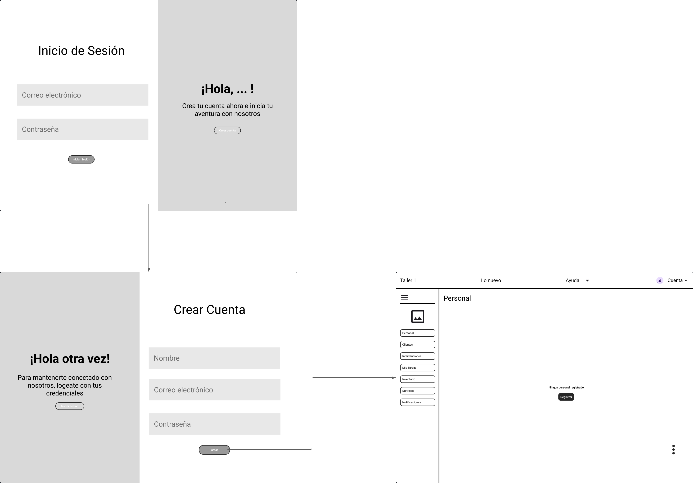

#### User goal: Acceder a la cuenta
User persona: Dueño de taller, cliente de taller,  mecánico

Explicación del flujo: El flujo de acceso a la cuenta en WorkShop N-GINE comienza en la pantalla de Inicio de sesión, donde el usuario (dueño de taller, mecánico o cliente) ingresa su correo electrónico y contraseña. Si ya tiene una cuenta, hace clic en Iniciar sesión. En caso contrario, puede elegir crear una nueva cuenta mediante el botón de registro. Una vez que el usuario accede, el sistema pregunta cuál es su rol (dueño, mecánico o cliente), lo que determina las funcionalidades a las que podrá acceder. Si es dueño del taller, el usuario es redirigido al panel de Personal, donde puede gestionar el equipo de trabajo. Si es mecánico o cliente, el flujo lo dirige a la sección correspondiente, como la gestión de Vehículos o las Obligaciones del taller.
 

  

#### Registrar personal
User persona: Dueño de taller

Explicación del flujo: Para registrar personal en el sistema, el dueño del taller accede a la sección de "Personal" desde el menú principal. Si no hay personal registrado, se muestra un botón de "Registrar" en el centro de la pantalla. Si ya existen registros, el usuario puede agregar un nuevo miembro del personal haciendo clic en el botón "Nuevo mecánico", ubicado en la esquina superior derecha de la ventana de "Personal". Al hacer clic, se despliega un formulario emergente que solicita información relevante del nuevo empleado, como nombre, apellidos, tipo y número de documento, edad y ubicación. Una vez que se completan todos los campos requeridos, el dueño del taller selecciona el botón "Crear". El nuevo miembro del personal queda registrado y aparece en la lista de empleados.
 

  

#### Registrar cliente
User persona: Dueño de taller

Explicación del flujo: Para registrar a un cliente en el sistema, el dueño de taller inicia el flujo desde la ventana de "Clientes" dentro del sistema. Desde esta vista, el usuario puede visualizar una lista de los clientes existentes, con información como nombre completo, número de documento y correo electrónico. Para agregar un nuevo cliente, el dueño de taller selecciona el botón "Nuevo cliente" en la esquina superior derecha de la pantalla. Al hacer clic en este botón, se despliega un formulario emergente donde el usuario debe ingresar los datos del nuevo cliente, como nombre, apellidos, tipo de documento, número de documento, edad y ubicación. Una vez completados todos los campos requeridos, el usuario hace clic en el botón "Crear". El nuevo cliente queda registrado en el sistema y su información se refleja en la lista principal de clientes
 

  

#### User Goal: Registrar vehículos de clientes.
User Persona: Dueño de taller.

Explicación del flujo: El flujo comienza cuando el dueño del taller accede a la interfaz de Clientes y selecciona un cliente específico para visualizar o actualizar la información de sus vehículos. Dentro del perfil del cliente, hay una sección donde se listan los vehículos asociados a dicho cliente, mostrando información relevante como marca, modelo, placa y estado del vehículo.

Para registrar un nuevo vehículo, el dueño del taller hace clic en el botón "Agregar vehículo". Esto despliega un formulario que solicita información como la marca, el modelo, el número de placa, año de fabricación, y cualquier otra información relevante. Una vez que se ha completado el formulario correctamente, el dueño del taller hace clic en "Registrar". El sistema valida la información y, si es correcta, el vehículo se asocia automáticamente al cliente correspondiente y aparece en la lista de vehículos registrados. El formulario se cierra, y el dueño del taller puede visualizar el nuevo vehículo en el perfil del cliente.
 

  

#### Visualizar la lista de empleados
User persona: Dueño de taller

Explicación del flujo: Para visualizar la lista de empleados, el dueño del taller accede a la sección de "Personal" desde el menú principal, ubicado en el lateral izquierdo de la pantalla. Al ingresar a esta sección, se despliega una vista general que muestra todas las tarjetas de los empleados registrados, organizadas en formato de cuadrícula. Cada tarjeta contiene la información básica del empleado, como su nombre. En la parte superior, el dueño del taller cuenta con un campo de búsqueda que le permite filtrar la lista de empleados por palabras clave, facilitando la localización rápida de un empleado específico.
 

  

#### Manejar información de empleados
User persona: Dueño de taller

Explicación del flujo: el dueño del taller accede a la sección de "Personal" desde el menú principal. En esta pantalla se despliegan las tarjetas de los empleados registrados. Al seleccionar una tarjeta de empleado, se abre un formulario emergente con la información completa del empleado, incluyendo campos como nombre, apellidos, tipo de documento, número de documento, edad y ubicación. El dueño del taller puede editar los datos y luego elegir entre dos opciones: actualizar la información del empleado o eliminarlo del sistema.
 

  

#### Visualizar lista de clientes.
User persona: dueño de taller

Explicación del flujo: el dueño del taller accede a la sección de "Clientes" desde el menú principal. En esta pantalla se muestra una tabla que incluye información relevante de cada cliente, como su nombre completo, número de documento y correo electrónico. El dueño del taller puede ordenar y filtrar la información utilizando la barra de búsqueda o las flechas desplegables en los encabezados de las columnas. Esto facilita la gestión y consulta rápida de los datos de los clientes registrados en el sistema
 

  

#### User Goal: Manejar información de clientes.
User Persona: Dueño de taller.

Explicación del flujo: el dueño del taller accede a la sección "Clientes" desde el menú principal. Una vez en esta vista, selecciona un cliente de la lista, lo que le redirige a una nueva pantalla donde se muestran los detalles completos del cliente seleccionado, incluyendo nombre, apellidos, tipo de documento, número de documento, correo electrónico, edad y ubicación. En esta vista, el dueño del taller tiene la opción de guardar los datos modificados del cliente. Además, se muestra una sección donde puede visualizar los vehículos asociados al cliente.
 

  

#### User goal: Acceder al registro de intervenciones de un carro.
User persona: Dueño de taller

Explicación de flujo: el usuario comienza desde la interfaz principal del taller y accede a la sección de Clientes, donde puede seleccionar un cliente y visualizar su información personal, junto con una lista de los vehículos asociados. Al hacer clic en uno de los vehículos registrados, se despliega una nueva vista con los detalles del vehículo, incluyendo una línea de tiempo que muestra el historial de todas las intervenciones realizadas en ese vehículo, organizadas de manera cronológica.

El usuario puede revisar esta línea de tiempo para obtener una visión general de las intervenciones. Al hacer clic en una intervención específica, se accede a una vista detallada de la intervención, que incluye la modalidad, la fecha programada, los mecánicos asignados, y una descripción del trabajo realizado. Si la intervención ya está finalizada, se muestra con el estado correspondiente en el encabezado. Además, en esta sección, se puede visualizar la secuencia de tareas asignadas y completadas durante la intervención, permitiendo al usuario ver el progreso o el resultado final del trabajo realizado en su vehículo.
 

#### User goal: : Acceder a información de dispositivo IoT.
User persona: Dueño de taller

Explicación del flujo: Al seleccionar un cliente específico, se despliega la información personal del cliente, incluyendo los vehículos que tiene asociados. El usuario, dueño de taller, selecciona uno de los vehículos registrados para acceder a su información detallada. Una vez seleccionado el vehículo, el dueño del taller accede a una interfaz donde puede ver el registro de actividades o elegir la opción de "Información IoT". Esta última pestaña despliega todos los datos capturados por el dispositivo IoT instalado en el vehículo, proporcionando información detallada sobre los diferentes componentes del auto, su estado actual, y cualquier código de falla detectado. Esta información se presenta de manera clara y organizada, permitiendo que el dueño del taller tenga una visión rápida del estado del vehículo sin necesidad de realizar inspecciones manuales.
 

  

#### User goal: Agendar cita
User persona: Cliente de taller

Explicación del flujo: El flujo comienza cuando el usuario accede a la pantalla de "Intervenciones" en la cual se muestra una lista de las intervenciones actuales, organizadas en categorías como pendientes, en progreso, y terminadas. Para agendar una nueva intervención, el usuario hace clic en el botón "Agendar intervención". Esto abre un formulario donde el usuario puede ingresar los datos requeridos, como el número de documento del cliente, la placa del vehículo, la modalidad de intervención, la fecha, el mecánico líder asignado, y una descripción opcional. Una vez que el formulario está completo, el usuario hace clic en "Agendar" para confirmar la cita. Si los campos ingresados son correctos, se registra la intervención y se muestra un mensaje de éxito indicando que la cita fue agendada con éxito. Finalmente, la nueva intervención se añade automáticamente a la lista de intervenciones en la pantalla principal. 
 

  

#### User Goal: Visualizar intervenciones
User Persona: Dueño de taller.

Explicación del flujo: el dueño del taller accede a la sección "Intervenciones" desde el menú principal. Al cargar esta interfaz, se muestra una lista de todas las intervenciones registradas, con información relevante como el cliente, el auto, la modalidad del servicio, la fecha de registro, la fecha de intervención, y el estado de la misma (pendiente, en progreso, o terminada). El usuario puede utilizar la barra de búsqueda para filtrar intervenciones por palabras clave, lo que le permite encontrar intervenciones específicas más rápidamente. También tiene la opción de filtrar por estado de la intervención utilizando los botones de estado en la parte superior de la lista (pendientes, en progreso, terminadas, o todas). Si lo desea, puede ordenar las intervenciones al hacer clic en cualquiera de los campos de la tabla, como el nombre del cliente, el auto, o las fechas.
 

  

#### User Goal: Gestionar intervenciones
User Persona: Dueño de taller.

Explicación del flujo: el dueño del taller accede a la sección de "Intervenciones" desde el menú principal, donde puede visualizar todas las intervenciones registradas, ya sea pendientes, en progreso o terminadas. Al hacer clic en "Agendar intervención", se despliega un formulario para crear una nueva intervención. En este formulario, el dueño del taller debe completar información del cliente, como el número de documento, la placa del vehículo, la modalidad del servicio, la fecha de la intervención, el mecánico líder, y una descripción del servicio. Una vez completado el formulario y validada la información, el usuario puede hacer clic en "Agendar" para registrar la intervención. Esta nueva intervención aparecerá automáticamente en la lista con el estado "pendiente", facilitando la organización de las tareas y la asignación de responsabilidades a los mecánicos del taller. 
 

  

#### User Goal: Visualizar detalles de intervención
User Persona: Dueño de taller.
Explicación del flujo: El flujo de "Visualizar detalles de intervención" comienza cuando el dueño de taller accede a la lista de intervenciones pendientes, en progreso o terminadas. Al hacer clic en una intervención específica, se despliega una vista detallada que contiene dos pestañas principales: "Información general" y "Resumen de intervención." En la pestaña "Información general," el dueño de taller puede ver todos los datos clave de la intervención, tales como el cliente asociado, la placa del vehículo, la marca y modelo del auto, la modalidad del servicio (por ejemplo, reparación o mantenimiento), la fecha programada y el mecánico líder a cargo. Además, puede agregar observaciones opcionales relacionadas con la intervención en curso. En la pestaña "Resumen de intervención," se presenta un desglose de las tareas asignadas al equipo de mecánicos. El dueño de taller puede revisar el tipo de intervención y las observaciones relevantes del trabajo, así como una lista detallada de las tareas completadas y pendientes. Cada tarea está etiquetada con el nombre del mecánico asignado y el estado correspondiente (completado o pendiente), lo que permite una supervisión efectiva del progreso.
 

  

### User Goal: Gestionar solicitudes de inventario
User persona: dueño de taller
Explicación del flujo: En el flujo de gestión de solicitudes de inventario, el dueño del taller accede a la sección de "Inventario" desde el menú lateral, donde puede visualizar dos pestañas principales: "Existencias" y "Solicitudes". Al entrar en la pestaña de "Solicitudes", el dueño del taller visualiza todas las solicitudes realizadas por los mecánicos, mostrando información clave como el nombre de la parte solicitada, la cantidad requerida, el nombre del mecánico solicitante, y la fecha de solicitud. El dueño puede seleccionar una o más solicitudes pendientes para resolverlas. Al hacer clic en el botón de "Resolver solicitudes", que es una checkbox, y a posterior se presiona el icono representativo de "Guardar", las solicitudes seleccionadas desaparecen de la lista y se notifica a los mecánicos correspondientes que las piezas solicitadas han sido aprobadas o resueltas. El flujo también permite ordenar las solicitudes por diferentes criterios, como nombre de la pieza o cantidad solicitada, facilitando la gestión eficiente del inventario y asegurando que el taller cuente con los repuestos necesarios para las intervenciones pendientes.
 

  

#### User goal: Obtener métricas de rendimiento.
User Persona: Dueño de taller.

Explicación del flujo: Comienza en la interfaz de métricas, a la cual el usuario accede desde el menú principal. En esta pantalla, el dueño de taller puede visualizar gráficos con datos clave que muestran el rendimiento de su negocio. El primer gráfico presenta el número de intervenciones por día, permitiendo al usuario identificar los días más ocupados en el taller y, por lo tanto, optimizar la distribución de recursos. Al seleccionar diferentes opciones en el menú desplegable, el dueño puede cambiar la visualización a intervenciones por mes, lo que proporciona una visión a largo plazo del rendimiento del taller. Finalmente, el usuario también puede consultar gráficos de distribución porcentual de vehículos por marca, lo que le permite analizar las marcas de vehículos que más frecuentemente son atendidas.
 

  

#### User goal: Recibir notificaciones
User Persona: Dueño de taller, mecánico, cliente de taller

Explicación del flujo: En el flujo de recibir notificaciones, el usuario accede a la sección de "Notificaciones" desde el menú lateral. Al cargar la interfaz, se muestran todas las notificaciones que ha recibido, con información relevante como la fecha, la hora, el evento relacionado y un vínculo que lo lleva a la sección correspondiente. Las notificaciones están dispuestas en tarjetas individuales, organizadas en una lista vertical, lo que facilita la visualización cronológica de los eventos importantes. Si el usuario desea obtener más detalles sobre una notificación, puede hacer clic en el vínculo de "Ve a la sección", lo que lo redirige a la interfaz correspondiente dentro de la aplicación, permitiéndole tomar acciones o revisar información relacionada con la notificación recibida.
 

  

#### User Goal: Visualizar tareas pendientes como mecánico lider 
User Persona: Mecánico.

Explicación del flujo: En el flujo de visualización de tareas pendientes como mecánico líder, el usuario, que es un mecánico, accede a la sección "Mis Tareas" desde el menú lateral de la aplicación. Al ingresar, se carga una tabla con las tareas pendientes en las que el mecánico es líder, organizadas con campos como identificador de tarea, cliente, auto, fecha, modalidad, tipo de tarea y estado. Si el mecánico desea más información sobre alguna tarea específica, puede hacer clic en la tarea, lo que lo lleva a una pantalla detallada de la intervención. En esta pantalla, se despliegan las secciones clave como la información general del cliente y el vehículo, los detalles del diagnóstico y preparación, la ejecución de la intervención, y la supervisión de los procesos. Este flujo permite al mecánico tener una visión clara de sus responsabilidades, ayudando a gestionar de manera eficiente las intervenciones pendientes bajo su liderazgo.
 

  

#### User Goal: Visualizar tareas pendientes como mecánico asistente
User Persona: Mecánico.

Explicación del flujo: El mecánico accede a la sección "Mis Tareas" desde el menú lateral de la aplicación. Al ingresar, se carga una tabla con todas las tareas asignadas al mecánico, organizadas con campos como identificador de tarea, cliente, auto, fecha, modalidad, tipo de tarea y estado. El mecánico puede identificar fácilmente las tareas pendientes, ya que están claramente etiquetadas como "pendientes" o "en progreso". Si el mecánico necesita más detalles sobre alguna tarea específica, puede hacer clic en la tarea, lo que lo redirige a una pantalla detallada de la intervención. En esta pantalla, se despliega la información general del cliente y del vehículo, así como la etapa de ejecución de la intervención. 
 

  

#### User goal: Consultar información de intervención
User persona: Mecánico

Explicación de flujo: En este flujo de consulta de información de intervención, el mecánico comienza en la interfaz de "Mis Tareas" donde se despliega una lista de intervenciones asignadas. Al seleccionar una intervención específica, el mecánico es redirigido a una pantalla con la información detallada de la intervención. Esta pantalla contiene varias secciones clave. En primer lugar, la "Información General", que incluye detalles del cliente, el vehículo, la modalidad del servicio, las fechas de registro, inicio y finalización, y una descripción del servicio. A continuación, el mecánico puede acceder a la sección de "Información IoT", donde se muestra un resumen del análisis OBD-IoT del vehículo, indicando el estado de los componentes y los códigos de error detectados. Adicionalmente, se presenta una lista de "Intervenciones Anteriores", lo que permite al mecánico revisar registros históricos relacionados con el vehículo. Si desea ver más detalles sobre alguna intervención previa, el mecánico puede hacer clic en "Leer más", accediendo a una vista detallada de esa intervención específica. Cuando el mecánico selecciona "Leer más" en la lista de intervenciones anteriores, accede a una vista detallada de la intervención específica. Esta vista está diseñada para proporcionar información clave que permita comprender en profundidad lo ocurrido durante la intervención pasada. En la parte superior de la pantalla, se muestran los detalles generales como el tipo de intervención (por ejemplo, reparación o mantenimiento), la fecha en que se realizó y el mecánico responsable de dicha intervención. En la sección de detalles técnicos, el mecánico puede ver un desglose de las tareas realizadas durante esa intervención, con información sobre los componentes del vehículo que fueron diagnosticados o reemplazados, junto con el estado final de esos componentes (por ejemplo, "reparado", "reemplazado", "sin cambios"). Si durante la intervención se detectaron códigos de error específicos mediante el sistema OBD-IoT, también se muestran estos códigos junto con su descripción, ayudando al mecánico a entender el problema que se atendió. Adicionalmente, se proporciona un campo de observaciones, donde el mecánico anterior pudo haber registrado notas importantes o recomendaciones para intervenciones futuras. Esto es especialmente útil para dar seguimiento a posibles problemas recurrentes o recomendaciones de mantenimiento preventivo.
 

  

#### User goal: Modelar diagnóstico de intervención.
User Persona: Mecánico.

Explicación de flujo: En la interfaz de diagnóstico y preparación de una intervención, el mecánico líder tiene la capacidad de modelar el diagnóstico de la intervención. Este flujo comienza con la visualización de las tareas asignadas para la intervención. El sistema carga la lista de tareas que se deben realizar, cada una de ellas asociada a un mecánico asignado. Si el mecánico desea añadir una nueva tarea, puede hacerlo completando un campo de texto con la descripción de la tarea, seleccionando un mecánico responsable y haciendo clic en el botón "Agregar". Esto añadirá la tarea a la lista y restablecerá el campo de texto para que pueda añadir otra tarea de manera inmediata. El flujo también incluye opciones para guardar los cambios realizados en las tareas. Al hacer clic en el icono de "Guardar cambios", el sistema registrará las modificaciones realizadas y mostrará un mensaje de éxito ("Cambios guardados"), confirmando que las tareas actualizadas han sido guardadas correctamente en el sistema.
 

  

#### User goal: Controlar ejecución de tareas
User persona: Mecánico

Explicación de flujo: El flujo comienza en la pestaña "Solicitudes de repuesto" dentro de la interfaz de ejecución de la intervención. Al ingresar, el mecánico tiene acceso a una lista de solicitudes de repuestos necesarios para completar las tareas asignadas a la intervención. Cada solicitud incluye detalles como el nombre del mecánico solicitante, el repuesto requerido, la cantidad solicitada y el estado actual de la solicitud.

En esta etapa, el mecánico puede agregar nuevas solicitudes de repuestos mediante un formulario que permite seleccionar el repuesto necesario, verificar la cantidad disponible en el inventario, y definir la cantidad requerida. Una vez completada la información, el mecánico puede hacer clic en "Agregar" para incluir la nueva solicitud a la lista.

Además, el mecánico tiene la opción de actualizar el estado de las solicitudes ya existentes. Puede seleccionar una o varias solicitudes, y luego hacer clic en "Guardar cambios" para confirmar que los repuestos solicitados han sido gestionados. Esto también notifica a los mecánicos correspondientes que las piezas solicitadas están disponibles, permitiendo continuar con las tareas asignadas.

Si el mecánico realiza cambios pero decide revertirlos antes de guardarlos, puede hacer clic en "Deshacer", lo que restaurará la lista de solicitudes al estado previo antes de las modificaciones. Una vez que todas las solicitudes de repuestos hayan sido atendidas, el mecánico puede proceder al seguimiento del avance de la intervención o continuar con la ejecución de las tareas pendientes.
 

  

#### User goal: Verificar cumplimiento de tareas
User persona: Mecánico

Explicación del flujo: El flujo de "Verificar cumplimiento de tareas" comienza en la pestaña de Ejecución dentro de una intervención. En esta etapa, el mecánico líder accede al seguimiento de las tareas asignadas y revisa su estado. A medida que las tareas son completadas por los mecánicos asignados, el estado de cada tarea se actualiza en tiempo real, mostrando si están en progreso, pendientes o finalizadas. Una vez que todas las tareas en la pestaña de Ejecución han sido completadas, el mecánico líder puede pasar a la pestaña de Supervisión, que ofrece una visión más detallada del progreso total de la intervención. En esta pestaña, se muestra un resumen de todas las tareas realizadas, los tiempos registrados y el estado final de cada una. Si todas las tareas han sido completadas con éxito, el sistema habilita el botón "Finalizar" en la parte superior. Al hacer clic en este botón, el mecánico líder puede finalizar la intervención, lo que cambia su estado a "Finalizada" en todo el sistema. Finalmente, el sistema redirige al usuario a la ventana de tareas.
 

  

#### User Goal: Registrar su propio vehículo.
User Persona: cliente de taller.

Explicación del flujo: El flujo inicia cuando el dueño del carro, como cliente del taller, accede a su perfil dentro de la aplicación y navega a la sección de Mis Vehículos. Si ya tiene vehículos registrados, se despliega una lista que muestra detalles de cada vehículo como marca, modelo, placa, estado de mantenimiento, entre otros.

Si el dueño del carro desea agregar un nuevo vehículo, hace clic en el botón "Agregar vehículo", lo que abre un formulario para introducir la información del nuevo vehículo, como marca, modelo, número de placa, año de fabricación y otros detalles necesarios. Una vez que el cliente ha llenado todos los campos obligatorios correctamente, hace clic en "Registrar". El sistema valida la información ingresada, y si todo está en orden, el nuevo vehículo se agrega a la lista de vehículos registrados del cliente. El formulario se cierra automáticamente, y el cliente puede ver el nuevo vehículo registrado en su sección de Mis Vehículos, con la opción de monitorear su estado o programar futuras intervenciones en el taller.
 

  

#### User goal: Acceder al registro de intervenciones de un carro.
User persona: Cliente de taller

Explicación de flujo: el usuario comienza desde la vista principal de sus vehículos registrados. Puede seleccionar uno de sus vehículos para visualizar su información detallada y el historial de intervenciones. Una vez seleccionado el vehículo, se despliega una nueva interfaz que muestra una línea de tiempo cronológica con todas las intervenciones asociadas al vehículo, permitiendo al usuario ver rápidamente un resumen de cada intervención, como la fecha y el tipo de servicio realizado.

Al hacer clic en una intervención específica dentro de esta línea de tiempo, el usuario accede a los detalles completos de la intervención. En esta vista detallada, se muestra toda la información relevante de la intervención, como la modalidad, la fecha programada, el mecánico líder, las observaciones adicionales, y el estado de la intervención. Además, el usuario puede acceder a un resumen de las tareas ejecutadas durante la intervención, con un desglose de las tareas y su estado actual.
 

  

#### User goal: : Acceder a información de dispositivo IoT.
User persona: Cliente de taller

Explicación del flujo: El flujo comienza cuando el cliente del taller accede a la pantalla de "Vehículos", donde puede visualizar los autos que ha registrado, junto con información básica como la fecha de la última revisión y cualquier cita pendiente. Al seleccionar uno de los vehículos, el cliente es dirigido a una nueva pantalla que ofrece dos opciones: "Registro de Actividades", que muestra el historial de intervenciones, y "Información IoT", que permite consultar el estado actual del vehículo. Al elegir "Información IoT", se despliega un panel con el estado de los distintos componentes del automóvil, acompañado de los códigos de error que han sido generados por el sistema. Esta información permite al cliente evaluar rápidamente el estado de su vehículo y, si es necesario, tomar la decisión de agendar una cita para mantenimiento o reparación. 
 

  

#### User goal: Agendar cita
User persona: Cliente de taller

Explicación del flujo: El flujo para agendar una cita como cliente de taller comienza en la pantalla de detalles del vehículo, asociada a la opción Carros, donde el usuario visualiza el historial de intervenciones y la información IoT. El usuario selecciona el vehículo correspondiente y accede a la opción "Agendar cita". Al hacer clic, se despliega un formulario donde el usuario debe ingresar la información relevante, como la placa del vehículo, la modalidad de la intervención (por ejemplo, reparación o mantenimiento), la fecha deseada y una descripción opcional de la intervención. Una vez que el usuario completa el formulario, hace clic en el botón "Agendar". Si los datos son correctos, la cita se registra en el sistema y se muestra un mensaje de éxito que indica que la cita ha sido agendada correctamente.
 

  

### 4.4.3. Web Applications Mock-ups
Enlace para acceder al [Figma](https://www.figma.com/design/PqvO9VXswNOC5KVgjpDSql/Sketch?node-id=138-1515&t=UuW8xHide0QWH0vh-1)

#### Mock-ups asociados al dueño del taller

#### Iniciar sesión 
La imagen muestra la pantalla de inicio de sesión para la aplicación Workshop N-GINE. En esta sección, los usuarios pueden ingresar sus credenciales, como correo electrónico y contraseña, para acceder al sistema. Además, ofrece una opción para crear una cuenta nueva en caso de no estar registrado, invitando a los nuevos usuarios a unirse con el mensaje "¡Hola, Amigo!" y un botón para comenzar el proceso de registro.
 

  

#### Crear cuenta 
Esta imagen muestra la pantalla de creación de cuenta en Workshop N-GINE. Aquí, los usuarios que desean registrarse pueden completar sus datos, como nombre, correo electrónico, contraseña, y nombre del taller, para poder empezar a utilizar la plataforma. El lado izquierdo de la pantalla da la bienvenida a los usuarios recurrentes con el mensaje "¡Bienvenido de nuevo!" y proporciona la opción de iniciar sesión si ya tienen una cuenta creada.
 

  

#### Gestión de personal
En esta vista, se muestra una lista de los empleados registrados en el taller, presentados en formato de tarjetas. Cada tarjeta contiene el nombre del empleado. En la parte superior derecha, el usuario puede agregar nuevos mecánicos utilizando el botón "Nuevo mecánico", lo que permite un acceso rápido para añadir personal adicional.
 

  

#### Registro de nuevo mecánico
Esta imagen presenta el proceso de "Registro de nuevo personal" en Workshop N-GINE. Al seleccionar la opción "Nuevo mecánico", el dueño de taller puede ingresar los datos personales del nuevo empleado, como nombre, apellidos, tipo de documento, número de documento, edad y ubicación. Este formulario facilita la adición de nuevos miembros al equipo de trabajo, asegurando que toda la información relevante quede registrada.
 

  

#### Editar información de personal
En esta pantalla se ofrece al dueño del taller la posibilidad de ajustar los detalles de un miembro del equipo. Aquí se pueden editar campos importantes como el nombre, apellidos, documento de identidad, edad y ubicación del empleado. Además, se incluyen botones que permiten actualizar la información o eliminar al mecánico del sistema.
 

  

#### Seccion personal vacía
Cuando no hay personal registrado en el sistema, la pantalla mostrará un mensaje indicando la ausencia de personal. Se incluye un botón "Registrar" en el centro, que permite iniciar el proceso de incorporación del primer miembro del equipo de manera rápida
 

  

#### Gestión de clientes
La imagen muestra la sección "Gestión de Clientes", donde el administrador del taller puede visualizar una lista detallada de los clientes registrados. En esta interfaz, se presentan los datos esenciales como el nombre completo, número de documento, y dirección de correo electrónico de cada cliente. Además, se permite agregar nuevos clientes a través de un botón dedicado. Este sistema simplifica la organización y acceso rápido a la información de los clientes, optimizando la interacción y gestión de los datos de los mismos. 

  

#### Registro de nuevo cliente
En esta sección se permite al administrador registrar un nuevo cliente mediante un formulario sencillo que solicita datos personales como el nombre, apellidos, tipo y número de documento, así como la edad y ubicación. La opción de registro facilita la inclusión de nuevos clientes en el sistema de manera ágil, permitiendo que el taller mantenga actualizada su base de clientes con toda la información relevante. 

  

#### Información de clientes y vehículos

La imagen muestra la vista de "Información de Clientes y Vehículos", donde el administrador puede ver los detalles personales del cliente junto con la información de sus vehículos registrados en el sistema. Este formato ofrece una visión integral, permitiendo al taller gestionar tanto la información del cliente como de los vehículos en un solo lugar, optimizando la fluidez de la información y la eficiencia en el servicio al cliente. 

  

#### Registro de nuevo vehículo

El formulario para registrar un nuevo vehículo permite al administrador añadir vehículos a la cuenta del cliente de manera rápida y sencilla. Los campos a llenar incluyen la placa del vehículo, la marca y el modelo. Esto facilita la actualización continua de la base de datos vehicular del taller, mejorando la precisión y el control sobre los vehículos atendidos en el establecimiento. 

  

#### Registro de actividades del vehículo

La interfaz de "Registro de Actividades" muestra un resumen visual de las intervenciones o reparaciones realizadas en un vehículo a lo largo del tiempo. Cada intervención incluye su estado, la fecha de realización y un enlace para ver más detalles. Este registro ayuda al taller y al cliente a realizar un seguimiento claro y ordenado del historial de mantenimiento del vehículo, mejorando la transparencia y el servicio brindado. 

  

#### Información general de intervención
Esta pantalla presenta la sección de "Información General de Intervención", donde el administrador del taller puede visualizar y gestionar los detalles clave de una intervención en curso. Los campos incluyen la modalidad del servicio (reparación o mantenimiento), la fecha programada, el mecánico líder asignado y una descripción opcional. Además, el estado de la intervención se muestra claramente en la parte superior derecha, permitiendo al administrador controlar el progreso o la finalización del servicio. Esta vista es esencial para llevar un seguimiento preciso y efectivo de los trabajos realizados en el taller.
 

  

#### Resumen de intervención
La pantalla "Resumen de Intervención" permite ver el tipo de intervención realizada, junto con un campo de observaciones opcional para anotar detalles adicionales. Además, se presenta una lista de tareas relacionadas con la intervención, cada una con su respectivo estado para facilitar el control de avance. Esta vista está diseñada para que el administrador pueda tener una visión clara y detallada de todo el trabajo realizado en el vehículo, asegurando una correcta trazabilidad de las reparaciones y mantenimientos. 

  

#### Información IoT del vehículo

La sección de "Información IoT" permite al administrador y al cliente visualizar el estado técnico de los componentes del vehículo en tiempo real. Cada parte se clasifica según su estado y, en caso de fallos, se proporciona el código de error. Esta funcionalidad permite una gestión más proactiva y preventiva, ofreciendo datos actualizados que pueden ayudar a anticipar problemas mecánicos y mejorar el mantenimiento preventivo del automóvil. 

  

#### Intervención de vehículo

La imagen refleja la interfaz de gestión de una intervención, donde el administrador puede ingresar los detalles generales de la reparación o servicio que se está llevando a cabo. Los campos incluyen la modalidad del servicio, fecha programada, mecánico encargado y una descripción opcional. Esta sección permite al taller gestionar de manera eficiente los servicios realizados, con la posibilidad de modificar y actualizar información sobre la marcha. 

  

#### Resumen de intervención

En el resumen de intervención, se puede observar el tipo de trabajo realizado, las observaciones, y las tareas que componen la intervención mecánica. Este apartado brinda un resumen claro y detallado de cada intervención, lo que permite al personal del taller y al cliente visualizar fácilmente las tareas realizadas y el estado de cada una de ellas. Esta transparencia contribuye a un servicio más eficiente y comprensible para todas las partes involucradas. 

  

#### Inventario de existencias

En esta pantalla se presenta el inventario de existencias del taller, donde se detallan las partes disponibles, la cantidad en stock y su respectivo límite. El sistema permite realizar un seguimiento detallado de los componentes disponibles, lo que ayuda a mantener el taller abastecido y evita la escasez de productos críticos. Además, se permite eliminar partes innecesarias o que ya no están en stock. 

  

#### Solicitudes de inventario

La interfaz de "Solicitudes de Inventario" ofrece una vista detallada de las solicitudes de partes o componentes por parte de los mecánicos o administradores del taller. Se incluyen detalles como la cantidad solicitada, la ID de la intervención relacionada, la fecha de la solicitud y observaciones adicionales. Esto facilita la gestión y el control del flujo de materiales dentro del taller, asegurando que se cumplan las demandas en tiempo y forma. 

  

#### Métricas de intervenciones por día

En la pantalla de "Métricas de intervenciones por día", el administrador puede visualizar el número de intervenciones realizadas en el taller durante cada día de la semana. Esta información es crucial para comprender los picos de demanda y optimizar la planificación de las intervenciones, permitiendo una mejor organización y uso de los recursos disponibles en el taller. 

  

#### Métricas de intervenciones por mes

La imagen refleja las "Métricas de intervenciones por mes", proporcionando una visión más amplia sobre el rendimiento del taller a lo largo de varios meses. Con esta información, el administrador puede detectar patrones de demanda estacionales o fluctuaciones en el volumen de trabajo, permitiendo ajustar la capacidad operativa del taller de manera efectiva. 

  

#### Distribución de vehículos por marca

En esta sección, se presenta un gráfico de torta que muestra la distribución porcentual de los vehículos atendidos en el taller, desglosada por marca. Esta información permite al administrador identificar qué marcas de vehículos son más frecuentes en el taller, lo que puede ayudar en la planificación de inventarios y en la especialización de los servicios ofrecidos. 

  

#### Notificaciones

La pantalla de "Notificaciones" muestra las alertas importantes para el administrador del taller, como recordatorios de citas, actualizaciones de estado de intervenciones, o avisos sobre inventario. Cada notificación incluye la hora y la fecha en la que fue emitida, así como un enlace para ir a la sección correspondiente y gestionar la acción requerida. 

  

### 4.4.4. Web Applications User Flow Diagrams

Enlace para acceder al [Lucid Chart](https://lucid.app/lucidchart/fb26e9b9-b73b-458c-a066-ce7342dd4275/edit?viewport_loc=-22784%2C-3867%2C43177%2C23208%2C0_0&invitationId=inv_2df26de4-6d0c-46fb-9c95-77201218901e)

#### User goal: Registro de cuenta
User persona: Dueño de taller

Explicación del flujo: El flujo registro de cuenta en WorkShop N-GINE comienza con una pantalla de bienvenida en la que el dueño del taller puede iniciar sesión o registrarse si aún no tiene una cuenta. Al presionar el botón "Create account", el usuario es redirigido al formulario de registro donde ingresa su nombre, correo electrónico, contraseña y nombre del taller. Si se completa correctamente el formulario y se presiona "Crear", el sistema redirige al usuario nuevamente a la pantalla de inicio de sesión con un mensaje de confirmación. Tras iniciar sesión exitosamente, el usuario es dirigido al panel principal de la aplicación, donde puede acceder a secciones clave. La primera vista disponible es la sección de Personal vacía, con un botón para añadir personal.

Si los campos del formulario de registro no se llenan correctamente o hay errores en los datos ingresados, el usuario verá un mensaje de error emergente que indica el problema específico (por ejemplo, "correo electrónico inválido" o "contraseña no coincide"). El usuario deberá corregir los errores antes de poder continuar con el proceso de registro.
 

  

#### User goal: Acceder a la cuenta
User persona: Dueño de taller, cliente de taller,  mecánico

Explicación del flujo: El proceso de inicio de sesión en WorkShop N-GINE arranca con una pantalla donde el dueño del taller debe ingresar su correo electrónico y contraseña. Una vez completados estos campos y presionado el botón "Iniciar Sesión", el sistema verifica las credenciales ingresadas. Si las credenciales son correctas, el usuario es redirigido directamente al panel principal de la aplicación. Desde ahí, puede navegar por las secciones clave como Personal, Clientes, Intervenciones, Inventario, Métricas y Notificaciones. En este caso, el sistema mostrará la vista de Personal con una lista de empleados registrados. En caso de que los datos sean incorrectos, el sistema desplegará un mensaje emergente de error, detallando cuál es el problema (por ejemplo, "Contraseña incorrecta"). Esto obligará al usuario a corregir los campos antes de poder continuar con el inicio de sesión.
 

  

#### Registrar personal
User persona: Dueño de taller

Explicación del flujo: El proceso de gestión de personal en WorkShop N-GINE comienza cuando el dueño del taller accede a la sección de Personnel desde el panel principal. Si no hay empleados registrados, el sistema muestra un mensaje indicando "No registered personnel" y un botón para añadir nuevo personal. El usuario puede hacer clic en el botón New mechanic para iniciar el proceso de registro de un nuevo mecánico. Una vez que el usuario presiona el botón, aparece un formulario de registro donde se deben ingresar los datos del mecánico, como nombre, edad, ubicación, etc. Si los datos se completan correctamente, el usuario puede hacer clic en Save, y el sistema agregará el nuevo mecánico a la lista de personal, mostrando un mensaje de confirmación exitoso. Si el usuario no completa correctamente el formulario (por ejemplo, si falta algún dato obligatorio), se mostrará un mensaje de error emergente, indicando la necesidad de corregir los errores antes de poder continuar con el registro del nuevo mecánico.
 

  

#### Registrar cliente
User persona: Dueño de taller

Explicación del flujo: El flujo de gestión de clientes en WorkShop N-GINE inicia cuando el usuario accede a la sección de Clients desde el menú principal. Al visualizar la tabla de clientes registrados, puede decidir añadir un nuevo cliente presionando el botón New Client. Al hacerlo, se despliega una ventana modal de registro donde se ingresan los datos del cliente, como nombre, documento de identidad, edad y correo electrónico. Si los datos ingresados son correctos y únicos, el sistema guarda el nuevo cliente y actualiza la tabla de clientes, mostrando un mensaje de éxito que confirma la acción. En caso de que la información ingresada ya exista en el sistema (por ejemplo, si el documento de identidad coincide con un cliente registrado previamente), el sistema despliega un mensaje de error indicando que el cliente ya está registrado. El usuario deberá corregir los datos antes de poder completar el proceso de registro del nuevo cliente.
 

  

#### Visualizar la lista de empleados
User persona: Dueño de taller

Explicación del flujo: El flujo de acceso a la sección de Personnel en WorkShop N-GINE comienza con la pantalla de inicio de sesión. El usuario ingresa su correo electrónico y contraseña para acceder al sistema. Si las credenciales son correctas, se redirige al usuario a la vista de gestión de personal. Si el usuario tiene empleados registrados, se muestra una tabla en formato de tarjetas con los perfiles de los mecánicos. Si no hay personal registrado, la vista de Personnel mostrará un mensaje que indica "No registered personnel" y un botón Register para agregar nuevos empleados. De esta manera, el usuario puede gestionar el personal de su taller de forma rápida y eficiente.
 

  

#### Manejar información de empleados
User persona: Dueño de taller

Explicación del flujo: En el proceso de edición de información del personal en WorkShop N-GINE, el usuario accede primero a la vista de Personnel, donde se muestran los perfiles de los mecánicos en formato de tarjetas. El usuario selecciona el perfil que desea editar, lo que abre una ventana modal con la información actual del empleado. El usuario puede modificar los datos del mecánico, como nombre, apellido, y otros campos. Al presionar el botón Update, el sistema despliega un cuadro de confirmación, pidiendo al usuario verificar la acción. Si el usuario confirma, los cambios se guardan y el sistema muestra un mensaje emergente indicando que la operación fue exitosa. Si el proceso es exitoso, el sistema actualiza la información del mecánico en la tabla principal de Personnel, reflejando los nuevos datos ingresados.
 

  

#### Visualizar lista de clientes.
User persona: dueño de taller

Explicación del flujo: el usuario accede a la vista de Personnel desde el panel principal. Desde esta pantalla, puede seleccionar la opción Clients en el menú lateral para ser redirigido a la vista de gestión de clientes. Si el dueño del taller ya ha registrado clientes, el sistema muestra una tabla con la información de los clientes, incluyendo su nombre, documento de identidad y correo electrónico. En caso contrario, si no hay clientes registrados, se mostrará una pantalla vacía con un botón para añadir nuevos clientes.
 

  

#### User Goal: Manejar información de clientes.
User Persona: Dueño de taller.

Explicación del flujo:El proceso de gestión de clientes en WorkShop N-GINE comienza cuando el usuario accede a la sección de Clients desde el panel principal, donde puede ver una tabla con la información de los clientes registrados. Al seleccionar un cliente, el sistema muestra una nueva pantalla con los datos personales del cliente, como nombre, edad, y ubicación, además de los vehículos registrados a nombre del cliente. El usuario tiene la opción de editar la información del cliente. Si se realizan cambios, al presionar Confirm, el sistema verifica la validez de los nuevos datos. Si los datos ingresados ya existen en el sistema (por ejemplo, un número de identificación duplicado), se muestra un mensaje emergente de error indicando que el cliente ya está registrado. Si los cambios son exitosos, el sistema guarda la nueva información y muestra un mensaje de confirmación, actualizando tanto los datos del cliente como la tabla en la vista de Clients.
 

  

#### User Goal: Visualizar intervenciones
User Persona: Dueño de taller.

Exxplicación del flujo: el dueño del taller acceder a la vista de Interventions desde la pantalla de Personnel utilizando el menú lateral. Si hay intervenciones registradas, el sistema muestra una tabla con información detallada de cada intervención, incluyendo el cliente, el vehículo, el tipo de intervención, y el estado actual (por ejemplo, pendiente, en progreso, o completado). En caso de que no haya intervenciones registradas, la vista de Interventions mostrará un mensaje indicando que no se ha encontrado información sobre intervenciones. Esta vista permite al usuario gestionar fácilmente las intervenciones de los vehículos, programar nuevas o realizar un seguimiento del estado de las actuales.
 

  

#### User Goal: Gestionar intervenciones
User Persona: Dueño de taller.

Explicación del flujo: el dueño de taller accede a la sección de Interventions, donde puede ver una tabla con las intervenciones de los vehículos en diferentes estados: pendiente, en progreso y completado. Para agendar una nueva intervención, el usuario presiona el botón Schedule intervention, lo que abre un formulario modal donde se ingresan detalles como el número de documento del cliente, matrícula del vehículo, modalidad, y descripción de la intervención. Después de completar el formulario, el usuario hace clic en Schedule. Si la disponibilidad de horario es adecuada, el sistema registra la nueva intervención y actualiza la tabla, mostrando un mensaje de éxito. Sin embargo, si el horario seleccionado ya está ocupado o no es válido, el sistema despliega un mensaje de error emergente que indica que el horario no está disponible. El usuario deberá corregir los datos para proceder con la programación de la intervención.

 

  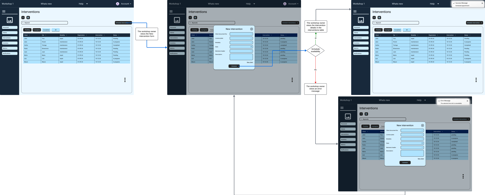

#### User Goal: Visualizar detalles de intervención
User Persona: Dueño de taller.
Explicación del flujo: El flujo de actualización y gestión de una intervención en WorkShop N-GINE comienza con el usuario accediendo a la sección de Interventions. Aquí, el usuario selecciona una intervención específica de la lista, que lo redirige a una nueva vista donde se muestran los detalles de la intervención seleccionada. El usuario tiene la opción de actualizar el estado de la intervención, como pasarla a "En progreso" o "Completado". Si los datos ingresados son correctos y la intervención puede continuar según lo previsto, el sistema guarda los cambios y muestra un mensaje emergente de éxito. La intervención también se actualiza en la tabla principal, reflejando el nuevo estado. Si surge algún problema (por ejemplo, horarios de intervención en conflicto), el sistema desplegará un mensaje de error, pidiendo al usuario resolver el conflicto antes de continuar. El flujo asegura que los datos se gestionan de forma precisa y oportuna, permitiendo mantener control sobre el progreso de cada intervención en el taller.
 

  

#### User Goal: Gestionar solicitudes de inventario
User persona: dueño de taller
Explicación del flujo: El usuario accede a la sección de "Inventory" donde puede ver las partes disponibles. En esta pantalla, el usuario puede interactuar con dos funcionalidades: eliminar ítems o actualizar cantidades.

Eliminar Ítems: El usuario selecciona varios ítems utilizando casillas de verificación. Una vez que el usuario elige los ítems que desea eliminar, aparece un cuadro de confirmación. Si el usuario confirma la acción, se muestra un mensaje emergente que confirma que los ítems han sido eliminados exitosamente del inventario.

Actualizar Cantidades: El usuario también tiene la opción de modificar las cantidades de las partes en stock. Después de hacer los cambios deseados, el usuario guarda los ajustes, lo que genera un mensaje emergente que confirma que las cantidades han sido actualizadas correctamente.

Si un ítem seleccionado para eliminación o actualización ya no existe en el inventario, el sistema mostrará un mensaje de error emergente notificando al usuario de la situación.
 

  

#### User goal: Gestionar solicitudes de inventario
User persona: dueño de taller

Explicación de flujo: El usuario ingresa a la sección de "Inventory" y selecciona ítems para realizar una solicitud marcando las casillas correspondientes. Una vez realizada la selección, aparece un cuadro de diálogo de confirmación para verificar la solicitud. Al presionar "Confirm", se muestra un mensaje emergente indicando que la solicitud ha sido satisfecha con éxito. Si los ítems solicitados no están disponibles, se muestra un mensaje de error.
 

  

#### User goal: Obtener métricas de rendimiento.
User Persona: Dueño de taller.

Explicación del flujo: El usuario accede a la sección de "Metrics" donde puede visualizar diferentes gráficos que muestran datos importantes. El primer gráfico muestra la cantidad de intervenciones por día de la semana, mientras que otro gráfico detalla la cantidad de intervenciones por mes. Además, el usuario puede ver un gráfico circular que muestra la distribución porcentual de vehículos por marca. Estas visualizaciones ayudan a entender el comportamiento de las intervenciones y la composición del parque vehicular.
 

  

#### User goal: Recibir notificaciones
User Persona: Dueño de taller, mecánico, cliente de taller

Explicación del flujo: El usuario accede a la sección de "Notifications" donde puede visualizar las notificaciones recientes en un formato de lista, junto con enlaces para redirigirlo a la sección relevante. Si hay notificaciones disponibles, se muestra la lista completa.

En el caso de que no existan notificaciones, el usuario verá un mensaje que indica que no hay notificaciones por el momento y que debe volver más tarde.
 

  

## 4.5. Web Applications Prototyping
Para poder elaborar los prototipos de la interfaz de usuario destinados a Desktop y Mobile Web Browser, se siguieron una serie de criterios fundamentales, entre ellos:

- **Diseño centrado en el usuario**: Se consideró la experiencia del usuario como el eje central del diseño, asegurando que la interfaz sea intuitiva y fácil de usar.
- **Consistencia visual**: Se mantuvo una coherencia visual en todos los elementos de la interfaz, incluyendo colores, tipografías y estilos.
- **Facilidad de navegación**: Se diseñó una estructura de navegación clara y sencilla, permitiendo al usuario acceder a las diferentes secciones de la aplicación de forma rápida y eficiente.

A continuación, se presentan los prototipos de la interfaz de usuario para Desktop y Mobile Web Browser, incluyendo las vistas clave de la aplicación WorkShop N-GINE.

Enlace para acceder al video de explicación del [Web Application Prototyping en Desktop](https://upcedupe-my.sharepoint.com/:v:/g/personal/u202317638_upc_edu_pe/EaMLk0L_CipDivuBrwlyAnoBTAbSdbFPOs2c30OsSXKGnw?e=n18tVm&nav=eyJyZWZlcnJhbEluZm8iOnsicmVmZXJyYWxBcHAiOiJTdHJlYW1XZWJBcHAiLCJyZWZlcnJhbFZpZXciOiJTaGFyZURpYWxvZy1MaW5rIiwicmVmZXJyYWxBcHBQbGF0Zm9ybSI6IldlYiIsInJlZmVycmFsTW9kZSI6InZpZXcifX0%3D)

Enlace para acceder al video de explicación del [Web Application Prototyping en Mobile](https://upcedupe-my.sharepoint.com/:v:/g/personal/u202317638_upc_edu_pe/Eb3KrJ1ly5hHjDMNTTdZ5cIB8UWopmtJDMUmJE3oEC8MWw?e=D3dgE3&nav=eyJyZWZlcnJhbEluZm8iOnsicmVmZXJyYWxBcHAiOiJTdHJlYW1XZWJBcHAiLCJyZWZlcnJhbFZpZXciOiJTaGFyZURpYWxvZy1MaW5rIiwicmVmZXJyYWxBcHBQbGF0Zm9ybSI6IldlYiIsInJlZmVycmFsTW9kZSI6InZpZXcifX0%3D)

Asimismo, a continuación se presentan los enlaces que llevan a los flujos por cada user persona:
Enlace para acceder al [Web Application prototype para Dueño de taller en Desktop](https://www.figma.com/proto/PqvO9VXswNOC5KVgjpDSql/Sketch?node-id=646-15803&node-type=FRAME&t=bjZZ32OEbZOtQ8Kq-1&scaling=min-zoom&content-scaling=fixed&page-id=138%3A1515&starting-point-node-id=646%3A15803&show-proto-sidebar=1)

Enlace para acceder al [Web Application prototype para Dueño de taller en Mobile](https://www.figma.com/proto/PqvO9VXswNOC5KVgjpDSql/Sketch?node-id=818-21021&node-type=FRAME&t=Ea73gbC0hjTzKbpQ-1&scaling=min-zoom&content-scaling=fixed&page-id=138%3A1515&starting-point-node-id=818%3A21021&show-proto-sidebar=1)

Enlace para acceder al [Web Application prototype para Mecanico en Desktop](https://www.figma.com/proto/PqvO9VXswNOC5KVgjpDSql/Sketch?node-id=569-20217&node-type=FRAME&t=7gVU3ZwNXM6TLi3z-1&scaling=min-zoom&content-scaling=fixed&page-id=138%3A1515&starting-point-node-id=569%3A20217&show-proto-sidebar=1)

Enlace para acceder al [Web Application prototype para Mecanico en Mobile](https://www.figma.com/proto/PqvO9VXswNOC5KVgjpDSql/Sketch?node-id=837-26154&node-type=FRAME&t=CZYe5rS7aUEh0ODm-1&scaling=min-zoom&content-scaling=fixed&page-id=138%3A1515&starting-point-node-id=837%3A26154&show-proto-sidebar=1)

Enlace para acceder al [Web Application prototype para Cliente de taller en Desktop](https://www.figma.com/proto/PqvO9VXswNOC5KVgjpDSql/Sketch?node-id=569-23587&node-type=FRAME&t=DjYjNwCQy27e8BfB-1&scaling=min-zoom&content-scaling=fixed&page-id=138%3A1515&starting-point-node-id=569%3A23587&show-proto-sidebar=1)

Enlace para acceder al [Web Application prototype para Cliente de taller en Mobile](https://www.figma.com/proto/PqvO9VXswNOC5KVgjpDSql/Sketch?node-id=818-23532&node-type=FRAME&t=XjxMdzq3JYYDYEGk-1&scaling=min-zoom&content-scaling=fixed&page-id=138%3A1515&starting-point-node-id=818%3A23532&show-proto-sidebar=1)

## 4.6. Domain-Driven Software Architecture
Esta sección presenta una visión general de la arquitectura basada en DDD, desglosada en diferentes niveles de detalle que van desde el contexto general del sistema hasta los componentes más específicos que lo constituyen.

### 4.6.1. Software Architecture Context Diagram
Workshop N-GINE es un sistema centralizado para gestionar talleres automotrices. Interactúa con tres tipos de usuarios: el dueño del taller, quien gestiona el personal y clientes; los mecánicos, que supervisan y ejecutan tareas de reparación; y los clientes, que consultan el estado de sus vehículos. El sistema también se conecta con OBD IoT, que proporciona datos en tiempo real sobre los vehículos, y con Gmail para enviar notificaciones por correo electrónico. A continuación, presento el diagrama hecho en Structurizr:
 

  

### 4.6.2. Software Architecture Container Diagrams
El Container Diagram de Workshop N-GINE muestra los principales contenedores que forman parte del sistema y sus interacciones. El sistema está compuesto por una aplicación de página única (SPA), una API RESTful, y una base de datos central. Estos componentes permiten a los dueños de taller, mecánicos, y clientes interactuar con el sistema. Los usuarios acceden al sistema a través de una Landing Page que redirige a la SPA, donde se gestionan las principales operaciones. El sistema también recibe información de OBD IoT para los diagnósticos de vehículos y se apoya en Gmail para enviar notificaciones por correo.A continuación, presento el diagrama hecho en Structurizr:
 

  

### 4.6.3. Software Architecture Components Diagrams
Los diagramas de componentes proporcionan una representación clara y detallada de los diferentes bounded contexts que estructuran la aplicación Workshop N-GINE. A continuación se presenta una breve descripción de cada contexto y los principales componentes que lo constituyen:

#### Inventory management bounded context
El diagrama de gestión de inventario muestra cómo una Single Page Application (SPA) interactúa con varios componentes para gestionar productos y solicitudes de inventario. Los controladores manejan las solicitudes API, mientras que los servicios de comando y consulta gestionan las operaciones de actualización y recuperación de datos. Los repositorios almacenan información en una base de datos central, lo que permite un flujo eficiente y directo de gestión de inventario y solicitudes.

#### Service management bounded context
El diagrama de contenedores ilustra la arquitectura de un sistema de gestión de servicios enfocado en la administración de intervenciones, vehículos y talleres mediante una Single Page Application (SPA). La SPA interactúa con varios controladores y servicios, organizados en consultas y comandos para manejar operaciones específicas de intervenciones, usuarios y datos de talleres. Los servicios externos gestionan la autenticación y perfilado de usuarios, mientras que los repositorios almacenan y recuperan datos esenciales en la base de datos, garantizando una arquitectura escalable y eficiente.

#### Profile management bounded context
El diagrama de gestión de perfiles muestra cómo una Single Page Application (SPA) interactúa con servicios para manejar roles, permisos y perfiles de usuario. Los controladores procesan solicitudes API relacionadas con la gestión de perfiles y roles, mientras que los servicios de comando realizan actualizaciones y sincronización con un sistema externo de IAM. Los servicios de consulta recuperan datos de perfiles y roles desde repositorios, los cuales almacenan esta información en una base de datos central. Todo el flujo asegura un manejo ordenado y preciso de datos de usuarios y permisos

#### Communication management bounded context
El diagrama de gestión de comunicaciones muestra cómo una Single Page Application (SPA) se conecta a un controlador central para gestionar tareas de comunicación, como mensajes y notificaciones. Los servicios de comando manejan el envío y la actualización de mensajes, mientras que los servicios de consulta recuperan datos históricos y detalles de notificaciones. Los repositorios almacenan mensajes y datos de notificaciones en una base de datos, y los servicios externos (como Gmail y un SMS Gateway) se integran para enviar correos electrónicos y mensajes SMS, asegurando una comunicación eficiente y estructurada.

#### Subscription management bounded context
El diagrama de gestión de suscripciones muestra cómo una Single Page Application (SPA) interactúa con controladores para manejar suscripciones y planes. Los controladores procesan solicitudes API para gestionar operaciones de suscripción y facturación. Los servicios de comando realizan acciones como la creación y actualización de suscripciones y planes, mientras que los servicios de consulta recuperan información relevante. Los datos se almacenan en repositorios conectados a una base de datos central, y el servicio de notificaciones envía correos electrónicos mediante Gmail para mantener a los usuarios informados sobre los cambios en sus suscripciones.

#### Billing management bounded context
El diagrama de gestión de facturación muestra cómo una Single Page Application (SPA) se comunica con un controlador de facturación para gestionar la generación de facturas y el procesamiento de pagos. Los servicios de consulta y comando manejan la recuperación de datos y las actualizaciones para facturas y pagos. Los repositorios almacenan datos relacionados con facturas y pagos en una base de datos central. El servicio de notificaciones envía recordatorios y actualizaciones de facturación a los clientes a través de Gmail, mientras que un gateway de pago externo procesa los pagos de forma segura.## 4.7. Software Object-Oriented Design

#### Device management bounded context
El diagrama de gestión de dispositivos describe cómo una Single Page Application (SPA) interactúa con un controlador para gestionar dispositivos y diagnósticos. Los servicios de comando y consulta se encargan de las operaciones de escritura y lectura de datos de los dispositivos, que se almacenan en un repositorio conectado a una base de datos. La fachada de gestión de dispositivos expone datos relevantes a otros contextos, mientras que el servicio de gestión de códigos procesa códigos y datos diagnósticos obtenidos de dispositivos IoT OBD integrados en vehículos. Esto permite una gestión eficiente de los dispositivos y la interpretación de información de diagnóstico en tiempo real.

#### Identity and Access Management Bounded Context
Este diagrama representa el contexto de Identity and Access Management (IAM) dentro de la aplicación Workshop N-GINE, encargado de la autenticación, gestión de usuarios y control de roles. Su propósito es garantizar un acceso seguro y controlado a los recursos del sistema mediante la gestión de usuarios y sus respectivas autorizaciones.
 

  

### 4.7.1. Class Diagrams

  

### 4.7.2. Class Dictionary

`Identity and Access Management`

**Class User**

Esta clase representa un aggregate root que encapsula la información de un usuario en el sistema. Contiene atributos como id, username, password, state, role y workshopId.

| Attribute  | Type          | Description                                                 |
|------------|---------------|-------------------------------------------------------------|
| id         | int           | Unique identifier for the user                              |
| username   | string        | Username for the user account                               |
| password   | string        | Password for the user account                               |
| state      | AccountStatus | Status of the user account (e.g., active, inactive, hidden) |
| role       | Role          | Role assigned to the user                                   |
| workshopId | Long          | Identifier for the workshop associated with the user        |

**Class Role**

Esta clase representa una entity que define los roles disponibles en el sistema. Contiene atributos como id y name.

| Attribute | Type   | Description                    |
|-----------|--------|--------------------------------|
| id        | Long   | Unique identifier for the role |
| name      | String | Name of the role               |

`Profile Management`

**Class Profile**

Esta clase representa un aggregate root que encapsula la información de un perfil de usuario. Contiene atributos como id, firstName, lastName, dni, email, age, location y userId.

| Attribute | Type    | Description                       |
|-----------|---------|-----------------------------------|
| id        | Long    | Unique identifier for the profile |
| firstName | string  | First name of the user            |
| lastName  | string  | Last name of the user             |
| dni       | Number  | Identification number of the user |
| email     | string  | Email address of the user         |
| age       | Integer | Age of the user                   |
| location  | String  | Location of the user              |
| userId    | Long    | Identifier of the associated user |

`Service Management`

**Class Workshop**

Esta clase representa un aggregate root que encapsula la información de un taller. Contiene atributos como id y name.

| Attribute | Type   | Description                        |
|-----------|--------|------------------------------------|
| id        | Long   | Unique identifier for the workshop |
| name      | String | Name of the workshop               |

**Class Vehicle**

Esta clase representa un aggregate root que encapsula la información de un vehículo. Contiene atributos como id, licensePlate, brand, model, image, userId y iotDeviceId.

| Attribute    | Type   | Description                                               |
|--------------|--------|-----------------------------------------------------------|
| id           | Long   | Unique identifier for the vehicle                         |
| licensePlate | String | License plate of the vehicle                              |
| brand        | String | Brand of the vehicle                                      |
| model        | String | Model of the vehicle                                      |
| image        | String | Image URL of the vehicle                                  |
| userId       | long   | Identifier of the user who owns the vehicle               |
| iotDeviceId  | Long   | Identifier for the IoT device associated with the vehicle |

**Class Intervention**

Esta clase representa un aggregate root que encapsula la información de una intervención. Contiene atributos como id, workshopId, mechanicLeaderId, vehicleId, scheduledAt, startedAt, completedAt, type, status, taskList y description.

| Attribute        | Type                 | Description                                                 |
|------------------|----------------------|-------------------------------------------------------------|
| id               | Long                 | Unique identifier for the intervention                      |
| workshopId       | Long                 | Identifier of the workshop associated with the intervention |
| mechanicLeaderId | Long                 | Identifier of the mechanic leader for the intervention      |
| vehicleId        | Long                 | Identifier of the vehicle for the intervention              |
| scheduledAt      | LocalDateTime        | Scheduled date and time for the intervention                |
| startedAt        | LocalDateTime        | Start date and time of the intervention                     |
| completedAt      | LocalDateTime        | Completion date and time of the intervention                |
| type             | InterventionType     | Type of intervention (e.g., reparation, maintenance)        |
| status           | InterventionStatuses | Current status of the intervention                          |
| taskList         | List<Task>           | List of tasks associated with the intervention              |
| description      | String               | Description of the intervention                             |

**Class Task**

Esta clase representa una entity que encapsula la información de una tarea. Contiene atributos como id, mechanicAssignedId, intervention, tracking, state y description.

| Attribute          | Type             | Description                                                  |
|--------------------|------------------|--------------------------------------------------------------|
| id                 | Long             | Unique identifier for the task                               |
| mechanicAssignedId | Long             | Identifier of the mechanic assigned to the task              |
| intervention       | Intervention     | Intervention associated with the task                        |
| tracking           | List<Checkpoint> | List of checkpoints tracking the task                        |
| state              | TaskState        | Current state of the task (e.g., pending, in progress, done) |
| description        | String           | Description of the task                                      |

**Class Checkpoint**

Esta clase representa una entity que encapsula la información de un checkpoint. Contiene atributos como id, name y task.

| Attribute | Type   | Description                          |
|-----------|--------|--------------------------------------|
| id        | Long   | Unique identifier for the checkpoint |
| name      | String | Name of the checkpoint               |
| task      | Task   | Task associated with the checkpoint  |

`Inventory Management`

**Class Product**

Esta clase representa un aggregate root que encapsula la información de un producto en el inventario. Contiene atributos como id, name, description, stockQuantity, lowStockThreshold y workshopId.

| Attribute         | Type    | Description                                      |
|-------------------|---------|--------------------------------------------------|
| id                | Long    | Unique identifier for the product                |
| name              | String  | Name of the product                              |
| description       | String  | Description of the product                       |
| stockQuantity     | Integer | Current stock quantity of the product            |
| lowStockThreshold | Integer | Threshold quantity to trigger low stock alerts   |
| workshopId        | Long    | Identifier of the workshop that owns the product |

**Class ProductRequest**

Esta clase representa un aggregate root que encapsula la información de una solicitud de producto. Contiene atributos como id, requestedQuantity, taskId, productId, workshopId y status.

| Attribute         | Type                   | Description                                                       |
|-------------------|------------------------|-------------------------------------------------------------------|
| id                | Long                   | Unique identifier for the product request                         |
| requestedQuantity | Integer                | Quantity of the product requested                                 |
| taskId            | Long                   | Identifier of the task associated with the product request        |
| productId         | Long                   | Identifier of the requested product                               |
| workshopId        | Long                   | Identifier of the workshop making the request                     |
| status            | ProductRequestStatuses | Status of the product request (e.g., pending, accepted, rejected) |

`Device Management`

**Class IoTDevice**

Esta clase representa un aggregate root que encapsula la información de un dispositivo IoT. Contiene atributos como id, codeList, vehicleId.

| Attribute | Type       | Description                                        |
|-----------|------------|----------------------------------------------------|
| id        | Long       | Unique identifier for the IoT device               |
| codeList  | List<Code> | List of codes associated with the IoT device       |
| vehicleId | Long       | Identifier of the vehicle linked to the IoT device |

**Class Code**

Esta clase representa una entity que encapsula la información de un código generado por un dispositivo IoT. Contiene atributos como id, component, errorCode, description, lastUpdated, iot, state.

| Attribute   | Type      | Description                             |
|-------------|-----------|-----------------------------------------|
| id          | int       | Unique identifier for the code          |
| component   | string    | Component name associated with the code |
| errorCode   | string    | Error code generated by the IoT device  |
| description | string    | Description of the error or code        |
| lastUpdated | Date      | Date when the code was last updated     |
| iot         | IoT       | IoT device associated with the code     |
| state       | CodeState | State of the code (e.g., failed, good)  |

`Communication Management`

**Class Notification**

Esta clase representa un aggregate root que encapsula la información de una notificación. Contiene atributos como id, date, content, userId, state, endpoint.

| Attribute | Type              | Description                                             |
|-----------|-------------------|---------------------------------------------------------|
| id        | int               | Unique identifier for the notification                  |
| date      | datetime          | Date and time when the notification was created         |
| content   | string            | Content of the notification                             |
| userId    | Long              | Identifier of the user associated with the notification |
| state     | NotificationState | State of the notification (e.g., read, unread)          |
| endpoint  | string            | Endpoint URL related to the notification                |

`Subscription Management`

**Class SubscriptionItem**

Esta clase representa un aggregate root que encapsula la información de un ítem de suscripción. Contiene atributos como id, workshopId, userId, planId, status, startedAt, endedAt, cancelledAt, isTrial, trialEndsAt.

| Attribute   | Type               | Description                                                                               |
|-------------|--------------------|-------------------------------------------------------------------------------------------|
| id          | Long               | Unique identifier for the subscription item                                               |
| workshopId  | Long               | Identifier of the workshop associated with the subscription                               |
| userId      | Long               | Identifier of the user who owns the subscription                                          |
| planId      | Long               | Identifier of the associated plan                                                         |
| status      | SubscriptionStatus | Current status of the subscription (e.g., pending activation, active, cancelled, expired) |
| startedAt   | LocalDateTime      | Date and time when the subscription started                                               |
| endedAt     | LocalDateTime      | Date and time when the subscription ended                                                 |
| cancelledAt | LocalDateTime      | Date and time when the subscription was cancelled                                         |
| isTrial     | Boolean            | Indicates if the subscription is a trial                                                  |
| trialEndsAt | LocalDateTime      | Date and time when the trial period ends                                                  |

**Class Plan**

Esta clase representa una entity que encapsula la información de un plan de suscripción. Contiene atributos como id, price, durationInMonths, type, cycle, maxMechanics, maxClients, maxActiveInterventions, maxItems, metricsAvailable.

| Attribute              | Type         | Description                                       |
|------------------------|--------------|---------------------------------------------------|
| id                     | Long         | Unique identifier for the plan                    |
| price                  | Decimal      | Price of the plan                                 |
| durationInMonths       | Integer      | Duration of the plan in months                    |
| type                   | PlanType     | Type of the plan (e.g., basic, standard, premium) |
| cycle                  | BillingCycle | Billing cycle of the plan (e.g., monthly, annual) |
| maxMechanics           | Integer      | Maximum number of mechanics allowed               |
| maxClients             | Integer      | Maximum number of clients allowed                 |
| maxActiveInterventions | Integer      | Maximum number of active interventions allowed    |
| maxItems               | Integer      | Maximum number of items allowed in inventory      |
| metricsAvailable       | Boolean      | Indicates if metrics are available with the plan  |

`Billing Management`

**Class Invoice**

Esta clase representa un aggregate root que encapsula la información de una factura. Contiene atributos como id, subscriptionId, workshopId, planId, amount, status, issueDate, dueDate, paymentDate.

| Attribute      | Type          | Description                                                   |
|----------------|---------------|---------------------------------------------------------------|
| id             | Long          | Unique identifier for the invoice                             |
| subscriptionId | Long          | Identifier of the associated subscription                     |
| workshopId     | Long          | Identifier of the workshop linked to the invoice              |
| planId         | Long          | Identifier of the plan related to the invoice                 |
| amount         | Integer       | Amount to be paid in the invoice                              |
| status         | InvoiceStatus | Current status of the invoice (e.g., pending, paid, rejected) |
| issueDate      | LocalDateTime | Date and time when the invoice was issued                     |
| dueDate        | LocalDateTime | Date and time when the invoice is due                         |
| paymentDate    | LocalDateTime | Date and time when the invoice was paid                       |

## 4.8. Database Design

Para el proyecto Workshop N-GINE se ha seleccionado el motor de base de datos MySQL debido a su escalabilidad y su interfaz intuitiva, lo cual facilita su uso. Esta elección se basa en la experiencia del equipo con motores de bases de datos similares, como Microsoft SQL Server, lo que asegura una transición fluida. MySQL ofrece la capacidad de expandir los recursos de la base de datos conforme el taller crezca permitiendo que el sistema maneje eficientemente mayores volúmenes de datos y las necesidades crecientes del negocio.

### 4.8.1. Database Diagram

  

# Capítulo V: Product Implementation, Validation & Deployment

En este capítulo se detallan las actividades de implementación, validación y despliegue del producto Workshop N-GINE. Se presentan los procesos de desarrollo, pruebas y configuración de software, así como la implementación de la landing page, servicios y aplicaciones. Además, se describen los resultados de la implementación y validación, y se detallan los planes de despliegue y mantenimiento del producto.

## 5.1. Software Configuration Management

En esta sección se describen las actividades de configuración de software, incluyendo el entorno de desarrollo, la gestión de código fuente, las convenciones de estilo y la configuración de despliegue.

### 5.1.1. Software Development Environment Configuration

A continuación, se presentan las herramientas y tecnologías utilizadas en el entorno de desarrollo del proyecto.

**Requirements Management**

1. Trello: Herramienta de gestión de proyectos que permite organizar tareas y colaborar en equipo. Se utilizará para definir y priorizar los requisitos del proyecto. [Trello](https://trello.com/)
2. Pivotal Tracker: Herramienta de gestión de proyectos ágiles que facilita la planificación y seguimiento de las tareas. Se utilizará para gestionar las historias de usuario y las tareas del proyecto. [Pivotal Tracker](https://www.pivotaltracker.com/)

**Design & Prototyping**

1. Uxpressia: Herramienta de diseño centrada en el usuario que permite crear user personas, empathy maps, journey maps y otros artefactos de diseño. Se utilizará para elaborar los perfiles de usuario y los mapas de empatía. [Uxpressia](https://uxpressia.com/w/k4lMq)
2. Figma: Herramienta de diseño de interfaces de usuario que permite crear wireframes, mockups y prototipos interactivos. Se utilizará para diseñar la interfaz de usuario del producto. [Figma](https://www.figma.com/)
3. LucidChart: Herramienta de diagramación que permite crear wireflows y user flows. Se utilizará para diseñar los flujos de usuario del producto. [LucidChart](https://www.lucidchart.com/)
4. Miro: Herramienta de colaboración en línea que permite crear mapas de escenarios y mapas de impacto. Se utilizará para diseñar los escenarios de uso del producto. [Miro](https://miro.com/es/)

**Software Architecture**

1. Structurizr: Herramienta de modelado de arquitectura que permite crear diagramas C4. Se utilizará para diseñar la arquitectura del sistema. [Structurizr](https://www.structurizr.com/)
2. Draw.io: Herramienta de diagramación que permite crear diagramas UML. Se utilizará para diseñar los diagramas de clases y componentes. [Draw.io](https://app.diagrams.net/)
3. Vertabelo: Herramienta de diseño de bases de datos que permite crear modelos de datos. Se utilizará para diseñar la base de datos del sistema. [Vertabelo](https://vertabelo.com/)

**Software Development**

1. Git: Sistema de control de versiones distribuido que permite gestionar el código fuente de forma colaborativa. Se utilizará para controlar las versiones del código del proyecto. [Git](https://git-scm.com/)

**Software Documentation and Collaboration**

1. GitHub: Plataforma de desarrollo colaborativo que permite alojar proyectos, revisar código y gestionar versiones. Se utilizará para alojar el código fuente y colaborar en el desarrollo del proyecto. [GitHub](

**IDE & Tools**

1. WebStorm: Entorno de desarrollo integrado (IDE) para JavaScript y TypeScript. Se utilizará para desarrollar la aplicación web. [WebStorm](https://www.jetbrains.com/webstorm/)
2. Rider: Entorno de desarrollo integrado (IDE) para .NET y C#. Se utilizará para desarrollar la API RESTful. [Rider](https://www.jetbrains.com/rider/)
3. MySQL Workbench: Herramienta de diseño y administración de bases de datos MySQL. Se utilizará para diseñar y administrar la base de datos del sistema. [MySQL Workbench](https://www.mysql.com/products/workbench/)

**Landing Page Development**

1. HTML5: Lenguaje de marcado para la estructura de páginas web. Se utilizará para definir la estructura de la landing page. [HTML5](https://developer.mozilla.org/es/docs/Web/HTML)
2. SASS: Preprocesador de CSS que permite escribir estilos de forma más eficiente. Se utilizará para definir los estilos de la landing page. [SASS](https://sass-lang.com/)
3. JavaScript: Lenguaje de programación para la interactividad en páginas web. Se utilizará para implementar la lógica de la landing page. [JavaScript](https://developer.mozilla.org/es/docs/Web/JavaScript)

**Frontend Development**

1. Vue.js: Framework de JavaScript para la creación de interfaces de usuario. Se utilizará para desarrollar la aplicación web. [Vue.js](https://vuejs.org/)

**Backend Development**

1. C#: Lenguaje de programación para el desarrollo de aplicaciones en el entorno .NET. Se utilizará para desarrollar la API RESTful. [C#](https://docs.microsoft.com/en-us/dotnet/csharp/)
2. ASP.NET Core: Framework de desarrollo de aplicaciones web de código abierto. Se utilizará para desarrollar la API RESTful. [ASP.NET Core](https://dotnet.microsoft.com/apps/aspnet)

**Database Development**

1. MySQL: Sistema de gestión de bases de datos relacional de código abierto. Se utilizará para diseñar y administrar la base de datos del sistema. [MySQL](https://www.mysql.com/)

**Testing & Quality Assurance**

1. Postman: Herramienta de colaboración para el desarrollo de APIs. Se utilizará para probar y documentar la API RESTful. [Postman](https://www.postman.com/)

**Deployment & Continuous Integration**

1. Netlify: Plataforma de alojamiento web y despliegue continuo. Se utilizará para desplegar la landing page y la aplicación web. [Netlify](https://www.netlify.com/)
2. Railway: Plataforma de alojamiento web y despliegue continuo. Se utilizará para desplegar la API RESTful. [Railway](https://railway.app/)

### 5.1.2. Source Code Management

En esta sección se detallan las prácticas y herramientas utilizadas para la gestión del código fuente del proyecto.
De ese modo, se seguirá la metodología GitFlow, que establece una serie de reglas y buenas prácticas para el control de versiones en proyectos de software. 
A continuación, se presenta como se estructurará el repositorio del proyecto y las convenciones que se seguirán para la nomenclatura de ramas y commits.

**Repositorio del Proyecto**

Se muestran los repositorios que forman parte del proyecto Workshop

| Repositorio              | Link                                                                     | 
|--------------------------|--------------------------------------------------------------------------|
| Organización             | https://github.com/Web-Application-YaraSoftware                          |
| Landing page             | https://github.com/Web-Application-YaraSoftware/Landing-page             |
| FrontEnd Web Application | https://github.com/Web-Application-YaraSoftware/Workshop-N-GINE-FrontEnd |
| Web Services             | https://github.com/Web-Application-YaraSoftware/Workshop-N-GINE-Platform |

**Flujo de Trabajo GitFlow**

El flujo de trabajo a seguir será el GitFlow, que establece una serie de reglas y buenas prácticas para el control de versiones en proyectos de software desarrollado por Vincent Driessen. 
Se basa en dos ramas principales: main y develop, y en ramas de soporte para la corrección de errores y nuevas características.

**Estructura de Ramas**

1. Main: Rama principal del proyecto que contiene la versión estable y lista para producción.
2. Develop: Rama de desarrollo que contiene la última versión en desarrollo.
3. Feature: Ramas de soporte para el desarrollo de nuevas características.
4. Hotfix: Ramas de soporte para la corrección de errores en producción.
5. Release: Ramas de soporte para la preparación de una nueva versión.

**Versionado Semántico**

Se seguirá el versionado semántico para la numeración de versiones del proyecto(Semantic Versioning 2.0.0).

El formato de versionado es el siguiente: MAJOR.MINOR.PATCH

1. MAJOR: Incrementa cuando se realizan cambios incompatibles con versiones anteriores.
2. MINOR: Incrementa cuando se agregan funcionalidades compatibles con versiones anteriores.
3. PATCH: Incrementa cuando se corrigen errores compatibles con versiones anteriores.

**Convenciones de Commits**

Se utilizarán las siguientes convenciones para los mensajes de commit basado en el formato de Angular Commit Guidelines:

`git commit -m "<type>[optional scope]:<title>" -m"<description">`

### 5.1.3. Source Code Style Guide & Conventions

En esta sección se detallan las convenciones de estilo y buenas prácticas que se seguirán en el código fuente del proyecto.

**HTML**: Es un lenguaje de marcado que se utiliza para definir la estructura de las páginas web. Se seguirán las siguientes convenciones de estilo:

1. Se utilizarán etiquetas semánticas como header, footer, section, article, nav, aside, main, etc.
2. Se utilizará la indentación de 2 espacios para mejorar la legibilidad del código.
3. Se utilizarán atributos alt en las imágenes para mejorar la accesibilidad.
4. Se utilizarán comentarios para documentar el código y facilitar su mantenimiento.
5. Se utilizarán nombres descriptivos para las clases y los ids.
6. Se utilizarán las mejores prácticas de SEO para mejorar la visibilidad del sitio web.
7. Se utilizarán las mejores prácticas de accesibilidad para garantizar que el sitio sea accesible para todos los usuarios.

**CSS**: Es un lenguaje de estilos que se utiliza para definir la apariencia de las páginas web. Se seguirán las siguientes convenciones de estilo:
1. Se utilizará la metodología BEM (Block Element Modifier) para nombrar las clases de CSS.
2. Se utilizarán variables CSS para definir colores, fuentes y tamaños.
3. Se evitará el uso de estilos en línea y se fomentará el uso de hojas de estilo externas.
4. Se utilizará la indentación de 2 espacios para mejorar la legibilidad del código.
5. Se utilizarán comentarios para documentar el código y facilitar su mantenimiento.

**JavaScript**: Es un lenguaje de programación que se utiliza para agregar interactividad a las páginas web. Se seguirán las siguientes convenciones de estilo:
1. Se utilizará el estándar ECMAScript 6 (ES6) para escribir código JavaScript.
2. Se utilizarán nombres descriptivos para las variables y las funciones.
3. Se evitará el uso de variables globales y se fomentará el uso de módulos.
4. Se utilizará la indentación de 2 espacios para mejorar la legibilidad del código.
5. Se utilizarán comentarios para documentar el código y facilitar su mantenimiento.

**C#**: Es un lenguaje de programación que se utiliza para desarrollar aplicaciones en el entorno .NET. Se seguirán las siguientes convenciones de estilo:
1. Se utilizará el estándar de codificación de C# para escribir código C#.
2. Se utilizará la indentación de 4 espacios para mejorar la legibilidad del código.
3. Se utilizarán comentarios para documentar el código y facilitar su mantenimiento.
4. Se seguirán las convenciones de nomenclatura de C# para los nombres de clases, métodos y propiedades.
5. Se utilizarán las mejores prácticas de programación orientada a objetos en C#.

**Gherkin**: Es un lenguaje de especificación que se utiliza para escribir escenarios de prueba en lenguaje natural. Se seguirán las siguientes convenciones de estilo:
1. Se utilizará el lenguaje natural para escribir escenarios de prueba en Gherkin.
2. Se utilizarán las palabras clave Given, When, Then y And para estructurar los escenarios.

### 5.1.4. Software Deployment Configuration

En esta sección se detallan las actividades de configuración del despliegue del software, incluyendo los productos de la landing page, servicios y aplicaciones.

**Landing Page Deployment**

La landing page se desplegará en Netlify, una plataforma de alojamiento web y despliegue continuo. 
Se seguirán los siguientes pasos para el despliegue de la landing page:

1. Crear una cuenta en Netlify con GitHub.

2. Importar el repositorio de la landing page en Netlify.

3. Conectar el repositorio de la landing page en GitHub a Netlify.

4. Configurar las opciones de despliegue, como el directorio de construcción y las variables de entorno.

5. Desplegar la landing page en Netlify.

Enlace para acceder a la landing page desplegada:

[https://web-landing-page-workshop-n-gine.netlify.app/](https://web-landing-page-workshop-n-gine.netlify.app/)

**Frontend Web Application Deployment**

La aplicación web se desplegará en Netlify, una plataforma de alojamiento web y despliegue continuo.
Se seguirán los siguientes pasos para el despliegue de la aplicación web, considerando que se ha realizado la configuración de la landing page:

1. Conectar el repositorio de la aplicación web en GitHub a Netlify.

2. Configurar las opciones de despliegue, como el directorio de construcción y las variables de entorno.

3. Desplegar la aplicación web en Netlify.

Enlace para acceder a la aplicación web desplegada:

[https://web-workshop-n-gine.netlify.app/](https://web-workshop-n-gine.netlify.app/)

**Web Services Deployment**

La API RESTful se desplegará en Railway, una plataforma de alojamiento web y despliegue continuo.
Se seguirán los siguientes pasos para el despliegue de la API RESTful:

1. Acceder a Railway con una cuenta de GitHub.

2. Crear un nuevo proyecto en Railway y configurar la base de datos.

3. Obtener las credenciales de la base de datos y configurar la conexión en el proyecto de la API.

4. Preparar el archivo Dockerfile en el proyecto de la API.

5. Agregar el proyecto desde GitHub a Railway y configurar el despliegue.

6. Cargar y configurar el proyecto en Railway.

Enlace para acceder a la documentación Swagger de la API RESTful desplegada:

[https://web-yara-workshop-n-gine.up.railway.app/swagger/index.html](https://web-yara-workshop-n-gine.up.railway.app/swagger/index.html)

## 5.2. Landing Page, Services & Applications Implementation

En esta sección se detallan las actividades de implementación de la landing page, los servicios y las aplicaciones del producto Workshop N-GINE. Se presentan los procesos de desarrollo, pruebas y configuración de software, así como los resultados de la implementación y validación.

### 5.2.1. Sprint 1

#### 5.2.1.1. Sprint Planning 1

| **Sprint #**                    | Sprint 1                                                                                                                                                                                                                                                                                                                                                                                                                           |
|---------------------------------|------------------------------------------------------------------------------------------------------------------------------------------------------------------------------------------------------------------------------------------------------------------------------------------------------------------------------------------------------------------------------------------------------------------------------------|
| **Sprint Planning Background**  |                                                                                                                                                                                                                                                                                                                                                                                                                                    |
| Date                            | 2024/09/03                                                                                                                                                                                                                                                                                                                                                                                                                         |
| Time                            | 21:00                                                                                                                                                                                                                                                                                                                                                                                                                              |
| Location                        | Videollamada grupal mediante la plataforma Discord                                                                                                                                                                                                                                                                                                                                                                                 |
| Prepared By                     | Jhosepmyr Orlando Gutierrez Soto                                                                                                                                                                                                                                                                                                                                                                                                   |
| Attendees (to planning meeting) | Elmer Riva Rodriguez, Eric Hernandez Tuiro y Jhosepmyr Gutiérrez Soto                                                                                                                                                                                                                                                                                                                                                              |
| Sprint Goal & User Stories      |                                                                                                                                                                                                                                                                                                                                                                                                                                    |
| Sprint 1 Goal                   | Nuestro enfoque está en crear una landing page inicial que presente claramente nuestro producto y a nuestro equipo a los visitantes.   Creemos que esto entregará una primera impresión sólida y generará interés en los visitantes potenciales de nuestro sitio web.   Esto se confirmará cuando la landing page esté en línea y comencemos a recibir visitas y suscripciones a través de un formulario básico de contacto. |
| Sprint 1 Velocity               | 20                                                                                                                                                                                                                                                                                                                                                                                                                                 |
| Sum of Story Points             | 20                                                                                                                                                                                                                                                                                                                                                                                                                                 |

#### 5.2.1.2. Sprint Backlog 1

En el primer sprint backlog, el equipo se centrará en la creación de la landing page inicial del producto Workshop.

La herramienta de gestión de proyectos Trello se utilizará para organizar y priorizar las tareas del sprint.

Esta herramienta permite a los miembros del equipo colaborar en la definición de las tareas, asignarlas a los miembros del equipo y realizar un seguimiento del progreso.

Enlace al tablero de Trello del Sprint 1:
[https://trello.com/b/PvVqjtgB/sprint-1](https://trello.com/b/PvVqjtgB/sprint-1)

A continuación, se procede a detallar en una tabla las user story vinculadas a sus tareas, con una breve descripción, estimación en horas y que miembro del equipo la llevo acabo.

<table border="1" style="width:100%; text-align: center;">
  <tr>
    <th colspan="2">Sprint #</th>
    <th colspan="5">Sprint 1</th>
  </tr>
  <tr>
    <th colspan="2">User Story</th>
    <th colspan="5">Work-Item / Task</th>
  </tr>
  <tr>
    <th>Id</th>
    <th>Title</th>
    <th>Id</th>
    <th>Title</th>
    <th>Description</th>
    <th>Estimation (Hours)</th>
    <th>Assigned To</th>
    <th>Status (To-do / In-Process / To-Review / Done)</th>
  </tr>
  <tr>
    <td>SWR-01</td>
    <td>Hero Section</td>
    <td>WI-01</td>
    <td>Diseño de hero section</td>
    <td>Creación del diseño visual de la sección hero, incluyendo la elección de colores, tipografía, y disposición de los elementos.</td>
    <td>2</td>
    <td>Jhosepmyr Gutiérrez Soto</td>
    <td>Done</td>
  </tr>
  <tr>
    <td>SWR-01</td>
    <td>Hero Section</td>
    <td>WI-02</td>
    <td>Implementación de barra de navegación y menu</td>
    <td>Desarrollo de la barra de navegación y el menú en la sección hero, asegurando que sea responsive y accesible.</td>
    <td>1</td>
    <td>Jhosepmyr Gutiérrez Soto</td>
    <td>Done</td>
  </tr>
  <tr>
    <td>SWR-01</td>
    <td>Hero Section</td>
    <td>WI-03</td>
    <td>Inserción de imagen de hero section</td>
    <td>Inserción y optimización de la imagen principal en la sección hero, asegurando que se cargue rápidamente.</td>
    <td>1</td>
    <td>Jhosepmyr Gutiérrez Soto</td>
    <td>Done</td>
  </tr>
  <tr>
    <td>SWR-02</td>
    <td>About the product</td>
    <td>WI-04</td>
    <td>Diseño de sección about the product</td>
    <td>Diseño visual de la sección que describe el producto, con un enfoque en la usabilidad y la claridad de la información.</td>
    <td>3</td>
    <td>Jhosepmyr Gutiérrez Soto</td>
    <td>Done</td>
  </tr>
  <tr>
    <td>SWR-02</td>
    <td>About the product</td>
    <td>WI-05</td>
    <td>Resumen de sección about the product</td>
    <td>Elaboración de un resumen atractivo y conciso que describa las características principales del producto.</td>
    <td>1</td>
    <td>Jhosepmyr Gutiérrez Soto</td>
    <td>Done</td>
  </tr>
  <tr>
    <td>SWR-02</td>
    <td>About the product</td>
    <td>WI-06</td>
    <td>Imagen de about product</td>
    <td>Inserción de imágenes relevantes que complementen la descripción del producto en la sección correspondiente.</td>
    <td>1</td>
    <td>Jhosepmyr Gutiérrez Soto</td>
    <td>Done</td>
  </tr>
  <tr>
    <td>SWR-03</td>
    <td>Beneficios</td>
    <td>WI-07</td>
    <td>Diseño de beneficios</td>
    <td>Diseño visual de la sección que destaca los beneficios del producto, utilizando íconos y texto conciso.</td>
    <td>2</td>
    <td>Jhosepmyr Gutiérrez Soto</td>
    <td>Done</td>
  </tr>
  <tr>
    <td>SWR-03</td>
    <td>Beneficios</td>
    <td>WI-08</td>
    <td>Implementación de cards</td>
    <td>Desarrollo e implementación de las cards en la sección de beneficios, asegurando interactividad y responsividad.</td>
    <td>2</td>
    <td>Jhosepmyr Gutiérrez Soto</td>
    <td>Done</td>
  </tr>
  <tr>
    <td>SWR-04</td>
    <td>Testimonios</td>
    <td>WI-09</td>
    <td>Diseño de testimonios</td>
    <td>Creación del diseño visual de la sección de testimonios, enfocándose en la credibilidad y la estética.</td>
    <td>1</td>
    <td>Jhosepmyr Gutiérrez Soto</td>
    <td>Done</td>
  </tr>
  <tr>
    <td>SWR-04</td>
    <td>Testimonios</td>
    <td>WI-11</td>
    <td>Consumo de API</td>
    <td>Integración de una API para obtener y mostrar testimonios en tiempo real en la sección correspondiente.</td>
    <td>1</td>
    <td>Jhosepmyr Gutiérrez Soto</td>
    <td>Done</td>
  </tr>
  <tr>
    <td>SWR-04</td>
    <td>Testimonios</td>
    <td>WI-12</td>
    <td>Animación de cards</td>
    <td>Implementación de animaciones en las cards de testimonios para mejorar la interacción del usuario.</td>
    <td>3</td>
    <td>Jhosepmyr Gutiérrez Soto</td>
    <td>Done</td>
  </tr>
  <tr>
    <td>SWR-05</td>
    <td>About Us</td>
    <td>WI-13</td>
    <td>Diseño de about us</td>
    <td>Creación del diseño visual para la sección de "About Us", incluyendo la historia y misión de la empresa.</td>
    <td>2</td>
    <td>Elmer Augusto Riva Rodriguez</td>
    <td>Done</td>
  </tr>
  <tr>
    <td>SWR-05</td>
    <td>About Us</td>
    <td>WI-14</td>
    <td>Animación de about us</td>
    <td>Desarrollo de animaciones para mejorar la presentación de la sección "About Us".</td>
    <td>3</td>
    <td>Elmer Augusto Riva Rodriguez</td>
    <td>Done</td>
  </tr>
  <tr>
    <td>SWR-06</td>
    <td>Planes</td>
    <td>WI-15</td>
    <td>Diseño de planes</td>
    <td>Diseño visual de la sección de planes, presentando las opciones de suscripción o compra del producto.</td>
    <td>2</td>
    <td>Jhosepmyr Gutiérrez Soto</td>
    <td>Done</td>
  </tr>
  <tr>
    <td>SWR-06</td>
    <td>Planes</td>
    <td>WI-16</td>
    <td>Implementación de cards</td>
    <td>Desarrollo e implementación de las cards en la sección de planes, asegurando interactividad y responsividad.</td>
    <td>2</td>
    <td>Jhosepmyr Gutiérrez Soto</td>
    <td>Done</td>
  </tr>
  <tr>
    <td>SWR-07</td>
    <td>Formulario</td>
    <td>WI-17</td>
    <td>Diseño de formulario de contacto</td>
    <td>Creación del diseño visual para el formulario de contacto, asegurando que sea claro y fácil de usar.</td>
    <td>2</td>
    <td>Elmer Augusto Riva Rodriguez</td>
    <td>Done</td>
  </tr>
  <tr>
    <td>SWR-07</td>
    <td>Formulario</td>
    <td>WI-18</td>
    <td>Implementación de formulario</td>
    <td>Desarrollo e integración del formulario de contacto, incluyendo validación y envío de datos.</td>
    <td>2</td>
    <td>Elmer Augusto Riva Rodriguez</td>
    <td>Done</td>
  </tr>
  <tr>
    <td>SWR-08</td>
    <td>Footer</td>
    <td>WI-19</td>
    <td>Diseño de footer</td>
    <td>Diseño visual del pie de página (footer), incluyendo enlaces a secciones relevantes y redes sociales.</td>
    <td>2</td>
    <td>Hernández Tuiro, Eric Ernesto</td>
    <td>Done</td>
  </tr>
  <tr>
    <td>SWR-08</td>
    <td>Footer</td>
    <td>WI-20</td>
    <td>Implementación de footer</td>
    <td>Desarrollo del pie de página, asegurando que sea responsive y accesible.</td>
    <td>2</td>
    <td>Hernández Tuiro, Eric Ernesto</td>
    <td>Done</td>
  </tr>
</table>

#### 5.2.1.3. Development Evidence for Sprint Review

Los principales avances del sprint 1 fueron la creación de la landing page inicial del producto Workshop, que incluye las secciones de hero, about the product, beneficios, testimonios, about us, planes, formulario y footer.
De ese modo, se presentan las evidencias de desarrollo de las tareas realizadas en el sprint 1.

| Repository                                                   | Branch                       | Commit Id                                | Commit Message                                                                                                                | Commit Message Body                                                                                                                                                                                                                                                                                                                                                       | Commited on(Date)        |
|--------------------------------------------------------------|------------------------------|------------------------------------------|-------------------------------------------------------------------------------------------------------------------------------|---------------------------------------------------------------------------------------------------------------------------------------------------------------------------------------------------------------------------------------------------------------------------------------------------------------------------------------------------------------------------|--------------------------|
| https://github.com/Web-Application-YaraSoftware/Landing-page | main                         | c3ccf0f3710be8e0eccb0135817e0eedc213e93c | chore: init commit                                                                                                            | chore: init commit                                                                                                                                                                                                                                                                                                                                                        | Fri Sep 6 17:16:11 2024  |
| https://github.com/Web-Application-YaraSoftware/Landing-page | develop                      | d9bb70b72a9748e80b4fd262879b3f6f5e33bffd | feat: integrate SASS styles into main.js                                                                                      | feat: integrate SASS styles into main.js                                                                                                                                                                                                                                                                                                                                  | Fri Sep 6 17:26:58 2024  |
| https://github.com/Web-Application-YaraSoftware/Landing-page | develop                      | 494df051125baac706c730d2970eb53a2ca4302e | chore: create structure for sass styles                                                                                       | chore: create structure for sass styles                                                                                                                                                                                                                                                                                                                                   | Fri Sep 6 17:44:20 2024  |
| https://github.com/Web-Application-YaraSoftware/Landing-page | develop                      | e3e7bf644e5b20c85caf0322a84ef358b453e146 | style: add normalize.css to standardize styles across browsers                                                                | style: add normalize.css to standardize styles across browsers                                                                                                                                                                                                                                                                                                            | Fri Sep 6 17:52:43 2024  |
| https://github.com/Web-Application-YaraSoftware/Landing-page | develop                      | fb3faf9e2f68421c69b04ace2ac8fcf8c5e57f1c | style: add Roboto font globally and apply in base styles                                                                      | style: add Roboto font globally and apply in base styles                                                                                                                                                                                                                                                                                                                  | Fri Sep 6 17:57:05 2024  |
| https://github.com/Web-Application-YaraSoftware/Landing-page | develop                      | 670d1670c0f20b67adda1d31c6e73912c77d1839 | style: add global SASS variables for colors, spacing, fonts, and breakpoints                                                  | - Define global SASS variables for background and text colors - Add variables for padding and font sizes - Create responsive breakpoints for different screen sizes - Apply these variables in the base styles                                                                                                                                                            | Fri Sep 6 18:48:32 2024  |
| https://github.com/Web-Application-YaraSoftware/Landing-page | develop                      | 5ffeb5bfaa9cf3e70a7b1f32087db6adbfd9d2e5 | style: add responsive mixin for media queries                                                                                 | style: add responsive mixin for media queries                                                                                                                                                                                                                                                                                                                             | Fri Sep 6 18:55:20 2024  |
| https://github.com/Web-Application-YaraSoftware/Landing-page | develop                      | 5852b3d75ab70add52fe1fa097e58ed22aca36a4 | style: add global SASS mixins for flexbox, typography, transitions, and layout                                                | - Add flexbox mixin for flexible layouts - Add mixins for heading (h1-h6), body, and button typography with responsive behavior - Add max-width mixin for layout constraints - Add mixins for transitions on color and transform properties - Apply responsive breakpoints in typography using the `respond-to` mixin                                                     | Fri Sep 6 18:56:19 2024  |
| https://github.com/Web-Application-YaraSoftware/Landing-page | develop                      | d764b9fca7298758e043e76749bea503dfa380b4 | chore: add hero image, logo and menu icon                                                                                     | chore: add hero image, logo and menu icon                                                                                                                                                                                                                                                                                                                                 | Fri Sep 6 19:20:36 2024  |
| https://github.com/Web-Application-YaraSoftware/Landing-page | develop                      | de135555788061832fd7dce72d404e3ebaee7941 | chore: change menu icon SVG color to white                                                                                    | chore: change menu icon SVG color to white                                                                                                                                                                                                                                                                                                                                | Fri Sep 6 19:52:05 2024  |
| https://github.com/Web-Application-YaraSoftware/Landing-page | develop                      | 62b9386f4080d6736b6fa137925e68b5ebe1d946 | feat: add static HTML for home section                                                                                        | - Add HTML structure for header with navbar and logo - Include navigation links and buttons for "Registrarse" and "Iniciar Sesion" - Add banner with title and call-to-action button                                                                                                                                                                                      | Fri Sep 6 20:14:07 2024  |
| https://github.com/Web-Application-YaraSoftware/Landing-page | develop                      | b3b039b139bdadf74441363dea430231dbead68f | fix: adjust font sizes for buttons in SASS mixins                                                                             | fix: adjust font sizes for buttons in SASS mixins                                                                                                                                                                                                                                                                                                                         | Fri Sep 6 20:15:24 2024  |
| https://github.com/Web-Application-YaraSoftware/Landing-page | develop                      | c93e8596e3507b402131b3d56b8a1462b2d34d7d | chore: add imports for button-action, navbar, and banner components                                                           | chore: add imports for button-action, navbar, and banner components                                                                                                                                                                                                                                                                                                       | Fri Sep 6 20:16:52 2024  |
| https://github.com/Web-Application-YaraSoftware/Landing-page | develop                      | fadfb649ccdaf693d1df5f132e2a0b9f422d6830 | feat: add styles for buttonAction component                                                                                   | - Apply m-button-1 mixin for base button styles - Add padding, color, and background-color for buttonAction - Set hover effect with scale transformation and smooth transition - Ensure full width and height for anchor tags inside buttons                                                                                                                              | Fri Sep 6 20:17:52 2024  |
| https://github.com/Web-Application-YaraSoftware/Landing-page | develop                      | 1920107ea6597696dec479451dacd8c253503f80 | feat: add styles for header with background image and overlay                                                                 | - Set full-screen layout for the header with flexbox alignment - Add background image with cover, no-repeat, and centered positioning - Apply a semi-transparent overlay using ::before pseudo-element - Ensure proper layering with z-index for header elements                                                                                                          | Fri Sep 6 20:19:13 2024  |
| https://github.com/Web-Application-YaraSoftware/Landing-page | develop                      | 8f873e56bdda6a6ba20899d5ad6b2265714c7a4d | feat: add styles for navbar with responsive layout and transitions                                                            | - Add fixed position and flexbox layout for navbar - Implement dark background modifier class for navbar with responsive adjustments - Style navbar buttons and logo, including responsive behaviors and hover effects - Add responsive navigation list with toggle functionality for medium and larger screens - Apply color transitions using the transitionColor mixin | Fri Sep 6 20:20:11 2024  |
| https://github.com/Web-Application-YaraSoftware/Landing-page | develop                      | ce442f363487527c50cf551b48f3c4e0a33c8f8b | fix: remove duplicate margin declarations in navbar list                                                                      | fix: remove duplicate margin declarations in navbar list                                                                                                                                                                                                                                                                                                                  | Fri Sep 6 20:30:25 2024  |
| https://github.com/Web-Application-YaraSoftware/Landing-page | develop                      | 660016760911beb508f1c71c64874d65f2b8949b | feat: add responsive styles for banner section                                                                                | - Apply max-WIDTH mixin and flexbox layout for banner content - Add responsive behavior for banner image and content with flex-direction adjustment - Style banner title and button with appropriate typography and layout - Ensure banner button adapts to different screen sizes using responsive padding and width                                                     | Fri Sep 6 20:30:55 2024  |
| https://github.com/Web-Application-YaraSoftware/Landing-page | develop                      | 04831c4840b09be395b501b3ae1909c60b5dbed1 | fix: correct flex-direction for navbar buttons in mobile view                                                                 | fix: correct flex-direction for navbar buttons in mobile view                                                                                                                                                                                                                                                                                                             | Fri Sep 6 20:57:14 2024  |
| https://github.com/Web-Application-YaraSoftware/Landing-page | develop                      | 0cd2c653f5067637ff8dee484b2af97bb390721e | feat: add toggle functionality for mobile menu visibility                                                                     | feat: add toggle functionality for mobile menu visibility                                                                                                                                                                                                                                                                                                                 | Fri Sep 6 20:58:36 2024  |
| https://github.com/Web-Application-YaraSoftware/Landing-page | develop                      | 813e422dfbd768cc5c7f52a3be0586d8410822e8 | fix: remove padding from navbar buttons in desktop view                                                                       | fix: remove padding from navbar buttons in desktop view                                                                                                                                                                                                                                                                                                                   | Fri Sep 6 21:10:28 2024  |
| https://github.com/Web-Application-YaraSoftware/Landing-page | feature/home                 | 9826c22dd9928e1a07f5ebd7c7e1e886c6cba05c | feat: add resize handler for resetting navbar position and rename menu click functionality                                    | feat: add resize handler for resetting navbar position and rename menu click functionality                                                                                                                                                                                                                                                                                | Fri Sep 6 21:14:02 2024  |
| https://github.com/Web-Application-YaraSoftware/Landing-page | feature/know-more            | 2186b94c762dd4091c10ddd136534b498e5fb0d1 | chore: import know-more component into main SCSS file                                                                         | chore: import know-more component into main SCSS file                                                                                                                                                                                                                                                                                                                     | Fri Sep 6 22:46:36 2024  |
| https://github.com/Web-Application-YaraSoftware/Landing-page | feature/know-more            | b26762ee10db65bd802c7752f2c9ef16282287e6 | feat: add HTML structure for know-more section                                                                                | - Add main section with know-more header, image, and content - Include title, subtitle, informative text, and call-to-action button                                                                                                                                                                                                                                       | Fri Sep 6 22:47:26 2024  |
| https://github.com/Web-Application-YaraSoftware/Landing-page | feature/know-more            | 86695860f8c505993e3534e141d0d32f2f3b41ed | feat: add styles for main section layout and responsiveness                                                                   | - Set flexbox layout for the main section with column direction and centered content - Apply padding adjustments and background color - Add responsive gap for medium screens and above                                                                                                                                                                                   | Fri Sep 6 22:48:12 2024  |
| https://github.com/Web-Application-YaraSoftware/Landing-page | feature/know-more            | 3c7cbddb5bc93546e1a3ae2a52838a77f38ef144 | feat: add responsive styles for know-more section                                                                             | - Apply flexbox layout for smaller screens and grid layout for medium screens and above - Style know-more header, title, subtitle, image, and content - Adjust alignment, gaps, and text alignment for responsiveness - Ensure proper sizing and positioning of elements across breakpoints                                                                               | Fri Sep 6 22:49:20 2024  |
| https://github.com/Web-Application-YaraSoftware/Landing-page | main                         | 6efac667503d48ccd0f4e7619c90c1f0943ca514 | Merge pull request #1 from Web-Application-YaraSoftware/development                                                           | chore: merge development into main with know-more feature                                                                                                                                                                                                                                                                                                                 | Fri Sep 6 22:56:27 2024  |
| https://github.com/Web-Application-YaraSoftware/Landing-page | feature/benefits             | 0006e981e3cf148f3e944bfe6f592355371fa717 | chore: add benefit images for our-benefits section                                                                            | - Add images illustrating each benefit in the our-benefits section                                                                                                                                                                                                                                                                                                        | Sat Sep 7 00:14:16 2024  |
| https://github.com/Web-Application-YaraSoftware/Landing-page | feature/benefits             | c00f4260d5453dde5a4916b801c56882133a678c | Merge branch 'feature/benefits' of https://github.com/Web-Application-YaraSoftware/Landing-page into feature/benefits         | Merge branch 'feature/benefits' of https://github.com/Web-Application-YaraSoftware/Landing-page into feature/benefits                                                                                                                                                                                                                                                     | Sat Sep 7 00:26:04 2024  |
| https://github.com/Web-Application-YaraSoftware/Landing-page | feature/benefits             | 0c5002010a3e9047d848d9913c2d473a5e5445f1 | chore: import benefits component into main SCSS file                                                                          | chore: import benefits component into main SCSS file                                                                                                                                                                                                                                                                                                                      | Sat Sep 7 00:35:41 2024  |
| https://github.com/Web-Application-YaraSoftware/Landing-page | feature/benefits             | a1f00c207c7ae209587d7172d5c338915bef0182 | feat: add html structure for our-benefits section                                                                             | - Add section for showcasing the benefits of using Workshop N-GINE - Include titles, subtitles, and cards with images and descriptions for each benefit                                                                                                                                                                                                                   | Sat Sep 7 00:36:30 2024  |
| https://github.com/Web-Application-YaraSoftware/Landing-page | feature/benefits             | fe52f40f297a8783b9fa82ee24aa699aaa18ece0 | feat: add responsive styles for our-benefits section                                                                          | - Style benefits section with a flexbox layout and responsive grid for medium screens - Extend styles from know-more section for titles and subtitles - Apply responsive behavior to benefit cards, images, and descriptions - Ensure proper alignment and spacing across different screen sizes                                                                          | Sat Sep 7 00:36:53 2024  |
| https://github.com/Web-Application-YaraSoftware/Landing-page | main                         | f69bd3385b27385f10abc280a84b33e9bb4726fd | Merge pull request #2 from Web-Application-YaraSoftware/development                                                           | chore: merge development into main with benefits feature                                                                                                                                                                                                                                                                                                                  | Sat Sep 7 00:42:23 2024  |
| https://github.com/Web-Application-YaraSoftware/Landing-page | feature/testimonials         | 69ce1fff689fc174db02c5bdde1159e4f0e22031 | feat: consume user API and JSON to generate and insert testimonials                                                           | - Consume user API to retrieve user data - Combine user data with JSON testimonials - Generate testimonial cards dynamically - Insert generated testimonials into the "testimonials" section                                                                                                                                                                              | Sat Sep 7 03:21:58 2024  |
| https://github.com/Web-Application-YaraSoftware/Landing-page | feature/testimonials         | 0044b6c2d2439339974479a2781ae1f9f91b6d2b | feat: add automatic movement functionality for testimonials carousel                                                          | feat: add automatic movement functionality for testimonials carousel                                                                                                                                                                                                                                                                                                      | Sat Sep 7 04:04:53 2024  |
| https://github.com/Web-Application-YaraSoftware/Landing-page | main                         | e260bb4cea5dc4e183fd8af4a4a86a02cfeacde1 | Merge pull request #3 from Web-Application-YaraSoftware/feature/testimonials                                                  | chore: merge development into main with testimonials feature                                                                                                                                                                                                                                                                                                              | Sat Sep 7 04:10:30 2024  |
| https://github.com/Web-Application-YaraSoftware/Landing-page | feature/about-us             | 5de8bed0ad6e61b44725a548661da44a3f8ecf26 | chore: import about us component into main SCSS file                                                                          | chore: import about us component into main SCSS file                                                                                                                                                                                                                                                                                                                      | Sat Sep 7 04:50:46 2024  |
| https://github.com/Web-Application-YaraSoftware/Landing-page | feature/about-us             | c3c7d2a6c7d88794b32303b6992dc91ddfcc215c | feat: add about us section in HTML with mission, vision, and values                                                           | - Added "About Us" section structure in HTML - Included mission, vision, and values content using card layout - Added placeholder for image and text content                                                                                                                                                                                                              | Sat Sep 7 04:54:08 2024  |
| https://github.com/Web-Application-YaraSoftware/Landing-page | feature/about-us             | 128a66acba46cbac4c3aa11ed9568f212cd685d3 | feat: add styles for about us section with responsive layout and flip card animation                                          | - Added responsive layout for "About Us" section - Implemented flip card animation for mission, vision, and values - Styled text and image alignment, ensuring responsiveness across devices                                                                                                                                                                              | Sat Sep 7 04:54:34 2024  |
| https://github.com/Web-Application-YaraSoftware/Landing-page | main                         | f69bd3385b27385f10abc280a84b33e9bb4726fd | Merge pull request #4 from Web-Application-YaraSoftware/development                                                           | chore: merge development into main with about us section                                                                                                                                                                                                                                                                                                                  | Sat Sep 7 04:59:20 2024  |
| https://github.com/Web-Application-YaraSoftware/Landing-page | feature/plans                | e7422754026c50e24faf80b192f1caa4de4f420b | chore: add check icon for plan section and add new variable                                                                   | chore: add check icon for plan section and add new variable                                                                                                                                                                                                                                                                                                               | Sat Sep 7 05:58:55 2024  |
| https://github.com/Web-Application-YaraSoftware/Landing-page | feature/plans                | 010af05524d08159fec7a3dd592dff49f97c1dad | chore: import plan component into main SCSS file                                                                              | chore: import plan component into main SCSS file                                                                                                                                                                                                                                                                                                                          | Sat Sep 7 06:01:46 2024  |
| https://github.com/Web-Application-YaraSoftware/Landing-page | feature/plans                | d858ce527f06f28abfb68065533fd76ccf514300 | feat: add html structure for plans section with free, basic, and premium options                                              | feat: add html structure for plans section with free, basic, and premium options                                                                                                                                                                                                                                                                                          | Sat Sep 7 06:04:23 2024  |
| https://github.com/Web-Application-YaraSoftware/Landing-page | feature/plans                | 5cf0c538f9338bc35b0e434764c593278ba2f2d8 | feat: add styles for plans section and plan-card components with responsive design                                            | feat: add styles for plans section and plan-card components with responsive design                                                                                                                                                                                                                                                                                        | Sat Sep 7 06:07:33 2024  |
| https://github.com/Web-Application-YaraSoftware/Landing-page | main                         | fcce1c8f71b1f7ee5b66920aacf2050cdada2e82 | Merge pull request #5 from Web-Application-YaraSoftware/development                                                           | chore: merge feature/plans into main with plans feature                                                                                                                                                                                                                                                                                                                   | Sat Sep 7 06:11:35 2024  |
| https://github.com/Web-Application-YaraSoftware/Landing-page | feature/contact-form         | 7445dcfa8c394a5da4e428b926376710d5e6e33e | chore: add contact icon for contact form section                                                                              | chore: add contact icon for contact form section                                                                                                                                                                                                                                                                                                                          | Sat Sep 7 06:27:16 2024  |
| https://github.com/Web-Application-YaraSoftware/Landing-page | feature/contact-form         | 301c152c49519954544cb4977bebe49fd438e595 | Merge branch 'feature/contact-form' of https://github.com/Web-Application-YaraSoftware/Landing-page into feature/contact-form | Merge branch 'feature/contact-form' of https://github.com/Web-Application-YaraSoftware/Landing-page into feature/contact-form                                                                                                                                                                                                                                             | Sat Sep 7 06:40:19 2024  |
| https://github.com/Web-Application-YaraSoftware/Landing-page | feature/contact-form         | 90b64892cb0016f1e2d55551d60bba3da7fd5a5f | chore: import contact form component into main SCSS file                                                                      | chore: import contact form component into main SCSS file                                                                                                                                                                                                                                                                                                                  | Sat Sep 7 06:45:09 2024  |
| https://github.com/Web-Application-YaraSoftware/Landing-page | feature/contact-form         | 4e7d29fe41ebf9a33d1edb145ffeee5b9e964bbe | feat: add contact form section to main                                                                                        | - Added contact form HTML structure including input fields and submit button - Included title, subtitle, and labels for the contact form section                                                                                                                                                                                                                          | Sat Sep 7 06:48:39 2024  |
| https://github.com/Web-Application-YaraSoftware/Landing-page | feature/contact-form         | 49e3bf92baa6bf089ae2d7bc0caadf20d47cfe83 | feat: add styles for contact form section                                                                                     | - Added responsive styles for the contact form section - Included layout adjustments for title, subtitle, input fields, and submit button - Applied background color, padding, and form styling for better user experience                                                                                                                                                | Sat Sep 7 06:51:08 2024  |
| https://github.com/Web-Application-YaraSoftware/Landing-page | ma                           | d2c991ae1b06eff0d03c9879d53d6915eecf2168 | Merge pull request #6 from Web-Application-YaraSoftware/development                                                           | chore: merge development into main with contact form feature                                                                                                                                                                                                                                                                                                              | Sat Sep 7 06:55:53 2024  |
| https://github.com/Web-Application-YaraSoftware/Landing-page | feature/footer               | 7498ed28173a458831fcf78ad005d72e7b49a26c | chore: add icons for footer                                                                                                   | chore: add icons for footer                                                                                                                                                                                                                                                                                                                                               | Sat Sep 7 07:09:13 2024  |
| https://github.com/Web-Application-YaraSoftware/Landing-page | feature/footer               | 8163dd7018ae96a0c8e197bd053c74fa8931355d | chore: add icons for footer                                                                                                   | chore: add icons for footer                                                                                                                                                                                                                                                                                                                                               | Sat Sep 7 07:47:48 2024  |
| https://github.com/Web-Application-YaraSoftware/Landing-page | feature/footer               | 98d5a553c4f035303f689b61a1cacd2a05eb55f9 | chore: import contact, footer, legal, sign up and useful links components into main scss file                                 | chore: import contact, footer, legal, sign up and useful links components into main scss file                                                                                                                                                                                                                                                                             | Sat Sep 7 07:54:32 2024  |
| https://github.com/Web-Application-YaraSoftware/Landing-page | feature/footer               | f961418e15eacf61c39d8ff1d3535087eab69fbd | feat: add footer section with contact info, useful links, and social media icons                                              | feat: add footer section with contact info, useful links, and social media icons                                                                                                                                                                                                                                                                                          | Sat Sep 7 07:56:22 2024  |
| https://github.com/Web-Application-YaraSoftware/Landing-page | feature/footer               | 82c094fd9e4754d0acbbe1ced592c0ac23a592f9 | feat: add styles for useful links section with title, list,and items                                                          | feat: add styles for useful links section with title, list,and items                                                                                                                                                                                                                                                                                                      | Sat Sep 7 08:10:03 2024  |
| https://github.com/Web-Application-YaraSoftware/Landing-page | feature/footer               | c1c11e56bc2fc29b1caef6a6e41be766fdb7130e | feat: add styles for contact section including title, info, items, and map                                                    | feat: add styles for contact section including title, info, items, and map                                                                                                                                                                                                                                                                                                | Sat Sep 7 08:11:22 2024  |
| https://github.com/Web-Application-YaraSoftware/Landing-page | feature/footer               | 0af81fdbaa762814905bc373fe3dcaef0028c0d2 | feat: add styles for legal section including title, links, and individual link styling                                        | feat: add styles for legal section including title, links, and individual link styling                                                                                                                                                                                                                                                                                    | Sat Sep 7 08:12:04 2024  |
| https://github.com/Web-Application-YaraSoftware/Landing-page | feature/footer               | b3e2bc8795899e8d273c311d23b1ee6c106c97f3 | feat: add responsive styles for footer including content layout and copyright text                                            | feat: add responsive styles for footer including content layout and copyright text                                                                                                                                                                                                                                                                                        | Sat Sep 7 08:13:34 2024  |
| https://github.com/Web-Application-YaraSoftware/Landing-page | feature/footer               | 03ad656ef9b1e9b584250bf6b07a384fe6db6cef | feat: add styles for sign-up section with button and social media icons                                                       | feat: add styles for sign-up section with button and social media icons                                                                                                                                                                                                                                                                                                   | Sat Sep 7 08:15:24 2024  |
| https://github.com/Web-Application-YaraSoftware/Landing-page | main                         | 76949a5a899c7694b063a5992358ee7578e2defa | Merge pull request #7 from Web-Application-YaraSoftware/development                                                           | chore: merge development into main with contact feature                                                                                                                                                                                                                                                                                                                   | Sat Sep 7 08:19:41 2024  |
| https://github.com/Web-Application-YaraSoftware/Landing-page | develop                      | 67dc811450653d8ed69fee671014edea7f7bc07d | build: add i18next dependency                                                                                                 | - Installed i18next package for internationalization support.                                                                                                                                                                                                                                                                                                             | Sat Sep 7 08:39:00 2024  |
| https://github.com/Web-Application-YaraSoftware/Landing-page | main                         | d73fcdc79c1e0e8f6083aaf3ca38edcc6e968dcb | feat: add language selection with dynamic text change using i18next                                                           | - Created HTML select dropdown for language selection - Implemented i18next library to dynamically change text based on selected language - Added functionality to switch languages onChange event                                                                                                                                                                        | Sat Sep 7 10:07:57 2024  |
| https://github.com/Web-Application-YaraSoftware/Landing-page | feature/internationalization | 84a62ce95805820797e5e8df50bfdf9015789282 | feat: add translation JSON files and update translation function                                                              | - Added JSON files for managing translations in English and Spanish - Implemented constants for utilizing the translation library effectively - Enhanced the `update` function to dynamically alter text elements based on the current language setting                                                                                                                   | Sun Sep 8 02:34:15 2024  |
| https://github.com/Web-Application-YaraSoftware/Landing-page | main                         | 5e9417ffcd02aec895663e91e6768fb1cce1358c | Merge pull request #8 from Web-Application-YaraSoftware/development                                                           | chore: merge in main from development with internationalization features                                                                                                                                                                                                                                                                                                  | Sun Sep 8 02:39:16 2024  |
| https://github.com/Web-Application-YaraSoftware/Landing-page | develop                      | e24372f5b7004839589f081d992860c5531ba7a0 | fix: improve navbar contrast when scrolling past home section                                                                 | - Fixed an issue where the navbar lacked proper contrast during scrolling - Added functionality to change the navbar color dynamically when scrolling past the home section for better visibility                                                                                                                                                                         | Sun Sep 8 03:28:41 2024  |
| https://github.com/Web-Application-YaraSoftware/Landing-page | hotfix/home                  | c9cd0bcec4383a6c586a1c4e2f718743c01231e1 | refactor: replace 
 with  inside label and update anchor references                                                   | - Replaced the 
 tag with a  inside the label for better semantic structure - Updated anchor tag references to ensure proper re-positioning and navigation                                                                                                                                                                                                        | Sun Sep 8 03:47:23 2024  |
| https://github.com/Web-Application-YaraSoftware/Landing-page | hotfix/internationalization  | dd7363fa3b6942b4aa245573d2b6242f26c564ef | refactor: update DOM element constants and add missing footer elements for internationalization                               | - Modified existing DOM element constants for consistency - Added missing footer elements to support internationalization across all sections                                                                                                                                                                                                                             | Sun Sep 8 03:50:45 2024  |
| https://github.com/Web-Application-YaraSoftware/Landing-page | main                         | 556e4bd753d10c0715ab41eddbf0cde19bb60ea6 | Merge pull request #9 from Web-Application-YaraSoftware/development                                                           | chore: merge in main from development with repaired errors                                                                                                                                                                                                                                                                                                                | Sun Sep 8 03:58:10 2024  |
| https://github.com/Web-Application-YaraSoftware/Landing-page | hotfix/testimonials          | c5faa67a670d17e432f663ce16ecf9bad02be42d | fix: improve testimonial carousel navigation and stop movement when not in view                                               | - Fixed the carousel to reverse direction when reaching the end and vice versa - Added functionality to pause carousel movement when not in view for better performance                                                                                                                                                                                                   | Sun Sep 8 04:27:22 2024  |
| https://github.com/Web-Application-YaraSoftware/Landing-page | main                         | 666e46e90c7cd53a292d3aba525e4c1f1e832dd9 | Merge pull request #10 from Web-Application-YaraSoftware/development                                                          | chore: merge in main from development with repaired testimonials errors                                                                                                                                                                                                                                                                                                   | Sun Sep 8 04:30:06 2024  |
| https://github.com/Web-Application-YaraSoftware/Landing-page | feature/videos               | 58188592fe1f7f1a8a1554fda528fbe8be7dddff | chore: add link to the web site in navbar and button call to action                                                           | chore: add link to the web site in navbar and button call to action                                                                                                                                                                                                                                                                                                       | Wed Sep 25 07:20:38 2024 |

#### 5.2.1.4. Testing Suite Evidence for Sprint Review

Para el Sprint 1, se realizó una serie de pruebas en relación con los user stories implementados de la landing page de Workshop N-Gine.
A continuación, se presentan las evidencias de las pruebas realizadas:

| Repository                                                       | Branch  | Commit Id                                | Commit Message                                                                           | Commit Message Body                                                                                                                                                                                                                                                                                                                                                                                                                                                                                                                                                                                                                                                                                                                                                                            | Commited on(Date)        |
|------------------------------------------------------------------|---------|------------------------------------------|------------------------------------------------------------------------------------------|------------------------------------------------------------------------------------------------------------------------------------------------------------------------------------------------------------------------------------------------------------------------------------------------------------------------------------------------------------------------------------------------------------------------------------------------------------------------------------------------------------------------------------------------------------------------------------------------------------------------------------------------------------------------------------------------------------------------------------------------------------------------------------------------|--------------------------|
| https://github.com/Web-Application-YaraSoftware/Acceptance-Tests | main    | eb378bb661d9eeeea0f6549850b6f9137ad77f9d | chore: initial commit                                                                    | chore: initial commit                                                                                                                                                                                                                                                                                                                                                                                                                                                                                                                                                                                                                                                                                                                                                                          | Fri Nov 15 16:44:51 2024 |
| https://github.com/Web-Application-YaraSoftware/Acceptance-Tests | develop | e770b9c0b906cb4462d535f8e4a9a48f1274698a | feat(hero-section): define behavior-driven development (BDD) scenarios for landing page  | - Added a Gherkin feature file for the Hero Section of the landing page. - Defined scenarios to ensure visibility and clarity of the Hero Section message. - Included conditions for the presence of a visually appealing image and a prominent call-to-action button. - Created a scenario outline for responsiveness across mobile, tablet, and desktop devices.                                                                                                                                                                                                                                                                                                                                                                                                                             | Fri Nov 15 16:47:51 2024 |
| https://github.com/Web-Application-YaraSoftware/Acceptance-Tests | develop | 1ea5d41f5371f11e84fc8f75fcc2289bc90d4948 | feat(about-product-section): define BDD scenarios for the landing page section           | - Added a Gherkin feature file for the "About the Product" section of the landing page. - Defined scenarios to ensure clear and understandable product descriptions for workshop owners. - Specified conditions for highlighting product benefits in a relevant manner. - Included a scenario for embedding a playable product video and ensuring easy navigation within the section. - Created a scenario to confirm the responsiveness of the content, especially on mobile devices.                                                                                                                                                                                                                                                                                                         | Fri Nov 15 16:48:17 2024 |
| https://github.com/Web-Application-YaraSoftware/Acceptance-Tests | develop | 5feb7559008c2a9a53bd111e4111ee62fd913d13 | feat(benefits-section): add BDD scenarios for benefits section on landing page           | - Defined feature and scenarios for the Benefits section on the landing page. - Ensured a clear and organized presentation format for the benefits list. - Emphasized relevance and clarity of each benefit for workshop owners. - Included visual elements alongside benefits for improved comprehension and engagement. - Created a scenario outline for verifying specific benefits with accompanying descriptions and icons. - Added a scenario to validate the responsiveness of the Benefits section on mobile devices.                                                                                                                                                                                                                                                                  | Fri Nov 15 16:48:41 2024 |
| https://github.com/Web-Application-YaraSoftware/Acceptance-Tests | develop | 5a8d0fed0f4d1814b43bd3ad839c1d42b4d8cf4b | feat(testimonials-section): add BDD scenarios for testimonials section on landing page   | - Defined feature and scenarios for showcasing customer testimonials on the landing page. - Ensured the display of at least three genuine testimonials with client names and detailed feedback. - Included requirements for visually attractive presentation using styled text quotes and consistent design. - Added a scenario to validate responsiveness and proper layout on mobile devices. - Created a scenario outline for verifying specific testimonials, including client role and accompanying photo.                                                                                                                                                                                                                                                                                | Fri Nov 15 16:48:57 2024 |
| https://github.com/Web-Application-YaraSoftware/Acceptance-Tests | develop | 2e22208951bf5657a07bd8568db6f5b465e0dd13 | feat(about-us-section): add BDD scenarios for "About Us" section on landing page         | - Added feature definition and scenarios for the "About Us" section. - Included details for displaying the company's history, mission, and vision clearly and concisely. - Described requirements for visually appealing and easy-to-read design consistent with the overall landing page. - Ensured the section is responsive on mobile devices, with well-organized content and no horizontal scrolling needed. - Provided an example table outlining specific content, such as the mission, vision, and values.                                                                                                                                                                                                                                                                             | Fri Nov 15 16:49:23 2024 |
| https://github.com/Web-Application-YaraSoftware/Acceptance-Tests | develop | 582a83c7c1cb4f2a0bb540c1e849d6776b596dde | feat(pricing-section): add BDD scenarios for "Plans and Pricing" section on landing page | - Added feature definition and detailed scenarios for displaying the "Plans and Pricing" section. - Specified requirements for listing three plans: "Free Plan," "Basic Plan," and "Premium Plan," with corresponding prices. - Described expectations for clearly presenting features, ensuring transparent pricing, and including a call-to-action for each plan. - Outlined the need for a user-friendly comparison design, using columns or tables, and highlighted visual distinction for the "Premium Plan." - Provided scenario outline with examples to verify specific features for each plan and their respective values.                                                                                                                                                            | Fri Nov 15 16:49:42 2024 |
| https://github.com/Web-Application-YaraSoftware/Acceptance-Tests | develop | 963e2771d45c0228a057c54e0c66f355752905b2 | feat(contact-form): add BDD scenarios for "Contact Form" section on landing page         | - Defined feature requirements for the "Contact Form" section, emphasizing accessibility and usability. - Detailed scenarios for the visibility and accessibility of the form, including a clear "CONTACT US" title and guiding message. - Outlined required form fields: "Name," "Email," "Phone," and "Message." - Added a scenario outline for field validation with examples for different cases, specifying error handling and acceptance criteria. - Included expectations for a successful form submission with a confirmation message. - Described the need for a responsive design, ensuring usability across various device dimensions. - Highlighted aesthetic requirements, ensuring a clean and organized layout with clearly labeled fields and a clickable "CONTACT US" button. | Fri Nov 15 16:50:07 2024 |
| https://github.com/Web-Application-YaraSoftware/Acceptance-Tests | develop | 7c749f0adb00f67a2dcf0dd509e89ddbbf330b26 | feat(i18n-landing-page): add BDD scenarios for internationalization of the landing page  | - Introduced support for both Spanish and English to provide a multilingual experience. - Described a scenario for default language setting and an accessible language switcher. - Included scenarios for a visible language selector with "ES" and "EN" options and the ability to switch languages seamlessly. - Added outline scenarios for content translation, ensuring all sections and text elements are accurately localized. - Addressed language handling in URLs, ensuring proper redirection to localized versions of sections. - Emphasized language persistence, maintaining the selected language.                                                                                                                                                                              | Fri Nov 15 16:50:59 2024 |
| https://github.com/Web-Application-YaraSoftware/Acceptance-Tests | main    | 80629aeffc37b4c2ff55583c9be8078e0b2a3c1f | Merge pull request #1 from Web-Application-YaraSoftware/develop                          | Develop                                                                                                                                                                                                                                                                                                                                                                                                                                                                                                                                                                                                                                                                                                                                                                                        | Fri Nov 15 16:51:54 2024 |

#### 5.2.1.5. Execution Evidence for Sprint Review

En el sprint 1 se alcanzó el objetivo de implementar la primera versión de la landing page de Workshop N-Gine. 

A continuación, se presentan las evidencias de las secciones donde el usuario puede encontrar información relevante sobre la empresa y los servicios que ofrece:

1. Hero Section: Sección principal de la landing page con una imagen atractiva y un llamado a la acción.

2. About the Us: Sección que muestra información sobre la empresa y sus valores.

3. Plans: Sección que presenta los planes y precios de los servicios ofrecidos.

#### 5.2.1.6. Services Documentation Evidence for Sprint Review

Para este primer sprint no fue contemplada la evidencia de documentación de los servicios.

#### 5.2.1.7. Software Deployment Evidence for Sprint Review

Para la entrega del Sprint número 1, se desplegó por completo landing page, la cual se pasará a detallar a continuación: 

Enlace para acceder a la landing page: [https://web-workshop-n-gine-landing-page.netlify.app/](https://web-workshop-n-gine-landing-page.netlify.app/)

#### 5.2.1.8. Team Collaboration Insights during Sprint

| Alumno                   | Actividad                                                                             |
|--------------------------|---------------------------------------------------------------------------------------| 
| Jhosepmyr Gutiérrez Soto | Implementación de Hero Section, About the Product, Testimonios e Internacionalización |
| Eric Hernandez Tuiro     | Implementación del Footer y Formulario de Contacto                                    |
| Elmer Riva Rodriguez     | Implementación de Beneficios, About Us y Planes                                       |

### 5.2.2. Sprint 2

#### 5.2.2.1. Sprint Planning 2

| **Sprint #**                    | Sprint 2                                                                                                                                                                                                                                                                                                                                                                                                                                                                                                                                                                                                                                                                                                     |
|---------------------------------|--------------------------------------------------------------------------------------------------------------------------------------------------------------------------------------------------------------------------------------------------------------------------------------------------------------------------------------------------------------------------------------------------------------------------------------------------------------------------------------------------------------------------------------------------------------------------------------------------------------------------------------------------------------------------------------------------------------|
| **Sprint Planning Background**  |                                                                                                                                                                                                                                                                                                                                                                                                                                                                                                                                                                                                                                                                                                              |
| Date                            | 2024/09/18                                                                                                                                                                                                                                                                                                                                                                                                                                                                                                                                                                                                                                                                                                   |
| Time                            | 20:00                                                                                                                                                                                                                                                                                                                                                                                                                                                                                                                                                                                                                                                                                                        |
| Location                        | Videollamada grupal mediante la plataforma Discord                                                                                                                                                                                                                                                                                                                                                                                                                                                                                                                                                                                                                                                           |
| Prepared By                     | Jhosepmyr Orlando Gutierrez Soto                                                                                                                                                                                                                                                                                                                                                                                                                                                                                                                                                                                                                                                                             |
| Attendees (to planning meeting) | Elmer Riva Rodriguez, Eric Hernandez Tuiro y Jhosepmyr Gutiérrez Soto                                                                                                                                                                                                                                                                                                                                                                                                                                                                                                                                                                                                                                        |
| Sprint Goal & User Stories      |                                                                                                                                                                                                                                                                                                                                                                                                                                                                                                                                                                                                                                                                                                              |
| Sprint 2 Goal                   | Nuestro enfoque está en implementar las funcionalidades principales del frontend para gestionar clientes, personal, intervenciones, inventario y notificaciones, asegurando que la navegación se adapte a los roles específicos de los usuarios.   Creemos que esto entregará una experiencia de usuario fluida y mejorará la eficiencia operativa al permitir que los mecánicos y administradores gestionen fácilmente información clave y procesos dentro de la plataforma.   Esto se confirmará cuando los usuarios puedan navegar por la aplicación según su rol, ver y gestionar clientes, personal, intervenciones y existencias de inventario sin errores, y recibir notificaciones relevantes. |
| Sprint 2 Velocity               | 35                                                                                                                                                                                                                                                                                                                                                                                                                                                                                                                                                                                                                                                                                                           |
| Sum of Story Points             | 35                                                                                                                                                                                                                                                                                                                                                                                                                                                                                                                                                                                                                                                                                                           |

#### 5.2.2.2. Sprint Backlog 2

En el segundo sprint, el equipo se enfocará en implementar las funcionalidades principales del frontend para gestionar clientes, personal, intervenciones, inventario y notificaciones, asegurando que la navegación se adapte a los roles específicos de los usuarios. Creemos que esto entregará una experiencia de usuario fluida y mejorará la eficiencia operativa al permitir que los mecánicos y administradores gestionen fácilmente información clave y procesos dentro de la plataforma. Esto se confirmará cuando los usuarios puedan navegar por la aplicación según su rol, ver y gestionar clientes, personal, intervenciones y existencias de inventario sin errores, y recibir notificaciones relevantes.

Esto con el enfoque de la entrega del MVP de la aplicación.

Asimismo, la herramienta de organización Trello se utilizó para dividir las tareas en user stories y work items, y se asignaron a los miembros del equipo para su implementación.

De ese modo, el objetivo principal del sprint es construir la aplicación web con su respectivo fake api, logrando que sea atrayente y funcional para los usuarios.

Enlace al tablero de Trello: 
[https://trello.com/b/u6jq9evy/sprint-2](https://trello.com/b/u6jq9evy/sprint-2)

A continuación, se procede a detallar en una tabla las user story vinculadas a sus tareas, con una breve descripción, estimación en horas y qué miembro del equipo la llevo a cabo.

<table border="1" style="width:100%; text-align: center;">
  <tr>
    <th colspan="2">Sprint #</th>
    <th colspan="5">Sprint 2</th>
  </tr>
  <tr>
    <th colspan="2">User Story</th>
    <th colspan="5">Work-Item / Task</th>
  </tr>
  <tr>
    <th>Id</th>
    <th>Title</th>
    <th>Id</th>
    <th>Title</th>
    <th>Description</th>
    <th>Estimation (Hours)</th>
    <th>Assigned To</th>
    <th>Status</th>
  </tr>
  <tr><td>US-06</td><td>Clientes</td><td>TK-01</td><td>Crear interfaz de lista de clientes</td><td>Desarrollar pantalla para lista de clientes</td><td>3</td><td>Jhosepmyr Gutiérrez Soto</td><td>Done</td></tr>
  <tr><td>US-06</td><td>Clientes</td><td>TK-02</td><td>Implementar filtrado</td><td>Agregar funcionalidad de filtrado en lista</td><td>2</td><td>Jhosepmyr Gutiérrez Soto</td><td>Done</td></tr>
  <tr><td>US-06</td><td>Clientes</td><td>TK-03</td><td>Visualización básica de clientes</td><td>Implementar vista preliminar de clientes</td><td>2</td><td>Jhosepmyr Gutiérrez Soto</td><td>Done</td></tr>
  <tr><td>US-06</td><td>Clientes</td><td>TK-04</td><td>Acceso a registrar nuevo cliente</td><td>Permitir registro de nuevos clientes</td><td>3</td><td>Jhosepmyr Gutiérrez Soto</td><td>Done</td></tr>
  <tr><td>US-07</td><td>Detalles de cliente</td><td>TK-05</td><td>Crear interfaz de detalles de cliente</td><td>Crear pantalla para detalles del cliente</td><td>3</td><td>Jhosepmyr Gutiérrez Soto</td><td>Done</td></tr>
  <tr><td>US-07</td><td>Detalles de cliente</td><td>TK-06</td><td>Editar y actualizar datos</td><td>Habilitar edición y actualización de cliente</td><td>3</td><td>Jhosepmyr Gutiérrez Soto</td><td>Done</td></tr>
  <tr><td>US-07</td><td>Detalles de cliente</td><td>TK-07</td><td>Confirmación de cambio de correo</td><td>Mostrar confirmación al actualizar correo</td><td>2</td><td>Jhosepmyr Gutiérrez Soto</td><td>Done</td></tr>
  <tr><td>US-07</td><td>Detalles de cliente</td><td>TK-08</td><td>Eliminar cliente</td><td>Implementar eliminación de cliente</td><td>3</td><td>Jhosepmyr Gutiérrez Soto</td><td>Done</td></tr>
  <tr><td>US-07</td><td>Detalles de cliente</td><td>TK-09</td><td>Restaurar cliente</td><td>Habilitar restauración de cliente eliminado</td><td>2</td><td>Jhosepmyr Gutiérrez Soto</td><td>Done</td></tr>
  <tr><td>US-04</td><td>Personal</td><td>TK-10</td><td>Crear interfaz de lista de personal</td><td>Desarrollar pantalla para lista de personal</td><td>3</td><td>Elmer Augusto Riva Rodriguez</td><td>Done</td></tr>
  <tr><td>US-04</td><td>Personal</td><td>TK-11</td><td>Visualización básica de personal en ventana flotante</td><td>Implementar vista básica en ventana flotante</td><td>2</td><td>Elmer Augusto Riva Rodriguez</td><td>Done</td></tr>
  <tr><td>US-05</td><td>Detalles de empleado</td><td>TK-12</td><td>Crear interfaz de detalles de personal</td><td>Implementar vista de detalles para el personal</td><td>3</td><td>Elmer Augusto Riva Rodriguez</td><td>Done</td></tr>
  <tr><td>US-05</td><td>Detalles de empleado</td><td>TK-13</td><td>Editar y actualizar datos</td><td>Habilitar edición de detalles de personal</td><td>2</td><td>Elmer Augusto Riva Rodriguez</td><td>Done</td></tr>
  <tr><td>US-05</td><td>Detalles de empleado</td><td>TK-14</td><td>Confirmación de cambio de correo</td><td>Mostrar confirmación al cambiar correo</td><td>2</td><td>Elmer Augusto Riva Rodriguez</td><td>Done</td></tr>
  <tr><td>US-08</td><td>Intervenciones</td><td>TK-15</td><td>Eliminar personal</td><td>Implementar funcionalidad de eliminación</td><td>2</td><td>Elmer Augusto Riva Rodriguez</td><td>Done</td></tr>
  <tr><td>US-08</td><td>Intervenciones</td><td>TK-16</td><td>Implementar filtrado por texto y estado</td><td>Filtrar lista de intervenciones</td><td>3</td><td>Elmer Augusto Riva Rodriguez</td><td>Done</td></tr>
  <tr><td>US-08</td><td>Intervenciones</td><td>TK-17</td><td>Ordenamiento por campos</td><td>Ordenar intervenciones por campos específicos</td><td>2</td><td>Elmer Augusto Riva Rodriguez</td><td>Done</td></tr>
  <tr><td>US-10</td><td>Detalles de intervención</td><td>TK-18</td><td>Crear detalles de intervención</td><td>Implementar detalles de intervención</td><td>3</td><td>Elmer Augusto Riva Rodriguez</td><td>Done</td></tr>
  <tr><td>US-10</td><td>Detalles de intervención</td><td>TK-19</td><td>Modificar intervención</td><td>Habilitar modificación de detalles</td><td>2</td><td>Elmer Augusto Riva Rodriguez</td><td>Done</td></tr>
  <tr><td>US-10</td><td>Detalles de intervención</td><td>TK-20</td><td>Guardar cambios</td><td>Implementar guardado de cambios en intervención</td><td>2</td><td>Elmer Augusto Riva Rodriguez</td><td>Done</td></tr>
  <tr><td>US-10</td><td>Detalles de intervención</td><td>TK-21</td><td>Cancelar intervención</td><td>Funcionalidad para cancelar intervención</td><td>2</td><td>Elmer Augusto Riva Rodriguez</td><td>Done</td></tr>
  <tr><td>US-09</td><td>Creación de intervenciones</td><td>TK-22</td><td>Crear formulario de intervención</td><td>Implementar formulario para crear intervención</td><td>3</td><td>Elmer Augusto Riva Rodriguez</td><td>Done</td></tr>
  <tr><td>US-09</td><td>Creación de intervenciones</td><td>TK-23</td><td>Validar datos del formulario</td><td>Validar datos antes de enviar formulario</td><td>2</td><td>Elmer Augusto Riva Rodriguez</td><td>Done</td></tr>
  <tr><td>US-09</td><td>Creación de intervenciones</td><td>TK-24</td><td>Enviar datos al backend</td><td>Enviar datos del formulario al backend</td><td>2</td><td>Elmer Augusto Riva Rodriguez</td><td>Done</td></tr>
  <tr><td>US-09</td><td>Creación de intervenciones</td><td>TK-25</td><td>Mostrar mensaje de éxito o error</td><td>Implementar mensajes al completar acción</td><td>2</td><td>Elmer Augusto Riva Rodriguez</td><td>Done</td></tr>
  <tr><td>US-11</td><td>Existencias de inventario</td><td>TK-26</td><td>Crear la interfaz de inventario</td><td>Implementar interfaz de existencias de inventario</td><td>3</td><td>Eric Hernández Tuiro</td><td>Done</td></tr>
  <tr><td>US-11</td><td>Existencias de inventario</td><td>TK-27</td><td>Añadir entrada de inventario</td><td>Agregar funcionalidad para añadir existencias</td><td>2</td><td>Eric Hernández Tuiro</td><td>Done</td></tr>
  <tr><td>US-11</td><td>Existencias de inventario</td><td>TK-28</td><td>Modificar entrada de inventario</td><td>Habilitar modificación de existencias</td><td>2</td><td>Eric Hernández Tuiro</td><td>Done</td></tr>
  <tr><td>US-11</td><td>Existencias de inventario</td><td>TK-29</td><td>Guardar cambios de inventario</td><td>Guardar cambios realizados en inventario</td><td>2</td><td>Eric Hernández Tuiro</td><td>Done</td></tr>
  <tr><td>US-12</td><td>Solicitudes de inventario</td><td>TK-30</td><td>Ordenar por campos</td><td>Ordenar solicitudes por campos específicos</td><td>2</td><td>Eric Hernández Tuiro</td><td>Done</td></tr>
  <tr><td>US-12</td><td>Solicitudes de inventario</td><td>TK-31</td><td>Crear interfaz de solicitudes de inventario</td><td>Implementar interfaz para solicitudes de inventario</td><td>3</td><td>Eric Hernández Tuiro</td><td>Done</td></tr>
  <tr><td>US-12</td><td>Solicitudes de inventario</td><td>TK-32</td><td>Guardar cambios en solicitudes</td><td>Guardar modificaciones en solicitudes</td><td>2</td><td>Eric Hernández Tuiro</td><td>Done</td></tr>
  <tr><td>US-12</td><td>Solicitudes de inventario</td><td>TK-33</td><td>Deshacer cambios</td><td>Habilitar opción para deshacer cambios</td><td>2</td><td>Eric Hernández Tuiro</td><td>Done</td></tr>
  <tr><td>US-12</td><td>Solicitudes de inventario</td><td>TK-34</td><td>Ordenar solicitudes por campos</td><td>Ordenar solicitudes por criterios definidos</td><td>2</td><td>Eric Hernández Tuiro</td><td>Done</td></tr>
  <tr><td>US-14</td><td>Notificaciones</td><td>TK-35</td><td>Crear la interfaz de notificaciones</td><td>Implementar pantalla para ver notificaciones</td><td>2</td><td>Eric Hernández Tuiro</td><td>Done</td></tr>
  <tr><td>US-14</td><td>Notificaciones</td><td>TK-36</td><td>Vincular notificaciones a eventos</td><td>Asociar eventos con notificaciones</td><td>3</td><td>Eric Hernández Tuiro</td><td>Done</td></tr>
  <tr><td>US-15</td><td>Mis tareas (líder)</td><td>TK-37</td><td>Mostrar lista de tareas</td><td>Listar tareas asignadas al líder</td><td>3</td><td>Jhosepmyr Gutiérrez Soto</td><td>Done</td></tr>
  <tr><td>US-15</td><td>Mis tareas (líder)</td><td>TK-38</td><td>Mostrar etiqueta de líder</td><td>Mostrar rol líder en las tareas</td><td>2</td><td>Jhosepmyr Gutiérrez Soto</td><td>Done</td></tr>
  <tr><td>US-15</td><td>Mis tareas (líder)</td><td>TK-39</td><td>Acceso a más información</td><td>Proveer acceso detallado a tareas</td><td>2</td><td>Jhosepmyr Gutiérrez Soto</td><td>Done</td></tr>
  <tr><td>US-16</td><td>Mis tareas (asistente)</td><td>TK-40</td><td>Mostrar lista de tareas del asistente</td><td>Listar tareas asignadas al asistente</td><td>3</td><td>Jhosepmyr Gutiérrez Soto</td><td>Done</td></tr>
  <tr><td>US-16</td><td>Mis tareas (asistente)</td><td>TK-41</td><td>Mostrar etiqueta de asistente</td><td>Mostrar rol asistente en tareas</td><td>2</td><td>Jhosepmyr Gutiérrez Soto</td><td>Done</td></tr>
  <tr><td>US-16</td><td>Mis tareas (asistente)</td><td>TK-42</td><td>Acceso a más información</td><td>Proveer detalles de las tareas</td><td>2</td><td>Jhosepmyr Gutiérrez Soto</td><td>Done</td></tr>
  <tr><td>US-21</td><td>Registro de vehículos</td><td>TK-43</td><td>Mostrar lista de vehículos</td><td>Implementar listado de vehículos</td><td>3</td><td>Elmer Augusto Riva Rodriguez</td><td>Done</td></tr>
  <tr><td>US-21</td><td>Registro de vehículos</td><td>TK-44</td><td>Agregar vehículo</td><td>Funcionalidad para agregar vehículo</td><td>2</td><td>Elmer Augusto Riva Rodriguez</td><td>Done</td></tr>
  <tr><td>US-21</td><td>Registro de vehículos</td><td>TK-45</td><td>Validar datos del vehículo</td><td>Validar la información del vehículo</td><td>2</td><td>Elmer Augusto Riva Rodriguez</td><td>Done</td></tr>
  <tr><td>US-21</td><td>Registro de vehículos</td><td>TK-46</td><td>Mostrar mensaje de éxito</td><td>Mostrar mensaje al registrar vehículo</td><td>2</td><td>Elmer Augusto Riva Rodriguez</td><td>Done</td></tr>
  <tr><td>US-24</td><td>Validaciones de citas</td><td>TK-47</td><td>Validar datos de la cita</td><td>Comprobar validez de los datos ingresados</td><td>3</td><td>Elmer Augusto Riva Rodriguez</td><td>Done</td></tr>
  <tr><td>US-24</td><td>Validaciones de citas</td><td>TK-48</td><td>Mostrar confirmación de cita</td><td>Mostrar confirmación tras agendar cita</td><td>2</td><td>Elmer Augusto Riva Rodriguez</td><td>Done</td></tr>
  <tr><td>US-24</td><td>Validaciones de citas</td><td>TK-49</td><td>Manejo de errores de fecha</td><td>Gestionar errores en selección de fecha</td><td>2</td><td>Elmer Augusto Riva Rodriguez</td><td>Done</td></tr>
  <tr><td>US-25</td><td>Navegación dinámica por rol</td><td>TK-50</td><td>Manejo de roles y permisos</td><td>Gestionar roles y permisos de usuario</td><td>3</td><td>Jhosepmyr Gutiérrez Soto</td><td>Done</td></tr>
  <tr><td>US-25</td><td>Navegación dinámica por rol</td><td>TK-51</td><td>Crear barra de navegación dinámica</td><td>Desarrollar barra de navegación por rol</td><td>3</td><td>Jhosepmyr Gutiérrez Soto</td><td>Done</td></tr>
  <tr><td>US-25</td><td>Navegación dinámica por rol</td><td>TK-52</td><td>Añadir guardias de ruta</td><td>Implementar guardias de acceso a rutas</td><td>3</td><td>Jhosepmyr Gutiérrez Soto</td><td>Done</td></tr>
</table>

#### 5.2.2.3. Development Evidence for Sprint Review

Para el sprint 2, se implementaron las funcionalidades principales del frontend para gestionar clientes, personal, intervenciones, inventario y notificaciones, asegurando que la navegación se adapte a los roles específicos de los usuarios.
De esta manera, se logró una experiencia de usuario fluida y mejoró la eficiencia operativa al permitir que los mecánicos y administradores gestionen fácilmente información clave y procesos dentro de la plataforma.

| Repository                                                               | Branch                             | Commit Id                                | Commit Message                                                                                                                                          | Commit Message Body                                                                                                                                                                                                                                                            | Commited on(Date)        |
|--------------------------------------------------------------------------|------------------------------------|------------------------------------------|---------------------------------------------------------------------------------------------------------------------------------------------------------|--------------------------------------------------------------------------------------------------------------------------------------------------------------------------------------------------------------------------------------------------------------------------------|--------------------------|
| https://github.com/Web-Application-YaraSoftware/Workshop-N-GINE-FrontEnd | main                               | c4d61ec7ed8fc73036c51933d551e87559ce57e8 | chore: init commit                                                                                                                                      | chore: init commit                                                                                                                                                                                                                                                             | Fri Sep 20 16:10:33 2024 |
| https://github.com/Web-Application-YaraSoftware/Workshop-N-GINE-FrontEnd | develop                            | ec549d8d7d15faeeba685acfefb9a2b160cf4809 | chore(deps): add PrimeVue dependency                                                                                                                    | chore(deps): add PrimeVue dependency                                                                                                                                                                                                                                           | Fri Sep 20 16:35:26 2024 |
| https://github.com/Web-Application-YaraSoftware/Workshop-N-GINE-FrontEnd | develop                            | 310397aff91c2c255e866ba99e0fa8eb0fae1f5c | chore(deps): add axios dependency                                                                                                                       | chore(deps): add axios dependency                                                                                                                                                                                                                                              | Fri Sep 20 16:37:39 2024 |
| https://github.com/Web-Application-YaraSoftware/Workshop-N-GINE-FrontEnd | develop                            | ed52563b893f3099ccfaca8525fae91858109c35 | chore(deps): add vue router dependency                                                                                                                  | chore(deps): add vue router dependency                                                                                                                                                                                                                                         | Fri Sep 20 16:40:15 2024 |
| https://github.com/Web-Application-YaraSoftware/Workshop-N-GINE-FrontEnd | develop                            | 06c050e9faadb08d8f22d6c6feed9b7af95f8756 | chore(deps): add json server dependency                                                                                                                 | chore(deps): add json server dependency                                                                                                                                                                                                                                        | Fri Sep 20 16:46:37 2024 |
| https://github.com/Web-Application-YaraSoftware/Workshop-N-GINE-FrontEnd | develop                            | db4691f7bf3df4e9f6d6c98b05e91d283cfdaf12 | chore(project): clean up project structure and add global styles                                                                                        | chore(project): clean up project structure and add global styles                                                                                                                                                                                                               | Fri Sep 20 16:50:04 2024 |
| https://github.com/Web-Application-YaraSoftware/Workshop-N-GINE-FrontEnd | develop                            | 1bff751740f2491a86da61e04eac362141452747 | feat(components): import and alias primeVue components                                                                                                  | feat(components): import and alias primeVue components                                                                                                                                                                                                                         | Fri Sep 20 17:52:35 2024 |
| https://github.com/Web-Application-YaraSoftware/Workshop-N-GINE-FrontEnd | develop                            | 9f6c7038e14add4cda6076336d68a2471e199675 | chore(deps): add i18n, vue-router, and primeicons dependencies and set up basic router configuration                                                    | chore(deps): add i18n, vue-router, and primeicons dependencies and set up basic router configuration                                                                                                                                                                           | Fri Sep 20 18:13:54 2024 |
| https://github.com/Web-Application-YaraSoftware/Workshop-N-GINE-FrontEnd | develop                            | 96dc30bc4ae578a5556c8f540469b00861058648 | chore(i18n): setup initial structure for json translation files in 'en' and 'es'                                                                        | - Added placeholder `en.json` and `es.json` translation files. - Configured basic i18n setup in Vue app, ready for future integration.                                                                                                                                         | Fri Sep 20 21:22:04 2024 |
| https://github.com/Web-Application-YaraSoftware/Workshop-N-GINE-FrontEnd | develop                            | a51072c8f8ab037a7cbe9e4a3849f23e3ee954c4 | chore(api): setup fake API for testing purposes                                                                                                         | - Created a fake API using JSON Server. - Added sample data for initial testing. - Configured basic endpoints for CRUD operations.                                                                                                                                             | Fri Sep 20 21:46:09 2024 |
| https://github.com/Web-Application-YaraSoftware/Workshop-N-GINE-FrontEnd | develop                            | c86df0ffee909f0da1b54bbff893f05179ca715b | style(global): add base styles for html element                                                                                                         | - Set global font family to 'Roboto', sans-serif. - Adjusted base font size to 62.5% for easier rem calculations.                                                                                                                                                              | Fri Sep 20 21:48:15 2024 |
| https://github.com/Web-Application-YaraSoftware/Workshop-N-GINE-FrontEnd | develop                            | bdaa424cbafba7aa318308f3f0fe716bc006c905 | chore(router): setup basic routing structure with placeholder components                                                                                | - Created routes for all paths with empty component files. - Configured Vue Router to handle navigation between paths.                                                                                                                                                         | Sat Sep 21 03:45:13 2024 |
| https://github.com/Web-Application-YaraSoftware/Workshop-N-GINE-FrontEnd | develop                            | 6c7d3e5913e4f04684c4c4569105c0c865605993 | chore: configure axios instance with base url and default headers                                                                                       | chore: configure axios instance with base url and default headers                                                                                                                                                                                                              | Tue Sep 24 01:23:59 2024 |
| https://github.com/Web-Application-YaraSoftware/Workshop-N-GINE-FrontEnd | develop                            | b46432c7fb94f5e83ee5470e48d2dc25f1cd235c | chore(deps): add Pinia state management and configure globally                                                                                          | chore(deps): add Pinia state management and configure globally                                                                                                                                                                                                                 | Tue Sep 24 00:26:35 2024 |
| https://github.com/Web-Application-YaraSoftware/Workshop-N-GINE-FrontEnd | develop                            | 765b4c25f9e5f6a08c794d2d43630592a5402b9a | chore(deps): add PrimeFlex and configure globally in main.js                                                                                            | chore(deps): add PrimeFlex and configure globally in main.js                                                                                                                                                                                                                   | Tue Sep 24 00:22:28 2024 |
| https://github.com/Web-Application-YaraSoftware/Workshop-N-GINE-FrontEnd | develop                            | 3101049755cb0a19aa588f7edcf92247cfa509d4 | chore(api): add sample data to db.json for fake api consumption                                                                                         | chore(api): add sample data to db.json for fake api consumption                                                                                                                                                                                                                | Tue Sep 24 01:05:38 2024 |
| https://github.com/Web-Application-YaraSoftware/Workshop-N-GINE-FrontEnd | feature/personnel                  | 1f20e6799ea714e671b9631b16b8ea2dbd662220 | fix(router): update personnel path to point to the correct route                                                                                        | fix(router): update personnel path to point to the correct route                                                                                                                                                                                                               | Tue Sep 24 02:53:01 2024 |
| https://github.com/Web-Application-YaraSoftware/Workshop-N-GINE-FrontEnd | feature/personnel                  | 7cceaa74c2d73a7b8abcfcc9f67a2b80e34517ea | feat(layout): create components and implement role-based button visibility                                                                              | feat(layout): create components and implement role-based button visibility                                                                                                                                                                                                     | Tue Sep 24 07:49:15 2024 |
| https://github.com/Web-Application-YaraSoftware/Workshop-N-GINE-FrontEnd | develop                            | 99bf5b496e4db97bacc3a0499391f8e08731414a | fix: update sample data to db.json                                                                                                                      | fix: update sample data to db.json                                                                                                                                                                                                                                             | Tue Sep 24 07:45:35 2024 |
| https://github.com/Web-Application-YaraSoftware/Workshop-N-GINE-FrontEnd | feature/personnel                  | 4987b9bfb8d566dcc99e106c7b5d16148f3d92a6 | feat: create workshop class, service and store                                                                                                          | feat: create workshop class, service and store                                                                                                                                                                                                                                 | Tue Sep 24 07:46:38 2024 |
| https://github.com/Web-Application-YaraSoftware/Workshop-N-GINE-FrontEnd | feature/personnel                  | e3a606c02538a63cbfcf7daffb98e29208ab80dc | Merge pull request #1 from Web-Application-YaraSoftware/feature/dynamic-nagitation-by-role                                                              | Feature/dynamic nagitation by role                                                                                                                                                                                                                                             | Tue Sep 24 07:51:21 2024 |
| https://github.com/Web-Application-YaraSoftware/Workshop-N-GINE-FrontEnd | feature/personnel                  | 3c8e5f1123eade511dfd0386e3f837c84a81d46c | feat(personnel): add mechanic entity and personnel service                                                                                              | feat(personnel): add mechanic entity and personnel service                                                                                                                                                                                                                     | Tue Sep 24 09:06:03 2024 |
| https://github.com/Web-Application-YaraSoftware/Workshop-N-GINE-FrontEnd | feature/personnel                  | d8cef0368e43b311801db998f88790b03aba21d0 | feat(personnel): add personnel-item component                                                                                                           | feat(personnel): add personnel-item component                                                                                                                                                                                                                                  | Tue Sep 24 09:13:52 2024 |
| https://github.com/Web-Application-YaraSoftware/Workshop-N-GINE-FrontEnd | feature/personnel                  | e3b9f1cc7eb5ec6993cdfc431f6ad007620bb75f | feat(personnel): add personnel-list component with mechanic data fetching and emit noMechanics event                                                    | feat(personnel): add personnel-list component with mechanic data fetching and emit noMechanics event                                                                                                                                                                           | Tue Sep 24 09:23:06 2024 |
| https://github.com/Web-Application-YaraSoftware/Workshop-N-GINE-FrontEnd | feature/clients                    | 2a5f20932eee298da03a7e80559a96097e7788a4 | feat(clients): create user, user-tate and user-type class and service                                                                                   | feat(clients): create user, user-tate and user-type class and service                                                                                                                                                                                                          | Tue Sep 24 11:13:44 2024 |
| https://github.com/Web-Application-YaraSoftware/Workshop-N-GINE-FrontEnd | feature/clients                    | 3220a0c6be030143da92f624931a3cc9d3fb1b59 | feat(clients): add searchable and sortable table component                                                                                              | feat(clients): add searchable and sortable table component                                                                                                                                                                                                                     | Tue Sep 24 11:15:18 2024 |
| https://github.com/Web-Application-YaraSoftware/Workshop-N-GINE-FrontEnd | feature/personnel                  | b8be4c2d2967ba98272afda5de45812cabb7b9b7 | feat(personnel): update personnel-item component with click event to show information dialog                                                            | feat(personnel): update personnel-item component with click event to show information dialog                                                                                                                                                                                   | Tue Sep 24 14:44:27 2024 |
| https://github.com/Web-Application-YaraSoftware/Workshop-N-GINE-FrontEnd | feature/personnel                  | 5d948dcd0846699e4a7ead18c54b17e0b1dc8388 | feat(personnel): add post, delete and put methods to personnel service for user management                                                              | feat(personnel): add post, delete and put methods to personnel service for user management                                                                                                                                                                                     | Tue Sep 24 14:46:53 2024 |
| https://github.com/Web-Application-YaraSoftware/Workshop-N-GINE-FrontEnd | feature/personnel                  | 220e8576556f17cf34100b1ce965b10af6c65319 | feat(personnel): implement personnel list component with mechanic selection emit                                                                        | feat(personnel): implement personnel list component with mechanic selection emit                                                                                                                                                                                               | Tue Sep 24 14:49:57 2024 |
| https://github.com/Web-Application-YaraSoftware/Workshop-N-GINE-FrontEnd | feature/personnel                  | b616eccb62550c947859de79cfffe761f9a647dc | feat(personnel): add mechanic form dialog for creating, updating, and deleting mechanics with validation                                                | feat(personnel): add mechanic form dialog for creating, updating, and deleting mechanics with validation                                                                                                                                                                       | Tue Sep 24 14:53:02 2024 |
| https://github.com/Web-Application-YaraSoftware/Workshop-N-GINE-FrontEnd | feature/personnel                  | 206c8d2e2b876ebc016ce83a2e152b3d1141bb25 | feat(personnel): implement personnel view with crud operations to personnel service, and modal dialogs                                                  | feat(personnel): implement personnel view with crud operations to personnel service, and modal dialogs                                                                                                                                                                         | Tue Sep 24 14:58:46 2024 |
| https://github.com/Web-Application-YaraSoftware/Workshop-N-GINE-FrontEnd | feature/personnel                  | e532064dc571f0996a8db564b335dec77891cfae | feat(personnel): add search filter functionality for mechanics in personnel view                                                                        | feat(personnel): add search filter functionality for mechanics in personnel view                                                                                                                                                                                               | Tue Sep 24 15:02:05 2024 |
| https://github.com/Web-Application-YaraSoftware/Workshop-N-GINE-FrontEnd | develop                            | 7b2a1020423a165215173399f4c25b8353f57135 | Merge pull request #3 from Web-Application-YaraSoftware/feature/personnel                                                                               | Feature/personnel                                                                                                                                                                                                                                                              | Tue Sep 24 15:22:54 2024 |
| https://github.com/Web-Application-YaraSoftware/Workshop-N-GINE-FrontEnd | hotfix/dynamic-navigation-by-role  | f747b590cd825cf87e4b9f16dbc763f749db9daf | fix: update header content disposition                                                                                                                  | fix: update header content disposition                                                                                                                                                                                                                                         | Tue Sep 24 15:44:53 2024 |
| https://github.com/Web-Application-YaraSoftware/Workshop-N-GINE-FrontEnd | feature/dynamic-navigation-by-role | f7de14c6a0c83cf6d737df2fe464844f16d3b861 | Merge pull request #4 from Web-Application-YaraSoftware/hotfix/dynamic-navigation-by-role                                                               | fix: update header content disposition                                                                                                                                                                                                                                         | Tue Sep 24 15:46:10 2024 |
| https://github.com/Web-Application-YaraSoftware/Workshop-N-GINE-FrontEnd | feature/dynamic-navigation-by-role | 2269c3cef97c6a34b96a3b4a8e24dc71be2c5e55 | Revert "fix: update header content disposition"                                                                                                         | Revert "fix: update header content disposition"                                                                                                                                                                                                                                | Tue Sep 24 16:01:25 2024 |
| https://github.com/Web-Application-YaraSoftware/Workshop-N-GINE-FrontEnd | feature/dynamic-navigation-by-role | d16493b33d332fdd6e12c5c2154b6c881e5e28d2 | fix: update header content disposition                                                                                                                  | fix: update header content disposition                                                                                                                                                                                                                                         | Tue Sep 24 16:03:48 2024 |
| https://github.com/Web-Application-YaraSoftware/Workshop-N-GINE-FrontEnd | feature/dynamic-navigation-by-role | c8dc9e784d144985d788412ff26b22a8a2090458 | style: adjust height and enable vertical scrolling for full viewport display                                                                            | style: adjust height and enable vertical scrolling for full viewport display                                                                                                                                                                                                   | Tue Sep 24 16:05:50 2024 |
| https://github.com/Web-Application-YaraSoftware/Workshop-N-GINE-FrontEnd | feature/dynamic-navigation-by-role | 4cbabacf3514d0620b795ac4eb07be7fe7cbe266 | Merge pull request #6 from Web-Application-YaraSoftware/revert-4-hotfix/dynamic-navigation-by-role                                                      | Revert "fix: update header content disposition"                                                                                                                                                                                                                                | Tue Sep 24 16:07:40 2024 |
| https://github.com/Web-Application-YaraSoftware/Workshop-N-GINE-FrontEnd | feature/dynamic-navigation-by-role | 982b80e9cbe03b8c87334fabc47173c372465695 | Merge pull request #7 from Web-Application-YaraSoftware/hotfix/personnel                                                                                | style: adjust height and enable vertical scrolling for full viewport …                                                                                                                                                                                                         | Tue Sep 24 16:08:07 2024 |
| https://github.com/Web-Application-YaraSoftware/Workshop-N-GINE-FrontEnd | hotfix/dynamic-navigation-by-role  | 06dbcbca25fa62d62b66dbc06980ebfc89e07a9b | style: adjust header content height                                                                                                                     | style: adjust header content height                                                                                                                                                                                                                                            | Tue Sep 24 16:11:55 2024 |
| https://github.com/Web-Application-YaraSoftware/Workshop-N-GINE-FrontEnd | hotfix/dynamic-navigation-by-role  | 12a2aab70c622960d302bf201097d7dd31f2ba7b | Merge branch 'develop' into hotfix/dynamic-navigation-by-role                                                                                           | Merge branch 'develop' into hotfix/dynamic-navigation-by-role                                                                                                                                                                                                                  | Tue Sep 24 16:13:56 2024 |
| https://github.com/Web-Application-YaraSoftware/Workshop-N-GINE-FrontEnd | develop                            | 385eb09055da7d15ff54914e663d7f3130b7dfc5 | Merge pull request #8 from Web-Application-YaraSoftware/hotfix/dynamic-navigation-by-role                                                               | Hotfix/dynamic navigation by role                                                                                                                                                                                                                                              | Tue Sep 24 16:14:09 2024 |
| https://github.com/Web-Application-YaraSoftware/Workshop-N-GINE-FrontEnd | feature/login                      | 92a99f974f43147634ba804451ed6f90082a16a3 | feat(login-screen): add primevue components and styles for users in log in page                                                                         | feat(login-screen): add primevue components and styles for users in log in page                                                                                                                                                                                                | Tue Sep 24 16:02:55 2024 |
| https://github.com/Web-Application-YaraSoftware/Workshop-N-GINE-FrontEnd | feature/login                      | b3bb1a611f99d36c8ae80d76b168f09794d07a52 | feat(login-screen): add primevue components and styles for users in log in page                                                                         | feat(login-screen): add primevue components and styles for users in log in page                                                                                                                                                                                                | Tue Sep 24 16:25:28 2024 |
| https://github.com/Web-Application-YaraSoftware/Workshop-N-GINE-FrontEnd | feature/notifications              | a2179546e278656b9b2b4885a5e47ef299ec26d7 | feat(notifications): add notification entity file and add the class Notification                                                                        | feat(notifications): add notification entity file and add the class Notification                                                                                                                                                                                               | Tue Sep 24 16:30:43 2024 |
| https://github.com/Web-Application-YaraSoftware/Workshop-N-GINE-FrontEnd | feature/notifications              | f4f4cc5cc9c87f017ded3cf0b4e398562fd23235 | feat(notifications): add notification service file and add the class NotificationService                                                                | feat(notifications): add notification service file and add the class NotificationService                                                                                                                                                                                       | Tue Sep 24 16:32:54 2024 |
| https://github.com/Web-Application-YaraSoftware/Workshop-N-GINE-FrontEnd | feature/notifications              | e4cfc39cf0c6e878593c8e35c6c8ec6bd9e693d5 | feat(notifications): add methods and configure the notification-item component                                                                          | feat(notifications): add methods and configure the notification-item component                                                                                                                                                                                                 | Tue Sep 24 16:41:38 2024 |
| https://github.com/Web-Application-YaraSoftware/Workshop-N-GINE-FrontEnd | feature/notifications              | 8d02469c11284e5d7b7e027d54b5f9f353f2f384 | feat(notifications): add api configuration for the connection with the fake api and build the section for the items list in notification-list component | feat(notifications): add api configuration for the connection with the fake api and build the section for the items list in notification-list component                                                                                                                        | Tue Sep 24 16:44:40 2024 |
| https://github.com/Web-Application-YaraSoftware/Workshop-N-GINE-FrontEnd | feature/clients-detail             | d8fb3faa4a89d89e151370161b470a4c7e39d3a5 | feat(components): add confirmation dialog and client creation components                                                                                | feat(components): add confirmation dialog and client creation components                                                                                                                                                                                                       | Tue Sep 24 17:23:06 2024 |
| https://github.com/Web-Application-YaraSoftware/Workshop-N-GINE-FrontEnd | feature/clients-detail             | 4ada34d31475df0527b8819bab9a5cabf4fe1a14 | feat(client-management): implement create, delete (single/multiple), and confirmation flows                                                             | - Added functionality to create new clients. - Implemented single and multiple client deletion with confirmation dialogs. - Enhanced user experience with confirmation flows for critical actions.                                                                             | Tue Sep 24 17:24:39 2024 |
| https://github.com/Web-Application-YaraSoftware/Workshop-N-GINE-FrontEnd | develop                            | f07ba96865ddfff3303545a35b32bb1713513bc6 | Merge pull request #9 from Web-Application-YaraSoftware/feature/clients                                                                                 | Feature/clients                                                                                                                                                                                                                                                                | Tue Sep 24 17:26:10 2024 |
| https://github.com/Web-Application-YaraSoftware/Workshop-N-GINE-FrontEnd | hotfix/personnel                   | 99b9b9f196caf75bc238c6ab4572857ac3b0d350 | refactor(personnel.service): update crud methods to include workshop and user type query parameters                                                     | refactor(personnel.service): update crud methods to include workshop and user type query parameters                                                                                                                                                                            | Tue Sep 24 19:19:42 2024 |
| https://github.com/Web-Application-YaraSoftware/Workshop-N-GINE-FrontEnd | hotfix/personnel                   | d000835112ccab1079fa68c37f8d14ab612846c5 | refactor(mechanic): modify mechanic entity to include state and userType objects                                                                        | refactor(mechanic): modify mechanic entity to include state and userType objects                                                                                                                                                                                               | Tue Sep 24 19:20:10 2024 |
| https://github.com/Web-Application-YaraSoftware/Workshop-N-GINE-FrontEnd | hotfix/personnel                   | 02a5a1a069776f64cdb4eca26e6cef3fccb26dd2 | refactor(personnel.view): update functions associated with crud operations                                                                              | refactor(personnel.view): update functions associated with crud operations                                                                                                                                                                                                     | Tue Sep 24 19:21:14 2024 |
| https://github.com/Web-Application-YaraSoftware/Workshop-N-GINE-FrontEnd | develop                            | 560fd5d8b3f982caacb2c0605f1af26b03c6c319 | Merge pull request #10 from Web-Application-YaraSoftware/hotfix/personnel                                                                               | Hotfix/personnel                                                                                                                                                                                                                                                               | Tue Sep 24 19:22:44 2024 |
| https://github.com/Web-Application-YaraSoftware/Workshop-N-GINE-FrontEnd | feature/clients-detail             | 31179ad0ba3417e83224f014254423855d3cf141 | feat(client-management): add create, delete (single/multiple) functionality with success and error messages                                             | feat(client-management): add create, delete (single/multiple) functionality with success and error messages                                                                                                                                                                    | Wed Sep 25 00:38:46 2024 |
| https://github.com/Web-Application-YaraSoftware/Workshop-N-GINE-FrontEnd | develop                            | a5388d9dd25b8d540b29090d167b481cab2aec89 | Merge pull request #11 from Web-Application-YaraSoftware/feature/clients-detail                                                                         | Feature/clients detail                                                                                                                                                                                                                                                         | Wed Sep 25 00:39:42 2024 |
| https://github.com/Web-Application-YaraSoftware/Workshop-N-GINE-FrontEnd | feature/interventions              | a4b44e68479760cd6ddf28da7a8bfff0546cf98f | feat(interventions): implement clients service with methods to fetch client by id and dni                                                               | feat(interventions): implement clients service with methods to fetch client by id and dni                                                                                                                                                                                      | Wed Sep 25 01:32:14 2024 |
| https://github.com/Web-Application-YaraSoftware/Workshop-N-GINE-FrontEnd | feature/interventions              | eb3e6992c1193c38f00aad36b3c779fa638b6cbb | feat(interventions): implement interventions service with crud methods for interventions                                                                | feat(interventions): implement interventions service with crud methods for interventions                                                                                                                                                                                       | Wed Sep 25 01:34:18 2024 |
| https://github.com/Web-Application-YaraSoftware/Workshop-N-GINE-FrontEnd | feature/interventions              | d26f2168b3651d6bcd14cb90edd188c13ab71f1f | feat(interventions): implement vehicles service with methods to fetch car by ID and cars by owner                                                       | feat(interventions): implement vehicles service with methods to fetch car by ID and cars by owner                                                                                                                                                                              | Wed Sep 25 01:35:11 2024 |
| https://github.com/Web-Application-YaraSoftware/Workshop-N-GINE-FrontEnd | develop                            | fba31344c1fdd9190e06e275825f8fff5ac5b4b6 | chore: register primevue datepicker and textarea components in main.js                                                                                  | chore: register primevue datepicker and textarea components in main.js                                                                                                                                                                                                         | Wed Sep 25 01:37:16 2024 |
| https://github.com/Web-Application-YaraSoftware/Workshop-N-GINE-FrontEnd | feature/interventions              | 5a942431052c6eb77477ab33d506f0194966ac0f | feat(interventions): add client and vehicle entities                                                                                                    | feat(interventions): add client and vehicle entities                                                                                                                                                                                                                           | Wed Sep 25 01:40:40 2024 |
| https://github.com/Web-Application-YaraSoftware/Workshop-N-GINE-FrontEnd | feature/interventions              | ac05a02dc90395dbb4d8cd85c86fb0517f46ae9a | feat(interventions): add intervention-list component with api integration, filtering, and UI components                                                 | feat(interventions): add intervention-list component with api integration, filtering, and UI components                                                                                                                                                                        | Wed Sep 25 01:45:08 2024 |
| https://github.com/Web-Application-YaraSoftware/Workshop-N-GINE-FrontEnd | feature/interventions              | 34f8eb11e05b11ef66405a13013c49d6821402c1 | feat(interventions): add new intervention dialog component with client and vehicle lookup and form submission                                           | feat(interventions): add new intervention dialog component with client and vehicle lookup and form submission                                                                                                                                                                  | Wed Sep 25 01:47:58 2024 |
| https://github.com/Web-Application-YaraSoftware/Workshop-N-GINE-FrontEnd | feature/interventions              | 2ceb2959081b73fffa47e7ce0744732275cebadc | feat(interventions): integrate new intervention dialog by clicking button                                                                               | feat(interventions): integrate new intervention dialog by clicking button                                                                                                                                                                                                      | Wed Sep 25 01:49:21 2024 |
| https://github.com/Web-Application-YaraSoftware/Workshop-N-GINE-FrontEnd | develop                            | 9b4393df78fcd6fc73ad7fc541d0537fdc73e95d | Merge pull request #12 from Web-Application-YaraSoftware/feature/interventions                                                                          | Feature/interventions                                                                                                                                                                                                                                                          | Wed Sep 25 01:51:41 2024 |
| https://github.com/Web-Application-YaraSoftware/Workshop-N-GINE-FrontEnd | feature/notifications              | e24bda86308edc9e22aea0c6f742da49796b3fa5 | style(notifications): improve layout for notification item and list                                                                                     | style(notifications): improve layout for notification item and list                                                                                                                                                                                                            | Wed Sep 25 02:00:40 2024 |
| https://github.com/Web-Application-YaraSoftware/Workshop-N-GINE-FrontEnd | feature/notifications              | bfc52e9fc01c77ce00cc9fb5245b5d713488299a | fix(notifications): add missing endpoint and update entity structure                                                                                    | fix(notifications): add missing endpoint and update entity structure                                                                                                                                                                                                           | Wed Sep 25 02:02:45 2024 |
| https://github.com/Web-Application-YaraSoftware/Workshop-N-GINE-FrontEnd | develop                            | c6fc544f8c30adfddc66456365f9ca91d709ea43 | feat(date-service): create service for improved date formatting                                                                                         | feat(date-service): create service for improved date formatting                                                                                                                                                                                                                | Wed Sep 25 02:03:39 2024 |
| https://github.com/Web-Application-YaraSoftware/Workshop-N-GINE-FrontEnd | hotfix/notifications               | 53d712303ed6751f73c2badb23f0b84cfc9d8765 | fix(api): update fake API JSON to align endpoint paths with actual routes                                                                               | fix(api): update fake API JSON to align endpoint paths with actual routes                                                                                                                                                                                                      | Wed Sep 25 02:04:42 2024 |
| https://github.com/Web-Application-YaraSoftware/Workshop-N-GINE-FrontEnd | develop                            | 442773ab312bfbafe4117b731e2e4057ab3af1b3 | Merge pull request #13 from Web-Application-YaraSoftware/feature/notifications                                                                          | Feature/notifications                                                                                                                                                                                                                                                          | Wed Sep 25 02:07:19 2024 |
| https://github.com/Web-Application-YaraSoftware/Workshop-N-GINE-FrontEnd | develop                            | 910e4fcb48b521d522e37abbc0bcfdf4589f77eb | Merge pull request #14 from Web-Application-YaraSoftware/feature/notifications                                                                          | Feature/notifications                                                                                                                                                                                                                                                          | Wed Sep 25 02:09:35 2024 |
| https://github.com/Web-Application-YaraSoftware/Workshop-N-GINE-FrontEnd | feature/inventory                  | cf2a5daeba774b4d38c5c63b635f56d0400c22b8 | feat(inventory): create entity for inventory item and request                                                                                           | feat(inventory): create entity for inventory item and request                                                                                                                                                                                                                  | Wed Sep 25 02:13:14 2024 |
| https://github.com/Web-Application-YaraSoftware/Workshop-N-GINE-FrontEnd | feature/inventory                  | c9dd2cb2a11fe79e2852984fc568b17ffb2a43da | feat(inventory): create services for inventory item and request                                                                                         | feat(inventory): create services for inventory item and request                                                                                                                                                                                                                | Wed Sep 25 02:15:05 2024 |
| https://github.com/Web-Application-YaraSoftware/Workshop-N-GINE-FrontEnd | feature/inventory                  | e2acc012ded1fe3d8376fce365270129953460a2 | feat(inventory): add header component for inventory pages                                                                                               | feat(inventory): add header component for inventory pages                                                                                                                                                                                                                      | Wed Sep 25 02:16:59 2024 |
| https://github.com/Web-Application-YaraSoftware/Workshop-N-GINE-FrontEnd | feature/inventory                  | 1fab543ac38fd04b6d29c6f909d5c2f608803e2b | feat(inventory): add inventory stock page                                                                                                               | feat(inventory): add inventory stock page                                                                                                                                                                                                                                      | Wed Sep 25 02:19:01 2024 |
| https://github.com/Web-Application-YaraSoftware/Workshop-N-GINE-FrontEnd | feature/inventory                  | ae21f3a7f2233a3176ad76beceb13e8d382717db | feat(inventory): add inventory request page                                                                                                             | feat(inventory): add inventory request page                                                                                                                                                                                                                                    | Wed Sep 25 02:21:11 2024 |
| https://github.com/Web-Application-YaraSoftware/Workshop-N-GINE-FrontEnd | develop                            | 392a69714bfae9923ff08bc3edc1701a00967a70 | chore: merge to solve conflicts                                                                                                                         | chore: merge to solve conflicts                                                                                                                                                                                                                                                | Wed Sep 25 02:23:01 2024 |
| https://github.com/Web-Application-YaraSoftware/Workshop-N-GINE-FrontEnd | develop                            | adba60afe6949267f7e9bc4dc1fe12100f8af785 | Merge pull request #15 from Web-Application-YaraSoftware/develop                                                                                        | Develop                                                                                                                                                                                                                                                                        | Wed Sep 25 04:19:02 2024 |
| https://github.com/Web-Application-YaraSoftware/Workshop-N-GINE-FrontEnd | feature/login                      | 4804091330093f04ce3370b21eed6901260faaa6 | feat(access-service): create service for user access management                                                                                         | feat(access-service): create service for user access management                                                                                                                                                                                                                | Wed Sep 25 05:08:20 2024 |
| https://github.com/Web-Application-YaraSoftware/Workshop-N-GINE-FrontEnd | feature/login                      | d2fc004021bc9003f108dc1ad5296eefd3abfe8e | feat(auth): enhance login with access service validation and token storage                                                                              | - Integrated `AccessService` to validate user credentials during login. - Redirected users to home upon successful authentication. - Stored authentication token in local storage for session management. - Displayed confirmation messages based on login success or failure. | Wed Sep 25 05:09:41 2024 |
| https://github.com/Web-Application-YaraSoftware/Workshop-N-GINE-FrontEnd | feature/login                      | 73b933d5979ae2289c25afe7c8ca59deca98b931 | feat(auth-store): create auth store using Pinia for authentication management                                                                           | feat(auth-store): create auth store using Pinia for authentication management                                                                                                                                                                                                  | Wed Sep 25 05:30:55 2024 |
| https://github.com/Web-Application-YaraSoftware/Workshop-N-GINE-FrontEnd | feature/login                      | ea91e08d914e3e74816d688d7cee0fbceff73720 | feat(router-guard): add navigation guard for authentication check                                                                                       | - Implemented route guard to redirect unauthenticated users to the login page. - Integrated `useAuthStore` to verify authentication status before navigating to protected routes.                                                                                              | Wed Sep 25 05:31:39 2024 |
| https://github.com/Web-Application-YaraSoftware/Workshop-N-GINE-FrontEnd | develop                            | f084a393cf8a7de2b254fd4564ec7e1b2aac53df | Merge pull request #16 from Web-Application-YaraSoftware/feature/login-screen                                                                           | Feature/login screen                                                                                                                                                                                                                                                           | Wed Sep 25 05:34:41 2024 |
| https://github.com/Web-Application-YaraSoftware/Workshop-N-GINE-FrontEnd | develop                            | 05e63642d20242b5d70560017e0b8da8a0dd4760 | Merge pull request #17 from Web-Application-YaraSoftware/develop                                                                                        | Develop                                                                                                                                                                                                                                                                        | Wed Sep 25 05:35:03 2024 |

#### 5.2.2.4. Testing Suite Evidence for Sprint Review

Para el sprint 2, se continúa utilizando los Acceptance Criteria de las historias de usuario para realizar las pruebas de aceptación.
De ese modo Gherkin se ha utilizado para la creación de escenarios de prueba.
A continuación, se presentan las evidencias de las pruebas realizadas:

| Repository                                                       | Branch                                   | Commit Id                                | Commit Message                                                                                    | Commit Message Body                                                                                                                                                                                                                                                                                                                                                                                                    | Commited on(Date)        |
|------------------------------------------------------------------|------------------------------------------|------------------------------------------|---------------------------------------------------------------------------------------------------|------------------------------------------------------------------------------------------------------------------------------------------------------------------------------------------------------------------------------------------------------------------------------------------------------------------------------------------------------------------------------------------------------------------------|--------------------------|
| https://github.com/Web-Application-YaraSoftware/Acceptance-Tests | feature/testing-frontend-web-application | a5ee8f2b170a6bf86f9ece503306fc82cbf09ac9 | feat(personnel-management): add BDD scenarios for viewing and filtering employees                 | - Added scenario for displaying an empty employee list with a prompt to register. - Included scenario for showing a list of registered employees with their basic details. - Defined outline scenarios for filtering employees by name and status. - Provided example data for search and filter functionalities.                                                                                                      | Fri Nov 15 21:20:21 2024 |
| https://github.com/Web-Application-YaraSoftware/Acceptance-Tests | feature/testing-frontend-web-application | fddad283b58ab503f24595e8e769159c291792a5 | feat(employee-management): add BDD scenarios for managing employee information                    | - Added scenario for viewing details of an active employee. - Included scenario for updating employee contact information. - Created scenario for updating and confirming employee email change. - Added scenario for soft deleting an employee and marking them as inactive. - Defined scenario for restoring an inactive employee to active status.                                                                  | Fri Nov 15 21:20:41 2024 |
| https://github.com/Web-Application-YaraSoftware/Acceptance-Tests | feature/testing-frontend-web-application | 4a338f673d6206ddbfa8954831695180ac279dd8 | feat(client-management): add BDD scenarios for client visualization and filtering                 | - Implemented scenario for viewing client list with basic details. - Added scenario outlines for filtering clients by name and status. - Included scenario for responsiveness on mobile devices. - Added scenario for handling an empty client list with appropriate messaging. - Created scenario for navigating a large client list efficiently. - Defined scenario for sorting clients by various criteria.         | Fri Nov 15 21:21:01 2024 |
| https://github.com/Web-Application-YaraSoftware/Acceptance-Tests | feature/testing-frontend-web-application | d286192b56d2d035fe7f8e5053e76c053db09f66 | feat(client-management): add BDD scenarios for managing client information                        | - Created scenario for viewing active client details, including registered vehicles. - Implemented scenario for updating client contact and address information. - Added scenario for updating and confirming client email address change. - Defined scenario for deleting a client with state change to inactive and confirmation prompt. - Included scenario for restoring an inactive client back to active status. | Fri Nov 15 21:21:26 2024 |
| https://github.com/Web-Application-YaraSoftware/Acceptance-Tests | feature/testing-frontend-web-application | 0a31ccfe1274c6145a4fddf3d8aec114ded0f5ab | feat(interventions-management): add BDD scenarios for viewing and filtering interventions         | - Added scenario for displaying a list of interventions with key details. - Implemented scenarios for filtering interventions by text and by status. - Included scenarios for sorting interventions by date and by status. - Ensured comprehensive testing of intervention management features.                                                                                                                        | Fri Nov 15 21:21:59 2024 |
| https://github.com/Web-Application-YaraSoftware/Acceptance-Tests | feature/testing-frontend-web-application | 032c462dfac20ff8627b9c33ee87ea7ada4d403b | feat(interventions-creation): add scenarios for creating and managing interventions               | - Included scenarios for creating interventions from both list view and vehicle details. - Added validation for incomplete data and incorrect date formats. - Defined mechanics assignment logic and restrictions based on availability. - Enhanced mobile responsiveness for intervention form.                                                                                                                       | Fri Nov 15 21:22:16 2024 |
| https://github.com/Web-Application-YaraSoftware/Acceptance-Tests | feature/testing-frontend-web-application | 045923fcb99641d30e050b9376c5eedb2829813a | feat(interventions-details): add detailed scenarios for viewing and managing intervention details | - Added scenarios for viewing general details and summaries of interventions. - Enabled modification and validation of intervention fields. - Included cancel options and ensured mobile responsiveness. - Handled errors for non-existing interventions with appropriate redirection.                                                                                                                                 | Fri Nov 15 21:22:32 2024 |
| https://github.com/Web-Application-YaraSoftware/Acceptance-Tests | feature/testing-frontend-web-application | 812bdedfab7483649d95f8a8b4efca0d02009bef | feat(inventory-management): implement scenarios for inventory stock management                    | - Added scenarios for viewing stock details and creating new inventory entries. - Implemented validation and error handling for invalid data and duplicate entries. - Enhanced usability with notifications for stock limits and responsive design adjustments. - Enabled modification, deletion, and undo operations for inventory items with user feedback.                                                          | Fri Nov 15 21:22:53 2024 |
| https://github.com/Web-Application-YaraSoftware/Acceptance-Tests | feature/testing-frontend-web-application | 62f55b91ea261b149db5a25d1dc99130aa41d1c3 | feat(inventory-requests): add scenarios for managing inventory requests                           | - Implemented viewing, filtering, and sorting of inventory requests by mechanics and parts. - Added error handling for invalid input and duplicate requests. - Integrated notifications for request approvals and rejections. - Improved responsiveness for mobile devices and user interface adaptability.                                                                                                            | Fri Nov 15 21:23:21 2024 |
| https://github.com/Web-Application-YaraSoftware/Acceptance-Tests | feature/testing-frontend-web-application | b755b6f2b4a593cde263ad2c4b7a6911531c21e3 | feat(notifications): implement scenarios for viewing and managing notifications                   | - Added functionality for filtering, marking as read, deleting, and navigating from notifications. - Integrated unread notification counter and responsive design for mobile. - Implemented automatic notifications for new intervention requests and low inventory alerts.                                                                                                                                            | Fri Nov 15 21:23:36 2024 |
| https://github.com/Web-Application-YaraSoftware/Acceptance-Tests | feature/testing-frontend-web-application | 624ea9e659ace648020bb95624923e9bdfbb7b72 | feat(activities-leader): add scenarios for managing leader interventions                          | - Added views for leader interventions with assignment and filtering options. - Enabled task assignments and notifications for assigned mechanics. - Implemented error handling for unselected mechanic assignments and intervention access. - Integrated mobile responsiveness for leader activities section.                                                                                                         | Fri Nov 15 21:23:52 2024 |
| https://github.com/Web-Application-YaraSoftware/Acceptance-Tests | feature/testing-frontend-web-application | 8626f53e561ebdf1f84e16e0151cde45750e548b | feat(assistant-activities): add scenarios for managing assistant intervention activities          | - Added visualization for assistant interventions with detailed task updates. - Implemented filtering and notifications for task assignments and status updates. - Enabled task completion and mobile responsiveness for efficient task management.                                                                                                                                                                    | Fri Nov 15 21:24:10 2024 |
| https://github.com/Web-Application-YaraSoftware/Acceptance-Tests | feature/testing-frontend-web-application | 667b417afd7d6d413dcb8b406a15ff94b912d411 | feat(vehicle-management): implement scenarios for vehicle registration and updates                | - Added vehicle visualization, registration, and deletion features with validation checks. - Enabled detailed vehicle information and responsive mobile-friendly interface. - Included notifications for vehicle registration and deletion events.                                                                                                                                                                     | Fri Nov 15 21:24:32 2024 |
| https://github.com/Web-Application-YaraSoftware/Acceptance-Tests | feature/testing-frontend-web-application | 692c953dd81bdb3cff0f1ba26a1fed5890c92f42 | feat(role-based-navigation): implement dynamic navigation and role-based redirection              | - Added scenarios for redirecting users based on their roles and validating access permissions. - Enhanced user experience with responsive design on mobile devices. - Included error handling and notifications for role updates and invalid roles.                                                                                                                                                                   | Fri Nov 15 21:24:50 2024 |
| https://github.com/Web-Application-YaraSoftware/Acceptance-Tests | feature/testing-frontend-web-application | 98fffb4d309ca7bdb91b2f42a7737664a676a662 | Merge pull request #2 from Web-Application-YaraSoftware/feature/testing-frontend-web-application  | Feature/testing frontend web application                                                                                                                                                                                                                                                                                                                                                                               | Fri Nov 15 21:28:02 2024 |
| https://github.com/Web-Application-YaraSoftware/Acceptance-Tests | develop                                  | 76304930feac1e39535fa8f38b5f3a1e48a61691 | Merge pull request #3 from Web-Application-YaraSoftware/develop                                   | Develop                                                                                                                                                                                                                                                                                                                                                                                                                | Fri Nov 15 21:28:20 2024 |

#### 5.2.2.5. Execution Evidence for Sprint Review

En el sprint 2 se alcanzó un desarrollo parcial de la aplicación web, que permite al usuario navegar por ciertas funcionalidades de la aplicación.
A continuación algunas evidencias en imágen de las historias de usuario más relevantes:

* US04

* US05

* US06

* US07

* US08

* US10

* US14

* US15

Link del video de navegación del sprint 2: ...

#### 5.2.2.6. Services Documentation Evidence for Sprint Review

Para el sprint 2, únicamente se planificó el desarrollo del frontend y para no verse limitados por la falta de servicios, se decidió utilizar un servicio de backend falso para simular las respuestas de la API.

En este caso se utilizó JSON Server, una herramienta que permite crear una API RESTful en cuestión de segundos, a partir de un archivo JSON.

Sin embargo, por las limitaciones de la herramienta, no se pudo implementar todas las funcionalidades de la API, por lo que se decidió implementar las operaciones CRUD y por atributos para las intervenciones, tareas, productos, solicitudes de productos y perfiles.

Enlace para acceder al servicio de backend falso: [JSON Server](https://my-json-server.typicode.com/Web-Application-YaraSoftware/Json-Server-Api)

| Endpoint             | Descripción                                                                          |
|----------------------|--------------------------------------------------------------------------------------|
| **/interventions**   | Se implemento las operaciones CRUD y por atributos para las intervenciones           |
| **/tasks**           | Se implemento las operaciones CRUD y por atributos para las tareas                   |
| **/products**        | Se implemento las operaciones CRUD y por atributos para los productos                |
| **/productRequests** | Se implemento las operaciones CRUD y por atributos para las solicitudes de productos |
| **/profiles**        | Se implemento las operaciones CRUD y por atributos para los perfiles                 |

| Repository                                                      | Branch | Commit Id                                | Commit Message        | Commit Message Body   | Commited on(Date)        |
|-----------------------------------------------------------------|--------|------------------------------------------|-----------------------|-----------------------|--------------------------|
| https://github.com/Web-Application-YaraSoftware/Json-Server-Api | main   | 93ba6766244194dff2ef7691d5ebc07b09681fd0 | chore: update db.json | chore: update db.json | Fri Nov 15 22:58:49 2024 |

#### 5.2.2.7. Software Deployment Evidence for Sprint Review

Para la entrega del 2 sprint, se desplegó el frontend web application.

Ante lo mencionado, se certifica que el frontend de la aplicación web se encuentra desplegado correctamente en Netlify, usando la rama principal del repositorio(`main`).
De ese modo, se incluyen las configuraciones necesarias para el despliegue de la aplicación:
* Command: `npm run build`
* Publish directory: `dist`
* Production branch: `main`

- Captura de pantalla del frontend web application:

#### 5.2.2.8. Team Collaboration Insights during Sprint 

| Alumno                   | Actividad                                                                                                                                                                                                                     |
|--------------------------|-------------------------------------------------------------------------------------------------------------------------------------------------------------------------------------------------------------------------------| 
| Jhosepmyr Gutiérrez Soto | Desarrollo del routing entre pages, elaboración del json-server, componente table de clientes, componente de barra de navegación lateral y header, componente table de las actividades de los mecánicos asistentes y lideres. |
| Eric Hernandez Tuiro     | Elaboración de los componentes table de los productos de inventario y las solicitudes y, componente card de las notificaciones.                                                                                               |
| Elmer Riva Rodriguez     | Desarrollo de los componentes table de mecánicos, table de intervenciones y desplegable de informacion de intervencion                                                                                                        |

### 5.2.3 Sprint 3

#### 5.2.3.1. Sprint Planning 3

| **Sprint #**                    | Sprint 3                                                                                                                                                                                                                                                                                                                                                                                                                                                                                                                                                                                                                                                                                                                                                                                                                                                                                                |
|---------------------------------|---------------------------------------------------------------------------------------------------------------------------------------------------------------------------------------------------------------------------------------------------------------------------------------------------------------------------------------------------------------------------------------------------------------------------------------------------------------------------------------------------------------------------------------------------------------------------------------------------------------------------------------------------------------------------------------------------------------------------------------------------------------------------------------------------------------------------------------------------------------------------------------------------------|
| **Sprint Planning Background**  |                                                                                                                                                                                                                                                                                                                                                                                                                                                                                                                                                                                                                                                                                                                                                                                                                                                                                                         |
| Date                            | 2024/10/14                                                                                                                                                                                                                                                                                                                                                                                                                                                                                                                                                                                                                                                                                                                                                                                                                                                                                              |
| Time                            | 20:00                                                                                                                                                                                                                                                                                                                                                                                                                                                                                                                                                                                                                                                                                                                                                                                                                                                                                                   |
| Location                        | Videollamada grupal mediante la plataforma Discord                                                                                                                                                                                                                                                                                                                                                                                                                                                                                                                                                                                                                                                                                                                                                                                                                                                      |
| Prepared By                     | Jhosepmyr Orlando Gutierrez Soto                                                                                                                                                                                                                                                                                                                                                                                                                                                                                                                                                                                                                                                                                                                                                                                                                                                                        |
| Attendees (to planning meeting) | Elmer Riva Rodriguez, Eric Hernandez Tuiro y Jhosepmyr Gutiérrez Soto                                                                                                                                                                                                                                                                                                                                                                                                                                                                                                                                                                                                                                                                                                                                                                                                                                   |
| Sprint Goal & User Stories      |                                                                                                                                                                                                                                                                                                                                                                                                                                                                                                                                                                                                                                                                                                                                                                                                                                                                                                         |
| Sprint 3 Goal                   | Nuestro enfoque está en ofrecer mayor informacion del producto y del equipo,brindar soporte completo al proceso de ejecución de intervenciones y generar métricas, y permitir incrementar las posibilidades de nuevas características.   Creemos que esto facilitará la elección del producto y generará confianza a los visitantes, aumentará la eficiencia operativa de las intervenciones y mejorará la toma de decisiones para mecánicos y dueños de talleres, y permitirá implementar nuevas funcionalidades para los desarrolladores.   Esto se confirmará cuando los usuarios se suscriban y se vuelvan clientes, cuando los mecánicos registren todo el ciclo de vida de una intervencion y los dueños del taller revisen los reportes, y cuando se desarrollen los endpoints relacionados a los talleres, vehiculos, aparatos IoTs, intervenciones, notificaciones, perfiles y usuarios. |
| Sprint 3 Velocity               | 65                                                                                                                                                                                                                                                                                                                                                                                                                                                                                                                                                                                                                                                                                                                                                                                                                                                                                                      |
| Sum of Story Points             | 65                                                                                                                                                                                                                                                                                                                                                                                                                                                                                                                                                                                                                                                                                                                                                                                                                                                                                                      |

#### 5.2.3.2. Sprint Backlog 3

En el sprint 3, el equipo completo en gran medida el frontend y el backend de la web application. 
Asimismo, se agregó los videos de presentación del equipo y del producto en la sección "About Us".

La herramienta de gestión de proyectos utilizada para el sprint 3 fue Trello, donde se registraron las tareas a realizar y su estado.

Enlace al tablero de Trello: 
[https://trello.com/b/O8R426lO/sprint-3](https://trello.com/b/O8R426lO/sprint-3)

A continuación, se procede a detallar en una tabla las user story y technical stories vinculadas a sus tareas, con una breve descripción, estimación en horas y qué miembro del equipo la llevo a cabo.

<table border="1" style="width:100%; text-align: center;">
  <tr>
    <th colspan="2">Sprint #</th>
    <th colspan="5">Sprint 2</th>
  </tr>
  <tr>
    <th colspan="2">User Story</th>
    <th colspan="5">Work-Item / Task</th>
  </tr>
  <tr>
    <th>Id</th>
    <th>Title</th>
    <th>Id</th>
    <th>Title</th>
    <th>Description</th>
    <th>Estimation (Hours)</th>
    <th>Assigned To</th>
    <th>Status (To-do / In-Process / To-Review / Done)</th>
  </tr>
  <tr>  
    <td>US-24</td>
    <td>Agendar cita de intervención</td>
    <td>TK-01</td>
    <td>Crear formulario de agendar cita</td>
    <td>Diseñar y crear un formulario que permita a los usuarios ingresar los detalles de la cita, como fecha, modalidad y notas opcionales.</td>
    <td>3</td>
    <td>Erick Hernandez</td>
    <td>Done</td>
  </tr>
  <tr>  
    <td>US-24</td>
    <td>Agendar cita de intervención</td>
    <td>TK-02</td>
    <td>Agregar validación de fecha de cita</td>
    <td>Implementar validaciones para asegurar que las fechas ingresadas no sean en el pasado o días no laborables.</td>
    <td>2</td>
    <td>Erick Hernandez</td>
    <td>Done</td>
  </tr>
  <tr>  
    <td>US-24</td>
    <td>Agendar cita de intervención</td>
    <td>TK-03</td>
    <td>Agregar mensaje de confirmación de cita</td>
    <td>Mostrar un mensaje de confirmación amigable cuando la cita se haya registrado correctamente, y redirigir a la página de información del vehículo.</td>
    <td>2</td>
    <td>Erick Hernandez</td>
    <td>Done</td>
  </tr>
  <tr>  
    <td>US-03</td>
    <td>Creación de cuentas de taller</td>
    <td>TK-04</td>
    <td>Crear formulario de registro de clientes y personal</td>
    <td>Diseñar un formulario que permita al dueño del taller ingresar los datos básicos de los clientes y personal, como nombre, correo electrónico y teléfono.</td>
    <td>3</td>
    <td>Elmer Riva</td>
    <td>Done</td>
  </tr>
  <tr>  
    <td>US-03</td>
    <td>Creación de cuentas de taller</td>
    <td>TK-05</td>
    <td>Agregar validaciones a los campos del formulario</td>
    <td>Implementar validaciones para los campos obligatorios, asegurando que los datos se ingresen en el formato correcto.</td>
    <td>2</td>
    <td>Elmer Riva</td>
    <td>Done</td>
  </tr>
  <tr>  
    <td>US-03</td>
    <td>Creación de cuentas de taller</td>
    <td>TK-06</td>
    <td>Mostrar mensajes de error en el registro</td>
    <td>Agregar mensajes claros y descriptivos cuando los datos ingresados sean inválidos o falten campos obligatorios.</td>
    <td>2</td>
    <td>Elmer Riva</td>
    <td>Done</td>
  </tr>
  <tr>  
    <td>US-01</td>
    <td>Formulario de registro</td>
    <td>TK-07</td>
    <td>Crear página de registro de usuario</td>
    <td>Diseñar la interfaz para la página de registro que permita al dueño del taller ingresar datos como nombre, correo electrónico y contraseña.</td>
    <td>3</td>
    <td>Jhosepmyr Gutierrez</td>
    <td>Done</td>
  </tr>
  <tr>  
    <td>US-01</td>
    <td>Formulario de registro</td>
    <td>TK-08</td>
    <td>Implementar validación de campos requeridos</td>
    <td>Agregar validaciones para asegurarse de que todos los campos necesarios estén completos antes de enviar el formulario.</td>
    <td>2</td>
    <td>Jhosepmyr Gutierrez</td>
    <td>Done</td>
  </tr>
  <tr>  
    <td>US-01</td>
    <td>Formulario de registro</td>
    <td>TK-09</td>
    <td>Agregar mensaje de confirmación de registro</td>
    <td>Mostrar un mensaje al usuario indicando que el registro fue exitoso y que se ha enviado un correo de confirmación.</td>
    <td>2</td>
    <td>Jhosepmyr Gutierrez</td>
    <td>Done</td>
  </tr>
  <tr>  
    <td>US-17</td>
    <td>Información de intervención</td>
    <td>TK-10</td>
    <td>Crear interfaz para mostrar detalles de intervención</td>
    <td>Diseñar una interfaz que muestre información importante de la intervención, como cliente, vehículo, y modalidad.</td>
    <td>3</td>
    <td>Elmer Riva</td>
    <td>Done</td>
  </tr>
  <tr>  
    <td>US-17</td>
    <td>Información de intervención</td>
    <td>TK-11</td>
    <td>Mostrar información de IoT</td>
    <td>Agregar una sección en la pantalla de detalles de la intervención que muestre un resumen de la información más reciente del análisis OBD-IoT.</td>
    <td>2</td>
    <td>Elmer Riva</td>
    <td>Done</td>
  </tr>
  <tr>  
    <td>US-17</td>
    <td>Información de intervención</td>
    <td>TK-12</td>
    <td>Implementar botón para acceso a intervenciones anteriores</td>
    <td>Incluir un botón que permita a los usuarios acceder al historial de intervenciones realizadas.</td>
    <td>2</td>
    <td>Elmer Riva</td>
    <td>Done</td>
  </tr>
  <tr>  
    <td>US-18</td>
    <td>Diagnóstico de intervención</td>
    <td>TK-13</td>
    <td>Crear lista de tareas dentro del diagnóstico</td>
    <td>Diseñar una lista que muestre las tareas asignadas para la intervención, con opciones para añadir y eliminar tareas.</td>
    <td>3</td>
    <td>Erick Hernandez</td>
    <td>Done</td>
  </tr>
  <tr>  
    <td>US-18</td>
    <td>Diagnóstico de intervención</td>
    <td>TK-14</td>
    <td>Agregar funcionalidad para añadir nuevas tareas</td>
    <td>Permitir al usuario líder redactar una tarea y seleccionar un mecánico para asignarla.</td>
    <td>2</td>
    <td>Erick Hernandez</td>
    <td>Done</td>
  </tr>
  <tr>  
    <td>US-18</td>
    <td>Diagnóstico de intervención</td>
    <td>TK-15</td>
    <td>Implementar botón de guardar y deshacer cambios</td>
    <td>Agregar botones para guardar las tareas asignadas o deshacer cambios realizados, con mensajes de confirmación.</td>
    <td>2</td>
    <td>Erick Hernandez</td>
    <td>Done</td>
  </tr>
  <tr>  
    <td>US-19</td>
    <td>Ejecución de intervención</td>
    <td>TK-16</td>
    <td>Crear lista de solicitudes de inventario</td>
    <td>Diseñar una sección que muestre las solicitudes de inventario pendientes, indicando el mecánico solicitante y la cantidad solicitada.</td>
    <td>3</td>
    <td>Jhosepmyr Gutierrez</td>
    <td>Done</td>
  </tr>
  <tr>  
    <td>US-19</td>
    <td>Ejecución de intervención</td>
    <td>TK-17</td>
    <td>Agregar funcionalidad de seguimiento de tareas</td>
    <td>Implementar un sistema para registrar y mostrar el progreso de las tareas completadas en una intervención.</td>
    <td>2</td>
    <td>Jhosepmyr Gutierrez</td>
    <td>Done</td>
  </tr>
  <tr>  
    <td>US-19</td>
    <td>Ejecución de intervención</td>
    <td>TK-18</td>
    <td>Mostrar opciones de guardar y deshacer cambios</td>
    <td>Permitir que el usuario guarde cambios realizados o deshaga modificaciones con un solo clic.</td>
    <td>2</td>
    <td>Jhosepmyr Gutierrez</td>
    <td>Done</td>
  </tr>
  <tr>  
    <td>US-20</td>
    <td>Supervisión de intervención</td>
    <td>TK-19</td>
    <td>Crear interfaz de supervisión de tareas</td>
    <td>Diseñar una pantalla que muestre el estado de cada tarea asignada en la intervención y permita verificar su finalización.</td>
    <td>2</td>
    <td>Jhosepmyr Gutierrez</td>
    <td>Done</td>
  </tr>
  <tr>  
    <td>US-20</td>
    <td>Supervisión de intervención</td>
    <td>TK-20</td>
    <td>Implementar botón de finalizar intervención</td>
    <td>Agregar un botón que permita marcar la intervención como finalizada cuando todas las tareas estén completas.</td>
    <td>2</td>
    <td>Jhosepmyr Gutierrez</td>
    <td>Done</td>
  </tr>
  <tr>  
    <td>US-20</td>
    <td>Supervisión de intervención</td>
    <td>TK-21</td>
    <td>Mostrar mensaje de éxito al finalizar intervención</td>
    <td>Desplegar un mensaje de éxito cuando la intervención se haya finalizado correctamente.</td>
    <td>2</td>
    <td>Jhosepmyr Gutierrez</td>
    <td>Done</td>
  </tr>
  <tr>  
    <td>US-23</td>
    <td>Información IoT de vehículo</td>
    <td>TK-22</td>
    <td>Crear sección de información IoT en los detalles del vehículo</td>
    <td>Diseñar una interfaz que muestre información relevante del dispositivo IoT, como componentes y códigos de error.</td>
    <td>2</td>
    <td>Erick Hernandez</td>
    <td>Done</td>
  </tr>
  <tr>  
    <td>US-23</td>
    <td>Información IoT de vehículo</td>
    <td>TK-23</td>
    <td>Agregar funcionalidad para ver detalles de códigos de error</td>
    <td>Permitir que el usuario haga clic en un código de error para ver su significado y posibles soluciones.</td>
    <td>2</td>
    <td>Erick Hernandez</td>
    <td>Done</td>
  </tr>
  <tr>  
    <td>US-22</td>
    <td>Línea de tiempo de registro de intervenciones</td>
    <td>TK-24</td>
    <td>Crear línea de tiempo de intervenciones</td>
    <td>Diseñar una visualización que muestre las intervenciones de un vehículo en orden cronológico.</td>
    <td>2</td>
    <td>Elmer Riva</td>
    <td>Done</td>
  </tr>
  <tr>  
    <td>US-22</td>
    <td>Línea de tiempo de registro de intervenciones</td>
    <td>TK-25</td>
    <td>Implementar botón para acceder a detalles de intervención</td>
    <td>Agregar un botón que permita a los usuarios ver la información completa de una intervención específica.</td>
    <td>2</td>
    <td>Elmer Riva</td>
    <td>Done</td>
  </tr>
  <tr>  
    <td>US-13</td>
    <td>Métricas</td>
    <td>TK-26</td>
    <td>Crear histograma para intervenciones por día</td>
    <td>Diseñar un gráfico que muestre el número de intervenciones realizadas por día de manera visualmente atractiva.</td>
    <td>2</td>
    <td>Jhosepmyr Gutierrez</td>
    <td>Done</td>
  </tr>
  <tr>  
    <td>US-13</td>
    <td>Métricas</td>
    <td>TK-27</td>
    <td>Implementar gráfico de torta para marcas de vehículos</td>
    <td>Agregar un gráfico de torta que muestre la distribución de las marcas de vehículos atendidos en el taller.</td>
    <td>2</td>
    <td>Jhosepmyr Gutierrez</td>
    <td>Done</td>
  </tr>
  <tr>  
    <td>US-13</td>
    <td>Métricas</td>
    <td>TK-28</td>
    <td>Agregar gráfico de barras para tipos de intervención</td>
    <td>Diseñar un gráfico de barras que indique la distribución porcentual de los diferentes tipos de intervenciones.</td>
    <td>2</td>
    <td>Jhosepmyr Gutierrez</td>
    <td>Done</td>
  </tr>
  <tr>  
    <td>US-02</td>
    <td>Pantalla de login</td>
    <td>TK-29</td>
    <td>Diseñar pantalla de login de usuario</td>
    <td>Crear la interfaz de login que permita a los usuarios ingresar su nombre de usuario y contraseña.</td>
    <td>2</td>
    <td>Erick Hernandez</td>
    <td>Done</td>
  </tr>
  <tr>  
    <td>US-02</td>
    <td>Pantalla de login</td>
    <td>TK-30</td>
    <td>Agregar validaciones de entrada de datos</td>
    <td>Implementar validaciones para asegurar que los campos de usuario y contraseña no estén vacíos y cumplan con los requisitos mínimos.</td>
    <td>2</td>
    <td>Erick Hernandez</td>
    <td>Done</td>
  </tr>
  <tr>  
    <td>US-02</td>
    <td>Pantalla de login</td>
    <td>TK-31</td>
    <td>Mostrar mensajes de error para datos inválidos</td>
    <td>Desplegar mensajes de error descriptivos si las credenciales ingresadas no son válidas.</td>
    <td>2</td>
    <td>Erick Hernandez</td>
    <td>Done</td>
  </tr>
  <tr>  
    <td>TS-01</td>
    <td>Manage Interventions through RESTful API</td>
    <td>TK-32</td>
    <td>Crear endpoint para obtener todas las intervenciones</td>
    <td>Implementar un endpoint GET /api/v1/interventions que devuelva una lista de todas las intervenciones registradas.</td>
    <td>3</td>
    <td>Jhosepmyr Orlando</td>
    <td>Done</td>
  </tr>
  <tr>  
    <td>TS-01</td>
    <td>Manage Interventions through RESTful API</td>
    <td>TK-33</td>
    <td>Crear endpoint para registrar una nueva intervención</td>
    <td>Implementar un endpoint POST /api/v1/interventions que permita registrar una intervención con datos como workshopId, mechanicLeaderId, vehicleId, y descripción.</td>
    <td>3</td>
    <td>Jhosepmyr Orlando</td>
    <td>Done</td>
  </tr>
  <tr>  
    <td>TS-01</td>
    <td>Manage Interventions through RESTful API</td>
    <td>TK-34</td>
    <td>Crear endpoint para obtener detalles de una intervención específica</td>
    <td>Implementar un endpoint GET /api/v1/interventions/{interventionId} que devuelva los detalles de una intervención específica.</td>
    <td>2</td>
    <td>Jhosepmyr Orlando</td>
    <td>Done</td>
  </tr>
  <tr>  
    <td>TS-01</td>
    <td>Manage Interventions through RESTful API</td>
    <td>TK-35</td>
    <td>Crear endpoint para actualizar una intervención existente</td>
    <td>Implementar un endpoint PUT /api/v1/interventions/{interventionId} que permita actualizar los datos de una intervención con un interventionId válido.</td>
    <td>3</td>
    <td>Jhosepmyr Orlando</td>
    <td>Done</td>
  </tr>
  <tr>  
    <td>TS-02</td>
    <td>Manage Intervention Status through RESTful API</td>
    <td>TK-36</td>
    <td>Crear endpoint para marcar intervención como en progreso</td>
    <td>Implementar un endpoint POST /api/v1/interventions/{interventionId}/in-progresses que actualice el estado de una intervención a IN_PROGRESS.</td>
    <td>2</td>
    <td>Erick Hernandez</td>
    <td>Done</td>
  </tr>
  <tr>  
    <td>TS-02</td>
    <td>Manage Intervention Status through RESTful API</td>
    <td>TK-37</td>
    <td>Crear endpoint para confirmar una intervención</td>
    <td>Implementar un endpoint POST /api/v1/interventions/{interventionId}/confirmations que actualice el estado de una intervención a COMPLETED.</td>
    <td>2</td>
    <td>Erick Hernandez</td>
    <td>Done</td>
  </tr>
  <tr>  
    <td>TS-02</td>
    <td>Manage Intervention Status through RESTful API</td>
    <td>TK-38</td>
    <td>Crear endpoint para cancelar una intervención</td>
    <td>Implementar un endpoint POST /api/v1/interventions/{interventionId}/cancellations que actualice el estado de una intervención a CANCELED.</td>
    <td>2</td>
    <td>Erick Hernandez</td>
    <td>Done</td>
  </tr>
  <tr>  
    <td>TS-03</td>
    <td>Manage Tasks within an Intervention through RESTful API</td>
    <td>TK-39</td>
    <td>Crear endpoint para obtener todas las tareas de una intervención</td>
    <td>Implementar un endpoint GET /api/v1/interventions/{interventionId}/tasks que devuelva todas las tareas asociadas a una intervención.</td>
    <td>3</td>
    <td>Jhosepmyr Orlando</td>
    <td>Done</td>
  </tr>
  <tr>  
    <td>TS-03</td>
    <td>Manage Tasks within an Intervention through RESTful API</td>
    <td>TK-40</td>
    <td>Crear endpoint para registrar una nueva tarea en una intervención</td>
    <td>Implementar un endpoint POST /api/v1/interventions/{interventionId}/tasks que permita crear una nueva tarea con datos como mechanicAssignedId y descripción.</td>
    <td>3</td>
    <td>Jhosepmyr Orlando</td>
    <td>Done</td>
  </tr>
  <tr>  
    <td>TS-03</td>
    <td>Manage Tasks within an Intervention through RESTful API</td>
    <td>TK-41</td>
    <td>Crear endpoint para actualizar una tarea específica</td>
    <td>Implementar un endpoint PUT /api/v1/interventions/{interventionId}/tasks/{taskId} que permita actualizar los detalles de una tarea.</td>
    <td>2</td>
    <td>Jhosepmyr Orlando</td>
    <td>Done</td>
  </tr>
  <tr>  
    <td>TS-03</td>
    <td>Manage Tasks within an Intervention through RESTful API</td>
    <td>TK-42</td>
    <td>Crear endpoint para eliminar una tarea de una intervención</td>
    <td>Implementar un endpoint DELETE /api/v1/interventions/{interventionId}/tasks/{taskId} que elimine una tarea específica de una intervención.</td>
    <td>2</td>
    <td>Jhosepmyr Orlando</td>
    <td>Done</td>
  </tr>
  <tr>  
    <td>TS-04</td>
    <td>Manage Task State Transitions through RESTful API</td>
    <td>TK-43</td>
    <td>Crear endpoint para marcar una tarea como en progreso</td>
    <td>Implementar un endpoint POST /api/v1/interventions/{interventionId}/tasks/{taskId}/in-progresses que actualice el estado de una tarea a IN_PROGRESS.</td>
    <td>2</td>
    <td>Erick Hernandez</td>
    <td>Done</td>
  </tr>
  <tr>  
    <td>TS-04</td>
    <td>Manage Task State Transitions through RESTful API</td>
    <td>TK-44</td>
    <td>Crear endpoint para confirmar una tarea</td>
    <td>Implementar un endpoint POST /api/v1/interventions/{interventionId}/tasks/{taskId}/confirmations que actualice el estado de una tarea a DONE.</td>
    <td>2</td>
    <td>Erick Hernandez</td>
    <td>Done</td>
  </tr>
  <tr>  
    <td>TS-05</td>
    <td>Manage Checkpoints for Tasks through RESTful API</td>
    <td>TK-45</td>
    <td>Crear endpoint para obtener todos los checkpoints de una tarea</td>
    <td>Implementar un endpoint GET /api/v1/interventions/{interventionId}/tasks/{taskId}/checkpoints que devuelva una lista de todos los checkpoints asociados a una tarea.</td>
    <td>3</td>
    <td>Jhosepmyr Orlando</td>
    <td>Done</td>
  </tr>
  <tr>  
    <td>TS-05</td>
    <td>Manage Checkpoints for Tasks through RESTful API</td>
    <td>TK-46</td>
    <td>Crear endpoint para añadir un nuevo checkpoint a una tarea</td>
    <td>Implementar un endpoint POST /api/v1/interventions/{interventionId}/tasks/{taskId}/checkpoints que permita crear un nuevo checkpoint.</td>
    <td>2</td>
    <td>Jhosepmyr Orlando</td>
    <td>Done</td>
  </tr>
  <tr>  
    <td>TS-05</td>
    <td>Manage Checkpoints for Tasks through RESTful API</td>
    <td>TK-47</td>
    <td>Crear endpoint para actualizar un checkpoint</td>
    <td>Implementar un endpoint PUT /api/v1/interventions/{interventionId}/tasks/{taskId}/checkpoints/{checkpointId} que permita actualizar un checkpoint existente.</td>
    <td>2</td>
    <td>Jhosepmyr Orlando</td>
    <td>Done</td>
  </tr>
  <tr>  
    <td>TS-05</td>
    <td>Manage Checkpoints for Tasks through RESTful API</td>
    <td>TK-48</td>
    <td>Crear endpoint para eliminar un checkpoint</td>
    <td>Implementar un endpoint DELETE /api/v1/interventions/{interventionId}/tasks/{taskId}/checkpoints/{checkpointId} que elimine un checkpoint.</td>
    <td>2</td>
    <td>Jhosepmyr Orlando</td>
    <td>Done</td>
  </tr>
  <tr>  
    <td>TS-06</td>
    <td>Manage Workshops through RESTful API</td>
    <td>TK-49</td>
    <td>Crear endpoint para obtener detalles de un taller</td>
    <td>Implementar un endpoint GET /api/v1/workshops/{workshopId} que devuelva los detalles de un taller específico.</td>
    <td>2</td>
    <td>Elmer Riva</td>
    <td>Done</td>
  </tr>
  <tr>  
    <td>TS-06</td>
    <td>Manage Workshops through RESTful API</td>
    <td>TK-50</td>
    <td>Crear endpoint para actualizar un taller existente</td>
    <td>Implementar un endpoint PUT /api/v1/workshops/{workshopId} que permita actualizar los datos de un taller.</td>
    <td>3</td>
    <td>Elmer Riva</td>
    <td>Done</td>
  </tr>
  <tr>  
    <td>TS-06</td>
    <td>Manage Workshops through RESTful API</td>
    <td>TK-51</td>
    <td>Crear endpoint para registrar un nuevo taller</td>
    <td>Implementar un endpoint POST /api/v1/workshops que permita crear un nuevo taller con un nombre y detalles.</td>
    <td>3</td>
    <td>Elmer Riva</td>
    <td>Done</td>
  </tr>
  <tr>  
    <td>TS-07</td>
    <td>Retrieve Workshop Interventions through RESTful API</td>
    <td>TK-52</td>
    <td>Crear endpoint para obtener todas las intervenciones de un taller</td>
    <td>Implementar un endpoint GET /api/v1/workshops/{workshopId}/interventions que devuelva una lista de todas las intervenciones asociadas a un taller.</td>
    <td>2</td>
    <td>Jhosepmyr Gutierrez</td>
    <td>Done</td>
  </tr>
  <tr>  
    <td>TS-08</td>
    <td>Manage Clients within a Workshop through RESTful API</td>
    <td>TK-53</td>
    <td>Crear endpoint para obtener todos los clientes de un taller</td>
    <td>Implementar un endpoint GET /api/v1/workshops/{workshopId}/clients que devuelva una lista de todos los clientes asociados a un taller.</td>
    <td>2</td>
    <td>Jhosepmyr Gutierrez</td>
    <td>Done</td>
  </tr>
  <tr>  
    <td>TS-08</td>
    <td>Manage Clients within a Workshop through RESTful API</td>
    <td>TK-54</td>
    <td>Crear endpoint para añadir un nuevo cliente a un taller</td>
    <td>Implementar un endpoint POST /api/v1/workshops/{workshopId}/clients que permita registrar un nuevo cliente.</td>
    <td>2</td>
    <td>Jhosepmyr Gutierrez</td>
    <td>Done</td>
  </tr>
  <tr>  
    <td>TS-09</td>
    <td>Manage Mechanics within a Workshop through RESTful API</td>
    <td>TK-55</td>
    <td>Crear endpoint para obtener todos los mecánicos de un taller</td>
    <td>Implementar un endpoint GET /api/v1/workshops/{workshopId}/mechanics que devuelva una lista de todos los mecánicos asociados a un taller.</td>
    <td>2</td>
    <td>Jhosepmyr Gutierrez</td>
    <td>Done</td>
  </tr>
  <tr>  
    <td>TS-09</td>
    <td>Manage Mechanics within a Workshop through RESTful API</td>
    <td>TK-56</td>
    <td>Crear endpoint para añadir un nuevo mecánico a un taller</td>
    <td>Implementar un endpoint POST /api/v1/workshops/{workshopId}/mechanics que permita registrar un nuevo mecánico.</td>
    <td>2</td>
    <td>Jhosepmyr Gutierrez</td>
    <td>Done</td>
  </tr>
  <tr>  
    <td>TS-10</td>
    <td>Manage Products through RESTful API</td>
    <td>TK-57</td>
    <td>Crear endpoint para obtener todos los productos</td>
    <td>Implementar un endpoint GET /api/v1/products que devuelva una lista de todos los productos registrados.</td>
    <td>2</td>
    <td>Elmer Riva</td>
    <td>Done</td>
  </tr>
  <tr>  
    <td>TS-10</td>
    <td>Manage Products through RESTful API</td>
    <td>TK-58</td>
    <td>Crear endpoint para registrar un nuevo producto</td>
    <td>Implementar un endpoint POST /api/v1/products que permita crear un nuevo producto con datos como nombre y cantidad en inventario.</td>
    <td>3</td>
    <td>Elmer Riva</td>
    <td>Done</td>
  </tr>
  <tr>  
    <td>TS-10</td>
    <td>Manage Products through RESTful API</td>
    <td>TK-59</td>
    <td>Crear endpoint para actualizar un producto existente</td>
    <td>Implementar un endpoint PUT /api/v1/products/{productId} que permita actualizar los detalles de un producto.</td>
    <td>2</td>
    <td>Elmer Riva</td>
    <td>Done</td>
  </tr>
  <tr>  
    <td>TS-10</td>
    <td>Manage Products through RESTful API</td>
    <td>TK-60</td>
    <td>Crear endpoint para eliminar un producto</td>
    <td>Implementar un endpoint DELETE /api/v1/products/{productId} que elimine un producto del sistema.</td>
    <td>2</td>
    <td>Elmer Riva</td>
    <td>Done</td>
  </tr>
  <tr>  
    <td>TS-11</td>
    <td>Manage Product Requests through RESTful API</td>
    <td>TK-61</td>
    <td>Crear endpoint para obtener todas las solicitudes de productos</td>
    <td>Implementar un endpoint GET /api/v1/product-requests que devuelva una lista de todas las solicitudes de productos.</td>
    <td>2</td>
    <td>Jhosepmyr Orlando</td>
    <td>Done</td>
  </tr>
  <tr>  
    <td>TS-11</td>
    <td>Manage Product Requests through RESTful API</td>
    <td>TK-62</td>
    <td>Crear endpoint para registrar una nueva solicitud de producto</td>
    <td>Implementar un endpoint POST /api/v1/product-requests que permita crear una nueva solicitud con detalles como cantidad y estado.</td>
    <td>2</td>
    <td>Jhosepmyr Orlando</td>
    <td>Done</td>
  </tr>
  <tr>  
    <td>TS-11</td>
    <td>Manage Product Requests through RESTful API</td>
    <td>TK-63</td>
    <td>Crear endpoint para actualizar una solicitud de producto</td>
    <td>Implementar un endpoint PUT /api/v1/product-requests/{productRequestId} que permita actualizar los detalles de una solicitud.</td>
    <td>2</td>
    <td>Jhosepmyr Orlando</td>
    <td>Done</td>
  </tr>
  <tr>  
    <td>TS-11</td>
    <td>Manage Product Requests through RESTful API</td>
    <td>TK-64</td>
    <td>Crear endpoint para aceptar una solicitud de producto</td>
    <td>Implementar un endpoint POST /api/v1/product-requests/{productRequestId}/accept que actualice el estado de la solicitud a ACCEPTED.</td>
    <td>2</td>
    <td>Jhosepmyr Orlando</td>
    <td>Done</td>
  </tr>
  <tr>  
    <td>TS-11</td>
    <td>Manage Product Requests through RESTful API</td>
    <td>TK-65</td>
    <td>Crear endpoint para rechazar una solicitud de producto</td>
    <td>Implementar un endpoint POST /api/v1/product-requests/{productRequestId}/reject que actualice el estado de la solicitud a REJECTED.</td>
    <td>2</td>
    <td>Jhosepmyr Orlando</td>
    <td>Done</td>
  </tr>
  <tr>  
    <td>TS-12</td>
    <td>Manage Vehicles through RESTful API</td>
    <td>TK-66</td>
    <td>Crear endpoint para obtener todos los vehículos</td>
    <td>Implementar un endpoint GET /api/v1/vehicles que devuelva una lista de todos los vehículos registrados.</td>
    <td>2</td>
    <td>Elmer Riva</td>
    <td>Done</td>
  </tr>
  <tr>  
    <td>TS-12</td>
    <td>Manage Vehicles through RESTful API</td>
    <td>TK-67</td>
    <td>Crear endpoint para registrar un nuevo vehículo</td>
    <td>Implementar un endpoint POST /api/v1/vehicles que permita crear un nuevo vehículo con datos como placa y marca.</td>
    <td>3</td>
    <td>Elmer Riva</td>
    <td>Done</td>
  </tr>
  <tr>  
    <td>TS-12</td>
    <td>Manage Vehicles through RESTful API</td>
    <td>TK-68</td>
    <td>Crear endpoint para obtener detalles de un vehículo específico</td>
    <td>Implementar un endpoint GET /api/v1/vehicles/{vehicleId} que devuelva los detalles de un vehículo.</td>
    <td>2</td>
    <td>Elmer Riva</td>
    <td>Done</td>
  </tr>
  <tr>  
    <td>TS-12</td>
    <td>Manage Vehicles through RESTful API</td>
    <td>TK-69</td>
    <td>Crear endpoint para actualizar un vehículo existente</td>
    <td>Implementar un endpoint PUT /api/v1/vehicles/{vehicleId} que permita actualizar los datos de un vehículo.</td>
    <td>2</td>
    <td>Elmer Riva</td>
    <td>Done</td>
  </tr>
  <tr>  
    <td>TS-12</td>
    <td>Manage Vehicles through RESTful API</td>
    <td>TK-70</td>
    <td>Crear endpoint para eliminar un vehículo</td>
    <td>Implementar un endpoint DELETE /api/v1/vehicles/{vehicleId} que elimine un vehículo del sistema.</td>
    <td>2</td>
    <td>Elmer Riva</td>
    <td>Done</td>
  </tr>
  <tr>  
    <td>TS-13</td>
    <td>Manage IoT Devices through RESTful API</td>
    <td>TK-71</td>
    <td>Crear endpoint para obtener dispositivos IoT de un vehículo</td>
    <td>Implementar un endpoint GET /api/v1/iot-devices que devuelva una lista de dispositivos IoT asociados a un vehículo mediante el vehicleId.</td>
    <td>2</td>
    <td>Erick Hernandez</td>
    <td>Done</td>
  </tr>
  <tr>  
    <td>TS-14</td>
    <td>Manage Profiles through RESTful API</td>
    <td>TK-72</td>
    <td>Crear endpoint para obtener todos los perfiles</td>
    <td>Implementar un endpoint GET /api/v1/profiles que devuelva una lista de todos los perfiles registrados.</td>
    <td>2</td>
    <td>Jhosepmyr Orlando</td>
    <td>Done</td>
  </tr>
  <tr>  
    <td>TS-14</td>
    <td>Manage Profiles through RESTful API</td>
    <td>TK-73</td>
    <td>Crear endpoint para obtener detalles de un perfil específico</td>
    <td>Implementar un endpoint GET /api/v1/profiles/{profileId} que devuelva los detalles de un perfil específico.</td>
    <td>2</td>
    <td>Jhosepmyr Orlando</td>
    <td>Done</td>
  </tr>
  <tr>  
    <td>TS-14</td>
    <td>Manage Profiles through RESTful API</td>
    <td>TK-74</td>
    <td>Crear endpoint para actualizar un perfil existente</td>
    <td>Implementar un endpoint PUT /api/v1/profiles/{profileId} que permita actualizar los datos de un perfil.</td>
    <td>2</td>
    <td>Jhosepmyr Orlando</td>
    <td>Done</td>
  </tr>
  <tr>  
    <td>TS-16</td>
    <td>Manage Notifications through RESTful API</td>
    <td>TK-77</td>
    <td>Crear endpoint para obtener notificaciones de un usuario</td>
    <td>Implementar un endpoint GET /api/v1/notifications que devuelva una lista de notificaciones para un usuario con detalles como fecha y contenido.</td>
    <td>2</td>
    <td>Erick Hernandez</td>
    <td>Done</td>
  </tr>
</table>

#### 5.2.3.3. Development Evidence for Sprint Review

Para el sprint 2, se implementaron las funcionalidades restantes del frontend para la ejecución de tareas y la gestión de checkpoints en una intervention, así como la visualización de la línea de tiempo de intervenciones y la información de IoT de un vehículo. Además, se crearon los gráficos de métricas para intervenciones por día, marcas de vehículos y tipos de intervención. 

Por otro lado, se desarrolló la pantalla de login y se implementaron las validaciones de entrada de datos y mensajes de error para datos inválidos. 

En cuanto a la API REST, se crearon endpoints para gestionar intervenciones, estados de intervención, tareas, transiciones de estado de tareas, checkpoints, talleres, clientes, mecánicos, productos, solicitudes de productos, vehículos, dispositivos IoT, perfiles y notificaciones.

Asimismo, se agregaron los videos sobre el producto y el equipo de desarrollo en la landing page del sistema.

De esa manera, se completaron todas las historias de usuario y tareas técnicas planificadas para el sprint 3.

A continuación, se presenta la evidencia de desarrollo para la revisión del sprint 3:

| Repository                                                               | Branch                            | Commit Id                                | Commit Message                                                                                                                                                  | Commit Message Body                                                                                                                                                                                                                                                                                                                                                                                                                                                                                                                                                                                                                                                                                                                                                                                                                                            | Commited on(Date)        |
|--------------------------------------------------------------------------|-----------------------------------|------------------------------------------|-----------------------------------------------------------------------------------------------------------------------------------------------------------------|----------------------------------------------------------------------------------------------------------------------------------------------------------------------------------------------------------------------------------------------------------------------------------------------------------------------------------------------------------------------------------------------------------------------------------------------------------------------------------------------------------------------------------------------------------------------------------------------------------------------------------------------------------------------------------------------------------------------------------------------------------------------------------------------------------------------------------------------------------------|--------------------------|
| https://github.com/Web-Application-YaraSoftware/Workshop-N-GINE-FrontEnd | main                              | 819a11e0ab379d9ed17242de3b0214a700273615 | Merge pull request #19 from Web-Application-YaraSoftware/develop                                                                                                | Develop                                                                                                                                                                                                                                                                                                                                                                                                                                                                                                                                                                                                                                                                                                                                                                                                                                                        | Fri Oct 18 19:36:05 2024 |
| https://github.com/Web-Application-YaraSoftware/Workshop-N-GINE-FrontEnd | feature/clients-detail            | 040bb8a4beaa4e045c965ceca1f7d4c43524f3fe | feat(confirmation-dialog): add confirmation dialog component with confirm and dismiss actions                                                                   | feat(confirmation-dialog): add confirmation dialog component with confirm and dismiss actions                                                                                                                                                                                                                                                                                                                                                                                                                                                                                                                                                                                                                                                                                                                                                                  | Sat Oct 19 00:29:54 2024 |
| https://github.com/Web-Application-YaraSoftware/Workshop-N-GINE-FrontEnd | feature/clients-detail            | 1d54311f45063c44331352c8f40def2eb35e4970 | feat(vehicle-creation): add new vehicle registration dialog with save and cancel actions                                                                        | feat(vehicle-creation): add new vehicle registration dialog with save and cancel actions                                                                                                                                                                                                                                                                                                                                                                                                                                                                                                                                                                                                                                                                                                                                                                       | Sat Oct 19 00:32:00 2024 |
| https://github.com/Web-Application-YaraSoftware/Workshop-N-GINE-FrontEnd | feature/clients-detail            | 2d9ffb1292507aac808698af95b7ee766bc94e49 | feat(client-service): add workshop client service for fetching, updating, and deleting clients                                                                  | feat(client-service): add workshop client service for fetching, updating, and deleting clients                                                                                                                                                                                                                                                                                                                                                                                                                                                                                                                                                                                                                                                                                                                                                                 | Sat Oct 19 00:39:32 2024 |
| https://github.com/Web-Application-YaraSoftware/Workshop-N-GINE-FrontEnd | feature/clients-detail            | 97dba59f6df40c67641bd464aa799e434cfdd722 | feat(vehicle-service): add vehicle service with methods to retrieve and create vehicles                                                                         | feat(vehicle-service): add vehicle service with methods to retrieve and create vehicles                                                                                                                                                                                                                                                                                                                                                                                                                                                                                                                                                                                                                                                                                                                                                                        | Sat Oct 19 00:40:29 2024 |
| https://github.com/Web-Application-YaraSoftware/Workshop-N-GINE-FrontEnd | feature/clients-detail            | 64923c12f7f783c27b216d2006de0776d7ba5155 | feat(vehicle-item): add vehicle card component with vehicle selection and last intervention display                                                             | feat(vehicle-item): add vehicle card component with vehicle selection and last intervention display                                                                                                                                                                                                                                                                                                                                                                                                                                                                                                                                                                                                                                                                                                                                                            | Sat Oct 19 00:41:34 2024 |
| https://github.com/Web-Application-YaraSoftware/Workshop-N-GINE-FrontEnd | feature/clients-detail            | bc8a263f63e1a8582584612468ae00805d503661 | chore: add default car image for vehicle item components                                                                                                        | chore: add default car image for vehicle item components                                                                                                                                                                                                                                                                                                                                                                                                                                                                                                                                                                                                                                                                                                                                                                                                       | Sat Oct 19 00:42:51 2024 |
| https://github.com/Web-Application-YaraSoftware/Workshop-N-GINE-FrontEnd | feature/clients-detail            | 619c65515f788c0d623753745a2ba74d8f05e8e8 | feat(client-detail): add client detail component with display, update, and delete functionality                                                                 | feat(client-detail): add client detail component with display, update, and delete functionality                                                                                                                                                                                                                                                                                                                                                                                                                                                                                                                                                                                                                                                                                                                                                                | Sat Oct 19 00:50:52 2024 |
| https://github.com/Web-Application-YaraSoftware/Workshop-N-GINE-FrontEnd | feature/clients-detail            | 3047b6379bdc68c49f401391c2fc746afc58bb7a | feat(client-detail): add vehicle management with listing and registration dialogs                                                                               | feat(client-detail): add vehicle management with listing and registration dialogs                                                                                                                                                                                                                                                                                                                                                                                                                                                                                                                                                                                                                                                                                                                                                                              | Sat Oct 19 00:51:40 2024 |
| https://github.com/Web-Application-YaraSoftware/Workshop-N-GINE-FrontEnd | feature/clients-detail            | bbb41baab80425a92d5739af11580e55365a38b3 | feat(client detail): add workshop client entity, user entity, account state enum, and role enum                                                                 | feat(client detail): add workshop client entity, user entity, account state enum, and role enum                                                                                                                                                                                                                                                                                                                                                                                                                                                                                                                                                                                                                                                                                                                                                                | Sat Oct 19 00:58:24 2024 |
| https://github.com/Web-Application-YaraSoftware/Workshop-N-GINE-FrontEnd | feature/clients-detail            | 52f475fe5281d4b22a534de16ba0cea8f0b80a05 | feat(vehicle-registration): add vehicle entity, and iot dispositive entity                                                                                      | feat(vehicle-registration): add vehicle entity, and iot dispositive entity                                                                                                                                                                                                                                                                                                                                                                                                                                                                                                                                                                                                                                                                                                                                                                                     | Sat Oct 19 01:00:17 2024 |
| https://github.com/Web-Application-YaraSoftware/Workshop-N-GINE-FrontEnd | feature/clients-detail            | dccd1bce6555b626c3818154b4d3bb232cdd7e27 | refactor(intervention): update Intervention class structure and add finish method                                                                               | - Refactored the `Intervention` class to use object destructuring in the constructor with default values. - Added `vehicle` and `interventionType` properties. - Implemented `finish` method to mark intervention as completed and set completion date.                                                                                                                                                                                                                                                                                                                                                                                                                                                                                                                                                                                                        | Sat Oct 19 01:03:50 2024 |
| https://github.com/Web-Application-YaraSoftware/Workshop-N-GINE-FrontEnd | feature/clients-detail            | cd81d76e0f1f0ea0fb72d45fdff381e51cd11254 | feat(task): add Task class with finishTask and cancelTask methods                                                                                               | - Created `Task` class with properties: id, assistantId, interventionId, state, and description. - Implemented `finishTask` method to mark task as done. - Implemented `cancelTask` method to mark task as canceled.                                                                                                                                                                                                                                                                                                                                                                                                                                                                                                                                                                                                                                           | Sat Oct 19 01:04:17 2024 |
| https://github.com/Web-Application-YaraSoftware/Workshop-N-GINE-FrontEnd | feature/clients-detail            | 52c948d34eddce2d63e3ee16b2e065c513733e34 | feat(intervention-state): add InterventionState enum with getName method                                                                                        | - Created `InterventionState` enum with states: PENDING, IN_PROGRESS, and COMPLETED. - Added `getName` method to return the state name as a string based on the state value.                                                                                                                                                                                                                                                                                                                                                                                                                                                                                                                                                                                                                                                                                   | Sat Oct 19 01:04:51 2024 |
| https://github.com/Web-Application-YaraSoftware/Workshop-N-GINE-FrontEnd | feature/clients-detail            | f9ca6f9ed81f31d185f64cc09780ddd9aaca1a06 | feat(intervention-type): add InterventionType enum with getName method                                                                                          | - Created `InterventionType` enum with types: REPARATION and MAINTENANCE. - Added `getName` method to return the type name as a string based on the type value.                                                                                                                                                                                                                                                                                                                                                                                                                                                                                                                                                                                                                                                                                                | Sat Oct 19 01:05:07 2024 |
| https://github.com/Web-Application-YaraSoftware/Workshop-N-GINE-FrontEnd | feature/clients-detail            | 8e1aceb1e320213d473e531395db6827ca293ad5 | feat(task-state): add TaskState enum with getName method                                                                                                        | - Created `TaskState` enum with states: PENDING, CANCELED, and DONE. - Added `getName` method to return the state name as a string based on the state value.                                                                                                                                                                                                                                                                                                                                                                                                                                                                                                                                                                                                                                                                                                   | Sat Oct 19 01:05:24 2024 |
| https://github.com/Web-Application-YaraSoftware/Workshop-N-GINE-FrontEnd | feature/clients-detail            | 8b94802aadf735f2f1583e98baf7c3f50573e42a | feat(tasks-service): add TasksService class with CRUD methods                                                                                                   | - Created `TasksService` class with methods to handle tasks: - `getAll` to retrieve all tasks. - `getAllByMechanicId` to retrieve tasks by mechanic (assistant) ID. - `postTask` to create a new task. - `deleteTask` to remove a task by ID. - `putTask` to update a task by ID.                                                                                                                                                                                                                                                                                                                                                                                                                                                                                                                                                                              | Sat Oct 19 01:05:46 2024 |
| https://github.com/Web-Application-YaraSoftware/Workshop-N-GINE-FrontEnd | feature/clients-detail            | 86b757bb41e7a3a682fc21cac12713776af5780e | refactor(interventions-service): add methods to filter interventions by mechanic leader and assistant                                                           | - Refactored `InterventionsService`: - Renamed `getAllInterventions` to `getAll`. - Added `getAllByMechanicLeaderId` to filter interventions by mechanic leader ID. - Added `getAllByMechanicAssistantId` to handle requests for assistant-related interventions (currently retrieving all interventions).                                                                                                                                                                                                                                                                                                                                                                                                                                                                                                                                                     | Sat Oct 19 01:06:17 2024 |
| https://github.com/Web-Application-YaraSoftware/Workshop-N-GINE-FrontEnd | feature/clients-detail            | b5afcd4305688f3d2d3374438f01aed37fe71c41 | feat(app): add PrimeVue Tag component to the application                                                                                                        | - Added `pv-tag` component to the PrimeVue component registration.                                                                                                                                                                                                                                                                                                                                                                                                                                                                                                                                                                                                                                                                                                                                                                                             | Sat Oct 19 01:07:25 2024 |
| https://github.com/Web-Application-YaraSoftware/Workshop-N-GINE-FrontEnd | feature/clients-detail            | ae061006a54e36f39f5dbebc97c8c4d6671304f5 | feat(workshop-store): add mechanicType state with leader and assistant setters                                                                                  | - Renamed `categoryService` to `workshopService` for clarity. - Added `mechanicType` state with options for Leader and Assistant. - Implemented `setLeader` and `setAssistant` methods to update the `mechanicType`.                                                                                                                                                                                                                                                                                                                                                                                                                                                                                                                                                                                                                                           | Sat Oct 19 01:08:10 2024 |
| https://github.com/Web-Application-YaraSoftware/Workshop-N-GINE-FrontEnd | feature/clients-detail            | 145322c24bc195f9ffd277b4a3abc76fdd65f6d5 | feat(activities): add activities header page template with navigation buttons for assistant and leader                                                          | - Created a simple layout with two buttons allowing navigation to 'assistant' and 'leader' routes. - Styled the layout using flexbox for both the main content and options sections.                                                                                                                                                                                                                                                                                                                                                                                                                                                                                                                                                                                                                                                                           | Sat Oct 19 01:10:11 2024 |
| https://github.com/Web-Application-YaraSoftware/Workshop-N-GINE-FrontEnd | feature/clients-detail            | 21dda6d757c9bda9bbca7071eef79ed2d633b4ec | feat(intervention-list-assistants): add intervention list table for assistant mechanics with filters and row selection                                          | - Implemented a table that displays filtered interventions based on tasks and mechanic ID. - Added toast notifications for error handling. - Included custom filters for status, vehicle, and registration date. - Set up row selection to navigate to intervention details.                                                                                                                                                                                                                                                                                                                                                                                                                                                                                                                                                                                   | Sat Oct 19 01:12:15 2024 |
| https://github.com/Web-Application-YaraSoftware/Workshop-N-GINE-FrontEnd | feature/clients-detail            | 3f3caeaad33cab51a5918be31498e5fc84c69a56 | feat(leader-intervention-list): add leader intervention list table with filters and row selection                                                               | - Implemented a table that displays filtered interventions based on mechanic leader ID. - Added toast notifications for error handling. - Included custom filters for status, vehicle, and registration date. - Set up row selection to navigate to intervention details for leaders.                                                                                                                                                                                                                                                                                                                                                                                                                                                                                                                                                                          | Sat Oct 19 01:13:10 2024 |
| https://github.com/Web-Application-YaraSoftware/Workshop-N-GINE-FrontEnd | feature/clients-detail            | c1be29c5f5519bbb8a3d62b79f0a8e760b57fa31 | Merge branch 'develop' into feature/clients-detail                                                                                                              | Merge branch 'develop' into feature/clients-detail                                                                                                                                                                                                                                                                                                                                                                                                                                                                                                                                                                                                                                                                                                                                                                                                             | Sat Oct 19 01:17:37 2024 |
| https://github.com/Web-Application-YaraSoftware/Workshop-N-GINE-FrontEnd | develop                           | a5120d82ee49622c1226b1bf11d4bcd32f0837ae | Merge pull request #20 from Web-Application-YaraSoftware/feature/clients-detail                                                                                 | Feature/clients detail                                                                                                                                                                                                                                                                                                                                                                                                                                                                                                                                                                                                                                                                                                                                                                                                                                         | Sat Oct 19 01:17:58 2024 |
| https://github.com/Web-Application-YaraSoftware/Workshop-N-GINE-FrontEnd | feature/clients-detail            | c1cdeecc21b91196085e78d0e1025c9a01993ba9 | feat: add previous interventions component with responsive timeline for vehicle interventions, dynamic alignment and navigation to intervention details         | feat: add previous interventions component with responsive timeline for vehicle interventions, dynamic alignment and navigation to intervention details                                                                                                                                                                                                                                                                                                                                                                                                                                                                                                                                                                                                                                                                                                        | Sat Oct 19 04:02:38 2024 |
| https://github.com/Web-Application-YaraSoftware/Workshop-N-GINE-FrontEnd | feature/vehicle-service           | 475f4779e956f575efd373d2c66688b20de2a12e | feat(vehicle-service): add method to fetch vehicle data by id                                                                                                   | feat(vehicle-service): add method to fetch vehicle data by id                                                                                                                                                                                                                                                                                                                                                                                                                                                                                                                                                                                                                                                                                                                                                                                                  | Sat Oct 19 04:05:01 2024 |
| https://github.com/Web-Application-YaraSoftware/Workshop-N-GINE-FrontEnd | feature/intervention-log-timeline | 20af49c687511e1cc9b7ecc32176757a48ac000a | feat(intervention-log-timeline): add vehicle detail view with activity log section                                                                              | feat(intervention-log-timeline): add vehicle detail view with activity log section                                                                                                                                                                                                                                                                                                                                                                                                                                                                                                                                                                                                                                                                                                                                                                             | Sat Oct 19 04:09:52 2024 |
| https://github.com/Web-Application-YaraSoftware/Workshop-N-GINE-FrontEnd | feature/intervention-log-timeline | bdba96086390e034c5e00380fc207f57ec49352f | chore: update vehicle detail route navigation to use dynamic vehicle ID                                                                                         | chore: update vehicle detail route navigation to use dynamic vehicle ID                                                                                                                                                                                                                                                                                                                                                                                                                                                                                                                                                                                                                                                                                                                                                                                        | Sat Oct 19 04:11:38 2024 |
| https://github.com/Web-Application-YaraSoftware/Workshop-N-GINE-FrontEnd | feature/interventions             | 2ad831e637f5f140d1697c08f88d010675c25006 | refactor(register-interventions): replace vehicle entity with intervention entity for status handling                                                           | refactor(register-interventions): replace vehicle entity with intervention entity for status handling                                                                                                                                                                                                                                                                                                                                                                                                                                                                                                                                                                                                                                                                                                                                                          | Tue Oct 22 00:45:20 2024 |
| https://github.com/Web-Application-YaraSoftware/Workshop-N-GINE-FrontEnd | feature/vehicle-detail            | 3c3f72b342b8955a1a768c6981b09fa63c4c3f40 | refactor(vehicle-detail): refactor fetching logic to serve correctly the previous interventions child component                                                 | refactor(vehicle-detail): refactor fetching logic to serve correctly the previous interventions child component                                                                                                                                                                                                                                                                                                                                                                                                                                                                                                                                                                                                                                                                                                                                                | Tue Oct 22 00:51:09 2024 |
| https://github.com/Web-Application-YaraSoftware/Workshop-N-GINE-FrontEnd | develop                           | 5dd43c64b718a74c4ad712e7f1ce13ba0433861d | refactor(router): rename path declaration for interventions details                                                                                             | refactor(router): rename path declaration for interventions details                                                                                                                                                                                                                                                                                                                                                                                                                                                                                                                                                                                                                                                                                                                                                                                            | Fri Oct 25 15:26:51 2024 |
| https://github.com/Web-Application-YaraSoftware/Workshop-N-GINE-FrontEnd | feature/task-detail               | 98c98b363ef432f26fc3ea2c073330906e87d5b1 | feature(task-detail): add task detail component with task and product usage details                                                                             | feature(task-detail): add task detail component with task and product usage details                                                                                                                                                                                                                                                                                                                                                                                                                                                                                                                                                                                                                                                                                                                                                                            | Fri Oct 25 15:29:11 2024 |
| https://github.com/Web-Application-YaraSoftware/Workshop-N-GINE-FrontEnd | feature/general-information       | 153cfbbf49727a59719ef5ea5f9bed868198ecd2 | feature(general-information): add general information component, initialize form values and watch for updates to intervention                                   | feature(general-information): add general information component, initialize form values and watch for updates to intervention                                                                                                                                                                                                                                                                                                                                                                                                                                                                                                                                                                                                                                                                                                                                  | Fri Oct 25 15:32:53 2024 |
| https://github.com/Web-Application-YaraSoftware/Workshop-N-GINE-FrontEnd | feature/intervention-detail       | 2a95c4d8543c87049a591c2e153d0c13b9645013 | feature(intervention-detail): add intervention service                                                                                                          | feature(intervention-detail): add intervention service                                                                                                                                                                                                                                                                                                                                                                                                                                                                                                                                                                                                                                                                                                                                                                                                         | Fri Oct 25 15:38:12 2024 |
| https://github.com/Web-Application-YaraSoftware/Workshop-N-GINE-FrontEnd | feature/general-info              | d3c5186f0b439c0c08bb1dd3fbeb762cf859f9f6 | feat(general-info): add intervention detail component with logic to display and update intervention info.                                                       | feat(general-info): add intervention detail component with logic to display and update intervention info.                                                                                                                                                                                                                                                                                                                                                                                                                                                                                                                                                                                                                                                                                                                                                      | Fri Oct 25 15:39:59 2024 |
| https://github.com/Web-Application-YaraSoftware/Workshop-N-GINE-FrontEnd | feature/intervention-detail       | 4ad86c6f49da77e69eb397dac33f9d6ef876cfb2 | feat(intervention-detail): add intervention detail component with logic to display and update intervention info.                                                | feat(intervention-detail): add intervention detail component with logic to display and update intervention info.                                                                                                                                                                                                                                                                                                                                                                                                                                                                                                                                                                                                                                                                                                                                               | Fri Oct 25 15:43:42 2024 |
| https://github.com/Web-Application-YaraSoftware/Workshop-N-GINE-FrontEnd | feature/intervention-log-timeline | 730780fc2e713e09afc4aa2fe5e10f4034164f3d | Merge remote-tracking branch 'origin/feature/intervention-log-timeline' into feature/intervention-log-timeline                                                  | Merge remote-tracking branch 'origin/feature/intervention-log-timeline' into feature/intervention-log-timeline                                                                                                                                                                                                                                                                                                                                                                                                                                                                                                                                                                                                                                                                                                                                                 | Fri Oct 25 15:44:36 2024 |
| https://github.com/Web-Application-YaraSoftware/Workshop-N-GINE-FrontEnd | feature/general-information       | 3fd45cf318f389f6faa97d2c74f7810648a73be4 | feat(general-information): add form validation and update intervention functionality                                                                            | feat(general-information): add form validation and update intervention functionality                                                                                                                                                                                                                                                                                                                                                                                                                                                                                                                                                                                                                                                                                                                                                                           | Fri Oct 25 15:47:21 2024 |
| https://github.com/Web-Application-YaraSoftware/Workshop-N-GINE-FrontEnd | feature/intervention-summary      | b27f3d224bc7bc0443eed8ea471d331e3e461688 | feat(intervention-detail): implement logic for intervention summary component                                                                                   | feat(intervention-detail): implement logic for intervention summary component                                                                                                                                                                                                                                                                                                                                                                                                                                                                                                                                                                                                                                                                                                                                                                                  | Fri Oct 25 15:58:18 2024 |
| https://github.com/Web-Application-YaraSoftware/Workshop-N-GINE-FrontEnd | feature/intervention-summary      | 77c7d80e7ce2b1c9e9854a2f1b14921be388f4e9 | feat(intervention-summary): add intervention summary component with functionality to load and display task checkpoints                                          | feat(intervention-summary): add intervention summary component with functionality to load and display task checkpoints                                                                                                                                                                                                                                                                                                                                                                                                                                                                                                                                                                                                                                                                                                                                         | Fri Oct 25 15:59:12 2024 |
| https://github.com/Web-Application-YaraSoftware/Workshop-N-GINE-FrontEnd | feature/intervention-summary      | 970bbeb6cd9a2cfdc9283f9ee59f0e374e024349 | feat(intervention-summary): add functionality to load and display task product usages                                                                           | feat(intervention-summary): add functionality to load and display task product usages                                                                                                                                                                                                                                                                                                                                                                                                                                                                                                                                                                                                                                                                                                                                                                          | Fri Oct 25 16:00:55 2024 |
| https://github.com/Web-Application-YaraSoftware/Workshop-N-GINE-FrontEnd | feature/inventory-stock           | c145b3e9fe756a39cd8aef9d911c2ae5d5d30306 | feat(inventory-stock): add ProductType model and ProductTypeService for product type management                                                                 | - Add `ProductType` class to represent product types with `id` and `name` properties. - Add `ProductTypeService` with methods: - `getAll`: Retrieves all product types. - `getById`: Retrieves a specific product type by ID. - Set `resourceEndpoint` for product types at `/productTypes`.                                                                                                                                                                                                                                                                                                                                                                                                                                                                                                                                                                   | Fri Oct 25 16:06:23 2024 |
| https://github.com/Web-Application-YaraSoftware/Workshop-N-GINE-FrontEnd | feature/product-request-state     | e034e69699cc3a3680f1323d82451bbe78178acf | feat(product-request-state): add ProductRequestState enum with state name retrieval                                                                             | - Define `ProductRequestState` as an immutable enum with states `PENDING`, `REJECTED`, and `APPROVED`. - Implement `getName` method to return a readable name based on the state value.                                                                                                                                                                                                                                                                                                                                                                                                                                                                                                                                                                                                                                                                        | Fri Oct 25 18:13:25 2024 |
| https://github.com/Web-Application-YaraSoftware/Workshop-N-GINE-FrontEnd | feature/product-stock             | e680b13ff7bfccb29c7258dc310aa6c3378d3475 | refactor: update ProductStock and ProductRequest entities and services and inventory-header component                                                           | refactor: update ProductStock and ProductRequest entities and services and inventory-header component                                                                                                                                                                                                                                                                                                                                                                                                                                                                                                                                                                                                                                                                                                                                                          | Fri Oct 25 18:16:46 2024 |
| https://github.com/Web-Application-YaraSoftware/Workshop-N-GINE-FrontEnd | feature/inventory-management      | 94cb4731b8dba49ba2aba8c404ca8f58d941a5d0 | feat(inventory-management): add ProductStock edit dialog component                                                                                              | - Implement a modal dialog component for editing `ProductStock` details in the inventory management module. - Provide input fields for editing product name, type, amount, and limit, each bound to the `product` prop for dynamic updates. - Define `onConfirm` and `onReject` event handlers to persist changes through `ProductStockService` and manage visibility state. - Emit visibility updates via `update:visible` for improved component communication. - Style input fields and dialog layout for a consistent user experience within the module.                                                                                                                                                                                                                                                                                                   | Fri Oct 25 18:26:22 2024 |
| https://github.com/Web-Application-YaraSoftware/Workshop-N-GINE-FrontEnd | feature/product-stock             | cb0aead7cdc6f5de5edce33b064b18f9d028f1fa | feat(product-stock): enhance product stock management with type filtering, edit, and delete dialogs                                                             | - Integrated `ProductTypeService` to retrieve and display product types in stock view. - Added delete confirmation dialog using `ModelMessageDialog` to handle deletion of stock items. - Added edit dialog component `EditProductStockDialog` for in-place product editing. - Updated table to display product type, quantity, and limit with sorting and pagination.                                                                                                                                                                                                                                                                                                                                                                                                                                                                                         | Fri Oct 25 18:27:15 2024 |
| https://github.com/Web-Application-YaraSoftware/Workshop-N-GINE-FrontEnd | feature/product-stock             | c1cf2e90aecd87218ce8d606ba26a02d14eeeee9 | feat(product-stock): Refactor inventory request component to product request component                                                                          | - Updated imports to use `ProductRequestService` and `ProductRequest`. - Modified the data fetching method to retrieve requests by workshop ID. - Introduced a dialog for confirming updates to request status. - Added buttons for delete and edit actions in the table. - Integrated a confirmation dialog component for user actions.                                                                                                                                                                                                                                                                                                                                                                                                                                                                                                                       | Fri Oct 25 18:29:49 2024 |
| https://github.com/Web-Application-YaraSoftware/Workshop-N-GINE-FrontEnd | develop                           | 35261b4660c8ed78e93c34c033a2ebbf3824523e | Merge pull request #21 from Web-Application-YaraSoftware/feature/inventory-stock                                                                                | Feature/inventory stock                                                                                                                                                                                                                                                                                                                                                                                                                                                                                                                                                                                                                                                                                                                                                                                                                                        | Fri Oct 25 18:32:54 2024 |
| https://github.com/Web-Application-YaraSoftware/Workshop-N-GINE-FrontEnd | develop                           | 22781358f4a7e54c254124e9126e155578261d03 | Merge pull request #22 from Web-Application-YaraSoftware/feature/intervention-log-timeline                                                                      | Feature/intervention log timeline                                                                                                                                                                                                                                                                                                                                                                                                                                                                                                                                                                                                                                                                                                                                                                                                                              | Fri Oct 25 20:31:39 2024 |
| https://github.com/Web-Application-YaraSoftware/Workshop-N-GINE-FrontEnd | feature/intervention-log-timeline | cf8e33dfb6cb8c661d9fc06a51e15bdfa7081284 | chore: delete previous interventions component                                                                                                                  | chore: delete previous interventions component                                                                                                                                                                                                                                                                                                                                                                                                                                                                                                                                                                                                                                                                                                                                                                                                                 | Fri Oct 25 20:25:02 2024 |
| https://github.com/Web-Application-YaraSoftware/Workshop-N-GINE-FrontEnd | feature/intervention-detail       | 4af21e8acfd2649de855493d830591113de8b8ea | refactor(intervention-detail): modify logic to display general information child                                                                                | refactor(intervention-detail): modify logic to display general information child                                                                                                                                                                                                                                                                                                                                                                                                                                                                                                                                                                                                                                                                                                                                                                               | Fri Oct 25 20:23:03 2024 |
| https://github.com/Web-Application-YaraSoftware/Workshop-N-GINE-FrontEnd | develop                           | 6b7cc0917c6b4e606d7b4fea1c7ac287a5798933 | refactor: general information component updated with improved variable naming and simplified logic                                                              | refactor: general information component updated with improved variable naming and simplified logic                                                                                                                                                                                                                                                                                                                                                                                                                                                                                                                                                                                                                                                                                                                                                             | Fri Oct 25 20:20:42 2024 |
| https://github.com/Web-Application-YaraSoftware/Workshop-N-GINE-FrontEnd | feature/clients                   | 6653d7ff346757ad122cb18a7d51658e7af258d3 | refactor(user): update User class properties and replace UserType/UserState with enums                                                                          | - Replaced `UserType` and `UserState` classes with `Role` and `AccountState` enums. - Added `age` and `location` properties to the `User` class. - Implemented `fullName` getter to return user's full name. - Updated default role to `Role.CLIENT` and state to `AccountState.ACTIVE`.                                                                                                                                                                                                                                                                                                                                                                                                                                                                                                                                                                       | Fri Oct 25 21:13:28 2024 |
| https://github.com/Web-Application-YaraSoftware/Workshop-N-GINE-FrontEnd | feature/clients                   | c78af1b55738002c56e5a78f2097fb3e3a25317e | feat(entities): add NotificationManager and NotificationState for notification management                                                                       | - Created NotificationManager entity with a reactive notifications array using Vue's ref for reactivity. - Added NotificationState enum as a frozen object to manage read and unread states of notifications.                                                                                                                                                                                                                                                                                                                                                                                                                                                                                                                                                                                                                                                  | Fri Oct 25 21:14:59 2024 |
| https://github.com/Web-Application-YaraSoftware/Workshop-N-GINE-FrontEnd | feature/clients                   | 27644e183760928a673dacbc348458aec518cf00 | refactor(client): extend Client class from User with updated properties                                                                                         | - Updated `Client` to extend from the `User` class, inheriting common properties. - Added `age` and `location` to align with updated `User` structure. - Set default `state` to `AccountState.ACTIVE` and `role` to `Role.CLIENT`.                                                                                                                                                                                                                                                                                                                                                                                                                                                                                                                                                                                                                             | Fri Oct 25 21:15:29 2024 |
| https://github.com/Web-Application-YaraSoftware/Workshop-N-GINE-FrontEnd | feature/notification              | 079a484ad98a9a8afc44d48f79c078a24fb7390d | refactor(notification): update Notification class to use NotificationState enum                                                                                 | - Changed the default state to NotificationState.UNREAD. - Fixed the typo in the 'user_id' property to 'userid'.                                                                                                                                                                                                                                                                                                                                                                                                                                                                                                                                                                                                                                                                                                                                               | Fri Oct 25 21:18:05 2024 |
| https://github.com/Web-Application-YaraSoftware/Workshop-N-GINE-FrontEnd | feature/notifications             | 82f79b111ac1c4112c36ed191d4f88c15d697ae7 | feat(notification-service): add updateState method and refactor API parameter                                                                                   | - Added updateState method to update the state of a notification. - Refactored getByUserId to use 'userid' as the query parameter instead of 'user_id'. - Removed unused getAll method for cleaner code.                                                                                                                                                                                                                                                                                                                                                                                                                                                                                                                                                                                                                                                       | Fri Oct 25 21:19:42 2024 |
| https://github.com/Web-Application-YaraSoftware/Workshop-N-GINE-FrontEnd | feature/notifications             | 0c7a9cebedee5a8b5948c4caf84e4b6a5a4652dc | refactor(notifications-page): use NotificationManager for managing notifications                                                                                | - Integrated NotificationManager to handle notifications state. - Updated notification fetching to populate notifications in the NotificationManager. - Adjusted template to iterate over notifications from NotificationManager.                                                                                                                                                                                                                                                                                                                                                                                                                                                                                                                                                                                                                              | Fri Oct 25 21:23:57 2024 |
| https://github.com/Web-Application-YaraSoftware/Workshop-N-GINE-FrontEnd | feature/notifications             | a83ede0ade1fb619e34cdf57be8d5d5a69ef2846 | feat(notification-item): add state update on icon click                                                                                                         | - Implemented `changeIcon` method to update notification state when clicked. - Adjusted icon handling logic to use state directly from props. - Enhanced user interaction by linking the icon click to notification state changes.                                                                                                                                                                                                                                                                                                                                                                                                                                                                                                                                                                                                                             | Fri Oct 25 21:25:18 2024 |
| https://github.com/Web-Application-YaraSoftware/Workshop-N-GINE-FrontEnd | develop                           | 583ed030d11c68dec7149fd64971d4b13ab128b2 | Merge pull request #23 from Web-Application-YaraSoftware/feature/notifications                                                                                  | Feature/notifications                                                                                                                                                                                                                                                                                                                                                                                                                                                                                                                                                                                                                                                                                                                                                                                                                                          | Fri Oct 25 21:29:00 2024 |
| https://github.com/Web-Application-YaraSoftware/Workshop-N-GINE-FrontEnd | feature/clients                   | 82bddff497881e1ea22a345164cd494be90b00ba | refactor(client-service): update ClientsService endpoints and add getByDocument method                                                                          | - Changed `resourceEndpoint` to `/clients` for improved endpoint clarity. - Replaced query parameter syntax in `getAllByWorkshop`. - Added `getByDocument` method to retrieve client by DNI.                                                                                                                                                                                                                                                                                                                                                                                                                                                                                                                                                                                                                                                                   | Fri Oct 25 21:37:45 2024 |
| https://github.com/Web-Application-YaraSoftware/Workshop-N-GINE-FrontEnd | feature/activities-leader         | 3d6a382b61bbaeec1fd9e627f7b022cd89376c5d | feat(leader-intervention-list): add client names to leader intervention list with client data fetching                                                          | - Added `ClientsService` to fetch client data for leader intervention list. - Used computed property `interventionWithClientName` to merge interventions with client names. - Displayed client name in the table for improved readability and filtering options. - Implemented error handling for client data retrieval with toast notifications.                                                                                                                                                                                                                                                                                                                                                                                                                                                                                                              | Fri Oct 25 21:43:39 2024 |
| https://github.com/Web-Application-YaraSoftware/Workshop-N-GINE-FrontEnd | feature/intervention              | 6fec54185efcbe2bbfd2435e8243b0c810401d69 | refactor(intervention): update Intervention properties and add getFormattedDate method                                                                          | - Modified `Intervention` class to include `vehicleId` and `clientId` directly instead of nested objects. - Added `getFormattedDate` method to format `registrationDate`. - Updated `InterventionsService`: - Added `getAllByVehicleId` to filter interventions by vehicle ID. - Added `getById` to retrieve an intervention by ID. - Simplified method names to `post`, `put`, and `delete`.                                                                                                                                                                                                                                                                                                                                                                                                                                                                  | Fri Oct 25 21:49:47 2024 |
| https://github.com/Web-Application-YaraSoftware/Workshop-N-GINE-FrontEnd | develop                           | ca0b6894bd03903ea3aa273a1b948832cd06dc10 | refactor(project-structure): move Workshop class from shared to service-management module                                                                       | - Relocated `Workshop` class to `service-management` module for improved organization and modularity.                                                                                                                                                                                                                                                                                                                                                                                                                                                                                                                                                                                                                                                                                                                                                          | Fri Oct 25 21:51:56 2024 |
| https://github.com/Web-Application-YaraSoftware/Workshop-N-GINE-FrontEnd | feature/vehicles                  | 2190fffd8783f23bcc0ee406706b922e44cfd780 | refactor(vehicle): update Vehicle class properties and add fullName method                                                                                      | - Updated `Vehicle` class to use destructured properties with default values, including `clientId` and `iotDeviceId`. - Added `fullName` getter to concatenate brand and model for display. - Moved `vehicle.entity` and `vehicles.services` from `cmr` to `service-management` module.                                                                                                                                                                                                                                                                                                                                                                                                                                                                                                                                                                        | Fri Oct 25 21:54:02 2024 |
| https://github.com/Web-Application-YaraSoftware/Workshop-N-GINE-FrontEnd | feature/personnel                 | 8518f85a9577916705be4c1fdec262b659f6e621 | refactor(personnel): update Mechanic class to extend User and modify PersonnelService endpoints                                                                 | - Updated `Mechanic` to extend `User` class, inheriting shared properties. - Set default `role` to `Role.MECHANIC` and `state` to `AccountState.ACTIVE`. - Modified `getAllPersonnel` in `PersonnelService` to accept `workshopId` dynamically. - Updated `PersonnelService` endpoints to align with the `mechanics` route.                                                                                                                                                                                                                                                                                                                                                                                                                                                                                                                                    | Fri Oct 25 21:56:51 2024 |
| https://github.com/Web-Application-YaraSoftware/Workshop-N-GINE-FrontEnd | feature/tasks                     | 54966487695304417b0d89f16a45c6508eb990c5 | refactor(tasks-service): add filtering methods for intervention and mechanic in TasksService                                                                    | - Added `getAllByInterventionId` to retrieve tasks based on intervention ID. - Added `getAllByMechanicIdAndInterventionId` to filter tasks by both assistant ID and intervention ID. - Simplified method names to `post`, `put`, and `delete` for consistency.                                                                                                                                                                                                                                                                                                                                                                                                                                                                                                                                                                                                 | Fri Oct 25 21:58:13 2024 |
| https://github.com/Web-Application-YaraSoftware/Workshop-N-GINE-FrontEnd | feature/iot-devices               | 7e75e128500f5b22fa204040863714aaa09a8666 | feat(iot-devices): add IotDevicesService, IoTDevice, Code, and CodeState classes                                                                                | - Created `IotDevicesService` with `getAllByVehicleId` method to fetch IoT devices by vehicle ID. - Added `IoTDevice` class with properties: id, vehicleId, and codeList. - Added `Code` class to represent error codes with attributes like component, errorCode, description, lastUpdated, and state. - Defined `CodeState` enum with states `FAILED` and `GOOD`, including a `getName` method to return state names.                                                                                                                                                                                                                                                                                                                                                                                                                                        | Fri Oct 25 22:00:28 2024 |
| https://github.com/Web-Application-YaraSoftware/Workshop-N-GINE-FrontEnd | feature/product-request           | f3cbf68f64e9fafb27d2f96741c0060af73757eb | feat(product-request): add ProductRequestService, ProductRequest class, and ProductRequestState enum                                                            | - Implemented `ProductRequestService` with CRUD operations and filtering by `taskId`. - Created `ProductRequest` class with attributes: id, name, requestedQuantity, workshopId, taskId, requestedDate, observation, and status. - Added `ProductRequestState` enum with states `PENDING`, `REJECTED`, and `APPROVED`, including `getName` method to retrieve state names.                                                                                                                                                                                                                                                                                                                                                                                                                                                                                     | Fri Oct 25 22:01:29 2024 |
| https://github.com/Web-Application-YaraSoftware/Workshop-N-GINE-FrontEnd | feature/product-stock             | 45453361c8b6b0bcc5c3027f11662420bd08f331 | feat(product-stock): add ProductStockService, ProductStock, and ProductType classes                                                                             | - Implemented `ProductStockService` with methods: - `getAllByWorkshopId` to retrieve product stock by workshop. - `getById` to fetch a specific product stock item by ID. - Created `ProductStock` class with properties: id, name, amount, workshopId, productTypeId, limit, and productType. - Added `ProductType` class to define product categories with id and name attributes.                                                                                                                                                                                                                                                                                                                                                                                                                                                                           | Fri Oct 25 22:02:47 2024 |
| https://github.com/Web-Application-YaraSoftware/Workshop-N-GINE-FrontEnd | feature/task-product-usage        | 28f38a48c855c18141c7e0d334dd148193ff8c0a | feat(task-product-usage): add TaskProductUsageService and TaskProductUsage class                                                                                | - Implemented `TaskProductUsageService` with methods to manage task product usage: - `getAllByTaskId` to retrieve all products used for a specific task. - `post`, `delete`, and `put` methods for CRUD operations. - Created `TaskProductUsage` class with properties: id, taskId, productStockId, quantityUsed, and dateUsed, with default values and date formatting.                                                                                                                                                                                                                                                                                                                                                                                                                                                                                       | Fri Oct 25 22:03:24 2024 |
| https://github.com/Web-Application-YaraSoftware/Workshop-N-GINE-FrontEnd | feature/checkpoints               | 1e012278924039ce09c9c4240bcc1c88af9e70a8 | feat(checkpoint): add CheckpointService and Checkpoint class                                                                                                    | - Implemented `CheckpointService` with methods to manage checkpoints: - `getAllByTaskId` to retrieve all checkpoints associated with a specific task. - `post`, `delete`, and `put` methods for CRUD operations. - Created `Checkpoint` class with properties: id, taskId, and name, using default values.                                                                                                                                                                                                                                                                                                                                                                                                                                                                                                                                                     | Fri Oct 25 22:03:48 2024 |
| https://github.com/Web-Application-YaraSoftware/Workshop-N-GINE-FrontEnd | feature/interventions             | bd57c3dd57b8fe9d85f8783d62f497f0413e4e95 | feat(interventions-table): add client names to interventions table for assistant view                                                                           | - Integrated `ClientsService` to retrieve client data based on workshop ID. - Updated `interventionsFiltered` with computed property `interventionsWithClientName` to display client names in the interventions table. - Displayed client names dynamically in the "Client" column.                                                                                                                                                                                                                                                                                                                                                                                                                                                                                                                                                                            | Fri Oct 25 22:06:21 2024 |
| https://github.com/Web-Application-YaraSoftware/Workshop-N-GINE-FrontEnd | develop                           | 1c0160c5572868044c2eab5f5b60b80cc174af3f | refactor(router): update route paths and structure for consistency and clarity                                                                                  | - Consolidated 'activities' routes under a dedicated parent with `assistant` and `leader` as children for easier navigation. - Renamed client and intervention routes for improved consistency. - Temporarily commented out authentication checks in `beforeEach` guard for testing or development phase; to be re-enabled as needed.                                                                                                                                                                                                                                                                                                                                                                                                                                                                                                                          | Fri Oct 25 22:24:57 2024 |
| https://github.com/Web-Application-YaraSoftware/Workshop-N-GINE-FrontEnd | feature/intervention-leader       | 6c8667e767478e384374caa409d2f19eda00fc04 | feat(activity): implement multi-step flow with dynamic components for intervention stages                                                                       | - Integrated `ActivityInformation`, `ActivityDiagnosticPreparation`, `ActivityExecution`, and `ActivityMonitoring` components to represent each step in the activity flow. - Added route validation to synchronize active step selection with query parameters, defaulting to the first step if none is specified. - Configured conditional step flow for different mechanic roles (Assistant vs. Leader) and adjusted accessible steps based on role requirements. - Added task validation in `areThereTasks` to ensure task availability for the current mechanic and intervention. - Developed `finishIntervention` with a confirmation prompt, updating intervention status on acceptance and redirecting to the main activities view. - Applied responsive adjustments to hide step labels on smaller screens for an optimized layout.                    | Fri Oct 25 22:28:53 2024 |
| https://github.com/Web-Application-YaraSoftware/Workshop-N-GINE-FrontEnd | develop                           | 0b97722b36e43fd614a13a99463e9a18fde667e6 | feat(app setup): extend PrimeVue component and service integration for enhanced UI flexibility                                                                  | - Added `ConfirmationService` to support global confirmation dialogs in the app. - Integrated additional PrimeVue components (`InputGroupAddon`, `ButtonGroup`, `StepList`, `Step`, `StepItem`, `StepPanels`, `TabList`, `Tab`, `Popover`) to provide more UI elements for diverse layouts. - Configured `MyPreset` with custom light/dark color schemes and set `darkModeSelector` to 'light' for better theming control. - Applied PrimeVue `Tooltip` directive across the app to enhance user guidance through tooltips.                                                                                                                                                                                                                                                                                                                                    | Fri Oct 25 22:30:08 2024 |
| https://github.com/Web-Application-YaraSoftware/Workshop-N-GINE-FrontEnd | feature/activity-information      | 0884cc6771f4b787d72a95e3d9352b577e92a562 | feat(activity-information): add components for detailed intervention and IoT data display                                                                       | - Integrated `general-information`, `iot-information`, and `register-interventions` components to display comprehensive intervention data. - Configured computed property `validatedIotInformation` to validate and provide IoT device data only if available. - Implemented `getClient`, `getVehicles`, `getMechanics`, and `getRegisterInterventions` to retrieve and structure client, vehicle, mechanic, and intervention data, ensuring seamless component data flow. - Added a collapsible `pv-panel` for displaying previous interventions with scrollable overflow handling for improved user experience in the `interventions` section.                                                                                                                                                                                                               | Fri Oct 25 22:35:32 2024 |
| https://github.com/Web-Application-YaraSoftware/Workshop-N-GINE-FrontEnd | feature/activity-information      | 206e17674623eb549420c9deea42dafb0df0e48e | feat(intervention-general-information): implement role-based intervention update with client and vehicle data validation                                        | - Added computed property `areThereChanges` to detect modifications in the intervention form fields before enabling submission. - Integrated `currentVehicle`, `currentInterventionType`, `currentMechanicId`, and `currentDescription` refs to manage state consistency across form updates. - Configured vehicle and mechanic selections using `pv-select` components, including dynamic population from `clientVehicles` and `mechanics` arrays. - Added role verification through `verifyRole` to disable form fields for non-owners, enhancing form accessibility based on user roles. - Enhanced scheduling feature with `pv-datepicker` to set minimum date constraints and show time for precise intervention scheduling.                                                                                                                              | Fri Oct 25 22:37:11 2024 |
| https://github.com/Web-Application-YaraSoftware/Workshop-N-GINE-FrontEnd | feature/activity-information      | c7b60be5aa77f32446e3c93321b2f7f178f3ef6f | feat(iot-information): display IoT code list with detailed state and error information popover                                                                  | - Added `pv-datatable` to display the list of IoT device codes, supporting sortable columns for better data navigation. - Integrated `getStatusSeverity` to dynamically set tag severity based on `CodeState`, improving visual distinction of each code's state. - Implemented `onDisplayCodeInformation` to show a popover with error code details, allowing users to click error codes for more information. - Configured `pv-popover` to reveal detailed code information with `selectedCode.description`, offering enhanced interaction with IoT error codes.                                                                                                                                                                                                                                                                                             | Fri Oct 25 22:37:38 2024 |
| https://github.com/Web-Application-YaraSoftware/Workshop-N-GINE-FrontEnd | feature/activity-information      | cf9fb37e78b1cb17bc4a9f09703648cc49a4f6a6 | feat(timeline): add responsive intervention timeline with state-based severity and navigation                                                                   | - Implemented a responsive `pv-timeline` that aligns items to the left for smaller screens and alternates for larger screens. - Added `getStatusSeverity` function to dynamically set the severity of each intervention’s status tag (`Pending`, `In Progress`, `Completed`) for visual emphasis. - Configured `pv-card` components within timeline to show formatted date, intervention type, and a `Read more` button, which navigates to detailed intervention pages on click. - Enhanced timeline card styles with hover effects, creating a smooth transition and shadow for user interaction feedback.                                                                                                                                                                                                                                                   | Fri Oct 25 22:37:57 2024 |
| https://github.com/Web-Application-YaraSoftware/Workshop-N-GINE-FrontEnd | feature/intervention-diagnostic   | 623b322c4c1e7114d01db88443f87d3998ccdcbd | feat(intervention-diagnostic-preparation): add task and intervention management with confirmation dialogs                                                       | - Integrated `task-distribution` and `diagnostic-intervention` components to manage tasks and interventions directly from the interface. - Added `getMechanics` and `getTasks` functions to fetch and initialize mechanic and task data for the current intervention. - Implemented `onRequestAddTask`, `onRequestUpdateTask`, and `onRequestDeleteTask` functions, each with confirmation dialogs for task actions, enhancing user control and validation. - Added intervention update feature through `onRequestUpdateIntervention`, enabling intervention type and description updates with confirmation. - Configured `pv-toast` and `pv-confirmdialog` components to display success and error messages for a smoother user experience during task and intervention actions.                                                                              | Fri Oct 25 22:42:18 2024 |
| https://github.com/Web-Application-YaraSoftware/Workshop-N-GINE-FrontEnd | feature/task-distribution         | 72bcf61d6721641e35018e12cfe7a601573f3d51 | feat(task-distribution): implement task management with assignment and editing functionality                                                                    | - Added `tasksWithMechanicName` computed property to display mechanic names alongside tasks, defaulting to 'Unknown' if no mechanic is assigned. - Configured form submission in `onSubmit` to validate and emit new task data through `add:task` event. - Integrated row editing with `onRowEditSave` to update tasks in-place, emitting `update:task` when changes are confirmed. - Implemented task deletion functionality with `onRowDelete`, emitting `delete:task` for removal. - Enhanced task form with icons and select options, providing a smooth user experience with 'Add' button loading state and `Yo` indicator for current user mechanic.                                                                                                                                                                                                     | Fri Oct 25 22:42:55 2024 |
| https://github.com/Web-Application-YaraSoftware/Workshop-N-GINE-FrontEnd | feature/task-distribution         | 1a40f3290222a63cf117924ae5e0ccd3fdf947f9 | feat(diagnostic): add editable diagnostic form with intervention type and description                                                                           | - Implemented `selectedIntervention` to manage local state for editable intervention fields, allowing changes to intervention type and description. - Added `isEditMode` computed property to track when changes differ from the initial intervention data, conditionally displaying save and cancel buttons. - Integrated `onRequestSave` and `onRequestCancel` functions to emit updated intervention data and reset values, respectively, ensuring controlled editing. - Configured `pv-select` for intervention type selection and `pv-textarea` for description, enhancing usability with icons and placeholders.                                                                                                                                                                                                                                         | Fri Oct 25 22:43:16 2024 |
| https://github.com/Web-Application-YaraSoftware/Workshop-N-GINE-FrontEnd | feature/task-distribution         | 1b73b5534c73eb720dd8342f6dd49fd9c3e1c581 | feat(task-execution): add task management tabs for requests and tracking with finish option                                                                     | - Introduced `tasks` tabbed interface for navigating between individual tasks, with `execution-requests` and `execution-tracking` tabs for managing product requests and checkpoints. - Configured `onFinishTask` to mark the current task as completed, advancing to the next task in the list upon confirmation. - Implemented data retrieval functions for `productsStock`, `taskProductUsages`, `productsRequests`, and `checkpoints` linked to the selected task, updating content dynamically when tasks or options change. - Added confirmation dialogs for adding, updating, and deleting task product usages, product requests, and checkpoints, enhancing control and validation. - Integrated `pv-tabs` and `pv-tablist` components for task selection, and styled with responsive options to improve navigation across tasks and execution states. | Fri Oct 25 22:44:50 2024 |
| https://github.com/Web-Application-YaraSoftware/Workshop-N-GINE-FrontEnd | feature/task-distribution         | 9bba798ffeec8f67678d26274d598e48989b01de | feat(product-management): add stock and request tabs with editing and quantity validation                                                                       | - Implemented form submission handling with `onSubmit`, dividing actions for stock (`add:taskProductUsage`) and request products (`add:productRequest`) based on selected option. - Configured `taskProductUsagesWithProductStockName` computed property to link product names from `productsStock` to `taskProductUsages`, defaulting to 'Unknown' if unavailable. - Added tabs for viewing and managing "From Stock" and "Requested" products, enhancing user experience with separate tables and pagination for each type. - Included inline row editing with `onRowEditSaveStock` and `onRowEditSaveRequest`, allowing for updates directly within the datatable rows, with confirmation prompts for deletion. - Enabled dynamic total availability display for stock products and added conditional fields for descriptions in requested products.        | Fri Oct 25 22:45:16 2024 |
| https://github.com/Web-Application-YaraSoftware/Workshop-N-GINE-FrontEnd | feature/task-distribution         | 6afd3ef093a74cddca29f155bf938cc2cd373f32 | feat(checkpoint-management): implement add, update, and delete functionality for checkpoints                                                                    | - Added form submission with `onSubmit` to add new checkpoints, utilizing `add:checkpoint` event and resetting the input field upon completion. - Configured `onRowEditSave` to handle in-place editing of checkpoint names, emitting `update:checkpoint` event on confirmed edits. - Integrated `onRowDeleteStock` to emit `delete:checkpoint` for removing selected checkpoints, improving control over checkpoint data. - Enhanced layout with responsive form and table styling, supporting checkpoint additions and updates in a user-friendly interface.                                                                                                                                                                                                                                                                                                 | Fri Oct 25 22:45:38 2024 |
| https://github.com/Web-Application-YaraSoftware/Workshop-N-GINE-FrontEnd | feature/task-distribution         | 5d67ecfce108b783c2588e912b1e6f331337aa7e | feat(task-status): display tasks with mechanic names and status indicators                                                                                      | - Implemented `tasksWithMechanicName` computed property to associate mechanic names with each task, leveraging `mechanics` data for enhanced task visibility. - Added `getStatusSeverity` function to assign severity tags (`warn`, `info`, `success`) based on task status (Canceled, Pending, Done), improving clarity of task states. - Configured `pv-datatable` to display tasks with sortable columns for "Part", "Mechanic", and "Status," facilitating easy navigation and sorting. - Integrated data fetching functions (`getTasks` and `getMechanics`) with error handling, ensuring consistent data loading for tasks and associated mechanics.                                                                                                                                                                                                     | Fri Oct 25 22:47:07 2024 |
| https://github.com/Web-Application-YaraSoftware/Workshop-N-GINE-FrontEnd | develop                           | 13b573888f6b1318dbef2a0c6604b5e8c022f604 | Merge branch 'feature/intervention-monitoring' into develop                                                                                                     | # Conflicts: - src/service-management/components/general-information.component.vue - src/service-management/model/product-request-state.enum.js - src/service-management/model/product-request.entity.js - src/service-management/model/vehicle.entity.js - src/service-management/services/product-request.service.js - src/service-management/services/product-stock.service.js                                                                                                                                                                                                                                                                                                                                                                                                                                                                              | Fri Oct 25 22:57:21 2024 |
| https://github.com/Web-Application-YaraSoftware/Workshop-N-GINE-FrontEnd | main                              | 03a05dfd28fdb58c46f4f570241a40151a957b9a | Merge pull request #27 from Web-Application-YaraSoftware/develop                                                                                                | Develop                                                                                                                                                                                                                                                                                                                                                                                                                                                                                                                                                                                                                                                                                                                                                                                                                                                        | Thu Oct 31 21:20:44 2024 |
| https://github.com/Web-Application-YaraSoftware/Workshop-N-GINE-FrontEnd | develop                           | 6d20119eea0b7558f7214ee5586436000dd13c95 | Merge remote-tracking branch 'origin/develop' into develop                                                                                                      |                                                                                                                                                                                                                                                                                                                                                                                                                                                                                                                                                                                                                                                                                                                                                                                                                                                                | Wed Oct 30 23:48:23 2024 |
| https://github.com/Web-Application-YaraSoftware/Workshop-N-GINE-FrontEnd | develop                           | 163719e268d38598202ff227d501ef04ccd0d1bf | chore: update path references                                                                                                                                   |                                                                                                                                                                                                                                                                                                                                                                                                                                                                                                                                                                                                                                                                                                                                                                                                                                                                | Wed Oct 30 23:08:54 2024 |
| https://github.com/Web-Application-YaraSoftware/Workshop-N-GINE-FrontEnd | feature/inventory-stock           | 2d83a3850ea28e002c9c328251cf65899f8b384f | Merge pull request #26 from Web-Application-YaraSoftware/feature/inventory-stock                                                                                | feat(product-request): enhance request dialog with dynamic titles and…                                                                                                                                                                                                                                                                                                                                                                                                                                                                                                                                                                                                                                                                                                                                                                                         | Sat Oct 26 00:34:27 2024 |
| https://github.com/Web-Application-YaraSoftware/Workshop-N-GINE-FrontEnd | feature/inventory-stock           | c3a6e89206b080ca8e7763fa6e7fdbfb69871724 | feat(product-request): enhance request dialog with dynamic titles and messages                                                                                  | - Implemented dynamic dialog titles and messages for approval and rejection confirmations. - Updated the showUpdateDialog method to set dialog properties based on the request status.                                                                                                                                                                                                                                                                                                                                                                                                                                                                                                                                                                                                                                                                         | Sat Oct 26 00:32:57 2024 |
| https://github.com/Web-Application-YaraSoftware/Workshop-N-GINE-FrontEnd | main                              | 8b04f9ffa3b17c39d5c99cba2e185df33c00350a | Merge pull request #25 from Web-Application-YaraSoftware/feature/inventory-stock                                                                                | Feature/inventory stock                                                                                                                                                                                                                                                                                                                                                                                                                                                                                                                                                                                                                                                                                                                                                                                                                                        | Sat Oct 26 00:02:40 2024 |
| https://github.com/Web-Application-YaraSoftware/Workshop-N-GINE-FrontEnd | feature/inventory-stock           | ea6758b421d09a46b2dff08dce8fa3fe2a95e133 | Merge branch 'develop' into feature/inventory-stock                                                                                                             |                                                                                                                                                                                                                                                                                                                                                                                                                                                                                                                                                                                                                                                                                                                                                                                                                                                                | Sat Oct 26 00:02:25 2024 |
| https://github.com/Web-Application-YaraSoftware/Workshop-N-GINE-FrontEnd | feature/inventory-stock           | 87a251f53e727d97aad54cf9312b36a2452da456 | chore: delete obsolete functions in inventory services                                                                                                          |                                                                                                                                                                                                                                                                                                                                                                                                                                                                                                                                                                                                                                                                                                                                                                                                                                                                | Fri Oct 25 23:51:35 2024 |
| https://github.com/Web-Application-YaraSoftware/Workshop-N-GINE-FrontEnd | feature/inventory-stock           | b536e98d27a3ebd047e772411f6bcfe2571c8987 | chore: delete obsolete services and entities for inventory                                                                                                      |                                                                                                                                                                                                                                                                                                                                                                                                                                                                                                                                                                                                                                                                                                                                                                                                                                                                | Fri Oct 25 23:48:51 2024 |
| https://github.com/Web-Application-YaraSoftware/Workshop-N-GINE-Platform | main                              | 58e2cf14fcb440c60e32bd438dbd88cabda6d4c4 | chore: initial commit                                                                                                                                           |                                                                                                                                                                                                                                                                                                                                                                                                                                                                                                                                                                                                                                                                                                                                                                                                                                                                | Thu Oct 31 02:12:53 2024 |
| https://github.com/Web-Application-YaraSoftware/Workshop-N-GINE-Platform | develop                           | b8b579e3fc60008f713d28c9506e79136fc658cd | chore: added base repository and unit of work contracts                                                                                                         |                                                                                                                                                                                                                                                                                                                                                                                                                                                                                                                                                                                                                                                                                                                                                                                                                                                                | Thu Oct 31 02:32:23 2024 |
| https://github.com/Web-Application-YaraSoftware/Workshop-N-GINE-Platform | develop                           | 677c3d71b382289ad03ad60eb048a9439c4c25c8 | chore: implemented persistence base configuration                                                                                                               |                                                                                                                                                                                                                                                                                                                                                                                                                                                                                                                                                                                                                                                                                                                                                                                                                                                                | Thu Oct 31 02:44:16 2024 |
| https://github.com/Web-Application-YaraSoftware/Workshop-N-GINE-Platform | develop                           | 00dd83c22cc440f896777793ee2d7b8ebf5ce338 | chore: enabled previously commented configuration code for persistence in main program                                                                          |                                                                                                                                                                                                                                                                                                                                                                                                                                                                                                                                                                                                                                                                                                                                                                                                                                                                | Thu Oct 31 02:50:50 2024 |
| https://github.com/Web-Application-YaraSoftware/Workshop-N-GINE-Platform | develop                           | 3c4356b03bab8fc0b20fc73a79d50077858a6262 | chore: implemented interface layer base configuration, including configuration statements in main program                                                       |                                                                                                                                                                                                                                                                                                                                                                                                                                                                                                                                                                                                                                                                                                                                                                                                                                                                | Thu Oct 31 03:04:32 2024 |
| https://github.com/Web-Application-YaraSoftware/Workshop-N-GINE-Platform | develop                           | 3d8a57227e5851f3250874c2f6a964508c6a032f | chore: added needed dependencies                                                                                                                                |                                                                                                                                                                                                                                                                                                                                                                                                                                                                                                                                                                                                                                                                                                                                                                                                                                                                | Thu Oct 31 03:17:56 2024 |
| https://github.com/Web-Application-YaraSoftware/Workshop-N-GINE-Platform | develop                           | 3d08f9d4f2ab4979598c4b93235575041cae56f2 | chore: add base dependency injection configuration                                                                                                              |                                                                                                                                                                                                                                                                                                                                                                                                                                                                                                                                                                                                                                                                                                                                                                                                                                                                | Thu Oct 31 03:21:17 2024 |
| https://github.com/Web-Application-YaraSoftware/Workshop-N-GINE-Platform | feature/profiles-resource         | c270b3dfe64e85fcf3de9d5a6e7ad565b1564d04 | feat(profile): add profile entity as aggregate root in profile context                                                                                          |                                                                                                                                                                                                                                                                                                                                                                                                                                                                                                                                                                                                                                                                                                                                                                                                                                                                | Thu Oct 31 14:36:30 2024 |
| https://github.com/Web-Application-YaraSoftware/Workshop-N-GINE-Platform | feature/profiles-resource         | 14268f24b479da032160fbb0c9abce45f369b856 | feat(profile): add queries to retrieve profile by id, user id, and dni                                                                                          |                                                                                                                                                                                                                                                                                                                                                                                                                                                                                                                                                                                                                                                                                                                                                                                                                                                                | Thu Oct 31 14:38:43 2024 |
| https://github.com/Web-Application-YaraSoftware/Workshop-N-GINE-Platform | feature/profiles-resource         | c1111475fc1e87e0839d09ef4c668d274b5edef5 | feat(profile): configure profile entity in app db context                                                                                                       |                                                                                                                                                                                                                                                                                                                                                                                                                                                                                                                                                                                                                                                                                                                                                                                                                                                                | Thu Oct 31 14:46:26 2024 |
| https://github.com/Web-Application-YaraSoftware/Workshop-N-GINE-Platform | feature/profiles-resource         | 6fad85c520895fd19392158b2cdf36a1e9cee54e | feat(profile): add IProfileRepository interface and implement ProfileRepository class                                                                           | Created IProfileRepository interface to define repository methods for Profile entity. Implemented ProfileRepository class with asynchronous methods FindByDniAsync and FindByUserIdAsync.                                                                                                                                                                                                                                                                                                                                                                                                                                                                                                                                                                                                                                                                      | Thu Oct 31 14:50:15 2024 |
| https://github.com/Web-Application-YaraSoftware/Workshop-N-GINE-Platform | feature/profiles-resource         | ded6808b2d486fc8095f2f899eda83ae6dcd9231 | feat(profile): add IProfileQueryService interface and implement ProfileQueryService class                                                                       | Created IProfileQueryService interface to define query service methods for Profile entity. Implemented ProfileQueryService class with methods to handle profile queries.                                                                                                                                                                                                                                                                                                                                                                                                                                                                                                                                                                                                                                                                                       | Thu Oct 31 15:00:19 2024 |
| https://github.com/Web-Application-YaraSoftware/Workshop-N-GINE-Platform | feature/profiles-resource         | 75010dceb28fe622d8fa6db4312311dc35d38df7 | feat(profile): add ProfileResource and ProfileResourceFromEntityAssembler                                                                                       | Created ProfileResource class to represent profile data in API responses. Implemented ProfileResourceFromEntityAssembler class to convert Profile entities to ProfileResource.                                                                                                                                                                                                                                                                                                                                                                                                                                                                                                                                                                                                                                                                                 | Thu Oct 31 15:01:32 2024 |
| https://github.com/Web-Application-YaraSoftware/Workshop-N-GINE-Platform | feature/profiles-resource         | fa023ccc9a638c5381f1667b81aa4154f6b004f3 | feat(profile): add ProfilesController and update Program.cs                                                                                                     | Created ProfilesController to handle profile-related API endpoints. Updated Program.cs to configure and use ProfilesController.                                                                                                                                                                                                                                                                                                                                                                                                                                                                                                                                                                                                                                                                                                                                | Thu Oct 31 17:16:06 2024 |
| https://github.com/Web-Application-YaraSoftware/Workshop-N-GINE-Platform | feature/user-registration-login   | 6943c0277fb3c8fabee7275931523f11d971cc8b | feat(IAM): add User, Role, and Roles enum                                                                                                                       | Added User class with username, password, role, and workshop IDs. Implemented Role with parsing methods ToRoleFromName and ToRoleFromId. Added Roles enum with Mechanic, WorkshopOwner, and Client roles. Included GetStringName in Role for role name retrieval.                                                                                                                                                                                                                                                                                                                                                                                                                                                                                                                                                                                              | Thu Oct 31 16:57:21 2024 |
| https://github.com/Web-Application-YaraSoftware/Workshop-N-GINE-Platform | feature/user-registration-login   | 081e484132d87ad795aecb9e8a680eb46bc1c37e | feat(IAM): add SeedRolesCommand, SignInCommand, and SignUpCommand records                                                                                       | Added SeedRolesCommand for initializing roles. Implemented SignInCommand and SignUpCommand for user authentication and registration.                                                                                                                                                                                                                                                                                                                                                                                                                                                                                                                                                                                                                                                                                                                           | Thu Oct 31 17:02:06 2024 |
| https://github.com/Web-Application-YaraSoftware/Workshop-N-GINE-Platform | feature/user-registration-login   | 236ce5e3652a29c9ea8539538043ac157a89abb5 | feat(IAM): add GetAllUsersByRoleAndWorkshopQuery                                                                                                                |                                                                                                                                                                                                                                                                                                                                                                                                                                                                                                                                                                                                                                                                                                                                                                                                                                                                | Thu Oct 31 17:04:36 2024 |
| https://github.com/Web-Application-YaraSoftware/Workshop-N-GINE-Platform | feature/user-registration-login   | 7b8d43868299d822e685d988db16c468eecc13cb | feat(IAM): configure Role and User entities in AppDbContext                                                                                                     | Defined primary keys and properties for Role and User entities. Set up unique constraints for Role.Name and User.Username. Established Role-User relationship via foreign key RoleId. Applied snake_case naming convention for database schema.                                                                                                                                                                                                                                                                                                                                                                                                                                                                                                                                                                                                                | Thu Oct 31 17:05:40 2024 |
| https://github.com/Web-Application-YaraSoftware/Workshop-N-GINE-Platform | feature/user-registration-login   | 8bced1fcb6e0f2cb837bd630af79698dfb0be24e | feat(IAM): add Role and User repositories with essential queries                                                                                                | Implemented IRoleRepository with ExistsByName method. Added IUserRepository with methods for user retrieval, password verification, and role/workshop filtering. Created RoleRepository to check if a role exists by name. Developed UserRepository with FindByUsernameAsync, ExistsByUsername, VerifyPassword, and FindAllByRoleAndWorkshopAsync.                                                                                                                                                                                                                                                                                                                                                                                                                                                                                                             | Thu Oct 31 17:07:54 2024 |
| https://github.com/Web-Application-YaraSoftware/Workshop-N-GINE-Platform | feature/user-registration-login   | ce9ec4a96de8f2ead0e80ae4906ed6ee07bcb916 | feat(IAM): implement command and query services for Role and User management                                                                                    | Added RoleCommandService to handle role seeding via SeedRolesCommand. Implemented UserCommandService with SignUpCommand and SignInCommand handling for user creation and authentication. Developed UserQueryService to retrieve users by role and workshop with GetAllUsersByRoleAndWorkshopQuery.                                                                                                                                                                                                                                                                                                                                                                                                                                                                                                                                                             | Thu Oct 31 17:13:14 2024 |
| https://github.com/Web-Application-YaraSoftware/Workshop-N-GINE-Platform | feature/user-registration-login   | 4722a41f9f5c012fa352c982825572b78d8e657d | feat(IAM): add resources and transformers for authentication and user registration                                                                              | Added AuthenticatedUserResource for user response structure. Created transformers for User to AuthenticatedUserResource. Added SignInResource and SignUpResource with transformers to convert to SignInCommand and SignUpCommand.                                                                                                                                                                                                                                                                                                                                                                                                                                                                                                                                                                                                                              | Thu Oct 31 17:17:36 2024 |
| https://github.com/Web-Application-YaraSoftware/Workshop-N-GINE-Platform | feature/user-registration-login   | c73e5609d4206b92c7971bd9f5805df59f245263 | feat(IAM): add authentication endpoints and configure services                                                                                                  | Added AuthenticationController with sign-up and sign-in endpoints using UserCommandService. Configured Swagger documentation for AuthenticationController. Injected IAM services: IRoleRepository, IRoleCommandService, IUserRepository, IUserCommandService. Registered ApplicationReadyEventHandler as a hosted service.                                                                                                                                                                                                                                                                                                                                                                                                                                                                                                                                     | Thu Oct 31 17:18:45 2024 |
| https://github.com/Web-Application-YaraSoftware/Workshop-N-GINE-Platform | feature/user-registration-login   | 4b7dfb0f2b6e37b06d5cba32b3c84472eca5a32c | feat(IAM): implement ApplicationReadyEventHandler for role seeding on startup                                                                                   | Added ApplicationReadyEventHandler to seed roles at application startup. Injected IRoleCommandService to execute SeedRolesCommand. Logged information and errors for seeding process.                                                                                                                                                                                                                                                                                                                                                                                                                                                                                                                                                                                                                                                                          | Thu Oct 31 17:19:30 2024 |
| https://github.com/Web-Application-YaraSoftware/Workshop-N-GINE-Platform | feature/user-registration-login   | f02140f7b1b9b61f650b4f175e1c20e030fda358 | feat(IAM): add IamContextFacade to retrieve user IDs by role and workshop                                                                                       | Implemented IIamContextFacade with FetchAllUsersByRoleAndWorkshop. Utilized IUserQueryService to handle GetAllUsersByRoleAndWorkshopQuery.                                                                                                                                                                                                                                                                                                                                                                                                                                                                                                                                                                                                                                                                                                                     | Thu Oct 31 17:20:13 2024 |
| https://github.com/Web-Application-YaraSoftware/Workshop-N-GINE-Platform | main                              | 10c507a811745e832f502f1a4877ce27318af0f1 | Merge pull request #1 from Web-Application-YaraSoftware/feature/user-registration-login                                                                         |                                                                                                                                                                                                                                                                                                                                                                                                                                                                                                                                                                                                                                                                                                                                                                                                                                                                | Thu Oct 31 17:24:24 2024 |
| https://github.com/Web-Application-YaraSoftware/Workshop-N-GINE-Platform | feature/profiles-resource         | 28bb5013bf4cc6be9d70e660871a0cd6cb02410d | feat(profile): add CreateProfileCommand and UpdateProfileCommand                                                                                                | Added CreateProfileCommand to handle profile creation. Added UpdateProfileCommand to handle profile updates.                                                                                                                                                                                                                                                                                                                                                                                                                                                                                                                                                                                                                                                                                                                                                   | Thu Oct 31 17:28:58 2024 |
| https://github.com/Web-Application-YaraSoftware/Workshop-N-GINE-Platform | feature/profiles-resource         | 4ab65d2d463847f604389f0955b96f398878ac7e | feat(profile): add IProfileCommandService and ProfileCommandService                                                                                             | Added IProfileCommandService interface to define profile command operations. Implemented ProfileCommandService to handle profile command operations.                                                                                                                                                                                                                                                                                                                                                                                                                                                                                                                                                                                                                                                                                                           | Thu Oct 31 17:31:58 2024 |
| https://github.com/Web-Application-YaraSoftware/Workshop-N-GINE-Platform | feature/profiles-resource         | 6b02ac1a6ffba1c5f91dbbdc94113ed5ddac4805 | feat(profile): add updateProfileInformation method to Profile entity to update profile details                                                                  |                                                                                                                                                                                                                                                                                                                                                                                                                                                                                                                                                                                                                                                                                                                                                                                                                                                                | Thu Oct 31 17:34:55 2024 |
| https://github.com/Web-Application-YaraSoftware/Workshop-N-GINE-Platform | feature/profiles-resource         | 310caf086398e1883c8eeafb454067ab550d26d8 | feat(profile): add IProfileContextFacade and ProfileContextFacade to manage inbound actions for creating and updating profiles                                  | Added IProfileContextFacade interface to define context operations for profiles. Implemented ProfileContextFacade to handle context operations for creating and updating profiles.                                                                                                                                                                                                                                                                                                                                                                                                                                                                                                                                                                                                                                                                             | Thu Oct 31 17:40:39 2024 |
| https://github.com/Web-Application-YaraSoftware/Workshop-N-GINE-Platform | feature/profiles-resource         | e9259a2b25f85a1fefeda707408f636615522fef | feat(profile): add CreateUpdateProfileCommandFromResourceAssembler, UpdateProfileResource, CreateProfileCommandFromResourceAssembler, and CreateProfileResource |                                                                                                                                                                                                                                                                                                                                                                                                                                                                                                                                                                                                                                                                                                                                                                                                                                                                | Thu Oct 31 17:42:13 2024 |
| https://github.com/Web-Application-YaraSoftware/Workshop-N-GINE-Platform | feature/profiles-resource         | fef8a32650b884e61ebc2a000fd51bcf0819e03e | feat(profile): add put and post methods to ProfilesController                                                                                                   |                                                                                                                                                                                                                                                                                                                                                                                                                                                                                                                                                                                                                                                                                                                                                                                                                                                                | Thu Oct 31 18:01:20 2024 |
| https://github.com/Web-Application-YaraSoftware/Workshop-N-GINE-Platform | feature/profiles-resource         | 3d4263b85e0b463cc2ba3a619f3a2cba233de182 | refactor: modify constructor related to CreateProfileCommand                                                                                                    |                                                                                                                                                                                                                                                                                                                                                                                                                                                                                                                                                                                                                                                                                                                                                                                                                                                                | Thu Oct 31 18:12:12 2024 |
| https://github.com/Web-Application-YaraSoftware/Workshop-N-GINE-Platform | feature/profiles-resource         | dd7059515b68aa8eda7f042d36b60982d72b2c46 | Merge branch 'develop' into feature/profiles-resource                                                                                                           |                                                                                                                                                                                                                                                                                                                                                                                                                                                                                                                                                                                                                                                                                                                                                                                                                                                                | Thu Oct 31 18:20:18 2024 |
| https://github.com/Web-Application-YaraSoftware/Workshop-N-GINE-Platform | main                              | c90190a2b38bf3d8271a779931cc6b39e34e5014 | Merge pull request #2 from Web-Application-YaraSoftware/feature/profiles-resource                                                                               |                                                                                                                                                                                                                                                                                                                                                                                                                                                                                                                                                                                                                                                                                                                                                                                                                                                                | Thu Oct 31 18:20:28 2024 |
| https://github.com/Web-Application-YaraSoftware/Workshop-N-GINE-Platform | feature/manage-workshop           | 131834259c96c8e7e1f591535dbe3ddbc8ba2009 | feat: add command handling for creating users with specific roles                                                                                               | - Added methods to `IUserCommandService` interface for handling client and mechanic user creation. Implemented methods in `UserCommandService` class for handling client and mechanic user creation.                                                                                                                                                                                                                                                                                                                                                                                                                                                                                                                                                                                                                                                           | Thu Nov 7 16:59:13 2024  |
| https://github.com/Web-Application-YaraSoftware/Workshop-N-GINE-Platform | feature/manage-workshop           | 4873fcd2823437e72f380113eb262b88dd91e4ae | feat: add query handling for fetching users by specific roles                                                                                                   | - Added methods to `IUserQueryService` interface for handling client and mechanic user queries. Implemented methods in `UserQueryService` class for handling client and mechanic user queries.                                                                                                                                                                                                                                                                                                                                                                                                                                                                                                                                                                                                                                                                 | Thu Nov 7 16:59:50 2024  |
| https://github.com/Web-Application-YaraSoftware/Workshop-N-GINE-Platform | feature/manage-workshop           | 32cab44b7f85c288349f505bb3b435d7aa98e667 | feat: update `IIamContextFacade` and `IamContextFacade` for specific role handling                                                                              | - Added methods to `IIamContextFacade` interface for handling client and mechanic user queries and commands. Implemented methods in `IamContextFacade` class for handling client and mechanic user queries and commands.                                                                                                                                                                                                                                                                                                                                                                                                                                                                                                                                                                                                                                       | Thu Nov 7 17:00:32 2024  |
| https://github.com/Web-Application-YaraSoftware/Workshop-N-GINE-Platform | main                              | cf101ea7a440347b4eab6f8ab464ee0a69603feb | Merge pull request #7 from Web-Application-YaraSoftware/feature/user-registration-login                                                                         |                                                                                                                                                                                                                                                                                                                                                                                                                                                                                                                                                                                                                                                                                                                                                                                                                                                                | Thu Nov 7 17:02:11 2024  |
| https://github.com/Web-Application-YaraSoftware/Workshop-N-GINE-Platform | feature/manage-workshop           | c81c3c29ad50817cb58d8b2508e03f12c5220731 | feat(service): add command and query records for workshop operations                                                                                            |                                                                                                                                                                                                                                                                                                                                                                                                                                                                                                                                                                                                                                                                                                                                                                                                                                                                | Thu Nov 7 19:05:48 2024  |
| https://github.com/Web-Application-YaraSoftware/Workshop-N-GINE-Platform | feature/manage-workshop           | 36009302c8c29791dbd846b1798de5eef697f29c | feat(service): add workshop repository interface and implementation                                                                                             |                                                                                                                                                                                                                                                                                                                                                                                                                                                                                                                                                                                                                                                                                                                                                                                                                                                                | Thu Nov 7 19:07:01 2024  |
| https://github.com/Web-Application-YaraSoftware/Workshop-N-GINE-Platform | feature/manage-workshop           | 482a1f45eefe08364d43d689476843f9346e28c5 | feat(service): add workshop command service interface and implementation                                                                                        | - Added `IWorkshopCommandService` interface for defining methods to handle workshop creation and updates. Implemented `WorkshopCommandService` class to process workshop creation and updates, ensuring proper validation and persistence of workshop data.                                                                                                                                                                                                                                                                                                                                                                                                                                                                                                                                                                                                    | Thu Nov 7 19:09:00 2024  |
| https://github.com/Web-Application-YaraSoftware/Workshop-N-GINE-Platform | feature/manage-workshop           | c7c583dbb98992052f96a6e5261a55add4849dee | feat(service): add workshop query service interface and implementation                                                                                          |                                                                                                                                                                                                                                                                                                                                                                                                                                                                                                                                                                                                                                                                                                                                                                                                                                                                | Thu Nov 7 19:11:53 2024  |
| https://github.com/Web-Application-YaraSoftware/Workshop-N-GINE-Platform | feature/manage-workshop           | f21eadbb799e61c90353036bc4038b20a7a66049 | feat(service): add Workshop aggregate with command handling                                                                                                     |                                                                                                                                                                                                                                                                                                                                                                                                                                                                                                                                                                                                                                                                                                                                                                                                                                                                | Thu Nov 7 19:12:57 2024  |
| https://github.com/Web-Application-YaraSoftware/Workshop-N-GINE-Platform | feature/manage-workshop           | 6d6dc5a9bd9b6ac6272aceec67fd3aa6be372f26 | feat(service): add workshop resource records                                                                                                                    |                                                                                                                                                                                                                                                                                                                                                                                                                                                                                                                                                                                                                                                                                                                                                                                                                                                                | Thu Nov 7 19:13:43 2024  |
| https://github.com/Web-Application-YaraSoftware/Workshop-N-GINE-Platform | feature/manage-workshop           | 6d7df905915e10bc9a8c4a85676d814d1f848340 | feat(service): add assemblers for transforming resources to commands and entities to resources                                                                  | - Added `CreateWorkshopCommandFromResourceAssembler` class to transform `CreateWorkshopResource` to `CreateWorkshopCommand`. Added `UpdateWorkshopCommandFromResourceAssembler` class to transform `UpdateWorkshopResource` to `UpdateWorkshopCommand`. Added `WorkshopResourceFromEntityAssembler` class to transform `Workshop` entity to `WorkshopResource`.                                                                                                                                                                                                                                                                                                                                                                                                                                                                                                | Thu Nov 7 19:14:33 2024  |
| https://github.com/Web-Application-YaraSoftware/Workshop-N-GINE-Platform | feature/manage-workshop           | a97a3ab8763b2c13e64c8c097f7576b2279e56d9 | feat(service): add WorkshopsController with CRUD operations                                                                                                     | - Added `WorkshopsController` class to handle HTTP requests for workshop operations. Implemented `GetWorkshopById` method to fetch workshop details by a given identifier. Implemented `CreateWorkshop` method to create a new workshop with a given name. Implemented `UpdateWorkshop` method to update workshop details with a given identifier.                                                                                                                                                                                                                                                                                                                                                                                                                                                                                                             | Thu Nov 7 19:15:06 2024  |
| https://github.com/Web-Application-YaraSoftware/Workshop-N-GINE-Platform | feature/manage-workshop           | dcfe07255300a3d71fa3a7d421a1258625e5c397 | feat(service): add Workshop entity configuration and dependency injection                                                                                       | - Added `Workshop` entity configuration in `AppDbContext` to define the workshop table schema. Configured dependency injection for `IWorkshopRepository`, `IWorkshopCommandService`, and `IWorkshopQueryService` in the service bounded context.                                                                                                                                                                                                                                                                                                                                                                                                                                                                                                                                                                                                               | Thu Nov 7 19:16:12 2024  |
| https://github.com/Web-Application-YaraSoftware/Workshop-N-GINE-Platform | feature/manage-workshop           | 08eaa8be768dc8f8ac383c3f70933040dd6451c3 | feat(service): add UserId and ProfileId value object                                                                                                            |                                                                                                                                                                                                                                                                                                                                                                                                                                                                                                                                                                                                                                                                                                                                                                                                                                                                | Thu Nov 7 22:55:47 2024  |
| https://github.com/Web-Application-YaraSoftware/Workshop-N-GINE-Platform | feature/manage-workshop           | ca52b1e32c15255c619b07761eb009698d7d37ed | feat(service): add commands and queries for client and mechanic operations                                                                                      | - Added `CreateClientCommand` record to represent the data required to create a client. Added `CreateMechanicCommand` record to represent the data required to create a mechanic. Added `GetAllUsersIdWithRoleClientQuery` record to represent the query for fetching all client user IDs for a workshop. Added `GetAllUsersIdWithRoleMechanicQuery` record to represent the query for fetching all mechanic user IDs for a workshop.                                                                                                                                                                                                                                                                                                                                                                                                                          | Thu Nov 7 22:57:04 2024  |
| https://github.com/Web-Application-YaraSoftware/Workshop-N-GINE-Platform | feature/manage-workshop           | a9bfea0878c51a4a0c0c9369c08baae4526a1092 | feat(service): add external IAM and profile services                                                                                                            | - Added `ExternalIamService` class to handle IAM-related operations. Added `ExternalProfileService` class to handle profile-related operations.                                                                                                                                                                                                                                                                                                                                                                                                                                                                                                                                                                                                                                                                                                                | Thu Nov 7 22:58:20 2024  |
| https://github.com/Web-Application-YaraSoftware/Workshop-N-GINE-Platform | feature/manage-workshop           | aa21402149fff9a63db23d51dbf6792a7e58147e | feat(service): add ExistsById method to IWorkshopRepository and WorkshopRepository                                                                              |                                                                                                                                                                                                                                                                                                                                                                                                                                                                                                                                                                                                                                                                                                                                                                                                                                                                | Thu Nov 7 23:01:35 2024  |
| https://github.com/Web-Application-YaraSoftware/Workshop-N-GINE-Platform | feature/manage-workshop           | 4d9c48359e7f8738aff1009156ee086154445e14 | feat(service): add query handling for fetching users by role                                                                                                    |                                                                                                                                                                                                                                                                                                                                                                                                                                                                                                                                                                                                                                                                                                                                                                                                                                                                | Thu Nov 7 23:04:15 2024  |
| https://github.com/Web-Application-YaraSoftware/Workshop-N-GINE-Platform | feature/manage-workshop           | 9d257f20641f438f331d0cc0d96dcc7131412ad1 | feat(service): implement user and profile creation commands                                                                                                     | - Added methods to handle the creation of clients and mechanics. Integrated services for user and profile creation.                                                                                                                                                                                                                                                                                                                                                                                                                                                                                                                                                                                                                                                                                                                                            | Thu Nov 7 23:07:31 2024  |
| https://github.com/Web-Application-YaraSoftware/Workshop-N-GINE-Platform | feature/manage-workshop           | b0b2a4164f5489077f304470782faf2443cc6ab0 | feat(service): add resources and assemblers for client and mechanic creation                                                                                    | - Added `CreateClientResource` and `CreateMechanicResource` records. Implemented assemblers to convert resources to commands.                                                                                                                                                                                                                                                                                                                                                                                                                                                                                                                                                                                                                                                                                                                                  | Thu Nov 7 23:09:16 2024  |
| https://github.com/Web-Application-YaraSoftware/Workshop-N-GINE-Platform | feature/manage-workshop           | 11e7d7c1d99ff03271cb9e6a800f0b780c83914f | feat(controller): add endpoints for managing clients and mechanics in workshops                                                                                 | - Added endpoints to get clients and mechanics for a workshop. Added endpoints to add clients and mechanics to a workshop.                                                                                                                                                                                                                                                                                                                                                                                                                                                                                                                                                                                                                                                                                                                                     | Thu Nov 7 23:09:56 2024  |
| https://github.com/Web-Application-YaraSoftware/Workshop-N-GINE-Platform | feature/manage-workshop           | 6655bb87e1537e7c405de832bd14cb0ac0579e1f | feat(configuration): update dependency injection and service configuration                                                                                      | - Added `UserQueryService` and `IamContextFacade` to IAM bounded context injection. Added `ExternalIamService` and `ExternalProfileService` to service bounded context injection.                                                                                                                                                                                                                                                                                                                                                                                                                                                                                                                                                                                                                                                                              | Thu Nov 7 23:10:44 2024  |
| https://github.com/Web-Application-YaraSoftware/Workshop-N-GINE-Platform | main                              | 3e54b41e975a3cf29923bcac2f99068c54659f44 | Merge pull request #8 from Web-Application-YaraSoftware/feature/manage-workshop                                                                                 |                                                                                                                                                                                                                                                                                                                                                                                                                                                                                                                                                                                                                                                                                                                                                                                                                                                                | Thu Nov 7 23:30:30 2024  |
| https://github.com/Web-Application-YaraSoftware/Workshop-N-GINE-Platform | feature/manage-intervention       | 7651a4246f07cc691a65a4175faf52b88b6e072c | feat(service): add Intervention aggregate with commands and value objects                                                                                       | - Added `Intervention` aggregate with properties and methods for managing interventions. Implemented constructors for creating interventions from commands. Added methods to update intervention details and convert status and type to string.                                                                                                                                                                                                                                                                                                                                                                                                                                                                                                                                                                                                                | Fri Nov 8 03:05:34 2024  |
| https://github.com/Web-Application-YaraSoftware/Workshop-N-GINE-Platform | feature/manage-intervention       | 59c9e7ec89c1e043684a94fa5e0ffaf4dfe7a839 | feat(service): add Task entity with commands and value objects                                                                                                  | - Added `Task` entity with properties and methods for managing tasks. Implemented constructors for creating tasks from commands. Added `TaskStatuses` enum for task status management.                                                                                                                                                                                                                                                                                                                                                                                                                                                                                                                                                                                                                                                                         | Fri Nov 8 03:06:59 2024  |
| https://github.com/Web-Application-YaraSoftware/Workshop-N-GINE-Platform | feature/manage-intervention       | 44bc8061931b18d8a316b0e1d35f51d9f7731a47 | feat(configuration): add Intervention and Task entities to AppDbContext                                                                                         | - Added `Intervention` entity configuration with properties and relationships. Added `Task` entity configuration with properties and relationships.                                                                                                                                                                                                                                                                                                                                                                                                                                                                                                                                                                                                                                                                                                            | Fri Nov 8 03:07:47 2024  |
| https://github.com/Web-Application-YaraSoftware/Workshop-N-GINE-Platform | feature/manage-intervention       | 198edaabe88f928fbc0f5ed01ee872fc35a9877f | feat(service): add CreateInterventionCommand, CreateTaskCommand, and UpdateInterventionCommand                                                                  |                                                                                                                                                                                                                                                                                                                                                                                                                                                                                                                                                                                                                                                                                                                                                                                                                                                                | Fri Nov 8 03:09:45 2024  |
| https://github.com/Web-Application-YaraSoftware/Workshop-N-GINE-Platform | feature/manage-intervention       | 0683c615d7f1c99f7d11ad40c60b46091f9eb552 | feat(service): add GetAllInterventionsByWorkshopQuery and GetInterventionByIdQuery                                                                              |                                                                                                                                                                                                                                                                                                                                                                                                                                                                                                                                                                                                                                                                                                                                                                                                                                                                | Fri Nov 8 03:10:15 2024  |
| https://github.com/Web-Application-YaraSoftware/Workshop-N-GINE-Platform | feature/manage-intervention       | 1342ed0c0be891569ecad56af579ee1807927513 | feat(service): add IInterventionRepository and its implementation                                                                                               | - Added `IInterventionRepository` interface extending `IBaseRepository` with a method to find interventions by workshop ID. Implemented `InterventionRepository` class with the method to find all interventions by workshop ID.                                                                                                                                                                                                                                                                                                                                                                                                                                                                                                                                                                                                                               | Fri Nov 8 03:12:18 2024  |
| https://github.com/Web-Application-YaraSoftware/Workshop-N-GINE-Platform | feature/manage-intervention       | a16e5d1cfb7b56c44fc2678121c54e026c0d608d | feat(service): add IInterventionQueryService and its implementation                                                                                             | - Added `IInterventionQueryService` interface with methods to handle queries for fetching interventions by ID and by workshop. Implemented `InterventionQueryService` class with methods to handle fetching interventions by ID and by workshop.                                                                                                                                                                                                                                                                                                                                                                                                                                                                                                                                                                                                               | Fri Nov 8 03:13:29 2024  |
| https://github.com/Web-Application-YaraSoftware/Workshop-N-GINE-Platform | feature/manage-intervention       | 9e2832049571cbc205a5894c8a1462b4ec563040 | feat(service): add Intervention resources                                                                                                                       | - Added `CreateInterventionResource` record for creating interventions. Added `InterventionResource` record for representing intervention details. Added `UpdateInterventionResource` record for updating interventions.                                                                                                                                                                                                                                                                                                                                                                                                                                                                                                                                                                                                                                       | Fri Nov 8 03:14:28 2024  |
| https://github.com/Web-Application-YaraSoftware/Workshop-N-GINE-Platform | feature/manage-intervention       | 4f556e5851451a2e04ea5acc210ce262a6ece00f | feat(service): add resource assemblers for Intervention commands and entities                                                                                   | - Added `CreateInterventionCommandFromResourceAssembler` class to convert `CreateInterventionResource` to `CreateInterventionCommand`. Added `InterventionResourceFromEntityAssembler` class to convert `Intervention` entity to `InterventionResource`. Added `UpdateInterventionCommandFromResourceAssembler` class to convert `UpdateInterventionResource` to `UpdateInterventionCommand`.                                                                                                                                                                                                                                                                                                                                                                                                                                                                  | Fri Nov 8 03:14:59 2024  |
| https://github.com/Web-Application-YaraSoftware/Workshop-N-GINE-Platform | feature/manage-intervention       | 9bf204c0c55eb0d2bdc3818276a099aef831313a | feat(service): add WorkshopsInterventionsController                                                                                                             | - Added `WorkshopsInterventionsController` class to handle HTTP GET requests for fetching all interventions for a workshop. Implemented `GetInterventionsForWorkshop` method to fetch interventions by workshop ID and return them as `InterventionResource`.                                                                                                                                                                                                                                                                                                                                                                                                                                                                                                                                                                                                  | Fri Nov 8 03:15:34 2024  |
| https://github.com/Web-Application-YaraSoftware/Workshop-N-GINE-Platform | feature/manage-intervention       | abc50a0365063ff4372a8942997c1a654a1ba4db | feat(service): add InterventionsController                                                                                                                      | - Added `InterventionsController` class to handle HTTP requests for interventions. Implemented `GetInterventionById` method to fetch an intervention by ID and return it as `InterventionResource`. Implemented `CreateIntervention` method to create a new intervention and return it as `InterventionResource`. Implemented `UpdateIntervention` method to update an existing intervention and return it as `InterventionResource`.                                                                                                                                                                                                                                                                                                                                                                                                                          | Fri Nov 8 03:15:52 2024  |
| https://github.com/Web-Application-YaraSoftware/Workshop-N-GINE-Platform | feature/manage-intervention       | 2ae1fbab37b54748e6f341367b442b96d2c0b23c | feat(configuration): add dependency injection for Intervention services                                                                                         | - Added `IInterventionRepository`, `IInterventionCommandService`, and `IInterventionQueryService` to the service container.                                                                                                                                                                                                                                                                                                                                                                                                                                                                                                                                                                                                                                                                                                                                    | Fri Nov 8 03:16:19 2024  |
| https://github.com/Web-Application-YaraSoftware/Workshop-N-GINE-Platform | main                              | 51c2a079b27daabc27efde51656d190d58087bd6 | Merge pull request #9 from Web-Application-YaraSoftware/feature/manage-intervention                                                                             |                                                                                                                                                                                                                                                                                                                                                                                                                                                                                                                                                                                                                                                                                                                                                                                                                                                                | Fri Nov 8 03:16:59 2024  |
| https://github.com/Web-Application-YaraSoftware/Workshop-N-GINE-Platform | feature/manage-intervention       | cd8a7a4d491220584ee7c6ede095ffdb816c8399 | feat(service): add scheduled date and task management to Intervention                                                                                           | - Added `ScheduledAt` property to `Intervention` to track the scheduled date. Added methods to manage tasks within an intervention: `FindTaskById`, `AddTask`, `UpdateTask`, `RemoveTask`, `FindAllTasksByMechanicAssignedId`. Added methods to manage intervention status: `Start`, `Finish`, `Cancel`. Updated constructors to include `ScheduledAt` property.                                                                                                                                                                                                                                                                                                                                                                                                                                                                                               | Fri Nov 8 20:08:00 2024  |
| https://github.com/Web-Application-YaraSoftware/Workshop-N-GINE-Platform | feature/manage-task               | b9ed7736f2c95b178096130169e76dff792545cc | feat(service): add status conversion and update based on the a command to Task entity                                                                           |                                                                                                                                                                                                                                                                                                                                                                                                                                                                                                                                                                                                                                                                                                                                                                                                                                                                | Fri Nov 8 20:09:45 2024  |
| https://github.com/Web-Application-YaraSoftware/Workshop-N-GINE-Platform | feature/manage-task               | 57f08958098c26b0dcc6e1a1c9f6b1f15778cb6e | feat(program): configure JSON options to ignore reference cycles                                                                                                |                                                                                                                                                                                                                                                                                                                                                                                                                                                                                                                                                                                                                                                                                                                                                                                                                                                                | Fri Nov 8 20:11:54 2024  |
| https://github.com/Web-Application-YaraSoftware/Workshop-N-GINE-Platform | feature/manage-task               | 0a5e7bb89dd2ecbbba1dc14bab3672f6c27ec402 | feat: add ScheduledAt param to create and update an Intervention                                                                                                |                                                                                                                                                                                                                                                                                                                                                                                                                                                                                                                                                                                                                                                                                                                                                                                                                                                                | Fri Nov 8 20:14:06 2024  |
| https://github.com/Web-Application-YaraSoftware/Workshop-N-GINE-Platform | feature/manage-task               | 2db3983d2d0cc5956330e85b11ff984cb3dc6a07 | feat(commands): add command records for intervention and task operations                                                                                        | - Added `CancelInterventionCommand` record. Added `CompleteInterventionCommand` record. Added `CreateTaskCommand` record. Added `DeleteTaskCommand` record. Added `InProgressInterventionCommand` record. Added `UpdateTaskCommand` record.                                                                                                                                                                                                                                                                                                                                                                                                                                                                                                                                                                                                                    | Fri Nov 8 20:17:20 2024  |
| https://github.com/Web-Application-YaraSoftware/Workshop-N-GINE-Platform | feature/manage-task               | 3580dfeb61817cd9cb864e6663491363b635b0f4 | feat(queries): add query records for fetching tasks by intervention and mechanic assigned                                                                       | - Added `GetAllTasksByInterventionAndMechanicAssignedQuery` record. Added `GetAllTasksByInterventionQuery` record.                                                                                                                                                                                                                                                                                                                                                                                                                                                                                                                                                                                                                                                                                                                                             | Fri Nov 8 20:18:29 2024  |
| https://github.com/Web-Application-YaraSoftware/Workshop-N-GINE-Platform | feature/manage-task               | 7190f3fe80a36adf3e7d6890c6b7f0c1f7d7b669 | feat(repository): extend InterventionRepository with additional methods                                                                                         | - Added `ExistsById` method to check if an intervention exists by its ID. Added `FindByIdWithTasksAsync` method to find an intervention by ID including its tasks. Added `ExistsByVehicleIdAndStatusIsPending` method to check if an intervention exists by vehicle ID and pending status. Added `ExistsByMechanicLeaderIdAndTimeRange` method to check if an intervention exists by mechanic leader ID and a specific time range.                                                                                                                                                                                                                                                                                                                                                                                                                             | Fri Nov 8 20:20:16 2024  |
| https://github.com/Web-Application-YaraSoftware/Workshop-N-GINE-Platform | feature/manage-task               | 165a19900f93d4f6d8b9f19033c715567f31c1fe | feat(resources): add resource records for task and intervention operations                                                                                      | - Added `CreateTaskResource` record. Updated `InterventionResource` record by adding ScheduledDate param. Added `TaskResource` record. Added `UpdateTaskResource` record.                                                                                                                                                                                                                                                                                                                                                                                                                                                                                                                                                                                                                                                                                      | Fri Nov 8 20:24:20 2024  |
| https://github.com/Web-Application-YaraSoftware/Workshop-N-GINE-Platform | feature/manage-task               | e255000c4452663058b7c6f8f5fbe31b02d8bef3 | feat: add resource to command and entity to resource assemblers                                                                                                 | - Added `CreateTaskCommandFromResourceAssembler` class to convert `CreateTaskResource` to `CreateTaskCommand`. Updated `InterventionResourceFromEntityAssembler` by adding ScheduledAt param. Added `TaskResourceFromEntityAssembler` class to convert `Task` entity to `TaskResource`. Added `UpdateTaskCommandFromResourceAssembler` class to convert `UpdateTaskResource` to `UpdateTaskCommand`.                                                                                                                                                                                                                                                                                                                                                                                                                                                           | Fri Nov 8 20:26:58 2024  |
| https://github.com/Web-Application-YaraSoftware/Workshop-N-GINE-Platform | feature/manage-task               | 34935bf93877a77501193f5d4d21b374998dba3d | feat: extend InterventionCommandService with additional task and intervention operations                                                                        | - Added methods to handle task creation, update, and deletion within an intervention. Added methods to handle intervention status changes (in-progress, complete, cancel).                                                                                                                                                                                                                                                                                                                                                                                                                                                                                                                                                                                                                                                                                     | Fri Nov 8 20:29:35 2024  |
| https://github.com/Web-Application-YaraSoftware/Workshop-N-GINE-Platform | feature/manage-task               | 2648885cf7e3361c2b5920b2c848abbbb658a1a7 | feat: extend InterventionQueryService with task query methods                                                                                                   | - Added methods to handle fetching all tasks from an intervention. Added methods to handle fetching tasks assigned to a specific mechanic within an intervention.                                                                                                                                                                                                                                                                                                                                                                                                                                                                                                                                                                                                                                                                                              | Fri Nov 8 20:30:30 2024  |
| https://github.com/Web-Application-YaraSoftware/Workshop-N-GINE-Platform | feature/manage-task               | adc821d305a2424138f27fe83af86196e31d707d | feat: extend InterventionsController with additional intervention status operations                                                                             | - Added endpoints to set an intervention in-progress, complete an intervention, and cancel an intervention.                                                                                                                                                                                                                                                                                                                                                                                                                                                                                                                                                                                                                                                                                                                                                    | Fri Nov 8 20:31:24 2024  |
| https://github.com/Web-Application-YaraSoftware/Workshop-N-GINE-Platform | feature/manage-task               | 96964f05289274bb446c77d67e7a2de15334a427 | feat(controller): add task management endpoints to InterventionsTaskController                                                                                  | - Added endpoint to get all tasks from an intervention, optionally filtered by mechanic leader. Added endpoint to add a new task to an intervention. Added endpoint to update an existing task within an intervention. Added endpoint to delete a task from an intervention.                                                                                                                                                                                                                                                                                                                                                                                                                                                                                                                                                                                   | Fri Nov 8 20:32:03 2024  |
| https://github.com/Web-Application-YaraSoftware/Workshop-N-GINE-Platform | main                              | 16455e2f11ba86eaf05b225ff51aa70bbba12263 | Merge pull request #10 from Web-Application-YaraSoftware/feature/manage-task                                                                                    |                                                                                                                                                                                                                                                                                                                                                                                                                                                                                                                                                                                                                                                                                                                                                                                                                                                                | Fri Nov 8 20:33:35 2024  |
| https://github.com/Web-Application-YaraSoftware/Workshop-N-GINE-Platform | feature/manage-intervention       | 84ac0341a3465e3cf698978cff4f8204b919b721 | feat(queries): add queries for fetching interventions by roles                                                                                                  | - Added `GetAllInterventionsByWorkshopAndMechanicAssistant query to retrieve interventions associated with a specific mechanic assistant. Added `GetAllInterventionsByWorkshopAndMechanicLeader query to fetch interventions linked to a mechanic leader.                                                                                                                                                                                                                                                                                                                                                                                                                                                                                                                                                                                                      | Mon Nov 11 18:28:41 2024 |
| https://github.com/Web-Application-YaraSoftware/Workshop-N-GINE-Platform | feature/manage-intervention       | 823713ae0ee3996e7419f4d69d3dd40e1a7a10ff | feat(intervention): add method to check task existence by mechanic id                                                                                           |                                                                                                                                                                                                                                                                                                                                                                                                                                                                                                                                                                                                                                                                                                                                                                                                                                                                | Mon Nov 11 18:31:26 2024 |
| https://github.com/Web-Application-YaraSoftware/Workshop-N-GINE-Platform | feature/manage-intervention       | 52867dd323f079cdf5744ea6aed1a27f03bf3a0d | feat(intervention-repository): add methods for filtering interventions by mechanic leader                                                                       | - add FindAllByWorkshopAndMechanicLeaderIdAsync method to fetch interventions for a specific workshop and mechanic leader. add FindAllByWorkshopAndIsNotMechanicLeaderIdAsync method to retrieve interventions excluding a specific mechanic leader and include related tasks.                                                                                                                                                                                                                                                                                                                                                                                                                                                                                                                                                                                 | Mon Nov 11 18:33:28 2024 |
| https://github.com/Web-Application-YaraSoftware/Workshop-N-GINE-Platform | feature/manage-intervention       | 2d9fb297e80304c414966d3a77c9791a09cf9601 | feat(query-service): add support for filtering interventions by mechanic roles                                                                                  | - add method to handle queries for fetching interventions by workshop and mechanic leader. add method to handle queries for fetching interventions by workshop and mechanic assistant with task assignment filtering.                                                                                                                                                                                                                                                                                                                                                                                                                                                                                                                                                                                                                                          | Mon Nov 11 18:37:41 2024 |
| https://github.com/Web-Application-YaraSoftware/Workshop-N-GINE-Platform | feature/manage-intervention       | 455c5b36b3ee8d49d87274ac685dda1d7caf28c3 | feat(controller): add filtering options for interventions by mechanic roles                                                                                     | - update GetInterventionsForWorkshop endpoint to include query parameters for mechanic leader and mechanic assistant filtering. implement logic to handle interventions retrieval based on mechanic role identifiers. maintain fallback to fetch all interventions when no role-specific parameters are provided.                                                                                                                                                                                                                                                                                                                                                                                                                                                                                                                                              | Mon Nov 11 18:40:05 2024 |
| https://github.com/Web-Application-YaraSoftware/Workshop-N-GINE-Platform | main                              | 717d740bb3d76d99a011430026b9f93483f5171e | chore(configuration): add CORS policy to allow all origins, methods, and headers                                                                                |                                                                                                                                                                                                                                                                                                                                                                                                                                                                                                                                                                                                                                                                                                                                                                                                                                                                | Mon Nov 11 22:39:26 2024 |
| https://github.com/Web-Application-YaraSoftware/Workshop-N-GINE-Platform | main                              | 92a7137ff915c4978e35e6e52bbd7d85b502eab7 | Merge pull request #11 from Web-Application-YaraSoftware/feature/manage-intervention                                                                            |                                                                                                                                                                                                                                                                                                                                                                                                                                                                                                                                                                                                                                                                                                                                                                                                                                                                | Mon Nov 11 22:39:51 2024 |
| https://github.com/Web-Application-YaraSoftware/Workshop-N-GINE-Platform | feature/consult-profile           | 4a8a563c4b5f626d92387d1dbcb4bda7b66064e4 | refactor(profiles-controller): consolidate profile retrieval endpoints                                                                                          | - merge GetProfileByDni and GetProfileByUserId endpoints into a single GetProfile endpoint with query parameters. simplify and streamline profile fetching logic using conditional checks for userId and dni.                                                                                                                                                                                                                                                                                                                                                                                                                                                                                                                                                                                                                                                  | Mon Nov 11 23:14:48 2024 |
| https://github.com/Web-Application-YaraSoftware/Workshop-N-GINE-Platform | main                              | d27ca75cb4a132162610ba78000273555184092a | Merge pull request #12 from Web-Application-YaraSoftware/feature/consult-profile                                                                                |                                                                                                                                                                                                                                                                                                                                                                                                                                                                                                                                                                                                                                                                                                                                                                                                                                                                | Mon Nov 11 23:17:11 2024 |
| https://github.com/Web-Application-YaraSoftware/Workshop-N-GINE-Platform | feature/manage-iot-device         | 5588f421c2a2073bca3b95882cee5332592c4dd6 | feat(domain): add IotDevice aggregate for managing IoT devices                                                                                                  | - Created `IotDevice` aggregate with fields for ID, vehicle ID, and a list of associated codes. Added constructors to initialize IoT devices with vehicle ID and code list.                                                                                                                                                                                                                                                                                                                                                                                                                                                                                                                                                                                                                                                                                    | Mon Nov 11 23:52:46 2024 |
| https://github.com/Web-Application-YaraSoftware/Workshop-N-GINE-Platform | feature/manage-iot-device         | 636e00af30ac5d4920ce5b8e4742882763c43d9a | feat(domain): add Code entity and ECodeState value object for IoT device error management                                                                       | - Implemented `Code` entity with properties for component, error code, description, last updated timestamp, and state. Established association with `IotDevice` aggregate, including `IotDeviceId` for relational mapping. Created `ECodeState` enum with values `Failed` and `Good` to represent the state of a code.                                                                                                                                                                                                                                                                                                                                                                                                                                                                                                                                         | Mon Nov 11 23:54:37 2024 |
| https://github.com/Web-Application-YaraSoftware/Workshop-N-GINE-Platform | feature/manage-iot-device         | b55a22f4e140b5ec799358385cf71ebddf557a7d | feat(domain): add GetIotDeviceByVehicleIdQuery and IIotDeviceQueryService for IoT device retrieval                                                              | - Created `GetIotDeviceByVehicleIdQuery` record to encapsulate queries for IoT devices by vehicle ID. Defined `IIotDeviceQueryService` interface with method to handle the query and return an `IotDevice`.                                                                                                                                                                                                                                                                                                                                                                                                                                                                                                                                                                                                                                                    | Mon Nov 11 23:57:30 2024 |
| https://github.com/Web-Application-YaraSoftware/Workshop-N-GINE-Platform | feature/manage-iot-device         | da03b00d04dc5e1236557ca1c2668d362085abfc | feat(domain): add IIotDeviceRepository interface for IoT device data access                                                                                     | - Extended `IBaseRepository<IotDevice>` to include `FindByVehicleIdAsync` method for retrieving IoT devices by vehicle ID.                                                                                                                                                                                                                                                                                                                                                                                                                                                                                                                                                                                                                                                                                                                                     | Mon Nov 11 23:59:14 2024 |
| https://github.com/Web-Application-YaraSoftware/Workshop-N-GINE-Platform | feature/manage-iot-device         | 72442eadb4fdb81b0037fa96719221555b53393f | feat(infrastructure): implement IotDeviceRepository for IoT device data access                                                                                  | - Created `IotDeviceRepository` class that extends `BaseRepository<IotDevice>` and implements `IIotDeviceRepository`. Implemented `FindByVehicleIdAsync` method using Entity Framework Core to retrieve IoT devices by vehicle ID.                                                                                                                                                                                                                                                                                                                                                                                                                                                                                                                                                                                                                             | Mon Nov 11 23:59:56 2024 |
| https://github.com/Web-Application-YaraSoftware/Workshop-N-GINE-Platform | feature/manage-iot-device         | 1e249827f2687985a307009747775abeb5a69801 | feat(application): implement IotDeviceQueryService for handling IoT device queries                                                                              | - Added `IotDeviceQueryService` class that implements `IIotDeviceQueryService`. Implemented `Handle` method to process `GetIotDeviceByVehicleIdQuery` and retrieve IoT device data from the repository.                                                                                                                                                                                                                                                                                                                                                                                                                                                                                                                                                                                                                                                        | Tue Nov 12 00:01:45 2024 |
| https://github.com/Web-Application-YaraSoftware/Workshop-N-GINE-Platform | feature/manage-iot-device         | 1e45d1e505440e7f5f093e82188dedc9a29388e7 | feat(interfaces): add IotDeviceResource and IotDeviceResourceFromEntityAssembler                                                                                | - Created `IotDeviceResource` record to represent IoT device data in the REST API. Implemented `IotDeviceResourceFromEntityAssembler` to convert `IotDevice` entities to `IotDeviceResource`.                                                                                                                                                                                                                                                                                                                                                                                                                                                                                                                                                                                                                                                                  | Tue Nov 12 00:02:56 2024 |
| https://github.com/Web-Application-YaraSoftware/Workshop-N-GINE-Platform | feature/manage-iot-device         | 0fc5e5b79903832171489927be7b0aa390a540a3 | feat(api): implement IotDevicesController for querying IoT device data                                                                                          | - Added `IotDevicesController` to handle REST API requests for IoT devices. Implemented `GetIotDeviceByVehicleId` endpoint to retrieve IoT device information by vehicle ID. Integrated Swagger annotations for API documentation.                                                                                                                                                                                                                                                                                                                                                                                                                                                                                                                                                                                                                             | Tue Nov 12 00:03:35 2024 |
| https://github.com/Web-Application-YaraSoftware/Workshop-N-GINE-Platform | feature/manage-iot-device         | c8a131fb0384ef642e3d1c0e7b16e9ecedc4473a | feat(device): configure dependency injection for Device Management bounded context                                                                              | - Registered IIotDeviceRepository with IotDeviceRepository. Registered IIotDeviceQueryService with IotDeviceQueryService. Updated Program file to include Device Management dependencies.                                                                                                                                                                                                                                                                                                                                                                                                                                                                                                                                                                                                                                                                      | Tue Nov 12 00:04:58 2024 |
| https://github.com/Web-Application-YaraSoftware/Workshop-N-GINE-Platform | feature/manage-iot-device         | 6674a74965fc9dd9819214cf03e27a9e37618ac8 | feat(device-context): add Device Context configuration to AppDbContext                                                                                          | - Configured `IotDevice` entity with primary key, properties, and relationships. Configured `Code` entity with primary key, properties, and required conversions for `ECodeState`. Integrated the Device Context entities with proper relationships and ensured naming conventions.                                                                                                                                                                                                                                                                                                                                                                                                                                                                                                                                                                            | Tue Nov 12 00:06:51 2024 |
| https://github.com/Web-Application-YaraSoftware/Workshop-N-GINE-Platform | feature/manage-checkpoint         | 2572453d47fc2228ac336a1cefdf0b8b5119253a | feat(entities): add Checkpoint entity for task management                                                                                                       | feat(entities): add Checkpoint entity for task management                                                                                                                                                                                                                                                                                                                                                                                                                                                                                                                                                                                                                                                                                                                                                                                                      | Tue Nov 12 02:53:20 2024 |
| https://github.com/Web-Application-YaraSoftware/Workshop-N-GINE-Platform | feature/manage-checkpoint         | 023c205d1024da92e7a99288066df6da678d9b21 | feat(task-checkpoints): integrate checkpoints into tasks and interventions                                                                                      | - Added Checkpoints collection to Task entity with methods for adding, updating, and removing checkpoints. Extended Intervention entity to support checkpoint operations for tasks, including adding, updating, and removing checkpoints. Introduced methods to verify if a specific task is in progress and to manage checkpoint lifecycle.                                                                                                                                                                                                                                                                                                                                                                                                                                                                                                                   | Tue Nov 12 02:54:38 2024 |
| https://github.com/Web-Application-YaraSoftware/Workshop-N-GINE-Platform | feature/manage-checkpoint         | c067b3d0c03a82c16dc8db47dc67974e5abc6a72 | feat(commands-queries): add commands and query for managing checkpoints                                                                                         | - Added CreateCheckpointCommand to initialize a new checkpoint with a name. Added DeleteCheckpointCommand for removing a checkpoint by its identifier. Added UpdateCheckpointCommand to update the name of an existing checkpoint. Introduced GetAllCheckpointsByTaskAndInterventionQuery to retrieve all checkpoints associated with a task and intervention.                                                                                                                                                                                                                                                                                                                                                                                                                                                                                                 | Tue Nov 12 02:55:48 2024 |
| https://github.com/Web-Application-YaraSoftware/Workshop-N-GINE-Platform | feature/manage-checkpoint         | ed6267cdf360df58b590f029344f748aa78f7ff8 | chore(db-context): update AppDbContext to include Checkpoint entity configuration                                                                               | - Added Checkpoint entity setup with required properties and foreign key relationship to Task. Configured Id as required and value-generated on add. Established a one-to-many relationship between Task and Checkpoints, enforcing referential integrity.                                                                                                                                                                                                                                                                                                                                                                                                                                                                                                                                                                                                     | Tue Nov 12 02:56:46 2024 |
| https://github.com/Web-Application-YaraSoftware/Workshop-N-GINE-Platform | feature/manage-checkpoint         | 254e74ff3cd5c237dad01b52b039eaa1797cff69 | feat(intervention-repository): add method to include tasks and checkpoints in query                                                                             | - Introduced FindByIdWithTaskAndCheckpointsAsync method to fetch an intervention with its tasks and associated checkpoints. Ensured efficient data retrieval using eager loading for nested relationships.                                                                                                                                                                                                                                                                                                                                                                                                                                                                                                                                                                                                                                                     | Tue Nov 12 02:57:55 2024 |
| https://github.com/Web-Application-YaraSoftware/Workshop-N-GINE-Platform | feature/manage-checkpoint         | 24627c13adba0cbd8fae0b577fe05149783485c9 | feat(command-service): add checkpoint handling methods to InterventionCommandService                                                                            | - Introduced methods for creating, updating, and deleting checkpoints within tasks in interventions. Added validation to ensure intervention and task are in progress before checkpoint operations. Implemented error handling for checkpoint-related actions to maintain data consistency.                                                                                                                                                                                                                                                                                                                                                                                                                                                                                                                                                                    | Tue Nov 12 02:59:16 2024 |
| https://github.com/Web-Application-YaraSoftware/Workshop-N-GINE-Platform | feature/manage-checkpoint         | 24627c13adba0cbd8fae0b577fe05149783485c9 | feat(command-service): add checkpoint handling methods to InterventionCommandService                                                                            | - Introduced methods for creating, updating, and deleting checkpoints within tasks in interventions. Added validation to ensure intervention and task are in progress before checkpoint operations. Implemented error handling for checkpoint-related actions.                                                                                                                                                                                                                                                                                                                                                                                                                                                                                                                                                                                                 | Tue Nov 12 02:59:16 2024 |
| https://github.com/Web-Application-YaraSoftware/Workshop-N-GINE-Platform | feature/manage-checkpoint         | c67f066c00d5d5442bf0a83ad118f75c8b5cb27d | feat(query-service): add method to retrieve checkpoints for tasks in interventions                                                                              | - Introduced Handle method for GetAllCheckpointsByTaskAndInterventionQuery to fetch all checkpoints associated with a task.                                                                                                                                                                                                                                                                                                                                                                                                                                                                                                                                                                                                                                                                                                                                    | Tue Nov 12 03:00:11 2024 |
| https://github.com/Web-Application-YaraSoftware/Workshop-N-GINE-Platform | feature/manage-checkpoint         | 3301296e5de74d0fb27e548e8b110a3b010262c5 | feat(resources): add REST resources for checkpoint management                                                                                                   | - Introduced CheckpointResource for representing checkpoint details in API responses. Added CreateCheckpointResource for capturing data needed to create a new checkpoint. Included UpdateCheckpointResource for updating checkpoint attributes via API.                                                                                                                                                                                                                                                                                                                                                                                                                                                                                                                                                                                                       | Tue Nov 12 03:01:47 2024 |
| https://github.com/Web-Application-YaraSoftware/Workshop-N-GINE-Platform | feature/manage-checkpoint         | d7704d87340aa38a1f9470b92de5ccb8801b3893 | feat(transformers): add assemblers for converting between checkpoint entities and resources                                                                     | - Implemented CheckpointResourceFromEntityAssembler to convert Checkpoint entities to CheckpointResource for API responses. Created CreateCheckpointCommandFromResourceAssembler and UpdateCheckpointCommandFromResourceAssembler.                                                                                                                                                                                                                                                                                                                                                                                                                                                                                                                                                                                                                             | Tue Nov 12 03:02:13 2024 |
| https://github.com/Web-Application-YaraSoftware/Workshop-N-GINE-Platform | feature/manage-checkpoint         | c2eb08c276e82b8b7bf018e0fc881d2ef94bda55 | feat(api): add controller for managing checkpoints within tasks                                                                                                 | - Created InterventionsTasksCheckpointsController to handle CRUD operations for checkpoints. Implemented GetAllCheckpointsFromTask to retrieve all checkpoints from a specified task. Included UpdateCheckpointFromTask and RemoveCheckpointFromTask.                                                                                                                                                                                                                                                                                                                                                                                                                                                                                                                                                                                                          | Tue Nov 12 03:02:38 2024 |
| https://github.com/Web-Application-YaraSoftware/Workshop-N-GINE-Platform | feature/manage-checkpoint         | 08a018ac010f236a726d6e8b3a5e9008ec70fa16 | Merge pull request #13 from Web-Application-YaraSoftware/feature/manage-checkpoint                                                                              | Feature/manage checkpoint                                                                                                                                                                                                                                                                                                                                                                                                                                                                                                                                                                                                                                                                                                                                                                                                                                      | Tue Nov 12 03:03:26 2024 |
| https://github.com/Web-Application-YaraSoftware/Workshop-N-GINE-Platform | feature/manage-task               | 06ea4288d0d9f87e6371714b3c9739d0c5278cc8 | feat(commands): add task status management commands                                                                                                             | - Introduced CompleteTaskCommand to mark a task as completed. Added InProgressTaskCommand to set a task's status to in progress.                                                                                                                                                                                                                                                                                                                                                                                                                                                                                                                                                                                                                                                                                                                               | Tue Nov 12 03:37:03 2024 |
| https://github.com/Web-Application-YaraSoftware/Workshop-N-GINE-Platform | feature/manage-task               | 39940aedfd90a492eaf6510877503dbc241ac114 | feat(task-lifecycle): add methods to manage task status transitions                                                                                             | - Added StartTask and CompleteTask methods to Intervention class for handling task status changes. Implemented Start and Complete methods in Task class to change status with validation checks. Ensured logical state rules for task transitions.                                                                                                                                                                                                                                                                                                                                                                                                                                                                                                                                                                                                             | Tue Nov 12 03:38:01 2024 |
| https://github.com/Web-Application-YaraSoftware/Workshop-N-GINE-Platform | feature/manage-task               | 11044529384f5f5e5aca381b71b3d7365a72fce5 | feat(task-lifecycle): add command handling for task status transitions                                                                                          | - Integrated InProgressTaskCommand and CompleteTaskCommand handling in InterventionCommandService. Ensured validation for mechanic permissions and availability during task status transitions.                                                                                                                                                                                                                                                                                                                                                                                                                                                                                                                                                                                                                                                                | Tue Nov 12 03:39:01 2024 |
| https://github.com/Web-Application-YaraSoftware/Workshop-N-GINE-Platform | feature/manage-task               | e9bc811ac611b9d43e75c6b47267d11918d8291f | feat(task-lifecycle): implement endpoints for setting tasks in-progress and completing tasks                                                                    | - Added POST /tasks/{taskId}/in-progresses endpoint to set task status to in-progress. Added POST /tasks/{taskId}/confirmations endpoint to complete a task.                                                                                                                                                                                                                                                                                                                                                                                                                                                                                                                                                                                                                                                                                                   | Tue Nov 12 03:39:46 2024 |
| https://github.com/Web-Application-YaraSoftware/Workshop-N-GINE-Platform | feature/manage-task               | ba39d4cf196facef24a7dc65ddd81db6265feea9 | Merge pull request #14 from Web-Application-YaraSoftware/feature/manage-task                                                                                    | Feature/manage task                                                                                                                                                                                                                                                                                                                                                                                                                                                                                                                                                                                                                                                                                                                                                                                                                                            | Tue Nov 12 03:40:28 2024 |
| https://github.com/Web-Application-YaraSoftware/Workshop-N-GINE-Platform | feature/manage-vehicle            | dd6f429571c14bd8d4cd8d0f8b57ce22e023e893 | feat(vehicle-management): add Vehicle aggregate with support for creation and updates                                                                           | feat(vehicle-management): add Vehicle aggregate with support for creation and updates                                                                                                                                                                                                                                                                                                                                                                                                                                                                                                                                                                                                                                                                                                                                                                          | Tue Nov 12 07:03:24 2024 |
| https://github.com/Web-Application-YaraSoftware/Workshop-N-GINE-Platform | feature/manage-vehicle            | 7e0d68c18556538f580e3ec7c9ff0a67f6fdb8f1 | feat(commands): add commands for vehicle management                                                                                                             | - Added CreateVehicleCommand with parameters: LicensePlate, Brand, Model, Image, UserId, and IoTDeviceId. Added DeleteVehicleCommand to handle vehicle deletion by VehicleId. Added UpdateVehicleCommand to manage vehicle updates.                                                                                                                                                                                                                                                                                                                                                                                                                                                                                                                                                                                                                            | Tue Nov 12 07:04:38 2024 |
| https://github.com/Web-Application-YaraSoftware/Workshop-N-GINE-Platform | feature/manage-vehicle            | bece107fc26acb125ec6b6211ab27d3553321fda | feat(queries): add queries for vehicle retrieval                                                                                                                | - Added GetAllVehiclesByUserIdQuery to fetch all vehicles by a specific UserId. Added GetVehicleByIdQuery to retrieve a vehicle by its VehicleId.                                                                                                                                                                                                                                                                                                                                                                                                                                                                                                                                                                                                                                                                                                              | Tue Nov 12 07:05:02 2024 |
| https://github.com/Web-Application-YaraSoftware/Workshop-N-GINE-Platform | feature/manage-vehicle            | 5f1dddd5f01726e3444f058eaffbeed94970044b | feat(configuration): add vehicle entity to AppDbContext                                                                                                         | - Configure Vehicle entity properties: Id, LicensePlate, Brand, Model, and UserId.                                                                                                                                                                                                                                                                                                                                                                                                                                                                                                                                                                                                                                                                                                                                                                             | Tue Nov 12 07:06:06 2024 |
| https://github.com/Web-Application-YaraSoftware/Workshop-N-GINE-Platform | feature/manage-vehicle            | 5f1dddd5f01726e3444f058eaffbeed94970044b | feat(configuration): add vehicle entity to AppDbContext                                                                                                         | - Configured Vehicle entity properties: Id, LicensePlate, Brand, Model, and UserId.                                                                                                                                                                                                                                                                                                                                                                                                                                                                                                                                                                                                                                                                                                                                                                            | Tue Nov 12 07:06:06 2024 |
| https://github.com/Web-Application-YaraSoftware/Workshop-N-GINE-Platform | feature/manage-vehicle            | 6397ead71babc1a295c0cb3fe6d71109126aacd2 | feat(repository): implement IVehicleRepository and add methods                                                                                                  | - Added FindAllByUserIdAsync to retrieve vehicles. Implemented ExistsByLicensePlate to check for existing license plates.                                                                                                                                                                                                                                                                                                                                                                                                                                                                                                                                                                                                                                                                                                                                      | Tue Nov 12 07:07:01 2024 |
| https://github.com/Web-Application-YaraSoftware/Workshop-N-GINE-Platform | feature/manage-vehicle            | 955c7de4ab5bcf4680a60622e28b2b09d5eef281 | feat(vehicle): implement VehicleCommandService and add methods                                                                                                  | - Added Handle method to create a vehicle. Implemented Handle for updating a vehicle. Added Handle method for deleting a vehicle with checks for ongoing interventions.                                                                                                                                                                                                                                                                                                                                                                                                                                                                                                                                                                                                                                                                                        | Tue Nov 12 07:08:06 2024 |
| https://github.com/Web-Application-YaraSoftware/Workshop-N-GINE-Platform | feature/manage-vehicle            | c3557d188b13ad7613db09ddcf59b43201c98b8f | feat(vehicle): add VehicleQueryService and implement methods                                                                                                    | - Created VehicleQueryService to handle vehicle queries. Implemented methods to retrieve a vehicle by ID and fetch all vehicles associated with a user.                                                                                                                                                                                                                                                                                                                                                                                                                                                                                                                                                                                                                                                                                                        | Tue Nov 12 07:08:43 2024 |
| https://github.com/Web-Application-YaraSoftware/Workshop-N-GINE-Platform | feature/manage-vehicle            | 9b220215b858e9b53c5b124f6e88a56c974654bb | feat(vehicle): add REST resources for vehicle operations                                                                                                        | - Created VehicleResource for representing vehicle data. Added UpdateVehicleResource for update requests. Implemented CreateVehicleResource for creation requests.                                                                                                                                                                                                                                                                                                                                                                                                                                                                                                                                                                                                                                                                                             | Tue Nov 12 07:09:30 2024 |
| https://github.com/Web-Application-YaraSoftware/Workshop-N-GINE-Platform | feature/manage-vehicle            | 1a97a8d2112a77a713b02989380bc83885e4c175 | feat(vehicle-assemblers): add vehicle resource and command assemblers                                                                                           | - Implemented VehicleResourceFromEntityAssembler. Added UpdateVehicleCommandFromResourceAssembler. Created CreateVehicleCommandFromResourceAssembler.                                                                                                                                                                                                                                                                                                                                                                                                                                                                                                                                                                                                                                                                                                          | Tue Nov 12 07:10:09 2024 |
| https://github.com/Web-Application-YaraSoftware/Workshop-N-GINE-Platform | feature/manage-vehicle            | 44bd227e4d5bc7d98e0665c402010790a9520b58 | feat(vehicle-services): add vehicle command and query services                                                                                                  | - Registered IVehicleRepository, IVehicleCommandService, and IVehicleQueryService in dependency injection.                                                                                                                                                                                                                                                                                                                                                                                                                                                                                                                                                                                                                                                                                                                                                     | Tue Nov 12 07:11:00 2024 |
| https://github.com/Web-Application-YaraSoftware/Workshop-N-GINE-Platform | feature/manage-vehicle            | ae92c0c3b85f34e4c064906dac6c06ef87dd5e98 | feat(vehicles-api): implement VehiclesController                                                                                                                | - Added API endpoints for vehicle operations. Integrated with IVehicleCommandService and IVehicleQueryService. Configured Swagger documentation for each endpoint.                                                                                                                                                                                                                                                                                                                                                                                                                                                                                                                                                                                                                                                                                             | Tue Nov 12 07:11:24 2024 |
| https://github.com/Web-Application-YaraSoftware/Workshop-N-GINE-Platform | feature/manage-vehicle            | 498d58d6096366d1a470492298c0488e02dd3dbc | Merge pull request #15 from Web-Application-YaraSoftware/feature/manage-vehicle                                                                                 | Feature/manage vehicle                                                                                                                                                                                                                                                                                                                                                                                                                                                                                                                                                                                                                                                                                                                                                                                                                                         | Tue Nov 12 07:12:07 2024 |
| https://github.com/Web-Application-YaraSoftware/Workshop-N-GINE-Platform | feature/manage-vehicle            | 4b0242d618d77a79c9b6512dad8838b88185c990 | feat(inventory): implement Product aggregate                                                                                                                    | - Defined Product class with properties: Id, Name, Description, StockQuantity, LowStockThreshold, and WorkshopId. Added constructor for creating a Product. Implemented Update method for modifying product details.                                                                                                                                                                                                                                                                                                                                                                                                                                                                                                                                                                                                                                           | Tue Nov 12 08:57:32 2024 |
| https://github.com/Web-Application-YaraSoftware/Workshop-N-GINE-Platform | feature/manage-vehicle            | 433610742b453893194a30e7789be5328121ab77 | feat(inventory): add commands for product management                                                                                                            | - CreateProductCommand: defines properties for creating a product. DeleteProductCommand: defines ProductId for deleting a product. UpdateProductCommand: defines properties for updating a product.                                                                                                                                                                                                                                                                                                                                                                                                                                                                                                                                                                                                                                                            | Tue Nov 12 08:58:18 2024 |
| https://github.com/Web-Application-YaraSoftware/Workshop-N-GINE-Platform | feature/manage-vehicle            | 064dc23aff7ddd44267b6b8a1e1515b213ec8ad7 | feat(inventory): add GetAllProductsByWorkshopIdQuery                                                                                                            | - Introduced GetAllProductsByWorkshopIdQuery to retrieve all products associated with a specific workshop by WorkshopId.                                                                                                                                                                                                                                                                                                                                                                                                                                                                                                                                                                                                                                                                                                                                       | Tue Nov 12 08:59:26 2024 |
| https://github.com/Web-Application-YaraSoftware/Workshop-N-GINE-Platform | feature/manage-vehicle            | 6d22fb608481dfe545f7ab2d0a2dce23a1387d91 | feat(infrastructure): add Inventory context to AppDbContext configuration                                                                                       | - Included the Inventory context in the `AppDbContext` configuration. Configured `Product` entity properties such as `Name`, `Description`, `StockQuantity`, and `LowStockThreshold`. Added ownership for `WorkshopId` as part of the `Product` entity.                                                                                                                                                                                                                                                                                                                                                                                                                                                                                                                                                                                                        | Tue Nov 12 09:02:18 2024 |
| https://github.com/Web-Application-YaraSoftware/Workshop-N-GINE-Platform | feature/manage-product            | 008a0e0b0d1d5356dba0838631c0ec1d4227f80b | feat(inventory): implement ProductRepository for managing product data                                                                                          | - Created `IProductRepository` interface extending `IBaseRepository` to handle product-specific queries. Implemented `ProductRepository` class with method `FindAllByWorkshopIdAsync` to fetch products by workshop ID.                                                                                                                                                                                                                                                                                                                                                                                                                                                                                                                                                                                                                                        | Tue Nov 12 09:03:11 2024 |
| https://github.com/Web-Application-YaraSoftware/Workshop-N-GINE-Platform | feature/manage-product            | 11013393605a3a9c9a41c136310605c0b97d77bd | feat(inventory): add WorkshopId value object for workshop identification                                                                                        |                                                                                                                                                                                                                                                                                                                                                                                                                                                                                                                                                                                                                                                                                                                                                                                                                                                                | Tue Nov 12 09:03:37 2024 |
| https://github.com/Web-Application-YaraSoftware/Workshop-N-GINE-Platform | feature/manage-product            | 10b80893df46fa9a559f665858cec8b3017b90b1 | feat(inventory): implement ProductCommandService and IProductCommandService                                                                                     | - Created `ProductCommandService` to handle commands related to product creation, update, and deletion. Implemented logic for creating a new product with `CreateProductCommand` and handling exceptions. Added logic to update an existing product and manage deletions.                                                                                                                                                                                                                                                                                                                                                                                                                                                                                                                                                                                      | Tue Nov 12 09:04:20 2024 |
| https://github.com/Web-Application-YaraSoftware/Workshop-N-GINE-Platform | feature/manage-product            | e7154d67c5e9a9a14a1ee25e000e346a20ecc111 | feat(inventory): implement ProductQueryService and IProductQueryService                                                                                         | - Created `ProductQueryService` to handle queries for retrieving products by workshop ID. Implemented `Handle` method to fetch all products for a given workshop using `GetAllProductsByWorkshopIdQuery`.                                                                                                                                                                                                                                                                                                                                                                                                                                                                                                                                                                                                                                                      | Tue Nov 12 09:04:51 2024 |
| https://github.com/Web-Application-YaraSoftware/Workshop-N-GINE-Platform | feature/manage-product            | 7821811abf06fa8e0d199a649d32b363085faa47 | feat(inventory): add product resource classes for REST API                                                                                                      | - Added `CreateProductResource` to represent the resource for creating a new product. Added `ProductResource` to represent the product details in API responses. Added `UpdateProductResource` to represent the resource for updating product details.                                                                                                                                                                                                                                                                                                                                                                                                                                                                                                                                                                                                         | Tue Nov 12 09:05:30 2024 |
| https://github.com/Web-Application-YaraSoftware/Workshop-N-GINE-Platform | feature/manage-product            | f2c8ce63fa3a5a41bfac25b16c3d2136b5b8b032 | feat(inventory): add resource to command and entity to resource assemblers                                                                                      | - Created `CreateProductCommandFromResourceAssembler` to convert `CreateProductResource` to `CreateProductCommand`. Created `ProductResourceFromEntityAssembler` to convert `Product` entity to `ProductResource`. Created `UpdateProductCommandFromResourceAssembler`.                                                                                                                                                                                                                                                                                                                                                                                                                                                                                                                                                                                        | Tue Nov 12 09:06:08 2024 |
| https://github.com/Web-Application-YaraSoftware/Workshop-N-GINE-Platform | feature/manage-product            | 195e5809d0a68b0954ebb5661b890239819e2726 | feat(inventory): integrate Inventory Bounded Context                                                                                                            | - Added dependency injection configuration for Inventory Bounded Context. Registered `IProductRepository`, `ProductRepository`, `IProductCommandService`, and `ProductCommandService`.                                                                                                                                                                                                                                                                                                                                                                                                                                                                                                                                                                                                                                                                         | Tue Nov 12 09:06:45 2024 |
| https://github.com/Web-Application-YaraSoftware/Workshop-N-GINE-Platform | feature/manage-product            | cb8341f3cd2f572754796202ac662f8da42f5952 | feat(product): implement REST API endpoints for Products                                                                                                        | - Added `ProductsController` to handle API requests related to products. Implemented `GetAllProductsByWorkshop`, `CreateProduct`, `UpdateProduct`, and `DeleteProduct` endpoints. Integrated `Swagger` annotations for API documentation.                                                                                                                                                                                                                                                                                                                                                                                                                                                                                                                                                                                                                      | Tue Nov 12 09:07:15 2024 |
| https://github.com/Web-Application-YaraSoftware/Workshop-N-GINE-Platform | feature/manage-product            | 9832068fb13c5b7dc5cc09ed07f777a65a77d40e | Merge pull request #16 from Web-Application-YaraSoftware/feature/manage-product                                                                                 | Feature/manage product                                                                                                                                                                                                                                                                                                                                                                                                                                                                                                                                                                                                                                                                                                                                                                                                                                         | Tue Nov 12 09:07:48 2024 |
| https://github.com/Web-Application-YaraSoftware/Workshop-N-GINE-Platform | feature/manage-iot-device         | aba5b984c30d42540d5af78cf5487c6ef04b23b8 | Merge branch 'develop' into feature/manage-iot-device                                                                                                           |                                                                                                                                                                                                                                                                                                                                                                                                                                                                                                                                                                                                                                                                                                                                                                                                                                                                | Tue Nov 12 11:04:20 2024 |
| https://github.com/Web-Application-YaraSoftware/Workshop-N-GINE-Platform | feature/manage-iot-device         | 4ee3f2364c06f95dd94078a6d1b50d704f2a19e5 | Merge pull request #17 from Web-Application-YaraSoftware/feature/manage-iot-device                                                                              | Feature/manage iot device                                                                                                                                                                                                                                                                                                                                                                                                                                                                                                                                                                                                                                                                                                                                                                                                                                      | Tue Nov 12 11:23:14 2024 |
| https://github.com/Web-Application-YaraSoftware/Workshop-N-GINE-Platform | feature/manage-product-request    | 53f5d85d94eb413fda6325a9159691ccc65ca4bc | feat(inventory-domain): add Product availability methods and new value objects                                                                                  | - Added `IsAvailableRequest` and `Request` methods to `Product` for stock management. Introduced `ProductId` and `TaskId` value objects with validation. Created `ProductRequest` aggregate with commands handling, request status management, and status string conversion.                                                                                                                                                                                                                                                                                                                                                                                                                                                                                                                                                                                   | Tue Nov 12 11:24:25 2024 |
| https://github.com/Web-Application-YaraSoftware/Workshop-N-GINE-Platform | feature/manage-product-request    | efef572a3afd5c115696305b0e64b38502496fc7 | feat(inventory-repository): add method to check product existence by ID                                                                                         |                                                                                                                                                                                                                                                                                                                                                                                                                                                                                                                                                                                                                                                                                                                                                                                                                                                                | Tue Nov 12 11:27:33 2024 |
| https://github.com/Web-Application-YaraSoftware/Workshop-N-GINE-Platform | feature/manage-product-request    | b209039c3693c8ce449721fc4259517d76abc633 | feat(inventory-commands): add commands for product request management                                                                                           | - Added `AcceptProductRequestCommand` for accepting product requests. Added `RejectProductRequestCommand` for rejecting product requests. Added `CreateProductRequestCommand` for creating product requests. Added `UpdateProductRequestCommand` for updating product request details.                                                                                                                                                                                                                                                                                                                                                                                                                                                                                                                                                                         | Tue Nov 12 11:29:19 2024 |
| https://github.com/Web-Application-YaraSoftware/Workshop-N-GINE-Platform | feature/manage-product-request    | 20d5b2817ec35a26ab8dc8ebe4d89b19da81c2de | feat(inventory-queries): add queries for product request retrieval                                                                                              | - Added `GetAllProductRequestsByTaskIdQuery` for fetching product requests associated with a specific task. Added `GetAllProductRequestsByWorkshopIdQuery` for fetching product requests associated with a specific workshop.                                                                                                                                                                                                                                                                                                                                                                                                                                                                                                                                                                                                                                  | Tue Nov 12 11:29:55 2024 |
| https://github.com/Web-Application-YaraSoftware/Workshop-N-GINE-Platform | feature/manage-product-request    | 8456c4aa97a062a872c888e1f6293db8bfc6378f | feat(db-context): add product request configurations and relationships                                                                                          | - Added entity configuration for `ProductRequest` including properties and owned types. Configured relationships and naming conventions for `TaskId`, `ProductId`, and `WorkshopId`.                                                                                                                                                                                                                                                                                                                                                                                                                                                                                                                                                                                                                                                                           | Tue Nov 12 11:30:31 2024 |
| https://github.com/Web-Application-YaraSoftware/Workshop-N-GINE-Platform | feature/manage-product-request    | edaaeea7228585a377c462d36d31215acda97067 | feat(inventory): implement ProductRequestCommandService and interface                                                                                           | - Added `IProductRequestCommandService` interface for handling product request commands. Implemented `ProductRequestCommandService` with methods for creating, updating, accepting, and rejecting product requests. Included validation logic and exception handling.                                                                                                                                                                                                                                                                                                                                                                                                                                                                                                                                                                                          | Tue Nov 12 11:31:44 2024 |
| https://github.com/Web-Application-YaraSoftware/Workshop-N-GINE-Platform | feature/manage-product-request    | d3d5e428e9dbe1add2dde43c88e80925a14b3ceb | feat(inventory): add ProductRequestRepository interface and implementation                                                                                      | - Created `IProductRequestRepository` interface for managing product request data. Added methods `FindAllByWorkshopIdAsync` and `FindAllByTaskIdAsync` for querying product requests. Implemented `ProductRequestRepository` using Entity Framework Core.                                                                                                                                                                                                                                                                                                                                                                                                                                                                                                                                                                                                      | Tue Nov 12 11:33:28 2024 |
| https://github.com/Web-Application-YaraSoftware/Workshop-N-GINE-Platform | feature/manage-product-request    | 4919386ccc97c5068e1b54b954ecd169048702c6 | feat(inventory): add ProductRequestQueryService interface and implementation                                                                                    | - Introduced `IProductRequestQueryService` interface for handling product request queries. Defined methods to retrieve product requests by workshop ID and task ID. Implemented `ProductRequestQueryService`.                                                                                                                                                                                                                                                                                                                                                                                                                                                                                                                                                                                                                                                  | Tue Nov 12 11:34:18 2024 |
| https://github.com/Web-Application-YaraSoftware/Workshop-N-GINE-Platform | feature/manage-product-request    | 2f1813114b2f3cd0444a769fcd3ddf2c39610213 | feat(inventory): add ProductRequestStatuses enum                                                                                                                |                                                                                                                                                                                                                                                                                                                                                                                                                                                                                                                                                                                                                                                                                                                                                                                                                                                                | Tue Nov 12 11:34:48 2024 |
| https://github.com/Web-Application-YaraSoftware/Workshop-N-GINE-Platform | feature/manage-product-request    | 3fb869d056a8abf4f959d76bfc20f6ebc46b7ec3 | feat(inventory): add REST resources for product requests                                                                                                        | - Added `ProductRequestResource` for representing product request details. Added `CreateProductRequestResource` for creating new product requests. Added `UpdateProductRequestResource` for updating existing product requests.                                                                                                                                                                                                                                                                                                                                                                                                                                                                                                                                                                                                                                | Tue Nov 12 11:35:29 2024 |
| https://github.com/Web-Application-YaraSoftware/Workshop-N-GINE-Platform | feature/manage-product-request    | bbda0f21857a5f6830d68bf37bfe69a971333401 | feat(inventory): add REST transform classes for product requests                                                                                                | - Added `CreateProductRequestCommandFromResourceAssembler` to convert `CreateProductRequestResource` to `CreateProductRequestCommand`. Added `ProductRequestResourceFromEntityAssembler` to convert `ProductRequest` entity to `ProductRequestResource`. Added `UpdateProductRequestCommandFromResourceAssembler`.                                                                                                                                                                                                                                                                                                                                                                                                                                                                                                                                             | Tue Nov 12 11:36:00 2024 |
| https://github.com/Web-Application-YaraSoftware/Workshop-N-GINE-Platform | feature/manage-product-request    | 5bd701d36c0e74baf896c75df69ce1bd3e3f6d1b | feat(api): update DI configuration and add product request services                                                                                             | - Added `IProductRequestRepository`, `IProductRequestCommandService`, and `IProductRequestQueryService` to DI configuration. Ensured CORS policy "AllowAllPolicy" is applied. Updated service registrations.                                                                                                                                                                                                                                                                                                                                                                                                                                                                                                                                                                                                                                                   | Tue Nov 12 11:36:38 2024 |
| https://github.com/Web-Application-YaraSoftware/Workshop-N-GINE-Platform | feature/manage-product-request    | ba2a5e13ba0bd9af3a5419549fe9e277f2904d49 | feat(api): add ProductRequestsController with CRUD operations                                                                                                   | - Added GET, POST, and PUT endpoints for managing product requests. Implemented endpoints to accept or reject product requests. Used Swagger annotations for detailed API documentation.                                                                                                                                                                                                                                                                                                                                                                                                                                                                                                                                                                                                                                                                       | Tue Nov 12 11:37:02 2024 |
| https://github.com/Web-Application-YaraSoftware/Workshop-N-GINE-Platform | feature/manage-product-request    | 3f0e6a185f888aecaf5144e6b9f6e0eed7cc1c38 | Merge branch 'develop' into feature/manage-product-request                                                                                                      |                                                                                                                                                                                                                                                                                                                                                                                                                                                                                                                                                                                                                                                                                                                                                                                                                                                                | Tue Nov 12 11:38:30 2024 |
| https://github.com/Web-Application-YaraSoftware/Workshop-N-GINE-Platform | feature/manage-product-request    | e71e540abcfb270b04ef36b511789e54d7f53af5 | Merge pull request #18 from Web-Application-YaraSoftware/feature/manage-product-request                                                                         | Feature/manage product request                                                                                                                                                                                                                                                                                                                                                                                                                                                                                                                                                                                                                                                                                                                                                                                                                                 | Tue Nov 12 11:38:37 2024 |
| https://github.com/Web-Application-YaraSoftware/Workshop-N-GINE-Platform | feature/manage-iot-device         | 9d24d1fc941e6f7c2fc5916d752f8fe211e22771 | refactor(endpoint): change endpoint route for get request                                                                                                       |                                                                                                                                                                                                                                                                                                                                                                                                                                                                                                                                                                                                                                                                                                                                                                                                                                                                | Tue Nov 12 12:03:28 2024 |
| https://github.com/Web-Application-YaraSoftware/Workshop-N-GINE-Platform | feature/manage-iot-device         | 77a29ad38e850a28b623e954d42cf023a27dbfe3 | Merge pull request #19 from Web-Application-YaraSoftware/feature/manage-iot-device                                                                              | refactor(endpoint) change endpoint route for get request                                                                                                                                                                                                                                                                                                                                                                                                                                                                                                                                                                                                                                                                                                                                                                                                       | Tue Nov 12 12:04:59 2024 |
| https://github.com/Web-Application-YaraSoftware/Workshop-N-GINE-Platform | feature/manage-invoice            | ff97d1900b14d5679f8a873d2e34c989f18bf073 | feat(domain): add Invoice aggregate and EInvoiceStatus value object                                                                                             | - Created the Invoice aggregate to represent billing details. Added EInvoiceStatus enum to handle invoice status (Pending, Paid, Rejected). Initialized default values and provided a constructor with a CreateInvoiceCommand.                                                                                                                                                                                                                                                                                                                                                                                                                                                                                                                                                                                                                                 | Tue Nov 12 21:25:55 2024 |
| https://github.com/Web-Application-YaraSoftware/Workshop-N-GINE-Platform | feature/manage-invoice            | 9e08d963997232b2c6b8ed90b02e81bace24a7b1 | feat(domain): add CreateInvoiceCommand and GetAllInvoiceByWorkshopIdQuery                                                                                       | - Introduced CreateInvoiceCommand to handle invoice creation with PlanId, SubscriptionId, and WorkshopId. Added GetAllInvoiceByWorkshopIdQuery to retrieve all invoices for a specific workshop.                                                                                                                                                                                                                                                                                                                                                                                                                                                                                                                                                                                                                                                               | Tue Nov 12 21:27:36 2024 |
| https://github.com/Web-Application-YaraSoftware/Workshop-N-GINE-Platform | feature/manage-invoice            | 558a3e98f69e6c1a0039e47a54e1bc738ad01b55 | feat(domain): add command and query service interfaces                                                                                                          | - Introduced IInvoiceCommandService to handle invoice-related commands, including creating invoices. Added IInvoiceQueryService to manage queries for retrieving invoices by workshop ID.                                                                                                                                                                                                                                                                                                                                                                                                                                                                                                                                                                                                                                                                      | Tue Nov 12 21:29:54 2024 |
| https://github.com/Web-Application-YaraSoftware/Workshop-N-GINE-Platform | feature/manage-invoice            | b92f0232a3171ad8356e783ccb35fd45dea1c2b7 | feat(domain): add IInvoiceRepository interface                                                                                                                  | - Added IInvoiceRepository interface extending IBaseRepository to manage invoice data. Included method FindAllByWorkshopIdAsync to fetch all invoices by workshop ID.                                                                                                                                                                                                                                                                                                                                                                                                                                                                                                                                                                                                                                                                                          | Tue Nov 12 21:30:46 2024 |
| https://github.com/Web-Application-YaraSoftware/Workshop-N-GINE-Platform | feature/manage-invoice            | 4a4d0069664f984d02ead2719e8418abdfd369bc | feat(infrastructure): implement InvoiceRepository                                                                                                               | - Added InvoiceRepository class extending BaseRepository to manage invoice data. Implemented FindAllByWorkshopIdAsync method to fetch invoices by workshop ID.                                                                                                                                                                                                                                                                                                                                                                                                                                                                                                                                                                                                                                                                                                 | Tue Nov 12 21:31:59 2024 |
| https://github.com/Web-Application-YaraSoftware/Workshop-N-GINE-Platform | feature/manage-invoice            | 12f110565e2e1def370f30549f65ac1e1bcf17e4 | feat(application): add InvoiceCommandService implementation                                                                                                     | - Implemented InvoiceCommandService to handle the creation of invoices. Added logic to create and save an invoice using the repository and unit of work. Added exception handling for potential errors during invoice creation.                                                                                                                                                                                                                                                                                                                                                                                                                                                                                                                                                                                                                                | Tue Nov 12 21:33:27 2024 |
| https://github.com/Web-Application-YaraSoftware/Workshop-N-GINE-Platform | feature/manage-invoice            | 9353d3b17443d7d2e6d45ccd52c886d5ad78a24a | feat(application): add InvoiceQueryService implementation                                                                                                       | - Implemented InvoiceQueryService to handle retrieving all invoices by workshop ID. Integrated IInvoiceRepository to fetch data based on the workshop ID.                                                                                                                                                                                                                                                                                                                                                                                                                                                                                                                                                                                                                                                                                                      | Tue Nov 12 21:34:08 2024 |
| https://github.com/Web-Application-YaraSoftware/Workshop-N-GINE-Platform | feature/manage-invoice            | 56da02c233a52e14573fb8d7e0b7e26138c6abe8 | feat(interfaces): add CreateInvoiceResource and InvoiceResource                                                                                                 | - Added CreateInvoiceResource for handling invoice creation requests. Added InvoiceResource to represent invoice details in the response.                                                                                                                                                                                                                                                                                                                                                                                                                                                                                                                                                                                                                                                                                                                      | Tue Nov 12 21:35:36 2024 |
| https://github.com/Web-Application-YaraSoftware/Workshop-N-GINE-Platform | feature/manage-invoice            | c7e46f398891e8747ccbea87f95137d534ac4e11 | feat(interfaces): add transform classes for Invoice resources                                                                                                   | - Added CreateInvoiceCommandFromResourceAssembler to map CreateInvoiceResource to CreateInvoiceCommand. Added InvoiceResourceFromEntityAssembler to map Invoice entity to InvoiceResource.                                                                                                                                                                                                                                                                                                                                                                                                                                                                                                                                                                                                                                                                     | Tue Nov 12 21:36:45 2024 |
| https://github.com/Web-Application-YaraSoftware/Workshop-N-GINE-Platform | feature/manage-invoice            | 03e529da54450e742780e928b2535468df901742 | feat(api): add InvoicesController with endpoints for creating and retrieving invoices                                                                           | - Implemented CreateInvoice endpoint to handle invoice creation. Implemented GetAllInvoicesByWorkshopId endpoint to fetch all invoices by workshop ID. Integrated Swagger annotations for API documentation.                                                                                                                                                                                                                                                                                                                                                                                                                                                                                                                                                                                                                                                   | Tue Nov 12 21:37:32 2024 |
| https://github.com/Web-Application-YaraSoftware/Workshop-N-GINE-Platform | feature/manage-invoice            | 2e8d3704e44c0a036f1b5023833cf1f0a437ed45 | feat(configuration): add Billing Context configuration in AppDbContext                                                                                          | - Configured the Invoice entity with required properties and relationships. Integrated Billing domain into the DbContext. Ensured all fields are properly mapped and validated.                                                                                                                                                                                                                                                                                                                                                                                                                                                                                                                                                                                                                                                                                | Tue Nov 12 21:38:45 2024 |
| https://github.com/Web-Application-YaraSoftware/Workshop-N-GINE-Platform | feature/manage-invoice            | 414247da573138853d6c47c727f620429115e98e | feat(configuration): integrate Billing Management into service configuration                                                                                    | - Added dependencies for IInvoiceRepository, InvoiceRepository, IInvoiceCommandService, and InvoiceCommandService. Added IInvoiceQueryService and InvoiceQueryService to support querying operations. Registered Billing services and repositories in the DI container. Updated overall API setup.                                                                                                                                                                                                                                                                                                                                                                                                                                                                                                                                                             | Tue Nov 12 21:41:29 2024 |
| https://github.com/Web-Application-YaraSoftware/Workshop-N-GINE-Platform | feature/manage-subscription       | 4543d544bec90d7f5bb46ef8dc0bd68d2fa3aa2b | feat(subscription): create SubscriptionItem aggregate with related value objects                                                                                | - Added SubscriptionItem aggregate to manage subscription details and lifecycle. Implemented WorkshopId and PlanId value objects to encapsulate identifiers with validation. Introduced SubscriptionStatuses enum to handle various states of a subscription.                                                                                                                                                                                                                                                                                                                                                                                                                                                                                                                                                                                                  | Tue Nov 12 22:40:45 2024 |
| https://github.com/Web-Application-YaraSoftware/Workshop-N-GINE-Platform | feature/manage-subscription       | 64fafa1eadf1c1c1040c646c71ea7bb2f55d0e10 | feat(db-context): add SubscriptionItem and related configurations                                                                                               | - Integrated SubscriptionItem entity into the DbContext with appropriate properties and relationships. Configured WorkshopId and PlanId as owned entities with respective foreign keys and validation.                                                                                                                                                                                                                                                                                                                                                                                                                                                                                                                                                                                                                                                         | Tue Nov 12 22:43:03 2024 |
| https://github.com/Web-Application-YaraSoftware/Workshop-N-GINE-Platform | feature/manage-subscription       | ed8e6a725bbd96422d8844ec33a7c2aa933b097e | feat(subscription-commands): add Create and Cancel SubscriptionItem commands                                                                                    | - Introduced CancelSubscriptionItemCommand to handle the cancellation of a subscription item. Added CreateSubscriptionItemCommand with WorkshopId and PlanId as parameters for initializing new subscription items.                                                                                                                                                                                                                                                                                                                                                                                                                                                                                                                                                                                                                                            | Tue Nov 12 22:44:34 2024 |
| https://github.com/Web-Application-YaraSoftware/Workshop-N-GINE-Platform | feature/manage-subscription       | 106e8f51fb4d65b54b87c3e556692d21d1d9e174 | feat(subscription-queries): add queries for subscription item retrieval                                                                                         | - Added GetAllSubscriptionItemsByWorkshopIdQuery to fetch all subscription items for a specified workshop. Introduced GetSubscriptionItemByWorkshopIdAndStatusIsActiveQuery to retrieve active subscription items for a given workshop.                                                                                                                                                                                                                                                                                                                                                                                                                                                                                                                                                                                                                        | Tue Nov 12 22:45:03 2024 |
| https://github.com/Web-Application-YaraSoftware/Workshop-N-GINE-Platform | feature/manage-subscription       | 0128e7cfe17c88ac37fe5928ccff8aa0fb9bf8e5 | feat(subscription-repository): implement SubscriptionItemRepository with query methods                                                                          | - Added ISubscriptionItemRepository interface with methods to find and check active subscription items by workshop ID. Implemented SubscriptionItemRepository using EF Core: FindByWorkshopIdAndStatusIsActiveAsync, FindAllByWorkshopIdAsync, ExistsByWorkshopIdAndStatusIsActive.                                                                                                                                                                                                                                                                                                                                                                                                                                                                                                                                                                            | Tue Nov 12 22:45:41 2024 |
| https://github.com/Web-Application-YaraSoftware/Workshop-N-GINE-Platform | feature/manage-subscription       | f739af628c39550bc55cb6779f48fae9e5a9bd00 | feat(subscription-query-service): implement SubscriptionItemQueryService                                                                                        | - Created ISubscriptionItemQueryService interface to handle subscription item queries. Implemented SubscriptionItemQueryService: Handle(GetSubscriptionItemByWorkshopIdAndStatusIsActiveQuery), Handle(GetAllSubscriptionItemsByWorkshopIdQuery).                                                                                                                                                                                                                                                                                                                                                                                                                                                                                                                                                                                                              | Tue Nov 12 22:46:54 2024 |
| https://github.com/Web-Application-YaraSoftware/Workshop-N-GINE-Platform | feature/manage-subscription       | fc1825537bca3c5f00e38778790127488e230964 | feat(subscription-command-service): implement SubscriptionItemCommandService                                                                                    | - Created ISubscriptionItemCommandService interface for handling subscription commands. Implemented SubscriptionItemCommandService: Handle(CreateSubscriptionItemCommand), Handle(CancelSubscriptionItemCommand). Added default "Free" plan subscription.                                                                                                                                                                                                                                                                                                                                                                                                                                                                                                                                                                                                      | Tue Nov 12 22:47:36 2024 |
| https://github.com/Web-Application-YaraSoftware/Workshop-N-GINE-Platform | feature/manage-subscription       | 09175f0a97a53ee25ce7c59e2942ec1b8734eaa1 | feat(subscription-resources): add REST resources for subscription items                                                                                         | - Added CreateSubscriptionItemResource to represent the data required to create a subscription item. Added SubscriptionItemResource to represent the subscription item details, including WorkshopId, PlanId, Status, StartedAt, EndedAt, and CancelledAt.                                                                                                                                                                                                                                                                                                                                                                                                                                                                                                                                                                                                     | Tue Nov 12 22:48:29 2024 |
| https://github.com/Web-Application-YaraSoftware/Workshop-N-GINE-Platform | feature/manage-subscription       | ca248f326ca5bf5a4f65d18252ff48fd6d6cf3bf | feat(subscription-transformers): add assemblers for converting between subscription item entities and REST resources                                            | - Added CreateSubscriptionItemCommandFromResourceAssembler to convert CreateSubscriptionItemResource into CreateSubscriptionItemCommand. Added SubscriptionItemResourceFromEntityAssembler to convert SubscriptionItem entity into SubscriptionItemResource for REST responses.                                                                                                                                                                                                                                                                                                                                                                                                                                                                                                                                                                                | Tue Nov 12 22:49:02 2024 |
| https://github.com/Web-Application-YaraSoftware/Workshop-N-GINE-Platform | feature/manage-subscription       | 78f49371cb4b2d43ff4fc2357d559834ead31477 | feat(config): add dependency injection setup for subscription services and repositories                                                                         | - Integrated ISubscriptionItemRepository, ISubscriptionItemCommandService, and ISubscriptionItemQueryService into the DI container for the Subscription Bounded Context.                                                                                                                                                                                                                                                                                                                                                                                                                                                                                                                                                                                                                                                                                       | Tue Nov 12 22:49:53 2024 |
| https://github.com/Web-Application-YaraSoftware/Workshop-N-GINE-Platform | feature/manage-subscription       | 8dffcb3e395fa7029e6b4dad1d397c2fbaf71d06 | feat(subscription-api): add SubscriptionsController with CRUD and cancel endpoints                                                                              | - Created SubscriptionsController with endpoints to handle subscription items: GetAllSubscriptionItemsByWorkshopId, CreateSubscriptionItem, CancelSubscriptionItem. Integrated Swagger documentation for each endpoint. Added resource transformation logic.                                                                                                                                                                                                                                                                                                                                                                                                                                                                                                                                                                                                   | Tue Nov 12 22:50:16 2024 |
| https://github.com/Web-Application-YaraSoftware/Workshop-N-GINE-Platform | develop                           | 761d3575ba73dedaedf763a8fcd6789e710cf7c0 | Merge pull request #20 from Web-Application-YaraSoftware/feature/manage-subscription                                                                            | Feature/manage subscription                                                                                                                                                                                                                                                                                                                                                                                                                                                                                                                                                                                                                                                                                                                                                                                                                                    | Tue Nov 12 22:51:06 2024 |
| https://github.com/Web-Application-YaraSoftware/Workshop-N-GINE-Platform | develop                           | 42f572fbdee074d31a6583753916edda6910326b | Merge branch 'develop' into feature/manage-invoice                                                                                                              | N/A                                                                                                                                                                                                                                                                                                                                                                                                                                                                                                                                                                                                                                                                                                                                                                                                                                                            | Tue Nov 12 23:44:01 2024 |
| https://github.com/Web-Application-YaraSoftware/Workshop-N-GINE-Platform | feature/manage-invoice            | 6c0099b3d9e76782d8390ae6265d2420c2774e17 | Merge pull request #21 from Web-Application-YaraSoftware/feature/manage-invoice                                                                                 | Feature/manage invoice                                                                                                                                                                                                                                                                                                                                                                                                                                                                                                                                                                                                                                                                                                                                                                                                                                         | Tue Nov 12 23:44:11 2024 |
| https://github.com/Web-Application-YaraSoftware/Workshop-N-GINE-Platform | feature/manage-subscription       | 80f9d07b60e7bc4dc2d6a3b4aae4f08ee24c47b0 | feat(subscription): add BillingCycles and PlanTypes enums                                                                                                       | N/A                                                                                                                                                                                                                                                                                                                                                                                                                                                                                                                                                                                                                                                                                                                                                                                                                                                            | Wed Nov 13 02:51:59 2024 |
| https://github.com/Web-Application-YaraSoftware/Workshop-N-GINE-Platform | feature/manage-subscription       | e98a9864fdc832e3ed4ab081ce30ee32f7cf0267 | feat(subscription): add Limitations value object                                                                                                                | Added properties for `MaxMechanics`, `MaxClients`, `MaxActiveInterventions`, `MaxTasksPerMechanic`, `MaxItems`, and `MetricsAvailable`. Constructor initializes all limitation properties.                                                                                                                                                                                                                                                                                                                                                                                                                                                                                                                                                                                                                                                                     | Wed Nov 13 02:52:57 2024 |
| https://github.com/Web-Application-YaraSoftware/Workshop-N-GINE-Platform | feature/manage-subscription       | 22292e8f7ed1226136407fbc820642d3b8858f3a | feat(subscription): add Plan entity with predefined plans                                                                                                       | Created `Plan` entity with properties for `Id`, `Price`, `DurationInMonths`, `Type`, `Cycle`, and `Limitations`. Added constructor to initialize all properties and a private parameterless constructor for EF Core. Introduced static properties for `BasicPlan`, `StandardPlan`, and `PremiumPlan` with predefined settings. Added helper methods `TypeToString` and `CycleToString` for string representation of `PlanTypes` and `BillingCycles`.                                                                                                                                                                                                                                                                                                                                                                                                           | Wed Nov 13 02:53:26 2024 |
| https://github.com/Web-Application-YaraSoftware/Workshop-N-GINE-Platform | feature/consult-notification      | 509996dc993f5529885bc3fa481cd0d9395d975d | refactor: delete unused method in repository                                                                                                                    | Deleted an unused method in the repository for better code clarity and maintenance.                                                                                                                                                                                                                                                                                                                                                                                                                                                                                                                                                                                                                                                                                                                                                                            | Wed Nov 13 18:44:56 2024 |
| https://github.com/Web-Application-YaraSoffware/Workshop-N-GINE-Platform | feature/consult-notification      | 193bc50b0280b0066e69296d861e288e2070f479 | refactor(api): upgrade the internal logic of the get endpoint and change the route                                                                              | Upgraded the internal logic of the GET endpoint, improving the response format and optimizing the query mechanism. Modified the route for better API usability.                                                                                                                                                                                                                                                                                                                                                                                                                                                                                                                                                                                                                                                                                                | Wed Nov 13 18:45:53 2024 |
| https://github.com/Web-Application-YaraSoftware/Workshop-N-GINE-Platform | develop                           | 0e39692a71c682d7c41aafdffddcf10adf353a7c | Merge pull request #23 from Web-Application-YaraSoftware/feature/consult-notification                                                                           | Feature/consult notification                                                                                                                                                                                                                                                                                                                                                                                                                                                                                                                                                                                                                                                                                                                                                                                                                                   | Wed Nov 13 18:47:27 2024 |
| https://github.com/Web-Application-YaraSoftware/Workshop-N-GINE-Platform | feature/consult-notification      | e19999e7e8ae35d6a8eabe51bea8ce45d9e3b5c7 | refactor:  fix response body to include date                                                                                                                    | Fixed the response body of the notification API to include the date field, ensuring all responses are comprehensive and contain required information.                                                                                                                                                                                                                                                                                                                                                                                                                                                                                                                                                                                                                                                                                                          | Wed Nov 13 19:49:21 2024 |
| https://github.com/Web-Application-YaraSoftware/Workshop-N-GINE-Platform | develop                           | 812457abf4a339a1b90b96c041c2fa8f692276f1 | Merge pull request #24 from Web-Application-YaraSoftware/feature/consult-notification                                                                           | Refactor: fix response body to include date                                                                                                                                                                                                                                                                                                                                                                                                                                                                                                                                                                                                                                                                                                                                                                                                                    | Wed Nov 13 19:52:45 2024 |
| https://github.com/Web-Application-YaraSoftware/Workshop-N-GINE-Platform | feature/manage-intervention       | fe33c027cef525ad5a44e1ed86b26f1bf5623e13 | feat(service-domain): add GetAllInterventionsByVehicleQuery                                                                                                     | Introduced a new query record GetAllInterventionsByVehicleQuery to retrieve all interventions associated with a specific vehicle ID.                                                                                                                                                                                                                                                                                                                                                                                                                                                                                                                                                                                                                                                                                                                           | Wed Nov 13 22:57:47 2024 |
| https://github.com/Web-Application-YaraSoftware/Workshop-N-GINE-Platform | feature/manage-intervention       | cc833d60c740140403c20972aedb87e6ee56e036 | feat(intervention-repository): add method to find interventions by vehicle ID                                                                                   | Added a method in the intervention repository to find all interventions associated with a specific vehicle ID. Ensured proper indexing and query optimization for efficient data retrieval.                                                                                                                                                                                                                                                                                                                                                                                                                                                                                                                                                                                                                                                                    | Wed Nov 13 22:59:17 2024 |
| https://github.com/Web-Application-YaraSoftware/Workshop-N-GINE-Platform | feature/manage-intervention       | ddfd382bed2c6677fbd8e54b64a84b1812f74c15 | feat(service-query): add GetAllInterventionsByVehicleQuery handling                                                                                             | Implemented the logic for handling the GetAllInterventionsByVehicleQuery in the service layer, enabling retrieval of all interventions for a specified vehicle.                                                                                                                                                                                                                                                                                                                                                                                                                                                                                                                                                                                                                                                                                                | Wed Nov 13 22:59:30 2024 |
| https://github.com/Web-Application-YaraSoftware/Workshop-N-GINE-Platform | feature/manage-intervention       | d0953b5a1616d5a5e269dc98d3165bd29d8b2b64 | feat(interventions-controller): add endpoint to get all interventions by vehicle ID                                                                             | Added a new endpoint in the InterventionsController to fetch all interventions related to a specific vehicle ID, including Swagger documentation for API integration.                                                                                                                                                                                                                                                                                                                                                                                                                                                                                                                                                                                                                                                                                          | Wed Nov 13 22:59:58 2024 |
| https://github.com/Web-Application-YaraSoftware/Workshop-N-GINE-Platform | develop                           | 96d9ef59fb3fc666592a174d7dbc8a9af6e19c5d | Merge pull request #25 from Web-Application-YaraSoftware/feature/manage-intervention                                                                            | Feature/manage intervention                                                                                                                                                                                                                                                                                                                                                                                                                                                                                                                                                                                                                                                                                                                                                                                                                                    | Wed Nov 13 23:00:29 2024 |
| https://github.com/Web-Application-YaraSoftware/Workshop-N-GINE-Platform | feature/manage-iot-device         | b5c2395d7c70f538b46ae81e89f033839940c2b9 | refactor(iot-device): modify FindByVehicleId repository method to include CodeList                                                                              | Modified the FindByVehicleId repository method to include the associated CodeList, ensuring comprehensive data retrieval.                                                                                                                                                                                                                                                                                                                                                                                                                                                                                                                                                                                                                                                                                                                                      | Thu Nov 14 00:46:09 2024 |
| https://github.com/Web-Application-YaraSoftware/Workshop-N-GINE-Platform | feature/manage-subscription       | 830a54207cf3aa250d241689a407f9b345355274 | Merge pull request #26 from Web-Application-YaraSoftware/feature/manage-iot-device                                                                              | Refactor(iot-device): modify FindByVehicleId repository method to include CodeList                                                                                                                                                                                                                                                                                                                                                                                                                                                                                                                                                                                                                                                                                                                                                                             | Thu Nov 14 00:46:57 2024 |
| https://github.com/Web-Application-YaraSoftware/Workshop-N-GINE-Platform | feature/manage-subscription       | 53d940a2e517603ab2a28616c60edd4b98c44b8b | feat(dependencies): add EntityFrameworkCore.CreatedUpdatedDate package                                                                                          | Added EntityFrameworkCore.CreatedUpdatedDate package to facilitate automatic tracking of CreatedAt and UpdatedAt audit fields in entities.                                                                                                                                                                                                                                                                                                                                                                                                                                                                                                                                                                                                                                                                                                                     | Thu Nov 14 02:14:52 2024 |
| https://github.com/Web-Application-YaraSoftware/Workshop-N-GINE-Platform | feature/manage-subscription       | 9a694a422cbd9cdd728cac0310d82669fb426cbf | feat(subscription): add UserId value object                                                                                                                     | Added UserId value object to handle user-related data in subscription management, ensuring proper validation and encapsulation.                                                                                                                                                                                                                                                                                                                                                                                                                                                                                                                                                                                                                                                                                                                                | Thu Nov 14 02:16:02 2024 |
| https://github.com/Web-Application-YaraSoftware/Workshop-N-GINE-Platform | feature/manage-subscription       | 3238f27e178b2348226f03e8c8a89e7111f2566b | feat(subscription): implement CreatedUpdatedDate tracking in SubscriptionItem                                                                                   | Implemented tracking of CreatedAt and UpdatedAt fields in SubscriptionItem using EntityFrameworkCore interceptors for audit purposes.                                                                                                                                                                                                                                                                                                                                                                                                                                                                                                                                                                                                                                                                                                                          | Thu Nov 14 02:16:25 2024 |
| https://github.com/Web-Application-YaraSoftware/Workshop-N-GINE-Platform | feature/manage-subscription       | 442524b8b4f0ee244b037258996a0a210898bf42 | feat(subscription): enhance SubscriptionItem with UserId, trial functionality, and improved status handling                                                     | Enhanced SubscriptionItem with UserId, methods for trial functionality, and improved status handling. Updated constructors to support trial activation and subscription lifecycle management.                                                                                                                                                                                                                                                                                                                                                                                                                                                                                                                                                                                                                                                                  | Thu Nov 14 02:17:07 2024 |
| https://github.com/Web-Application-YaraSoftware/Workshop-N-GINE-Platform | feature/manage-subscription       | ca066909dc650b23a9e99072a960b0d1c9be1b64 | feat(persistence): add audit fields support and new properties for SubscriptionItem                                                                             | Added support for CreatedAt and UpdatedAt audit fields using EntityFrameworkCore interceptors. Updated SubscriptionItem with UserId, IsTrial, and TrialEndsAt properties, including navigation and configuration.                                                                                                                                                                                                                                                                                                                                                                                                                                                                                                                                                                                                                                              | Thu Nov 14 02:17:48 2024 |
| https://github.com/Web-Application-YaraSoftware/Workshop-N-GINE-Platform | feature/manage-subscription       | 79b014822836e2aa9e9224501e3f6f2266ddeddb | feat(repository): extend PlanRepository with new methods for plan type queries                                                                                  | Extended PlanRepository with new methods such as ExistsByIdAsync and queries for basic, standard, and premium plan types.                                                                                                                                                                                                                                                                                                                                                                                                                                                                                                                                                                                                                                                                                                                                      | Thu Nov 14 02:19:05 2024 |
| https://github.com/Web-Application-YaraSoftware/Workshop-N-GINE-Platform | feature/manage-subscription       | 9591696b729df890e688cb0c6b4ab75a6a2787dd | feat(repository): update SubscriptionItemRepository with additional query methods                                                                               | Updated SubscriptionItemRepository with additional query methods, including FindLastByWorkshopIdAndUserIdAsync and ExitsByWorkshopIdAndUserIdAndIsTrialAsync.                                                                                                                                                                                                                                                                                                                                                                                                                                                                                                                                                                                                                                                                                                  | Thu Nov 14 02:20:05 2024 |
| https://github.com/Web-Application-YaraSoftware/Workshop-N-GINE-Platform | feature/manage-subscription       | 894cf11a8044e33d9175b25eb4282acb58cc3bf8 | refactor(service): update SubscriptionItemQueryService to use new query method                                                                                  | Replaced `Handle` method for `GetSubscriptionItemByWorkshopIdAndStatusIsActiveQuery` with `GetLatestSubscriptionItemByWorkshopIdQuery`. Updated `Handle` method to use `FindLastByIdAsync` from `subscriptionItemRepository`. Retained existing method for retrieving all subscription items by workshop ID.                                                                                                                                                                                                                                                                                                                                                                                                                                                                                                                                                   | Thu Nov 14 02:21:30 2024 |
| https://github.com/Web-Application-YaraSoftware/Workshop-N-GINE-Platform | feature/manage-subscription       | f059d014683cba0e3cf9c480a9bb801290e18f2f | feat(commands): update CreateSubscriptionItemCommand and add new trial command                                                                                  | Updated `CreateSubscriptionItemCommand` to include `UserId`. Added `CreateSubscriptionItemWithTrialActivateCommand` to support creating subscription items with trial activation.                                                                                                                                                                                                                                                                                                                                                                                                                                                                                                                                                                                                                                                                              | Thu Nov 14 02:23:30 2024 |
| https://github.com/Web-Application-YaraSoftware/Workshop-N-GINE-Platform | feature/manage-subscription       | 08d06c783bb08f59ecb02b698f529c130c1559e1 | feat(queries): add GetLatestSubscriptionItemByWorkshopIdQuery                                                                                                   | Introduced `GetLatestSubscriptionItemByWorkshopIdQuery` to fetch the most recent subscription item by workshop ID.                                                                                                                                                                                                                                                                                                                                                                                                                                                                                                                                                                                                                                                                                                                                             | Thu Nov 14 02:23:50 2024 |
| https://github.com/Web-Application-YaraSoftware/Workshop-N-GINE-Platform | feature/manage-subscription       | 08e8e0fed207e4b47bcaf50413e29f31dcb7e56e | feat(subscription-service): add trial activation handling                                                                                                       | Added `Handle(CreateSubscriptionItemWithTrialActivateCommand)` to manage trial activation logic. Integrated checks to prevent multiple active or past trial subscriptions for a user. Introduced exception handling and error messages for various subscription states. Enhanced `CreateSubscriptionItemCommand` handling with logic to handle active, expired, and trial subscriptions.                                                                                                                                                                                                                                                                                                                                                                                                                                                                       | Thu Nov 14 02:25:05 2024 |
| https://github.com/Web-Application-YaraSoftware/Workshop-N-GINE-Platform | feature/manage-subscription       | 2fc4f9c854975070b76c8c703cecc15c0f42c2a7 | refactor(subscription-resources): update subscription item and create resource structures                                                                       | Updated `SubscriptionItemResource` to include `UserId`, `IsTrial`, and `TrialEndsAt` fields for detailed subscription information. Modified `CreateSubscriptionItemResource` to include `UserId` for better user association during subscription creation.                                                                                                                                                                                                                                                                                                                                                                                                                                                                                                                                                                                                     | Thu Nov 14 02:26:07 2024 |
| https://github.com/Web-Application-YaraSoftware/Workshop-N-GINE-Platform | feature/manage-subscription       | 9c284234f25c4054bc88e5b64f624ffd58de5f3c | refactor(subscription-assemblers): update command and resource assemblers to include UserId and trial information                                               | Modified `CreateSubscriptionItemCommandFromResourceAssembler` to construct `CreateSubscriptionItemCommand` with `UserId`. Updated `SubscriptionItemResourceFromEntityAssembler` to map `UserId`, `IsTrial`, and `TrialEndsAt` from `SubscriptionItem` entity.                                                                                                                                                                                                                                                                                                                                                                                                                                                                                                                                                                                                  | Thu Nov 14 02:26:45 2024 |
| https://github.com/Web-Application-YaraSoftware/Workshop-N-GINE-Platform | feature/manage-subscription       | b00c3f39bb7d006e1613b2c504a3291928d2c4ad | feat(subscription-controller): add endpoint to get the latest subscription item by workshop ID                                                                  | Introduced a new `GetLatestSubscriptionItemByWorkshopId` endpoint. Implemented logic to fetch and return the latest subscription item. Adjusted response handling for improved feedback on resource availability.                                                                                                                                                                                                                                                                                                                                                                                                                                                                                                                                                                                                                                              | Thu Nov 14 02:27:31 2024 |
| https://github.com/Web-Application-YaraSoftware/Workshop-N-GINE-Platform | feature/manage-subscription       | 2e02d8456db007a13171c7b82f36254b5141ebd8 | feat(subscription-acl): add SubscriptionContextFacade for handling trial subscription activation                                                                | Created `ISubscriptionContextFacade` interface with method to create a subscription with trial activation. Implemented `SubscriptionContextFacade` to handle the creation logic using `CreateSubscriptionItemWithTrialActivateCommand`.                                                                                                                                                                                                                                                                                                                                                                                                                                                                                                                                                                                                                        | Thu Nov 14 02:28:45 2024 |
| https://github.com/Web-Application-YaraSoftware/Workshop-N-GINE-Platform | develop                           | 7e99fdb97f53eb157f7d1edb2ae53f59f30598e1 | Merge pull request #27 from Web-Application-YaraSoftware/feature/manage-subscription                                                                            | Feature/manage subscription                                                                                                                                                                                                                                                                                                                                                                                                                                                                                                                                                                                                                                                                                                                                                                                                                                    | Thu Nov 14 02:30:06 2024 |
| https://github.com/Web-Application-YaraSoftware/Workshop-N-GINE-Platform | feature/manage-subscription       | f552c9f27a91e3288e966cb9284ec46990ed9472 | feat(injection): add subscription facade service                                                                                                                | Added subscription facade service to support integration with the subscription context.                                                                                                                                                                                                                                                                                                                                                                                                                                                                                                                                                                                                                                                                                                                                                                        | Thu Nov 14 02:43:47 2024 |
| https://github.com/Web-Application-YaraSoftware/Workshop-N-GINE-Platform | develop                           | 2722e898ea0eaa574bf5c67f3f8a9e2c9b8cc4b1 | Merge pull request #28 from Web-Application-YaraSoftware/feature/manage-subscription                                                                            | feat(injection): add subscription facade service                                                                                                                                                                                                                                                                                                                                                                                                                                                                                                                                                                                                                                                                                                                                                                                                               | Thu Nov 14 02:44:25 2024 |
| https://github.com/Web-Application-YaraSoftware/Workshop-N-GINE-Platform | feature/manage-subscription       | 3fb3c2c37c4886d75977591718ec9ccf49f8c874 | refactor(subscription): update method FindLastByWorkshopIdAsync to correct parameter usage                                                                      | Modified `FindLastByWorkshopIdAsync` to ensure proper handling of workshopId. Adjusted in all services that used it.                                                                                                                                                                                                                                                                                                                                                                                                                                                                                                                                                                                                                                                                                                                                           | Thu Nov 14 04:39:49 2024 |
| https://github.com/Web-Application-YaraSoftware/Workshop-N-GINE-Platform | develop                           | 3b5d2aa08ad3cd2efe1b19f4148b23175a1fcf58 | Merge pull request #29 from Web-Application-YaraSoftware/feature/manage-subscription                                                                            | refactor(subscription): update method FindLastByWorkshopIdAsync to correct parameter usage                                                                                                                                                                                                                                                                                                                                                                                                                                                                                                                                                                                                                                                                                                                                                                     | Thu Nov 14 04:40:21 2024 |
| https://github.com/Web-Application-YaraSoftware/Workshop-N-GINE-Platform | feature/user-registration-login   | 95219f0d736b63869aa4b5fd02c614cac5b0bcb5 | feat(iam): add SubscriptionId value object                                                                                                                      | Added `SubscriptionId` value object to handle subscription-related data in the IAM context.                                                                                                                                                                                                                                                                                                                                                                                                                                                                                                                                                                                                                                                                                                                                                                    | Thu Nov 14 04:43:11 2024 |
| https://github.com/Web-Application-YaraSoftware/Workshop-N-GINE-Platform | feature/user-registration-login   | cb2f8336311a5a031f119e3bdec6413a68ea5af7 | refactor(sign-up): simplify SignUpCommand and SignUpResource                                                                                                    | Removed the `RoleId` parameter from `SignUpCommand` and `SignUpResource` for streamlined user signup.                                                                                                                                                                                                                                                                                                                                                                                                                                                                                                                                                                                                                                                                                                                                                          | Thu Nov 14 04:45:29 2024 |
| https://github.com/Web-Application-YaraSoftware/Workshop-N-GINE-Platform | feature/user-registration-login   | 79f048d7aaa3c536920b3852fa03864801f6c8cf | refactor(user-entity): add constructor to initialize User with SignUpCommand                                                                                    | Added a new constructor in the `User` class to support instantiation using `SignUpCommand`. Simplified initialization by assigning `RoleId` and `WorkshopId` based on the command.                                                                                                                                                                                                                                                                                                                                                                                                                                                                                                                                                                                                                                                                             | Thu Nov 14 04:45:59 2024 |
| https://github.com/Web-Application-YaraSoftware/Workshop-N-GINE-Platform | feature/user-registration-login   | 033c8437c8edf8b3e658d4655f6c7e8974d27533 | feat(user-signup): integrate subscription trial activation with external service                                                                                | Updated `UserCommandService` to use `ExternalSubscriptionService` for creating a subscription with trial activation when a new Workshop Owner signs up. Refactored `SignUpCommand` handling to assign the Workshop Owner role and initiate an external subscription service call.                                                                                                                                                                                                                                                                                                                                                                                                                                                                                                                                                                              | Thu Nov 14 04:46:34 2024 |
| https://github.com/Web-Application-YaraSoftware/Workshop-N-GINE-Platform | feature/user-registration-login   | b5ea0288e07d2327eeb7fe59c9c70d9d934b1e30 | feat(subscription-service): add ExternalSubscriptionService for trial activation                                                                                | Introduced `ExternalSubscriptionService` to handle outbound calls for creating subscriptions with trial activation. Utilized `ISubscriptionContextFacade` to integrate with the subscription context and return `SubscriptionId`.                                                                                                                                                                                                                                                                                                                                                                                                                                                                                                                                                                                                                              | Thu Nov 14 04:46:58 2024 |
| https://github.com/Web-Application-YaraSoftware/Workshop-N-GINE-Platform | feature/user-registration-login   | fec018765ee34ed81ab5e8e2bbeae58215fe25fa | chore(dependency-injection): add ExternalSubscriptionService to IAM injection                                                                                   | Configured IAM dependency injection to include the `ExternalSubscriptionService` for managing subscription operations.                                                                                                                                                                                                                                                                                                                                                                                                                                                                                                                                                                                                                                                                                                                                         | Thu Nov 14 04:47:25 2024 |
| https://github.com/Web-Application-YaraSoftware/Workshop-N-GINE-Platform | develop                           | f0f4fc5245e9c6b397e5cd3297e1630ecb580d5e | Merge pull request #30 from Web-Application-YaraSoftware/feature/user-registration-login                                                                        | Feature/user registration login                                                                                                                                                                                                                                                                                                                                                                                                                                                                                                                                                                                                                                                                                                                                                                                                                                | Thu Nov 14 04:48:05 2024 |
| https://github.com/Web-Application-YaraSoftware/Workshop-N-GINE-Platform | feature/manage-workshop           | bc83a19166757c52f88a753ea14bfd047a0e419f | feat(service): add ServiceContextFacade for workshop creation                                                                                                   | Introduced `IServiceContextFacade` interface for workshop-related operations. Implemented `ServiceContextFacade` class with `CreateWorkshop` method to handle workshop creation using `IWorkshopCommandService`. Enhanced domain service integration to facilitate seamless command handling and workshop instantiation.                                                                                                                                                                                                                                                                                                                                                                                                                                                                                                                                       | Thu Nov 14 16:18:34 2024 |
| https://github.com/Web-Application-YaraSoftware/Workshop-N-GINE-Platform | develop                           | 1fc093bd007d07075d79bba6c042957780ba1614 | Merge pull request #31 from Web-Application-YaraSoftware/feature/manage-workshop                                                                                | feat(service): add ServiceContextFacade for workshop creation                                                                                                                                                                                                                                                                                                                                                                                                                                                                                                                                                                                                                                                                                                                                                                                                  | Thu Nov 14 16:19:08 2024 |
| https://github.com/Web-Application-YaraSoftware/Landing-page             | feature/videos                    | ad5ee5e1c53319efc4ab1a5b4d98bdc0a57272ab | feat: add about the product and team videos                                                                                                                     | Added "About the Product" and "About the Team" videos to the assets of the project, placing them in the HTML of the landing page for better user engagement.                                                                                                                                                                                                                                                                                                                                                                                                                                                                                                                                                                                                                                                                                                   | Fri Nov 15 05:58:02 2024 |
| https://github.com/Web-Application-YaraSoftware/Landing-page             | development                       | 3e2ee28439b27f631ba8231d748d8a96ca7acaed | Merge pull request #11 from Web-Application-YaraSoftware/feature/videos                                                                                         | feat: add about the product and team videos                                                                                                                                                                                                                                                                                                                                                                                                                                                                                                                                                                                                                                                                                                                                                                                                                    | Fri Nov 15 05:58:45 2024 |
| https://github.com/Web-Application-YaraSoftware/Landing-page             | main                              | 38a5b7eb477287d43e6921e31cbd8854c2734066 | Merge pull request #12 from Web-Application-YaraSoftware/development                                                                                            | Development                                                                                                                                                                                                                                                                                                                                                                                                                                                                                                                                                                                                                                                                                                                                                                                                                                                    | Fri Nov 15 05:59:01 2024 |

#### 5.2.3.4. Testing Suite Evidence for Sprint Review

Para el sprint 3, se continúa utilizando los Acceptance Criteria de las historias de usuario para realizar las pruebas de aceptación.
De ese modo Gherkin se ha utilizado para la creación de escenarios de prueba.
A continuación, se presentan las evidencias de las pruebas realizadas:

| Repository                                                       | Branch                            | Commit Id                                | Commit Message                                                                            | Commit Message Body                                                                                                                                                                                                                                                                                                  | Commited on (Date) |
|------------------------------------------------------------------|-----------------------------------|------------------------------------------|-------------------------------------------------------------------------------------------|----------------------------------------------------------------------------------------------------------------------------------------------------------------------------------------------------------------------------------------------------------------------------------------------------------------------|--------------------|
| https://github.com/Web-Application-YaraSoftware/Acceptance-Tests | feature/testing-back-web-services | 34ac1b865da7564b966e8957eec7482745b46755 | feat: add Gherkin scenarios for notification management                                   | - Define scenarios for retrieving all notifications for a user   - Handle cases where there are no notifications or the userId is invalid   - Ensure proper response structure for successful and error cases                                                                                                  | 16/11/2024         |
| https://github.com/Web-Application-YaraSoftware/Acceptance-Tests | feature/testing-back-web-services | 0b905df004457ac011398d683c7543ab601da569 | feat: add Gherkin scenarios for profile management                                        | - Define scenarios for retrieving all profiles, including handling empty results   - Add scenarios for viewing and updating specific profiles with error handling for invalid data   - Handle cases for non-existent profiles and provide appropriate error messages                                           | 16/11/2024         |
| https://github.com/Web-Application-YaraSoftware/Acceptance-Tests | feature/testing-back-web-services | c97fa1dac49080db8f2edac24809ba81a5bb2ad5 | feat: add Gherkin scenarios for IoT device management                                     | - Define scenarios for retrieving all IoT devices associated with a vehicle   - Handle cases where there are no IoT devices or the vehicleId is invalid   - Ensure proper response structure for successful and error cases                                                                                    | 16/11/2024         |
| https://github.com/Web-Application-YaraSoftware/Acceptance-Tests | feature/testing-back-web-services | 5ec796d16b765eb8a8425522dd6d262625a2cd18 | feat: add Gherkin scenarios for vehicle management                                        | - Define scenarios for retrieving all vehicles, including handling empty results   - Add scenarios for creating vehicles with validation for missing or invalid values   - Include scenarios for retrieving, updating, and handling non-existent vehicle data                                                  | 16/11/2024         |
| https://github.com/Web-Application-YaraSoftware/Acceptance-Tests | feature/testing-back-web-services | 27016a7d3ad25cc55914844021369eeeefe08c04 | feat: add Gherkin scenarios for product request management                                | - Define scenarios for retrieving, creating, updating, and managing product requests   - Include validation for missing, invalid, and non-existent product request data   - Add scenarios for accepting and rejecting product requests with appropriate error handling                                         | 16/11/2024         |
| https://github.com/Web-Application-YaraSoftware/Acceptance-Tests | feature/testing-back-web-services | cbcecf16bff2fc27a699f8cebb8082678e3adee5 | feat: add Gherkin scenarios for product management                                        | - Define scenarios for retrieving all products, including empty result handling   - Add scenarios for creating products with validation for missing or invalid values   - Include scenarios for updating and deleting products, with error handling for non-existent productIds                                | 16/11/2024         |
| https://github.com/Web-Application-YaraSoftware/Acceptance-Tests | feature/testing-back-web-services | d02d5e24b6434b69c508140140df5f2d1479d524 | feat: add Gherkin scenarios for managing mechanics in a workshop                          | - Define scenarios for retrieving all mechanics associated with a workshop   - Include scenarios for adding new mechanics with validation for missing or invalid values   - Handle cases where there are no mechanics or the workshop does not exist                                                           | 16/11/2024         |
| https://github.com/Web-Application-YaraSoftware/Acceptance-Tests | feature/testing-back-web-services | 19aba48509570efa92d098af76b2a31402c3eee1 | feat: add Gherkin scenarios for managing clients in a workshop                            | - Define scenarios for retrieving all clients associated with a workshop   - Include scenarios for adding new clients with data validation   - Handle cases where there are no clients or the workshop does not exist                                                                                          | 16/11/2024         |
| https://github.com/Web-Application-YaraSoftware/Acceptance-Tests | feature/testing-back-web-services | 96ec680fb6c3488f9d6412129ec419d719b01c25 | feat: add Gherkin scenarios for retrieving workshop interventions                         | - Define scenarios for retrieving all interventions associated with a workshop   - Handle cases where there are no interventions or the workshop does not exist   - Ensure proper response structure for successful and error cases                                                                            | 16/11/2024         |
| https://github.com/Web-Application-YaraSoftware/Acceptance-Tests | feature/testing-back-web-services | 85473d217f2badf198bfcf760a5b801e4c29c270 | feat: add Gherkin scenarios for workshop management                                       | - Define scenarios for retrieving, creating, and updating workshop details   - Include error handling for invalid workshopId and data validation issues   - Ensure proper response structure for successful and error cases                                                                                    | 16/11/2024         |
| https://github.com/Web-Application-YaraSoftware/Acceptance-Tests | feature/testing-back-web-services | c3d6fd0797e6c8799ae9f8669954496fac0c33c8 | feat: add Gherkin scenarios for task checkpoint management                                | - Define scenarios for retrieving all checkpoints, including empty results and error cases   - Add scenarios for creating, updating, and deleting checkpoints with proper validation   - Handle errors for non-existent checkpoints and invalid data inputs                                                    | 16/11/2024         |
| https://github.com/Web-Application-YaraSoftware/Acceptance-Tests | feature/testing-back-web-services | 0c992030e332efe18fa35c41e57726d6be6ef3a5 | feat: add Gherkin scenarios for task state transitions                                    | - Define scenarios for marking tasks as in progress, including handling errors for already in-progress or completed tasks   - Add scenarios for confirming tasks, with validation for incorrect task states and non-existent tasks   - Ensure proper error handling and response structure for invalid taskIds | 16/11/2024         |
| https://github.com/Web-Application-YaraSoftware/Acceptance-Tests | feature/testing-back-web-services | 323a7b830b30e621a770d37fa1e190b1b4dcefca | feat: add Gherkin scenarios for task management in interventions                          | - Define scenarios for retrieving all tasks, including handling empty results and errors   - Add scenarios for creating tasks with validation for missing or invalid values   - Implement scenarios for updating and deleting tasks, with appropriate error handling                                           | 16/11/2024         |
| https://github.com/Web-Application-YaraSoftware/Acceptance-Tests | feature/testing-back-web-services | a7630d66ef0f4e5826261d7134be8a777dc07bc1 | feat: add Gherkin scenarios for intervention status management                            | - Implement scenarios for marking an intervention as in progress, completed, or canceled   - Handle cases where the intervention is already in the target status   - Include validation for invalid interventionId and appropriate error responses                                                             | 16/11/2024         |
| https://github.com/Web-Application-YaraSoftware/Acceptance-Tests | feature/testing-back-web-services | b704672b0d7bd1a227f95fdc03074ffe3ad4c62b | feat: add Gherkin scenarios for intervention management                                   | - Define scenarios for retrieving all interventions, including handling empty results   - Add scenarios for creating new interventions with valid and invalid data   - Include scenarios for retrieving and updating specific interventions, with error cases                                                  | 16/11/2024         |
| https://github.com/Web-Application-YaraSoftware/Acceptance-Tests | develop                           | 47888bdcbc58f36964bbf9fb2158df69bb0bd597 | Merge pull request #4 from Web-Application-YaraSoftware/feature/testing-back-web-services | Feature/testing back web services                                                                                                                                                                                                                                                                                    | 16/11/2024         |
| https://github.com/Web-Application-YaraSoftware/Acceptance-Tests | main                              | 73dbbbe1d15232c03a6ac6e27d9113901ed59d0e | Merge pull request #5 from Web-Application-YaraSoftware/develop                           | Develop                                                                                                                                                                                                                                                                                                              | 16/11/2024         |

#### 5.2.3.5. Execution Evidence for Sprint Review

En el sprint 3 se alcanzó un desarrollo parcial del frontend y backend de la aplicación web, que permite al usuario navegar por ciertas funcionalidades de la aplicación.

En el frontend se contempló el desarrollo los flujos de la ejecucion de una intervencion donde se 

A continuación algunas evidencias en imágen de las historias de usuario más relevantes:

- US03

- US17  

- US18

- US19

- US20

- US23

- US22

- TS01, TS02, TS03, , TS04, TS05, TS06, TS07, TS08, TS09, TS10, TS11, TS12, TS13, TS14, TS16

- SWR02

- SWR05

Enlace para visualizar el video de explication de los logros del sprint:
[enlace](enlace)

#### 5.2.3.6. Services Documentation Evidence for Sprint Review

Durante el desarrollo del sprint 3, los logros alcanzados en el backend fueron los siguientes:

* Se implementó la funcionalidad de gestión de interventions:
* Se implementó la funcionalidad de gestión de workshops:
* Se implementó la funcionalidad de gestión de productos:
* Se implementó la funcionalidad de gestión de solicitudes de productos:
* Se implementó la funcionalidad de gestión de vehículos:
* Se implementó la funcionalidad de gestión de dispositivos IoT:
* Se implementó la funcionalidad de gestión de perfiles:
* Se implementó la funcionalidad de gestión de notificaciones:

| Endpoint        | Operación | Parámetros                                                              | Descripción                                                                             | Ejemplo de Uso                                                                                                                                             | Explicación del Response                                                                              | URL                                                                              |
|-----------------|-----------|-------------------------------------------------------------------------|-----------------------------------------------------------------------------------------|------------------------------------------------------------------------------------------------------------------------------------------------------------|-------------------------------------------------------------------------------------------------------|----------------------------------------------------------------------------------|
| Interventions   | GET       | vehicleId (query)                                                       | Obtener todas las intervenciones                                                        | /api/v1/interventions?vehicleId=123                                                                                                                        | Lista de intervenciones                                                                               | /api/v1/interventions                                                            |
| Interventions   | POST      | -                                                                       | Crear una nueva intervención                                                            | /api/v1/interventions/45                                                                                                                                   | Nueva intervención con un id único                                                                    | /api/v1/interventions                                                            |
| Interventions   | GET       | interventionId (path)                                                   | Obtener detalles de una intervención específica                                         | /api/v1/interventions/45                                                                                                                                   | Detalles de la intervención especificada                                                              | /api/v1/interventions/{interventionId}                                           |
| Interventions   | PUT       | interventionId (path)                                                   | Actualizar una intervención existente                                                   | /api/v1/interventions/45                                                                                                                                   | Detalles actualizados de la intervención                                                              | /api/v1/interventions/{interventionId}                                           |
| Interventions   | POST      | interventionId (path)                                                   | Marcar una intervención como "En progreso"                                              | /api/v1/interventions/45/in-progresses                                                                                                                     | Estado de la intervención actualizado a "IN_PROGRESS"                                                 | /api/v1/interventions/{interventionId}/in-progresses                             |
| Interventions   | POST      | interventionId (path)                                                   | Confirmar una intervención                                                              | /api/v1/interventions/45/confirmations                                                                                                                     | Estado de la intervención actualizado a "COMPLETED"                                                   | /api/v1/interventions/{interventionId}/confirmations                             |
| Interventions   | POST      | interventionId (path)                                                   | Cancelar una intervención                                                               | /api/v1/interventions/45/cancellations                                                                                                                     | Estado de la intervención actualizado a "CANCELED"                                                    | /api/v1/interventions/{interventionId}/cancellations                             |
| Interventions   | GET       | interventionId (path), mechanicLeaderId                                 | Obtener todas las tareas de una intervención                                            | /api/v1/interventions/45/tasks?mechanicLeaderId=678                                                                                                        | Lista de tareas asociadas                                                                             | /api/v1/interventions/{interventionId}/tasks                                     |
| Interventions   | POST      | interventionId (path)                                                   | Crear una nueva tarea para una intervención                                             | /api/v1/interventions/45/tasks                                                                                                                             | Nueva tarea con un id único                                                                           | /api/v1/interventions/{interventionId}/tasks                                     |
| Interventions   | PUT       | interventionId (path), taskId (path)                                    | Actualizar una tarea existente                                                          | /api/v1/interventions/45/tasks/101                                                                                                                         | Detalles actualizados de la tarea                                                                     | /api/v1/interventions/{interventionId}/tasks/{taskId}                            |
| Interventions   | DELETE    | interventionId (path), taskId (path)                                    | Eliminar una tarea de una intervención                                                  | /api/v1/interventions/45/tasks/101                                                                                                                         | Respuesta sin contenido                                                                               | /api/v1/interventions/{interventionId}/tasks/{taskId}                            |
| Interventions   | POST      | interventionId (path), taskId (path)                                    | Marcar una tarea como "En progreso"                                                     | /api/v1/interventions/45/tasks/101/in-progresses                                                                                                           | Estado de la tarea actualizado a "IN_PROGRESS"                                                        | /api/v1/interventions/{interventionId}/tasks/{taskId}/in-progresses              |
| Interventions   | POST      | interventionId (path), taskId (path)                                    | Confirmar una tarea como completada                                                     | /api/v1/interventions/45/tasks/101/confirmations                                                                                                           | Estado de la tarea actualizado a "DONE"                                                               | /api/v1/interventions/{interventionId}/tasks/{taskId}/confirmations              |
| Interventions   | GET       | interventionId (path), taskId (path)                                    | Obtener todos los checkpoints de una tarea                                              | /api/v1/interventions/45/tasks/101/checkpoints                                                                                                             | Lista de checkpoints asociados                                                                        | /api/v1/interventions/{interventionId}/tasks/{taskId}/checkpoints                |
| Interventions   | POST      | interventionId (path), taskId (path)                                    | Crear un nuevo checkpoint para una tarea                                                | /api/v1/interventions/45/tasks/101/checkpoints                                                                                                             | Nuevo checkpoint con un id único                                                                      | /api/v1/interventions/{interventionId}/tasks/{taskId}/checkpoints                |
| Interventions   | PUT       | interventionId (path), taskId (path), checkpointId (path)               | Actualizar un checkpoint existente                                                      | /api/v1/interventions/45/tasks/101/checkpoints/202                                                                                                         | Detalles actualizados del checkpoint                                                                  | /api/v1/interventions/{interventionId}/tasks/{taskId}/checkpoints/{checkpointId} |
| Interventions   | DELETE    | interventionId (path), taskId (path), checkpointId (path)               | Eliminar un checkpoint de una tarea                                                     | /api/v1/interventions/45/tasks/101/checkpoints/202                                                                                                         | Respuesta sin contenido                                                                               | /api/v1/interventions/{interventionId}/tasks/{taskId}/checkpoints/{checkpointId} |
| IoT Devices     | GET       | vehicleId (query)                                                       | Obtener todos los dispositivos IoT para un vehículo                                     | /api/v1/iot-devices?vehicleId=123                                                                                                                          | Lista de dispositivos IoT asociados al vehicleId, incluyendo detalles como códigos de error y estados | /api/v1/iot-devices                                                              |
| Notifications   | GET       | userId (query)                                                          | Obtener todas las notificaciones para un usuario                                        | /api/v1/notifications?userId=456                                                                                                                           | Lista de notificaciones asociadas al userId, incluyendo contenido, fecha, y estado                    | /api/v1/notifications                                                            |
| ProductRequests | GET       | workshopId (query), taskId (query)                                      | Obtener todas las solicitudes de producto para un taller o tarea específica             | /api/v1/product-requests?workshopId=789   /api/v1/product-requests?taskId=123                                                                           | Retorna una lista de solicitudes de producto, incluyendo cantidad solicitada, producto, y estado      | /api/v1/product-requests                                                         |
| ProductRequests | POST      | -                                                                       | Crear una nueva solicitud de producto                                                   | /api/v1/product-requests                                                                                                                                   | Devuelve la nueva solicitud de producto con un id único y estado inicial                              | /api/v1/product-requests                                                         |
| ProductRequests | PUT       | productRequestId (path)                                                 | Actualizar una solicitud de producto existente                                          | /api/v1/product-requests/456                                                                                                                               | Actualiza los detalles de la solicitud, como cantidad o producto                                      | /api/v1/product-requests/{productRequestId}                                      |
| ProductRequests | POST      | productRequestId (path)                                                 | Aceptar una solicitud de producto                                                       | /api/v1/product-requests/456/accept                                                                                                                        | Cambia el estado de la solicitud a "ACEPTADO"                                                         | /api/v1/product-requests/{productRequestId}/accept                               |
| ProductRequests | POST      | productRequestId (path)                                                 | Rechazar una solicitud de producto                                                      | /api/v1/product-requests/456/reject                                                                                                                        | Cambia el estado de la solicitud a "RECHAZADO"                                                        | /api/v1/product-requests/{productRequestId}/reject                               |
| Products        | GET       | workshopId (query)                                                      | Obtener todos los productos de un taller                                                | /api/v1/products?workshopId=123                                                                                                                            | Retorna una lista de productos con detalles como nombre, cantidad en stock, y umbral de stock bajo    | /api/v1/products                                                                 |
| Products        | POST      | -                                                                       | Crear un nuevo producto                                                                 | /api/v1/products                                                                                                                                           | Crea un nuevo producto y devuelve el producto con un id único y detalles registrados                  | /api/v1/products                                                                 |
| Products        | PUT       | productId (path)                                                        | Actualizar un producto existente                                                        | /api/v1/products/789                                                                                                                                       | Actualiza los detalles del producto y devuelve el producto actualizado                                | /api/v1/products/{productId}                                                     |
| Products        | DELETE    | productId (path)                                                        | Eliminar un producto                                                                    | /api/v1/products/789                                                                                                                                       | Elimina el producto especificado por el id, si existe, y devuelve una confirmación de éxito           | /api/v1/products/{productId}                                                     |
| Profiles        | GET       | profileId (path)                                                        | Obtener detalles de un perfil específico                                                | /api/v1/profiles/101                                                                                                                                       | Retorna los detalles del perfil, incluyendo nombre, apellido, DNI, email, edad y ubicación            | /api/v1/profiles/{profileId}                                                     |
| Profiles        | PUT       | profileId (path)                                                        | Actualizar un perfil existente                                                          | /api/v1/profiles/101                                                                                                                                       | Actualiza los detalles del perfil y devuelve el perfil actualizado                                    | /api/v1/profiles/{profileId}                                                     |
| Profiles        | GET       | userId (query), dni (query)                                             | Obtener perfiles por usuario o DNI                                                      | /api/v1/profiles?userId=202   /api/v1/profiles?dni=12345678                                                                                             | Retorna una lista de perfiles filtrados por userId o dni                                              | /api/v1/profiles                                                                 |
| Vehicles        | GET       | userId (query)                                                          | Obtener todos los vehículos de un usuario                                               | /api/v1/vehicles?userId=101                                                                                                                                | Retorna una lista de vehículos asociados al userId especificado                                       | /api/v1/vehicles                                                                 |
| Vehicles        | POST      | -                                                                       | Crear un nuevo vehículo                                                                 | /api/v1/vehicles                                                                                                                                           | Crea un vehículo nuevo y devuelve el vehículo con un id único                                         | /api/v1/vehicles                                                                 |
| Vehicles        | GET       | vehicleId (path)                                                        | Obtener detalles de un vehículo específico                                              | /api/v1/vehicles/202                                                                                                                                       | Retorna los detalles del vehículo, incluyendo matrícula, marca, modelo e imagen                       | /api/v1/vehicles/{vehicleId}                                                     |
| Vehicles        | PUT       | vehicleId (path)                                                        | Actualizar detalles de un vehículo                                                      | /api/v1/vehicles/202                                                                                                                                       | Actualiza los detalles del vehículo y devuelve el vehículo actualizado                                | /api/v1/vehicles/{vehicleId}                                                     |
| Vehicles        | DELETE    | vehicleId (path)                                                        | Eliminar un vehículo específico                                                         | /api/v1/vehicles/202                                                                                                                                       | Elimina el vehículo y devuelve un estado de confirmación                                              | /api/v1/vehicles/{vehicleId}                                                     |
| Workshops       | GET       | workshopId (path)                                                       | Obtener detalles de un taller específico                                                | /api/v1/workshops/10                                                                                                                                       | Retorna los detalles del taller, como el nombre                                                       | /api/v1/workshops/{workshopId}                                                   |
| Workshops       | PUT       | workshopId (path)                                                       | Actualizar detalles de un taller                                                        | /api/v1/workshops/10                                                                                                                                       | Actualiza el nombre del taller y devuelve el taller actualizado                                       | /api/v1/workshops/{workshopId}                                                   |
| Workshops       | POST      | -                                                                       | Crear un nuevo taller                                                                   | /api/v1/workshops                                                                                                                                          | Crea un taller nuevo y devuelve el taller con un id único                                             | /api/v1/workshops                                                                |
| Workshops       | GET       | workshopId (path), mechanicLeaderId (query), mechanicAssitantId (query) | Obtener todas las intervenciones de un taller y/o mecanico lider o asistente específico | /api/v1/workshops/10/interventions   /api/v1/workshops/10/interventions?mechanicLeaderId=5   /api/v1/workshops/10/interventions?mechanicAssitantId=5 | Lista de intervenciones del taller con detalles como vehículo y estado                                | /api/v1/workshops/{workshopId}/interventions                                     |
| Workshops       | GET       | workshopId (path)                                                       | Obtener todos los clientes de un taller                                                 | /api/v1/workshops/10/clients                                                                                                                               | Retorna una lista de clientes asociados al taller                                                     | /api/v1/workshops/{workshopId}/clients                                           |
| Workshops       | POST      | workshopId (path)                                                       | Añadir un nuevo cliente al taller                                                       | /api/v1/workshops/10/clients                                                                                                                               | Crea un cliente nuevo y devuelve el cliente con un id único                                           | /api/v1/workshops/{workshopId}/clients                                           |
| Workshops       | GET       | workshopId (path)                                                       | Obtener todos los mecánicos de un taller                                                | /api/v1/workshops/10/mechanics                                                                                                                             | Retorna una lista de mecánicos asociados al taller                                                    | /api/v1/workshops/{workshopId}/mechanics                                         |
| Workshops       | POST      | workshopId (path)                                                       | Añadir un nuevo mecánico al taller                                                      | /api/v1/workshops/10/mechanics                                                                                                                             | Crea un mecánico nuevo y devuelve el mecánico con un id único                                         | /api/v1/workshops/{workshopId}/mechanics                                         |

Se prosigue con las imagenes de los endpoints en ejecución:

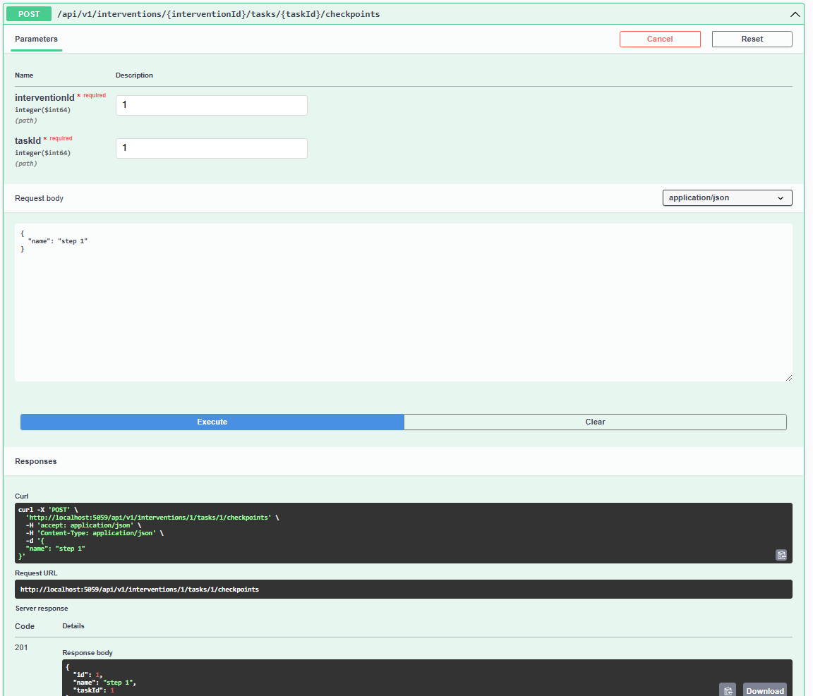

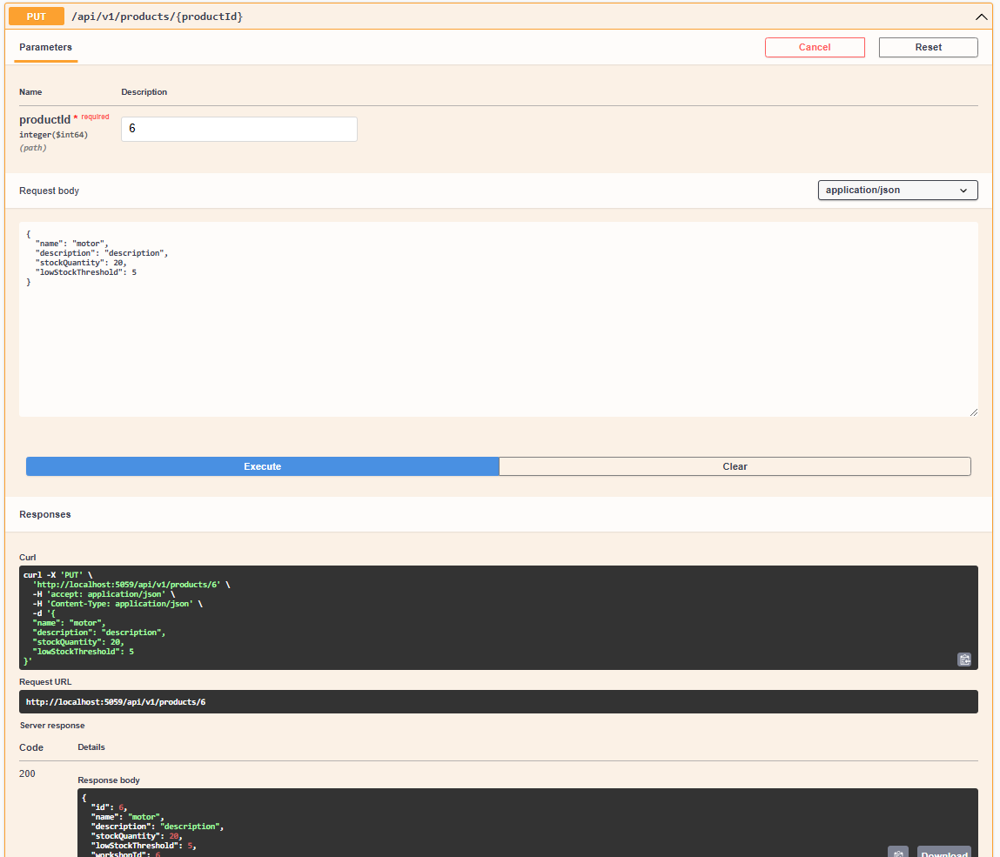

Enlace del repositorio: 
[https://github.com/Web-Application-YaraSoftware/Workshop-N-GINE-Platform](https://github.com/Web-Application-YaraSoftware/Workshop-N-GINE-Platform)

* Web services commits detail

| Repository                                                               | Branch                            | Commit Id                                | Commit Message                                                                                                                                                  | Commit Message Body                                                                                                                                                                                                                                                                                                                                                                                                                                                                                                                                                                                                                                                                                                                                                                                                                                            | Commited on(Date)        |
|--------------------------------------------------------------------------|-----------------------------------|------------------------------------------|-----------------------------------------------------------------------------------------------------------------------------------------------------------------|----------------------------------------------------------------------------------------------------------------------------------------------------------------------------------------------------------------------------------------------------------------------------------------------------------------------------------------------------------------------------------------------------------------------------------------------------------------------------------------------------------------------------------------------------------------------------------------------------------------------------------------------------------------------------------------------------------------------------------------------------------------------------------------------------------------------------------------------------------------|--------------------------|
| https://github.com/Web-Application-YaraSoftware/Workshop-N-GINE-Platform | main                              | 58e2cf14fcb440c60e32bd438dbd88cabda6d4c4 | chore: initial commit                                                                                                                                           |                                                                                                                                                                                                                                                                                                                                                                                                                                                                                                                                                                                                                                                                                                                                                                                                                                                                | Thu Oct 31 02:12:53 2024 |
| https://github.com/Web-Application-YaraSoftware/Workshop-N-GINE-Platform | develop                           | b8b579e3fc60008f713d28c9506e79136fc658cd | chore: added base repository and unit of work contracts                                                                                                         |                                                                                                                                                                                                                                                                                                                                                                                                                                                                                                                                                                                                                                                                                                                                                                                                                                                                | Thu Oct 31 02:32:23 2024 |
| https://github.com/Web-Application-YaraSoftware/Workshop-N-GINE-Platform | develop                           | 677c3d71b382289ad03ad60eb048a9439c4c25c8 | chore: implemented persistence base configuration                                                                                                               |                                                                                                                                                                                                                                                                                                                                                                                                                                                                                                                                                                                                                                                                                                                                                                                                                                                                | Thu Oct 31 02:44:16 2024 |
| https://github.com/Web-Application-YaraSoftware/Workshop-N-GINE-Platform | develop                           | 00dd83c22cc440f896777793ee2d7b8ebf5ce338 | chore: enabled previously commented configuration code for persistence in main program                                                                          |                                                                                                                                                                                                                                                                                                                                                                                                                                                                                                                                                                                                                                                                                                                                                                                                                                                                | Thu Oct 31 02:50:50 2024 |
| https://github.com/Web-Application-YaraSoftware/Workshop-N-GINE-Platform | develop                           | 3c4356b03bab8fc0b20fc73a79d50077858a6262 | chore: implemented interface layer base configuration, including configuration statements in main program                                                       |                                                                                                                                                                                                                                                                                                                                                                                                                                                                                                                                                                                                                                                                                                                                                                                                                                                                | Thu Oct 31 03:04:32 2024 |
| https://github.com/Web-Application-YaraSoftware/Workshop-N-GINE-Platform | develop                           | 3d8a57227e5851f3250874c2f6a964508c6a032f | chore: added needed dependencies                                                                                                                                |                                                                                                                                                                                                                                                                                                                                                                                                                                                                                                                                                                                                                                                                                                                                                                                                                                                                | Thu Oct 31 03:17:56 2024 |
| https://github.com/Web-Application-YaraSoftware/Workshop-N-GINE-Platform | develop                           | 3d08f9d4f2ab4979598c4b93235575041cae56f2 | chore: add base dependency injection configuration                                                                                                              |                                                                                                                                                                                                                                                                                                                                                                                                                                                                                                                                                                                                                                                                                                                                                                                                                                                                | Thu Oct 31 03:21:17 2024 |
| https://github.com/Web-Application-YaraSoftware/Workshop-N-GINE-Platform | feature/profiles-resource         | c270b3dfe64e85fcf3de9d5a6e7ad565b1564d04 | feat(profile): add profile entity as aggregate root in profile context                                                                                          |                                                                                                                                                                                                                                                                                                                                                                                                                                                                                                                                                                                                                                                                                                                                                                                                                                                                | Thu Oct 31 14:36:30 2024 |
| https://github.com/Web-Application-YaraSoftware/Workshop-N-GINE-Platform | feature/profiles-resource         | 14268f24b479da032160fbb0c9abce45f369b856 | feat(profile): add queries to retrieve profile by id, user id, and dni                                                                                          |                                                                                                                                                                                                                                                                                                                                                                                                                                                                                                                                                                                                                                                                                                                                                                                                                                                                | Thu Oct 31 14:38:43 2024 |
| https://github.com/Web-Application-YaraSoftware/Workshop-N-GINE-Platform | feature/profiles-resource         | c1111475fc1e87e0839d09ef4c668d274b5edef5 | feat(profile): configure profile entity in app db context                                                                                                       |                                                                                                                                                                                                                                                                                                                                                                                                                                                                                                                                                                                                                                                                                                                                                                                                                                                                | Thu Oct 31 14:46:26 2024 |
| https://github.com/Web-Application-YaraSoftware/Workshop-N-GINE-Platform | feature/profiles-resource         | 6fad85c520895fd19392158b2cdf36a1e9cee54e | feat(profile): add IProfileRepository interface and implement ProfileRepository class                                                                           | Created IProfileRepository interface to define repository methods for Profile entity. Implemented ProfileRepository class with asynchronous methods FindByDniAsync and FindByUserIdAsync.                                                                                                                                                                                                                                                                                                                                                                                                                                                                                                                                                                                                                                                                      | Thu Oct 31 14:50:15 2024 |
| https://github.com/Web-Application-YaraSoftware/Workshop-N-GINE-Platform | feature/profiles-resource         | ded6808b2d486fc8095f2f899eda83ae6dcd9231 | feat(profile): add IProfileQueryService interface and implement ProfileQueryService class                                                                       | Created IProfileQueryService interface to define query service methods for Profile entity. Implemented ProfileQueryService class with methods to handle profile queries.                                                                                                                                                                                                                                                                                                                                                                                                                                                                                                                                                                                                                                                                                       | Thu Oct 31 15:00:19 2024 |
| https://github.com/Web-Application-YaraSoftware/Workshop-N-GINE-Platform | feature/profiles-resource         | 75010dceb28fe622d8fa6db4312311dc35d38df7 | feat(profile): add ProfileResource and ProfileResourceFromEntityAssembler                                                                                       | Created ProfileResource class to represent profile data in API responses. Implemented ProfileResourceFromEntityAssembler class to convert Profile entities to ProfileResource.                                                                                                                                                                                                                                                                                                                                                                                                                                                                                                                                                                                                                                                                                 | Thu Oct 31 15:01:32 2024 |
| https://github.com/Web-Application-YaraSoftware/Workshop-N-GINE-Platform | feature/profiles-resource         | fa023ccc9a638c5381f1667b81aa4154f6b004f3 | feat(profile): add ProfilesController and update Program.cs                                                                                                     | Created ProfilesController to handle profile-related API endpoints. Updated Program.cs to configure and use ProfilesController.                                                                                                                                                                                                                                                                                                                                                                                                                                                                                                                                                                                                                                                                                                                                | Thu Oct 31 17:16:06 2024 |
| https://github.com/Web-Application-YaraSoftware/Workshop-N-GINE-Platform | feature/user-registration-login   | 6943c0277fb3c8fabee7275931523f11d971cc8b | feat(IAM): add User, Role, and Roles enum                                                                                                                       | Added User class with username, password, role, and workshop IDs. Implemented Role with parsing methods ToRoleFromName and ToRoleFromId. Added Roles enum with Mechanic, WorkshopOwner, and Client roles. Included GetStringName in Role for role name retrieval.                                                                                                                                                                                                                                                                                                                                                                                                                                                                                                                                                                                              | Thu Oct 31 16:57:21 2024 |
| https://github.com/Web-Application-YaraSoftware/Workshop-N-GINE-Platform | feature/user-registration-login   | 081e484132d87ad795aecb9e8a680eb46bc1c37e | feat(IAM): add SeedRolesCommand, SignInCommand, and SignUpCommand records                                                                                       | Added SeedRolesCommand for initializing roles. Implemented SignInCommand and SignUpCommand for user authentication and registration.                                                                                                                                                                                                                                                                                                                                                                                                                                                                                                                                                                                                                                                                                                                           | Thu Oct 31 17:02:06 2024 |
| https://github.com/Web-Application-YaraSoftware/Workshop-N-GINE-Platform | feature/user-registration-login   | 236ce5e3652a29c9ea8539538043ac157a89abb5 | feat(IAM): add GetAllUsersByRoleAndWorkshopQuery                                                                                                                |                                                                                                                                                                                                                                                                                                                                                                                                                                                                                                                                                                                                                                                                                                                                                                                                                                                                | Thu Oct 31 17:04:36 2024 |
| https://github.com/Web-Application-YaraSoftware/Workshop-N-GINE-Platform | feature/user-registration-login   | 7b8d43868299d822e685d988db16c468eecc13cb | feat(IAM): configure Role and User entities in AppDbContext                                                                                                     | Defined primary keys and properties for Role and User entities. Set up unique constraints for Role.Name and User.Username. Established Role-User relationship via foreign key RoleId. Applied snake_case naming convention for database schema.                                                                                                                                                                                                                                                                                                                                                                                                                                                                                                                                                                                                                | Thu Oct 31 17:05:40 2024 |
| https://github.com/Web-Application-YaraSoftware/Workshop-N-GINE-Platform | feature/user-registration-login   | 8bced1fcb6e0f2cb837bd630af79698dfb0be24e | feat(IAM): add Role and User repositories with essential queries                                                                                                | Implemented IRoleRepository with ExistsByName method. Added IUserRepository with methods for user retrieval, password verification, and role/workshop filtering. Created RoleRepository to check if a role exists by name. Developed UserRepository with FindByUsernameAsync, ExistsByUsername, VerifyPassword, and FindAllByRoleAndWorkshopAsync.                                                                                                                                                                                                                                                                                                                                                                                                                                                                                                             | Thu Oct 31 17:07:54 2024 |
| https://github.com/Web-Application-YaraSoftware/Workshop-N-GINE-Platform | feature/user-registration-login   | ce9ec4a96de8f2ead0e80ae4906ed6ee07bcb916 | feat(IAM): implement command and query services for Role and User management                                                                                    | Added RoleCommandService to handle role seeding via SeedRolesCommand. Implemented UserCommandService with SignUpCommand and SignInCommand handling for user creation and authentication. Developed UserQueryService to retrieve users by role and workshop with GetAllUsersByRoleAndWorkshopQuery.                                                                                                                                                                                                                                                                                                                                                                                                                                                                                                                                                             | Thu Oct 31 17:13:14 2024 |
| https://github.com/Web-Application-YaraSoftware/Workshop-N-GINE-Platform | feature/user-registration-login   | 4722a41f9f5c012fa352c982825572b78d8e657d | feat(IAM): add resources and transformers for authentication and user registration                                                                              | Added AuthenticatedUserResource for user response structure. Created transformers for User to AuthenticatedUserResource. Added SignInResource and SignUpResource with transformers to convert to SignInCommand and SignUpCommand.                                                                                                                                                                                                                                                                                                                                                                                                                                                                                                                                                                                                                              | Thu Oct 31 17:17:36 2024 |
| https://github.com/Web-Application-YaraSoftware/Workshop-N-GINE-Platform | feature/user-registration-login   | c73e5609d4206b92c7971bd9f5805df59f245263 | feat(IAM): add authentication endpoints and configure services                                                                                                  | Added AuthenticationController with sign-up and sign-in endpoints using UserCommandService. Configured Swagger documentation for AuthenticationController. Injected IAM services: IRoleRepository, IRoleCommandService, IUserRepository, IUserCommandService. Registered ApplicationReadyEventHandler as a hosted service.                                                                                                                                                                                                                                                                                                                                                                                                                                                                                                                                     | Thu Oct 31 17:18:45 2024 |
| https://github.com/Web-Application-YaraSoftware/Workshop-N-GINE-Platform | feature/user-registration-login   | 4b7dfb0f2b6e37b06d5cba32b3c84472eca5a32c | feat(IAM): implement ApplicationReadyEventHandler for role seeding on startup                                                                                   | Added ApplicationReadyEventHandler to seed roles at application startup. Injected IRoleCommandService to execute SeedRolesCommand. Logged information and errors for seeding process.                                                                                                                                                                                                                                                                                                                                                                                                                                                                                                                                                                                                                                                                          | Thu Oct 31 17:19:30 2024 |
| https://github.com/Web-Application-YaraSoftware/Workshop-N-GINE-Platform | feature/user-registration-login   | f02140f7b1b9b61f650b4f175e1c20e030fda358 | feat(IAM): add IamContextFacade to retrieve user IDs by role and workshop                                                                                       | Implemented IIamContextFacade with FetchAllUsersByRoleAndWorkshop. Utilized IUserQueryService to handle GetAllUsersByRoleAndWorkshopQuery.                                                                                                                                                                                                                                                                                                                                                                                                                                                                                                                                                                                                                                                                                                                     | Thu Oct 31 17:20:13 2024 |
| https://github.com/Web-Application-YaraSoftware/Workshop-N-GINE-Platform | main                              | 10c507a811745e832f502f1a4877ce27318af0f1 | Merge pull request #1 from Web-Application-YaraSoftware/feature/user-registration-login                                                                         |                                                                                                                                                                                                                                                                                                                                                                                                                                                                                                                                                                                                                                                                                                                                                                                                                                                                | Thu Oct 31 17:24:24 2024 |
| https://github.com/Web-Application-YaraSoftware/Workshop-N-GINE-Platform | feature/profiles-resource         | 28bb5013bf4cc6be9d70e660871a0cd6cb02410d | feat(profile): add CreateProfileCommand and UpdateProfileCommand                                                                                                | Added CreateProfileCommand to handle profile creation. Added UpdateProfileCommand to handle profile updates.                                                                                                                                                                                                                                                                                                                                                                                                                                                                                                                                                                                                                                                                                                                                                   | Thu Oct 31 17:28:58 2024 |
| https://github.com/Web-Application-YaraSoftware/Workshop-N-GINE-Platform | feature/profiles-resource         | 4ab65d2d463847f604389f0955b96f398878ac7e | feat(profile): add IProfileCommandService and ProfileCommandService                                                                                             | Added IProfileCommandService interface to define profile command operations. Implemented ProfileCommandService to handle profile command operations.                                                                                                                                                                                                                                                                                                                                                                                                                                                                                                                                                                                                                                                                                                           | Thu Oct 31 17:31:58 2024 |
| https://github.com/Web-Application-YaraSoftware/Workshop-N-GINE-Platform | feature/profiles-resource         | 6b02ac1a6ffba1c5f91dbbdc94113ed5ddac4805 | feat(profile): add updateProfileInformation method to Profile entity to update profile details                                                                  |                                                                                                                                                                                                                                                                                                                                                                                                                                                                                                                                                                                                                                                                                                                                                                                                                                                                | Thu Oct 31 17:34:55 2024 |
| https://github.com/Web-Application-YaraSoftware/Workshop-N-GINE-Platform | feature/profiles-resource         | 310caf086398e1883c8eeafb454067ab550d26d8 | feat(profile): add IProfileContextFacade and ProfileContextFacade to manage inbound actions for creating and updating profiles                                  | Added IProfileContextFacade interface to define context operations for profiles. Implemented ProfileContextFacade to handle context operations for creating and updating profiles.                                                                                                                                                                                                                                                                                                                                                                                                                                                                                                                                                                                                                                                                             | Thu Oct 31 17:40:39 2024 |
| https://github.com/Web-Application-YaraSoftware/Workshop-N-GINE-Platform | feature/profiles-resource         | e9259a2b25f85a1fefeda707408f636615522fef | feat(profile): add CreateUpdateProfileCommandFromResourceAssembler, UpdateProfileResource, CreateProfileCommandFromResourceAssembler, and CreateProfileResource |                                                                                                                                                                                                                                                                                                                                                                                                                                                                                                                                                                                                                                                                                                                                                                                                                                                                | Thu Oct 31 17:42:13 2024 |
| https://github.com/Web-Application-YaraSoftware/Workshop-N-GINE-Platform | feature/profiles-resource         | fef8a32650b884e61ebc2a000fd51bcf0819e03e | feat(profile): add put and post methods to ProfilesController                                                                                                   |                                                                                                                                                                                                                                                                                                                                                                                                                                                                                                                                                                                                                                                                                                                                                                                                                                                                | Thu Oct 31 18:01:20 2024 |
| https://github.com/Web-Application-YaraSoftware/Workshop-N-GINE-Platform | feature/profiles-resource         | 3d4263b85e0b463cc2ba3a619f3a2cba233de182 | refactor: modify constructor related to CreateProfileCommand                                                                                                    |                                                                                                                                                                                                                                                                                                                                                                                                                                                                                                                                                                                                                                                                                                                                                                                                                                                                | Thu Oct 31 18:12:12 2024 |
| https://github.com/Web-Application-YaraSoftware/Workshop-N-GINE-Platform | feature/profiles-resource         | dd7059515b68aa8eda7f042d36b60982d72b2c46 | Merge branch 'develop' into feature/profiles-resource                                                                                                           |                                                                                                                                                                                                                                                                                                                                                                                                                                                                                                                                                                                                                                                                                                                                                                                                                                                                | Thu Oct 31 18:20:18 2024 |
| https://github.com/Web-Application-YaraSoftware/Workshop-N-GINE-Platform | main                              | c90190a2b38bf3d8271a779931cc6b39e34e5014 | Merge pull request #2 from Web-Application-YaraSoftware/feature/profiles-resource                                                                               |                                                                                                                                                                                                                                                                                                                                                                                                                                                                                                                                                                                                                                                                                                                                                                                                                                                                | Thu Oct 31 18:20:28 2024 |
| https://github.com/Web-Application-YaraSoftware/Workshop-N-GINE-Platform | feature/manage-workshop           | 131834259c96c8e7e1f591535dbe3ddbc8ba2009 | feat: add command handling for creating users with specific roles                                                                                               | - Added methods to `IUserCommandService` interface for handling client and mechanic user creation. Implemented methods in `UserCommandService` class for handling client and mechanic user creation.                                                                                                                                                                                                                                                                                                                                                                                                                                                                                                                                                                                                                                                           | Thu Nov 7 16:59:13 2024  |
| https://github.com/Web-Application-YaraSoftware/Workshop-N-GINE-Platform | feature/manage-workshop           | 4873fcd2823437e72f380113eb262b88dd91e4ae | feat: add query handling for fetching users by specific roles                                                                                                   | - Added methods to `IUserQueryService` interface for handling client and mechanic user queries. Implemented methods in `UserQueryService` class for handling client and mechanic user queries.                                                                                                                                                                                                                                                                                                                                                                                                                                                                                                                                                                                                                                                                 | Thu Nov 7 16:59:50 2024  |
| https://github.com/Web-Application-YaraSoftware/Workshop-N-GINE-Platform | feature/manage-workshop           | 32cab44b7f85c288349f505bb3b435d7aa98e667 | feat: update `IIamContextFacade` and `IamContextFacade` for specific role handling                                                                              | - Added methods to `IIamContextFacade` interface for handling client and mechanic user queries and commands. Implemented methods in `IamContextFacade` class for handling client and mechanic user queries and commands.                                                                                                                                                                                                                                                                                                                                                                                                                                                                                                                                                                                                                                       | Thu Nov 7 17:00:32 2024  |
| https://github.com/Web-Application-YaraSoftware/Workshop-N-GINE-Platform | main                              | cf101ea7a440347b4eab6f8ab464ee0a69603feb | Merge pull request #7 from Web-Application-YaraSoftware/feature/user-registration-login                                                                         |                                                                                                                                                                                                                                                                                                                                                                                                                                                                                                                                                                                                                                                                                                                                                                                                                                                                | Thu Nov 7 17:02:11 2024  |
| https://github.com/Web-Application-YaraSoftware/Workshop-N-GINE-Platform | feature/manage-workshop           | c81c3c29ad50817cb58d8b2508e03f12c5220731 | feat(service): add command and query records for workshop operations                                                                                            |                                                                                                                                                                                                                                                                                                                                                                                                                                                                                                                                                                                                                                                                                                                                                                                                                                                                | Thu Nov 7 19:05:48 2024  |
| https://github.com/Web-Application-YaraSoftware/Workshop-N-GINE-Platform | feature/manage-workshop           | 36009302c8c29791dbd846b1798de5eef697f29c | feat(service): add workshop repository interface and implementation                                                                                             |                                                                                                                                                                                                                                                                                                                                                                                                                                                                                                                                                                                                                                                                                                                                                                                                                                                                | Thu Nov 7 19:07:01 2024  |
| https://github.com/Web-Application-YaraSoftware/Workshop-N-GINE-Platform | feature/manage-workshop           | 482a1f45eefe08364d43d689476843f9346e28c5 | feat(service): add workshop command service interface and implementation                                                                                        | - Added `IWorkshopCommandService` interface for defining methods to handle workshop creation and updates. Implemented `WorkshopCommandService` class to process workshop creation and updates, ensuring proper validation and persistence of workshop data.                                                                                                                                                                                                                                                                                                                                                                                                                                                                                                                                                                                                    | Thu Nov 7 19:09:00 2024  |
| https://github.com/Web-Application-YaraSoftware/Workshop-N-GINE-Platform | feature/manage-workshop           | c7c583dbb98992052f96a6e5261a55add4849dee | feat(service): add workshop query service interface and implementation                                                                                          |                                                                                                                                                                                                                                                                                                                                                                                                                                                                                                                                                                                                                                                                                                                                                                                                                                                                | Thu Nov 7 19:11:53 2024  |
| https://github.com/Web-Application-YaraSoftware/Workshop-N-GINE-Platform | feature/manage-workshop           | f21eadbb799e61c90353036bc4038b20a7a66049 | feat(service): add Workshop aggregate with command handling                                                                                                     |                                                                                                                                                                                                                                                                                                                                                                                                                                                                                                                                                                                                                                                                                                                                                                                                                                                                | Thu Nov 7 19:12:57 2024  |
| https://github.com/Web-Application-YaraSoftware/Workshop-N-GINE-Platform | feature/manage-workshop           | 6d6dc5a9bd9b6ac6272aceec67fd3aa6be372f26 | feat(service): add workshop resource records                                                                                                                    |                                                                                                                                                                                                                                                                                                                                                                                                                                                                                                                                                                                                                                                                                                                                                                                                                                                                | Thu Nov 7 19:13:43 2024  |
| https://github.com/Web-Application-YaraSoftware/Workshop-N-GINE-Platform | feature/manage-workshop           | 6d7df905915e10bc9a8c4a85676d814d1f848340 | feat(service): add assemblers for transforming resources to commands and entities to resources                                                                  | - Added `CreateWorkshopCommandFromResourceAssembler` class to transform `CreateWorkshopResource` to `CreateWorkshopCommand`. Added `UpdateWorkshopCommandFromResourceAssembler` class to transform `UpdateWorkshopResource` to `UpdateWorkshopCommand`. Added `WorkshopResourceFromEntityAssembler` class to transform `Workshop` entity to `WorkshopResource`.                                                                                                                                                                                                                                                                                                                                                                                                                                                                                                | Thu Nov 7 19:14:33 2024  |
| https://github.com/Web-Application-YaraSoftware/Workshop-N-GINE-Platform | feature/manage-workshop           | a97a3ab8763b2c13e64c8c097f7576b2279e56d9 | feat(service): add WorkshopsController with CRUD operations                                                                                                     | - Added `WorkshopsController` class to handle HTTP requests for workshop operations. Implemented `GetWorkshopById` method to fetch workshop details by a given identifier. Implemented `CreateWorkshop` method to create a new workshop with a given name. Implemented `UpdateWorkshop` method to update workshop details with a given identifier.                                                                                                                                                                                                                                                                                                                                                                                                                                                                                                             | Thu Nov 7 19:15:06 2024  |
| https://github.com/Web-Application-YaraSoftware/Workshop-N-GINE-Platform | feature/manage-workshop           | dcfe07255300a3d71fa3a7d421a1258625e5c397 | feat(service): add Workshop entity configuration and dependency injection                                                                                       | - Added `Workshop` entity configuration in `AppDbContext` to define the workshop table schema. Configured dependency injection for `IWorkshopRepository`, `IWorkshopCommandService`, and `IWorkshopQueryService` in the service bounded context.                                                                                                                                                                                                                                                                                                                                                                                                                                                                                                                                                                                                               | Thu Nov 7 19:16:12 2024  |
| https://github.com/Web-Application-YaraSoftware/Workshop-N-GINE-Platform | feature/manage-workshop           | 08eaa8be768dc8f8ac383c3f70933040dd6451c3 | feat(service): add UserId and ProfileId value object                                                                                                            |                                                                                                                                                                                                                                                                                                                                                                                                                                                                                                                                                                                                                                                                                                                                                                                                                                                                | Thu Nov 7 22:55:47 2024  |
| https://github.com/Web-Application-YaraSoftware/Workshop-N-GINE-Platform | feature/manage-workshop           | ca52b1e32c15255c619b07761eb009698d7d37ed | feat(service): add commands and queries for client and mechanic operations                                                                                      | - Added `CreateClientCommand` record to represent the data required to create a client. Added `CreateMechanicCommand` record to represent the data required to create a mechanic. Added `GetAllUsersIdWithRoleClientQuery` record to represent the query for fetching all client user IDs for a workshop. Added `GetAllUsersIdWithRoleMechanicQuery` record to represent the query for fetching all mechanic user IDs for a workshop.                                                                                                                                                                                                                                                                                                                                                                                                                          | Thu Nov 7 22:57:04 2024  |
| https://github.com/Web-Application-YaraSoftware/Workshop-N-GINE-Platform | feature/manage-workshop           | a9bfea0878c51a4a0c0c9369c08baae4526a1092 | feat(service): add external IAM and profile services                                                                                                            | - Added `ExternalIamService` class to handle IAM-related operations. Added `ExternalProfileService` class to handle profile-related operations.                                                                                                                                                                                                                                                                                                                                                                                                                                                                                                                                                                                                                                                                                                                | Thu Nov 7 22:58:20 2024  |
| https://github.com/Web-Application-YaraSoftware/Workshop-N-GINE-Platform | feature/manage-workshop           | aa21402149fff9a63db23d51dbf6792a7e58147e | feat(service): add ExistsById method to IWorkshopRepository and WorkshopRepository                                                                              |                                                                                                                                                                                                                                                                                                                                                                                                                                                                                                                                                                                                                                                                                                                                                                                                                                                                | Thu Nov 7 23:01:35 2024  |
| https://github.com/Web-Application-YaraSoftware/Workshop-N-GINE-Platform | feature/manage-workshop           | 4d9c48359e7f8738aff1009156ee086154445e14 | feat(service): add query handling for fetching users by role                                                                                                    |                                                                                                                                                                                                                                                                                                                                                                                                                                                                                                                                                                                                                                                                                                                                                                                                                                                                | Thu Nov 7 23:04:15 2024  |
| https://github.com/Web-Application-YaraSoftware/Workshop-N-GINE-Platform | feature/manage-workshop           | 9d257f20641f438f331d0cc0d96dcc7131412ad1 | feat(service): implement user and profile creation commands                                                                                                     | - Added methods to handle the creation of clients and mechanics. Integrated services for user and profile creation.                                                                                                                                                                                                                                                                                                                                                                                                                                                                                                                                                                                                                                                                                                                                            | Thu Nov 7 23:07:31 2024  |
| https://github.com/Web-Application-YaraSoftware/Workshop-N-GINE-Platform | feature/manage-workshop           | b0b2a4164f5489077f304470782faf2443cc6ab0 | feat(service): add resources and assemblers for client and mechanic creation                                                                                    | - Added `CreateClientResource` and `CreateMechanicResource` records. Implemented assemblers to convert resources to commands.                                                                                                                                                                                                                                                                                                                                                                                                                                                                                                                                                                                                                                                                                                                                  | Thu Nov 7 23:09:16 2024  |
| https://github.com/Web-Application-YaraSoftware/Workshop-N-GINE-Platform | feature/manage-workshop           | 11e7d7c1d99ff03271cb9e6a800f0b780c83914f | feat(controller): add endpoints for managing clients and mechanics in workshops                                                                                 | - Added endpoints to get clients and mechanics for a workshop. Added endpoints to add clients and mechanics to a workshop.                                                                                                                                                                                                                                                                                                                                                                                                                                                                                                                                                                                                                                                                                                                                     | Thu Nov 7 23:09:56 2024  |
| https://github.com/Web-Application-YaraSoftware/Workshop-N-GINE-Platform | feature/manage-workshop           | 6655bb87e1537e7c405de832bd14cb0ac0579e1f | feat(configuration): update dependency injection and service configuration                                                                                      | - Added `UserQueryService` and `IamContextFacade` to IAM bounded context injection. Added `ExternalIamService` and `ExternalProfileService` to service bounded context injection.                                                                                                                                                                                                                                                                                                                                                                                                                                                                                                                                                                                                                                                                              | Thu Nov 7 23:10:44 2024  |
| https://github.com/Web-Application-YaraSoftware/Workshop-N-GINE-Platform | main                              | 3e54b41e975a3cf29923bcac2f99068c54659f44 | Merge pull request #8 from Web-Application-YaraSoftware/feature/manage-workshop                                                                                 |                                                                                                                                                                                                                                                                                                                                                                                                                                                                                                                                                                                                                                                                                                                                                                                                                                                                | Thu Nov 7 23:30:30 2024  |
| https://github.com/Web-Application-YaraSoftware/Workshop-N-GINE-Platform | feature/manage-intervention       | 7651a4246f07cc691a65a4175faf52b88b6e072c | feat(service): add Intervention aggregate with commands and value objects                                                                                       | - Added `Intervention` aggregate with properties and methods for managing interventions. Implemented constructors for creating interventions from commands. Added methods to update intervention details and convert status and type to string.                                                                                                                                                                                                                                                                                                                                                                                                                                                                                                                                                                                                                | Fri Nov 8 03:05:34 2024  |
| https://github.com/Web-Application-YaraSoftware/Workshop-N-GINE-Platform | feature/manage-intervention       | 59c9e7ec89c1e043684a94fa5e0ffaf4dfe7a839 | feat(service): add Task entity with commands and value objects                                                                                                  | - Added `Task` entity with properties and methods for managing tasks. Implemented constructors for creating tasks from commands. Added `TaskStatuses` enum for task status management.                                                                                                                                                                                                                                                                                                                                                                                                                                                                                                                                                                                                                                                                         | Fri Nov 8 03:06:59 2024  |
| https://github.com/Web-Application-YaraSoftware/Workshop-N-GINE-Platform | feature/manage-intervention       | 44bc8061931b18d8a316b0e1d35f51d9f7731a47 | feat(configuration): add Intervention and Task entities to AppDbContext                                                                                         | - Added `Intervention` entity configuration with properties and relationships. Added `Task` entity configuration with properties and relationships.                                                                                                                                                                                                                                                                                                                                                                                                                                                                                                                                                                                                                                                                                                            | Fri Nov 8 03:07:47 2024  |
| https://github.com/Web-Application-YaraSoftware/Workshop-N-GINE-Platform | feature/manage-intervention       | 198edaabe88f928fbc0f5ed01ee872fc35a9877f | feat(service): add CreateInterventionCommand, CreateTaskCommand, and UpdateInterventionCommand                                                                  |                                                                                                                                                                                                                                                                                                                                                                                                                                                                                                                                                                                                                                                                                                                                                                                                                                                                | Fri Nov 8 03:09:45 2024  |
| https://github.com/Web-Application-YaraSoftware/Workshop-N-GINE-Platform | feature/manage-intervention       | 0683c615d7f1c99f7d11ad40c60b46091f9eb552 | feat(service): add GetAllInterventionsByWorkshopQuery and GetInterventionByIdQuery                                                                              |                                                                                                                                                                                                                                                                                                                                                                                                                                                                                                                                                                                                                                                                                                                                                                                                                                                                | Fri Nov 8 03:10:15 2024  |
| https://github.com/Web-Application-YaraSoftware/Workshop-N-GINE-Platform | feature/manage-intervention       | 1342ed0c0be891569ecad56af579ee1807927513 | feat(service): add IInterventionRepository and its implementation                                                                                               | - Added `IInterventionRepository` interface extending `IBaseRepository` with a method to find interventions by workshop ID. Implemented `InterventionRepository` class with the method to find all interventions by workshop ID.                                                                                                                                                                                                                                                                                                                                                                                                                                                                                                                                                                                                                               | Fri Nov 8 03:12:18 2024  |
| https://github.com/Web-Application-YaraSoftware/Workshop-N-GINE-Platform | feature/manage-intervention       | a16e5d1cfb7b56c44fc2678121c54e026c0d608d | feat(service): add IInterventionQueryService and its implementation                                                                                             | - Added `IInterventionQueryService` interface with methods to handle queries for fetching interventions by ID and by workshop. Implemented `InterventionQueryService` class with methods to handle fetching interventions by ID and by workshop.                                                                                                                                                                                                                                                                                                                                                                                                                                                                                                                                                                                                               | Fri Nov 8 03:13:29 2024  |
| https://github.com/Web-Application-YaraSoftware/Workshop-N-GINE-Platform | feature/manage-intervention       | 9e2832049571cbc205a5894c8a1462b4ec563040 | feat(service): add Intervention resources                                                                                                                       | - Added `CreateInterventionResource` record for creating interventions. Added `InterventionResource` record for representing intervention details. Added `UpdateInterventionResource` record for updating interventions.                                                                                                                                                                                                                                                                                                                                                                                                                                                                                                                                                                                                                                       | Fri Nov 8 03:14:28 2024  |
| https://github.com/Web-Application-YaraSoftware/Workshop-N-GINE-Platform | feature/manage-intervention       | 4f556e5851451a2e04ea5acc210ce262a6ece00f | feat(service): add resource assemblers for Intervention commands and entities                                                                                   | - Added `CreateInterventionCommandFromResourceAssembler` class to convert `CreateInterventionResource` to `CreateInterventionCommand`. Added `InterventionResourceFromEntityAssembler` class to convert `Intervention` entity to `InterventionResource`. Added `UpdateInterventionCommandFromResourceAssembler` class to convert `UpdateInterventionResource` to `UpdateInterventionCommand`.                                                                                                                                                                                                                                                                                                                                                                                                                                                                  | Fri Nov 8 03:14:59 2024  |
| https://github.com/Web-Application-YaraSoftware/Workshop-N-GINE-Platform | feature/manage-intervention       | 9bf204c0c55eb0d2bdc3818276a099aef831313a | feat(service): add WorkshopsInterventionsController                                                                                                             | - Added `WorkshopsInterventionsController` class to handle HTTP GET requests for fetching all interventions for a workshop. Implemented `GetInterventionsForWorkshop` method to fetch interventions by workshop ID and return them as `InterventionResource`.                                                                                                                                                                                                                                                                                                                                                                                                                                                                                                                                                                                                  | Fri Nov 8 03:15:34 2024  |
| https://github.com/Web-Application-YaraSoftware/Workshop-N-GINE-Platform | feature/manage-intervention       | abc50a0365063ff4372a8942997c1a654a1ba4db | feat(service): add InterventionsController                                                                                                                      | - Added `InterventionsController` class to handle HTTP requests for interventions. Implemented `GetInterventionById` method to fetch an intervention by ID and return it as `InterventionResource`. Implemented `CreateIntervention` method to create a new intervention and return it as `InterventionResource`. Implemented `UpdateIntervention` method to update an existing intervention and return it as `InterventionResource`.                                                                                                                                                                                                                                                                                                                                                                                                                          | Fri Nov 8 03:15:52 2024  |
| https://github.com/Web-Application-YaraSoftware/Workshop-N-GINE-Platform | feature/manage-intervention       | 2ae1fbab37b54748e6f341367b442b96d2c0b23c | feat(configuration): add dependency injection for Intervention services                                                                                         | - Added `IInterventionRepository`, `IInterventionCommandService`, and `IInterventionQueryService` to the service container.                                                                                                                                                                                                                                                                                                                                                                                                                                                                                                                                                                                                                                                                                                                                    | Fri Nov 8 03:16:19 2024  |
| https://github.com/Web-Application-YaraSoftware/Workshop-N-GINE-Platform | main                              | 51c2a079b27daabc27efde51656d190d58087bd6 | Merge pull request #9 from Web-Application-YaraSoftware/feature/manage-intervention                                                                             |                                                                                                                                                                                                                                                                                                                                                                                                                                                                                                                                                                                                                                                                                                                                                                                                                                                                | Fri Nov 8 03:16:59 2024  |
| https://github.com/Web-Application-YaraSoftware/Workshop-N-GINE-Platform | feature/manage-intervention       | cd8a7a4d491220584ee7c6ede095ffdb816c8399 | feat(service): add scheduled date and task management to Intervention                                                                                           | - Added `ScheduledAt` property to `Intervention` to track the scheduled date. Added methods to manage tasks within an intervention: `FindTaskById`, `AddTask`, `UpdateTask`, `RemoveTask`, `FindAllTasksByMechanicAssignedId`. Added methods to manage intervention status: `Start`, `Finish`, `Cancel`. Updated constructors to include `ScheduledAt` property.                                                                                                                                                                                                                                                                                                                                                                                                                                                                                               | Fri Nov 8 20:08:00 2024  |
| https://github.com/Web-Application-YaraSoftware/Workshop-N-GINE-Platform | feature/manage-task               | b9ed7736f2c95b178096130169e76dff792545cc | feat(service): add status conversion and update based on the a command to Task entity                                                                           |                                                                                                                                                                                                                                                                                                                                                                                                                                                                                                                                                                                                                                                                                                                                                                                                                                                                | Fri Nov 8 20:09:45 2024  |
| https://github.com/Web-Application-YaraSoftware/Workshop-N-GINE-Platform | feature/manage-task               | 57f08958098c26b0dcc6e1a1c9f6b1f15778cb6e | feat(program): configure JSON options to ignore reference cycles                                                                                                |                                                                                                                                                                                                                                                                                                                                                                                                                                                                                                                                                                                                                                                                                                                                                                                                                                                                | Fri Nov 8 20:11:54 2024  |
| https://github.com/Web-Application-YaraSoftware/Workshop-N-GINE-Platform | feature/manage-task               | 0a5e7bb89dd2ecbbba1dc14bab3672f6c27ec402 | feat: add ScheduledAt param to create and update an Intervention                                                                                                |                                                                                                                                                                                                                                                                                                                                                                                                                                                                                                                                                                                                                                                                                                                                                                                                                                                                | Fri Nov 8 20:14:06 2024  |
| https://github.com/Web-Application-YaraSoftware/Workshop-N-GINE-Platform | feature/manage-task               | 2db3983d2d0cc5956330e85b11ff984cb3dc6a07 | feat(commands): add command records for intervention and task operations                                                                                        | - Added `CancelInterventionCommand` record. Added `CompleteInterventionCommand` record. Added `CreateTaskCommand` record. Added `DeleteTaskCommand` record. Added `InProgressInterventionCommand` record. Added `UpdateTaskCommand` record.                                                                                                                                                                                                                                                                                                                                                                                                                                                                                                                                                                                                                    | Fri Nov 8 20:17:20 2024  |
| https://github.com/Web-Application-YaraSoftware/Workshop-N-GINE-Platform | feature/manage-task               | 3580dfeb61817cd9cb864e6663491363b635b0f4 | feat(queries): add query records for fetching tasks by intervention and mechanic assigned                                                                       | - Added `GetAllTasksByInterventionAndMechanicAssignedQuery` record. Added `GetAllTasksByInterventionQuery` record.                                                                                                                                                                                                                                                                                                                                                                                                                                                                                                                                                                                                                                                                                                                                             | Fri Nov 8 20:18:29 2024  |
| https://github.com/Web-Application-YaraSoftware/Workshop-N-GINE-Platform | feature/manage-task               | 7190f3fe80a36adf3e7d6890c6b7f0c1f7d7b669 | feat(repository): extend InterventionRepository with additional methods                                                                                         | - Added `ExistsById` method to check if an intervention exists by its ID. Added `FindByIdWithTasksAsync` method to find an intervention by ID including its tasks. Added `ExistsByVehicleIdAndStatusIsPending` method to check if an intervention exists by vehicle ID and pending status. Added `ExistsByMechanicLeaderIdAndTimeRange` method to check if an intervention exists by mechanic leader ID and a specific time range.                                                                                                                                                                                                                                                                                                                                                                                                                             | Fri Nov 8 20:20:16 2024  |
| https://github.com/Web-Application-YaraSoftware/Workshop-N-GINE-Platform | feature/manage-task               | 165a19900f93d4f6d8b9f19033c715567f31c1fe | feat(resources): add resource records for task and intervention operations                                                                                      | - Added `CreateTaskResource` record. Updated `InterventionResource` record by adding ScheduledDate param. Added `TaskResource` record. Added `UpdateTaskResource` record.                                                                                                                                                                                                                                                                                                                                                                                                                                                                                                                                                                                                                                                                                      | Fri Nov 8 20:24:20 2024  |
| https://github.com/Web-Application-YaraSoftware/Workshop-N-GINE-Platform | feature/manage-task               | e255000c4452663058b7c6f8f5fbe31b02d8bef3 | feat: add resource to command and entity to resource assemblers                                                                                                 | - Added `CreateTaskCommandFromResourceAssembler` class to convert `CreateTaskResource` to `CreateTaskCommand`. Updated `InterventionResourceFromEntityAssembler` by adding ScheduledAt param. Added `TaskResourceFromEntityAssembler` class to convert `Task` entity to `TaskResource`. Added `UpdateTaskCommandFromResourceAssembler` class to convert `UpdateTaskResource` to `UpdateTaskCommand`.                                                                                                                                                                                                                                                                                                                                                                                                                                                           | Fri Nov 8 20:26:58 2024  |
| https://github.com/Web-Application-YaraSoftware/Workshop-N-GINE-Platform | feature/manage-task               | 34935bf93877a77501193f5d4d21b374998dba3d | feat: extend InterventionCommandService with additional task and intervention operations                                                                        | - Added methods to handle task creation, update, and deletion within an intervention. Added methods to handle intervention status changes (in-progress, complete, cancel).                                                                                                                                                                                                                                                                                                                                                                                                                                                                                                                                                                                                                                                                                     | Fri Nov 8 20:29:35 2024  |
| https://github.com/Web-Application-YaraSoftware/Workshop-N-GINE-Platform | feature/manage-task               | 2648885cf7e3361c2b5920b2c848abbbb658a1a7 | feat: extend InterventionQueryService with task query methods                                                                                                   | - Added methods to handle fetching all tasks from an intervention. Added methods to handle fetching tasks assigned to a specific mechanic within an intervention.                                                                                                                                                                                                                                                                                                                                                                                                                                                                                                                                                                                                                                                                                              | Fri Nov 8 20:30:30 2024  |
| https://github.com/Web-Application-YaraSoftware/Workshop-N-GINE-Platform | feature/manage-task               | adc821d305a2424138f27fe83af86196e31d707d | feat: extend InterventionsController with additional intervention status operations                                                                             | - Added endpoints to set an intervention in-progress, complete an intervention, and cancel an intervention.                                                                                                                                                                                                                                                                                                                                                                                                                                                                                                                                                                                                                                                                                                                                                    | Fri Nov 8 20:31:24 2024  |
| https://github.com/Web-Application-YaraSoftware/Workshop-N-GINE-Platform | feature/manage-task               | 96964f05289274bb446c77d67e7a2de15334a427 | feat(controller): add task management endpoints to InterventionsTaskController                                                                                  | - Added endpoint to get all tasks from an intervention, optionally filtered by mechanic leader. Added endpoint to add a new task to an intervention. Added endpoint to update an existing task within an intervention. Added endpoint to delete a task from an intervention.                                                                                                                                                                                                                                                                                                                                                                                                                                                                                                                                                                                   | Fri Nov 8 20:32:03 2024  |
| https://github.com/Web-Application-YaraSoftware/Workshop-N-GINE-Platform | main                              | 16455e2f11ba86eaf05b225ff51aa70bbba12263 | Merge pull request #10 from Web-Application-YaraSoftware/feature/manage-task                                                                                    |                                                                                                                                                                                                                                                                                                                                                                                                                                                                                                                                                                                                                                                                                                                                                                                                                                                                | Fri Nov 8 20:33:35 2024  |
| https://github.com/Web-Application-YaraSoftware/Workshop-N-GINE-Platform | feature/manage-intervention       | 84ac0341a3465e3cf698978cff4f8204b919b721 | feat(queries): add queries for fetching interventions by roles                                                                                                  | - Added `GetAllInterventionsByWorkshopAndMechanicAssistant query to retrieve interventions associated with a specific mechanic assistant. Added `GetAllInterventionsByWorkshopAndMechanicLeader query to fetch interventions linked to a mechanic leader.                                                                                                                                                                                                                                                                                                                                                                                                                                                                                                                                                                                                      | Mon Nov 11 18:28:41 2024 |
| https://github.com/Web-Application-YaraSoftware/Workshop-N-GINE-Platform | feature/manage-intervention       | 823713ae0ee3996e7419f4d69d3dd40e1a7a10ff | feat(intervention): add method to check task existence by mechanic id                                                                                           |                                                                                                                                                                                                                                                                                                                                                                                                                                                                                                                                                                                                                                                                                                                                                                                                                                                                | Mon Nov 11 18:31:26 2024 |
| https://github.com/Web-Application-YaraSoftware/Workshop-N-GINE-Platform | feature/manage-intervention       | 52867dd323f079cdf5744ea6aed1a27f03bf3a0d | feat(intervention-repository): add methods for filtering interventions by mechanic leader                                                                       | - add FindAllByWorkshopAndMechanicLeaderIdAsync method to fetch interventions for a specific workshop and mechanic leader. add FindAllByWorkshopAndIsNotMechanicLeaderIdAsync method to retrieve interventions excluding a specific mechanic leader and include related tasks.                                                                                                                                                                                                                                                                                                                                                                                                                                                                                                                                                                                 | Mon Nov 11 18:33:28 2024 |
| https://github.com/Web-Application-YaraSoftware/Workshop-N-GINE-Platform | feature/manage-intervention       | 2d9fb297e80304c414966d3a77c9791a09cf9601 | feat(query-service): add support for filtering interventions by mechanic roles                                                                                  | - add method to handle queries for fetching interventions by workshop and mechanic leader. add method to handle queries for fetching interventions by workshop and mechanic assistant with task assignment filtering.                                                                                                                                                                                                                                                                                                                                                                                                                                                                                                                                                                                                                                          | Mon Nov 11 18:37:41 2024 |
| https://github.com/Web-Application-YaraSoftware/Workshop-N-GINE-Platform | feature/manage-intervention       | 455c5b36b3ee8d49d87274ac685dda1d7caf28c3 | feat(controller): add filtering options for interventions by mechanic roles                                                                                     | - update GetInterventionsForWorkshop endpoint to include query parameters for mechanic leader and mechanic assistant filtering. implement logic to handle interventions retrieval based on mechanic role identifiers. maintain fallback to fetch all interventions when no role-specific parameters are provided.                                                                                                                                                                                                                                                                                                                                                                                                                                                                                                                                              | Mon Nov 11 18:40:05 2024 |
| https://github.com/Web-Application-YaraSoftware/Workshop-N-GINE-Platform | main                              | 717d740bb3d76d99a011430026b9f93483f5171e | chore(configuration): add CORS policy to allow all origins, methods, and headers                                                                                |                                                                                                                                                                                                                                                                                                                                                                                                                                                                                                                                                                                                                                                                                                                                                                                                                                                                | Mon Nov 11 22:39:26 2024 |
| https://github.com/Web-Application-YaraSoftware/Workshop-N-GINE-Platform | main                              | 92a7137ff915c4978e35e6e52bbd7d85b502eab7 | Merge pull request #11 from Web-Application-YaraSoftware/feature/manage-intervention                                                                            |                                                                                                                                                                                                                                                                                                                                                                                                                                                                                                                                                                                                                                                                                                                                                                                                                                                                | Mon Nov 11 22:39:51 2024 |
| https://github.com/Web-Application-YaraSoftware/Workshop-N-GINE-Platform | feature/consult-profile           | 4a8a563c4b5f626d92387d1dbcb4bda7b66064e4 | refactor(profiles-controller): consolidate profile retrieval endpoints                                                                                          | - merge GetProfileByDni and GetProfileByUserId endpoints into a single GetProfile endpoint with query parameters. simplify and streamline profile fetching logic using conditional checks for userId and dni.                                                                                                                                                                                                                                                                                                                                                                                                                                                                                                                                                                                                                                                  | Mon Nov 11 23:14:48 2024 |
| https://github.com/Web-Application-YaraSoftware/Workshop-N-GINE-Platform | main                              | d27ca75cb4a132162610ba78000273555184092a | Merge pull request #12 from Web-Application-YaraSoftware/feature/consult-profile                                                                                |                                                                                                                                                                                                                                                                                                                                                                                                                                                                                                                                                                                                                                                                                                                                                                                                                                                                | Mon Nov 11 23:17:11 2024 |
| https://github.com/Web-Application-YaraSoftware/Workshop-N-GINE-Platform | feature/manage-iot-device         | 5588f421c2a2073bca3b95882cee5332592c4dd6 | feat(domain): add IotDevice aggregate for managing IoT devices                                                                                                  | - Created `IotDevice` aggregate with fields for ID, vehicle ID, and a list of associated codes. Added constructors to initialize IoT devices with vehicle ID and code list.                                                                                                                                                                                                                                                                                                                                                                                                                                                                                                                                                                                                                                                                                    | Mon Nov 11 23:52:46 2024 |
| https://github.com/Web-Application-YaraSoftware/Workshop-N-GINE-Platform | feature/manage-iot-device         | 636e00af30ac5d4920ce5b8e4742882763c43d9a | feat(domain): add Code entity and ECodeState value object for IoT device error management                                                                       | - Implemented `Code` entity with properties for component, error code, description, last updated timestamp, and state. Established association with `IotDevice` aggregate, including `IotDeviceId` for relational mapping. Created `ECodeState` enum with values `Failed` and `Good` to represent the state of a code.                                                                                                                                                                                                                                                                                                                                                                                                                                                                                                                                         | Mon Nov 11 23:54:37 2024 |
| https://github.com/Web-Application-YaraSoftware/Workshop-N-GINE-Platform | feature/manage-iot-device         | b55a22f4e140b5ec799358385cf71ebddf557a7d | feat(domain): add GetIotDeviceByVehicleIdQuery and IIotDeviceQueryService for IoT device retrieval                                                              | - Created `GetIotDeviceByVehicleIdQuery` record to encapsulate queries for IoT devices by vehicle ID. Defined `IIotDeviceQueryService` interface with method to handle the query and return an `IotDevice`.                                                                                                                                                                                                                                                                                                                                                                                                                                                                                                                                                                                                                                                    | Mon Nov 11 23:57:30 2024 |
| https://github.com/Web-Application-YaraSoftware/Workshop-N-GINE-Platform | feature/manage-iot-device         | da03b00d04dc5e1236557ca1c2668d362085abfc | feat(domain): add IIotDeviceRepository interface for IoT device data access                                                                                     | - Extended `IBaseRepository<IotDevice>` to include `FindByVehicleIdAsync` method for retrieving IoT devices by vehicle ID.                                                                                                                                                                                                                                                                                                                                                                                                                                                                                                                                                                                                                                                                                                                                     | Mon Nov 11 23:59:14 2024 |
| https://github.com/Web-Application-YaraSoftware/Workshop-N-GINE-Platform | feature/manage-iot-device         | 72442eadb4fdb81b0037fa96719221555b53393f | feat(infrastructure): implement IotDeviceRepository for IoT device data access                                                                                  | - Created `IotDeviceRepository` class that extends `BaseRepository<IotDevice>` and implements `IIotDeviceRepository`. Implemented `FindByVehicleIdAsync` method using Entity Framework Core to retrieve IoT devices by vehicle ID.                                                                                                                                                                                                                                                                                                                                                                                                                                                                                                                                                                                                                             | Mon Nov 11 23:59:56 2024 |
| https://github.com/Web-Application-YaraSoftware/Workshop-N-GINE-Platform | feature/manage-iot-device         | 1e249827f2687985a307009747775abeb5a69801 | feat(application): implement IotDeviceQueryService for handling IoT device queries                                                                              | - Added `IotDeviceQueryService` class that implements `IIotDeviceQueryService`. Implemented `Handle` method to process `GetIotDeviceByVehicleIdQuery` and retrieve IoT device data from the repository.                                                                                                                                                                                                                                                                                                                                                                                                                                                                                                                                                                                                                                                        | Tue Nov 12 00:01:45 2024 |
| https://github.com/Web-Application-YaraSoftware/Workshop-N-GINE-Platform | feature/manage-iot-device         | 1e45d1e505440e7f5f093e82188dedc9a29388e7 | feat(interfaces): add IotDeviceResource and IotDeviceResourceFromEntityAssembler                                                                                | - Created `IotDeviceResource` record to represent IoT device data in the REST API. Implemented `IotDeviceResourceFromEntityAssembler` to convert `IotDevice` entities to `IotDeviceResource`.                                                                                                                                                                                                                                                                                                                                                                                                                                                                                                                                                                                                                                                                  | Tue Nov 12 00:02:56 2024 |
| https://github.com/Web-Application-YaraSoftware/Workshop-N-GINE-Platform | feature/manage-iot-device         | 0fc5e5b79903832171489927be7b0aa390a540a3 | feat(api): implement IotDevicesController for querying IoT device data                                                                                          | - Added `IotDevicesController` to handle REST API requests for IoT devices. Implemented `GetIotDeviceByVehicleId` endpoint to retrieve IoT device information by vehicle ID. Integrated Swagger annotations for API documentation.                                                                                                                                                                                                                                                                                                                                                                                                                                                                                                                                                                                                                             | Tue Nov 12 00:03:35 2024 |
| https://github.com/Web-Application-YaraSoftware/Workshop-N-GINE-Platform | feature/manage-iot-device         | c8a131fb0384ef642e3d1c0e7b16e9ecedc4473a | feat(device): configure dependency injection for Device Management bounded context                                                                              | - Registered IIotDeviceRepository with IotDeviceRepository. Registered IIotDeviceQueryService with IotDeviceQueryService. Updated Program file to include Device Management dependencies.                                                                                                                                                                                                                                                                                                                                                                                                                                                                                                                                                                                                                                                                      | Tue Nov 12 00:04:58 2024 |
| https://github.com/Web-Application-YaraSoftware/Workshop-N-GINE-Platform | feature/manage-iot-device         | 6674a74965fc9dd9819214cf03e27a9e37618ac8 | feat(device-context): add Device Context configuration to AppDbContext                                                                                          | - Configured `IotDevice` entity with primary key, properties, and relationships. Configured `Code` entity with primary key, properties, and required conversions for `ECodeState`. Integrated the Device Context entities with proper relationships and ensured naming conventions.                                                                                                                                                                                                                                                                                                                                                                                                                                                                                                                                                                            | Tue Nov 12 00:06:51 2024 |
| https://github.com/Web-Application-YaraSoftware/Workshop-N-GINE-Platform | feature/manage-checkpoint         | 2572453d47fc2228ac336a1cefdf0b8b5119253a | feat(entities): add Checkpoint entity for task management                                                                                                       | feat(entities): add Checkpoint entity for task management                                                                                                                                                                                                                                                                                                                                                                                                                                                                                                                                                                                                                                                                                                                                                                                                      | Tue Nov 12 02:53:20 2024 |
| https://github.com/Web-Application-YaraSoftware/Workshop-N-GINE-Platform | feature/manage-checkpoint         | 023c205d1024da92e7a99288066df6da678d9b21 | feat(task-checkpoints): integrate checkpoints into tasks and interventions                                                                                      | - Added Checkpoints collection to Task entity with methods for adding, updating, and removing checkpoints. Extended Intervention entity to support checkpoint operations for tasks, including adding, updating, and removing checkpoints. Introduced methods to verify if a specific task is in progress and to manage checkpoint lifecycle.                                                                                                                                                                                                                                                                                                                                                                                                                                                                                                                   | Tue Nov 12 02:54:38 2024 |
| https://github.com/Web-Application-YaraSoftware/Workshop-N-GINE-Platform | feature/manage-checkpoint         | c067b3d0c03a82c16dc8db47dc67974e5abc6a72 | feat(commands-queries): add commands and query for managing checkpoints                                                                                         | - Added CreateCheckpointCommand to initialize a new checkpoint with a name. Added DeleteCheckpointCommand for removing a checkpoint by its identifier. Added UpdateCheckpointCommand to update the name of an existing checkpoint. Introduced GetAllCheckpointsByTaskAndInterventionQuery to retrieve all checkpoints associated with a task and intervention.                                                                                                                                                                                                                                                                                                                                                                                                                                                                                                 | Tue Nov 12 02:55:48 2024 |
| https://github.com/Web-Application-YaraSoftware/Workshop-N-GINE-Platform | feature/manage-checkpoint         | ed6267cdf360df58b590f029344f748aa78f7ff8 | chore(db-context): update AppDbContext to include Checkpoint entity configuration                                                                               | - Added Checkpoint entity setup with required properties and foreign key relationship to Task. Configured Id as required and value-generated on add. Established a one-to-many relationship between Task and Checkpoints, enforcing referential integrity.                                                                                                                                                                                                                                                                                                                                                                                                                                                                                                                                                                                                     | Tue Nov 12 02:56:46 2024 |
| https://github.com/Web-Application-YaraSoftware/Workshop-N-GINE-Platform | feature/manage-checkpoint         | 254e74ff3cd5c237dad01b52b039eaa1797cff69 | feat(intervention-repository): add method to include tasks and checkpoints in query                                                                             | - Introduced FindByIdWithTaskAndCheckpointsAsync method to fetch an intervention with its tasks and associated checkpoints. Ensured efficient data retrieval using eager loading for nested relationships.                                                                                                                                                                                                                                                                                                                                                                                                                                                                                                                                                                                                                                                     | Tue Nov 12 02:57:55 2024 |
| https://github.com/Web-Application-YaraSoftware/Workshop-N-GINE-Platform | feature/manage-checkpoint         | 24627c13adba0cbd8fae0b577fe05149783485c9 | feat(command-service): add checkpoint handling methods to InterventionCommandService                                                                            | - Introduced methods for creating, updating, and deleting checkpoints within tasks in interventions. Added validation to ensure intervention and task are in progress before checkpoint operations. Implemented error handling for checkpoint-related actions to maintain data consistency.                                                                                                                                                                                                                                                                                                                                                                                                                                                                                                                                                                    | Tue Nov 12 02:59:16 2024 |
| https://github.com/Web-Application-YaraSoftware/Workshop-N-GINE-Platform | feature/manage-checkpoint         | 24627c13adba0cbd8fae0b577fe05149783485c9 | feat(command-service): add checkpoint handling methods to InterventionCommandService                                                                            | - Introduced methods for creating, updating, and deleting checkpoints within tasks in interventions. Added validation to ensure intervention and task are in progress before checkpoint operations. Implemented error handling for checkpoint-related actions.                                                                                                                                                                                                                                                                                                                                                                                                                                                                                                                                                                                                 | Tue Nov 12 02:59:16 2024 |
| https://github.com/Web-Application-YaraSoftware/Workshop-N-GINE-Platform | feature/manage-checkpoint         | c67f066c00d5d5442bf0a83ad118f75c8b5cb27d | feat(query-service): add method to retrieve checkpoints for tasks in interventions                                                                              | - Introduced Handle method for GetAllCheckpointsByTaskAndInterventionQuery to fetch all checkpoints associated with a task.                                                                                                                                                                                                                                                                                                                                                                                                                                                                                                                                                                                                                                                                                                                                    | Tue Nov 12 03:00:11 2024 |
| https://github.com/Web-Application-YaraSoftware/Workshop-N-GINE-Platform | feature/manage-checkpoint         | 3301296e5de74d0fb27e548e8b110a3b010262c5 | feat(resources): add REST resources for checkpoint management                                                                                                   | - Introduced CheckpointResource for representing checkpoint details in API responses. Added CreateCheckpointResource for capturing data needed to create a new checkpoint. Included UpdateCheckpointResource for updating checkpoint attributes via API.                                                                                                                                                                                                                                                                                                                                                                                                                                                                                                                                                                                                       | Tue Nov 12 03:01:47 2024 |
| https://github.com/Web-Application-YaraSoftware/Workshop-N-GINE-Platform | feature/manage-checkpoint         | d7704d87340aa38a1f9470b92de5ccb8801b3893 | feat(transformers): add assemblers for converting between checkpoint entities and resources                                                                     | - Implemented CheckpointResourceFromEntityAssembler to convert Checkpoint entities to CheckpointResource for API responses. Created CreateCheckpointCommandFromResourceAssembler and UpdateCheckpointCommandFromResourceAssembler.                                                                                                                                                                                                                                                                                                                                                                                                                                                                                                                                                                                                                             | Tue Nov 12 03:02:13 2024 |
| https://github.com/Web-Application-YaraSoftware/Workshop-N-GINE-Platform | feature/manage-checkpoint         | c2eb08c276e82b8b7bf018e0fc881d2ef94bda55 | feat(api): add controller for managing checkpoints within tasks                                                                                                 | - Created InterventionsTasksCheckpointsController to handle CRUD operations for checkpoints. Implemented GetAllCheckpointsFromTask to retrieve all checkpoints from a specified task. Included UpdateCheckpointFromTask and RemoveCheckpointFromTask.                                                                                                                                                                                                                                                                                                                                                                                                                                                                                                                                                                                                          | Tue Nov 12 03:02:38 2024 |
| https://github.com/Web-Application-YaraSoftware/Workshop-N-GINE-Platform | feature/manage-checkpoint         | 08a018ac010f236a726d6e8b3a5e9008ec70fa16 | Merge pull request #13 from Web-Application-YaraSoftware/feature/manage-checkpoint                                                                              | Feature/manage checkpoint                                                                                                                                                                                                                                                                                                                                                                                                                                                                                                                                                                                                                                                                                                                                                                                                                                      | Tue Nov 12 03:03:26 2024 |
| https://github.com/Web-Application-YaraSoftware/Workshop-N-GINE-Platform | feature/manage-task               | 06ea4288d0d9f87e6371714b3c9739d0c5278cc8 | feat(commands): add task status management commands                                                                                                             | - Introduced CompleteTaskCommand to mark a task as completed. Added InProgressTaskCommand to set a task's status to in progress.                                                                                                                                                                                                                                                                                                                                                                                                                                                                                                                                                                                                                                                                                                                               | Tue Nov 12 03:37:03 2024 |
| https://github.com/Web-Application-YaraSoftware/Workshop-N-GINE-Platform | feature/manage-task               | 39940aedfd90a492eaf6510877503dbc241ac114 | feat(task-lifecycle): add methods to manage task status transitions                                                                                             | - Added StartTask and CompleteTask methods to Intervention class for handling task status changes. Implemented Start and Complete methods in Task class to change status with validation checks. Ensured logical state rules for task transitions.                                                                                                                                                                                                                                                                                                                                                                                                                                                                                                                                                                                                             | Tue Nov 12 03:38:01 2024 |
| https://github.com/Web-Application-YaraSoftware/Workshop-N-GINE-Platform | feature/manage-task               | 11044529384f5f5e5aca381b71b3d7365a72fce5 | feat(task-lifecycle): add command handling for task status transitions                                                                                          | - Integrated InProgressTaskCommand and CompleteTaskCommand handling in InterventionCommandService. Ensured validation for mechanic permissions and availability during task status transitions.                                                                                                                                                                                                                                                                                                                                                                                                                                                                                                                                                                                                                                                                | Tue Nov 12 03:39:01 2024 |
| https://github.com/Web-Application-YaraSoftware/Workshop-N-GINE-Platform | feature/manage-task               | e9bc811ac611b9d43e75c6b47267d11918d8291f | feat(task-lifecycle): implement endpoints for setting tasks in-progress and completing tasks                                                                    | - Added POST /tasks/{taskId}/in-progresses endpoint to set task status to in-progress. Added POST /tasks/{taskId}/confirmations endpoint to complete a task.                                                                                                                                                                                                                                                                                                                                                                                                                                                                                                                                                                                                                                                                                                   | Tue Nov 12 03:39:46 2024 |
| https://github.com/Web-Application-YaraSoftware/Workshop-N-GINE-Platform | feature/manage-task               | ba39d4cf196facef24a7dc65ddd81db6265feea9 | Merge pull request #14 from Web-Application-YaraSoftware/feature/manage-task                                                                                    | Feature/manage task                                                                                                                                                                                                                                                                                                                                                                                                                                                                                                                                                                                                                                                                                                                                                                                                                                            | Tue Nov 12 03:40:28 2024 |
| https://github.com/Web-Application-YaraSoftware/Workshop-N-GINE-Platform | feature/manage-vehicle            | dd6f429571c14bd8d4cd8d0f8b57ce22e023e893 | feat(vehicle-management): add Vehicle aggregate with support for creation and updates                                                                           | feat(vehicle-management): add Vehicle aggregate with support for creation and updates                                                                                                                                                                                                                                                                                                                                                                                                                                                                                                                                                                                                                                                                                                                                                                          | Tue Nov 12 07:03:24 2024 |
| https://github.com/Web-Application-YaraSoftware/Workshop-N-GINE-Platform | feature/manage-vehicle            | 7e0d68c18556538f580e3ec7c9ff0a67f6fdb8f1 | feat(commands): add commands for vehicle management                                                                                                             | - Added CreateVehicleCommand with parameters: LicensePlate, Brand, Model, Image, UserId, and IoTDeviceId. Added DeleteVehicleCommand to handle vehicle deletion by VehicleId. Added UpdateVehicleCommand to manage vehicle updates.                                                                                                                                                                                                                                                                                                                                                                                                                                                                                                                                                                                                                            | Tue Nov 12 07:04:38 2024 |
| https://github.com/Web-Application-YaraSoftware/Workshop-N-GINE-Platform | feature/manage-vehicle            | bece107fc26acb125ec6b6211ab27d3553321fda | feat(queries): add queries for vehicle retrieval                                                                                                                | - Added GetAllVehiclesByUserIdQuery to fetch all vehicles by a specific UserId. Added GetVehicleByIdQuery to retrieve a vehicle by its VehicleId.                                                                                                                                                                                                                                                                                                                                                                                                                                                                                                                                                                                                                                                                                                              | Tue Nov 12 07:05:02 2024 |
| https://github.com/Web-Application-YaraSoftware/Workshop-N-GINE-Platform | feature/manage-vehicle            | 5f1dddd5f01726e3444f058eaffbeed94970044b | feat(configuration): add vehicle entity to AppDbContext                                                                                                         | - Configure Vehicle entity properties: Id, LicensePlate, Brand, Model, and UserId.                                                                                                                                                                                                                                                                                                                                                                                                                                                                                                                                                                                                                                                                                                                                                                             | Tue Nov 12 07:06:06 2024 |
| https://github.com/Web-Application-YaraSoftware/Workshop-N-GINE-Platform | feature/manage-vehicle            | 5f1dddd5f01726e3444f058eaffbeed94970044b | feat(configuration): add vehicle entity to AppDbContext                                                                                                         | - Configured Vehicle entity properties: Id, LicensePlate, Brand, Model, and UserId.                                                                                                                                                                                                                                                                                                                                                                                                                                                                                                                                                                                                                                                                                                                                                                            | Tue Nov 12 07:06:06 2024 |
| https://github.com/Web-Application-YaraSoftware/Workshop-N-GINE-Platform | feature/manage-vehicle            | 6397ead71babc1a295c0cb3fe6d71109126aacd2 | feat(repository): implement IVehicleRepository and add methods                                                                                                  | - Added FindAllByUserIdAsync to retrieve vehicles. Implemented ExistsByLicensePlate to check for existing license plates.                                                                                                                                                                                                                                                                                                                                                                                                                                                                                                                                                                                                                                                                                                                                      | Tue Nov 12 07:07:01 2024 |
| https://github.com/Web-Application-YaraSoftware/Workshop-N-GINE-Platform | feature/manage-vehicle            | 955c7de4ab5bcf4680a60622e28b2b09d5eef281 | feat(vehicle): implement VehicleCommandService and add methods                                                                                                  | - Added Handle method to create a vehicle. Implemented Handle for updating a vehicle. Added Handle method for deleting a vehicle with checks for ongoing interventions.                                                                                                                                                                                                                                                                                                                                                                                                                                                                                                                                                                                                                                                                                        | Tue Nov 12 07:08:06 2024 |
| https://github.com/Web-Application-YaraSoftware/Workshop-N-GINE-Platform | feature/manage-vehicle            | c3557d188b13ad7613db09ddcf59b43201c98b8f | feat(vehicle): add VehicleQueryService and implement methods                                                                                                    | - Created VehicleQueryService to handle vehicle queries. Implemented methods to retrieve a vehicle by ID and fetch all vehicles associated with a user.                                                                                                                                                                                                                                                                                                                                                                                                                                                                                                                                                                                                                                                                                                        | Tue Nov 12 07:08:43 2024 |
| https://github.com/Web-Application-YaraSoftware/Workshop-N-GINE-Platform | feature/manage-vehicle            | 9b220215b858e9b53c5b124f6e88a56c974654bb | feat(vehicle): add REST resources for vehicle operations                                                                                                        | - Created VehicleResource for representing vehicle data. Added UpdateVehicleResource for update requests. Implemented CreateVehicleResource for creation requests.                                                                                                                                                                                                                                                                                                                                                                                                                                                                                                                                                                                                                                                                                             | Tue Nov 12 07:09:30 2024 |
| https://github.com/Web-Application-YaraSoftware/Workshop-N-GINE-Platform | feature/manage-vehicle            | 1a97a8d2112a77a713b02989380bc83885e4c175 | feat(vehicle-assemblers): add vehicle resource and command assemblers                                                                                           | - Implemented VehicleResourceFromEntityAssembler. Added UpdateVehicleCommandFromResourceAssembler. Created CreateVehicleCommandFromResourceAssembler.                                                                                                                                                                                                                                                                                                                                                                                                                                                                                                                                                                                                                                                                                                          | Tue Nov 12 07:10:09 2024 |
| https://github.com/Web-Application-YaraSoftware/Workshop-N-GINE-Platform | feature/manage-vehicle            | 44bd227e4d5bc7d98e0665c402010790a9520b58 | feat(vehicle-services): add vehicle command and query services                                                                                                  | - Registered IVehicleRepository, IVehicleCommandService, and IVehicleQueryService in dependency injection.                                                                                                                                                                                                                                                                                                                                                                                                                                                                                                                                                                                                                                                                                                                                                     | Tue Nov 12 07:11:00 2024 |
| https://github.com/Web-Application-YaraSoftware/Workshop-N-GINE-Platform | feature/manage-vehicle            | ae92c0c3b85f34e4c064906dac6c06ef87dd5e98 | feat(vehicles-api): implement VehiclesController                                                                                                                | - Added API endpoints for vehicle operations. Integrated with IVehicleCommandService and IVehicleQueryService. Configured Swagger documentation for each endpoint.                                                                                                                                                                                                                                                                                                                                                                                                                                                                                                                                                                                                                                                                                             | Tue Nov 12 07:11:24 2024 |
| https://github.com/Web-Application-YaraSoftware/Workshop-N-GINE-Platform | feature/manage-vehicle            | 498d58d6096366d1a470492298c0488e02dd3dbc | Merge pull request #15 from Web-Application-YaraSoftware/feature/manage-vehicle                                                                                 | Feature/manage vehicle                                                                                                                                                                                                                                                                                                                                                                                                                                                                                                                                                                                                                                                                                                                                                                                                                                         | Tue Nov 12 07:12:07 2024 |
| https://github.com/Web-Application-YaraSoftware/Workshop-N-GINE-Platform | feature/manage-vehicle            | 4b0242d618d77a79c9b6512dad8838b88185c990 | feat(inventory): implement Product aggregate                                                                                                                    | - Defined Product class with properties: Id, Name, Description, StockQuantity, LowStockThreshold, and WorkshopId. Added constructor for creating a Product. Implemented Update method for modifying product details.                                                                                                                                                                                                                                                                                                                                                                                                                                                                                                                                                                                                                                           | Tue Nov 12 08:57:32 2024 |
| https://github.com/Web-Application-YaraSoftware/Workshop-N-GINE-Platform | feature/manage-vehicle            | 433610742b453893194a30e7789be5328121ab77 | feat(inventory): add commands for product management                                                                                                            | - CreateProductCommand: defines properties for creating a product. DeleteProductCommand: defines ProductId for deleting a product. UpdateProductCommand: defines properties for updating a product.                                                                                                                                                                                                                                                                                                                                                                                                                                                                                                                                                                                                                                                            | Tue Nov 12 08:58:18 2024 |
| https://github.com/Web-Application-YaraSoftware/Workshop-N-GINE-Platform | feature/manage-vehicle            | 064dc23aff7ddd44267b6b8a1e1515b213ec8ad7 | feat(inventory): add GetAllProductsByWorkshopIdQuery                                                                                                            | - Introduced GetAllProductsByWorkshopIdQuery to retrieve all products associated with a specific workshop by WorkshopId.                                                                                                                                                                                                                                                                                                                                                                                                                                                                                                                                                                                                                                                                                                                                       | Tue Nov 12 08:59:26 2024 |
| https://github.com/Web-Application-YaraSoftware/Workshop-N-GINE-Platform | feature/manage-vehicle            | 6d22fb608481dfe545f7ab2d0a2dce23a1387d91 | feat(infrastructure): add Inventory context to AppDbContext configuration                                                                                       | - Included the Inventory context in the `AppDbContext` configuration. Configured `Product` entity properties such as `Name`, `Description`, `StockQuantity`, and `LowStockThreshold`. Added ownership for `WorkshopId` as part of the `Product` entity.                                                                                                                                                                                                                                                                                                                                                                                                                                                                                                                                                                                                        | Tue Nov 12 09:02:18 2024 |
| https://github.com/Web-Application-YaraSoftware/Workshop-N-GINE-Platform | feature/manage-product            | 008a0e0b0d1d5356dba0838631c0ec1d4227f80b | feat(inventory): implement ProductRepository for managing product data                                                                                          | - Created `IProductRepository` interface extending `IBaseRepository` to handle product-specific queries. Implemented `ProductRepository` class with method `FindAllByWorkshopIdAsync` to fetch products by workshop ID.                                                                                                                                                                                                                                                                                                                                                                                                                                                                                                                                                                                                                                        | Tue Nov 12 09:03:11 2024 |
| https://github.com/Web-Application-YaraSoftware/Workshop-N-GINE-Platform | feature/manage-product            | 11013393605a3a9c9a41c136310605c0b97d77bd | feat(inventory): add WorkshopId value object for workshop identification                                                                                        |                                                                                                                                                                                                                                                                                                                                                                                                                                                                                                                                                                                                                                                                                                                                                                                                                                                                | Tue Nov 12 09:03:37 2024 |
| https://github.com/Web-Application-YaraSoftware/Workshop-N-GINE-Platform | feature/manage-product            | 10b80893df46fa9a559f665858cec8b3017b90b1 | feat(inventory): implement ProductCommandService and IProductCommandService                                                                                     | - Created `ProductCommandService` to handle commands related to product creation, update, and deletion. Implemented logic for creating a new product with `CreateProductCommand` and handling exceptions. Added logic to update an existing product and manage deletions.                                                                                                                                                                                                                                                                                                                                                                                                                                                                                                                                                                                      | Tue Nov 12 09:04:20 2024 |
| https://github.com/Web-Application-YaraSoftware/Workshop-N-GINE-Platform | feature/manage-product            | e7154d67c5e9a9a14a1ee25e000e346a20ecc111 | feat(inventory): implement ProductQueryService and IProductQueryService                                                                                         | - Created `ProductQueryService` to handle queries for retrieving products by workshop ID. Implemented `Handle` method to fetch all products for a given workshop using `GetAllProductsByWorkshopIdQuery`.                                                                                                                                                                                                                                                                                                                                                                                                                                                                                                                                                                                                                                                      | Tue Nov 12 09:04:51 2024 |
| https://github.com/Web-Application-YaraSoftware/Workshop-N-GINE-Platform | feature/manage-product            | 7821811abf06fa8e0d199a649d32b363085faa47 | feat(inventory): add product resource classes for REST API                                                                                                      | - Added `CreateProductResource` to represent the resource for creating a new product. Added `ProductResource` to represent the product details in API responses. Added `UpdateProductResource` to represent the resource for updating product details.                                                                                                                                                                                                                                                                                                                                                                                                                                                                                                                                                                                                         | Tue Nov 12 09:05:30 2024 |
| https://github.com/Web-Application-YaraSoftware/Workshop-N-GINE-Platform | feature/manage-product            | f2c8ce63fa3a5a41bfac25b16c3d2136b5b8b032 | feat(inventory): add resource to command and entity to resource assemblers                                                                                      | - Created `CreateProductCommandFromResourceAssembler` to convert `CreateProductResource` to `CreateProductCommand`. Created `ProductResourceFromEntityAssembler` to convert `Product` entity to `ProductResource`. Created `UpdateProductCommandFromResourceAssembler`.                                                                                                                                                                                                                                                                                                                                                                                                                                                                                                                                                                                        | Tue Nov 12 09:06:08 2024 |
| https://github.com/Web-Application-YaraSoftware/Workshop-N-GINE-Platform | feature/manage-product            | 195e5809d0a68b0954ebb5661b890239819e2726 | feat(inventory): integrate Inventory Bounded Context                                                                                                            | - Added dependency injection configuration for Inventory Bounded Context. Registered `IProductRepository`, `ProductRepository`, `IProductCommandService`, and `ProductCommandService`.                                                                                                                                                                                                                                                                                                                                                                                                                                                                                                                                                                                                                                                                         | Tue Nov 12 09:06:45 2024 |
| https://github.com/Web-Application-YaraSoftware/Workshop-N-GINE-Platform | feature/manage-product            | cb8341f3cd2f572754796202ac662f8da42f5952 | feat(product): implement REST API endpoints for Products                                                                                                        | - Added `ProductsController` to handle API requests related to products. Implemented `GetAllProductsByWorkshop`, `CreateProduct`, `UpdateProduct`, and `DeleteProduct` endpoints. Integrated `Swagger` annotations for API documentation.                                                                                                                                                                                                                                                                                                                                                                                                                                                                                                                                                                                                                      | Tue Nov 12 09:07:15 2024 |
| https://github.com/Web-Application-YaraSoftware/Workshop-N-GINE-Platform | feature/manage-product            | 9832068fb13c5b7dc5cc09ed07f777a65a77d40e | Merge pull request #16 from Web-Application-YaraSoftware/feature/manage-product                                                                                 | Feature/manage product                                                                                                                                                                                                                                                                                                                                                                                                                                                                                                                                                                                                                                                                                                                                                                                                                                         | Tue Nov 12 09:07:48 2024 |
| https://github.com/Web-Application-YaraSoftware/Workshop-N-GINE-Platform | feature/manage-iot-device         | aba5b984c30d42540d5af78cf5487c6ef04b23b8 | Merge branch 'develop' into feature/manage-iot-device                                                                                                           |                                                                                                                                                                                                                                                                                                                                                                                                                                                                                                                                                                                                                                                                                                                                                                                                                                                                | Tue Nov 12 11:04:20 2024 |
| https://github.com/Web-Application-YaraSoftware/Workshop-N-GINE-Platform | feature/manage-iot-device         | 4ee3f2364c06f95dd94078a6d1b50d704f2a19e5 | Merge pull request #17 from Web-Application-YaraSoftware/feature/manage-iot-device                                                                              | Feature/manage iot device                                                                                                                                                                                                                                                                                                                                                                                                                                                                                                                                                                                                                                                                                                                                                                                                                                      | Tue Nov 12 11:23:14 2024 |
| https://github.com/Web-Application-YaraSoftware/Workshop-N-GINE-Platform | feature/manage-product-request    | 53f5d85d94eb413fda6325a9159691ccc65ca4bc | feat(inventory-domain): add Product availability methods and new value objects                                                                                  | - Added `IsAvailableRequest` and `Request` methods to `Product` for stock management. Introduced `ProductId` and `TaskId` value objects with validation. Created `ProductRequest` aggregate with commands handling, request status management, and status string conversion.                                                                                                                                                                                                                                                                                                                                                                                                                                                                                                                                                                                   | Tue Nov 12 11:24:25 2024 |
| https://github.com/Web-Application-YaraSoftware/Workshop-N-GINE-Platform | feature/manage-product-request    | efef572a3afd5c115696305b0e64b38502496fc7 | feat(inventory-repository): add method to check product existence by ID                                                                                         |                                                                                                                                                                                                                                                                                                                                                                                                                                                                                                                                                                                                                                                                                                                                                                                                                                                                | Tue Nov 12 11:27:33 2024 |
| https://github.com/Web-Application-YaraSoftware/Workshop-N-GINE-Platform | feature/manage-product-request    | b209039c3693c8ce449721fc4259517d76abc633 | feat(inventory-commands): add commands for product request management                                                                                           | - Added `AcceptProductRequestCommand` for accepting product requests. Added `RejectProductRequestCommand` for rejecting product requests. Added `CreateProductRequestCommand` for creating product requests. Added `UpdateProductRequestCommand` for updating product request details.                                                                                                                                                                                                                                                                                                                                                                                                                                                                                                                                                                         | Tue Nov 12 11:29:19 2024 |
| https://github.com/Web-Application-YaraSoftware/Workshop-N-GINE-Platform | feature/manage-product-request    | 20d5b2817ec35a26ab8dc8ebe4d89b19da81c2de | feat(inventory-queries): add queries for product request retrieval                                                                                              | - Added `GetAllProductRequestsByTaskIdQuery` for fetching product requests associated with a specific task. Added `GetAllProductRequestsByWorkshopIdQuery` for fetching product requests associated with a specific workshop.                                                                                                                                                                                                                                                                                                                                                                                                                                                                                                                                                                                                                                  | Tue Nov 12 11:29:55 2024 |
| https://github.com/Web-Application-YaraSoftware/Workshop-N-GINE-Platform | feature/manage-product-request    | 8456c4aa97a062a872c888e1f6293db8bfc6378f | feat(db-context): add product request configurations and relationships                                                                                          | - Added entity configuration for `ProductRequest` including properties and owned types. Configured relationships and naming conventions for `TaskId`, `ProductId`, and `WorkshopId`.                                                                                                                                                                                                                                                                                                                                                                                                                                                                                                                                                                                                                                                                           | Tue Nov 12 11:30:31 2024 |
| https://github.com/Web-Application-YaraSoftware/Workshop-N-GINE-Platform | feature/manage-product-request    | edaaeea7228585a377c462d36d31215acda97067 | feat(inventory): implement ProductRequestCommandService and interface                                                                                           | - Added `IProductRequestCommandService` interface for handling product request commands. Implemented `ProductRequestCommandService` with methods for creating, updating, accepting, and rejecting product requests. Included validation logic and exception handling.                                                                                                                                                                                                                                                                                                                                                                                                                                                                                                                                                                                          | Tue Nov 12 11:31:44 2024 |
| https://github.com/Web-Application-YaraSoftware/Workshop-N-GINE-Platform | feature/manage-product-request    | d3d5e428e9dbe1add2dde43c88e80925a14b3ceb | feat(inventory): add ProductRequestRepository interface and implementation                                                                                      | - Created `IProductRequestRepository` interface for managing product request data. Added methods `FindAllByWorkshopIdAsync` and `FindAllByTaskIdAsync` for querying product requests. Implemented `ProductRequestRepository` using Entity Framework Core.                                                                                                                                                                                                                                                                                                                                                                                                                                                                                                                                                                                                      | Tue Nov 12 11:33:28 2024 |
| https://github.com/Web-Application-YaraSoftware/Workshop-N-GINE-Platform | feature/manage-product-request    | 4919386ccc97c5068e1b54b954ecd169048702c6 | feat(inventory): add ProductRequestQueryService interface and implementation                                                                                    | - Introduced `IProductRequestQueryService` interface for handling product request queries. Defined methods to retrieve product requests by workshop ID and task ID. Implemented `ProductRequestQueryService`.                                                                                                                                                                                                                                                                                                                                                                                                                                                                                                                                                                                                                                                  | Tue Nov 12 11:34:18 2024 |
| https://github.com/Web-Application-YaraSoftware/Workshop-N-GINE-Platform | feature/manage-product-request    | 2f1813114b2f3cd0444a769fcd3ddf2c39610213 | feat(inventory): add ProductRequestStatuses enum                                                                                                                |                                                                                                                                                                                                                                                                                                                                                                                                                                                                                                                                                                                                                                                                                                                                                                                                                                                                | Tue Nov 12 11:34:48 2024 |
| https://github.com/Web-Application-YaraSoftware/Workshop-N-GINE-Platform | feature/manage-product-request    | 3fb869d056a8abf4f959d76bfc20f6ebc46b7ec3 | feat(inventory): add REST resources for product requests                                                                                                        | - Added `ProductRequestResource` for representing product request details. Added `CreateProductRequestResource` for creating new product requests. Added `UpdateProductRequestResource` for updating existing product requests.                                                                                                                                                                                                                                                                                                                                                                                                                                                                                                                                                                                                                                | Tue Nov 12 11:35:29 2024 |
| https://github.com/Web-Application-YaraSoftware/Workshop-N-GINE-Platform | feature/manage-product-request    | bbda0f21857a5f6830d68bf37bfe69a971333401 | feat(inventory): add REST transform classes for product requests                                                                                                | - Added `CreateProductRequestCommandFromResourceAssembler` to convert `CreateProductRequestResource` to `CreateProductRequestCommand`. Added `ProductRequestResourceFromEntityAssembler` to convert `ProductRequest` entity to `ProductRequestResource`. Added `UpdateProductRequestCommandFromResourceAssembler`.                                                                                                                                                                                                                                                                                                                                                                                                                                                                                                                                             | Tue Nov 12 11:36:00 2024 |
| https://github.com/Web-Application-YaraSoftware/Workshop-N-GINE-Platform | feature/manage-product-request    | 5bd701d36c0e74baf896c75df69ce1bd3e3f6d1b | feat(api): update DI configuration and add product request services                                                                                             | - Added `IProductRequestRepository`, `IProductRequestCommandService`, and `IProductRequestQueryService` to DI configuration. Ensured CORS policy "AllowAllPolicy" is applied. Updated service registrations.                                                                                                                                                                                                                                                                                                                                                                                                                                                                                                                                                                                                                                                   | Tue Nov 12 11:36:38 2024 |
| https://github.com/Web-Application-YaraSoftware/Workshop-N-GINE-Platform | feature/manage-product-request    | ba2a5e13ba0bd9af3a5419549fe9e277f2904d49 | feat(api): add ProductRequestsController with CRUD operations                                                                                                   | - Added GET, POST, and PUT endpoints for managing product requests. Implemented endpoints to accept or reject product requests. Used Swagger annotations for detailed API documentation.                                                                                                                                                                                                                                                                                                                                                                                                                                                                                                                                                                                                                                                                       | Tue Nov 12 11:37:02 2024 |
| https://github.com/Web-Application-YaraSoftware/Workshop-N-GINE-Platform | feature/manage-product-request    | 3f0e6a185f888aecaf5144e6b9f6e0eed7cc1c38 | Merge branch 'develop' into feature/manage-product-request                                                                                                      |                                                                                                                                                                                                                                                                                                                                                                                                                                                                                                                                                                                                                                                                                                                                                                                                                                                                | Tue Nov 12 11:38:30 2024 |
| https://github.com/Web-Application-YaraSoftware/Workshop-N-GINE-Platform | feature/manage-product-request    | e71e540abcfb270b04ef36b511789e54d7f53af5 | Merge pull request #18 from Web-Application-YaraSoftware/feature/manage-product-request                                                                         | Feature/manage product request                                                                                                                                                                                                                                                                                                                                                                                                                                                                                                                                                                                                                                                                                                                                                                                                                                 | Tue Nov 12 11:38:37 2024 |
| https://github.com/Web-Application-YaraSoftware/Workshop-N-GINE-Platform | feature/manage-iot-device         | 9d24d1fc941e6f7c2fc5916d752f8fe211e22771 | refactor(endpoint): change endpoint route for get request                                                                                                       |                                                                                                                                                                                                                                                                                                                                                                                                                                                                                                                                                                                                                                                                                                                                                                                                                                                                | Tue Nov 12 12:03:28 2024 |
| https://github.com/Web-Application-YaraSoftware/Workshop-N-GINE-Platform | feature/manage-iot-device         | 77a29ad38e850a28b623e954d42cf023a27dbfe3 | Merge pull request #19 from Web-Application-YaraSoftware/feature/manage-iot-device                                                                              | refactor(endpoint) change endpoint route for get request                                                                                                                                                                                                                                                                                                                                                                                                                                                                                                                                                                                                                                                                                                                                                                                                       | Tue Nov 12 12:04:59 2024 |
| https://github.com/Web-Application-YaraSoftware/Workshop-N-GINE-Platform | feature/manage-invoice            | ff97d1900b14d5679f8a873d2e34c989f18bf073 | feat(domain): add Invoice aggregate and EInvoiceStatus value object                                                                                             | - Created the Invoice aggregate to represent billing details. Added EInvoiceStatus enum to handle invoice status (Pending, Paid, Rejected). Initialized default values and provided a constructor with a CreateInvoiceCommand.                                                                                                                                                                                                                                                                                                                                                                                                                                                                                                                                                                                                                                 | Tue Nov 12 21:25:55 2024 |
| https://github.com/Web-Application-YaraSoftware/Workshop-N-GINE-Platform | feature/manage-invoice            | 9e08d963997232b2c6b8ed90b02e81bace24a7b1 | feat(domain): add CreateInvoiceCommand and GetAllInvoiceByWorkshopIdQuery                                                                                       | - Introduced CreateInvoiceCommand to handle invoice creation with PlanId, SubscriptionId, and WorkshopId. Added GetAllInvoiceByWorkshopIdQuery to retrieve all invoices for a specific workshop.                                                                                                                                                                                                                                                                                                                                                                                                                                                                                                                                                                                                                                                               | Tue Nov 12 21:27:36 2024 |
| https://github.com/Web-Application-YaraSoftware/Workshop-N-GINE-Platform | feature/manage-invoice            | 558a3e98f69e6c1a0039e47a54e1bc738ad01b55 | feat(domain): add command and query service interfaces                                                                                                          | - Introduced IInvoiceCommandService to handle invoice-related commands, including creating invoices. Added IInvoiceQueryService to manage queries for retrieving invoices by workshop ID.                                                                                                                                                                                                                                                                                                                                                                                                                                                                                                                                                                                                                                                                      | Tue Nov 12 21:29:54 2024 |
| https://github.com/Web-Application-YaraSoftware/Workshop-N-GINE-Platform | feature/manage-invoice            | b92f0232a3171ad8356e783ccb35fd45dea1c2b7 | feat(domain): add IInvoiceRepository interface                                                                                                                  | - Added IInvoiceRepository interface extending IBaseRepository to manage invoice data. Included method FindAllByWorkshopIdAsync to fetch all invoices by workshop ID.                                                                                                                                                                                                                                                                                                                                                                                                                                                                                                                                                                                                                                                                                          | Tue Nov 12 21:30:46 2024 |
| https://github.com/Web-Application-YaraSoftware/Workshop-N-GINE-Platform | feature/manage-invoice            | 4a4d0069664f984d02ead2719e8418abdfd369bc | feat(infrastructure): implement InvoiceRepository                                                                                                               | - Added InvoiceRepository class extending BaseRepository to manage invoice data. Implemented FindAllByWorkshopIdAsync method to fetch invoices by workshop ID.                                                                                                                                                                                                                                                                                                                                                                                                                                                                                                                                                                                                                                                                                                 | Tue Nov 12 21:31:59 2024 |
| https://github.com/Web-Application-YaraSoftware/Workshop-N-GINE-Platform | feature/manage-invoice            | 12f110565e2e1def370f30549f65ac1e1bcf17e4 | feat(application): add InvoiceCommandService implementation                                                                                                     | - Implemented InvoiceCommandService to handle the creation of invoices. Added logic to create and save an invoice using the repository and unit of work. Added exception handling for potential errors during invoice creation.                                                                                                                                                                                                                                                                                                                                                                                                                                                                                                                                                                                                                                | Tue Nov 12 21:33:27 2024 |
| https://github.com/Web-Application-YaraSoftware/Workshop-N-GINE-Platform | feature/manage-invoice            | 9353d3b17443d7d2e6d45ccd52c886d5ad78a24a | feat(application): add InvoiceQueryService implementation                                                                                                       | - Implemented InvoiceQueryService to handle retrieving all invoices by workshop ID. Integrated IInvoiceRepository to fetch data based on the workshop ID.                                                                                                                                                                                                                                                                                                                                                                                                                                                                                                                                                                                                                                                                                                      | Tue Nov 12 21:34:08 2024 |
| https://github.com/Web-Application-YaraSoftware/Workshop-N-GINE-Platform | feature/manage-invoice            | 56da02c233a52e14573fb8d7e0b7e26138c6abe8 | feat(interfaces): add CreateInvoiceResource and InvoiceResource                                                                                                 | - Added CreateInvoiceResource for handling invoice creation requests. Added InvoiceResource to represent invoice details in the response.                                                                                                                                                                                                                                                                                                                                                                                                                                                                                                                                                                                                                                                                                                                      | Tue Nov 12 21:35:36 2024 |
| https://github.com/Web-Application-YaraSoftware/Workshop-N-GINE-Platform | feature/manage-invoice            | c7e46f398891e8747ccbea87f95137d534ac4e11 | feat(interfaces): add transform classes for Invoice resources                                                                                                   | - Added CreateInvoiceCommandFromResourceAssembler to map CreateInvoiceResource to CreateInvoiceCommand. Added InvoiceResourceFromEntityAssembler to map Invoice entity to InvoiceResource.                                                                                                                                                                                                                                                                                                                                                                                                                                                                                                                                                                                                                                                                     | Tue Nov 12 21:36:45 2024 |
| https://github.com/Web-Application-YaraSoftware/Workshop-N-GINE-Platform | feature/manage-invoice            | 03e529da54450e742780e928b2535468df901742 | feat(api): add InvoicesController with endpoints for creating and retrieving invoices                                                                           | - Implemented CreateInvoice endpoint to handle invoice creation. Implemented GetAllInvoicesByWorkshopId endpoint to fetch all invoices by workshop ID. Integrated Swagger annotations for API documentation.                                                                                                                                                                                                                                                                                                                                                                                                                                                                                                                                                                                                                                                   | Tue Nov 12 21:37:32 2024 |
| https://github.com/Web-Application-YaraSoftware/Workshop-N-GINE-Platform | feature/manage-invoice            | 2e8d3704e44c0a036f1b5023833cf1f0a437ed45 | feat(configuration): add Billing Context configuration in AppDbContext                                                                                          | - Configured the Invoice entity with required properties and relationships. Integrated Billing domain into the DbContext. Ensured all fields are properly mapped and validated.                                                                                                                                                                                                                                                                                                                                                                                                                                                                                                                                                                                                                                                                                | Tue Nov 12 21:38:45 2024 |
| https://github.com/Web-Application-YaraSoftware/Workshop-N-GINE-Platform | feature/manage-invoice            | 414247da573138853d6c47c727f620429115e98e | feat(configuration): integrate Billing Management into service configuration                                                                                    | - Added dependencies for IInvoiceRepository, InvoiceRepository, IInvoiceCommandService, and InvoiceCommandService. Added IInvoiceQueryService and InvoiceQueryService to support querying operations. Registered Billing services and repositories in the DI container. Updated overall API setup.                                                                                                                                                                                                                                                                                                                                                                                                                                                                                                                                                             | Tue Nov 12 21:41:29 2024 |
| https://github.com/Web-Application-YaraSoftware/Workshop-N-GINE-Platform | feature/manage-subscription       | 4543d544bec90d7f5bb46ef8dc0bd68d2fa3aa2b | feat(subscription): create SubscriptionItem aggregate with related value objects                                                                                | - Added SubscriptionItem aggregate to manage subscription details and lifecycle. Implemented WorkshopId and PlanId value objects to encapsulate identifiers with validation. Introduced SubscriptionStatuses enum to handle various states of a subscription.                                                                                                                                                                                                                                                                                                                                                                                                                                                                                                                                                                                                  | Tue Nov 12 22:40:45 2024 |
| https://github.com/Web-Application-YaraSoftware/Workshop-N-GINE-Platform | feature/manage-subscription       | 64fafa1eadf1c1c1040c646c71ea7bb2f55d0e10 | feat(db-context): add SubscriptionItem and related configurations                                                                                               | - Integrated SubscriptionItem entity into the DbContext with appropriate properties and relationships. Configured WorkshopId and PlanId as owned entities with respective foreign keys and validation.                                                                                                                                                                                                                                                                                                                                                                                                                                                                                                                                                                                                                                                         | Tue Nov 12 22:43:03 2024 |
| https://github.com/Web-Application-YaraSoftware/Workshop-N-GINE-Platform | feature/manage-subscription       | ed8e6a725bbd96422d8844ec33a7c2aa933b097e | feat(subscription-commands): add Create and Cancel SubscriptionItem commands                                                                                    | - Introduced CancelSubscriptionItemCommand to handle the cancellation of a subscription item. Added CreateSubscriptionItemCommand with WorkshopId and PlanId as parameters for initializing new subscription items.                                                                                                                                                                                                                                                                                                                                                                                                                                                                                                                                                                                                                                            | Tue Nov 12 22:44:34 2024 |
| https://github.com/Web-Application-YaraSoftware/Workshop-N-GINE-Platform | feature/manage-subscription       | 106e8f51fb4d65b54b87c3e556692d21d1d9e174 | feat(subscription-queries): add queries for subscription item retrieval                                                                                         | - Added GetAllSubscriptionItemsByWorkshopIdQuery to fetch all subscription items for a specified workshop. Introduced GetSubscriptionItemByWorkshopIdAndStatusIsActiveQuery to retrieve active subscription items for a given workshop.                                                                                                                                                                                                                                                                                                                                                                                                                                                                                                                                                                                                                        | Tue Nov 12 22:45:03 2024 |
| https://github.com/Web-Application-YaraSoftware/Workshop-N-GINE-Platform | feature/manage-subscription       | 0128e7cfe17c88ac37fe5928ccff8aa0fb9bf8e5 | feat(subscription-repository): implement SubscriptionItemRepository with query methods                                                                          | - Added ISubscriptionItemRepository interface with methods to find and check active subscription items by workshop ID. Implemented SubscriptionItemRepository using EF Core: FindByWorkshopIdAndStatusIsActiveAsync, FindAllByWorkshopIdAsync, ExistsByWorkshopIdAndStatusIsActive.                                                                                                                                                                                                                                                                                                                                                                                                                                                                                                                                                                            | Tue Nov 12 22:45:41 2024 |
| https://github.com/Web-Application-YaraSoftware/Workshop-N-GINE-Platform | feature/manage-subscription       | f739af628c39550bc55cb6779f48fae9e5a9bd00 | feat(subscription-query-service): implement SubscriptionItemQueryService                                                                                        | - Created ISubscriptionItemQueryService interface to handle subscription item queries. Implemented SubscriptionItemQueryService: Handle(GetSubscriptionItemByWorkshopIdAndStatusIsActiveQuery), Handle(GetAllSubscriptionItemsByWorkshopIdQuery).                                                                                                                                                                                                                                                                                                                                                                                                                                                                                                                                                                                                              | Tue Nov 12 22:46:54 2024 |
| https://github.com/Web-Application-YaraSoftware/Workshop-N-GINE-Platform | feature/manage-subscription       | fc1825537bca3c5f00e38778790127488e230964 | feat(subscription-command-service): implement SubscriptionItemCommandService                                                                                    | - Created ISubscriptionItemCommandService interface for handling subscription commands. Implemented SubscriptionItemCommandService: Handle(CreateSubscriptionItemCommand), Handle(CancelSubscriptionItemCommand). Added default "Free" plan subscription.                                                                                                                                                                                                                                                                                                                                                                                                                                                                                                                                                                                                      | Tue Nov 12 22:47:36 2024 |
| https://github.com/Web-Application-YaraSoftware/Workshop-N-GINE-Platform | feature/manage-subscription       | 09175f0a97a53ee25ce7c59e2942ec1b8734eaa1 | feat(subscription-resources): add REST resources for subscription items                                                                                         | - Added CreateSubscriptionItemResource to represent the data required to create a subscription item. Added SubscriptionItemResource to represent the subscription item details, including WorkshopId, PlanId, Status, StartedAt, EndedAt, and CancelledAt.                                                                                                                                                                                                                                                                                                                                                                                                                                                                                                                                                                                                     | Tue Nov 12 22:48:29 2024 |
| https://github.com/Web-Application-YaraSoftware/Workshop-N-GINE-Platform | feature/manage-subscription       | ca248f326ca5bf5a4f65d18252ff48fd6d6cf3bf | feat(subscription-transformers): add assemblers for converting between subscription item entities and REST resources                                            | - Added CreateSubscriptionItemCommandFromResourceAssembler to convert CreateSubscriptionItemResource into CreateSubscriptionItemCommand. Added SubscriptionItemResourceFromEntityAssembler to convert SubscriptionItem entity into SubscriptionItemResource for REST responses.                                                                                                                                                                                                                                                                                                                                                                                                                                                                                                                                                                                | Tue Nov 12 22:49:02 2024 |
| https://github.com/Web-Application-YaraSoftware/Workshop-N-GINE-Platform | feature/manage-subscription       | 78f49371cb4b2d43ff4fc2357d559834ead31477 | feat(config): add dependency injection setup for subscription services and repositories                                                                         | - Integrated ISubscriptionItemRepository, ISubscriptionItemCommandService, and ISubscriptionItemQueryService into the DI container for the Subscription Bounded Context.                                                                                                                                                                                                                                                                                                                                                                                                                                                                                                                                                                                                                                                                                       | Tue Nov 12 22:49:53 2024 |
| https://github.com/Web-Application-YaraSoftware/Workshop-N-GINE-Platform | feature/manage-subscription       | 8dffcb3e395fa7029e6b4dad1d397c2fbaf71d06 | feat(subscription-api): add SubscriptionsController with CRUD and cancel endpoints                                                                              | - Created SubscriptionsController with endpoints to handle subscription items: GetAllSubscriptionItemsByWorkshopId, CreateSubscriptionItem, CancelSubscriptionItem. Integrated Swagger documentation for each endpoint. Added resource transformation logic.                                                                                                                                                                                                                                                                                                                                                                                                                                                                                                                                                                                                   | Tue Nov 12 22:50:16 2024 |
| https://github.com/Web-Application-YaraSoftware/Workshop-N-GINE-Platform | develop                           | 761d3575ba73dedaedf763a8fcd6789e710cf7c0 | Merge pull request #20 from Web-Application-YaraSoftware/feature/manage-subscription                                                                            | Feature/manage subscription                                                                                                                                                                                                                                                                                                                                                                                                                                                                                                                                                                                                                                                                                                                                                                                                                                    | Tue Nov 12 22:51:06 2024 |
| https://github.com/Web-Application-YaraSoftware/Workshop-N-GINE-Platform | develop                           | 42f572fbdee074d31a6583753916edda6910326b | Merge branch 'develop' into feature/manage-invoice                                                                                                              | N/A                                                                                                                                                                                                                                                                                                                                                                                                                                                                                                                                                                                                                                                                                                                                                                                                                                                            | Tue Nov 12 23:44:01 2024 |
| https://github.com/Web-Application-YaraSoftware/Workshop-N-GINE-Platform | feature/manage-invoice            | 6c0099b3d9e76782d8390ae6265d2420c2774e17 | Merge pull request #21 from Web-Application-YaraSoftware/feature/manage-invoice                                                                                 | Feature/manage invoice                                                                                                                                                                                                                                                                                                                                                                                                                                                                                                                                                                                                                                                                                                                                                                                                                                         | Tue Nov 12 23:44:11 2024 |
| https://github.com/Web-Application-YaraSoftware/Workshop-N-GINE-Platform | feature/manage-subscription       | 80f9d07b60e7bc4dc2d6a3b4aae4f08ee24c47b0 | feat(subscription): add BillingCycles and PlanTypes enums                                                                                                       | N/A                                                                                                                                                                                                                                                                                                                                                                                                                                                                                                                                                                                                                                                                                                                                                                                                                                                            | Wed Nov 13 02:51:59 2024 |
| https://github.com/Web-Application-YaraSoftware/Workshop-N-GINE-Platform | feature/manage-subscription       | e98a9864fdc832e3ed4ab081ce30ee32f7cf0267 | feat(subscription): add Limitations value object                                                                                                                | Added properties for `MaxMechanics`, `MaxClients`, `MaxActiveInterventions`, `MaxTasksPerMechanic`, `MaxItems`, and `MetricsAvailable`. Constructor initializes all limitation properties.                                                                                                                                                                                                                                                                                                                                                                                                                                                                                                                                                                                                                                                                     | Wed Nov 13 02:52:57 2024 |
| https://github.com/Web-Application-YaraSoftware/Workshop-N-GINE-Platform | feature/manage-subscription       | 22292e8f7ed1226136407fbc820642d3b8858f3a | feat(subscription): add Plan entity with predefined plans                                                                                                       | Created `Plan` entity with properties for `Id`, `Price`, `DurationInMonths`, `Type`, `Cycle`, and `Limitations`. Added constructor to initialize all properties and a private parameterless constructor for EF Core. Introduced static properties for `BasicPlan`, `StandardPlan`, and `PremiumPlan` with predefined settings. Added helper methods `TypeToString` and `CycleToString` for string representation of `PlanTypes` and `BillingCycles`.                                                                                                                                                                                                                                                                                                                                                                                                           | Wed Nov 13 02:53:26 2024 |
| https://github.com/Web-Application-YaraSoftware/Workshop-N-GINE-Platform | feature/consult-notification      | 509996dc993f5529885bc3fa481cd0d9395d975d | refactor: delete unused method in repository                                                                                                                    | Deleted an unused method in the repository for better code clarity and maintenance.                                                                                                                                                                                                                                                                                                                                                                                                                                                                                                                                                                                                                                                                                                                                                                            | Wed Nov 13 18:44:56 2024 |
| https://github.com/Web-Application-YaraSoffware/Workshop-N-GINE-Platform | feature/consult-notification      | 193bc50b0280b0066e69296d861e288e2070f479 | refactor(api): upgrade the internal logic of the get endpoint and change the route                                                                              | Upgraded the internal logic of the GET endpoint, improving the response format and optimizing the query mechanism. Modified the route for better API usability.                                                                                                                                                                                                                                                                                                                                                                                                                                                                                                                                                                                                                                                                                                | Wed Nov 13 18:45:53 2024 |
| https://github.com/Web-Application-YaraSoftware/Workshop-N-GINE-Platform | develop                           | 0e39692a71c682d7c41aafdffddcf10adf353a7c | Merge pull request #23 from Web-Application-YaraSoftware/feature/consult-notification                                                                           | Feature/consult notification                                                                                                                                                                                                                                                                                                                                                                                                                                                                                                                                                                                                                                                                                                                                                                                                                                   | Wed Nov 13 18:47:27 2024 |
| https://github.com/Web-Application-YaraSoftware/Workshop-N-GINE-Platform | feature/consult-notification      | e19999e7e8ae35d6a8eabe51bea8ce45d9e3b5c7 | refactor:  fix response body to include date                                                                                                                    | Fixed the response body of the notification API to include the date field, ensuring all responses are comprehensive and contain required information.                                                                                                                                                                                                                                                                                                                                                                                                                                                                                                                                                                                                                                                                                                          | Wed Nov 13 19:49:21 2024 |
| https://github.com/Web-Application-YaraSoftware/Workshop-N-GINE-Platform | develop                           | 812457abf4a339a1b90b96c041c2fa8f692276f1 | Merge pull request #24 from Web-Application-YaraSoftware/feature/consult-notification                                                                           | Refactor: fix response body to include date                                                                                                                                                                                                                                                                                                                                                                                                                                                                                                                                                                                                                                                                                                                                                                                                                    | Wed Nov 13 19:52:45 2024 |
| https://github.com/Web-Application-YaraSoftware/Workshop-N-GINE-Platform | feature/manage-intervention       | fe33c027cef525ad5a44e1ed86b26f1bf5623e13 | feat(service-domain): add GetAllInterventionsByVehicleQuery                                                                                                     | Introduced a new query record GetAllInterventionsByVehicleQuery to retrieve all interventions associated with a specific vehicle ID.                                                                                                                                                                                                                                                                                                                                                                                                                                                                                                                                                                                                                                                                                                                           | Wed Nov 13 22:57:47 2024 |
| https://github.com/Web-Application-YaraSoftware/Workshop-N-GINE-Platform | feature/manage-intervention       | cc833d60c740140403c20972aedb87e6ee56e036 | feat(intervention-repository): add method to find interventions by vehicle ID                                                                                   | Added a method in the intervention repository to find all interventions associated with a specific vehicle ID. Ensured proper indexing and query optimization for efficient data retrieval.                                                                                                                                                                                                                                                                                                                                                                                                                                                                                                                                                                                                                                                                    | Wed Nov 13 22:59:17 2024 |
| https://github.com/Web-Application-YaraSoftware/Workshop-N-GINE-Platform | feature/manage-intervention       | ddfd382bed2c6677fbd8e54b64a84b1812f74c15 | feat(service-query): add GetAllInterventionsByVehicleQuery handling                                                                                             | Implemented the logic for handling the GetAllInterventionsByVehicleQuery in the service layer, enabling retrieval of all interventions for a specified vehicle.                                                                                                                                                                                                                                                                                                                                                                                                                                                                                                                                                                                                                                                                                                | Wed Nov 13 22:59:30 2024 |
| https://github.com/Web-Application-YaraSoftware/Workshop-N-GINE-Platform | feature/manage-intervention       | d0953b5a1616d5a5e269dc98d3165bd29d8b2b64 | feat(interventions-controller): add endpoint to get all interventions by vehicle ID                                                                             | Added a new endpoint in the InterventionsController to fetch all interventions related to a specific vehicle ID, including Swagger documentation for API integration.                                                                                                                                                                                                                                                                                                                                                                                                                                                                                                                                                                                                                                                                                          | Wed Nov 13 22:59:58 2024 |
| https://github.com/Web-Application-YaraSoftware/Workshop-N-GINE-Platform | develop                           | 96d9ef59fb3fc666592a174d7dbc8a9af6e19c5d | Merge pull request #25 from Web-Application-YaraSoftware/feature/manage-intervention                                                                            | Feature/manage intervention                                                                                                                                                                                                                                                                                                                                                                                                                                                                                                                                                                                                                                                                                                                                                                                                                                    | Wed Nov 13 23:00:29 2024 |
| https://github.com/Web-Application-YaraSoftware/Workshop-N-GINE-Platform | feature/manage-iot-device         | b5c2395d7c70f538b46ae81e89f033839940c2b9 | refactor(iot-device): modify FindByVehicleId repository method to include CodeList                                                                              | Modified the FindByVehicleId repository method to include the associated CodeList, ensuring comprehensive data retrieval.                                                                                                                                                                                                                                                                                                                                                                                                                                                                                                                                                                                                                                                                                                                                      | Thu Nov 14 00:46:09 2024 |
| https://github.com/Web-Application-YaraSoftware/Workshop-N-GINE-Platform | feature/manage-subscription       | 830a54207cf3aa250d241689a407f9b345355274 | Merge pull request #26 from Web-Application-YaraSoftware/feature/manage-iot-device                                                                              | Refactor(iot-device): modify FindByVehicleId repository method to include CodeList                                                                                                                                                                                                                                                                                                                                                                                                                                                                                                                                                                                                                                                                                                                                                                             | Thu Nov 14 00:46:57 2024 |
| https://github.com/Web-Application-YaraSoftware/Workshop-N-GINE-Platform | feature/manage-subscription       | 53d940a2e517603ab2a28616c60edd4b98c44b8b | feat(dependencies): add EntityFrameworkCore.CreatedUpdatedDate package                                                                                          | Added EntityFrameworkCore.CreatedUpdatedDate package to facilitate automatic tracking of CreatedAt and UpdatedAt audit fields in entities.                                                                                                                                                                                                                                                                                                                                                                                                                                                                                                                                                                                                                                                                                                                     | Thu Nov 14 02:14:52 2024 |
| https://github.com/Web-Application-YaraSoftware/Workshop-N-GINE-Platform | feature/manage-subscription       | 9a694a422cbd9cdd728cac0310d82669fb426cbf | feat(subscription): add UserId value object                                                                                                                     | Added UserId value object to handle user-related data in subscription management, ensuring proper validation and encapsulation.                                                                                                                                                                                                                                                                                                                                                                                                                                                                                                                                                                                                                                                                                                                                | Thu Nov 14 02:16:02 2024 |
| https://github.com/Web-Application-YaraSoftware/Workshop-N-GINE-Platform | feature/manage-subscription       | 3238f27e178b2348226f03e8c8a89e7111f2566b | feat(subscription): implement CreatedUpdatedDate tracking in SubscriptionItem                                                                                   | Implemented tracking of CreatedAt and UpdatedAt fields in SubscriptionItem using EntityFrameworkCore interceptors for audit purposes.                                                                                                                                                                                                                                                                                                                                                                                                                                                                                                                                                                                                                                                                                                                          | Thu Nov 14 02:16:25 2024 |
| https://github.com/Web-Application-YaraSoftware/Workshop-N-GINE-Platform | feature/manage-subscription       | 442524b8b4f0ee244b037258996a0a210898bf42 | feat(subscription): enhance SubscriptionItem with UserId, trial functionality, and improved status handling                                                     | Enhanced SubscriptionItem with UserId, methods for trial functionality, and improved status handling. Updated constructors to support trial activation and subscription lifecycle management.                                                                                                                                                                                                                                                                                                                                                                                                                                                                                                                                                                                                                                                                  | Thu Nov 14 02:17:07 2024 |
| https://github.com/Web-Application-YaraSoftware/Workshop-N-GINE-Platform | feature/manage-subscription       | ca066909dc650b23a9e99072a960b0d1c9be1b64 | feat(persistence): add audit fields support and new properties for SubscriptionItem                                                                             | Added support for CreatedAt and UpdatedAt audit fields using EntityFrameworkCore interceptors. Updated SubscriptionItem with UserId, IsTrial, and TrialEndsAt properties, including navigation and configuration.                                                                                                                                                                                                                                                                                                                                                                                                                                                                                                                                                                                                                                              | Thu Nov 14 02:17:48 2024 |
| https://github.com/Web-Application-YaraSoftware/Workshop-N-GINE-Platform | feature/manage-subscription       | 79b014822836e2aa9e9224501e3f6f2266ddeddb | feat(repository): extend PlanRepository with new methods for plan type queries                                                                                  | Extended PlanRepository with new methods such as ExistsByIdAsync and queries for basic, standard, and premium plan types.                                                                                                                                                                                                                                                                                                                                                                                                                                                                                                                                                                                                                                                                                                                                      | Thu Nov 14 02:19:05 2024 |
| https://github.com/Web-Application-YaraSoftware/Workshop-N-GINE-Platform | feature/manage-subscription       | 9591696b729df890e688cb0c6b4ab75a6a2787dd | feat(repository): update SubscriptionItemRepository with additional query methods                                                                               | Updated SubscriptionItemRepository with additional query methods, including FindLastByWorkshopIdAndUserIdAsync and ExitsByWorkshopIdAndUserIdAndIsTrialAsync.                                                                                                                                                                                                                                                                                                                                                                                                                                                                                                                                                                                                                                                                                                  | Thu Nov 14 02:20:05 2024 |
| https://github.com/Web-Application-YaraSoftware/Workshop-N-GINE-Platform | feature/manage-subscription       | 894cf11a8044e33d9175b25eb4282acb58cc3bf8 | refactor(service): update SubscriptionItemQueryService to use new query method                                                                                  | Replaced `Handle` method for `GetSubscriptionItemByWorkshopIdAndStatusIsActiveQuery` with `GetLatestSubscriptionItemByWorkshopIdQuery`. Updated `Handle` method to use `FindLastByIdAsync` from `subscriptionItemRepository`. Retained existing method for retrieving all subscription items by workshop ID.                                                                                                                                                                                                                                                                                                                                                                                                                                                                                                                                                   | Thu Nov 14 02:21:30 2024 |
| https://github.com/Web-Application-YaraSoftware/Workshop-N-GINE-Platform | feature/manage-subscription       | f059d014683cba0e3cf9c480a9bb801290e18f2f | feat(commands): update CreateSubscriptionItemCommand and add new trial command                                                                                  | Updated `CreateSubscriptionItemCommand` to include `UserId`. Added `CreateSubscriptionItemWithTrialActivateCommand` to support creating subscription items with trial activation.                                                                                                                                                                                                                                                                                                                                                                                                                                                                                                                                                                                                                                                                              | Thu Nov 14 02:23:30 2024 |
| https://github.com/Web-Application-YaraSoftware/Workshop-N-GINE-Platform | feature/manage-subscription       | 08d06c783bb08f59ecb02b698f529c130c1559e1 | feat(queries): add GetLatestSubscriptionItemByWorkshopIdQuery                                                                                                   | Introduced `GetLatestSubscriptionItemByWorkshopIdQuery` to fetch the most recent subscription item by workshop ID.                                                                                                                                                                                                                                                                                                                                                                                                                                                                                                                                                                                                                                                                                                                                             | Thu Nov 14 02:23:50 2024 |
| https://github.com/Web-Application-YaraSoftware/Workshop-N-GINE-Platform | feature/manage-subscription       | 08e8e0fed207e4b47bcaf50413e29f31dcb7e56e | feat(subscription-service): add trial activation handling                                                                                                       | Added `Handle(CreateSubscriptionItemWithTrialActivateCommand)` to manage trial activation logic. Integrated checks to prevent multiple active or past trial subscriptions for a user. Introduced exception handling and error messages for various subscription states. Enhanced `CreateSubscriptionItemCommand` handling with logic to handle active, expired, and trial subscriptions.                                                                                                                                                                                                                                                                                                                                                                                                                                                                       | Thu Nov 14 02:25:05 2024 |
| https://github.com/Web-Application-YaraSoftware/Workshop-N-GINE-Platform | feature/manage-subscription       | 2fc4f9c854975070b76c8c703cecc15c0f42c2a7 | refactor(subscription-resources): update subscription item and create resource structures                                                                       | Updated `SubscriptionItemResource` to include `UserId`, `IsTrial`, and `TrialEndsAt` fields for detailed subscription information. Modified `CreateSubscriptionItemResource` to include `UserId` for better user association during subscription creation.                                                                                                                                                                                                                                                                                                                                                                                                                                                                                                                                                                                                     | Thu Nov 14 02:26:07 2024 |
| https://github.com/Web-Application-YaraSoftware/Workshop-N-GINE-Platform | feature/manage-subscription       | 9c284234f25c4054bc88e5b64f624ffd58de5f3c | refactor(subscription-assemblers): update command and resource assemblers to include UserId and trial information                                               | Modified `CreateSubscriptionItemCommandFromResourceAssembler` to construct `CreateSubscriptionItemCommand` with `UserId`. Updated `SubscriptionItemResourceFromEntityAssembler` to map `UserId`, `IsTrial`, and `TrialEndsAt` from `SubscriptionItem` entity.                                                                                                                                                                                                                                                                                                                                                                                                                                                                                                                                                                                                  | Thu Nov 14 02:26:45 2024 |
| https://github.com/Web-Application-YaraSoftware/Workshop-N-GINE-Platform | feature/manage-subscription       | b00c3f39bb7d006e1613b2c504a3291928d2c4ad | feat(subscription-controller): add endpoint to get the latest subscription item by workshop ID                                                                  | Introduced a new `GetLatestSubscriptionItemByWorkshopId` endpoint. Implemented logic to fetch and return the latest subscription item. Adjusted response handling for improved feedback on resource availability.                                                                                                                                                                                                                                                                                                                                                                                                                                                                                                                                                                                                                                              | Thu Nov 14 02:27:31 2024 |
| https://github.com/Web-Application-YaraSoftware/Workshop-N-GINE-Platform | feature/manage-subscription       | 2e02d8456db007a13171c7b82f36254b5141ebd8 | feat(subscription-acl): add SubscriptionContextFacade for handling trial subscription activation                                                                | Created `ISubscriptionContextFacade` interface with method to create a subscription with trial activation. Implemented `SubscriptionContextFacade` to handle the creation logic using `CreateSubscriptionItemWithTrialActivateCommand`.                                                                                                                                                                                                                                                                                                                                                                                                                                                                                                                                                                                                                        | Thu Nov 14 02:28:45 2024 |
| https://github.com/Web-Application-YaraSoftware/Workshop-N-GINE-Platform | develop                           | 7e99fdb97f53eb157f7d1edb2ae53f59f30598e1 | Merge pull request #27 from Web-Application-YaraSoftware/feature/manage-subscription                                                                            | Feature/manage subscription                                                                                                                                                                                                                                                                                                                                                                                                                                                                                                                                                                                                                                                                                                                                                                                                                                    | Thu Nov 14 02:30:06 2024 |
| https://github.com/Web-Application-YaraSoftware/Workshop-N-GINE-Platform | feature/manage-subscription       | f552c9f27a91e3288e966cb9284ec46990ed9472 | feat(injection): add subscription facade service                                                                                                                | Added subscription facade service to support integration with the subscription context.                                                                                                                                                                                                                                                                                                                                                                                                                                                                                                                                                                                                                                                                                                                                                                        | Thu Nov 14 02:43:47 2024 |
| https://github.com/Web-Application-YaraSoftware/Workshop-N-GINE-Platform | develop                           | 2722e898ea0eaa574bf5c67f3f8a9e2c9b8cc4b1 | Merge pull request #28 from Web-Application-YaraSoftware/feature/manage-subscription                                                                            | feat(injection): add subscription facade service                                                                                                                                                                                                                                                                                                                                                                                                                                                                                                                                                                                                                                                                                                                                                                                                               | Thu Nov 14 02:44:25 2024 |
| https://github.com/Web-Application-YaraSoftware/Workshop-N-GINE-Platform | feature/manage-subscription       | 3fb3c2c37c4886d75977591718ec9ccf49f8c874 | refactor(subscription): update method FindLastByWorkshopIdAsync to correct parameter usage                                                                      | Modified `FindLastByWorkshopIdAsync` to ensure proper handling of workshopId. Adjusted in all services that used it.                                                                                                                                                                                                                                                                                                                                                                                                                                                                                                                                                                                                                                                                                                                                           | Thu Nov 14 04:39:49 2024 |
| https://github.com/Web-Application-YaraSoftware/Workshop-N-GINE-Platform | develop                           | 3b5d2aa08ad3cd2efe1b19f4148b23175a1fcf58 | Merge pull request #29 from Web-Application-YaraSoftware/feature/manage-subscription                                                                            | refactor(subscription): update method FindLastByWorkshopIdAsync to correct parameter usage                                                                                                                                                                                                                                                                                                                                                                                                                                                                                                                                                                                                                                                                                                                                                                     | Thu Nov 14 04:40:21 2024 |
| https://github.com/Web-Application-YaraSoftware/Workshop-N-GINE-Platform | feature/user-registration-login   | 95219f0d736b63869aa4b5fd02c614cac5b0bcb5 | feat(iam): add SubscriptionId value object                                                                                                                      | Added `SubscriptionId` value object to handle subscription-related data in the IAM context.                                                                                                                                                                                                                                                                                                                                                                                                                                                                                                                                                                                                                                                                                                                                                                    | Thu Nov 14 04:43:11 2024 |
| https://github.com/Web-Application-YaraSoftware/Workshop-N-GINE-Platform | feature/user-registration-login   | cb2f8336311a5a031f119e3bdec6413a68ea5af7 | refactor(sign-up): simplify SignUpCommand and SignUpResource                                                                                                    | Removed the `RoleId` parameter from `SignUpCommand` and `SignUpResource` for streamlined user signup.                                                                                                                                                                                                                                                                                                                                                                                                                                                                                                                                                                                                                                                                                                                                                          | Thu Nov 14 04:45:29 2024 |
| https://github.com/Web-Application-YaraSoftware/Workshop-N-GINE-Platform | feature/user-registration-login   | 79f048d7aaa3c536920b3852fa03864801f6c8cf | refactor(user-entity): add constructor to initialize User with SignUpCommand                                                                                    | Added a new constructor in the `User` class to support instantiation using `SignUpCommand`. Simplified initialization by assigning `RoleId` and `WorkshopId` based on the command.                                                                                                                                                                                                                                                                                                                                                                                                                                                                                                                                                                                                                                                                             | Thu Nov 14 04:45:59 2024 |
| https://github.com/Web-Application-YaraSoftware/Workshop-N-GINE-Platform | feature/user-registration-login   | 033c8437c8edf8b3e658d4655f6c7e8974d27533 | feat(user-signup): integrate subscription trial activation with external service                                                                                | Updated `UserCommandService` to use `ExternalSubscriptionService` for creating a subscription with trial activation when a new Workshop Owner signs up. Refactored `SignUpCommand` handling to assign the Workshop Owner role and initiate an external subscription service call.                                                                                                                                                                                                                                                                                                                                                                                                                                                                                                                                                                              | Thu Nov 14 04:46:34 2024 |
| https://github.com/Web-Application-YaraSoftware/Workshop-N-GINE-Platform | feature/user-registration-login   | b5ea0288e07d2327eeb7fe59c9c70d9d934b1e30 | feat(subscription-service): add ExternalSubscriptionService for trial activation                                                                                | Introduced `ExternalSubscriptionService` to handle outbound calls for creating subscriptions with trial activation. Utilized `ISubscriptionContextFacade` to integrate with the subscription context and return `SubscriptionId`.                                                                                                                                                                                                                                                                                                                                                                                                                                                                                                                                                                                                                              | Thu Nov 14 04:46:58 2024 |
| https://github.com/Web-Application-YaraSoftware/Workshop-N-GINE-Platform | feature/user-registration-login   | fec018765ee34ed81ab5e8e2bbeae58215fe25fa | chore(dependency-injection): add ExternalSubscriptionService to IAM injection                                                                                   | Configured IAM dependency injection to include the `ExternalSubscriptionService` for managing subscription operations.                                                                                                                                                                                                                                                                                                                                                                                                                                                                                                                                                                                                                                                                                                                                         | Thu Nov 14 04:47:25 2024 |
| https://github.com/Web-Application-YaraSoftware/Workshop-N-GINE-Platform | develop                           | f0f4fc5245e9c6b397e5cd3297e1630ecb580d5e | Merge pull request #30 from Web-Application-YaraSoftware/feature/user-registration-login                                                                        | Feature/user registration login                                                                                                                                                                                                                                                                                                                                                                                                                                                                                                                                                                                                                                                                                                                                                                                                                                | Thu Nov 14 04:48:05 2024 |
| https://github.com/Web-Application-YaraSoftware/Workshop-N-GINE-Platform | feature/manage-workshop           | bc83a19166757c52f88a753ea14bfd047a0e419f | feat(service): add ServiceContextFacade for workshop creation                                                                                                   | Introduced `IServiceContextFacade` interface for workshop-related operations. Implemented `ServiceContextFacade` class with `CreateWorkshop` method to handle workshop creation using `IWorkshopCommandService`. Enhanced domain service integration to facilitate seamless command handling and workshop instantiation.                                                                                                                                                                                                                                                                                                                                                                                                                                                                                                                                       | Thu Nov 14 16:18:34 2024 |
| https://github.com/Web-Application-YaraSoftware/Workshop-N-GINE-Platform | develop                           | 1fc093bd007d07075d79bba6c042957780ba1614 | Merge pull request #31 from Web-Application-YaraSoftware/feature/manage-workshop                                                                                | feat(service): add ServiceContextFacade for workshop creation                                                                                                                                                                                                                                                                                                                                                                                                                                                                                                                                                                                                                                                                                                                                                                                                  | Thu Nov 14 16:19:08 2024 |

#### 5.2.3.7. Software Deployment Evidence for Sprint Review

Para la entrega del 3 sprint, se desplegó la nueva versión del frontend web application, también de la landing page y primera versión del backend web services. 

**Landing page**

El despliegue de la landing page en Netlify se ha actualizado automáticamente después de haber realizado la fusión de la rama de desarrollo `develop` con la rama principal `main`.
Este proceso ha permitido que la landing page se actualice automáticamente en la URL [https://web-workshop-n-gine-landing-page.netlify.app/](https://web-workshop-n-gine-landing-page.netlify.app/)

- Capturas de pantalla landing page:

**Frontend web application**

El despliegue del frontend web application en Netlify se ha actualizado automáticamente después de haber realizado la fusión de la rama de desarrollo `develop` con la rama principal `main`.
Este proceso ha permitido que la web application se actualice automáticamente en la URL [https://web-workshop-n-gine.netlify.app/](https://web-workshop-n-gine.netlify.app/)

- Capturas de pantalla frontend web application:

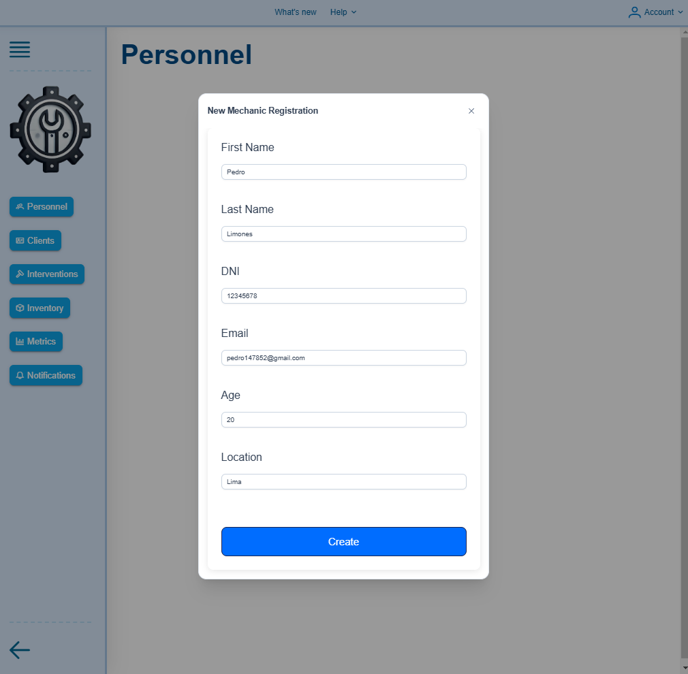

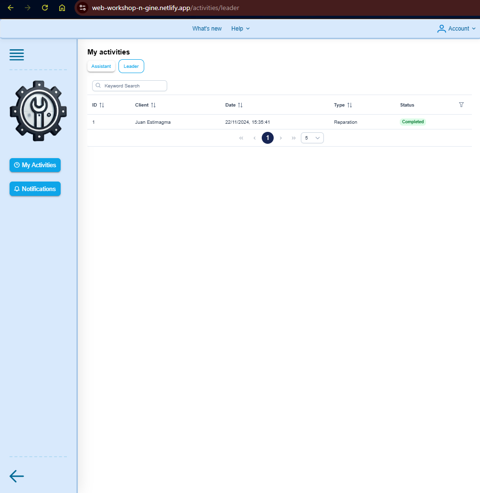

* Backend web services

El despliegue del backend web services en Railway se ha actualizado automáticamente después de haber realizado la fusión de la rama de desarrollo `develop` con la rama principal `main`.
Este proceso ha permitido que el backend web services se actualice automáticamente en la URL [https://web-yara-workshop-n-gine.up.railway.app/swagger/index.html](https://web-yara-workshop-n-gine.up.railway.app/swagger/index.html)

- Capturas de pantalla backend web services:

#### 5.2.3.8. Team Collaboration Insights during Sprint. 

| Alumno                            | Actividad                                                                         |
|-----------------------------------|-----------------------------------------------------------------------------------|
| Gutiérrez Soto, Jhosepmyr Orlando | Desarrollo del back end, y mejora y reestructuración de componentes del front end |
| Hernández Tuiro, Eric Ernesto     | Desarrollo del back end, y mejora de componentes del front end                    |
| Riva Rodríguez, Elmer Augusto     | Desarrollo del back end, y mejora y reestructuración de componentes del front end |

* Repositorio de la landing page

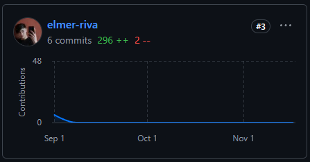

* Repositorio del front end

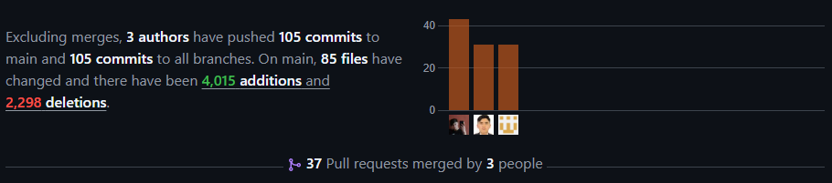

* Repositorio del back end

### 5.2.4 Sprint 4

#### 5.2.4.1. Sprint Planning 4

| **Sprint #**                    | Sprint 4                                                                                                                                                                                                                                                                                                                                                                                                                                                                                                                                                                                                                                                                                                           |
|---------------------------------|--------------------------------------------------------------------------------------------------------------------------------------------------------------------------------------------------------------------------------------------------------------------------------------------------------------------------------------------------------------------------------------------------------------------------------------------------------------------------------------------------------------------------------------------------------------------------------------------------------------------------------------------------------------------------------------------------------------------|
| **Sprint Planning Background**  |                                                                                                                                                                                                                                                                                                                                                                                                                                                                                                                                                                                                                                                                                                                    |
| Date                            | 2024/11/02                                                                                                                                                                                                                                                                                                                                                                                                                                                                                                                                                                                                                                                                                                         |
| Time                            | 20:00                                                                                                                                                                                                                                                                                                                                                                                                                                                                                                                                                                                                                                                                                                              |
| Location                        | Videollamada grupal mediante la plataforma Discord                                                                                                                                                                                                                                                                                                                                                                                                                                                                                                                                                                                                                                                                 |
| Prepared By                     | Jhosepmyr Orlando Gutierrez Soto                                                                                                                                                                                                                                                                                                                                                                                                                                                                                                                                                                                                                                                                                   |
| Attendees (to planning meeting) | Elmer Riva Rodriguez, Eric Hernandez Tuiro y Jhosepmyr Gutiérrez Soto                                                                                                                                                                                                                                                                                                                                                                                                                                                                                                                                                                                                                                              |
| Sprint Goal & User Stories      |                                                                                                                                                                                                                                                                                                                                                                                                                                                                                                                                                                                                                                                                                                                    |
| Sprint 3 Goal                   | Nuestro enfoque está en completar la integración del frontend con el backend real ,brindar soporte completo a  la autenticación y autorizacion para control de acceso con tokens, y asegurar que la landing page esté optimizada y lista para atraer nuevos visitantes.   Creemos que esto entregará una experiencia de usuario más segura y fluida, facilitará la gestión y autenticación de manera eficiente, y aumentará la confianza de los visitantes en el producto.   Esto se confirmará cuando los usuarios puedan registrarse, iniciar sesión e interactuar con la aplicacion web usando el backend real, y cuando la landing page esté completamente funcional para captar y convertir visitantes. |
| Sprint 3 Velocity               | 11                                                                                                                                                                                                                                                                                                                                                                                                                                                                                                                                                                                                                                                                                                                 |
| Sum of Story Points             | 11                                                                                                                                                                                                                                                                                                                                                                                                                                                                                                                                                                                                                                                                                                                 |

#### 5.2.4.2. Sprint Backlog 4

#### 5.2.4.3. Development Evidence for Sprint Review

#### 5.2.4.4. Testing Suite Evidence for Sprint Review

#### 5.2.4.5. Execution Evidence for Sprint Review

#### 5.2.4.6. Services Documentation Evidence for Sprint Review

#### 5.2.4.7. Software Deployment Evidence for Sprint Review

#### 5.2.4.8. Team Collaboration Insights during Sprint.

## 5.3. Validation Interviews

### 5.3.1. Diseño de Entrevistas

### 5.3.2. Registro de Entrevistas

### 5.3.3. Evaluaciones según heurísticas

## 5.4. Video About-the-Product

A continuación, la primera version del video About The Product

 
[Enlace Video About The Product](https://www.canva.com/design/DAGVMz1uqLE/2A_XB9kr1el8uhwX9OTwrA/watch?utm_content=DAGVMz1uqLE&utm_campaign=designshare&utm_medium=link&utm_source=editor)

# Conclusiones

## Conclusiones y recomendaciones

## Video About-the-Team

A continuación, la primera version del video About The Team

 
[Enlace de Video About The Team](https://www.canva.com/design/DAGVM_ZK3PM/7hTxeqOyIRzgtSVTm5T1qQ/watch?utm_content=DAGVM_ZK3PM&utm_campaign=designshare&utm_medium=link&utm_source=editor)

# Bibliografía

MarketWatch. (2024). Car Ownership Statistics 2024. [https://www.marketwatch.com/guides/insurance-services/car-ownership-statistics/](https://www.marketwatch.com/guides/insurance-services/car-ownership-statistics/)

Zippia. (2022). Auto Mechanic demographics and statistics in the US. [https://www.zippia.com/auto-mechanic-jobs/demographics/](https://www.zippia.com/auto-mechanic-jobs/demographics/)

Zippia. (2022). Mechanic demographics and statistics in the US. [https://www.zippia.com/mechanic-jobs/demographics/](https://www.zippia.com/mechanic-jobs/demographics/)

# Anexos
Video entrevistas needfinding: https://upcedupe-my.sharepoint.com/:v:/g/personal/u20221e247_upc_edu_pe/EQ7tBfZua05Ov2i-KsRYiV0BeKLfTZ6glrFDMATNRogDqQ?nav=eyJyZWZlcnJhbEluZm8iOnsicmVmZXJyYWxBcHAiOiJTdHJlYW1XZWJBcHAiLCJyZWZlcnJhbFZpZXciOiJTaGFyZURpYWxvZy1MaW5rIiwicmVmZXJyYWxBcHBQbGF0Zm9ybSI6IldlYiIsInJlZmVycmFsTW9kZSI6InZpZXcifX0%3D&e=481Hvy 

Repositorio de informe: https://github.com/Web-Application-YaraSoftware/Informe

Testing protoypes web: https://upcedupe-my.sharepoint.com/:v:/g/personal/u20221e247_upc_edu_pe/Eazn2di6ZRtMhk1PZDpfGMUBz1smfVdJMxImTBNzLqTYaA?nav=eyJyZWZlcnJhbEluZm8iOnsicmVmZXJyYWxBcHAiOiJTdHJlYW1XZWJBcHAiLCJyZWZlcnJhbFZpZXciOiJTaGFyZURpYWxvZy1MaW5rIiwicmVmZXJyYWxBcHBQbGF0Zm9ybSI6IldlYiIsInJlZmVycmFsTW9kZSI6InZpZXcifX0%3D&e=hpZt0x

Testing prototypes mobile: https://upcedupe-my.sharepoint.com/:v:/g/personal/u20221e247_upc_edu_pe/Ef_ZB2PJR8dAunoOhdG1MFcBPzJ9J79mlDk0-jS6bgmBsg?nav=eyJyZWZlcnJhbEluZm8iOnsicmVmZXJyYWxBcHAiOiJTdHJlYW1XZWJBcHAiLCJyZWZlcnJhbFZpZXciOiJTaGFyZURpYWxvZy1MaW5rIiwicmVmZXJyYWxBcHBQbGF0Zm9ybSI6IldlYiIsInJlZmVycmFsTW9kZSI6InZpZXcifX0%3D&e=DQQg0b

Enlace Video About The Product: https://www.canva.com/design/DAGVMz1uqLE/2A_XB9kr1el8uhwX9OTwrA/watch?utm_content=DAGVMz1uqLE&utm_campaign=designshare&utm_medium=link&utm_source=editor

Enlace de Video About The Team: https://www.canva.com/design/DAGVM_ZK3PM/7hTxeqOyIRzgtSVTm5T1qQ/watch?utm_content=DAGVM_ZK3PM&utm_campaign=designshare&utm_medium=link&utm_source=editor

Video expositivo entrega TB2: https://www.canva.com/design/DAGVMxTlQwY/gqpbmrFevsFGvLM_VJD6aw/watch?utm_content=DAGVMxTlQwY&utm_campaign=designshare&utm_medium=link&utm_source=editor

Documentación Swagger - Workshop N-GINE: https://web-yara-workshop-n-gine.up.railway.app/swagger/index.html
