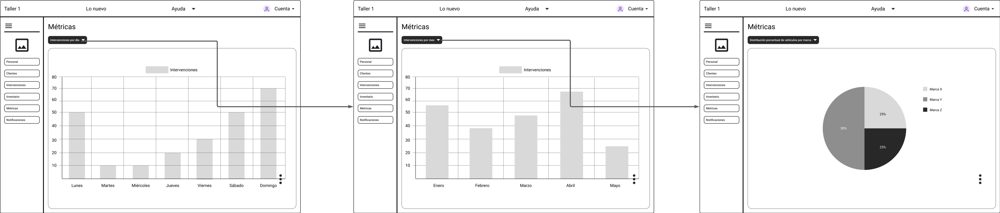

<body>
    <strong>
        

            Universidad Peruana de Ciencias Aplicadas - Ingeniería de Software 
            </img>
             SI730 - Aplicaciones Web Sánchez Ponce, Alex Humberto 
             Informe de Trabajo Final 
            Startup: YaraSoftware Producto: Workshop N-GINE
        

    </strong>
    

        <h3 align="center">Team Members:</h3>
        <table align="center">
            <tr>
                <th style="text-align:center;">Estudiante</th>
                <th style="text-align:center;">Código</th>
            </tr>
            <tr>
                <td>Gutiérrez Soto, Jhosepmyr Orlando</td>
                <td>202317638</td>
            </tr>
            <tr>
                <td>Hernández Tuiro, Eric Ernesto</td>
                <td>20221C857</td>
            </tr>
            <tr>
                <td>Orozco Torres, Álvaro Joaquín</td>
                <td>202220783</td>
            </tr>
            <tr>
                <td>Reaño Delgadillo, Henry Paolo</td>
                <td>20221e247</td>
            </tr>
            <tr>
                <td>Riva Rodríguez, Elmer Augusto</td>
                <td>202220829</td>
            </tr>
        </table>
    

    
Agosto 2024

</body>

# Registro de Versiones del Informe
| Versión | Fecha | Autor | Descripción de la modificación |
| ----------- | ----------- | ----------- | ----------- |
| 0.0.0 | 20/08/2024 | Álvaro Orozco Torres | Se agrega la carátula y la tabla de control de versiones |
| 1.0.0 | 01/09/2024 | Henry Reaño Delgadillo | Se agrega la primera sección del Capítulo I: Introducción |
| 1.1.0 | 01/09/2024 | Álvaro Orozco Torres | Se agrega la segunda y tercera sección del Capítulo I: Introducción Se agrega la bibliografía |
| 2.0.0 | 01/09/2024 | Álvaro Orozco Torres | Se agrega la primera y segunda sección del Capitulo II: Requirements Elicitation & Analysis |
| 2.1.0 | 01/09/2024 | Henry Reaño Delgadillo | Se agrega más apartados a la segunda sección del Capítulo II: Requirements Elicitation & Analysis |
| 2.2.0 | 02/09/2024 | Álvaro Orozco Torres | Se agrega más apartados a la segunda sección del Capítulo II: Requirements Elicitation & Analysis |
| 2.2.1 | 02/09/2024 | Álvaro Orozco Torres | Se corrige el formato de presentación de el As-Is Scenario Mapping |
| 2.2.2 | 02/09/2024 | Álvaro Orozco Torres | Se añade descripción de proceso para As-Is Scenario Mapping |
| 2.2.3 | 02/09/2024 | Henry Reaño Delgadillo | Se agrega el link de las entrevistas de Needfinding en la sección Anexos |
| 2.2.4 | 02/09/2024 | Henry Reaño Delgadillo | Se corrige la visualización de los artefactos As-Is para todos los segmentos objetivo y se agrega la foto del dueño de taller Enrique Reaño|
| 2.2.5 | 03/09/2024 | Henry Reaño Delgadillo | Se agrega tres nuevos conceptos en Ubiquitous Language |
| 3.0.0 | 05/09/2024 | Elmer Riva Rodriguez | Se agrega la estructura completa del informe |

# Project Collaboration Insights

# Contenido

[Capítulo I: Introducción](#capítulo-i-introducción)

[1.1. Startup Profile](#11-startup-profile)

[1.1.1. Descripción de la Startup](#111-descripción-de-la-startup)

[1.1.2. Perfiles de los integrantes del equipo](#112-perfiles-de-los-integrantes-del-equipo)

[1.2. Solution Profile](#12-solution-profile)

[1.2.1. Antecedentes y problemática](#121-antecedentes-y-problematica)

[1.2.2. Lean UX Process](#122-lean-ux-process)

[1.2.2.1. Lean UX Problem Statements](#1221-lean-ux-problem-statements)

[1.2.2.2. Lean UX Assumptions](#1222-lean-ux-assumptions)

[1.2.2.3. Lean UX Hypothesis](#1223-lean-ux-hypothesis)

[1.2.2.4. Lean UX Canvas](#1224-lean-ux-canvas)

[1.3. Segmentos objetivo](#13-segmentos-objetivo)

[Capítulo II: Requirements Elicitation & Analysis](#capítulo-ii-requirements-elicitation--analysis)

[2.1. Competidores](#21-competidores)

[2.1.1. Análisis competitivo](#211-análisis-competitivo)

[2.1.2. Estrategias y tácticas frente a competidores](#212-estrategias-y-tacticas-frente-a-competidores)

[2.2. Entrevistas](#22-entrevistas)

[2.2.1. Diseño de entrevistas](#221-diseño-de-entrevistas)

[2.2.2. Registro de entrevistas](#222-registro-de-entrevistas)

[2.2.3. Análisis de entrevistas](#223-análisis-de-entrevistas)

[2.3. Needfinding](#23-needfinding)

[2.3.1. User Personas](#231-user-personas)

[2.3.2. User Task Matrix](#232-user-task-matrix)

[2.3.3. User Journey Mapping](#233-user-journey-mapping)

[2.3.4. Empathy Mapping](#234-empathy-mapping)

[2.3.5. As-is Scenario Mapping](#235-as-is-scenario-mapping)

[2.4. Ubiquitous Language](#24-ubiquitous-language)

[Capítulo III: Requirements Specification](#capítulo-iii-requirements-specification)

[3.1. To-Be Scenario Mapping](#31-to-be-scenario-mapping)

[3.2. User Stories](#32-user-stories)

[3.3. Impact Mapping](#33-impact-mapping)

[3.4. Product Backlog](#34-product-backlog)

[Capítulo IV: Product Design](#capítulo-iv-product-design)

[4.1. Style Guidelines](#41-style-guidelines)

[4.1.1. General Style Guidelines](#411-general-style-guidelines)

[4.1.2. Web Style Guidelines](#412-web-style-guidelines)

[4.2. Information Architecture](#42-information-architecture)

[4.2.1. Organization Systems](#421-organization-systems)

[4.2.2. Labeling Systems](#422-labeling-systems)

[4.2.3. SEO Tags and Meta Tags](#423-seo-tags-and-meta-tags)

[4.2.4. Searching Systems](#424-searching-systems)

[4.2.5. Navigation Systems](#425-navigation-systems)

[4.3. Landing Page UI Design](#43-landing-page-ui-design)

[4.3.1. Landing Page Wireframe](#431-landing-page-wireframe)

[4.3.2. Landing Page Mock-up](#432-landing-page-mock-up)

[4.4. Web Applications UX/UI Design](#44-web-applications-uxui-design)

[4.4.1. Web Applications Wireframes](#441-web-applications-wireframes)

[4.4.2. Web Applications Wireflow Diagrams](#442-web-applications-wireflow-diagrams)

[4.4.3. Web Applications Mock-ups](#443-web-applications-mock-ups)

[4.4.4. Web Applications User Flow Diagrams](#444-web-applications-user-flow-diagrams)

[4.5. Web Applications Prototyping](#45-web-applications-prototyping)

[4.6. Domain-Driven Software Architecture](#46-domain-driven-software-architecture)

[4.6.1. Software Architecture Context Diagram](#461-software-architecture-context-diagram)

[4.6.2. Software Architecture Container Diagrams](#462-software-architecture-container-diagrams)

[4.6.3. Software Architecture Components Diagrams](#463-software-architecture-components-diagrams)

[4.7. Software Object-Oriented Design](#47-software-object-oriented-design)

[4.7.1. Class Diagrams](#471-class-diagrams)

[4.7.2. Class Dictionary](#472-class-dictionary)

[4.8. Database Design](#48-database-design)

[4.8.1. Database Diagram](#481-database-diagram)

[Capítulo V: Product Implementation, Validation & Deployment](#capítulo-v-product-implementation-validation--deployment)

[5.1. Software Configuration Management](#51-software-configuration-management)

[5.1.1. Software Development Environment Configuration](#511-software-development-environment-configuration)

[5.1.2. Source Code Management](#512-source-code-management)

[5.1.3. Source Code Style Guide & Conventions](#513-source-code-style-guide--conventions)

[5.1.4. Software Deployment Configuration](#514-software-deployment-configuration)

[5.2. Landing Page, Services & Applications Implementation](#52-landing-page-services--applications-implementation)

[5.2.1. Sprint 1](#521-sprint-1)

[5.2.1.1. Sprint Planning 1](#5211-sprint-planning-1)

[5.2.1.2. Sprint Backlog 1](#5212-sprint-backlog-1)

[5.2.1.3. Development Evidence for Sprint Review](#5213-development-evidence-for-sprint-review)

[5.2.1.4. Testing Suite Evidence for Sprint Review](#5214-testing-suite-evidence-for-sprint-review)

[5.2.1.5. Execution Evidence for Sprint Review](#5215-execution-evidence-for-sprint-review)

[5.2.1.6. Services Documentation Evidence for Sprint Review](#5216-services-documentation-evidence-for-sprint-review)

[5.2.1.7. Software Deployment Evidence for Sprint Review](#5217-software-deployment-evidence-for-sprint-review)

[5.2.1.8. Team Collaboration Insights during Sprint](#5218-team-collaboration-insights-during-sprint)

[5.3. Validation Interviews](#53-validation-interviews)

[5.3.1. Diseño de Entrevistas](#531-diseño-de-entrevistas)

[5.3.2. Registro de Entrevistas](#532-registro-de-entrevistas)

[5.3.3. Evaluaciones según heurísticas](#533-evaluaciones-según-heurísticas)

[5.4. Video About-the-Product](#54-video-about-the-product)

[Conclusiones](#conclusiones)

[Conclusiones y recomendaciones](#conclusiones-y-recomendaciones)

[Video About-the-Team](#video-about-the-team)

[Bibliografía](#bibliografía)

[Anexos](#anexos)

# Student Outcome

**ABET – EAC - Student Outcome 5:** La capacidad de funcionar efectivamente en un equipo cuyos miembros juntos proporcionan liderazgo, crean un entorno de colaboración e inclusivo, establecen objetivos, planifican tareas y cumplen objetivos.

| Criterio Especifico | Acciones Realizadas | Conclusiones |
| - | - | - |
| Trabaja en equipo para proporcionar liderazgo en forma conjunta | Jhosepmyr:   Eric:   Álvaro:   Henry:   Elmer:   | [Redaccion] |
| Crea un entorno colaborativo e inclusivo, establece metas, planifica tareas y cumple objetivos. | Jhosepmyr:   Eric:   Álvaro:   Henry:   Elmer:   | [Redaccion] |

# Capítulo I: Introducción

## 1.1. Startup Profile

### 1.1.1. Descripción de la Startup
Yara Software es una startup conformada por jóvenes estudiantes de la carrera de Ingeniería de Software cuyo objetivo es la creación de productos de software personalizados que optimizan y transforman procesos en sectores laborales que a menudo se pasan por alto en la digitalización.

**Misión:** Nuestra misión es impulsar desarrollo tecnológico a diversos sectores de la industria, favoreciendo el crecimiento económico a través de soluciones de software innovadoras, accesibles y adaptadas a las necesidades de sus usuarios. A través del compromiso con la calidad, la eficiencia y la experiencia de usuario, garantizamos el éxito de nuestros proyectos y favorecemos la integración y adopción de la tecnología en el mundo actual de constante cambio.

**Visión:** Como Startup, aspiramos a ser reconocidos a nivel nacional por nuestro fuerte compromiso con la calidad y la excelencia, alcanzando afianzar a más de 10,000 usuarios a nivel nacional en los próximos cuatro años, posicionándonos como un referente en cuanto a desarrollo tecnológico e innovación en el país.

### 1.1.2. Perfiles de los integrantes del equipo 

| Foto del participante | Nombres y apellidos | Código de estudiante | Carrera | Conocimientos técnicos y habilidades |
| - | - | - | - | - |
|  </img> | Jhosepmyr Orlando Gutiérrez Soto | 202317638 | Ingeniería de Software | Experiencia en desarrollo frontend y backend. Conocimiento alto en BlockChain. Determinación y seguridad en los trabajos en equipo |
|  </img> | Eric Ernesto Hernández Tuiro | 20221C857 | Ingeniería de Software | Programación en C++ y Python. Resolución de problemas y resiliencia ante situaciones de presión. | 
|  </img> | Álvaro Joaquín Orozco Torres | 202220783 | Ingeniería de Software | Diseño inclusivo, lineamientos de accesibilidad y programación en JavaScript y Python. Capacidad de análisis y resolución de problemas. | 
|  </img> | Henry Paolo Reaño Delgadillo | 20221e247 | Ingeniería de Software | Programación en C++ y Javascript. Conocimiento intermedio sobre patrones de software. Capacidad alta para trabajar en equipo. | 
|  </img> | Elmer Augusto Riva Rodríguez | 202220829 | Ingeniería de Software | Diseño de experiencias de usuario y programación con C++ y Python. Competente en la gestión de proyectos grupales. | 

## 1.2. Solution Profile

### 1.2.1. Antecedentes y problemática

***What?***

La baja rentabilidad, retención y fidelización de clientes.

***Why?***

Porque los talleres mecánicos se enfocan únicamente en la eficiencia del servicio.

***Who?***

A dueños de talleres de mecánica automotriz.

***When?***

En la actualidad, de manera continua a lo largo del tiempo.

***Where?***

En el Perú, principalmente en la ciudad de Lima.

***How?***

Se mide a través del flujo de caja en talleres mecánicos y su ganancia media mensual.

***How much?***

A la gran mayoría de talleres, sobre todo, los más informales.

### 1.2.2. Lean UX Process

#### 1.2.2.1 Lean UX Problem Statements

En la actualidad, el sector de la mecánica automotriz se enfoca principalmente en la eficiencia del servicio a clientes esporádicos con necesidades correctivas. Sin embargo, no aborda la importancia de fidelizar clientes, generar un flujo constante de ingresos y ofrecer información clave sobre el estado del servicio de forma efectiva.

Nuestro producto busca resolver estos problemas mediante funcionalidades de gestión de personal, almacenamiento de información sobre clientes, control de inventario y un sistema de salud vehcular. Para ello, inicialmente, nos enfocaremos en los dueños de talleres automotrices. 

El problema se considerará resuelto cuando los dueños de talleres automotrices puedan administrar eficazmente y atender a un flujo constante de clientes fidelizados.

#### 1.2.2.2. Lean UX Assumptions

***Business Outcomes***
+ Llegar a 2500 usuarios en un año
+ Tener un índice de retención de usuarios del 90%
+ El 20% de nuestros clientes use la suscripción premium

***Users***

**Roberto García - Dueño de taller mecánico**

Objetivos:
+ Ofrecer un servicio eficiente para fidelizar a sus clientes.
+ Controlar mejor los recursos para reducir costos operativos.
+ Mejorar la satisfacción del cliente para aumentar las referencias y reseñas positivas.

Obstáculos:
+ Falta de tiempo para gestionar todos los aspectos del negocio de manera eficiente.
+ Dificultad para implementar nuevas tecnologías
+ Competencia creciente de talleres más grandes y mejor equipados.
+ Incertidumbre en la gestión del inventario lo que puede resultar en repuestos faltantes.

**Juan Pérez - Mecánico**

Objetivos:
+ Realizar su trabajo de manera eficiente.
+ Conocer el estado del vehículo para determinar cómo repararlo.
+ Minimizar el tiempo perdido en la búsqueda de respuestos.

Obstáculos:
+ Falta o dificultad de acceso información sobre el estado del vehículo.
+ Desorganización en el taller, lo que lleva a malentendidos y demoras.
+ Presión para realizar su trabajo rápido.

**María López - Cliente de taller**

Objetivos:
+ Mantener su vehículo en buen estado para evitar problemas inesperados.
+ Recibir un servicio rápido y confiable, sin tener que esperar mucho tiempo.
+ Ahorrar dinero en reparaciones costosas mediante un mantenimiento preventivo efectivo.
+ Sentirse informada y segura sobre el estado de su vehículo y las reparaciones necesarias.

Obstáculos:
+ Tiempo limitado para dejar su coche en el taller, ya que depende de él para su trabajo.
+ Falta de conocimiento técnico, ya que teme que le cobren por reparaciones innecesarias.
+ Incertidumbre sobre la disponibilidad del taller, lo que a veces la lleva a cambiar de lugar si no recibe atención rápida.

***User Outcomes***

**Roberto García - Dueño de taller mecánico**
+ Aumentar la cantidad de clientes atendidos por día
+ Ahorrar tiempo en control de recursos de taller
+ Aumentar la rentabilidad y retención de clientes

**Juan Pérez - Mecánico**
+ Lograr ser más eficiente en el trabajo

**María López - Cliente de taller**
+ Ahorrar en reparaciones de su vehículo
+ Sentirse más satisfechos con el servicio

***Solutions***
+ Sistema de gestión de horarios
+ Historial de vehículos
+ Gestión de inventario
+ Base de datos de clientes
+ Sistema de salud vehicular
+ Sistema de aforo de taller

#### 1.2.2.3. Lean UX Hypothesis
+ Creemos que lograremos llegar a 2500 usuarios en un año si los dueños de talleres logran aumentar la cantidad de clientes atendidos por día mediante el sistema de gestión de horarios
+ Creemos que lograremos tener índice de retención de clientes del 90% si los mecanicos logran ser más eficientes en su trabajo mediante la consulta de historial de vehículos
+ Creemos que lograremos tener índice de retención de clientes del 90% si los dueños de talleres logran ahorrar tiempo en control de recursos de taller mediante sistema de gestión de inventario
+ Creemos que lograremos el 20% de nuestros clientes use la suscripción premium si los dueños de talleres logran aumentar la rentabilidad y retención de clientes mediante base de datos de clientes y venta del acceso a sistema de salud vehicular
+ Creemos que lograremos el 20% de nuestros clientes use la suscripción premium si clientes de taller logran ahorrar en reparaciones de su vehículo mediante sistema de salud vehicular
+ Creemos que lograremos el 20% de nuestros clientes use la suscripción premium si clientes de taller logran sentirse más satisfechos con el servicio mediante sistema de aforo del taller

#### 1.2.2.4. Lean UX Canvas

## 1.3. Segmentos objetivo

***Dueños de taller***

Según un informe de Zippia (2022), en Estados Unidos, el 95.7% de los dueños de taller son hombres y, aunque la edad puede variar según la etnicidad, generalmente se aproxima a los 43 años. Además, el mismo estudio señala que aproximadamente el 42% de los dueños de taller poseen un grado de educación secundaria mientras que el 24% posee un grado técnico superior.

+ Género: Masculino

+ Edad: 43 años

+ Grado de instrucción: Educación secundaria

***Mecánicos***

Según un informe de Zippia (2022), en Estados Unidos, el 96.4% de los mecánicos son hombres y, aunque la edad puede variar según la etnicidad, generalmente se aproxima a los 40 años. Además, el mismo estudio señala que aproximadamente el 47% de los mecánicos poseen un grado de educación secundaria.

+ Género: Masculino

+ Edad: 40 años

+ Grado de instrucción: Educación secundaria

***Clientes de taller***

De acuerdo con datos de MarketWatch (2024), en Estados Unidos, el 49.5% de los vehículos están en manos de hombres. A pesar de esto, son ellos quienes pasan más tiempo al volante y recorren mayores distancias. La mayoría de estos conductores tiene alrededor de 30 años.

+ Género: Masculino

+ Edad: 30 años

# Capítulo II: Requirements Elicitation & Analysis

## 2.1. Competidores

### 2.1.1. Análisis competitivo

<table>
    <tr>
        <th colspan="6">Competitive Analysis Landscape</th>
    </tr>
    <tr>
        <td colspan="2" rowspan="2">Competitive Analysis Landscape</td>
        <td colspan="4">Escriba en el recuadro la pregunta que busca responder o el objetivo de este análisis.</td>
    </tr>
    <tr>
        <td colspan="4">El objetivo de este análisis es evaluar el estado actual del mercado de software, identificando el alcance y las características de las soluciones existentes. Esto nos permitirá definir una propuesta de valor única y desarrollar una identidad distintiva para nuestro producto, asegurando que se diferencie claramente en el mercado y satisfaga necesidades no plenamente abordadas por la competencia.</td>
    </tr>
    <tr>
        <td colspan="2">(En la cabecera colocar por cada competidor nombre y logo)</td>
        <th scope="col">Workshop N-GINE</th>
        <th scope="col">Autodata</th>
        <th scope="col">ServitechApp</th>
        <th scope="col">AutoSoft Taller</th>
    </tr>
    <tr>
        <th scope="row" rowspan="2">Perfil</th>
        <th scope="row">Overview</th>
        <td>Workshop N-GINE es una solución integral que transforma los talleres automotrices mediante tecnología avanzada, enfocándose en la optimización, la eficiencia y la satisfacción del cliente</td>
        <td>Desarrollado por expertos en automoción que comprenden las complejidades del servicio, el mantenimiento, el diagnóstico y la reparación de vehículos. Reduzca los errores y agilice los trabajos</td>
        <td>ServitechApp te permite crear ordenes de trabajo y presupuestos, gestionar la venta de productos, administrar tus clientes y llevar fácilmente el control de tu taller. ¡Puedes personalizarlo en 5 minutos!</td>
        <td>Nuestra innovadora solución combina tecnología de vanguardia y conocimiento especializado para ofrecerte una experiencia sin igual en tu taller automotriz. Ya sea que necesites optimizar la gestión del taller, realizar diagnósticos precisos, recibir asistencia técnica experta, administrar ciclos de mantenimiento, seleccionar las partes adecuadas, encontrar soluciones a problemas o elaborar presupuestos precisos, nuestro asistente de IA está aquí para ayudarte en cada paso del camino</td>
    </tr>
    <tr>
        <th scope="row">Ventaja competitiva ¿Qué valor ofrece a los clientes?</th>
        <td>Foco principal en la optimización de procesos y en la satisfacción de los clientes</td>
        <td>Acceso a documentación de una amplia gama de vehículos, lo que facilita el diagnóstico y reparación de estos</td>
        <td>Alto nivel de personalización e integración con múltiples herramientas multidispositivo, lo que favorece su adopción</td>
        <td>Incorporación de una inteligencia artificial que brinda asistencia personalizada a los usuarios, lo que complementa los diagnósticos de los mecánicos</td>
    </tr>
    <tr>
        <th scope="row" rowspan="2">Perfil de Marketing</th>
        <th scope="row">Mercado Objetivo</th>
        <td>Talleres de mecánica automotriz pequeños y medianos</td>
        <td>Grandes empresas de mecánica y electrónica automotriz</td>
        <td>Talleres de mecánica automotriz y mecánica industrial</td>
        <td>Talleres de mecánica automotriz</td>
    </tr>
    <tr>
        <th scope="row">Estrategias de Marketing</th>
        <td>Prueba gratuita de 30 días</td>
        <td>Prueba sin compromiso del producto por S/5.00</td>
        <td>Prueba sin compromiso del producto gratuita</td>
        <td>Prueba por tiempo limitado de las funcionalidades de inteligencia artificial de forma gratuita</td>
    </tr>
    <tr>
        <th scope="row" rowspan="3">Perfil de Producto</th>
        <th scope="row">Productos y Servicios</th>
        <td>Workshop N-GINE - Regular Workshop N-GINE - Premium Atención al cliente</td>
        <td>Autodata para motos - Motorcycles Autodata para autos y furgonetas - Service & Maintenance Autodata para autos y furgonetas - Diagnostic & Repair Atención al cliente</td>
        <td>ServitechApp - Personal ServitechApp - Plus ServitechApp - Pro Atención al cliente</td>
        <td>AutoSoft Taller - Básico AutoSoft Taller - Profesional Asistente Inteligente (IA) Atención al cliente</td>
    </tr>
    <tr>
        <th scope="row">Precios y costos</th>
        <td>S/59.99 PEN al mes S/99.99 PEN al mes o S/1099.99 PEN al año</td>
        <td>S/86.00 PEN al mes S/172.00 PEN al mes S/310.00 PEN al mes</td>
        <td>$/49.99 USD pago único $/99.99 USD pago único $/159.99 USD pago único</td>
        <td>Desde $/15.99 hasta 44.99 USD al mes o desde $/168.99 hasta 494.99 USD al añoe Desde $/30.99 hasta 99.99 USD al mes o $/336.99 hasta 1,098.99 USD al año $/9.99 al mes</td>
    </tr>
    <tr>
        <th scope="row">Canales de distribución (Web y/o Móvil)</th>
        <td>Página web oficial del producto</td>
        <td>Página web oficial del producto Distribuidores autorizados adicionales</td>
        <td>Página web oficial del producto</td>
        <td>Página web oficial del producto</td>
    </tr>
    <tr>
        <th scope="row" rowspan="5">Análisis SWOT</th>
        <td colspan="5">Realice esto para su startup y sus competidores. Sus fortalezas deberían apoyar sus oportunidades y contribuir a lo que ustedes definen como su posible ventaja competitiva.</td>
    </tr>
    <tr>
        <th scope="row">Fortalezas</th>
        <td>Ecosistema integral de herramientas de optimización de procesos Enfoque en la satisfacción del cliente Aprovechamiento de la tecnología IoT para expandir el alcance y funcionalidades del producto</td>
        <td>Ofrece una amplia gama de información especializada en conjunto con el producto Cuenta con múltiples canales de distribución</td>
        <td>Facilidad de uso y de adopción Acceso al código fuente, lo que permite modificar el programa a las necesidades específicas de cada cliente Modelo de pago único, volviéndose una opción rentable a largo plazo</td>
        <td>Incorporación de una inteligencia artificial que brinda asistencia personalizada a los usuarios, lo que complementa los diagnósticos de los mecánicos. Variedad de opciones de suscripción y modelos de pago, lo que permite adaptarse a diferentes tamaños de talleres.</td>
    </tr>
    <tr>
        <th scope="row">Debilidades</th>
        <td>Startup reciente, lo que puede generar desconfianza por parte de los consumidores Valor agregado dependiente a la suscripción premium</td>
        <td>Modelo de suscripción con pocas opciones disponibles</td>
        <td>Dependencia de un solo canal de distribución</td>
        <td>El costo elevado de las suscripciones puede ser prohibitivo para talleres más pequeños.</td>
    </tr>
    <tr>
        <th scope="row">Oportunidades</th>
        <td>Expansión en mercados emergentes Alianzas estratégicas con fabricantes de autos y distribuidores para mejorar el alcance y la calidad del servicio</td>
        <td>Control de información especializada mediante alianzas estratégicas con fabricantes de autos</td>
        <td>Expansión a desarrollo de software altamente especializado Creación de comunidades de desarrollo que compartan modificaciones del software</td>
        <td>Integración con más herramientas de diagnóstico y gestión automotriz para expandir su funcionalidad.</td>
    </tr>
    <tr>
        <th scope="row">Amenazas</th>
        <td>Competencia creciente en el mercado de software automotriz Resistencia al cambio de parte de talleres tradicionales que prefieren métodos convencionales</td>
        <td>Mercado objetivo limitado, dado que el producto apunta concretamente a grandes empresas de mecánica automotriz</td>
        <td>Poco valor agregado ofrecido directamente por parte de la empresa</td>
        <td>La competencia podría desarrollar funcionalidades similares de IA, socavando por completo su ventaja competitiva.</td>
    </tr>
</table>

### 2.1.2. Estrategias y tácticas frente a competidores

***Fortalecimiento de la Confianza del Consumidor***

Estrategia: Mitigar la desconfianza asociada a ser una startup reciente mediante la construcción de una sólida reputación y demostrando el valor del producto desde el principio.

Tácticas:
+ Implementar un programa de testimonios y estudios de caso con talleres que ya hayan obtenido resultados positivos utilizando Workshop N-GINE.
+ Ofrecer una garantía de satisfacción o un período de devolución de dinero para disminuir el riesgo percibido por nuevos clientes.
+ Participar en ferias y eventos del sector automotriz para fortalecer la presencia de la marca y generar confianza.

***Expansión de Funcionalidades Basadas en IoT y Automatización***

Estrategia: Aprovechar la tecnología IoT y la automatización para ofrecer funcionalidades únicas que mejoren la eficiencia operativa de los talleres.

Tácticas:
+ Desarrollar e integrar sensores y dispositivos IoT para monitorear en tiempo real el estado de los vehículos y los recursos del taller.
+ Incorporar funciones de mantenimiento predictivo que alerten a los talleres sobre posibles problemas antes de que ocurran, optimizando así la eficiencia.
+ Promover estas innovaciones como diferenciadores clave en la comunicación de marketing, destacando el valor de la tecnología avanzada para los talleres.

***Enfoque en la Expansión y Alianzas Estratégicas***

Estrategia: Expandir el mercado objetivo a través de alianzas estratégicas con distribuidores para mejorar el alcance y la calidad del servicio.

Tácticas:
+ Explorar oportunidades en mercados emergentes donde la penetración de software de gestión de talleres es baja, ofreciendo precios competitivos y soporte local.
+ Crear programas de co-marketing con proveedores de piezas de automóviles, promoviendo Workshop N-GINE como parte de un ecosistema integrado de soluciones para talleres.

## 2.2. Entrevistas

### 2.2.1. Diseño de entrevistas

***Dueños de taller***

PARTE I: Iniciaremos brevemente con una sección de presentación

1. Iré rápidamente preguntándole y usted responderá con sus datos, ¿entendido?
+ Edad
+ Nivel de educación
+ Estado civil
+ Miembros en su familia

PARTE II: Ahora, vamos a hacer una serie de preguntas que tienen por objetivo comprender como funciona su negocio. Lo invitamos a describir con cuanta precisión sea necesaria y a emplear el lenguaje técnico al que esté acostumbrado. 

2. ¿De qué operaciones y actividades está a cargo usted en su taller? ¿Podría explicar el proceso para llevarlas a cabo?

3. ¿Utiliza herramientas para registrar el desarrollo o para almacenar información de dichas actividades? ¿Cuáles son y con qué finalidad registra dicha información?

+ (Complementaria) ¿Usted lleva un control de las tareas/reparaciones que realizan los mecánicos en su taller? ¿Se apoya en alguna herramienta?

4. En general, ¿qué dificultades o inconvenientes puede enfrentar durante el desarrollo de dichas actividades?

PARTE III: Finalmente, haremos preguntas relacionadas a la naturaleza y características del producto que queremos desarrollar

5. ¿Qué dispositivo digital le es más afín: celulares, computadoras o laptops?

6. ¿Cuenta usted con alguno o más de uno de estos dispositivos como herramienta de trabajo en su taller? ¿Para qué fines y en qué momentos del trabajo hace uso de ellos?

7. Existe una tecnología que llamó nuestra atención, el puerto OBD. Mediante un escáner conectado a ese puerto, se puede obtener información sobre el estado de un vehículo. En su taller, ¿se hace uso de este scáner y qué tan útil les ha resultado?

+ (Complementaria) ¿Qué condiciones deberían cumplirse para que dicha tecnología les sea más adecuada y comiencen a utlizarla en su taller?

***Mecánicos***

PARTE I: Iniciaremos brevemente con una sección de presentación. 

1. Iré rápidamente preguntandole y usted responderá con sus datos, ¿ok?
+ Edad
+ Nivel de educación
+ Estado civil
+ Miembros en su familia

2. ¿Cuántos años llevas trabajando en la mecánica automotriz y cuál fue su motivación o razón de trabajar en este sector?

PARTE II: Ahora, vamos a hacer una serie de preguntas que tienen por objetivo comprender su quehacer en el trabajo. Lo invitamos a describir con cuanta precisión sea necesaria y a emplear el lenguaje técnico al que esté acostumbrado. 

3. ¿Cómo se les asignan las responsabilidades y actividades aquí en el taller?

4. ¿Qué información consideras esencial tener a disposición al momento de realizar su trabajo? ¿Hace consultas al dueño del vehículo, en manuales u otros recursos?

5. ¿Se lleva un registro escrito de las actividades que realizan? ¿Con qué finalidad?

PARTE III: Finalmente, haremos preguntas relacionadas a la naturaleza y características del producto que queremos desarrollar

5. ¿Qué dispositivo digital le es más afín: celulares, computadoras o laptops?

6. ¿Cuenta usted con alguno o más de uno de estos dispositivos como herramienta de trabajo en su taller? ¿Para qué fines y en qué momentos del trabajo hace uso de ellos?

7. Existe una tecnología que llamó nuestra atención, el puerto OBD. Mediante un escáner conectado a ese puerto, se puede obtener información sobre el estado de un vehículo. ¿Usted hace uso de esta tecnología? ¿Por qué?

+ (Complementaria) Nuestro producto propone que la información del puerto OBD no requiera de un escáner y que pueda ser consultada desde el dispositivo digital de su preferencia. ¿Qué tan significativo sería este cambio para su trabajo?

***Cliente de taller***

PARTE I: Iniciaremos brevemente con una sección de presentación. 

1. Iré rápidamente preguntandole y usted responderá con sus datos, ¿ok?
- Edad
- Nivel de educación
- Estado civil
- Miembros en su familia

PARTE II: Ahora, vamos a hacer una serie de preguntas que tienen por objetivo comprender sus interes y motivaciones en relación a su vehículo.

2. ¿Qué carro tienes? ¿Cuántos años llevas manejando?

3. ¿Qué nivel de entendimiento tienes respecto del funcionamiento técnico de un vehículo?

4. ¿Qué tan importante es para usted el cuidado de su vehículo? ¿Tiene algún mecánico de confianza?

5. ¿Usted lleva su vehículo al taller de forma periódica o cuando cree que su vehículo pudiera tener algún problema?

PARTE III: Finalmente, haremos preguntas relacionadas a la naturaleza y características del producto que queremos desarrollar

6. Si contara con información contínua sobre el estado de su vehículo, ¿esta información lo impulsaría a visitar más frecuentemente a un mecánico en favor del mantenimiento de su vehículo?

7. ¿Le resultaría útil contar con información del aforo y nivel de ocupación de su taller de mecánica de confianza?

### 2.2.2. Registro de entrevistas

<table>
    <tr>
        <th scope="col">Segmento</th>
        <th scope="col">Datos y resumen de entrevista</th>
        <th scope="col">Evidencia fotográfica</th>
    </tr>
    <tr>
        <th rowspan="3" scope="row">Dueños de taller</th>
        <td>
        <strong>Erwin Romel Riva Rodríguez</strong> 
        Edad: 29 años 
        Distrito: Santa Rosa Rodríguez de Mendoza 
        Nivel de educación: técnico superior 
        Estado civil: conviviente 
        Familia: conviviente e hija 
        Dispositivo preferido: celular 
        Tipo de taller: mecánica y electrónica 
         
        Erwin es responsable de la administración de su taller, además de participar activamente en el trabajo operativo. Actualmente, utiliza un cuaderno para llevar un control del trabajo realizado, especialmente para asegurar transparencia y seguimiento ante sus clientes. Sin embargo, no todos sus empleados siguen este mismo estándar, lo que genera una falta de consistencia en los registros. Entre las principales dificultades que enfrenta, destacan la obtención de repuestos y la falta de información sobre vehículos de marcas menos comunes. Aunque usa dispositivos como celulares y tablets junto con un escáner OBD para diagnósticos, el cual califica de indispensable debido a los modelos de vehículos de sus clientes.
        </td>
        <td></td>
    </tr>
    <tr>
        <td>
        <strong>Enrique Reaño García</strong> 
        Edad: 53 años 
        Distrito: San Juan de Lurigancho 
        Nivel de educación: secundaria completa 
        Estado civil: conviviente 
        Familia: conviviente e hija 
        Dispositivo preferido: celular 
        Tipo de taller: mecánica 
         
        Enrique se encarga de las operaciones de mecánica general y de adaptación en su taller, trabajando como uno más de su equipo. A pesar de usar ocasionalmente cuadernos o su celular para llevar registros, prefiere no hacerlo, lo que podría estar relacionado con su extensa experiencia en el sector. No percibe dificultades significativas en su trabajo debido a su larga trayectoria, lo que le da una confianza natural en sus habilidades. Sin embargo, debido a que la mayoría de sus clientes poseen vehículos antiguos, no ve mucho valor en el uso de tecnologías como el escáner OBD.
        </td>
        <td></td>
    </tr>
    <tr>
        <td>
        <strong>Darío Quispe Llamoca</strong> 
        Edad: 42 años 
        Distrito: Los Olivos 
        Nivel de educación: técnico superior 
        Estado civil: casado 
        Familia: esposa y tres hijas 
        Dispositivo preferido: celular 
        Tipo de taller: mecánica y electrónica 
         
        Darío es responsable tanto de la parte operativa como administrativa de su taller. Destaca por su meticulosidad al documentar cada proceso de trabajo, asegurando que todos los pasos queden registrados en un sistema que no solo mejora el control operativo, sino que también optimiza la atención al cliente. Entre las principales dificultades que enfrenta, menciona los errores en los códigos de los manuales de autopartes, la complejidad de manejar solicitudes adicionales de los clientes, y los problemas que pueden surgir si un vehículo o repuesto falla durante las pruebas de calidad. 
        Darío utiliza una combinación de computadoras de escritorio y celulares en su trabajo diario, lo que refleja un enfoque moderno y tecnológico en la gestión de su taller. Además, realiza transmisiones en vivo de su negocio, lo que indica una apertura hacia el uso de nuevas tecnologías para promocionar y mejorar la comunicación con sus clientes. Destaca la importancia del escáner OBD en su labor, considerándolo indispensable, y resalta la necesidad de mantenerse actualizado constantemente para ofrecer un servicio de calidad.
        </td>
        <td></td>
    </tr>
    <tr>
        <th rowspan="3" scope="row">Mecánicos</th>
        <td>
        <strong>Jheyson Fernández Santillán</strong> 
        Edad: 23 años 
        Distrito: Santa Rosa Rodríguez de Mendoza 
        Nivel de educación: técnico superior 
        Estado civil: soltero 
        Familia: madre, padre y hermano 
        Dispositivo preferido: celular 
        Jheyson ha estado involucrado en la mecánica automotriz por cinco años, motivado por sus lazos familiares. En el taller que trabaja, las responsabilidades se distribuyen entre los mecánicos en función de las características del vehículo y la disponibilidad de cada uno. Su principal preocupación es tener acceso a información precisa sobre la estructura del vehículo para evitar daños durante las reparaciones, la cual obtiene a través de su jefe o investigando en internet usando su celular. 
        Utiliza proformas en papel para registrar las actividades realizadas y pendientes, lo que indica un enfoque manual y tradicional en su trabajo. Además, emplea un escáner OBD como herramienta de asistencia para identificar problemas en los vehículos mediante los códigos generados, para así saber por dónde comenzar su trabajo.
         
        </td>
        <td></td>
    </tr>
    <tr>
        <td>
        <strong>Raúl Fernando Reaño García</strong> 
        Edad: 56 años 
        Distrito: San Juan de Lurigancho 
        Nivel de educación: técnico superior 
        Estado civil: conviviente 
        Familia: conviviente e hijo 
        Dispositivo preferido: celular 
        Lleva aproximadamente 20 años en la mecánica por su fascinación por el funcionamiento de los vehículos. En el taller que trabaja, las responsabilidades se distribuyen y asignan directamente según su importancia y complejidad al momento que un vehículo ingresa. Señala la importancia de obtener información por parte del cliente, la cuál se complementa con búsquedas por internet con su celular de ser necesario. Utiliza un cuaderno como registro del trabajo realizado donde es importante registrar el número de placa del vehículo. En el taller que trabaja, no se hace uso del escáner OBD, dado el tipo de vehículos que recibe en su taller por parte de sus clientes.
         
        </td>
        <td></td>
    </tr>
    <tr>
        <td>
        <strong>Alexis Javier García Escobar</strong> 
        Edad: 23 años 
        Distrito: Los Olivos 
        Nivel de educación: secundaria completa 
        Estado civil: soltero 
        Familia: padre, madre y hermano 
        Dispositivo preferido: celular 
        Lleva aproximadamente seis años trabajando en mecánica, impulsado por su fascinación por el funcionamiento de los vehículos. En el taller donde labora, las responsabilidades se asignan mediante una hoja de trabajo que describe el problema. Destaca la importancia de obtener información detallada del cliente, incluyendo sus primeras impresiones, y complementa estos datos con su conocimiento técnico y consultas realizadas a través de su celular. Utiliza una hoja de cálculo en Excel para registrar el trabajo realizado, asegurándose de anotar las actividades y las fechas correspondientes. En su trabajo, emplea un escáner OBD para obtener los valores necesarios y determinar la causa de los problemas.
         
        </td>
        <td></td>
    </tr>
    <tr>
        <th rowspan="3" scope="row">Clientes de taller</th>
        <td>
        <strong>Carlos Alberto Ochoa Colonio</strong> 
        Edad: 24 años 
        Distrito: Santiago de Surco 
        Nivel de educación: secundaria completa 
        Ocupación: estudiante universitario de pregrado 
        Estado civil: soltero 
        Familia: padre 
        Marca de vehículo: Mazda 
         
        Carlos, quien conduce un Mazda CX-5 prestado por un familiar, enfatiza la importancia del cuidado del vehículo debido a que no es de su propiedad. Aunque carece de conocimientos técnicos sobre su automóvil, ultimamente está interesado en aprender más. Indicó que confía en un mecánico recomendado, pero no lleva el auto al taller regularmente, solo cuando surgen problemas. La posibilidad de monitorear el estado del vehículo de manera constante le resulta atractiva, ya que reconoce que muchos problemas pueden pasar desapercibidos y requieren tiempo y esfuerzo para ser detectados. Además, le interesa la función de aforo y disponibilidad del taller, recordando una experiencia negativa relacionada con largas colas en el taller y cómo esta funcionalidad podría haberle evitado esa molestia.
        </td>
        <td></td>
    </tr>
    <tr>
        <td>
        <strong>María Angélica Ramos Quispe</strong> 
        Edad: 19 años 
        Distrito: Lurigancho-Chosica 
        Nivel de educación: secundaria completa 
        Ocupación: estudiante universitario de pregrado 
        Estado civil: soltera 
        Familia: madre 
        Marca de vehículo: Hyundai 
         
        María Angélica tiene 7 años de experiencia manejando, aunque a pesar de su tiempo al volante, no está familiarizada con los aspectos técnicos de su vehículo, lo que le genera preocupaciones sobre la transparencia de los servicios mecánicos. Considera importante el cuidado de su Hyundai Tucson y tiene un mecánico de confianza desde hace 3 años, al que acude solo cuando surgen problemas. La idea de un monitoreo constante del vehículo le parece útil, ya que le ayudaría a evitar accidentes y a mantener el vehículo en buen estado a largo plazo. También encuentra valiosa la funcionalidad que muestra el aforo y la disponibilidad del taller, dado su horario limitado, lo que le permitiría planificar mejor sus visitas al taller dado su tiempo limitado como estudiante.
        </td>
        <td></td>
    </tr>
    <tr>
        <td>
        <strong>Junior Edwars Victoriano Montalvo</strong> 
        Edad: 21 años 
        Distrito: San Juan de Lurigancho 
        Nivel de educación: secundaria completa 
        Ocupación: repartidor de delivery 
        Estado civil: soltero 
        Familia: padre, madre y dos hermanos 
        Marca de vehículo: Nissan 
         
        Junior conduce el Nissan Máxima de su padre desde hace casi dos años y admite tener poco conocimiento sobre el funcionamiento técnico del vehículo. A pesar de ello, se preocupa por el cuidado del coche y confía en un mecánico para tareas como el cambio de aceite, que realiza periódicamente. Valora las funciones de monitoreo del estado del vehículo y el aforo del taller, ya que las percibe como herramientas útiles para evitar problemas graves en el futuro y reducir el tiempo de espera en el taller.
         
        </td>
        <td></td>
    </tr>
</table>

### 2.2.3. Análisis de entrevistas

A partir de los datos recopílados en las entrevistas, se utilizaron herramientas de estadística descriptiva como distribución porcentual y medidas de tendencia central como media aritmética para determinar las características con las que construiríamos los User Personas posteriormente.

***Dueños de taller***

+ **Edad:** Las edades de nuestros entrevistados fueron 29, 53 y 42 años. Determinamos una edad representativa de 41 años mediante media aritmética.

+ **Nivel de educación:** Determinamos el nivel de educación representativo en técnico superior, dada su mayor distribución porcentual dentro de la muestra (66.66%). 

+ **Estado civil:** Determinamos el estado civil representativo en conviviente, dada su mayor distribución porcentual dentro de la muestra (66.66%). 

+ **Dispositivo:** Determinamos el dispositivo representativo en celular, dada que todos los entrevistados de la muestra declararon su preferencia por este en su entorno laboral. 

+ **Herramienta de registro:** Determinamos la herramienta de registro de apoyo representativa en cuaderno, dada su mayor distribución porcentual dentro de la muestra (66.66%). 

+ **Uso de tecnología OBD:** A partir de lo descrito por los entrevistados, fue de notar que el uso de la tecnología OBD siempre estuvo ligado a las necesidades específicas de cada taller. Talleres modernos de mecánica y electrónica hacen uso de esta tecnología dedbido al tipo de clientes que reciben, mientras que los de solo mecánica no hacen uso de él.

***Mecánicos***

+ **Edad:** Las edades de nuestros entrevistados fueron 23, 56 y 23 años. Determinamos una edad representativa de 34 años mediante media aritmética.

+ **Nivel de educación:** Determinamos el nivel de educación representativo en técnico superior, dada su mayor distribución porcentual dentro de la muestra (66.66%). 

+ **Estado civil:** Determinamos el estado civil representativo en soltero, dada su mayor distribución porcentual dentro de la muestra (66.66%). 

+ **Dispositivo:** Determinamos el dispositivo representativo en celular, dado que todos los entrevistados de la muestra declararon su preferencia por este en su entorno laboral. 

+ **Asignación de responsabilidades:** Determinamos el método de asignación de responsabilidades representativo en cuaderno, dada su mayor distribución porcentual dentro de la muestra (66.66%). 

+ **Uso de tecnología OBD:** Determinamos el uso de tecnología OBD representativo en sí usa escáner, dada su mayor distribución porcentual dentro de la muestra (66.66%). 

+ **Priorización de información:** Determinamos la priorización de información representativa en cliente primero, dada su mayor distribución porcentual dentro de la muestra (66.66%). 

***Clientes de taller***

+ **Edad:** Las edades de nuestros entrevistados fueron 24, 19 y 21 años. Determinamos una edad representativa de 21 años mediante media aritmética.

+ **Ocupación:** Determinamos la ocupación representativa en estudiante universitario, dada su mayor distribución porcentual dentro de la muestra (66.66%). 

+ **Estado civil:** Determinamos el estado civil representativo en soltero, dada su mayor distribución porcentual dentro de la muestra (66.66%). 

+ **Marca de vehículo:** Concluímos que no se puede determinar una marca de vehículo representativo dado que todos los entrevistados indicaron una marca diferente.

+ **Experiencia manejando:** La cantidad de años manejando de nuestros entrevistados fueron 2, 2 y 7 años. Determinamos una cantidad de años manejando representativa de 3 años mediante media aritmética.

+ **Conocimiento técnico:** Determinamos un nivel de conocimiento técnico representativo en básico, dada su mayor distribución porcentual en la muestra (66.66%).

+ **Técnico de confianza:** Determinamos la relación con técnico de confianza representativa en sí cuenta con técnico de confianza, dado que todos los entrevistados lo indicaron así en la entrevista.

+ **Confianza en el servicio:** Determinamos el nivel de confianza en el servicio representativo en plena confianza, dada su mayor distribución porcentual en la muestra (66.66%).

## 2.3. Needfinding

### 2.3.1. User Personas

Para los segmentos objetivo, se tuvo en cuenta principalmente características demográficas extraídas de la entrevista, tanto para modelar la demografía de los User Personas como sus motivaciones e intereses. De forma complementaria, se tuvo en cuenta algunas habilidades y preferencias por el uso de tecnología y herramientas extraídas de las entrevistas.

***Dueños de taller***

***Mecánicos***

***Clientes de taller***

### 2.3.2. User Task Matrix

Se considerando los segmentos de Dueños de taller, Mecánicos y Clientes de taller (mediante sus respectivos user personas). 

<table>
    <tr>
        <th scope="col" rowspan="2">Task</th>
        <th scope="col" colspan="2">Johan Chávez</th>
        <th scope="col" colspan="2">Edilberto Sosa</th>
        <th scope="col" colspan="2">Gonzalo Mendoza</th>
    </tr>
    <tr>
        <th scope="col">Frecuencia</th><th scope="col">Importancia</th>
        <th scope="col">Frecuencia</th><th scope="col">Importancia</th>
        <th scope="col">Frecuencia</th><th scope="col">Importancia</th>
    </tr>
    <tr>
        <th scope="row">Llevar un control de inventario</th>
        <td>Alta</td><td>Alta</td>
        <td>Media</td><td>Media</td>
        <td>Baja</td><td>Baja</td>
    </tr>
    <tr>
        <th scope="row">Evaluar el estado de vehículo</th>
        <td>Media</td><td>Alta</td>
        <td>Alta</td><td>Alta</td>
        <td>Media</td><td>Alta</td>
    </tr>
    <tr>
        <th scope="row">Designar responsabilidades</th>
        <td>Alta</td><td>Alta</td>
        <td>Baja</td><td>Media</td>
        <td>Baja</td><td>Baja</td>
    </tr>
    <tr>
        <th scope="row">Hacer proformas</th>
        <td>Alta</td><td>Alta</td>
        <td>Baja</td><td>Media</td>
        <td>Media</td><td>Alta</td>
    </tr>
    <tr>
        <th scope="row">Ejecutar tareas y procedimientos de reparación</th>
        <td>Media</td><td>Alta</td>
        <td>Alta</td><td>Alta</td>
        <td>Baja</td><td>Media</td>
    </tr>
    <tr>
        <th scope="row">Llevar su vehículo al taller</th>
        <td>Baja</td><td>Media</td>
        <td>Baja</td><td>Baja</td>
        <td>Alta</td><td>Alta</td>
    </tr>
</table>

+ Johan Chávez: Como dueño, tiene una alta frecuencia y responsabilidad en la gestión del taller, destacando en tareas administrativas como control de inventario, designación de responsabilidades y elaboración de proformas. Participa menos en tareas operativas como evaluaciones y reparaciones, aunque sigue siendo importante para él.

+ Edilberto Sosa: Su enfoque está en las tareas operativas, como la evaluación del estado del vehículo y la ejecución de reparaciones. Tiene menor involucramiento en tareas administrativas, aunque podría ayudar en ciertas ocasiones.

+ Gonzalo Mendoza: Como cliente, se enfoca principalmente en la interacción con el taller, evaluando la importancia de obtener diagnósticos precisos y proformas claras. No participa en la gestión ni en la reparación directa.

### 2.3.3. User Journey Mapping

***Dueños de taller***

***Mecánicos***

***Clientes de taller***

### 2.3.4. Empathy Mapping

***Dueños de taller***

***Mecánicos***

***Clientes de taller***

### 2.3.5. As-Is Scenario Mapping

Para realizar esta sección de As-Is Scenario Mapping, en grupo, empatizamos imaginándonos en los zapatos de quienes serían nuestros usuarios, tratando de obtener descripciones que reflejen los pain points indicados en el Empathy Mapping, Aunque se consideraron más Tasks, el resultado de este proceso fue delimitado por el alcance de nuestro proyecto.

***Dueños de taller***

***Mecánicos***

***Clientes de taller***

## 2.4. Ubiquitous Language

## 2.4. Ubiquitous Language

+ Vehicle (Vehículo): Objeto principal de las reparaciones y mantenimientos en un taller de mecánica automotriz. Incluye automóviles, camiones, motocicletas, y otros tipos de transporte que requieren servicios para mantener su funcionamiento adecuado.

+ Customer (Cliente): Persona o entidad que solicita y paga por los servicios de mantenimiento o reparación de un vehículo.

+ Mechanic (Mecánico): Profesional que realiza el mantenimiento y las reparaciones de vehículos.

+ Service (Servicio): Término general que abarca todas las actividades o procesos que se realizan a un vehículo, incluyendo tanto el mantenimiento preventivo como las reparaciones correctivas.

+ Preventive Maintenance (Mantenimiento Preventivo): Actividades programadas que se realizan para prevenir fallos en el vehículo antes de que ocurran. Esto incluye cambios de aceite, revisiones de frenos, y reemplazos de filtros.

+ Corrective Maintenance (Mantenimiento Correctivo): Reparaciones realizadas para corregir fallos que ya han ocurrido en el vehículo. Implica la identificación del problema y la sustitución o reparación de los componentes defectuosos.

+ Task (Tarea): Actividad o proceso específico que forma parte del servicio o mantenimiento de un vehículo. Cada tarea tiene un objetivo particular, como cambiar el aceite, revisar los frenos, o reemplazar una pieza defectuosa.

+ Intervention (Intervención): Acción llevada a cabo por un mecánico para revisar, ajustar, o reparar alguna parte del vehículo que presente anomalías. Una intervención puede incluir revisiones, diagnósticos, reparación y mantenimiento de uno o más componentes.

+ Repair (Reparación): Proceso mediante el cual se corrigen fallos o se reemplazan componentes defectuosos en un vehículo para restaurar su funcionamiento óptimo. Esto puede incluir la sustitución de piezas, ajustes mecánicos o eléctricos, y otros trabajos necesarios para resolver un problema específico identificado en el vehículo.

+ Maintenance (Mantenimiento): Conjunto de tareas programadas y regulares realizadas en un vehículo para asegurar su funcionamiento continuo y prevenir fallos futuros.

+ Inspection (Inspección): Proceso de revisión detallada de un vehículo para identificar posibles problemas o áreas que requieren mantenimiento. Puede incluir una evaluación visual y pruebas funcionales de los sistemas del vehículo.

+ Diagnostic (Diagnóstico): Proceso de identificar problemas o fallos en un vehículo mediante la evaluación de síntomas y el uso de herramientas especializadas para determinar la causa subyacente.

+ Diagnostic Tool (Herramienta de Diagnóstico): Dispositivo o equipo utilizado para analizar y diagnosticar problemas en un vehículo, como escáneres OBD o herramientas de análisis de sistemas.

+ Diagnostic Code (Código de Diagnóstico): Código alfanumérico generado por un escáner de diagnóstico que indica un problema específico en el sistema electrónico del vehículo.

+ Proforma (Proforma): Documento preliminar que detalla una estimación de los costos de reparación o mantenimiento para un vehículo. Este documento incluye una descripción de los servicios o reparaciones propuestos, el costo estimado de las piezas y la mano de obra, y otros detalles relevantes.

+ Repair Order (Orden de Reparación): Documento o registro que detalla las reparaciones o servicios solicitados para un vehículo, incluyendo las tareas a realizar, las piezas necesarias, y la información del cliente.

+ Labor (Mano de Obra): Coste asociado al trabajo manual realizado por un mecánico o técnico durante el mantenimiento o reparación de un vehículo. Este costo generalmente se calcula en función del tiempo que el técnico dedica a completar las tareas y puede incluir tarifas por hora o por trabajo realizado.

+ Component (Componente): Parte individual de un sistema dentro del vehículo. Los componentes pueden necesitar mantenimiento o reemplazo según su estado y función.

+ Replacement Part (Repuesto): Componente o parte que se utiliza para reemplazar una pieza defectuosa o desgastada en un vehículo.

+ Warranty (Garantía): Compromiso ofrecido por el fabricante o proveedor de repuestos que cubre los costos de reparación o reemplazo de piezas defectuosas durante un periodo específico. Puede aplicarse a repuestos nuevos o servicios realizados.

+ Record (Registro): Registro de todos los servicios y reparaciones realizadas en un vehículo a lo largo del tiempo. Incluye detalles sobre los trabajos realizados, las piezas utilizadas, y las fechas de los servicios.

+ Driving Test (Prueba de Manejo): Evaluación del funcionamiento del vehículo realizada por un mecánico después de realizar una reparación o servicio, para verificar que los problemas se hayan resuelto y que el vehículo funcione correctamente.

# Capítulo III: Requirements Specification
## 3.1. To-Be Scenario Mapping

## 3.2. User Stories

## 3.3. Impact Mapping

## 3.4. Product Backlog

# Capítulo IV: Product Design
## 4.1. Style Guidelines

### 4.1.1. General Style Guidelines

### Branding
#### Descripción general de la marca

<b>Yara Software</b> es una startup emergente fundada por jóvenes estudiantes de Ingeniería de Software, comprometidos con la creación de soluciones digitales personalizadas que optimizan y transforman procesos en sectores a menudo pasados por alto en la digitalización. Nos enfocamos en proporcionar herramientas tecnológicas innovadoras que favorecen el crecimiento y la eficiencia en diversas industrias. Y como primer producto de nuestra desarrolladora tenemos a un software enfocado en la gestión de talleres de mecánica automotriz.

#### Misión:
Nuestra misión es impulsar el desarrollo tecnológico en diversos sectores de la industria, favoreciendo el crecimiento económico a través de soluciones de software innovadoras, accesibles y adaptadas a las necesidades de sus usuarios.
#### Visión:
Como startup, aspiramos a ser reconocidos a nivel nacional por nuestro fuerte compromiso con la calidad y la excelencia, alcanzando afianzar a más de 10,000 usuarios a nivel nacional en los próximos cuatro años, posicionándonos como un referente en cuanto a desarrollo tecnológico e innovación en el país.

#### Producto 
Nuestro primer producto es un software especializado en la gestión de talleres de mecánica automotriz. Esta solución está diseñada para optimizar la administración de estos talleres, mediante herramientas como agenda de citas, distribución de tareas, control de inventario y métricas de rendimiento.

#### Nombre de producto
El nombre de nuestro producto es Workshop N-GINE. La idea surge de la combinación de las palabras “Workshop” y “Engine,” evocando la esencia de un taller de mecánica automotriz mediante la centralidad del motor en este ámbito. Asimismo, este nombre refleja la finalidad del software, que se centra en la creación de un sistema para optimizar la gestión de talleres.

#### Logo de producto

El logo de Workshop N-GINE presenta un engranaje central rodeado por un círculo compuesto por dos flechas curvas que se entrelazan, formando un ciclo continuo. Especificamente, el engranaje central representa la maquinaria, herramientas que son el núcleo de la operación en un taller mecánico. Y las flechas curvas sugieren un ciclo de mejora continua, destacando el enfoque del software en la optimización constante de procesos.

#### Color

Consideramos que los colores son protagonistas de la primera impresión de nuestros usuarios. Por lo tanto, nos hemos guiado de la psicología del color para seleccionar una paleta que refleje profesionalismo, confianza y eficiencia, características esenciales para WorkShop N-GINE.

Los Primary Colors están compuestos por el azul intenso (#0067B8), el azul oscuro (#062865) y un azul claro (#EBF7FF). El azul intenso simboliza confianza, seguridad y profesionalismo, valores que son clave para un software destinado a la gestión de talleres automotrices. Este color tiene la capacidad de transmitir seriedad y estabilidad. El azul oscuro refuerza estas percepciones, además de añadir un toque de sofisticación. Por otro lado, el azul claro suaviza la paleta, aportando una sensación de frescura que facilita la navegación y hace que la interfaz sea más acogedora para el usuario.

En los Secondary Colors se presentan diferentes tonalidades que añaden versatilidad a la paleta. Colores como el azul profundo (#011936) y el gris medio (#465362) permiten crear contrastes que destacan elementos clave en la interfaz. Asimismo, la elección de múltiples tonalidades dentro de los secundarios permite una mayor flexibilidad en el diseño, asegurando que se puedan resaltar distintos niveles de información sin perder la cohesión visual. Estas variaciones de tono también ayudan a dirigir la atención del usuario hacia áreas específicas de la interfaz.

Los Wireframe Colors como el gris claro (#D9D9D9), el gris medio (#8E8E8E) y el negro (#282828) proporcionan una base neutra que es esencial para la estructura inicial del diseño. Estos colores permiten trabajar de manera eficiente en la maquetación sin que los detalles de color final distraigan del propósito de la funcionalidad.

Los Alert Colors han sido seleccionados para garantizar que las notificaciones y alertas sean de rápida comprensión. El azul (#0397D3) para enlaces e información, el verde (#38C976) para éxito, el amarillo (#FFB84D) para advertencias, y el rojo (#FE5050) para errores aseguran que cada tipo de alerta sea inmediatamente identificable.

#### Tipografía

La tipografía seleccionada para WorkShop N-GINE es Roboto, un tipo de letra ampliamente utilizado en el diseño moderno por su versatilidad y claridad. Roboto es una fuente de Google que combina un estilo limpio, lo que facilita la legibilidad tanto en tamaños grandes como pequeños.

En cuanto al tono de comunicación, el uso de Roboto en varias dimensiones de peso y tamaño permite ajustar el tono visual de la interfaz de acuerdo con las necesidades de comunicación del momento. Para un tono más formal y serio, los tamaños más grandes y el uso de negritas (como en los encabezados) ayudan a establecer una jerarquía visual clara. En contraste, un tono más casual puede ser alcanzado utilizando tamaños más pequeños o regulares, lo que sugiere accesibilidad sin comprometer la profesionalidad.

Además, la neutralidad de Roboto contribuye a que la comunicación sea respetuosa, al mismo tiempo que puede adaptarse a momentos de entusiasmo o incluso irreverencia si se juega con variaciones en el tamaño, peso y uso del color en el texto. Esta flexibilidad es fundamental para un producto como WorkShop N-GINE, que necesita conectar con diferentes tipos de usuarios en tres contextos variados.

#### Tono de comunicación
El tono de comunicación adoptará un enfoque serio, formal, respetuoso y sereno. Este tono refuerza la percepción de profesionalismo, que es esencial en un sistema que maneja aspectos críticos de la gestión de talleres automotrices. Asimismo, al mantener una comunicación serena y respetuosa, se busca generar confianza en los usuarios, asegurándoles que están interactuando con una solución técnica avanzada. Además, este tono promueve un ambiente de tranquilidad, alineándose con la misión de ofrecer un servicio de alta calidad.

### 4.1.2. Web Style Guidelines
git pu
### Componentes

#### Menú desplegable de perfil

  

 
El componente es un menú desplegable de perfil en Workshop N-GINE, implementado utilizando el componente Dropdown de PrimeVue. Ubicado en ambos lados superiores de la pantalla, contiene íconos de usuario que permiten a los usuarios acceder y modificar su información de cuenta. Al hacer clic en estos íconos, se despliega un panel emergente donde se muestran diversas opciones y configuraciones relacionadas con el perfil del usuario.

#### Header

  

 
El componente es una barra de navegación implementada con Toolbar de PrimeVue, que incluye íconos de perfil con menús desplegables mediante Dropdown en ambos extremos. Estos permiten al usuario acceder a opciones de cuenta y configuraciones, manteniendo un diseño simple y funcional.

#### Botones rectangulares

  

 
El componente es un botón de acción principal, será implementado con Button de PrimeVue. Su diseño minimalista permite realizar acciones clave, como enviar formularios o confirmar procesos, manteniendo una apariencia clara y funcional.

#### Botones circulares

  

 
El componente es un conjunto de botones de acción implementado con Button y Icon de PrimeVue. Incluye opciones para eliminar, editar, cancelar y confirmar operaciones, permitiendo al usuario ejecutar las tareas vinculadas de manera intuitiva.

#### Campo de búsqueda

  

 
El componente es un campo de búsqueda implementado con InputText y Icon de PrimeVue. Permite al usuario realizar búsquedas dentro de la aplicación de manera clara y eficiente, con un diseño minimalista que incluye un ícono de lupa.

#### Input con label

  

 
El componente es un campo de entrada de texto, será implementado con InputText de PrimeVue. Se utilizará dentro de un formulario para capturar información de manera clara y funcional.

#### Sección de atajos

  

 
El componente es una sección de atajos implementada con Card y Button de PrimeVue. Facilita el acceso rápido a funciones importantes de la plataforma, como la creación de clientes y la programación de citas, permitiendo acciones rápidas y eficientes con botones claramente definidos.

#### Tarjeta de usuario

  

 
El componente es una tarjeta de perfil de usuario, diseñado para mostrar información clave sobre el usuario dentro de la plataforma, como el nombre, foto de perfil o roles asociados. Implementado con Card de PrimeVue, esta tarjeta utiliza un diseño limpio. Este tipo de componente será ideal para interfaces donde se requiere identificar rápidamente a los usuarios, permitiendo que se despliegue información básica del perfil, o se dé acceso a funcionalidades relacionadas con el usuario.

#### Tarjeta de tareas

  

 
Es una tarjeta de tareas para mecánicos, que será implementada con `Card` de PrimeVue. Muestra información clave como el cliente, vehículo, fecha y modalidad del servicio. Asimismo, incluye un enlace para acceder a más detalles de la tarea.

#### Menú desplegable

  

 
Será implementado con TieredMenu de PrimeVue. Facilita la navegación ofreciendo acceso rápido a las principales funciones de la plataforma a través de una lista organizada de opciones.

#### Tabla de columnas

  

 
El componente es una tabla de columnas a implementar con DataTable de PrimeVue. Permite organizar datos de manera estructurada, con opciones de ordenación en cada columna mediante flechas desplegables, facilitando la gestión de la información.

#### Tarjeta de notificación

  

 
Este componente de tarjeta de notificación puede implementarse utilizando `Card` de PrimeVue para estructurar la notificación, y puede complementarse con íconos que refuercen el tipo de alerta o mensaje. El diseño está orientado a destacar información clave para que el usuario gestione las notificaciones de manera eficiente.

#### Resumen de intervención

  

 
Este componente de resumen de intervención facilita la presentación de información importante como el tipo de intervención, los responsables y el tiempo invertido en la tarea. El uso de Card asegurará una disposición organizada para ofrecer a los usuarios acceso a los resultados de las actividades realizadas.

## 4.2. Information Architecture

### 4.2.1. Organization Systems
Para organizar de manera eficiente y completa nuestra aplicación Workshop N-GINE, utilizaremos jerarquía visual para crear un organizador visual basada en una estructura jerárquica para diseñar un sistema que cumpla con las necesidades del usuario.

***Dueño de Vehículo***

  

 

***Mecánico***

  

 

***Dueño de Taller***

  

  
Debido a la complejidad se han realizado tres organizadores visuales, uno por cada segmento objetivo. Analizando la organización para el dueño del taller: las secciones principales de esta organización son: Información, Personal, Clientes, Intervención, Obligación, Inventario, Métricas, y Notificaciones. 

Cada sección principal puede contener contenidos secundarios, que representan tanto las funcionalidades encargadas de activar eventos, por ejemplo, botones, como secciones secundarias que tienen sus propios contenidos. A modo de ejemplo tenemos la sección "Intervención", la cual tiene varios contenidos secundarios como formato, progreso, etc. Estos son elementos interactivos que en conjunto crear la sección "intervención". Existe un contenido secundario "Intervención X", que hace referencia a cuando se presiona una intervención dentro de la sección. Esto es una sección secundaria ya que al presionarlo genera una nueva sección con varios contenidos secundarios en ella.

También existen contenidos secundarios con los que se puede interactuar mediante la misma validación pero con diferentes condiciones que provoca distintos eventos. Estos contenidos secundarios aparecen con el color verde.

En Workshop N-GINE, utilizaremos esquemas de categorización de contenido para optimizar la experiencia del usuario por defecto, sin necesidad de que el usuario realice una acción de búsqueda o filtrado previa, lo cual agilizará la gestión de datos que tenga que realizar el usuario. Las categorizaciones de contenido utilizadas son las siguientes:

**Alfabético:** Utilizada para ordenar los clientes, personal, y el inventario. Permite al usuario buscar de una forma cómoda datos en los cuales el nombre es un elemento principal. 

**Cronológico:** Utilizada para ordenar las intervenciones, obligaciones, y notificaciones. Permite al usuario buscar datos en los cuales la fecha resulta una prioridad.

### 4.2.2. Labeling Systems

La interfaz de nuestra aplicación debe ser eficiente, pero también clara y sencilla para el usuario. Por ello las etiquetas utilizadas en nuestra aplicación deben de ser capaces de explicar en la menor cantidad de palabras su funcionalidad. Por ello hemos diseñado etiquetas para la navegación principal para las tres versiones de nuestra aplicación:

***Dueño del taller***

**Información:** Acceso a la información general del taller mecánico automotriz, con botones para editar, guardar y cancelar cambios.

**Personal:** Acceso a la información del personal que trabaja en el taller.

**Clientes:** Acceso a los datos de los clientes actuales del taller incluyendo su información general y  datos de sus vehículos.

**Intervención:** Acceso a las herramientas para visualizar las intervenciones que se están realizando en el taller junto con sus datos generales y sus estados de cumplimiento y/o crear nuevas intervenciones.

**Obligación:** Acceso a las intervenciones ya asignadas al personal según nivel de responsabilidad, las cuales se convierten en obligaciones. 

**Inventario:** Acceso al inventario del taller.
Métricas: Acceso a las métricas sobre el rendimiento del taller.

**Notificaciones:** Acceso a la lista de notificaciones para el usuario.

***Mecánico***

**Obligación:** Acceso a las intervenciones ya asignadas al personal según nivel de responsabilidad, las cuales se convierten en obligaciones. 

**Notificaciones:** Acceso a la lista de notificaciones para el usuario.

***Dueño de vehículo***

**Vehículos:** Acceso a los vehículos registrados del usuario con información detallada de estos

**Notificaciones:** Acceso a la lista de notificaciones para el usuario.

### 4.2.3. SEO Tags and Meta Tags

Como desarrolladores de aplicaciones web, valorizamos como nos vemos frente a los motores de búsqueda y buscamos cumplir con SEO (Search Engine Optimizarion), el proceso para mejorar la visibilidad de un sitio web. Para ello utilizamos Meta tags, elementos de html que proveen información personalizada sobre nuestro sitio web. Hemos usado las mismas meta tags tanto para nuestra Landing Page como para nuestra aplicación web, salvo por su contenido en dos meta tags específicos:

**Author:** Procedimiento estándar para definir el autor intelectual del sitio web: “YaraSoftware”

**Viewport:**  Controla la apariencia de la aplicación para que se adapte a diferentes tipos de dispositivos: “width=device-width, initial-scale=1.0”

**Charset:** Define el conjunto de caracteres utilizados: “UTF-8”

**Keywords:**** Define palabras clave que pueden ayudar a ser encontrados por el motor de búsqueda: “taller, mecánico, gestión, automotriz, organizar”

**Tittle:** Define el título con el que será visible en el navegador web como un resultado de búsqueda. La Landing Page y el sitio web tienen diferentes “Tittle”.

**Description:** Provee de una descripción breve de la página que es visible desde el navegador web debajo del título de la página. La Landing Page y el sitio web tienen diferentes “Description”.

***Landing Page***

**Tittle:** “Workshop N-GINE | Gestiona tu taller y clientes en una sola aplicación ”

**Description:** “Conoce nuestra aplicación de gestión de talleres mecánicos automotrices enfocado en brindar una buena experiencia a los talleres y sus clientes.”

***Web Application***

**Tittle:** “Sistema de gestión de taller de mecánica automotriz | Workshop N-GINE”

**Description:** “Workshop N-GINE es una propuesta para todos los dueños de talleres mecánicos automotrices que desean una herramienta que mejore su relación con sus clientes y al mismo tiempo les permita gestionar mejor su taller”

### 4.2.4. Searching Systems

Nuestras aplicaciones utilizaran sistemas de búsqueda avanzados para facilitar y mejorar la experiencia del usuario. Reconocemos que cuanta más información maneje una aplicación, más difícil le resulta al usuario poder trabajar a un nivel eficiente. Por ello nos hemos enfocado en implementar las siguientes herramientas que permitan a los usuarios manejar estos datos de forma rápida y simple:

**Búsqueda por palabra clave:** El usuario puede ingresar una palabra clave en un buscador y el sistema le mostrará coincidencias. Esta herramienta está implementada en las secciones principales Personal, Clientes, e Intervención.

**Filtro de intervenciones por estado:** El usuario puede apretar cuatro botones con filtros establecidos cuyos nombres son: “Pendientes”, “Progreso”, “Terminados”, “Todo”. Mediante estos, el usuario es capaz de filtrar y visualizar las intervenciones según su estado de culminación se forma rápida e intuitiva.

### 4.2.5. Navigation Systems

En Yara Software nos preocupamos por que la navegación resulte lo más eficiente y cómoda para el usuario. La navegación está enfocada en conceptos como la usabilidad para que resulte útil al usuario mediante una interfaz. Hemos utilizado las siguientes técnicas para la Landing Page y la Aplicación:

***Landing Page***

**Barra de Menú superior:** Se mantiene siempre en el superior de la página mientras se desplaza hacia abajo. Tiene enlaces a las secciones: Conoce más, Beneficios, Testimonios, Nosotros, Plan, Contáctanos.

**Scroll Down Interactivo:** Al interactuar con la página y ser redirigido a secciones de esta se producen transiciones y animaciones suaves.

**Call to Action:** En las secciones Home, Conoce más, y Plan se encuentran botones de “Comenzar” 

***Web Application***

**Navegación principal:** Mediante un menú desplegable que aparece a la izquierda de la página. Contiene botones que redirigen a las secciones principales de la aplicación como por ejemplo Personal, que muestra la información detallada sobre el personal que trabaja en el taller.

**Accesibilidad y Usabilidad:** Utilizamos el enfoque “Responsive Design” para que la navegación se mantenga eficiente al ser utilizada en desktop o dispositivos móviles. Empleamos tamaños de texto y contrastes de color adecuados para que la información de la interfaz se mantenga accesible dependiendo del nivel de habilidad visual del usuario. 

## 4.3. Landing Page UI Design

### 4.3.1. Landing Page Wireframe

### 4.3.2. Landing Page Mock-up

## 4.4. Web Applications UX/UI Design

### 4.4.1. Web Applications Wireframes
Enlace para acceder al [Figma](https://www.figma.com/design/PqvO9VXswNOC5KVgjpDSql/Sketch?node-id=138-1515&t=UuW8xHide0QWH0vh-1)

### Web Application Wireframes para Desktop Web Browser

#### Wireframes asociados al dueño del taller

#### Iniciar sesión 
La imagen muestra la pantalla de inicio de sesión para la aplicación Workshop N-GINE. En esta sección, los usuarios pueden ingresar sus credenciales, como correo electrónico y contraseña, para acceder al sistema. Además, ofrece una opción para crear una cuenta nueva en caso de no estar registrado, invitando a los nuevos usuarios a unirse con el mensaje "¡Hola, Amigo!" y un botón para comenzar el proceso de registro.
 

  

#### Crear cuenta 
Esta imagen muestra la pantalla de creación de cuenta en Workshop N-GINE. Aquí, los usuarios que desean registrarse pueden completar sus datos, como nombre, correo electrónico, contraseña, y nombre del taller, para poder empezar a utilizar la plataforma. El lado izquierdo de la pantalla da la bienvenida a los usuarios recurrentes con el mensaje "¡Bienvenido de nuevo!" y proporciona la opción de iniciar sesión si ya tienen una cuenta creada.
 

  

#### Gestión de personal
En esta vista, se muestra una lista de los empleados registrados en el taller, presentados en formato de tarjetas. Cada tarjeta contiene el nombre del empleado. En la parte superior derecha, el usuario puede agregar nuevos mecánicos utilizando el botón "Nuevo mecánico", lo que permite un acceso rápido para añadir personal adicional.
 

  

#### Registro de nuevo mecánico
Esta imagen presenta el proceso de "Registro de nuevo personal" en Workshop N-GINE. Al seleccionar la opción "Nuevo mecánico", el dueño de taller puede ingresar los datos personales del nuevo empleado, como nombre, apellidos, tipo de documento, número de documento, edad y ubicación. Este formulario facilita la adición de nuevos miembros al equipo de trabajo, asegurando que toda la información relevante quede registrada.
 

  

#### Editar información de personal
En esta pantalla se ofrece al dueño del taller la posibilidad de ajustar los detalles de un miembro del equipo. Aquí se pueden editar campos importantes como el nombre, apellidos, documento de identidad, edad y ubicación del empleado. Además, se incluyen botones que permiten actualizar la información o eliminar al mecánico del sistema.
 

  

#### Seccion personal vacía
Cuando no hay personal registrado en el sistema, la pantalla mostrará un mensaje indicando la ausencia de personal. Se incluye un botón "Registrar" en el centro, que permite iniciar el proceso de incorporación del primer miembro del equipo de manera rápida
 

  

#### Gestión de clientes
La imagen muestra la sección "Gestión de Clientes", donde el administrador del taller puede visualizar una lista detallada de los clientes registrados. En esta interfaz, se presentan los datos esenciales como el nombre completo, número de documento, y dirección de correo electrónico de cada cliente. Además, se permite agregar nuevos clientes a través de un botón dedicado. Este sistema simplifica la organización y acceso rápido a la información de los clientes, optimizando la interacción y gestión de los datos de los mismos. 

  

#### Registro de nuevo cliente
En esta sección se permite al administrador registrar un nuevo cliente mediante un formulario sencillo que solicita datos personales como el nombre, apellidos, tipo y número de documento, así como la edad y ubicación. La opción de registro facilita la inclusión de nuevos clientes en el sistema de manera ágil, permitiendo que el taller mantenga actualizada su base de clientes con toda la información relevante. 

  

#### Información de clientes y vehículos

La imagen muestra la vista de "Información de Clientes y Vehículos", donde el administrador puede ver los detalles personales del cliente junto con la información de sus vehículos registrados en el sistema. Este formato ofrece una visión integral, permitiendo al taller gestionar tanto la información del cliente como de los vehículos en un solo lugar, optimizando la fluidez de la información y la eficiencia en el servicio al cliente. 

  

#### Registro de nuevo vehículo

El formulario para registrar un nuevo vehículo permite al administrador añadir vehículos a la cuenta del cliente de manera rápida y sencilla. Los campos a llenar incluyen la placa del vehículo, la marca y el modelo. Esto facilita la actualización continua de la base de datos vehicular del taller, mejorando la precisión y el control sobre los vehículos atendidos en el establecimiento. 

  

#### Registro de actividades del vehículo

La interfaz de "Registro de Actividades" muestra un resumen visual de las intervenciones o reparaciones realizadas en un vehículo a lo largo del tiempo. Cada intervención incluye su estado, la fecha de realización y un enlace para ver más detalles. Este registro ayuda al taller y al cliente a realizar un seguimiento claro y ordenado del historial de mantenimiento del vehículo, mejorando la transparencia y el servicio brindado. 

  

#### Información general de intervención
Esta pantalla presenta la sección de "Información General de Intervención", donde el administrador del taller puede visualizar y gestionar los detalles clave de una intervención en curso. Los campos incluyen la modalidad del servicio (reparación o mantenimiento), la fecha programada, el mecánico líder asignado y una descripción opcional. Además, el estado de la intervención se muestra claramente en la parte superior derecha, permitiendo al administrador controlar el progreso o la finalización del servicio. Esta vista es esencial para llevar un seguimiento preciso y efectivo de los trabajos realizados en el taller.
 

  

#### Resumen de intervención
La pantalla "Resumen de Intervención" permite ver el tipo de intervención realizada, junto con un campo de observaciones opcional para anotar detalles adicionales. Además, se presenta una lista de tareas relacionadas con la intervención, cada una con su respectivo estado para facilitar el control de avance. Esta vista está diseñada para que el administrador pueda tener una visión clara y detallada de todo el trabajo realizado en el vehículo, asegurando una correcta trazabilidad de las reparaciones y mantenimientos. 

  

#### Información IoT del vehículo

La sección de "Información IoT" permite al administrador y al cliente visualizar el estado técnico de los componentes del vehículo en tiempo real. Cada parte se clasifica según su estado y, en caso de fallos, se proporciona el código de error. Esta funcionalidad permite una gestión más proactiva y preventiva, ofreciendo datos actualizados que pueden ayudar a anticipar problemas mecánicos y mejorar el mantenimiento preventivo del automóvil. 

  

#### Intervención de vehículo

La imagen refleja la interfaz de gestión de una intervención, donde el administrador puede ingresar los detalles generales de la reparación o servicio que se está llevando a cabo. Los campos incluyen la modalidad del servicio, fecha programada, mecánico encargado y una descripción opcional. Esta sección permite al taller gestionar de manera eficiente los servicios realizados, con la posibilidad de modificar y actualizar información sobre la marcha. 

  

#### Resumen de intervención

En el resumen de intervención, se puede observar el tipo de trabajo realizado, las observaciones, y las tareas que componen la intervención mecánica. Este apartado brinda un resumen claro y detallado de cada intervención, lo que permite al personal del taller y al cliente visualizar fácilmente las tareas realizadas y el estado de cada una de ellas. Esta transparencia contribuye a un servicio más eficiente y comprensible para todas las partes involucradas. 

  

#### Inventario de existencias

En esta pantalla se presenta el inventario de existencias del taller, donde se detallan las partes disponibles, la cantidad en stock y su respectivo límite. El sistema permite realizar un seguimiento detallado de los componentes disponibles, lo que ayuda a mantener el taller abastecido y evita la escasez de productos críticos. Además, se permite eliminar partes innecesarias o que ya no están en stock. 

  

#### Solicitudes de inventario

La interfaz de "Solicitudes de Inventario" ofrece una vista detallada de las solicitudes de partes o componentes por parte de los mecánicos o administradores del taller. Se incluyen detalles como la cantidad solicitada, la ID de la intervención relacionada, la fecha de la solicitud y observaciones adicionales. Esto facilita la gestión y el control del flujo de materiales dentro del taller, asegurando que se cumplan las demandas en tiempo y forma. 

  

#### Métricas de intervenciones por día

En la pantalla de "Métricas de intervenciones por día", el administrador puede visualizar el número de intervenciones realizadas en el taller durante cada día de la semana. Esta información es crucial para comprender los picos de demanda y optimizar la planificación de las intervenciones, permitiendo una mejor organización y uso de los recursos disponibles en el taller. 

  

#### Métricas de intervenciones por mes

La imagen refleja las "Métricas de intervenciones por mes", proporcionando una visión más amplia sobre el rendimiento del taller a lo largo de varios meses. Con esta información, el administrador puede detectar patrones de demanda estacionales o fluctuaciones en el volumen de trabajo, permitiendo ajustar la capacidad operativa del taller de manera efectiva. 

  

#### Distribución de vehículos por marca

En esta sección, se presenta un gráfico de torta que muestra la distribución porcentual de los vehículos atendidos en el taller, desglosada por marca. Esta información permite al administrador identificar qué marcas de vehículos son más frecuentes en el taller, lo que puede ayudar en la planificación de inventarios y en la especialización de los servicios ofrecidos. 

  

#### Notificaciones

La pantalla de "Notificaciones" muestra las alertas importantes para el administrador del taller, como recordatorios de citas, actualizaciones de estado de intervenciones, o avisos sobre inventario. Cada notificación incluye la hora y la fecha en la que fue emitida, así como un enlace para ir a la sección correspondiente y gestionar la acción requerida. 

  

#### Wireframes asociados a los mecánicos

#### Mis tareas
La sección Mis Tareas está diseñada para que los usuarios tengan un seguimiento detallado de las intervenciones asignadas. A través de una lista organizada, se muestra información clave como el cliente, el vehículo, la modalidad de reparación, el tipo de tarea asignada, y su estado actual.
 

  

#### Primera etapa de una intervención como lider
La primera etapa se enfoca en la recopilación de la información general del vehículo y el cliente, junto con un diagnóstico detallado proporcionado por el sistema IoT. En esta vista, se presentan los componentes del vehículo que muestran fallas, así como su estado y los códigos de falla registrados. Esta información es crucial para definir los próximos pasos en el proceso de intervención.
 

  

#### Segunda etapa de una intervención como lider
En esta fase, Diagnóstico y preparación, los mecánicos asignados pueden visualizar y distribuir las tareas necesarias para completar la intervención. También se muestra el diagnóstico del vehículo, donde se identifica el tipo de reparación necesario y se pueden añadir observaciones específicas. Los mecánicos pueden gestionar las tareas distribuidas a cada uno para asegurar un control preciso del trabajo.
 

  

#### Tercera etapa, Ejecución
En la fase de Ejecución, el progreso de las tareas asignadas se puede revisar de manera estructurada. Los mecánicos pueden agregar puntos de control para marcar las tareas finalizadas, así como solicitar repuestos específicos para completar la intervención.
 

  

#### Cuarta etapa - supervisión
En la fase final de Supervisión, se realiza un seguimiento del estado de todas las tareas completadas y pendientes. El jefe de taller o mecánico líder puede verificar que todas las intervenciones se hayan realizado de manera correcta y según lo planeado. Además, se muestra un resumen del tiempo total avanzado, lo que permite una evaluación de la eficiencia en el proceso de reparación.
 

  

#### Notificaciones
La sección Notificaciones ofrece un resumen rápido de las actualizaciones importantes para el equipo de trabajo. Desde recordatorios sobre intervenciones hasta cambios en las tareas asignadas, los mecánicos y gestores pueden mantenerse informados de cualquier evento relevante. Cada notificación está organizada por fecha y hora para garantizar un flujo de trabajo ágil.

  

#### Wireframes asociados al cliente de taller

#### Vehículos
En esta sección, los usuarios pueden visualizar una lista de sus vehículos registrados. Cada tarjeta de vehículo muestra información importante como el modelo, la marca, la última revisión y el estado actual de la cita. Si un vehículo tiene una cita pendiente, el usuario podrá notarlo fácilmente y proceder a agendar o verificar más detalles.
  
  

#### Registro de actividades
Aquí se pueden observar las intervenciones pasadas realizadas en el vehículo. Cada una está representada en una línea de tiempo, facilitando la identificación rápida de intervenciones completadas. El usuario puede acceder a detalles adicionales de cada intervención y ver los técnicos responsables de cada servicio.
  
  

#### Información IoT
Se incluye un monitoreo en tiempo real del estado de cada componente del vehículo. El sistema IoT detecta y reporta cualquier fallo en los componentes, mostrando los códigos de error asociados y facilitando así el diagnóstico y la reparación del vehículo.
  
  

#### Nueva Intervención
La opción de "Nueva Intervención" permite a los usuarios agendar citas para intervenciones en sus vehículos. El usuario deberá seleccionar la placa del vehículo, la modalidad de servicio, la fecha de la intervención y una descripción opcional para proporcionar más contexto sobre el servicio que se solicita.
  
  

#### Registro Nuevo Carro
Si un usuario desea añadir un vehículo nuevo, esta opción facilita el registro. El usuario solo necesita proporcionar la placa del vehículo, la marca y el modelo para crear el registro. Posteriormente, el vehículo será visible en la lista principal.
  
  

#### Detalles de la intervención
El historial de intervenciones permite al usuario revisar el estado de cada tarea realizada en el vehículo. Se detalla la fecha, el técnico encargado y el estado de la intervención. También se puede visualizar notas relacionadas con la intervención en curso.
  
  

  
  

### 4.4.2. Web Applications Wireflow Diagrams

Enlace para acceder al [Lucid Chart](https://lucid.app/lucidchart/fb26e9b9-b73b-458c-a066-ce7342dd4275/edit?viewport_loc=-22784%2C-3867%2C43177%2C23208%2C0_0&invitationId=inv_2df26de4-6d0c-46fb-9c95-77201218901e)

#### User goal: Registro de cuenta
User persona: Dueño de taller

Explicación del flujo: El flujo de registro de cuenta en WorkShop N-GINE comienza con una pantalla de bienvenida que solicita al dueño del taller iniciar sesión o, si no tiene una cuenta, registrarse. Al presionar el botón "Crear cuenta", el usuario es redirigido a un formulario donde ingresa su nombre, correo electrónico y contraseña. Tras completar estos datos y hacer clic en "Crear", el usuario es llevado al panel principal de la aplicación, donde puede acceder a secciones clave como Personal, Clientes, Intervenciones, Mis Tareas, Inventario, Métricas y Notificaciones. La primera vista disponible es la sección de Personal vacia.
 

  

#### User goal: Acceder a la cuenta
User persona: Dueño de taller, cliente de taller,  mecánico

Explicación del flujo: El flujo de acceso a la cuenta en WorkShop N-GINE comienza en la pantalla de Inicio de sesión, donde el usuario (dueño de taller, mecánico o cliente) ingresa su correo electrónico y contraseña. Si ya tiene una cuenta, hace clic en Iniciar sesión. En caso contrario, puede elegir crear una nueva cuenta mediante el botón de registro. Una vez que el usuario accede, el sistema pregunta cuál es su rol (dueño, mecánico o cliente), lo que determina las funcionalidades a las que podrá acceder. Si es dueño del taller, el usuario es redirigido al panel de Personal, donde puede gestionar el equipo de trabajo. Si es mecánico o cliente, el flujo lo dirige a la sección correspondiente, como la gestión de Vehículos o las Obligaciones del taller.
 

  

#### Registrar personal
User persona: Dueño de taller

Explicación del flujo: Para registrar personal en el sistema, el dueño del taller accede a la sección de "Personal" desde el menú principal. Si no hay personal registrado, se muestra un botón de "Registrar" en el centro de la pantalla. Si ya existen registros, el usuario puede agregar un nuevo miembro del personal haciendo clic en el botón "Nuevo mecánico", ubicado en la esquina superior derecha de la ventana de "Personal". Al hacer clic, se despliega un formulario emergente que solicita información relevante del nuevo empleado, como nombre, apellidos, tipo y número de documento, edad y ubicación. Una vez que se completan todos los campos requeridos, el dueño del taller selecciona el botón "Crear". El nuevo miembro del personal queda registrado y aparece en la lista de empleados.
 

  

#### Registrar cliente
User persona: Dueño de taller

Explicación del flujo: Para registrar a un cliente en el sistema, el dueño de taller inicia el flujo desde la ventana de "Clientes" dentro del sistema. Desde esta vista, el usuario puede visualizar una lista de los clientes existentes, con información como nombre completo, número de documento y correo electrónico. Para agregar un nuevo cliente, el dueño de taller selecciona el botón "Nuevo cliente" en la esquina superior derecha de la pantalla. Al hacer clic en este botón, se despliega un formulario emergente donde el usuario debe ingresar los datos del nuevo cliente, como nombre, apellidos, tipo de documento, número de documento, edad y ubicación. Una vez completados todos los campos requeridos, el usuario hace clic en el botón "Crear". El nuevo cliente queda registrado en el sistema y su información se refleja en la lista principal de clientes
 

  

#### User Goal: Registrar vehículos de clientes.
User Persona: Dueño de taller.

Explicación del flujo: El flujo comienza cuando el dueño del taller accede a la interfaz de Clientes y selecciona un cliente específico para visualizar o actualizar la información de sus vehículos. Dentro del perfil del cliente, hay una sección donde se listan los vehículos asociados a dicho cliente, mostrando información relevante como marca, modelo, placa y estado del vehículo.

Para registrar un nuevo vehículo, el dueño del taller hace clic en el botón "Agregar vehículo". Esto despliega un formulario que solicita información como la marca, el modelo, el número de placa, año de fabricación, y cualquier otra información relevante. Una vez que se ha completado el formulario correctamente, el dueño del taller hace clic en "Registrar". El sistema valida la información y, si es correcta, el vehículo se asocia automáticamente al cliente correspondiente y aparece en la lista de vehículos registrados. El formulario se cierra, y el dueño del taller puede visualizar el nuevo vehículo en el perfil del cliente.
 

  

#### Visualizar la lista de empleados
User persona: Dueño de taller

Explicación del flujo: Para visualizar la lista de empleados, el dueño del taller accede a la sección de "Personal" desde el menú principal, ubicado en el lateral izquierdo de la pantalla. Al ingresar a esta sección, se despliega una vista general que muestra todas las tarjetas de los empleados registrados, organizadas en formato de cuadrícula. Cada tarjeta contiene la información básica del empleado, como su nombre. En la parte superior, el dueño del taller cuenta con un campo de búsqueda que le permite filtrar la lista de empleados por palabras clave, facilitando la localización rápida de un empleado específico.
 

  

#### Manejar información de empleados
User persona: Dueño de taller

Explicación del flujo: el dueño del taller accede a la sección de "Personal" desde el menú principal. En esta pantalla se despliegan las tarjetas de los empleados registrados. Al seleccionar una tarjeta de empleado, se abre un formulario emergente con la información completa del empleado, incluyendo campos como nombre, apellidos, tipo de documento, número de documento, edad y ubicación. El dueño del taller puede editar los datos y luego elegir entre dos opciones: actualizar la información del empleado o eliminarlo del sistema.
 

  

#### Visualizar lista de clientes.
User persona: dueño de taller

Explicación del flujo: el dueño del taller accede a la sección de "Clientes" desde el menú principal. En esta pantalla se muestra una tabla que incluye información relevante de cada cliente, como su nombre completo, número de documento y correo electrónico. El dueño del taller puede ordenar y filtrar la información utilizando la barra de búsqueda o las flechas desplegables en los encabezados de las columnas. Esto facilita la gestión y consulta rápida de los datos de los clientes registrados en el sistema
 

  

#### User Goal: Manejar información de clientes.
User Persona: Dueño de taller.

Explicación del flujo: el dueño del taller accede a la sección "Clientes" desde el menú principal. Una vez en esta vista, selecciona un cliente de la lista, lo que le redirige a una nueva pantalla donde se muestran los detalles completos del cliente seleccionado, incluyendo nombre, apellidos, tipo de documento, número de documento, correo electrónico, edad y ubicación. En esta vista, el dueño del taller tiene la opción de guardar los datos modificados del cliente. Además, se muestra una sección donde puede visualizar los vehículos asociados al cliente.
 

  

#### User goal: Acceder al registro de intervenciones de un carro.
User persona: Dueño de taller

Explicación de flujo: el usuario comienza desde la interfaz principal del taller y accede a la sección de Clientes, donde puede seleccionar un cliente y visualizar su información personal, junto con una lista de los vehículos asociados. Al hacer clic en uno de los vehículos registrados, se despliega una nueva vista con los detalles del vehículo, incluyendo una línea de tiempo que muestra el historial de todas las intervenciones realizadas en ese vehículo, organizadas de manera cronológica.

El usuario puede revisar esta línea de tiempo para obtener una visión general de las intervenciones. Al hacer clic en una intervención específica, se accede a una vista detallada de la intervención, que incluye la modalidad, la fecha programada, los mecánicos asignados, y una descripción del trabajo realizado. Si la intervención ya está finalizada, se muestra con el estado correspondiente en el encabezado. Además, en esta sección, se puede visualizar la secuencia de tareas asignadas y completadas durante la intervención, permitiendo al usuario ver el progreso o el resultado final del trabajo realizado en su vehículo.
 

  

#### User goal: : Acceder a información de dispositivo IoT.
User persona: Dueño de taller

Explicación del flujo: Al seleccionar un cliente específico, se despliega la información personal del cliente, incluyendo los vehículos que tiene asociados. El usuario, dueño de taller, selecciona uno de los vehículos registrados para acceder a su información detallada. Una vez seleccionado el vehículo, el dueño del taller accede a una interfaz donde puede ver el registro de actividades o elegir la opción de "Información IoT". Esta última pestaña despliega todos los datos capturados por el dispositivo IoT instalado en el vehículo, proporcionando información detallada sobre los diferentes componentes del auto, su estado actual, y cualquier código de falla detectado. Esta información se presenta de manera clara y organizada, permitiendo que el dueño del taller tenga una visión rápida del estado del vehículo sin necesidad de realizar inspecciones manuales.
 

  

#### User goal: Agendar cita
User persona: Cliente de taller

Explicación del flujo: El flujo comienza cuando el usuario accede a la pantalla de "Intervenciones" en la cual se muestra una lista de las intervenciones actuales, organizadas en categorías como pendientes, en progreso, y terminadas. Para agendar una nueva intervención, el usuario hace clic en el botón "Agendar intervención". Esto abre un formulario donde el usuario puede ingresar los datos requeridos, como el número de documento del cliente, la placa del vehículo, la modalidad de intervención, la fecha, el mecánico líder asignado, y una descripción opcional. Una vez que el formulario está completo, el usuario hace clic en "Agendar" para confirmar la cita. Si los campos ingresados son correctos, se registra la intervención y se muestra un mensaje de éxito indicando que la cita fue agendada con éxito. Finalmente, la nueva intervención se añade automáticamente a la lista de intervenciones en la pantalla principal. 
 

  

#### User Goal: Visualizar intervenciones
User Persona: Dueño de taller.

Explicación del flujo: el dueño del taller accede a la sección "Intervenciones" desde el menú principal. Al cargar esta interfaz, se muestra una lista de todas las intervenciones registradas, con información relevante como el cliente, el auto, la modalidad del servicio, la fecha de registro, la fecha de intervención, y el estado de la misma (pendiente, en progreso, o terminada). El usuario puede utilizar la barra de búsqueda para filtrar intervenciones por palabras clave, lo que le permite encontrar intervenciones específicas más rápidamente. También tiene la opción de filtrar por estado de la intervención utilizando los botones de estado en la parte superior de la lista (pendientes, en progreso, terminadas, o todas). Si lo desea, puede ordenar las intervenciones al hacer clic en cualquiera de los campos de la tabla, como el nombre del cliente, el auto, o las fechas.
 

  

#### User Goal: Gestionar intervenciones
User Persona: Dueño de taller.

Explicación del flujo: el dueño del taller accede a la sección de "Intervenciones" desde el menú principal, donde puede visualizar todas las intervenciones registradas, ya sea pendientes, en progreso o terminadas. Al hacer clic en "Agendar intervención", se despliega un formulario para crear una nueva intervención. En este formulario, el dueño del taller debe completar información del cliente, como el número de documento, la placa del vehículo, la modalidad del servicio, la fecha de la intervención, el mecánico líder, y una descripción del servicio. Una vez completado el formulario y validada la información, el usuario puede hacer clic en "Agendar" para registrar la intervención. Esta nueva intervención aparecerá automáticamente en la lista con el estado "pendiente", facilitando la organización de las tareas y la asignación de responsabilidades a los mecánicos del taller. 
 

  

#### User Goal: Visualizar detalles de intervención
User Persona: Dueño de taller.
Explicación del flujo: El flujo de "Visualizar detalles de intervención" comienza cuando el dueño de taller accede a la lista de intervenciones pendientes, en progreso o terminadas. Al hacer clic en una intervención específica, se despliega una vista detallada que contiene dos pestañas principales: "Información general" y "Resumen de intervención." En la pestaña "Información general," el dueño de taller puede ver todos los datos clave de la intervención, tales como el cliente asociado, la placa del vehículo, la marca y modelo del auto, la modalidad del servicio (por ejemplo, reparación o mantenimiento), la fecha programada y el mecánico líder a cargo. Además, puede agregar observaciones opcionales relacionadas con la intervención en curso. En la pestaña "Resumen de intervención," se presenta un desglose de las tareas asignadas al equipo de mecánicos. El dueño de taller puede revisar el tipo de intervención y las observaciones relevantes del trabajo, así como una lista detallada de las tareas completadas y pendientes. Cada tarea está etiquetada con el nombre del mecánico asignado y el estado correspondiente (completado o pendiente), lo que permite una supervisión efectiva del progreso.
 

  

### User Goal: Gestionar solicitudes de inventario
User persona: dueño de taller
Explicación del flujo: En el flujo de gestión de solicitudes de inventario, el dueño del taller accede a la sección de "Inventario" desde el menú lateral, donde puede visualizar dos pestañas principales: "Existencias" y "Solicitudes". Al entrar en la pestaña de "Solicitudes", el dueño del taller visualiza todas las solicitudes realizadas por los mecánicos, mostrando información clave como el nombre de la parte solicitada, la cantidad requerida, el nombre del mecánico solicitante, y la fecha de solicitud. El dueño puede seleccionar una o más solicitudes pendientes para resolverlas. Al hacer clic en el botón de "Resolver solicitudes", que es una checkbox, y a posterior se presiona el icono representativo de "Guardar", las solicitudes seleccionadas desaparecen de la lista y se notifica a los mecánicos correspondientes que las piezas solicitadas han sido aprobadas o resueltas. El flujo también permite ordenar las solicitudes por diferentes criterios, como nombre de la pieza o cantidad solicitada, facilitando la gestión eficiente del inventario y asegurando que el taller cuente con los repuestos necesarios para las intervenciones pendientes.
 

  

#### User goal: Obtener métricas de rendimiento.
User Persona: Dueño de taller.

Explicación del flujo: Comienza en la interfaz de métricas, a la cual el usuario accede desde el menú principal. En esta pantalla, el dueño de taller puede visualizar gráficos con datos clave que muestran el rendimiento de su negocio. El primer gráfico presenta el número de intervenciones por día, permitiendo al usuario identificar los días más ocupados en el taller y, por lo tanto, optimizar la distribución de recursos. Al seleccionar diferentes opciones en el menú desplegable, el dueño puede cambiar la visualización a intervenciones por mes, lo que proporciona una visión a largo plazo del rendimiento del taller. Finalmente, el usuario también puede consultar gráficos de distribución porcentual de vehículos por marca, lo que le permite analizar las marcas de vehículos que más frecuentemente son atendidas.
 

  

#### User goal: Recibir notificaciones
User Persona: Dueño de taller, mecánico, cliente de taller

Explicación del flujo: En el flujo de recibir notificaciones, el usuario accede a la sección de "Notificaciones" desde el menú lateral. Al cargar la interfaz, se muestran todas las notificaciones que ha recibido, con información relevante como la fecha, la hora, el evento relacionado y un vínculo que lo lleva a la sección correspondiente. Las notificaciones están dispuestas en tarjetas individuales, organizadas en una lista vertical, lo que facilita la visualización cronológica de los eventos importantes. Si el usuario desea obtener más detalles sobre una notificación, puede hacer clic en el vínculo de "Ve a la sección", lo que lo redirige a la interfaz correspondiente dentro de la aplicación, permitiéndole tomar acciones o revisar información relacionada con la notificación recibida.
 

  

#### User Goal: Visualizar tareas pendientes como mecánico lider 
User Persona: Mecánico.

Explicación del flujo: En el flujo de visualización de tareas pendientes como mecánico líder, el usuario, que es un mecánico, accede a la sección "Mis Tareas" desde el menú lateral de la aplicación. Al ingresar, se carga una tabla con las tareas pendientes en las que el mecánico es líder, organizadas con campos como identificador de tarea, cliente, auto, fecha, modalidad, tipo de tarea y estado. Si el mecánico desea más información sobre alguna tarea específica, puede hacer clic en la tarea, lo que lo lleva a una pantalla detallada de la intervención. En esta pantalla, se despliegan las secciones clave como la información general del cliente y el vehículo, los detalles del diagnóstico y preparación, la ejecución de la intervención, y la supervisión de los procesos. Este flujo permite al mecánico tener una visión clara de sus responsabilidades, ayudando a gestionar de manera eficiente las intervenciones pendientes bajo su liderazgo.
 

  

#### User Goal: Visualizar tareas pendientes como mecánico asistente
User Persona: Mecánico.

Explicación del flujo: El mecánico accede a la sección "Mis Tareas" desde el menú lateral de la aplicación. Al ingresar, se carga una tabla con todas las tareas asignadas al mecánico, organizadas con campos como identificador de tarea, cliente, auto, fecha, modalidad, tipo de tarea y estado. El mecánico puede identificar fácilmente las tareas pendientes, ya que están claramente etiquetadas como "pendientes" o "en progreso". Si el mecánico necesita más detalles sobre alguna tarea específica, puede hacer clic en la tarea, lo que lo redirige a una pantalla detallada de la intervención. En esta pantalla, se despliega la información general del cliente y del vehículo, así como la etapa de ejecución de la intervención. 
 

  

#### User goal: Consultar información de intervención
User persona: Mecánico

Explicación de flujo: En este flujo de consulta de información de intervención, el mecánico comienza en la interfaz de "Mis Tareas" donde se despliega una lista de intervenciones asignadas. Al seleccionar una intervención específica, el mecánico es redirigido a una pantalla con la información detallada de la intervención. Esta pantalla contiene varias secciones clave. En primer lugar, la "Información General", que incluye detalles del cliente, el vehículo, la modalidad del servicio, las fechas de registro, inicio y finalización, y una descripción del servicio. A continuación, el mecánico puede acceder a la sección de "Información IoT", donde se muestra un resumen del análisis OBD-IoT del vehículo, indicando el estado de los componentes y los códigos de error detectados. Adicionalmente, se presenta una lista de "Intervenciones Anteriores", lo que permite al mecánico revisar registros históricos relacionados con el vehículo. Si desea ver más detalles sobre alguna intervención previa, el mecánico puede hacer clic en "Leer más", accediendo a una vista detallada de esa intervención específica. Cuando el mecánico selecciona "Leer más" en la lista de intervenciones anteriores, accede a una vista detallada de la intervención específica. Esta vista está diseñada para proporcionar información clave que permita comprender en profundidad lo ocurrido durante la intervención pasada. En la parte superior de la pantalla, se muestran los detalles generales como el tipo de intervención (por ejemplo, reparación o mantenimiento), la fecha en que se realizó y el mecánico responsable de dicha intervención. En la sección de detalles técnicos, el mecánico puede ver un desglose de las tareas realizadas durante esa intervención, con información sobre los componentes del vehículo que fueron diagnosticados o reemplazados, junto con el estado final de esos componentes (por ejemplo, "reparado", "reemplazado", "sin cambios"). Si durante la intervención se detectaron códigos de error específicos mediante el sistema OBD-IoT, también se muestran estos códigos junto con su descripción, ayudando al mecánico a entender el problema que se atendió. Adicionalmente, se proporciona un campo de observaciones, donde el mecánico anterior pudo haber registrado notas importantes o recomendaciones para intervenciones futuras. Esto es especialmente útil para dar seguimiento a posibles problemas recurrentes o recomendaciones de mantenimiento preventivo.
 

  

#### User goal: Modelar diagnóstico de intervención.
User Persona: Mecánico.

Explicación de flujo: En la interfaz de diagnóstico y preparación de una intervención, el mecánico líder tiene la capacidad de modelar el diagnóstico de la intervención. Este flujo comienza con la visualización de las tareas asignadas para la intervención. El sistema carga la lista de tareas que se deben realizar, cada una de ellas asociada a un mecánico asignado. Si el mecánico desea añadir una nueva tarea, puede hacerlo completando un campo de texto con la descripción de la tarea, seleccionando un mecánico responsable y haciendo clic en el botón "Agregar". Esto añadirá la tarea a la lista y restablecerá el campo de texto para que pueda añadir otra tarea de manera inmediata. El flujo también incluye opciones para guardar los cambios realizados en las tareas. Al hacer clic en el icono de "Guardar cambios", el sistema registrará las modificaciones realizadas y mostrará un mensaje de éxito ("Cambios guardados"), confirmando que las tareas actualizadas han sido guardadas correctamente en el sistema.
 

  

#### User goal: Controlar ejecución de tareas
User persona: Mecánico

Explicación de flujo: El flujo comienza en la pestaña "Solicitudes de repuesto" dentro de la interfaz de ejecución de la intervención. Al ingresar, el mecánico tiene acceso a una lista de solicitudes de repuestos necesarios para completar las tareas asignadas a la intervención. Cada solicitud incluye detalles como el nombre del mecánico solicitante, el repuesto requerido, la cantidad solicitada y el estado actual de la solicitud.

En esta etapa, el mecánico puede agregar nuevas solicitudes de repuestos mediante un formulario que permite seleccionar el repuesto necesario, verificar la cantidad disponible en el inventario, y definir la cantidad requerida. Una vez completada la información, el mecánico puede hacer clic en "Agregar" para incluir la nueva solicitud a la lista.

Además, el mecánico tiene la opción de actualizar el estado de las solicitudes ya existentes. Puede seleccionar una o varias solicitudes, y luego hacer clic en "Guardar cambios" para confirmar que los repuestos solicitados han sido gestionados. Esto también notifica a los mecánicos correspondientes que las piezas solicitadas están disponibles, permitiendo continuar con las tareas asignadas.

Si el mecánico realiza cambios pero decide revertirlos antes de guardarlos, puede hacer clic en "Deshacer", lo que restaurará la lista de solicitudes al estado previo antes de las modificaciones. Una vez que todas las solicitudes de repuestos hayan sido atendidas, el mecánico puede proceder al seguimiento del avance de la intervención o continuar con la ejecución de las tareas pendientes.
 

  

#### User goal: Verificar cumplimiento de tareas
User persona: Mecánico

Explicación del flujo: El flujo de "Verificar cumplimiento de tareas" comienza en la pestaña de Ejecución dentro de una intervención. En esta etapa, el mecánico líder accede al seguimiento de las tareas asignadas y revisa su estado. A medida que las tareas son completadas por los mecánicos asignados, el estado de cada tarea se actualiza en tiempo real, mostrando si están en progreso, pendientes o finalizadas. Una vez que todas las tareas en la pestaña de Ejecución han sido completadas, el mecánico líder puede pasar a la pestaña de Supervisión, que ofrece una visión más detallada del progreso total de la intervención. En esta pestaña, se muestra un resumen de todas las tareas realizadas, los tiempos registrados y el estado final de cada una. Si todas las tareas han sido completadas con éxito, el sistema habilita el botón "Finalizar" en la parte superior. Al hacer clic en este botón, el mecánico líder puede finalizar la intervención, lo que cambia su estado a "Finalizada" en todo el sistema. Finalmente, el sistema redirige al usuario a la ventana de tareas.
 

  

#### User Goal: Registrar su propio vehículo.
User Persona: cliente de taller.

Explicación del flujo: El flujo inicia cuando el dueño del carro, como cliente del taller, accede a su perfil dentro de la aplicación y navega a la sección de Mis Vehículos. Si ya tiene vehículos registrados, se despliega una lista que muestra detalles de cada vehículo como marca, modelo, placa, estado de mantenimiento, entre otros.

Si el dueño del carro desea agregar un nuevo vehículo, hace clic en el botón "Agregar vehículo", lo que abre un formulario para introducir la información del nuevo vehículo, como marca, modelo, número de placa, año de fabricación y otros detalles necesarios. Una vez que el cliente ha llenado todos los campos obligatorios correctamente, hace clic en "Registrar". El sistema valida la información ingresada, y si todo está en orden, el nuevo vehículo se agrega a la lista de vehículos registrados del cliente. El formulario se cierra automáticamente, y el cliente puede ver el nuevo vehículo registrado en su sección de Mis Vehículos, con la opción de monitorear su estado o programar futuras intervenciones en el taller.
 

  

#### User goal: Acceder al registro de intervenciones de un carro.
User persona: Cliente de taller

Explicación de flujo: el usuario comienza desde la vista principal de sus vehículos registrados. Puede seleccionar uno de sus vehículos para visualizar su información detallada y el historial de intervenciones. Una vez seleccionado el vehículo, se despliega una nueva interfaz que muestra una línea de tiempo cronológica con todas las intervenciones asociadas al vehículo, permitiendo al usuario ver rápidamente un resumen de cada intervención, como la fecha y el tipo de servicio realizado.

Al hacer clic en una intervención específica dentro de esta línea de tiempo, el usuario accede a los detalles completos de la intervención. En esta vista detallada, se muestra toda la información relevante de la intervención, como la modalidad, la fecha programada, el mecánico líder, las observaciones adicionales, y el estado de la intervención. Además, el usuario puede acceder a un resumen de las tareas ejecutadas durante la intervención, con un desglose de las tareas y su estado actual.
 

  

#### User goal: : Acceder a información de dispositivo IoT.
User persona: Cliente de taller

Explicación del flujo: El flujo comienza cuando el cliente del taller accede a la pantalla de "Vehículos", donde puede visualizar los autos que ha registrado, junto con información básica como la fecha de la última revisión y cualquier cita pendiente. Al seleccionar uno de los vehículos, el cliente es dirigido a una nueva pantalla que ofrece dos opciones: "Registro de Actividades", que muestra el historial de intervenciones, y "Información IoT", que permite consultar el estado actual del vehículo. Al elegir "Información IoT", se despliega un panel con el estado de los distintos componentes del automóvil, acompañado de los códigos de error que han sido generados por el sistema. Esta información permite al cliente evaluar rápidamente el estado de su vehículo y, si es necesario, tomar la decisión de agendar una cita para mantenimiento o reparación. 
 

  

#### User goal: Agendar cita
User persona: Cliente de taller

Explicación del flujo: El flujo para agendar una cita como cliente de taller comienza en la pantalla de detalles del vehículo, asociada a la opción Carros, donde el usuario visualiza el historial de intervenciones y la información IoT. El usuario selecciona el vehículo correspondiente y accede a la opción "Agendar cita". Al hacer clic, se despliega un formulario donde el usuario debe ingresar la información relevante, como la placa del vehículo, la modalidad de la intervención (por ejemplo, reparación o mantenimiento), la fecha deseada y una descripción opcional de la intervención. Una vez que el usuario completa el formulario, hace clic en el botón "Agendar". Si los datos son correctos, la cita se registra en el sistema y se muestra un mensaje de éxito que indica que la cita ha sido agendada correctamente.
 

  

### 4.4.3. Web Applications Mock-ups

### 4.4.4. Web Applications User Flow Diagrams

## 4.5. Web Applications Prototyping

## 4.6. Domain-Driven Software Architecture
Esta sección presenta una visión general de la arquitectura basada en DDD, desglosada en diferentes niveles de detalle que van desde el contexto general del sistema hasta los componentes más específicos que lo constituyen.

### 4.6.1. Software Architecture Context Diagram
Workshop N-GINE es un sistema centralizado para gestionar talleres automotrices. Interactúa con tres tipos de usuarios: el dueño del taller, quien gestiona el personal y clientes; los mecánicos, que supervisan y ejecutan tareas de reparación; y los clientes, que consultan el estado de sus vehículos. El sistema también se conecta con OBD IoT, que proporciona datos en tiempo real sobre los vehículos, y con Gmail para enviar notificaciones por correo electrónico. A continuación, presento el diagrama hecho en Structurizr:
 

  

### 4.6.2. Software Architecture Container Diagrams
El Container Diagram de Workshop N-GINE muestra los principales contenedores que forman parte del sistema y sus interacciones. El sistema está compuesto por una aplicación de página única (SPA), una API RESTful, y una base de datos central. Estos componentes permiten a los dueños de taller, mecánicos, y clientes interactuar con el sistema. Los usuarios acceden al sistema a través de una Landing Page que redirige a la SPA, donde se gestionan las principales operaciones. El sistema también recibe información de OBD IoT para los diagnósticos de vehículos y se apoya en Gmail para enviar notificaciones por correo.A continuación, presento el diagrama hecho en Structurizr:
 

  

### 4.6.3. Software Architecture Components Diagrams
El Component Diagram de Workshop N-GINE desglosa los componentes principales que forman parte de la arquitectura del sistema, específicamente dentro de la API RESTful. Cada controlador maneja una parte del dominio del taller, como usuarios, vehículos, solicitudes, inventario, intervenciones, tareas y notificaciones. Los servicios asociados contienen la lógica de negocio para cada área, mientras que los repositorios se encargan de las operaciones CRUD con la base de datos. Además, el sistema interactúa con servicios externos, como el cliente API para obtener información de vehículos externos y el sistema OBD IoT para recibir diagnósticos en tiempo real.A continuación, presento el diagrama hecho en Structurizr:
 

  

## 4.7. Software Object-Oriented Design
En esta sección se describen los Diagramas de Clases, que representan la estructura del sistema, y el Diccionario de Clases, que documenta los atributos y métodos de cada clase utilizada.

### 4.7.1. Class Diagrams

  

### 4.7.2. Class Dictionary
<h3>Class User</h3>
<table border="1" cellpadding="10" cellspacing="0" style="width:100%;">
  <thead>
    <tr>
      <th>Attribute</th>
      <th>Type</th>
      <th>Description</th>
    </tr>
  </thead>
  <tbody>
    <tr>
      <td>id</td>
      <td>int</td>
      <td>Unique code for a user</td>
    </tr>
    <tr>
      <td>firstName</td>
      <td>string</td>
      <td>First name of a user</td>
    </tr>
    <tr>
      <td>lastName</td>
      <td>string</td>
      <td>Last name of a user</td>
    </tr>
    <tr>
      <td>dni</td>
      <td>string</td>
      <td>Identification number of a user</td>
    </tr>
    <tr>
      <td>email</td>
      <td>string</td>
      <td>Email address of the user</td>
    </tr>
    <tr>
      <td>state</td>
      <td>AccountState</td>
      <td>Status of the user account (active, inactive, hidden)</td>
    </tr>
  </tbody>
</table>

<h3>Class Mechanic</h3>
<table border="1" cellpadding="10" cellspacing="0" style="width:100%;">
  <thead>
    <tr>
      <th>Attribute</th>
      <th>Type</th>
      <th>Description</th>
    </tr>
  </thead>
  <tbody>
    <tr>
      <td>assignTask</td>
      <td>Task, Mechanic</td>
      <td>Assign a task to the mechanic</td>
    </tr>
    <tr>
      <td>completeTask</td>
      <td>Task</td>
      <td>Complete the assigned task</td>
    </tr>
    <tr>
      <td>requestItem</td>
      <td>InventoryItem, quantity</td>
      <td>Request an item from the inventory</td>
    </tr>
  </tbody>
</table>

<h3>Class WorkshopOwner</h3>
<table border="1" cellpadding="10" cellspacing="0" style="width:100%;">
  <thead>
    <tr>
      <th>Attribute</th>
      <th>Type</th>
      <th>Description</th>
    </tr>
  </thead>
  <tbody>
    <tr>
      <td>viewInventory</td>
      <td>List&lt;InventoryItem&gt;</td>
      <td>View the workshop's inventory</td>
    </tr>
  </tbody>
</table>

<h3>Class WorkshopClient</h3>
<table border="1" cellpadding="10" cellspacing="0" style="width:100%;">
  <thead>
    <tr>
      <th>Attribute</th>
      <th>Type</th>
      <th>Description</th>
    </tr>
  </thead>
  <tbody>
    <tr>
      <td>vehicles</td>
      <td>List&lt;Vehicle&gt;</td>
      <td>List of vehicles registered by the client</td>
    </tr>
    <tr>
      <td>registerVehicle</td>
      <td>Vehicle</td>
      <td>Register a new vehicle</td>
    </tr>
    <tr>
      <td>viewInterventionStatus</td>
      <td>Intervention</td>
      <td>View status of a specific intervention</td>
    </tr>
  </tbody>
</table>

<h3>Class Vehicle</h3>
<table border="1" cellpadding="10" cellspacing="0" style="width:100%;">
  <thead>
    <tr>
      <th>Attribute</th>
      <th>Type</th>
      <th>Description</th>
    </tr>
  </thead>
  <tbody>
    <tr>
      <td>id</td>
      <td>int</td>
      <td>Unique code for the vehicle</td>
    </tr>
    <tr>
      <td>licensePlate</td>
      <td>string</td>
      <td>License plate of the vehicle</td>
    </tr>
    <tr>
      <td>brand</td>
      <td>string</td>
      <td>Brand of the vehicle</td>
    </tr>
    <tr>
      <td>model</td>
      <td>string</td>
      <td>Model of the vehicle</td>
    </tr>
    <tr>
      <td>scanList</td>
      <td>List&lt;Scan&gt;</td>
      <td>List of scans performed on the vehicle</td>
    </tr>
  </tbody>
</table>

<h3>Class Workshop</h3>
<table border="1" cellpadding="10" cellspacing="0" style="width:100%;">
  <thead>
    <tr>
      <th>Attribute</th>
      <th>Type</th>
      <th>Description</th>
    </tr>
  </thead>
  <tbody>
    <tr>
      <td>id</td>
      <td>int</td>
      <td>Unique identifier for the workshop</td>
    </tr>
    <tr>
      <td>owner</td>
      <td>WorkshopOwner</td>
      <td>Owner of the workshop</td>
    </tr>
    <tr>
      <td>name</td>
      <td>string</td>
      <td>Name of the workshop</td>
    </tr>
    <tr>
      <td>inventory</td>
      <td>List&lt;InventoryItem&gt;</td>
      <td>List of items in the workshop's inventory</td>
    </tr>
    <tr>
      <td>inventoryRequests</td>
      <td>List&lt;ItemRequest&gt;</td>
      <td>List of inventory requests made to the workshop</td>
    </tr>
    <tr>
      <td>interventionList</td>
      <td>List&lt;Intervention&gt;</td>
      <td>List of interventions registered in the workshop</td>
    </tr>
  </tbody>
</table>

<h3>Class Intervention</h3>
<table border="1" cellpadding="10" cellspacing="0" style="width:100%;">
  <thead>
    <tr>
      <th>Attribute</th>
      <th>Type</th>
      <th>Description</th>
    </tr>
  </thead>
  <tbody>
    <tr>
      <td>id</td>
      <td>int</td>
      <td>Unique identifier for the intervention</td>
    </tr>
    <tr>
      <td>workshop</td>
      <td>Workshop</td>
      <td>Workshop where the intervention is performed</td>
    </tr>
    <tr>
      <td>leader</td>
      <td>Mechanic</td>
      <td>Mechanic in charge of the intervention</td>
    </tr>
    <tr>
      <td>vehicle</td>
      <td>Vehicle</td>
      <td>Vehicle involved in the intervention</td>
    </tr>
    <tr>
      <td>client</td>
      <td>WorkshopClient</td>
      <td>Client who owns the vehicle</td>
    </tr>
    <tr>
      <td>state</td>
      <td>InterventionState</td>
      <td>Current status of the intervention</td>
    </tr>
    <tr>
      <td>registrationDate</td>
      <td>datetime</td>
      <td>Date of registration for the intervention</td>
    </tr>
    <tr>
      <td>completionDate</td>
      <td>datetime</td>
      <td>Date of completion for the intervention</td>
    </tr>
    <tr>
      <td>taskList</td>
      <td>List&lt;Task&gt;</td>
      <td>List of tasks associated with the intervention</td>
    </tr>
  </tbody>
</table>

<h3>Class Task</h3>
<table border="1" cellpadding="10" cellspacing="0" style="width:100%;">
  <thead>
    <tr>
      <th>Attribute</th>
      <th>Type</th>
      <th>Description</th>
    </tr>
  </thead>
  <tbody>
    <tr>
      <td>id</td>
      <td>int</td>
      <td>Unique identifier for the task</td>
    </tr>
    <tr>
      <td>assistant</td>
      <td>Mechanic</td>
      <td>Mechanic assigned to assist with the task</td>
    </tr>
    <tr>
      <td>intervention</td>
      <td>Intervention</td>
      <td>Intervention to which the task is related</td>
    </tr>
    <tr>
      <td>requestList</td>
      <td>List&lt;ItemRequest&gt;</td>
      <td>List of inventory requests related to the task</td>
    </tr>
    <tr>
      <td>state</td>
      <td>TaskState</td>
      <td>Status of the task (pending, done, etc.)</td>
    </tr>
  </tbody>
</table>

<h3>Class ItemRequest</h3>
<table border="1" cellpadding="10" cellspacing="0" style="width:100%;">
  <thead>
    <tr>
      <th>Attribute</th>
      <th>Type</th>
      <th>Description</th>
    </tr>
  </thead>
  <tbody>
    <tr>
      <td>id</td>
      <td>int</td>
      <td>Unique identifier for the item request</td>
    </tr>
    <tr>
      <td>name</td>
      <td>string</td>
      <td>Name of the requested item</td>
    </tr>
    <tr>
      <td>amount</td>
      <td>int</td>
      <td>Amount of the requested item</td>
    </tr>
    <tr>
      <td>requester</td>
      <td>Mechanic</td>
      <td>Mechanic who made the request</td>
    </tr>
  </tbody>
</table>

<h3>Class InventoryItem</h3>
<table border="1" cellpadding="10" cellspacing="0" style="width:100%;">
  <thead>
    <tr>
      <th>Attribute</th>
      <th>Type</th>
      <th>Description</th>
    </tr>
  </thead>
  <tbody>
    <tr>
      <td>id</td>
      <td>int</td>
      <td>Unique identifier for the inventory item</td>
    </tr>
    <tr>
      <td>name</td>
      <td>string</td>
      <td>Name of the inventory item</td>
    </tr>
    <tr>
      <td>amount</td>
      <td>int</td>
      <td>Available amount of the item</td>
    </tr>
    <tr>
      <td>updateStock</td>
      <td>quantity</td>
      <td>Update the stock of the inventory item</td>
    </tr>
  </tbody>
</table>

<h3>Class Scan</h3>
<table border="1" cellpadding="10" cellspacing="0" style="width:100%;">
  <thead>
    <tr>
      <th>Attribute</th>
      <th>Type</th>
      <th>Description</th>
    </tr>
  </thead>
  <tbody>
    <tr>
      <td>id</td>
      <td>int</td>
      <td>Unique identifier for the scan</td>
    </tr>
    <tr>
      <td>scanDate</td>
      <td>datetime</td>
      <td>Date when the scan was performed</td>
    </tr>
    <tr>
      <td>codeList</td>
      <td>List&lt;Code&gt;</td>
      <td>List of error codes found in the scan</td>
    </tr>
  </tbody>
</table>

<h3>Class Code</h3>
<table border="1" cellpadding="10" cellspacing="0" style="width:100%;">
  <thead>
    <tr>
      <th>Attribute</th>
      <th>Type</th>
      <th>Description</th>
    </tr>
  </thead>
  <tbody>
    <tr>
      <td>id</td>
      <td>int</td>
      <td>Unique identifier for the code</td>
    </tr>
    <tr>
      <td>code</td>
      <td>string</td>
      <td>Error code detected in the scan</td>
    </tr>
    <tr>
      <td>description</td>
      <td>string</td>
      <td>Description of the error code</td>
    </tr>
  </tbody>
</table>

## 4.8. Database Design

### 4.8.1. Database Diagram

# Capítulo V: Product Implementation, Validation & Deployment
## 5.1. Software Configuration Management

### 5.1.1. Software Development Environment Configuration

### 5.1.2. Source Code Management

### 5.1.3. Source Code Style Guide & Conventions

### 5.1.4. Software Deployment Configuration

## 5.2. Landing Page, Services & Applications Implementation

### 5.2.1. Sprint 1

#### 5.2.1.1. Sprint Planning 1

#### 5.2.1.2. Sprint Backlog 1

#### 5.2.1.3. Development Evidence for Sprint Review

#### 5.2.1.4. Testing Suite Evidence for Sprint Review

#### 5.2.1.5. Execution Evidence for Sprint Review

#### 5.2.1.6. Services Documentation Evidence for Sprint Review

#### 5.2.1.7. Software Deployment Evidence for Sprint Review

#### 5.2.1.8. Team Collaboration Insights during Sprint

## 5.3. Validation Interviews

### 5.3.1. Diseño de Entrevistas

### 5.3.2. Registro de Entrevistas

### 5.3.3. Evaluaciones según heurísticas

## 5.4. Video About-the-Product

# Conclusiones

## Conclusiones y recomendaciones

## Video About-the-Team

# Bibliografía

MarketWatch. (2024). Car Ownership Statistics 2024. [https://www.marketwatch.com/guides/insurance-services/car-ownership-statistics/](https://www.marketwatch.com/guides/insurance-services/car-ownership-statistics/)

Zippia. (2022). Auto Mechanic demographics and statistics in the US. [https://www.zippia.com/auto-mechanic-jobs/demographics/](https://www.zippia.com/auto-mechanic-jobs/demographics/)

Zippia. (2022). Mechanic demographics and statistics in the US. [https://www.zippia.com/mechanic-jobs/demographics/](https://www.zippia.com/mechanic-jobs/demographics/)

# Anexos
Video entrevistas needfinding: https://upcedupe-my.sharepoint.com/:v:/g/personal/u20221e247_upc_edu_pe/EQ7tBfZua05Ov2i-KsRYiV0BeKLfTZ6glrFDMATNRogDqQ?nav=eyJyZWZlcnJhbEluZm8iOnsicmVmZXJyYWxBcHAiOiJTdHJlYW1XZWJBcHAiLCJyZWZlcnJhbFZpZXciOiJTaGFyZURpYWxvZy1MaW5rIiwicmVmZXJyYWxBcHBQbGF0Zm9ybSI6IldlYiIsInJlZmVycmFsTW9kZSI6InZpZXcifX0%3D&e=481Hvy 